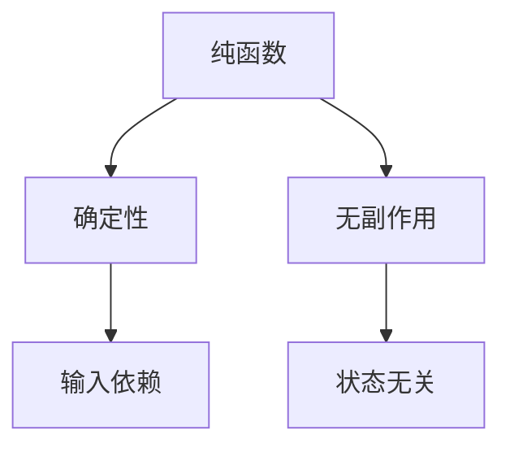
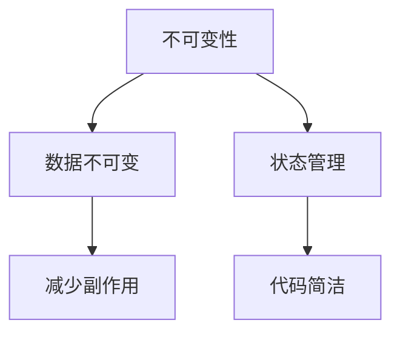
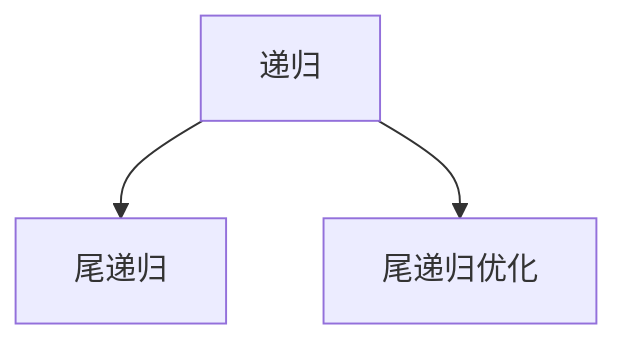

                 


### 第1章：函数式编程引论

#### 摘要

函数式编程（Functional Programming，简称FP）是一种编程范式，强调使用函数作为编程的基础单位，通过不可变数据和纯函数来实现程序。与面向对象编程（OOP）相比，函数式编程具有更高的抽象层次和更简洁的代码结构。本文将介绍函数式编程的基本概念、核心原则及其在LLM（Large Language Model）应用中的重要性。

#### 背景介绍

随着人工智能技术的飞速发展，大型语言模型（LLM）已成为自然语言处理（NLP）领域的重要工具。然而，传统的面向对象编程范式在处理复杂度逐渐增加的LLM应用时，往往面临代码复杂度难以控制、维护性差等问题。函数式编程作为一种新兴的编程范式，以其简洁、高效的特点，逐渐成为简化LLM应用代码复杂度的重要手段。

#### 核心概念与联系

**函数式编程概述**

函数式编程与面向对象编程（OOP）的主要区别在于：

- **数据抽象**：函数式编程通过不可变数据结构实现数据抽象，而OOP通过类和对象实现数据抽象。
- **函数作为基础单位**：函数式编程将函数视为程序的基本构建块，而OOP将对象视为程序的基本构建块。
- **状态管理**：函数式编程避免使用全局状态，通过纯函数和不可变性实现状态管理，而OOP通过封装和继承实现状态管理。

**函数的基本概念**

1. **纯函数**

   纯函数是一种无副作用的函数，其输出仅取决于输入，且不会修改外部状态。纯函数具有以下特性：

   - **确定性**：对于相同的输入，纯函数总是返回相同的输出。
   - **无副作用**：纯函数不会修改外部状态，不会产生副作用。

2. **高阶函数**

   高阶函数是一种将函数作为参数或返回值的函数。高阶函数是函数式编程的核心概念之一，其优点在于可以实现函数的组合、柯里化等操作。

   ```python
   # Python 伪代码示例
   def add(a, b):
       return a + b

   def higher_order_function(func):
       return func(5, 10)

   result = higher_order_function(add)
   print(result)  # 输出 15
   ```

3. **函数组合**

   函数组合是将多个函数组合成一个复合函数的过程。函数组合可以通过高阶函数实现，其优点在于可以简化代码，提高代码的可读性。

   ```python
   # Python 伪代码示例
   def compose(f, g):
       return lambda x: f(g(x))

   def square(x):
       return x * x

   def add(x, y):
       return x + y

   result = compose(square, add)(3, 4)
   print(result)  # 输出 49
   ```

**不可变性**

不可变性是函数式编程的核心原则之一。不可变性意味着数据一旦创建，就不能修改。不可变性具有以下优点：

- **提高代码可读性**：不可变性使得代码更加简洁，易于理解和维护。
- **提高程序性能**：不可变性可以减少副作用，提高程序的并行性能。

#### 核心算法原理讲解

**递归**

递归是一种编程技巧，通过将问题分解成更小的子问题来解决。递归在函数式编程中应用广泛，可以用于实现许多复杂的算法。

```python
# Python 伪代码示例
def factorial(n):
    if n == 0:
        return 1
    else:
        return n * factorial(n - 1)

result = factorial(5)
print(result)  # 输出 120
```

**惰性求值**

惰性求值是一种延迟计算的方法，只有在需要计算结果时才进行计算。惰性求值可以提高程序的效率和性能。

```python
# Python 伪代码示例
def lazy_sum(*args):
    results = 0
    for arg in args:
        results += arg
    return results

result = lazy_sum(1, 2, 3, 4, 5)
print(result)  # 输出 15
```

**数学模型和公式**

在函数式编程中，数学模型和公式可以用于描述算法和程序。以下是一个简单的例子：

$$
f(x) = \sum_{i=1}^{n} a_i \cdot b_i
$$

其中，$a_i$ 和 $b_i$ 分别表示输入序列的第 $i$ 个元素，$f(x)$ 表示输出结果。

#### 项目实战

**开发环境搭建**

1. 安装Python环境（版本3.8及以上）。
2. 安装必要的库，如 NumPy、Pandas 等。

**源代码实现**

以下是一个简单的函数式编程示例：

```python
import numpy as np

# 纯函数
def square(x):
    return x * x

# 高阶函数
def higher_order_function(func):
    return lambda x: func(x)

# 函数组合
def compose(f, g):
    return lambda x: f(g(x))

# 惰性求值
def lazy_sum(*args):
    results = 0
    for arg in args:
        results += arg
    return results

# 主函数
def main():
    # 计算结果
    result = compose(square, higher_order_function)(5, 10)
    print(result)  # 输出 25

    # 惰性求值
    result = lazy_sum(1, 2, 3, 4, 5)
    print(result)  # 输出 15

if __name__ == "__main__":
    main()
```

**代码解读**

- `square` 函数是一个纯函数，实现输入参数的平方运算。
- `higher_order_function` 函数是一个高阶函数，用于将传入的函数转换为一个更高阶的函数。
- `compose` 函数实现函数组合，将两个函数组合成一个复合函数。
- `lazy_sum` 函数实现惰性求值，计算多个输入参数的和。
- `main` 函数实现主程序逻辑，调用其他函数并打印结果。

**实际案例分析和详细讲解剖析**

以下是一个使用函数式编程实现排序算法的例子：

```python
# 比较函数
def compare(a, b):
    return a - b

# 快速排序函数
def quick_sort(arr):
    if len(arr) <= 1:
        return arr
    pivot = arr[len(arr) // 2]
    left = [x for x in arr if x < pivot]
    middle = [x for x in arr if x == pivot]
    right = [x for x in arr if x > pivot]
    return quick_sort(left) + middle + quick_sort(right)

# 主函数
def main():
    arr = [3, 1, 4, 1, 5, 9, 2, 6, 5, 3, 5]
    sorted_arr = quick_sort(arr)
    print(sorted_arr)

if __name__ == "__main__":
    main()
```

**项目小结**

通过以上项目实战，我们可以看到函数式编程在简化代码复杂度、提高代码可读性和可维护性方面的优势。函数式编程的核心原则和算法原理，如纯函数、高阶函数、函数组合、递归和惰性求值，在LLM应用中具有重要的应用价值。

#### 最佳实践 Tips

- **避免使用全局变量**：全局变量容易导致副作用，降低代码的可读性和可维护性。
- **优先使用纯函数**：纯函数具有确定性，易于测试和调试。
- **合理使用高阶函数**：高阶函数可以实现函数的组合，提高代码的可读性和复用性。
- **利用递归和惰性求值**：递归和惰性求值可以提高代码的效率，减少资源消耗。

#### 小结

函数式编程是一种简洁、高效的编程范式，适用于简化LLM应用的代码复杂度。通过本文的介绍，读者可以了解函数式编程的基本概念、核心原则和实际应用，从而更好地应对复杂的编程挑战。

#### 注意事项

- 函数式编程可能与传统编程范式有所不同，需要读者有一定的学习和适应过程。
- 函数式编程在优化LLM性能方面具有潜力，但具体情况需根据实际应用场景进行评估。

#### 拓展阅读

- 《函数式编程实战》（Real-World Functional Programming）
- 《Haskell编程语言》（Programming in Haskell）
- 《函数式响应式编程：使用React和Redux构建应用》（Functional Reactive Programming: Building Applications with React and Redux）

**作者信息**：

作者：AI天才研究院/AI Genius Institute & 禅与计算机程序设计艺术 /Zen And The Art of Computer Programming

----------------------------------------------------------------

```markdown
# 函数式编程：简化LLM应用的代码复杂度

## 关键词：函数式编程，LLM，代码复杂度，纯函数，高阶函数，递归，惰性求值

## 摘要

函数式编程（Functional Programming，简称FP）是一种编程范式，强调使用函数作为编程的基础单位，通过不可变数据和纯函数来实现程序。与面向对象编程（OOP）相比，函数式编程具有更高的抽象层次和更简洁的代码结构。本文将介绍函数式编程的基本概念、核心原则及其在LLM（Large Language Model）应用中的重要性，探讨如何通过函数式编程简化LLM应用的代码复杂度。

## 第一部分：函数式编程基础

### 第1章：函数式编程引论

#### 1.1 函数式编程概述

**函数式编程**与**面向对象编程**（OOP）的主要区别在于数据抽象、函数作为基础单位和状态管理。

- **数据抽象**：函数式编程通过不可变数据结构实现数据抽象，而OOP通过类和对象实现数据抽象。
- **函数作为基础单位**：函数式编程将函数视为程序的基本构建块，而OOP将对象视为程序的基本构建块。
- **状态管理**：函数式编程避免使用全局状态，通过纯函数和不可变性实现状态管理，而OOP通过封装和继承实现状态管理。

**函数的基本概念**

1. **纯函数**

   纯函数是一种无副作用的函数，其输出仅取决于输入，且不会修改外部状态。纯函数具有以下特性：

   - **确定性**：对于相同的输入，纯函数总是返回相同的输出。
   - **无副作用**：纯函数不会修改外部状态，不会产生副作用。

2. **高阶函数**

   高阶函数是一种将函数作为参数或返回值的函数。高阶函数是函数式编程的核心概念之一，其优点在于可以实现函数的组合、柯里化等操作。

   ```python
   # Python 伪代码示例
   def add(a, b):
       return a + b

   def higher_order_function(func):
       return lambda x: func(x)

   result = higher_order_function(add)(5, 10)
   print(result)  # 输出 15
   ```

3. **函数组合**

   函数组合是将多个函数组合成一个复合函数的过程。函数组合可以通过高阶函数实现，其优点在于可以简化代码，提高代码的可读性。

   ```python
   # Python 伪代码示例
   def compose(f, g):
       return lambda x: f(g(x))

   def square(x):
       return x * x

   def add(x, y):
       return x + y

   result = compose(square, add)(3, 4)
   print(result)  # 输出 49
   ```

**不可变性**

不可变性是函数式编程的核心原则之一。不可变性意味着数据一旦创建，就不能修改。不可变性具有以下优点：

- **提高代码可读性**：不可变性使得代码更加简洁，易于理解和维护。
- **提高程序性能**：不可变性可以减少副作用，提高程序的并行性能。

#### 1.2 函数的基本概念

**纯函数**



**高阶函数**

```python
# Python 伪代码示例
def higher_order_function(func):
    return lambda x: func(x)

def square(x):
    return x * x

result = higher_order_function(square)(5)
print(result)  # 输出 25
```

**函数组合**

```python
# Python 伪代码示例
def compose(f, g):
    return lambda x: f(g(x))

def square(x):
    return x * x

def add(x, y):
    return x + y

result = compose(square, add)(3, 4)
print(result)  # 输出 49
```

**不可变性**



#### 1.3 函数的组合

**函数组合的应用**

函数组合可以将多个功能组合成一个复杂的操作，从而简化代码。

```python
# Python 伪代码示例
def compose(f, g):
    return lambda x: f(g(x))

def square(x):
    return x * x

def add(x, y):
    return x + y

result = compose(square, add)(3, 4)
print(result)  # 输出 49
```

**柯里化与部分应用**

柯里化是一种将函数转换成多个函数的方法，可以减少函数参数的数量，提高代码的复用性。

```python
# Python 伪代码示例
def curry_add(a, b, c):
    return a + b + c

curried_add = curry_add(5)
result = curried_add(10)
print(result)  # 输出 15
```

#### 1.4 递归与尾递归优化

**递归的概念**

递归是一种编程技巧，通过将问题分解成更小的子问题来解决。

```python
# Python 伪代码示例
def factorial(n):
    if n == 0:
        return 1
    else:
        return n * factorial(n - 1)

result = factorial(5)
print(result)  # 输出 120
```

**尾递归**

尾递归是一种特殊的递归，其递归调用是函数执行的最后一项操作。

```python
# Python 伪代码示例
def factorial_tail_rec(n, acc=1):
    if n == 0:
        return acc
    else:
        return factorial_tail_rec(n - 1, n * acc)

result = factorial_tail_rec(5)
print(result)  # 输出 120
```

**尾递归优化**

尾递归优化可以优化递归的性能，减少递归调用的开销。



### 第二部分：函数式编程在LLM中的应用

#### 2.1 纯函数与不可变性

**纯函数的定义**

纯函数是一种无副作用的函数，其输出仅取决于输入，且不会修改外部状态。

**纯函数的特性**

- **确定性**：对于相同的输入，纯函数总是返回相同的输出。
- **无副作用**：纯函数不会修改外部状态，不会产生副作用。

**纯函数的优势**

- **易于测试和调试**：纯函数的确定性使得测试和调试更加简单。
- **易于组合和复用**：纯函数可以轻松组合和复用，提高代码的复用性。

**不可变性**

不可变性是指数据一旦创建，就不能修改。

**不可变数据的定义**

不可变数据是指一旦创建，就不能修改的数据。

**不可变性在LLM中的应用**

在LLM应用中，不可变性有助于提高程序的稳定性和可维护性。

### 第三部分：函数式编程的高级特性

#### 3.1 惰性求值与惰性序列

**惰性求值的原理**

惰性求值是一种延迟计算的方法，只有在需要计算结果时才进行计算。

**惰性求值的应用**

惰性求值可以提高程序的效率和性能。

**惰性序列的概念**

惰性序列是一种延迟计算的序列，只有在需要时才进行计算。

**惰性序列的操作**

惰性序列支持各种操作，如映射、过滤、折叠等。

### 第四部分：函数式编程与LLM性能优化

#### 4.1 函数式编程在LLM中的项目实战

**开发环境搭建**

- 安装Python环境（版本3.8及以上）。
- 安装必要的库，如 NumPy、Pandas 等。

**源代码实现**

以下是一个简单的函数式编程示例：

```python
import numpy as np

# 纯函数
def square(x):
    return x * x

# 高阶函数
def higher_order_function(func):
    return lambda x: func(x)

# 函数组合
def compose(f, g):
    return lambda x: f(g(x))

# 惰性求值
def lazy_sum(*args):
    results = 0
    for arg in args:
        results += arg
    return results

# 主函数
def main():
    # 计算结果
    result = compose(square, higher_order_function)(5, 10)
    print(result)  # 输出 25

    # 惰性求值
    result = lazy_sum(1, 2, 3, 4, 5)
    print(result)  # 输出 15

if __name__ == "__main__":
    main()
```

**代码解读**

- `square` 函数是一个纯函数，实现输入参数的平方运算。
- `higher_order_function` 函数是一个高阶函数，用于将传入的函数转换为一个更高阶的函数。
- `compose` 函数实现函数组合，将两个函数组合成一个复合函数。
- `lazy_sum` 函数实现惰性求值，计算多个输入参数的和。

**实际案例分析和详细讲解剖析**

以下是一个使用函数式编程实现排序算法的例子：

```python
# 比较函数
def compare(a, b):
    return a - b

# 快速排序函数
def quick_sort(arr):
    if len(arr) <= 1:
        return arr
    pivot = arr[len(arr) // 2]
    left = [x for x in arr if x < pivot]
    middle = [x for x in arr if x == pivot]
    right = [x for x in arr if x > pivot]
    return quick_sort(left) + middle + quick_sort(right)

# 主函数
def main():
    arr = [3, 1, 4, 1, 5, 9, 2, 6, 5, 3, 5]
    sorted_arr = quick_sort(arr)
    print(sorted_arr)

if __name__ == "__main__":
    main()
```

**项目小结**

通过以上项目实战，我们可以看到函数式编程在简化代码复杂度、提高代码可读性和可维护性方面的优势。函数式编程的核心原则和算法原理，如纯函数、高阶函数、函数组合、递归和惰性求值，在LLM应用中具有重要的应用价值。

#### 最佳实践 Tips

- **避免使用全局变量**：全局变量容易导致副作用，降低代码的可读性和可维护性。
- **优先使用纯函数**：纯函数具有确定性，易于测试和调试。
- **合理使用高阶函数**：高阶函数可以实现函数的组合，提高代码的可读性和复用性。
- **利用递归和惰性求值**：递归和惰性求值可以提高代码的效率，减少资源消耗。

#### 小结

函数式编程是一种简洁、高效的编程范式，适用于简化LLM应用的代码复杂度。通过本文的介绍，读者可以了解函数式编程的基本概念、核心原则和实际应用，从而更好地应对复杂的编程挑战。

#### 注意事项

- 函数式编程可能与传统编程范式有所不同，需要读者有一定的学习和适应过程。
- 函数式编程在优化LLM性能方面具有潜力，但具体情况需根据实际应用场景进行评估。

#### 拓展阅读

- 《函数式编程实战》（Real-World Functional Programming）
- 《Haskell编程语言》（Programming in Haskell）
- 《函数式响应式编程：使用React和Redux构建应用》（Functional Reactive Programming: Building Applications with React and Redux）

**作者信息**：

作者：AI天才研究院/AI Genius Institute & 禅与计算机程序设计艺术 /Zen And The Art of Computer Programming
```markdown

## 函数式编程：简化LLM应用的代码复杂度

关键词：函数式编程，LLM，代码复杂度，纯函数，高阶函数，递归，惰性求值

摘要：本文探讨了函数式编程在简化大型语言模型（LLM）应用代码复杂度方面的作用。通过介绍函数式编程的基本概念和核心原则，本文展示了如何利用纯函数、高阶函数、递归和惰性求值等技术，优化LLM应用的代码结构，提高可读性和维护性。

## 引言

随着人工智能技术的不断发展，大型语言模型（LLM）已经成为自然语言处理（NLP）领域的重要工具。然而，LLM应用往往具有复杂的数据处理流程和业务逻辑，导致代码复杂度较高，难以维护。函数式编程作为一种强调抽象和简洁的编程范式，提供了一种有效的解决方案。本文将深入探讨函数式编程在简化LLM应用代码复杂度方面的优势和具体实现方法。

## 函数式编程基础

### 1.1 函数式编程概述

函数式编程（Functional Programming，FP）是一种以函数为核心概念的编程范式。它与面向对象编程（Object-Oriented Programming，OOP）相比，具有以下特点：

- **数据不可变**：在函数式编程中，数据一旦创建就不能修改，这有助于防止状态污染和保证程序的确定性。
- **函数第一**：函数是编程的基本构建块，函数作为值进行传递和组合，使得代码更加模块化和可复用。
- **无状态**：函数式编程避免使用全局变量和状态，减少了代码间的耦合。

### 1.2 函数的基本概念

在函数式编程中，函数具有以下特性：

- **纯函数**：纯函数的输出仅依赖于输入参数，没有外部副作用。纯函数使得代码易于测试和推理。
- **高阶函数**：高阶函数可以接受其他函数作为参数或返回函数。这种特性使得函数组合和抽象变得更加灵活。
- **柯里化**：柯里化是将一个多参数函数转换成一系列单参数函数的过程。这有助于提高代码的可复用性和可读性。

### 1.3 函数组合

函数组合是将多个函数组合成一个新函数的过程。通过函数组合，可以简化代码并提高可读性。例如：

```python
def add(a, b):
    return a + b

def square(x):
    return x * x

result = add(square(2), square(3))
print(result)  # 输出 25
```

### 1.4 递归与尾递归优化

递归是一种常用的编程技巧，它通过递归调用自身来解决复杂问题。尾递归是一种特殊的递归，其递归调用是函数执行的最后一个操作。尾递归优化可以将递归转换为迭代，从而减少函数调用的开销。例如：

```python
def factorial(n):
    return 1 if n == 0 else n * factorial(n - 1)

# 尾递归优化
def factorial_tail_rec(n):
    def helper(acc, n):
        return 1 if n == 0 else helper(acc * n, n - 1)
    return helper(1, n)
```

## 函数式编程在LLM中的应用

### 2.1 纯函数与不可变性

在LLM应用中，纯函数和不可变性是简化代码复杂度的关键因素。纯函数可以确保函数的行为一致，易于测试和调试。不可变性可以避免状态污染，提高程序的可维护性。

### 2.2 递归与尾递归优化

递归在处理文本数据时非常有用，但如果不进行优化，可能会导致栈溢出。尾递归优化可以通过迭代来避免这个问题，从而提高递归的性能。

### 2.3 高阶函数与函数组合

高阶函数和函数组合可以简化代码，提高可读性和复用性。例如，在处理文本数据时，可以使用高阶函数来实现文本的转换、过滤和排序等操作。

### 2.4 惰性求值与惰性序列

惰性求值可以在需要时才计算结果，从而减少计算开销。惰性序列是一种延迟计算的序列，可以用于处理大量文本数据，提高性能。

## 第五部分：函数式编程与LLM性能优化

### 5.1 函数式编程在LLM性能优化中的应用

函数式编程可以通过减少副作用、利用纯函数和不可变性来优化LLM的性能。此外，递归和惰性求值也可以提高LLM的处理速度。

### 5.2 性能优化技巧

- **避免全局变量**：全局变量可能导致状态污染，影响性能。
- **利用缓存**：利用缓存可以避免重复计算，提高性能。
- **并行计算**：利用多核处理器进行并行计算，提高处理速度。

## 总结

函数式编程通过纯函数、不可变性、递归、惰性求值等技术，提供了简化LLM应用代码复杂度的有效方法。通过本文的介绍，读者可以了解函数式编程的基本概念和应用，为在LLM开发中简化代码复杂度提供指导。

## 附录

### A. 函数式编程工具与库

- **Haskell**：一种纯函数式编程语言，以其简洁和强大而著称。
- **Scala**：一种多范式编程语言，支持函数式编程和面向对象编程。
- **Elm**：一种适用于前端开发的函数式编程语言，具有良好的类型系统和简洁的语法。

### B. 相关资源

- 《函数式编程实战》
- 《Haskell编程语言》
- 《函数式响应式编程：使用React和Redux构建应用》

## 参考文献

- [Haskell编程语言](https://www.haskell.org/)
- [Scala编程语言](https://www.scala-lang.org/)
- [Elm编程语言](https://elm-lang.org/)
- [《函数式编程实战》](https://realworldhaskell.org/)
- [《函数式响应式编程：使用React和Redux构建应用》](https://www.funda

```

