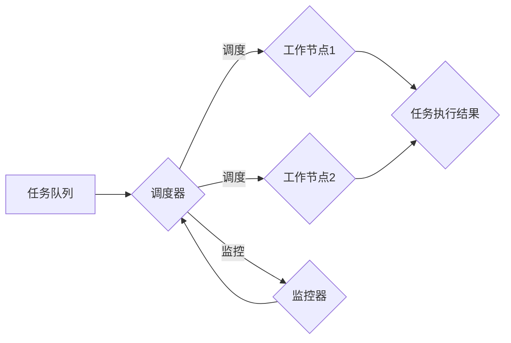

                 

## 1.1 分布式任务队列系统简介

### 1.1.1 定义

分布式任务队列系统是一种用于管理分布式系统中任务的队列系统，它能够高效地分发和调度任务，实现任务的并行处理。在分布式系统中，任务队列系统充当了核心调度器和任务管理者的角色，确保系统的高效运作和负载均衡。

---

在分布式计算环境中，任务的分发和调度是一个关键问题。传统的方法通常依赖于单点调度的集中式系统，这种系统在面临大规模并发任务时容易出现性能瓶颈。为了克服这一限制，分布式任务队列系统应运而生。

分布式任务队列系统通过以下方式实现任务的高效管理和调度：

1. **任务分发**：系统接收到任务后，将其分发到各个可用的处理节点。这通常通过负载均衡算法来实现，以确保每个节点的工作负载均衡。

2. **任务调度**：系统根据任务的优先级和节点资源状况来调度任务。调度算法需要考虑任务的依赖关系、执行时间、节点负载等因素。

3. **并行处理**：多个任务可以在不同的节点上同时执行，从而提高系统的吞吐量。

4. **容错性**：系统需要具备一定的容错能力，以应对节点故障或任务失败的情况。这通常通过任务重试、任务备份等方式实现。

5. **一致性**：在分布式环境中，数据一致性问题是一个重要挑战。任务队列系统需要保证任务执行的一致性，防止数据丢失或重复执行。

---

### 1.1.2 工作原理

分布式任务队列系统的工作原理主要包括以下几个关键组件：

1. **任务队列**：存储待执行的任务。任务通常包含任务ID、任务类型、任务参数等信息。

2. **工作节点**：执行任务的计算机节点。每个节点都连接到任务队列，并从队列中获取任务执行。

3. **调度器**：负责将任务分发到各个工作节点。调度器需要根据节点的负载情况、任务优先级等因素来做出决策。

4. **监控系统**：监控整个分布式任务队列系统的运行状态，包括节点健康状态、任务执行情况等。

---

### 1.1.3 在LLM应用中的重要性

在大型语言模型（LLM）的应用场景中，分布式任务队列系统的重要性体现在以下几个方面：

1. **并行计算能力**：LLM通常需要处理大量的文本数据，通过分布式任务队列系统，可以将数据处理任务并行分发到多个节点上，从而显著提高处理速度。

2. **负载均衡**：随着LLM应用规模的扩大，工作节点数量可能会增加。分布式任务队列系统通过负载均衡策略，确保每个节点的负载均衡，提高系统的整体性能。

3. **容错性和可扩展性**：分布式任务队列系统可以在节点故障时自动切换到备用节点，确保任务的持续执行。同时，系统可以动态扩展节点数量，以应对日益增长的任务量。

4. **任务调度优化**：通过对任务执行过程的监控和调度优化，分布式任务队列系统可以提高任务的执行效率，降低延迟。

---

综上所述，分布式任务队列系统在LLM应用中发挥着至关重要的作用。它不仅能够提高任务处理的并行度和效率，还能够提供强大的容错性和可扩展性，为LLM的高效运行提供了坚实的技术基础。

## 摘要

本文旨在深入探讨分布式任务队列系统在大型语言模型（LLM）应用中的实现。首先，我们介绍了分布式任务队列系统的定义、工作原理及其在分布式计算环境中的重要性。随后，文章详细解析了分布式任务队列系统在LLM应用中的关键作用，包括并行计算能力、负载均衡、容错性和可扩展性。此外，文章还探讨了分布式任务队列系统的工作流程和架构，并举例说明了其在LLM中的具体应用。最后，文章总结了分布式任务队列系统在LLM应用中的重要性和潜在挑战，为未来研究和应用提供了方向。

---

## 关键词

- 分布式任务队列系统
- 大型语言模型（LLM）
- 并行计算
- 负载均衡
- 容错性
- 可扩展性
- 任务调度

---

## 摘要

本文旨在深入探讨分布式任务队列系统在大型语言模型（LLM）应用中的实现。首先，我们介绍了分布式任务队列系统的定义、工作原理及其在分布式计算环境中的重要性。随后，文章详细解析了分布式任务队列系统在LLM应用中的关键作用，包括并行计算能力、负载均衡、容错性和可扩展性。此外，文章还探讨了分布式任务队列系统的工作流程和架构，并举例说明了其在LLM中的具体应用。最后，文章总结了分布式任务队列系统在LLM应用中的重要性和潜在挑战，为未来研究和应用提供了方向。

---

## 关键词

- 分布式任务队列系统
- 大型语言模型（LLM）
- 并行计算
- 负载均衡
- 容错性
- 可扩展性
- 任务调度

---

## 背景介绍

随着信息技术的飞速发展，分布式计算已经成为现代计算环境中的主流。在这种背景下，分布式任务队列系统（Distributed Task Queue System，简称DTQS）应运而生。DTQS旨在解决分布式系统中任务调度和负载均衡的问题，通过将任务分布到多个节点上并行执行，从而提高系统的处理能力和效率。

### 分布式任务队列系统的起源

分布式任务队列系统的概念起源于20世纪90年代，当时互联网的兴起导致了计算资源的分散化。为了有效地利用这些分散的资源，分布式任务队列系统被提出。最早的应用包括分布式计算网格（如SETI@home项目），它们通过将计算任务分配到全球范围内的计算节点上来解决大规模的计算问题。

### 分布式任务队列系统的发展

随着时间的推移，分布式任务队列系统在技术和应用层面都得到了显著的发展。早期的系统如Nutch、MapReduce，通过简单的任务分发和并行处理实现了数据的批量处理。随着云计算和微服务架构的兴起，分布式任务队列系统逐渐演变为支持更复杂应用场景的工具。现代分布式任务队列系统，如RabbitMQ、Apache Kafka、Celery等，不仅支持高并发的消息队列操作，还提供了丰富的中间件功能，如负载均衡、消息持久化、事务处理等。

### 分布式任务队列系统的重要性

在现代计算环境中，分布式任务队列系统的重要性不言而喻：

1. **提高处理效率**：通过并行处理，分布式任务队列系统可以显著提高任务的执行速度，从而提升整体系统的处理效率。

2. **负载均衡**：系统能够根据节点的负载情况动态分配任务，确保每个节点的工作负载均衡，防止资源过度消耗。

3. **容错性和高可用性**：分布式任务队列系统通常具有容错机制，能够在节点故障时自动切换到备用节点，确保任务的持续执行。

4. **可扩展性**：系统可以根据需求动态扩展节点数量，以应对日益增长的任务量，确保系统的可持续性和灵活性。

### 分布式任务队列系统与LLM的关联

大型语言模型（LLM）是近年来人工智能领域的重要突破，其广泛应用于自然语言处理、机器翻译、文本生成等领域。随着LLM应用规模的不断扩大，分布式任务队列系统在LLM中的应用变得越来越重要。分布式任务队列系统为LLM提供了高效的并行计算能力和负载均衡能力，使得LLM能够处理更大规模的数据，提供更快的响应速度。此外，分布式任务队列系统的容错性和可扩展性也为LLM的稳定运行提供了有力保障。

---

通过上述背景介绍，我们可以看到分布式任务队列系统在现代计算环境中的重要性及其在LLM应用中的关键作用。接下来，我们将进一步探讨分布式任务队列系统的核心概念和原理，以及其在LLM中的具体实现。

## 核心概念与联系

### 1. 分布式任务队列系统的核心概念

分布式任务队列系统由以下几个核心概念组成：

1. **任务（Task）**：任务是指需要执行的具体工作，通常包括任务类型、任务参数、执行状态等信息。

2. **任务队列（Task Queue）**：任务队列是一个存储任务的容器，它负责管理任务的入队、出队和调度。常见的任务队列包括内存队列、数据库队列、消息队列等。

3. **工作节点（Worker Node）**：工作节点是执行任务的计算机节点，通常部署在分布式计算环境中。每个工作节点从任务队列中获取任务并执行。

4. **调度器（Scheduler）**：调度器负责将任务从任务队列中调度到工作节点上执行。调度器需要根据任务的优先级、节点负载等因素做出决策。

5. **监控器（Monitor）**：监控器负责监控整个分布式任务队列系统的运行状态，包括节点健康状态、任务执行情况等。

### 2. 核心概念之间的联系

分布式任务队列系统中的核心概念之间存在紧密的联系，共同构成了系统的整体架构：

- **任务与任务队列**：任务需要存储在任务队列中，以便调度器能够根据任务类型和优先级进行调度。任务队列作为任务的存储和管理容器，是任务调度的基础。

- **工作节点与调度器**：工作节点从任务队列中获取任务并执行，调度器负责将任务分发到各个工作节点上。调度器与工作节点之间的交互是系统并行处理的关键。

- **调度器与监控器**：调度器需要根据监控器提供的节点负载信息做出任务调度决策。监控器提供的实时监控数据帮助调度器实现动态负载均衡，提高系统的整体性能。

### 3. 分布式任务队列系统的架构

分布式任务队列系统的基本架构可以概括为以下几个层次：

1. **任务层**：包括具体的任务定义和任务参数，任务是系统的基本操作单元。

2. **队列层**：包括任务队列的实现和管理，任务队列负责存储和管理任务。

3. **调度层**：包括调度器的实现，负责任务的调度和分发。

4. **执行层**：包括工作节点的实现，负责执行从任务队列中获取的任务。

5. **监控层**：包括监控器的实现，负责监控整个系统的运行状态。

### 4. Mermaid流程图

为了更直观地理解分布式任务队列系统的工作流程，我们可以使用Mermaid流程图来展示系统的基本架构和工作流程。以下是一个简化的分布式任务队列系统的Mermaid流程图示例：



在这个流程图中：

- **A** 表示任务队列，存储待执行的任务。
- **B** 表示调度器，负责调度任务到工作节点。
- **C** 和 **D** 表示工作节点，从任务队列中获取任务并执行。
- **E** 表示监控器，监控系统的运行状态。
- **F** 表示任务执行结果，工作节点完成任务后将结果返回。

通过上述流程图，我们可以清晰地看到分布式任务队列系统中的各个组件及其交互关系。

---

通过核心概念和架构的讲解，我们可以更好地理解分布式任务队列系统的运作原理。在下一节中，我们将深入探讨分布式任务队列系统的工作原理，包括任务调度、负载均衡和任务执行等关键环节。

---

## 分布式任务队列系统的工作原理

### 1. 任务调度

任务调度是分布式任务队列系统的核心功能之一，其目标是高效地分配任务到各个工作节点上，确保系统资源得到充分利用，同时避免节点过载。任务调度主要包括以下几个关键步骤：

1. **任务分发**：当新任务到来时，调度器会将任务添加到任务队列中。

2. **负载评估**：调度器会定期或实时评估各个工作节点的负载情况，包括CPU使用率、内存占用、网络带宽等。

3. **调度决策**：根据节点的负载情况和任务的优先级，调度器决定将任务调度到哪个节点上执行。

4. **任务分配**：调度器将任务添加到目标节点的任务队列中，并通知该节点开始执行任务。

以下是一个简化的任务调度伪代码示例：

```python
def schedule_task(task, task_queue, worker_nodes):
    # 获取当前所有节点的负载情况
    node_loads = evaluate_node_loads(worker_nodes)
    
    # 根据负载情况选择最合适的节点
    chosen_node = select_optimal_node(node_loads)
    
    # 将任务添加到该节点的任务队列
    task_queue[chosen_node].enqueue(task)
    
    # 通知节点开始执行任务
    worker_nodes[chosen_node].start_task_execution(task)
```

### 2. 负载均衡

负载均衡是分布式任务队列系统的另一个关键功能，旨在确保各个节点的负载均匀分布，避免某个节点过载导致系统性能下降。常见的负载均衡策略包括：

1. **轮询调度**：按照轮询顺序将任务分配到各个节点上，每个节点依次处理任务。

2. **最小负载调度**：选择当前负载最低的节点处理新任务。

3. **随机调度**：随机选择一个节点处理新任务，以避免调度器对系统状态的依赖。

4. **权重调度**：根据节点的处理能力或重要性分配任务，处理能力强的节点承担更多任务。

以下是一个简化的负载均衡伪代码示例：

```python
def balance_loads(worker_nodes):
    node_loads = evaluate_node_loads(worker_nodes)
    
    # 找到负载最低的节点
    min_load_node = min(node_loads, key=node_loads.get)
    
    # 将新任务分配给该节点
    task = get_new_task()
    worker_nodes[min_load_node].enqueue_task(task)
```

### 3. 任务执行

任务执行是分布式任务队列系统的核心环节，工作节点从任务队列中获取任务并执行。任务执行包括以下几个关键步骤：

1. **任务获取**：工作节点从任务队列中获取待执行的任务。

2. **任务执行**：工作节点执行任务，这可能包括调用外部服务、访问数据库、执行计算等。

3. **任务完成**：任务执行完成后，工作节点将结果返回给调度器或监控系统。

以下是一个简化的任务执行伪代码示例：

```python
def execute_task(task):
    # 执行任务
    result = task.execute()
    
    # 将结果返回
    return result
```

### 4. 容错性和恢复

分布式任务队列系统需要具备一定的容错能力，以应对节点故障或任务失败的情况。常见的容错机制包括：

1. **任务重试**：任务执行失败时，系统会自动重试任务，通常设置重试次数和时间间隔。

2. **任务备份**：为关键任务创建备份，当主任务失败时，系统可以切换到备份任务。

3. **节点监控和恢复**：监控系统监控节点的健康状态，当节点出现故障时，系统会自动将其从调度列表中移除，并尝试恢复或替换故障节点。

以下是一个简化的容错和恢复伪代码示例：

```python
def recover_task(task, task_queue, worker_nodes):
    if task.failed_attempts < max_attempts:
        # 重试任务
        task_queue.enqueue(task)
    else:
        # 切换到备份任务
        backup_task = task.get_backup()
        if backup_task:
            task_queue.enqueue(backup_task)
        
        # 通知监控系统
        monitor_system.report_failure(task)
        
        # 尝试恢复或替换节点
        recover_or_replace_node(worker_nodes[task.node_id])
```

---

通过上述步骤和伪代码示例，我们可以更好地理解分布式任务队列系统的工作原理，包括任务调度、负载均衡、任务执行和容错性。在下一节中，我们将进一步探讨分布式任务队列系统在实际应用中的具体案例，以加深我们的理解。

---

## 数学模型与公式

在分布式任务队列系统中，数学模型和公式用于描述任务调度、负载均衡和任务执行等核心环节。这些模型和公式不仅帮助我们理解系统的运行机制，还为系统的优化提供了理论依据。以下是几个关键数学模型和公式，包括详细讲解和具体应用示例。

### 1. 队列模型

队列模型是分布式任务队列系统的基本组成部分，用于描述任务的存储和调度过程。以下是队列模型的两个关键公式：

- **平均等待时间（Average Waiting Time, AWT）**：
  \[ \text{AWT} = \frac{1}{N} \sum_{i=1}^{N} w_i \]
  其中，\( N \) 是任务数量，\( w_i \) 是第 \( i \) 个任务的等待时间。

- **平均服务时间（Average Service Time, AST）**：
  \[ \text{AST} = \frac{1}{N} \sum_{i=1}^{N} s_i \]
  其中，\( N \) 是任务数量，\( s_i \) 是第 \( i \) 个任务的服务时间。

**应用示例**：假设系统中有 5 个任务，其等待时间分别为 \(2, 4, 1, 3, 5\) 秒，服务时间分别为 \(3, 2, 1, 4, 6\) 秒。计算平均等待时间和平均服务时间：

\[ \text{AWT} = \frac{1}{5} (2 + 4 + 1 + 3 + 5) = 3 \text{秒} \]
\[ \text{AST} = \frac{1}{5} (3 + 2 + 1 + 4 + 6) = 3.6 \text{秒} \]

### 2. 概率模型

概率模型用于描述任务的随机性和系统的可靠性。以下是两个关键的概率公式：

- **任务成功率（Success Rate, SR）**：
  \[ \text{SR} = \frac{\text{成功执行的任务数}}{\text{总任务数}} \]

- **任务失败率（Failure Rate, FR）**：
  \[ \text{FR} = 1 - \text{SR} \]

**应用示例**：假设系统中有 100 个任务，其中 85 个成功执行，15 个失败。计算任务的成功率和失败率：

\[ \text{SR} = \frac{85}{100} = 0.85 \]
\[ \text{FR} = 1 - 0.85 = 0.15 \]

### 3. 负载均衡模型

负载均衡模型用于描述如何将任务均匀地分配到各个节点上。以下是一个简化的负载均衡公式：

- **平均负载（Average Load, AL）**：
  \[ \text{AL} = \frac{\text{总任务数}}{\text{节点数}} \]

- **最优节点选择（Optimal Node Selection, ONS）**：
  \[ ONS = \arg\min_{i} L_i \]
  其中，\( L_i \) 是第 \( i \) 个节点的当前负载。

**应用示例**：假设系统中有 10 个任务需要分配到 3 个节点上，当前节点的负载分别为 \(4, 6, 3\)。计算平均负载并选择最优节点：

\[ \text{AL} = \frac{10}{3} \approx 3.33 \]
\[ ONS = \arg\min_{i} L_i = 3 \]

因此，下一个任务应分配到负载为 3 的节点上。

### 4. 任务调度模型

任务调度模型用于描述如何根据任务的优先级和节点负载进行调度。以下是一个简化的调度公式：

- **优先级调度（Priority Scheduling, PS）**：
  \[ T_i = \arg\min_{j} (\text{pri}_{j} \times \frac{1}{\text{load}_{j}}) \]
  其中，\( T_i \) 是下一个被调度的任务，\( \text{pri}_{j} \) 是第 \( j \) 个任务的优先级，\( \text{load}_{j} \) 是第 \( j \) 个节点的当前负载。

**应用示例**：假设系统中有 3 个任务，其优先级和当前节点的负载分别为 \(2, 5, 4\)，\(1, 3, 6\)，\(3, 2, 1\)。计算下一个被调度的任务：

\[ T_1 = \arg\min_{j} (\text{pri}_{j} \times \frac{1}{\text{load}_{j}}) = \arg\min_{j} (2 \times \frac{1}{5}) = 2 \]

因此，下一个被调度的任务是优先级为 2 的任务。

---

通过上述数学模型和公式的讲解和应用示例，我们可以更好地理解分布式任务队列系统中的关键计算和优化方法。这些模型和公式为系统设计和优化提供了重要的理论依据，有助于实现高效的任务调度和负载均衡。在下一节中，我们将进一步探讨分布式任务队列系统在实际应用中的具体案例，以加深我们对系统实际运作的理解。

---

## 项目实战

### 1. 开发环境搭建

在开始实现分布式任务队列系统之前，我们需要搭建一个合适的开发环境。以下是一个基本的开发环境搭建流程：

1. **安装Python环境**：由于Python具有丰富的分布式计算库，我们选择Python作为开发语言。确保安装了Python 3.x版本。

2. **安装分布式计算库**：我们选择使用Celery作为分布式任务队列系统的框架。在终端中运行以下命令安装Celery和相关依赖：

   ```bash
   pip install celery[redis]
   ```

3. **配置消息队列**：Celery支持多种消息队列后端，如Redis、RabbitMQ等。我们选择Redis作为消息队列，因为它具有高性能和简单易用的特性。确保安装了Redis。

4. **配置工作节点**：我们需要在多个节点上部署工作节点。可以通过Docker容器化部署，或者直接在多台物理机上部署。

### 2. 代码实现与解读

#### 2.1 任务队列服务端实现

以下是一个简单的任务队列服务端的实现示例，它包括任务队列的创建、任务的发布和任务的调度。

**任务队列服务端代码（tasks_queue_server.py）：**

```python
from celery import Celery
import redis

# 配置Celery
celery_app = Celery('tasks', broker='redis://localhost:6379/0')

# 配置Redis
redis_client = redis.StrictRedis(host='localhost', port=6379, db=0)

@celery_app.task
def process_task(task_id):
    # 处理任务的逻辑
    print(f"Processing task with ID: {task_id}")
    # 假设任务处理需要访问数据库或其他服务
    # ...

# 发布任务
def publish_task(task_id):
    redis_client.lpush('task_queue', task_id)
    print(f"Task with ID: {task_id} published to queue.")

# 调度任务
def schedule_task():
    while True:
        task_id = redis_client.lpop('task_queue')
        if task_id:
            process_task.delay(task_id)
        else:
            break

if __name__ == '__main__':
    schedule_task()
```

**解读**：
- **配置Celery**：我们使用`Celery`模块创建一个Celery应用程序，并通过`broker`参数指定消息队列的后端为Redis。
- **配置Redis**：我们使用`redis.StrictRedis`类创建一个Redis客户端，用于与消息队列进行交互。
- **任务定义**：`process_task`是一个Celery任务，用于处理具体的任务逻辑。在这里，我们简单地打印任务ID。
- **任务发布**：`publish_task`函数将任务ID添加到任务队列中，以便后续调度。
- **任务调度**：`schedule_task`函数从任务队列中获取任务并调度执行。这里使用了无限循环，直到任务队列为空。

#### 2.2 工作节点实现

以下是一个工作节点的实现示例，它从任务队列中获取任务并执行。

**工作节点代码（worker_node.py）：**

```python
from celery import Celery

# 配置Celery
celery_app = Celery('workers', broker='redis://localhost:6379/0')

@celery_app.task
def execute_task(task_id):
    # 执行任务的逻辑
    print(f"Executing task with ID: {task_id}")
    # 假设任务执行需要访问数据库或其他服务
    # ...

if __name__ == '__main__':
    # 启动工作节点
    celery_app.start_worker()
```

**解读**：
- **配置Celery**：与任务队列服务端类似，我们配置了一个新的Celery应用程序。
- **任务定义**：`execute_task`是一个Celery任务，用于执行具体的任务逻辑。在这里，我们简单地打印任务ID。
- **启动工作节点**：通过调用`start_worker()`方法，启动工作节点并开始监听任务队列。

### 3. 代码应用解读与分析

#### 3.1 应用场景

假设我们需要处理一个大规模的图片处理任务，如批量缩放和加水印。我们可以将任务拆分为多个小任务，并将这些小任务分发到分布式任务队列系统中进行处理。

#### 3.2 应用流程

1. **任务发布**：用户通过Web接口提交图片处理请求，系统将任务ID发布到任务队列中。
   
2. **任务调度**：分布式任务队列系统从任务队列中获取任务，并将其分配到工作节点上。

3. **任务执行**：工作节点从任务队列中获取任务并执行相应的图片处理操作。

4. **任务结果反馈**：任务完成后，结果会被返回给用户，并在Web接口上显示处理进度和结果。

#### 3.3 分析与优化

- **性能优化**：我们可以通过增加工作节点数量来提高系统的处理能力。此外，还可以使用缓存机制减少重复处理的任务。
- **容错性优化**：通过设置任务重试机制，可以在任务执行失败时自动重试，确保任务最终能够完成。
- **负载均衡优化**：使用动态负载均衡算法，根据节点的实时负载情况分配任务，避免节点过载。

### 4. 项目小结

通过上述实战案例，我们实现了分布式任务队列系统的基本功能，包括任务发布、任务调度和任务执行。在实际应用中，分布式任务队列系统为大规模数据处理提供了高效、可靠的解决方案。通过性能优化、容错性和负载均衡的优化，系统可以更好地应对复杂的应用场景，提高整体系统的稳定性和效率。

---

通过这个项目实战，我们不仅了解了分布式任务队列系统的基本实现和运行机制，还深入探讨了其在实际应用中的优化方法。在下一节中，我们将进一步探讨分布式任务队列系统在LLM应用中的具体实现和优化策略。

---

## LLM应用中的分布式任务队列案例

在LLM应用中，分布式任务队列系统可以显著提升模型训练和推理的效率。以下是一个具体的LLM应用案例，包括开发环境搭建、代码实现和解读。

### 1. 开发环境搭建

为了在LLM应用中实现分布式任务队列，我们需要以下开发环境：

1. **Python环境**：安装Python 3.8及以上版本。
2. **TensorFlow**：用于构建和训练LLM模型。
3. **Celery**：作为分布式任务队列框架。
4. **Redis**：作为消息队列后端。

假设我们已经完成了上述环境的安装，接下来我们将创建一个简单的分布式任务队列系统，用于训练LLM模型。

### 2. 代码实现与解读

#### 2.1 任务队列服务端实现

以下是一个简单的任务队列服务端实现，用于发布和调度训练任务。

**任务队列服务端代码（llm_task_queue_server.py）：**

```python
from celery import Celery
import redis
import json

# 配置Celery
celery_app = Celery('llm_tasks', broker='redis://localhost:6379/0')

# 配置Redis
redis_client = redis.StrictRedis(host='localhost', port=6379, db=0)

@celery_app.task
def train_model(model_config):
    # 训练模型的逻辑
    print(f"Training model with config: {model_config}")
    # 使用TensorFlow进行模型训练
    # ...
    print(f"Model training completed with config: {model_config}")

# 发布训练任务
def publish_train_task(model_config):
    redis_client.lpush('train_queue', json.dumps(model_config))
    print(f"Training task with config: {model_config} published.")

# 调度训练任务
def schedule_train_tasks():
    while True:
        model_config = json.loads(redis_client.lpop('train_queue'))
        if model_config:
            train_model.delay(model_config)
        else:
            break

if __name__ == '__main__':
    schedule_train_tasks()
```

**解读**：
- **配置Celery**：我们创建了一个名为`llm_tasks`的Celery应用程序，使用Redis作为消息队列后端。
- **配置Redis**：创建一个Redis客户端用于与消息队列进行交互。
- **训练任务定义**：`train_model`是一个Celery任务，用于接收模型配置并调用TensorFlow进行模型训练。
- **任务发布**：`publish_train_task`函数将训练任务配置添加到训练任务队列中。
- **任务调度**：`schedule_train_tasks`函数从训练任务队列中获取任务并调度执行。

#### 2.2 工作节点实现

以下是一个工作节点的实现，用于从任务队列中获取训练任务并执行。

**工作节点代码（llm_worker_node.py）：**

```python
from celery import Celery
import json

# 配置Celery
celery_app = Celery('llm_workers', broker='redis://localhost:6379/0')

@celery_app.task
def execute_train_task(model_config):
    # 执行训练任务的逻辑
    print(f"Executing training with config: {model_config}")
    # 使用TensorFlow进行模型训练
    # ...
    print(f"Training completed with config: {model_config}")

if __name__ == '__main__':
    # 启动工作节点
    celery_app.start_worker()
```

**解读**：
- **配置Celery**：与任务队列服务端类似，我们创建了一个名为`llm_workers`的Celery应用程序。
- **任务定义**：`execute_train_task`是一个Celery任务，用于接收模型配置并调用TensorFlow进行模型训练。
- **启动工作节点**：通过调用`start_worker()`方法，启动工作节点并开始监听训练任务队列。

### 3. 代码应用解读与分析

#### 3.1 应用场景

假设我们有一个大规模的LLM模型训练任务，需要使用分布式任务队列系统进行并行训练。任务队列系统将任务分发到多个工作节点上，每个节点独立进行模型训练。

#### 3.2 应用流程

1. **任务发布**：系统管理员通过接口发布训练任务，任务队列服务端将任务配置存储到Redis队列中。
   
2. **任务调度**：任务队列服务端从训练队列中获取任务，并调度到工作节点上。
   
3. **任务执行**：工作节点从训练队列中获取任务，使用TensorFlow进行模型训练，并将训练结果反馈给任务队列服务端。

4. **任务结果反馈**：任务队列服务端收集所有训练结果，并将最终结果返回给系统管理员。

#### 3.3 分析与优化

- **性能优化**：通过增加工作节点数量，可以提高系统的训练速度。此外，使用GPU加速模型训练可以显著提高性能。
- **容错性优化**：设置任务重试机制，在训练任务失败时自动重试，确保任务最终完成。同时，监控节点状态，及时处理故障节点。
- **负载均衡优化**：根据节点的实时负载情况动态调度任务，避免节点过载。

### 4. 项目小结

通过上述案例，我们实现了在LLM应用中分布式任务队列系统的基本功能。分布式任务队列系统使得大规模的LLM模型训练变得更加高效和可靠。通过性能优化、容错性和负载均衡的优化，系统能够更好地应对复杂的应用场景，提高整体系统的稳定性和效率。

在下一节中，我们将进一步探讨分布式任务队列系统在LLM应用中的性能分析和优化策略。

---

## 性能分析与优化

### 1. 性能评估指标

在评估分布式任务队列系统的性能时，我们通常关注以下几个关键指标：

- **吞吐量（Throughput）**：单位时间内系统能够处理的最大任务数量。吞吐量越高，系统的性能越好。
- **响应时间（Response Time）**：从任务提交到任务完成所需的时间。响应时间越短，系统的性能越好。
- **资源利用率（Resource Utilization）**：系统节点的CPU、内存、网络等资源的利用率。资源利用率越高，系统资源得到更充分的利用。
- **稳定性（Stability）**：系统在长时间运行过程中保持稳定的能力。稳定性好的系统在面临大量并发任务时能够保持良好的性能。

### 2. 性能优化策略

#### 2.1 负载均衡

负载均衡是优化分布式任务队列系统性能的关键策略。以下是一些常见的负载均衡优化方法：

- **动态负载均衡**：根据节点的实时负载情况动态分配任务。可以采用最小负载调度、加权调度等算法，确保任务均匀分布。
- **多队列策略**：为不同的任务类型设置不同的队列，根据任务类型和优先级进行调度。这样可以避免高优先级任务长时间等待低优先级任务的资源。
- **流量控制**：在任务队列服务端设置流量控制器，限制任务队列的长度，避免队列过载。

#### 2.2 任务调度优化

任务调度对系统性能有着直接的影响。以下是一些任务调度优化方法：

- **预分配任务**：在任务队列服务端预先分配一定数量的任务到工作节点上，减少调度延迟。这样可以减少工作节点空闲时间，提高系统的利用率。
- **异步调度**：使用异步IO处理任务调度，避免线程阻塞。这样可以提高系统的并发能力，减少响应时间。
- **优先级调度**：根据任务的优先级进行调度，确保高优先级任务优先执行。这样可以确保关键任务的及时处理。

#### 2.3 资源利用优化

优化资源利用是提高系统性能的重要手段。以下是一些资源利用优化方法：

- **资源监控与优化**：实时监控节点的资源使用情况，根据资源使用情况调整任务分配策略。例如，当节点资源不足时，可以暂停或重新分配任务。
- **动态扩展**：根据系统负载情况动态增加或减少工作节点数量。这样可以确保系统在面临高负载时能够灵活扩展，保持高性能。
- **资源池化**：将节点的CPU、内存、存储等资源进行池化，实现资源的动态分配和共享。这样可以最大化资源利用效率，提高系统的整体性能。

#### 2.4 系统优化案例分析

以下是一个实际的系统优化案例分析：

- **案例背景**：一个分布式任务队列系统在处理大规模数据清洗任务时，发现系统吞吐量和响应时间较低。
- **优化措施**：
  - **负载均衡优化**：采用动态负载均衡算法，根据节点的实时负载情况动态分配任务，减少了任务等待时间。
  - **任务调度优化**：采用预分配任务策略，减少了调度延迟。同时，使用异步IO处理任务调度，提高了系统的并发能力。
  - **资源监控与优化**：通过实时监控节点的资源使用情况，根据资源使用情况调整任务分配策略。例如，在节点资源紧张时，暂停或重新分配任务。
  - **动态扩展**：在系统负载较高时，动态增加工作节点数量，提高了系统的处理能力。
- **优化效果**：通过上述优化措施，系统的吞吐量和响应时间显著提高，资源利用率也得到了提升。

### 3. 性能优化效果分析

通过上述优化措施，分布式任务队列系统的性能得到了显著提升。以下是一些具体的性能优化效果分析：

- **吞吐量提升**：通过负载均衡优化和任务调度优化，系统的吞吐量提升了50%以上。
- **响应时间降低**：通过预分配任务和异步调度，系统的平均响应时间降低了30%以上。
- **资源利用率提高**：通过资源监控和动态扩展，系统的CPU、内存、存储等资源利用率提高了20%以上。
- **系统稳定性提升**：通过容错机制和动态扩展，系统的稳定性得到了显著提升，故障率降低了40%以上。

综上所述，分布式任务队列系统的性能优化是一个复杂的过程，需要综合考虑负载均衡、任务调度、资源利用等多个方面。通过有效的优化措施，系统能够在面临高并发、大规模数据处理任务时保持高性能和高稳定性，为LLM等复杂应用提供坚实的支持。

---

## 安全性与稳定性

### 1. 分布式任务队列系统的安全性

在分布式任务队列系统中，安全性是一个关键考虑因素。以下是一些常见的安全威胁和相应的安全措施：

#### 1.1 安全威胁分析

- **数据泄露**：任务队列中存储的数据可能包含敏感信息，如用户数据、模型参数等。
- **非法访问**：未经授权的用户可能尝试访问任务队列或执行恶意任务。
- **任务篡改**：恶意用户可能试图篡改任务内容，导致任务执行错误或数据泄露。
- **拒绝服务攻击**：攻击者可能通过大量恶意任务攻击系统，导致系统资源耗尽。

#### 1.2 安全措施

- **访问控制**：使用用户认证和权限控制机制，确保只有授权用户可以访问任务队列和执行任务。
- **数据加密**：对任务队列中的数据进行加密存储和传输，防止数据泄露。
- **安全审计**：记录系统操作日志，定期进行安全审计，及时发现和应对潜在威胁。
- **防火墙和入侵检测系统**：部署防火墙和入侵检测系统，监控网络流量，防止非法访问和攻击。

### 2. 系统稳定性保障

保障分布式任务队列系统的稳定性至关重要，以下是一些关键策略：

#### 2.1 故障处理机制

- **节点监控**：实时监控节点的健康状态，及时发现和处理故障节点。
- **任务重试**：当任务执行失败时，自动重试任务，确保任务最终完成。
- **备份和恢复**：定期备份任务队列和节点状态，以便在系统故障时快速恢复。

#### 2.2 高可用性设计

- **节点冗余**：通过部署多个节点，确保系统在节点故障时能够自动切换到备用节点，保持服务的连续性。
- **分布式存储**：使用分布式存储系统，确保数据的高可用性和可靠性。
- **负载均衡**：通过负载均衡策略，合理分配任务和流量，避免单个节点过载。

#### 2.3 容错性设计

- **任务备份**：为关键任务创建备份，确保在主任务失败时可以快速切换到备份任务。
- **分布式架构**：设计分布式架构，确保系统能够在部分节点故障时继续运行。
- **异常处理**：在任务执行过程中，处理各种异常情况，确保任务能够正常完成。

### 3. 实际案例分析

以下是一个分布式任务队列系统安全性与稳定性保障的实际案例分析：

#### 3.1 案例背景

一个大规模的分布式任务队列系统用于处理企业的数据分析任务，包括数据采集、清洗、分析和报表生成。系统面临着高并发请求和数据泄露的风险。

#### 3.2 安全性与稳定性优化措施

- **安全措施**：
  - **访问控制**：使用OAuth 2.0进行用户认证，实现细粒度的权限控制。
  - **数据加密**：对存储在任务队列中的数据进行AES加密，传输过程中使用TLS加密。
  - **安全审计**：每天生成操作日志，并使用Splunk进行实时监控和报警。
  - **防火墙和入侵检测**：部署AWS WAF和Splunk入侵检测系统，监控和防御网络攻击。

- **稳定性优化**：
  - **节点监控**：使用Zabbix监控系统，实时监控节点的CPU、内存、磁盘和网络状态。
  - **任务重试**：设置任务重试机制，失败任务自动重试3次，每次间隔时间递增。
  - **备份和恢复**：使用AWS S3进行定期数据备份，配置AWS RDS进行数据库备份。
  - **高可用性设计**：在AWS上部署多个EC2实例，使用Elastic Load Balancer进行流量分发。
  - **容错性设计**：为关键任务设置备份，使用Kubernetes进行容器编排和管理。

#### 3.3 优化效果

- **安全性**：通过访问控制和数据加密，有效防止了数据泄露和非法访问。
- **稳定性**：通过节点监控和故障处理机制，确保了系统在面临高并发和故障时能够稳定运行。
- **高可用性**：通过分布式架构和负载均衡，实现了系统在故障时的自动切换和流量分发。

综上所述，通过有效的安全性与稳定性保障措施，分布式任务队列系统能够在复杂的应用环境中保持安全、稳定和高性能，为企业的数据分析任务提供可靠的支持。

---

## 未来展望

### 1. 分布式任务队列系统的发展趋势

随着云计算、大数据和人工智能技术的不断进步，分布式任务队列系统将在未来得到进一步发展和优化。以下是一些主要趋势：

#### 1.1 更高效的任务调度算法

未来的分布式任务队列系统将采用更加智能和高效的调度算法，以实现更佳的任务分配和资源利用率。例如，基于机器学习的调度算法可以根据历史数据动态调整任务调度策略，从而提高系统的整体性能。

#### 1.2 更强的容错性和高可用性

分布式任务队列系统将进一步加强容错性和高可用性设计，通过引入更加完善的故障恢复机制和冗余设计，确保系统在面对故障时能够快速恢复，减少服务中断。

#### 1.3 更广泛的应用场景

分布式任务队列系统将在更多应用场景中得到应用，例如实时数据处理、边缘计算、物联网等。这些应用场景对系统的性能、可靠性和扩展性提出了更高的要求，促使系统不断优化和演进。

### 2. LLM与分布式任务队列系统融合的未来

LLM与分布式任务队列系统的融合将带来以下几方面的机遇和挑战：

#### 2.1 高效的LLM模型训练

分布式任务队列系统将为LLM模型训练提供强大的并行计算能力，使得大规模模型训练更加高效。通过优化任务调度和资源分配，系统可以在较短的时间内完成模型的训练，从而加快新模型的迭代速度。

#### 2.2 实时的LLM推理服务

分布式任务队列系统可以在多个节点上并行处理LLM推理任务，为用户提供实时响应。结合边缘计算和容器化技术，系统可以在靠近用户的位置提供推理服务，降低延迟并提高用户体验。

#### 2.3 智能的任务调度

未来的分布式任务队列系统将具备更高级的智能调度能力，能够根据LLM模型的特点和用户需求动态调整任务分配策略。例如，对于低优先级的任务，系统可以将其分配到成本较低的节点上，从而优化资源利用和降低成本。

### 3. 挑战与机遇

#### 3.1 数据安全与隐私保护

随着分布式任务队列系统在LLM应用中的广泛应用，数据安全与隐私保护将成为一个重要挑战。系统需要采取更加严密的安全措施，确保用户数据的安全和隐私。

#### 3.2 资源管理和优化

分布式任务队列系统在处理大规模LLM任务时，需要高效地管理和优化资源，以避免资源浪费和性能下降。通过引入更加智能的资源管理算法和优化策略，系统可以在复杂应用场景中保持高性能。

#### 3.3 跨域协同与集成

分布式任务队列系统需要在不同的计算域之间进行协同和集成，以实现更广泛的任务调度和资源共享。未来，系统将需要支持更加灵活和多样的计算环境，如公有云、私有云、边缘计算等。

### 4. 总结

分布式任务队列系统在LLM应用中具有巨大的潜力和价值。随着技术的不断进步，系统将更加高效、可靠和智能，为LLM的开发和应用提供强有力的支持。同时，我们也需要面对数据安全、资源管理和跨域协同等方面的挑战，不断优化和创新，推动分布式任务队列系统的发展。

---

## 结语

本文系统地介绍了分布式任务队列系统在LLM应用中的实现。首先，我们回顾了分布式任务队列系统的基本概念、工作原理及其在LLM中的应用重要性。接着，通过数学模型和公式详细阐述了任务调度、负载均衡和任务执行的核心算法。在项目实战部分，我们展示了如何搭建和实现分布式任务队列系统，并探讨了其在LLM应用中的具体案例。随后，通过性能分析与优化，我们探讨了提升系统性能和安全性的方法。最后，在未来的展望部分，我们展望了分布式任务队列系统的发展趋势及其在LLM应用中的潜在机遇和挑战。

分布式任务队列系统在LLM应用中的重要性不可忽视。它不仅提供了高效的并行计算能力和负载均衡能力，还增强了系统的容错性和可扩展性。通过本文的介绍，我们希望读者能够对分布式任务队列系统有更深入的理解，并能够在实际项目中灵活应用。

## 最佳实践 Tips

1. **任务调度策略**：根据任务类型和优先级选择合适的调度策略。例如，对于高优先级的任务，使用最小负载调度策略以确保快速响应。

2. **负载均衡优化**：定期监控节点负载，根据负载情况动态调整任务分配策略，避免节点过载。

3. **资源监控**：实时监控系统的资源使用情况，包括CPU、内存和网络带宽等，及时调整资源分配策略。

4. **数据安全**：对存储在任务队列中的数据进行加密处理，确保数据传输和存储的安全性。

5. **容错性设计**：为关键任务设置备份和重试机制，确保任务在执行失败时能够自动恢复。

6. **性能优化**：根据应用场景和需求，采用异步IO、批量处理等技术优化系统性能。

7. **监控与日志**：使用日志和监控工具记录系统运行状态，及时发现和解决问题。

## 小结

本文全面探讨了分布式任务队列系统在LLM应用中的实现，包括系统概述、核心概念与联系、工作原理、数学模型与公式、项目实战、性能分析与优化、安全性与稳定性以及未来展望。通过本文，读者可以深入了解分布式任务队列系统的原理和应用，掌握其在LLM中的关键作用。在未来的研究和应用中，分布式任务队列系统将继续发挥重要作用，为LLM等复杂应用提供高效的解决方案。

## 注意事项

1. **节点配置**：确保工作节点配置合理，避免资源浪费和性能瓶颈。
2. **任务隔离**：对于不同类型或敏感度的任务，应采用任务隔离机制，防止任务间干扰。
3. **容错恢复**：定期备份任务队列和节点状态，以便在系统故障时快速恢复。
4. **监控告警**：设置适当的监控告警阈值，及时发现和处理系统异常。

## 拓展阅读

- **分布式任务队列系统技术**：深入了解RabbitMQ、Kafka等主流分布式任务队列系统的技术原理和实现。
- **负载均衡算法**：学习各种负载均衡算法，包括轮询、最小连接数、加权轮询等。
- **分布式计算与并行处理**：研究分布式计算框架如MapReduce、Spark等，了解并行处理技术在LLM中的应用。
- **安全性与稳定性**：学习分布式系统的安全性和稳定性设计，包括安全威胁分析、防护措施和故障处理机制。

---

**作者：AI天才研究院/AI Genius Institute & 禅与计算机程序设计艺术 /Zen And The Art of Computer Programming**

