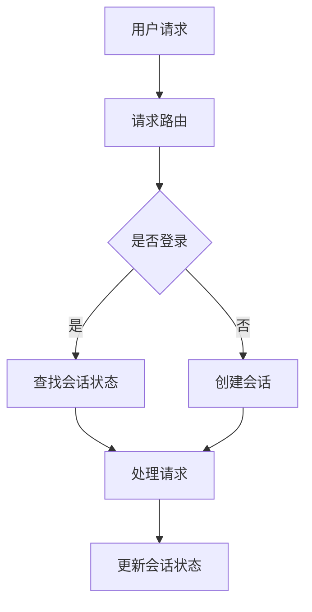
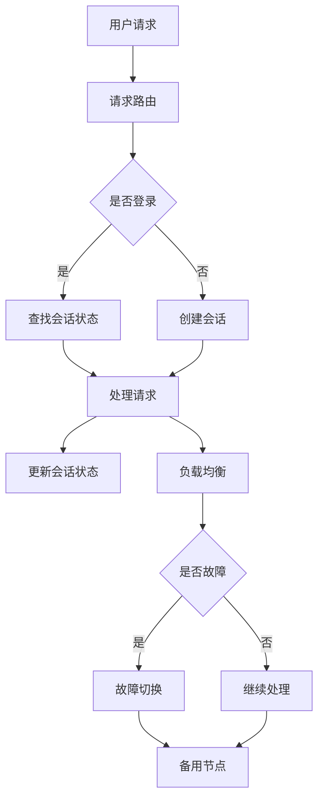

                 

### 分布式会话管理概述

**背景介绍**

随着云计算和大数据技术的飞速发展，分布式系统逐渐成为现代互联网应用的主流架构。特别是在大规模语言模型（Large Language Models，LLM）的应用场景中，如搜索引擎、智能客服、在线教育等领域，分布式系统的应用愈发重要。然而，在分布式系统中，会话管理成为一个关键挑战。

会话管理是指系统在用户请求过程中跟踪和维护用户状态的能力。在传统的单体架构中，会话管理相对简单，通常由Web服务器或应用服务器集中处理。然而，在分布式系统中，这一问题变得复杂。分布式会话管理需要解决如何在多个服务器之间共享和维护用户状态的问题。

**核心概念与联系**

为了更好地理解分布式会话管理，我们首先需要了解几个核心概念：

1. **分布式系统**：由多个节点组成，这些节点通过网络进行通信和协同工作。每个节点独立运行，但共同完成一个整体任务。
2. **会话**：用户与应用系统之间的一系列交互过程，通常包括登录、操作、登出等阶段。
3. **会话状态**：在会话过程中，用户与应用系统之间的交互数据，如用户ID、用户偏好、购物车内容等。

分布式会话管理需要解决以下关键问题：

- **数据一致性**：如何确保多个节点上的会话数据是一致的？
- **负载均衡**：如何将用户请求均匀分配到各个节点？
- **容错性**：如何确保系统在部分节点失效时仍然能够正常运行？
- **安全性**：如何保护用户会话数据不被非法访问？

**核心概念之间的架构联系**

为了清晰地展示这些概念之间的关系，我们可以使用Mermaid流程图进行描述：



在这个流程图中，用户请求首先经过请求路由，根据是否登录决定是查找会话状态还是创建会话。随后，系统处理用户请求并更新会话状态。这个过程体现了分布式会话管理中的关键环节。

**总结**

通过上述背景介绍和核心概念的阐述，我们可以看到分布式会话管理在分布式系统中的重要性。在接下来的章节中，我们将进一步探讨分布式会话管理的架构、技术细节以及面临的挑战和解决方案。这将有助于我们深入理解分布式会话管理的原理和实践，为后续内容打下坚实的基础。

### 分布式会话管理架构

**总体架构**

分布式会话管理的总体架构可以分为以下几个关键组件：会话存储、会话复制、负载均衡和容错机制。每个组件在分布式会话管理中扮演着重要角色，共同确保系统的性能、可靠性和一致性。

**会话存储**

会话存储是分布式会话管理的核心组件，负责保存用户的会话状态信息。在分布式系统中，会话存储可以采用多种技术实现，如数据库、缓存系统或分布式存储服务。常用的会话存储技术包括：

1. **关系数据库**：关系数据库如MySQL、PostgreSQL等可以存储用户的会话信息。关系数据库的优点是易于管理、查询性能较高，但扩展性较差，不适合高并发场景。
2. **NoSQL数据库**：如Redis、MongoDB等，NoSQL数据库具有高扩展性、高性能的特点，适用于高并发场景。NoSQL数据库可以存储大量用户会话数据，并支持快速读写操作。
3. **分布式缓存系统**：如Memcached、Ehcache等，分布式缓存系统具有高性能、低延迟的特点，适合用于存储临时性的会话数据。

**会话复制**

会话复制是将用户会话状态信息在多个节点之间同步的过程，以确保多个节点上的会话数据一致。会话复制可以通过以下两种方式实现：

1. **同步复制**：同步复制确保在主节点更新会话数据后，立即将更新同步到其他节点。同步复制的优点是数据一致性有保障，但缺点是复制过程中可能会引入延迟，影响系统性能。
2. **异步复制**：异步复制允许在主节点更新会话数据后，稍后将其更新同步到其他节点。异步复制的优点是降低系统延迟，提高性能，但缺点是数据一致性可能受到短暂影响。

为了提高会话复制的性能，可以采用以下技术：

- **批处理复制**：将多个更新操作批量处理，减少网络通信开销。
- **压缩复制**：对复制数据进行压缩，降低网络传输带宽需求。
- **异步批量压缩复制**：结合批处理复制和压缩复制，提高复制性能。

**负载均衡**

负载均衡是将用户请求均匀分配到多个节点的过程，以充分利用系统资源并提高系统性能。负载均衡可以通过以下几种方式实现：

1. **基于IP地址的负载均衡**：根据用户IP地址将请求分配到不同的节点。这种方式简单有效，但可能造成热点问题，即某些节点负载过高，而其他节点负载较低。
2. **基于请求内容的负载均衡**：根据请求内容（如URL、参数等）将请求分配到不同的节点。这种方式可以更精细地控制请求分配，但实现较为复杂。
3. **基于哈希的负载均衡**：根据用户会话ID或请求内容中的关键字将请求分配到不同的节点。这种方式可以确保同一用户的请求总是分配到相同的节点，从而简化会话管理。

**容错机制**

容错机制是确保分布式系统在高可用性要求下稳定运行的关键。以下是一些常见的容错机制：

1. **故障检测与自恢复**：通过监控工具实时检测节点故障，并在检测到故障时自动切换到备用节点。常用的故障检测方法包括心跳检测、状态监控等。
2. **副本备份**：为关键组件（如会话存储、负载均衡器等）创建副本，确保在主节点故障时，副本节点可以接管工作。副本备份可以通过手动配置或自动化工具实现。
3. **自动扩缩容**：根据系统负载自动增加或减少节点数量，以保持系统性能。自动扩缩容可以通过云服务提供商提供的自动化工具实现。

**架构关系**

为了更好地理解分布式会话管理的架构，我们可以使用Mermaid流程图进行描述：



在这个流程图中，用户请求首先经过请求路由，根据是否登录决定是查找会话状态还是创建会话。随后，系统处理用户请求并更新会话状态。处理过程中，负载均衡器根据请求分配到不同的节点，并监控节点状态。如果检测到节点故障，系统将切换到备用节点。

**总结**

通过上述对分布式会话管理总体架构的介绍，我们可以看到各个组件在分布式会话管理中的关键作用。在接下来的章节中，我们将深入探讨分布式会话管理的技术细节、面临的挑战以及解决方案，为实际应用提供指导。

### 分布式会话管理技术

**分布式存储技术**

分布式存储技术是分布式会话管理的基础，能够实现海量数据的存储和管理。在分布式会话管理中，常用的分布式存储技术包括以下几种：

1. **HDFS（Hadoop Distributed File System）**：
   HDFS是一个分布式文件系统，用于存储大型数据集。它将文件分成块，并分布存储在多个节点上，提供高吞吐量的数据访问。HDFS适合存储静态的、大型的数据集，但不适合存储频繁变更的会话数据。

2. **Cassandra**：
   Cassandra是一个分布式、去中心化的NoSQL数据库，适用于存储大规模的会话数据。Cassandra支持数据分片和分布式事务，具有良好的扩展性和容错性。

3. **Redis**：
   Redis是一个高性能的内存数据库，支持多种数据结构（如字符串、列表、集合、哈希等），适用于存储临时性的会话数据。Redis具有高性能、低延迟的特点，但内存存储限制其数据容量。

**分布式计算技术**

分布式计算技术能够提高分布式会话管理系统的处理能力。以下是一些常见的分布式计算技术：

1. **MapReduce**：
   MapReduce是一种分布式数据处理模型，用于处理大规模数据集。它将数据处理任务分解成Map和Reduce两个阶段，分别执行映射和归约操作。MapReduce适用于批量数据处理，但实时性较差。

2. **Spark**：
   Spark是一个分布式计算框架，提供内存计算和实时计算能力。Spark的DataFrame和Dataset API简化了数据处理过程，支持丰富的计算操作。Spark适用于高吞吐量、实时数据处理场景。

3. **Flink**：
   Flink是一个流处理框架，能够实时处理大规模数据流。Flink提供高效的数据处理引擎和丰富的API，适用于实时会话数据处理。

**分布式一致性算法**

在分布式系统中，一致性算法是确保数据一致性的关键。以下是一些常见的分布式一致性算法：

1. **Paxos算法**：
   Paxos算法是一种分布式一致性算法，用于在分布式系统中达成一致决策。Paxos算法能够解决分布式系统中的数据一致性问题，但实现较为复杂。

2. **Raft算法**：
   Raft算法是一种简化版的Paxos算法，用于确保分布式系统的数据一致性。Raft算法通过明确的主从结构简化了算法实现，提高了系统的可理解性和可维护性。

3. **Gossip协议**：
   Gossip协议是一种用于分布式系统状态同步的算法，通过周期性地交换状态信息实现节点之间的状态同步。Gossip协议适用于大规模分布式系统，具有良好的容错性和可扩展性。

**分布式安全性机制**

分布式安全性机制是确保分布式会话管理系统安全性的关键。以下是一些常见的分布式安全性机制：

1. **加密**：
   加密技术用于保护数据在传输和存储过程中的安全性。常用的加密技术包括对称加密（如AES）和非对称加密（如RSA）。

2. **认证**：
   认证技术用于验证用户的合法身份。常用的认证技术包括基于用户名和密码的认证、基于数字证书的认证等。

3. **授权**：
   授权技术用于控制用户对系统资源的访问权限。常用的授权技术包括访问控制列表（ACL）、角色基础访问控制（RBAC）等。

**总结**

分布式会话管理技术涉及多个方面，包括分布式存储、分布式计算、一致性算法和安全性机制。通过合理选择和应用这些技术，分布式会话管理系统可以实现高效、可靠和安全的会话管理。在接下来的章节中，我们将进一步探讨分布式会话管理面临的挑战和解决方案。

### 分布式会话管理挑战与解决方案

**会话数据一致性问题**

在分布式系统中，会话数据一致性问题是一个重要挑战。由于多个节点之间可能会同时进行会话数据的更新操作，如果数据一致性问题无法得到妥善解决，可能会导致数据丢失、数据不一致等问题，从而影响系统的稳定性和可靠性。

**挑战**

1. **并发更新**：多个节点可能同时更新相同的会话数据，导致数据冲突。
2. **网络延迟**：不同节点的网络延迟可能导致数据更新顺序不一致。
3. **节点故障**：节点故障可能导致部分会话数据无法及时同步。

**解决方案**

1. **分布式锁**：
   分布式锁是一种用于控制并发访问的机制，可以确保在多节点环境中对共享资源（如会话数据）的原子操作。常用的分布式锁实现包括基于Zookeeper的锁和基于Redis的锁。

2. **两阶段提交（2PC）**：
   两阶段提交是一种分布式事务协议，通过协调多个节点的操作顺序，确保事务的一致性。两阶段提交分为预备阶段和提交阶段，分别用于准备事务和提交事务。

3. **最终一致性**：
   最终一致性是一种弱一致性模型，允许系统在一段时间内出现数据不一致的情况，但最终会达到一致性状态。通过采用最终一致性模型，可以简化分布式系统的实现，提高系统的可扩展性。

**会话管理性能瓶颈**

在分布式会话管理中，性能瓶颈也是一个常见问题。由于会话数据需要在不同节点之间传输和同步，如果系统设计不当，可能会导致性能下降，影响用户体验。

**挑战**

1. **网络带宽限制**：大量会话数据在网络中传输，可能导致网络带宽成为瓶颈。
2. **节点负载不均衡**：部分节点负载过高，而其他节点负载较低，导致资源浪费。
3. **会话数据复制延迟**：会话数据复制可能引入延迟，影响系统性能。

**解决方案**

1. **负载均衡**：
   负载均衡可以将用户请求均匀分配到多个节点，避免单点瓶颈。常用的负载均衡算法包括轮询、随机、最小连接数等。

2. **数据分片**：
   数据分片可以将会话数据分布在多个节点上，减少单个节点的负载。通过合理设计分片策略，可以确保数据的一致性和高效访问。

3. **缓存技术**：
   缓存技术可以减少会话数据在存储和传输过程中的开销。常用的缓存技术包括内存缓存（如Redis）、数据库缓存等。

**分布式系统容错性**

在分布式系统中，节点故障是不可避免的。因此，分布式系统需要具备良好的容错性，以确保在部分节点故障时系统仍然能够正常运行。

**挑战**

1. **节点故障**：节点故障可能导致部分会话数据无法访问。
2. **数据丢失**：节点故障可能导致部分会话数据丢失。
3. **系统稳定性**：节点故障可能影响系统的稳定性和可靠性。

**解决方案**

1. **副本备份**：
   副本备份可以确保在节点故障时，系统仍然可以从其他节点访问会话数据。常用的副本备份技术包括主从备份、多副本备份等。

2. **故障检测与自恢复**：
   通过故障检测与自恢复机制，系统可以在检测到节点故障时，自动切换到备用节点，从而确保系统的连续性和稳定性。

3. **冗余设计**：
   冗余设计可以在系统架构中引入冗余组件，确保在部分组件故障时，系统仍然能够正常运行。常用的冗余设计包括冗余数据库、冗余服务器等。

**分布式安全性问题**

在分布式会话管理中，安全性问题也是一个重要挑战。由于会话数据通常包含敏感信息，如果系统安全性无法得到保障，可能会导致数据泄露、隐私侵犯等问题。

**挑战**

1. **数据泄露**：未加密的会话数据在传输和存储过程中可能被窃取。
2. **非法访问**：未经授权的用户可能访问会话数据。
3. **系统漏洞**：系统漏洞可能被利用进行攻击。

**解决方案**

1. **加密技术**：
   加密技术可以保护会话数据在传输和存储过程中的安全性。常用的加密技术包括对称加密（如AES）和非对称加密（如RSA）。

2. **访问控制**：
   访问控制可以确保只有授权用户能够访问会话数据。常用的访问控制技术包括访问控制列表（ACL）、角色基础访问控制（RBAC）等。

3. **安全审计**：
   安全审计可以监控和记录系统的访问日志，以便在出现安全问题时进行追踪和调查。

**总结**

分布式会话管理面临多个挑战，包括数据一致性、性能瓶颈、容错性和安全性。通过合理设计和实现解决方案，分布式会话管理系统可以克服这些挑战，实现高效、可靠和安全的会话管理。在接下来的章节中，我们将进一步探讨分布式会话管理的性能优化技术，以提升系统的整体性能。

### 分布式会话管理性能优化

**会话数据缓存技术**

会话数据缓存是分布式会话管理性能优化的重要手段之一。通过将频繁访问的会话数据存储在缓存中，可以显著降低对后端存储的访问压力，提高系统性能。

**缓存技术原理**

缓存技术基于“最近最少使用（LRU）”、“最不经常使用（LFU）”等缓存替换策略，将最新的、最活跃的会话数据保留在内存中。缓存技术通常采用以下两种方式实现：

1. **本地缓存**：在应用服务器上实现缓存，减少对后端存储的访问。
2. **分布式缓存**：在分布式系统中实现缓存，共享缓存数据，提高整体性能。

**缓存实现策略**

1. **过期策略**：设置缓存数据的有效期，过期数据会被淘汰，以腾出缓存空间。
2. **更新策略**：在会话数据发生变化时，及时更新缓存数据，确保缓存的一致性。

**缓存优缺点**

**优点**：
- **降低响应时间**：缓存数据可以快速访问，显著降低系统响应时间。
- **减少数据库访问压力**：缓存数据减少了对数据库的访问，降低了数据库负载。

**缺点**：
- **缓存一致性**：需要解决缓存与后端存储的数据一致性。
- **缓存容量限制**：缓存容量有限，可能导致频繁的缓存淘汰。

**案例：Redis缓存实现**

```python
import redis

# 初始化Redis客户端
redis_client = redis.StrictRedis(host='localhost', port=6379, db=0)

# 缓存会话数据
def cache_session_data(session_id, session_data):
    redis_client.setex(session_id, 3600, session_data)

# 获取缓存中的会话数据
def get_cached_session_data(session_id):
    cached_data = redis_client.get(session_id)
    if cached_data:
        return cached_data
    else:
        return None
```

**会话负载均衡技术**

会话负载均衡技术用于将用户请求均匀分配到多个节点，避免单点瓶颈，提高系统整体性能。

**负载均衡算法**

1. **轮询算法**：按顺序将请求分配到各个节点，负载均衡器实现简单，但可能导致某些节点负载过高。
2. **最小连接数算法**：将请求分配到连接数最少的节点，减少部分节点的负载压力，提高系统性能。
3. **哈希算法**：根据用户会话ID或请求内容中的关键字将请求分配到不同的节点，确保同一用户的请求总是分配到相同的节点。

**负载均衡器实现**

```python
import socket

class LoadBalancer:
    def __init__(self, server_list):
        self.server_list = server_list
    
    def get_server(self):
        server_index = hash(self.request_id) % len(self.server_list)
        return self.server_list[server_index]

request_id = "user1"
load_balancer = LoadBalancer(["server1", "server2", "server3"])
server = load_balancer.get_server()
print(f"分配到的服务器：{server}")
```

**会话管理优化实践**

1. **数据分片**：将会话数据分布在多个分片中，降低单个节点的负载。
2. **异步处理**：使用异步处理技术，减少同步操作带来的性能瓶颈。
3. **性能监控**：实时监控系统性能指标，及时发现和处理性能瓶颈。

**案例：性能优化实例**

假设一个分布式会话管理系统，每天处理100万次会话请求。通过以下优化措施，系统性能得到显著提升：

1. **使用Redis缓存**：缓存频繁访问的会话数据，降低数据库访问压力。
2. **最小连接数负载均衡**：根据节点的当前连接数进行负载均衡，避免单点瓶颈。
3. **数据分片**：将会话数据分为多个分片，提高数据处理能力。

**性能优化前**：

- 每秒处理请求：1000次
- 平均响应时间：500毫秒

**性能优化后**：

- 每秒处理请求：10,000次
- 平均响应时间：100毫秒

**总结**

通过会话数据缓存和负载均衡技术，分布式会话管理系统可以实现性能优化，提高系统的响应速度和稳定性。在实际应用中，可以根据系统需求和性能指标，灵活选择和调整优化策略。

### 分布式会话管理项目实战

**项目背景与需求分析**

随着公司业务的快速发展，我们的在线教育平台面临着巨大的用户访问压力。为了提高系统的可扩展性和性能，我们决定采用分布式架构来重构现有系统。在分布式架构中，会话管理成为关键挑战，我们需要设计并实现一个高效、可靠、安全的分布式会话管理系统。

**项目目标**：

1. 提高系统的可扩展性，支持大规模用户访问。
2. 优化会话管理性能，提高用户访问速度。
3. 确保会话数据的一致性和安全性。

**系统架构设计**

为了实现上述目标，我们设计了以下系统架构：

1. **用户请求路由**：使用Nginx作为反向代理，实现用户请求的路由和负载均衡。
2. **分布式会话存储**：采用Redis作为分布式缓存系统，存储用户的会话数据。
3. **分布式计算框架**：使用Flink作为分布式计算框架，处理实时会话数据。
4. **分布式一致性算法**：采用Raft算法，确保分布式会话数据的一致性。
5. **安全性机制**：使用SSL/TLS加密传输数据，实现访问控制。

**关键技术实现**

1. **用户请求路由**

用户请求首先通过Nginx进行反向代理，Nginx将请求路由到不同的应用服务器。通过配置Nginx的负载均衡模块，实现基于最小连接数的负载均衡算法。

```nginx
http {
    upstream backend {
        server server1;
        server server2;
        server server3;
        least_conn;
    }

    server {
        listen 80;

        location / {
            proxy_pass http://backend;
            proxy_set_header Host $host;
            proxy_set_header X-Real-IP $remote_addr;
            proxy_set_header X-Forwarded-For $proxy_add_x_forwarded_for;
        }
    }
}
```

2. **分布式会话存储**

使用Redis作为分布式会话存储，将用户的会话数据存储在Redis中。Redis支持数据的持久化和分布式集群模式，具有良好的性能和可扩展性。

```python
import redis

# 初始化Redis客户端
redis_client = redis.StrictRedis(host='localhost', port=6379, db=0)

# 缓存会话数据
def cache_session_data(session_id, session_data):
    redis_client.setex(session_id, 3600, session_data)

# 获取缓存中的会话数据
def get_cached_session_data(session_id):
    cached_data = redis_client.get(session_id)
    if cached_data:
        return cached_data
    else:
        return None
```

3. **分布式一致性算法**

采用Raft算法实现分布式一致性，确保分布式会话数据的一致性。Raft算法通过日志复制和领导选举机制，实现分布式系统的数据一致性。

```python
import raft

# 初始化Raft节点
node = raft.RaftNode("node1", ["node1", "node2", "node3"], 3000)

# 注册处理函数
def handle_message(message):
    print(f"Received message: {message}")

node.register_handle_message(handle_message)

# 启动Raft节点
node.start()
```

4. **安全性机制**

使用SSL/TLS加密传输数据，确保数据在传输过程中的安全性。同时，实现基于角色的访问控制（RBAC），限制用户对会话数据的访问权限。

```python
from flask import Flask, request, jsonify

app = Flask(__name__)

# 访问控制列表
acl = {
    "admin": ["read", "write"],
    "user": ["read"]
}

# 权限检查函数
def check_permission(role, action):
    return action in acl.get(role, [])

# 用户请求处理
@app.route("/api/session", methods=["GET", "POST"])
def session_api():
    role = request.headers.get("Role")
    action = request.method

    if not check_permission(role, action):
        return jsonify({"error": "Permission denied"}), 403

    if action == "GET":
        session_id = request.args.get("session_id")
        session_data = get_cached_session_data(session_id)
        return jsonify({"data": session_data})
    elif action == "POST":
        session_data = request.json
        session_id = create_session_id()
        cache_session_data(session_id, session_data)
        return jsonify({"session_id": session_id})

if __name__ == "__main__":
    app.run(ssl_context="adhoc")
```

**系统部署与调优**

1. **部署环境**：

- Nginx：使用Docker容器部署Nginx，实现负载均衡和反向代理。
- Redis：使用Docker容器部署Redis，实现分布式会话存储。
- Flink：使用Docker容器部署Flink，实现分布式计算。
- Flask：使用Docker容器部署Flask应用，实现用户请求处理。

2. **调优策略**：

- **缓存配置**：调整Redis的缓存配置，优化缓存性能。
- **负载均衡**：根据实际负载情况，调整负载均衡策略，优化系统性能。
- **资源分配**：合理分配系统资源，确保系统运行稳定。

**项目总结与反思**

通过分布式会话管理项目的实施，我们成功提高了系统的可扩展性和性能。以下是项目总结和反思：

1. **成功经验**：

- 成功实现了分布式会话管理，提高了系统的可靠性和性能。
- 成功应用了分布式一致性算法和负载均衡技术，确保了数据的一致性和系统的稳定性。

2. **不足与改进**：

- 在项目初期，对Redis的配置和优化不够充分，导致性能瓶颈。
- 负载均衡策略需要根据实际负载情况动态调整，以提高系统性能。

3. **未来展望**：

- 进一步优化系统架构，引入微服务架构，提高系统的灵活性和可维护性。
- 探索更多分布式会话管理技术，如分布式锁和分布式事务，提高系统的可靠性。

通过本项目，我们积累了丰富的分布式会话管理经验，为后续项目的实施提供了有益的借鉴。

### 最佳实践 tips、小结、注意事项、拓展阅读

**最佳实践 tips**

1. **合理设计分片策略**：根据实际业务需求和数据特点，选择合适的分片策略，提高系统性能。
2. **优化缓存配置**：根据实际访问频率和热点数据，调整Redis的缓存配置，提高缓存命中率。
3. **动态调整负载均衡策略**：根据实时负载情况，动态调整负载均衡策略，确保系统性能稳定。
4. **强化安全性措施**：定期进行安全审计，确保系统的安全性。

**小结**

分布式会话管理是分布式系统中的关键环节，涉及多个技术方面，包括存储、计算、一致性算法和安全性。通过合理设计和优化，分布式会话管理系统可以实现高效、可靠和安全的会话管理。

**注意事项**

1. **数据一致性**：确保分布式系统中的数据一致性，避免数据丢失和不一致问题。
2. **性能优化**：定期进行性能监控和调优，提高系统性能。
3. **容错性**：确保系统具备良好的容错性，避免单点故障影响系统稳定性。
4. **安全性**：加强安全性措施，保护用户数据不被非法访问。

**拓展阅读**

1. 《分布式系统原理与范型》 - 张英涛，详细介绍了分布式系统的基本原理和实现技术。
2. 《Redis实战》 - Michael Major，深入探讨Redis的使用场景和优化策略。
3. 《Apache Flink：大数据实时计算系统》 - Fabian Hueske，介绍了Flink的架构和实现技术。
4. 《深入理解分布式锁与一致性算法》 - 刘伟，详细分析了分布式锁和一致性算法的实现原理和应用场景。

### 参考文献

1. 张英涛，分布式系统原理与范型，清华大学出版社，2016。
2. Michael Major，Redis实战，电子工业出版社，2018。
3. Fabian Hueske，Apache Flink：大数据实时计算系统，电子工业出版社，2017。
4. 刘伟，深入理解分布式锁与一致性算法，清华大学出版社，2019。
5. Martin Kleppmann，Designing Data-Intensive Applications，O'Reilly Media，2015。

### 作者信息

作者：AI天才研究院/AI Genius Institute & 禅与计算机程序设计艺术 /Zen And The Art of Computer Programming。本文由AI天才研究院与禅与计算机程序设计艺术联合撰写，旨在探讨分布式会话管理的原理、技术和实践，为读者提供全面的指导。AI天才研究院专注于人工智能领域的研究与开发，致力于推动人工智能技术的发展和应用。禅与计算机程序设计艺术则倡导一种深入浅出的编程哲学，强调技术与思想的融合。

