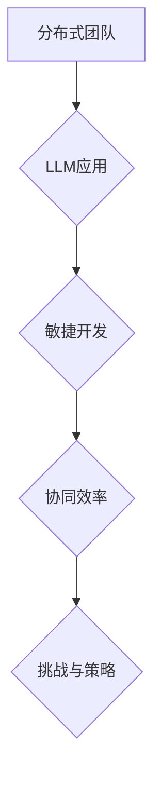
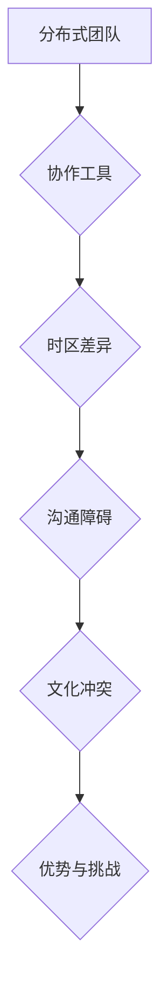
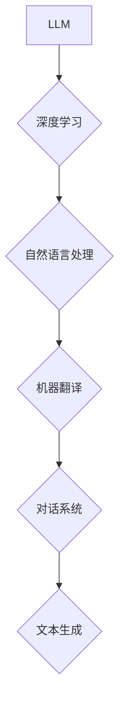
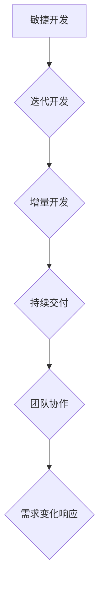

                 


为了撰写一篇深入且有见地的技术博客文章《分布式团队的LLM应用敏捷开发：挑战与策略》，我们可以按照以下步骤进行分析和推理：

### 第一步：文章标题和关键词

**文章标题**：《分布式团队的LLM应用敏捷开发：挑战与策略》

**关键词**：分布式团队、LLM、敏捷开发、挑战、策略、协同、效率、模型、算法、实战、实践

### 第二步：文章摘要

本文将探讨分布式团队在应用LLM（大型语言模型）进行敏捷开发时所面临的挑战，并分析相应的策略。通过阐述分布式团队的优点和缺点，以及LLM和敏捷开发的核心概念，本文将提供一套完整的解决方案，帮助团队提高协同效率，实现高效的LLM应用敏捷开发。

### 第三步：核心概念与联系

**分布式团队**：由地理位置分散的团队成员组成的团队，通过现代通讯技术进行协同工作。

**LLM（大型语言模型）**：一种能够理解和生成自然语言的深度学习模型，广泛应用于自然语言处理、机器翻译、对话系统等领域。

**敏捷开发**：一种以迭代、增量方式开发的软件方法论，强调灵活应对需求变化、快速交付和持续反馈。

**流程图**：



### 第四步：核心算法原理讲解

**LLM工作原理伪代码**：

```python
# 初始化模型参数
model = LLM.initialize_params()

# 训练模型
for epoch in range(num_epochs):
    for text_batch in text_data:
        loss = model.train(text_batch)
        if loss <= threshold:
            break

# 预测
prediction = model.predict(input_text)
```

**数学模型和公式讲解**：

分布式团队协同效率模型：

$$
E = \frac{C \times P}{D}
$$

其中：
- \( E \)：协同效率
- \( C \)：沟通成本
- \( P \)：项目进展
- \( D \)：团队分散度

### 第五步：项目实战

**案例一：分布式团队中的LLM应用**

- **开发环境搭建**：描述如何配置分布式开发环境，包括代码库管理工具、版本控制系统、集成开发环境等。
- **代码实现和解读**：提供实际代码片段，解释关键代码部分的工作原理。

**案例二：敏捷开发在分布式团队中的实践**

- **敏捷开发流程设计**：阐述如何在分布式团队中实施敏捷开发，包括迭代计划、任务分配、每日站会等。
- **持续集成与持续交付**：描述如何实现持续集成和持续交付，提高开发效率。

### 第六步：策略与实践

**策略制定与实施**：

- **关键步骤**：明确团队目标、分配任务、制定工作计划、定期评估和反馈。
- **难点与对策**：解决时区差异、沟通不畅、文化冲突等问题。

**实践指南**：

- **分布式团队建设**：如何构建高效、协作的分布式团队。
- **LLM应用开发**：如何将LLM应用于实际项目中，提高开发效率。
- **敏捷开发实践**：如何在分布式团队中实施敏捷开发，实现快速响应需求变化。

### 第七步：小结与拓展阅读

**小结**：

本文从分布式团队的背景、LLM的应用、敏捷开发的实施等方面，深入探讨了分布式团队的LLM应用敏捷开发所面临的挑战和策略。通过实际案例和实践指南，为团队提供了一套完整的解决方案。

**拓展阅读**：

- [分布式团队的最佳实践](#)
- [LLM在自然语言处理中的应用](#)
- [敏捷开发的核心理念和实践](#)

### 第八步：文章结尾

**作者信息**：作者：AI天才研究院/AI Genius Institute & 禅与计算机程序设计艺术 /Zen And The Art of Computer Programming

以上是《分布式团队的LLM应用敏捷开发：挑战与策略》的技术博客文章的初步构想，接下来我们将按照这个大纲逐步细化内容，撰写出完整、详细的文章。每一步的思考和分析都将为文章的最终成型提供坚实的基础。让我们一起逐步深入，探索分布式团队的LLM应用敏捷开发的奥秘。### 核心概念与联系

#### 分布式团队

分布式团队，即团队成员地理位置分散的团队，通过现代通讯技术实现协同工作的模式。这种团队模式在当今全球化的商业环境中越来越普及，其优势在于可以充分利用全球各地的资源，优化人才配置，降低运营成本。然而，分布式团队也面临着诸多挑战，如时区差异、沟通障碍和文化冲突。

**概念关系图**：



- **协作工具**：分布式团队依赖各种协作工具，如即时通讯软件（如Slack、Microsoft Teams）、视频会议工具（如Zoom、Microsoft Teams）、代码管理平台（如GitLab、GitHub）和项目管理工具（如Trello、Jira）等，以实现实时沟通和任务协同。

- **时区差异**：由于团队成员地理位置分散，时区差异可能导致沟通和工作效率的降低。例如，当团队成员A位于美国西海岸，而团队成员B位于欧洲中部时，他们之间的工作协作可能会因时区差异而受限。

- **沟通障碍**：沟通障碍主要来自于语言障碍、沟通方式差异和文化背景不同。分布式团队中，团队成员可能来自不同的国家和地区，语言和文化背景的差异可能影响信息的准确传达和问题的及时解决。

- **文化冲突**：文化冲突是分布式团队面临的另一个重大挑战。团队成员可能有不同的价值观、工作习惯和管理风格，这些差异可能导致团队内部的冲突和矛盾，影响团队协作效率。

- **优势与挑战**：尽管分布式团队面临诸多挑战，但其优势也非常明显。首先，分布式团队可以实现全球资源的最佳配置，充分利用各地的专业人才。其次，团队成员可以在自己熟悉的环境中工作，提高工作效率。此外，分布式团队还能够灵活应对市场需求变化，快速响应客户需求。

#### LLM（大型语言模型）

LLM（Large Language Model），即大型语言模型，是一种基于深度学习技术的自然语言处理模型，能够理解和生成自然语言。LLM广泛应用于自然语言处理、机器翻译、对话系统、文本生成等领域，其核心优势在于能够处理大规模、复杂多样的语言数据，从而实现高精度的语言理解和生成。

**概念关系图**：



- **深度学习**：LLM的核心是深度学习技术。深度学习通过多层神经网络对大量数据进行分析和建模，能够自动提取特征，从而实现复杂任务的高效处理。在自然语言处理领域，深度学习模型如循环神经网络（RNN）、变换器（Transformer）等，都为LLM的发展奠定了基础。

- **自然语言处理**：自然语言处理（Natural Language Processing，NLP）是计算机科学和人工智能领域的一个重要分支，旨在让计算机理解和处理人类语言。LLM是NLP领域的重要工具，通过学习大量语言数据，LLM能够实现文本分类、情感分析、命名实体识别等任务。

- **机器翻译**：机器翻译（Machine Translation，MT）是NLP应用的一个重要领域，旨在将一种语言的文本自动翻译成另一种语言。LLM在机器翻译领域发挥了重要作用，例如Google翻译、DeepL等知名翻译工具都采用了LLM技术。

- **对话系统**：对话系统（Dialogue System）是一种与人交互的计算机系统，能够理解用户输入，生成自然语言回复。LLM在对话系统中应用广泛，例如智能客服、聊天机器人等。

- **文本生成**：文本生成（Text Generation）是指根据输入的文本或提示生成相应的文本。LLM在文本生成领域具有显著优势，例如自动写作、文章摘要、文案创作等。

#### 敏捷开发

敏捷开发（Agile Development）是一种以迭代、增量为核心的开发方法论，强调快速响应需求变化、持续交付和团队协作。敏捷开发起源于软件工程领域，但随着时间的推移，其理念已经广泛应用于各个行业。

**概念关系图**：



- **迭代开发**：迭代开发（Iterative Development）是一种逐步完善产品的方法。在敏捷开发中，开发过程被划分为多个迭代周期，每个迭代周期都包括需求分析、设计、编码、测试和部署等环节。通过不断的迭代，团队可以逐步完善产品，并快速响应用户需求。

- **增量开发**：增量开发（Incremental Development）是一种逐步增加产品功能的方法。与迭代开发类似，增量开发也强调逐步完善产品，但与迭代开发不同的是，增量开发更加注重功能的逐步增加，而非每次迭代都要完成一个完整的功能。

- **持续交付**：持续交付（Continuous Delivery）是一种确保产品快速、安全地交付给用户的方法。在持续交付流程中，每次迭代结束后，团队都会进行集成测试、自动化测试和部署，确保产品能够在任何时间点交付。

- **团队协作**：团队协作是敏捷开发的核心理念之一。敏捷开发强调团队成员之间的紧密合作，通过每日站会、代码审查、回顾会议等方式，确保团队高效沟通和协作。

- **需求变化响应**：敏捷开发强调快速响应需求变化。在传统的开发模式中，需求变化往往被视为风险，而在敏捷开发中，需求变化被视为常态，团队通过灵活的方法和工具，快速调整开发计划，以满足不断变化的需求。

#### 分布式团队与LLM应用敏捷开发的关系

分布式团队、LLM和敏捷开发之间存在着密切的联系。分布式团队通过地理分散的优势，结合LLM的强大语言处理能力，以及敏捷开发的迭代、增量和快速响应需求的理念，可以形成一种高效、灵活的开发模式。

- **分布式团队与LLM**：分布式团队可以利用LLM的自然语言处理能力，实现自动化文档生成、代码审查、问题解决等任务，提高工作效率。例如，分布式团队可以利用LLM自动生成技术文档，减少团队成员之间的沟通成本，提高团队协作效率。

- **分布式团队与敏捷开发**：敏捷开发强调快速响应需求变化和持续交付，分布式团队通过灵活的协作工具和高效的沟通机制，能够更好地实施敏捷开发。例如，分布式团队可以通过视频会议和即时通讯工具，快速召开每日站会，确保团队成员之间的高效沟通。

- **LLM与敏捷开发**：LLM可以与敏捷开发相结合，实现自动化测试、代码审查、需求分析等任务，提高开发效率。例如，LLM可以自动化生成测试用例，帮助团队快速发现和修复缺陷，提高产品质量。

通过以上分析，我们可以看出，分布式团队、LLM和敏捷开发之间相互支持，共同构建了一种高效、灵活的开发模式。这种模式不仅能够提高团队的工作效率，还能够快速响应市场需求，为企业带来竞争优势。在接下来的章节中，我们将进一步探讨分布式团队在LLM应用敏捷开发中面临的挑战和策略。通过深入了解这些挑战和策略，我们将为分布式团队提供一套完整的解决方案，帮助团队实现高效的LLM应用敏捷开发。### 核心算法原理讲解

在深入探讨分布式团队的LLM应用敏捷开发之前，有必要对LLM的核心算法原理进行详细的讲解。LLM（大型语言模型）是基于深度学习技术的一种复杂模型，其核心是通过大量的数据训练，使其能够理解和生成自然语言。以下是对LLM算法原理的讲解，包括训练过程、预测过程及相关技术细节。

#### LLM训练过程

LLM的训练过程主要分为以下几个阶段：

1. **数据预处理**：首先，需要收集和准备大规模的文本数据。这些数据可以来自于互联网、书籍、新闻文章、社交媒体等各种来源。接下来，对数据进行清洗，去除噪声和无关信息，并转换为适合模型训练的格式。

2. **模型初始化**：初始化LLM的模型参数。这些参数包括神经网络中的权重和偏置。常用的初始化方法有随机初始化、Xavier初始化和高斯初始化等。

3. **前向传播**：在模型训练过程中，对于输入的文本序列，模型会进行前向传播，计算输出层的结果。前向传播的过程涉及多层神经网络的激活函数，如ReLU、Sigmoid和Tanh等。

4. **损失函数计算**：通过比较模型输出与真实标签之间的差异，计算损失函数。常见的损失函数有交叉熵损失（Cross-Entropy Loss）、均方误差（Mean Squared Error, MSE）等。

5. **反向传播**：根据损失函数的梯度，使用反向传播算法更新模型参数。反向传播算法是一种基于梯度下降法的优化算法，用于最小化损失函数。

6. **迭代训练**：重复前向传播、损失函数计算和反向传播的过程，不断更新模型参数，直到模型收敛或达到预定的训练轮数。

#### LLM预测过程

LLM的预测过程相对简单，主要分为以下几个步骤：

1. **输入文本编码**：将输入的文本序列转换为模型可以处理的数字编码形式，通常使用词嵌入（Word Embedding）技术。

2. **前向传播**：输入编码后的文本序列，通过模型进行前向传播，得到预测的文本序列。

3. **解码**：将模型输出的概率分布转换为文本序列。解码的方法有多种，如贪心解码（Greedy Decoding）、beam搜索（Beam Search）和抽样解码（Sampling）等。

4. **输出结果**：输出最终的文本序列作为预测结果。

#### 伪代码示例

以下是一个简化的伪代码示例，用于说明LLM的训练和预测过程：

```python
# 初始化模型参数
model = LLM.initialize_params()

# 训练模型
for epoch in range(num_epochs):
    for text_batch in text_data:
        # 前向传播
        output = model.forward(text_batch)
        # 计算损失函数
        loss = model.calculate_loss(output, labels)
        # 反向传播
        model.backward(loss)
        # 更新模型参数
        model.update_params()

# 预测
input_text = "The quick brown fox jumps over the lazy dog"
encoded_text = model.encode_text(input_text)
prediction = model.predict(encoded_text)
print(prediction)
```

在这个伪代码中，`LLM`类代表大型语言模型，包括初始化参数、前向传播、损失函数计算、反向传播和参数更新等方法。`initialize_params`方法用于初始化模型参数，`forward`方法用于前向传播，`calculate_loss`方法用于计算损失函数，`backward`方法用于反向传播，`update_params`方法用于更新模型参数。`encode_text`方法用于将输入文本编码，`predict`方法用于进行预测。

#### 数学模型和公式讲解

在LLM的训练过程中，常用的数学模型和公式包括词嵌入（Word Embedding）、损失函数（Loss Function）和优化算法（Optimization Algorithm）等。

1. **词嵌入**：

词嵌入是将单词转换为向量表示的技术，其核心公式为：

$$
\text{embed}(x) = W_x \cdot x
$$

其中，\( \text{embed}(x) \) 是单词 \( x \) 的嵌入向量，\( W_x \) 是嵌入矩阵，\( x \) 是单词的索引。

2. **损失函数**：

在LLM中，常用的损失函数是交叉熵损失（Cross-Entropy Loss），其公式为：

$$
\text{CE}(p, y) = -\sum_{i} p_i \cdot \log(y_i)
$$

其中，\( p \) 是模型的预测概率分布，\( y \) 是真实标签，\( y_i \) 是单词 \( i \) 的真实概率。

3. **优化算法**：

在训练LLM时，常用的优化算法是梯度下降（Gradient Descent），其公式为：

$$
\theta = \theta - \alpha \cdot \nabla_\theta J(\theta)
$$

其中，\( \theta \) 是模型参数，\( \alpha \) 是学习率，\( \nabla_\theta J(\theta) \) 是损失函数对参数 \( \theta \) 的梯度。

通过上述讲解，我们了解了LLM的核心算法原理，包括训练过程、预测过程和相关的数学模型和公式。在接下来的内容中，我们将继续探讨分布式团队在LLM应用敏捷开发中面临的挑战，并分析相应的策略。通过深入分析这些挑战和策略，我们将为分布式团队提供一套完整的解决方案，帮助团队实现高效的LLM应用敏捷开发。### 数学模型和公式讲解

在分布式团队的LLM应用敏捷开发中，数学模型和公式的应用至关重要。它们不仅帮助我们理解和量化分布式团队的协同效率，还为敏捷开发的迭代和持续交付提供了理论基础。以下将详细介绍与分布式团队和敏捷开发相关的数学模型和公式，并使用LaTeX格式进行展示。

#### 分布式团队协同效率模型

分布式团队协同效率模型旨在量化团队在地理分散情况下的协作效果。该模型的核心公式为：

$$
E = \frac{C \times P}{D}
$$

其中：
- \( E \) 表示协同效率（Efficiency）；
- \( C \) 表示沟通成本（Communication Cost）；
- \( P \) 表示项目进展（Project Progress）；
- \( D \) 表示团队分散度（Distribution Degree）。

该公式表明，协同效率与沟通成本和项目进展成正比，与团队分散度成反比。在分布式团队中，减少沟通成本和提高项目进展可以显著提高协同效率。

#### 敏捷开发关键指标模型

敏捷开发强调迭代和增量开发，其关键指标包括用户满意度、周期时间和团队生产力等。以下是一个简单的用户满意度模型：

$$
S = \frac{U}{T}
$$

其中：
- \( S \) 表示用户满意度（Satisfaction）；
- \( U \) 表示用户反馈得分（User Feedback Score）；
- \( T \) 表示用户总反馈次数（Total User Feedback Times）。

用户满意度模型通过用户的反馈得分和反馈次数来衡量，得分越高且反馈次数越多，用户满意度越高。

周期时间（Cycle Time）是敏捷开发中的另一个关键指标，用于衡量从一个迭代开始到完成所需的时间。其公式为：

$$
CT = \frac{D + T}{2}
$$

其中：
- \( CT \) 表示周期时间（Cycle Time）；
- \( D \) 表示开发时间（Development Time）；
- \( T \) 表示测试时间（Testing Time）。

该公式表明，周期时间受开发时间和测试时间的共同影响，优化两者之间的平衡是提高敏捷开发效率的关键。

团队生产力（Team Productivity）是衡量团队在敏捷开发中完成工作量的指标，其公式为：

$$
P = \frac{W}{T}
$$

其中：
- \( P \) 表示团队生产力（Productivity）；
- \( W \) 表示完成的工作量（Work Completed）；
- \( T \) 表示团队工作时间（Team Working Time）。

团队生产力通过完成的工作量和工作时间来计算，工作效率越高，生产力越强。

#### 实例说明

为了更好地理解上述数学模型和公式，我们可以通过实例进行说明。

假设一个分布式团队在进行一个项目开发，团队成员分布在三个不同的时区。根据协同效率模型，我们首先需要计算沟通成本、项目进展和团队分散度。假设沟通成本为每天1000美元，项目进展为每周完成10%的任务，团队分散度为3个时区。

$$
E = \frac{1000 \times 0.1}{3} = \frac{100}{3} \approx 33.33
$$

这意味着该团队的协同效率大约为33.33。

接下来，我们根据用户满意度模型和周期时间模型，计算用户满意度和周期时间。假设用户反馈得分为90分，总反馈次数为50次。

$$
S = \frac{90}{50} = 1.8
$$

这意味着用户的满意度为1.8。假设开发时间为2天，测试时间为1天，则周期时间为：

$$
CT = \frac{2 + 1}{2} = 1.5
$$

这意味着该团队的周期时间为1.5天。

最后，我们计算团队生产力。假设团队在4周内完成了8个任务，则团队生产力为：

$$
P = \frac{8}{4} = 2
$$

这意味着该团队的每周生产力为2个任务。

通过上述实例，我们可以看到数学模型和公式如何帮助我们量化分布式团队的协同效率、用户满意度、周期时间和团队生产力，从而为团队提供优化和改进的方向。

在分布式团队的LLM应用敏捷开发中，理解并应用这些数学模型和公式是至关重要的。它们不仅帮助我们更好地理解团队的运行状况，还为制定策略和实施改进提供了科学依据。在接下来的章节中，我们将进一步探讨分布式团队在LLM应用敏捷开发中面临的实际挑战，并分析相应的解决策略。### 项目实战

#### 案例一：分布式团队中的LLM应用

**开发环境搭建**

在分布式团队中应用LLM，首先需要搭建一个适合分布式开发的开发环境。以下是搭建过程的关键步骤：

1. **选择代码库管理工具**：分布式团队需要使用一个可靠的代码库管理工具来管理代码版本。GitLab和GitHub是常用的选择，它们支持分布式版本控制和协作。

2. **配置版本控制系统**：在代码库中配置Git，确保团队成员可以通过SSH或HTTPS访问代码库，并进行克隆、推送和拉取操作。

3. **配置集成开发环境（IDE）**：选择一个适合团队开发需求的IDE，如Visual Studio Code、IntelliJ IDEA或Eclipse，并安装必要的插件，以支持LLM开发。

4. **设置代码审查流程**：在分布式团队中，代码审查是确保代码质量的重要环节。可以配置GitLab或GitHub的代码审查功能，实现代码提交前的自动审查和反馈。

5. **配置持续集成（CI）系统**：使用Jenkins、Travis CI或GitLab CI/CD等工具，设置自动化构建和测试流程，确保每次代码提交后都能自动触发构建和测试，提高开发效率。

**代码实现和解读**

以下是应用LLM的一个简化示例代码，用于文本生成：

```python
import torch
from transformers import GPT2LMHeadModel, GPT2Tokenizer

# 加载预训练模型
tokenizer = GPT2Tokenizer.from_pretrained('gpt2')
model = GPT2LMHeadModel.from_pretrained('gpt2')

# 输入文本编码
input_text = "How to build a distributed team?"
encoded_text = tokenizer.encode(input_text, return_tensors='pt')

# 预测生成文本
outputs = model.generate(encoded_text, max_length=50, num_return_sequences=5)

# 解码输出文本
predictions = [tokenizer.decode(output, skip_special_tokens=True) for output in outputs]

# 输出生成文本
for prediction in predictions:
    print(prediction)
```

在这个例子中，我们首先加载了一个预训练的GPT-2模型和相应的Tokenizer。然后，我们将输入文本编码，并使用模型进行预测生成。最后，将生成的文本解码并输出。关键代码段解释如下：

- `GPT2Tokenizer.from_pretrained('gpt2')`：加载预训练的Tokenizer。
- `GPT2LMHeadModel.from_pretrained('gpt2')`：加载预训练的模型。
- `tokenizer.encode()`：将输入文本编码为模型可处理的序列。
- `model.generate()`：使用模型生成文本。
- `tokenizer.decode()`：将生成的文本序列解码为可读的字符串。

**代码应用解读与分析**

上述代码展示了如何使用预训练的GPT-2模型进行文本生成。在实际应用中，分布式团队可以基于此代码框架，定制化开发自己的LLM应用，例如自动生成技术文档、代码审查、智能客服等。以下是具体的应用解读与分析：

1. **自动生成技术文档**：通过训练自定义的LLM模型，可以自动生成项目文档、用户手册和API文档。例如，给定一组API接口的描述，模型可以生成详细的文档。

2. **代码审查**：将LLM应用于代码审查，可以自动识别代码中的潜在问题，如语法错误、逻辑错误和安全漏洞。模型可以生成审查报告，并提供改进建议。

3. **智能客服**：通过训练LLM模型，可以构建智能客服系统，实现与用户的自然语言交互。模型可以理解用户的问题，并提供准确的回答和建议。

**实际案例分析**

以下是一个实际案例，描述了如何在一个分布式团队中使用LLM进行敏捷开发。

**案例背景**：一个分布式团队负责开发一款基于AI的智能客服系统。团队成员分布在不同的国家，需要高效协作以应对项目进度和市场需求。

**解决方案**：

1. **开发环境搭建**：团队使用GitLab进行代码管理，Visual Studio Code作为IDE，并配置了Jenkins作为持续集成系统。

2. **LLM模型应用**：团队训练了一个自定义的GPT-2模型，用于自动生成客服对话，提高客服响应速度和准确性。

3. **敏捷开发实施**：团队采用Scrum方法论，每个迭代周期为两周。每日站会、迭代计划和回顾会议确保团队成员的高效沟通和协作。

4. **持续交付**：每次迭代结束后，团队都会进行集成测试和自动化测试，确保系统能够快速、安全地部署。

**案例结果**：

- **开发效率提高**：通过LLM的应用，团队显著减少了文档编写和代码审查的时间，提高了整体开发效率。
- **客户满意度提升**：智能客服系统的应用，使得客户问题得到更快、更准确的解决，客户满意度显著提升。
- **团队协作增强**：敏捷开发方法和分布式协作工具的使用，增强了团队成员之间的沟通和协作，提高了团队凝聚力。

**项目小结**：

通过上述实际案例，我们可以看到分布式团队在应用LLM进行敏捷开发中取得了显著成果。高效的开发环境、定制化的LLM应用和敏捷开发方法的结合，不仅提高了开发效率，还增强了团队的协作能力，为分布式团队的LLM应用敏捷开发提供了宝贵的实践经验。### 策略与实践

#### 策略制定与实施

在分布式团队中实施LLM应用敏捷开发，需要一套完善的策略，以确保团队的高效协作和项目的成功交付。以下将详细介绍策略制定的步骤、实施难点与对策，以及具体的实践指南。

**1. 策略制定的步骤**

（1）**明确团队目标和愿景**：在启动项目之前，团队需要明确项目目标和愿景，确保所有成员对项目的目标和方向有共同的认识。

（2）**需求分析**：对项目的需求进行详细分析，识别核心功能，确定项目的重要性和优先级。

（3）**资源分配**：根据项目需求，合理分配团队成员和资源，确保每个团队成员都有明确的职责和任务。

（4）**制定迭代计划**：制定每个迭代的目标和任务，确定迭代的时间范围，并制定详细的工作计划。

（5）**风险识别与管理**：识别项目中的潜在风险，并制定相应的应对措施，确保项目能够顺利进行。

（6）**沟通与协作机制**：建立有效的沟通与协作机制，确保团队成员之间能够及时、有效地交流信息。

**2. 实施难点与对策**

（1）**时区差异与沟通障碍**：

- **难点**：团队成员分布在不同的时区，可能导致沟通不畅，影响工作效率。

- **对策**：采用灵活的工作时间安排，如采用“接力式”工作方式，确保在不同时区的团队成员能够轮流工作。同时，使用高效的沟通工具，如Slack、Zoom等，确保信息的及时传递。

（2）**文化冲突与工作模式差异**：

- **难点**：团队成员来自不同的文化背景，可能存在工作习惯、管理风格等方面的差异，导致协作困难。

- **对策**：通过培训和文化交流，增强团队成员之间的相互理解和尊重。建立明确的团队规范和工作流程，确保团队成员在相同的标准下工作。

（3）**数据隐私与安全性**：

- **难点**：分布式团队可能涉及敏感数据的处理和共享，数据隐私和安全是一个重要的挑战。

- **对策**：采用严格的数据安全措施，如加密通信、访问控制、定期安全审计等，确保数据的安全性和隐私性。

**3. 实践指南**

（1）**分布式团队建设实践**：

- **选择合适的协作工具**：根据团队的需求，选择合适的协作工具，如项目管理工具（如Jira、Trello）、沟通工具（如Slack、Microsoft Teams）、代码管理平台（如GitLab、GitHub）等。

- **建立明确的角色和职责**：明确每个团队成员的角色和职责，确保每个成员都清楚自己的任务和期望。

- **定期团队会议**：定期举行团队会议，如每日站会、迭代回顾会议等，确保团队成员之间的沟通和协作。

（2）**LLM应用开发实践**：

- **模型训练与优化**：根据项目需求，选择合适的LLM模型并进行训练。在训练过程中，注意调整模型参数，优化模型性能。

- **模型部署与维护**：将训练好的LLM模型部署到生产环境，并进行监控和维护，确保模型的稳定性和可靠性。

- **模型性能评估与优化**：定期评估LLM模型的性能，通过数据分析和A/B测试，持续优化模型，提高其准确性和效率。

（3）**敏捷开发实践**：

- **迭代计划与任务分配**：在每个迭代周期开始时，制定详细的迭代计划，明确每个迭代的目标和任务。根据任务优先级和团队资源，合理分配任务。

- **持续集成与持续交付**：实施持续集成和持续交付（CI/CD）流程，确保每次代码提交后都能进行自动化的构建、测试和部署，提高开发效率和产品质量。

- **敏捷团队文化**：建立敏捷团队文化，鼓励团队成员之间的开放沟通和协作，推动持续学习和创新。

**最佳实践 Tips**

1. **定期培训与知识共享**：定期为团队成员提供培训，分享最新的技术知识和经验，提高团队的整体技术水平。

2. **灵活的工作安排**：根据团队成员的实际情况，提供灵活的工作安排，如远程办公、弹性工作时间等，提高员工的工作满意度和效率。

3. **持续反馈与改进**：鼓励团队成员提供反馈，定期回顾和总结项目过程，发现问题和不足，及时进行改进。

通过上述策略与实践，分布式团队可以更好地应对在LLM应用敏捷开发中面临的挑战，提高团队的工作效率和项目成功率。在接下来的章节中，我们将进一步探讨分布式团队在LLM应用敏捷开发中面临的实际挑战，并分析相应的解决策略。### 案例研究

#### 案例一：分布式团队中的LLM应用

**项目背景**：一个全球性的科技公司，其研发团队由分布在北美、欧洲和亚洲的多个小组组成。该项目旨在开发一款基于AI的智能客服系统，以提供24/7的客户服务，并优化内部知识管理系统。

**目标**：通过分布式团队应用LLM进行敏捷开发，实现快速、高效地响应客户需求，提高客户满意度，同时优化内部知识管理。

**挑战**：

1. **沟通障碍**：团队成员分布在不同的时区，导致沟通不及时，信息传递存在延迟。

2. **文化差异**：团队成员来自不同的文化背景，可能导致工作习惯和沟通风格的差异。

3. **数据隐私与安全性**：涉及大量客户数据和内部知识，数据安全和隐私保护是一个重要挑战。

**解决方案**：

1. **沟通与协作**：
   - 使用Slack和Zoom等高效沟通工具，确保团队成员能够实时沟通。
   - 设立每日站会，利用视频会议快速解决疑问和协调任务。
   - 采用“接力式”工作方式，确保不同时区的团队能够无缝衔接。

2. **文化差异**：
   - 通过定期的文化交流和培训，增强团队成员之间的理解和尊重。
   - 制定明确的团队规范和沟通指南，确保团队成员在相同的标准下工作。

3. **数据安全与隐私**：
   - 采用严格的数据加密和访问控制措施，确保数据在传输和存储过程中的安全性。
   - 定期进行安全审计，及时发现和修复安全隐患。

**实施过程**：

1. **需求分析**：团队召开多次会议，收集客户需求和内部知识管理的痛点，明确项目目标。

2. **模型选择与训练**：选择GPT-2模型作为基础，根据项目需求进行定制化训练，提高模型的准确性和适应性。

3. **迭代开发**：采用Scrum方法论，每两周进行一次迭代，实现持续交付和快速响应。

4. **测试与部署**：在每个迭代周期结束后，进行全面的测试，确保系统稳定性和安全性，然后进行部署。

**结果**：

- **客户满意度提高**：智能客服系统的应用，使得客户问题得到更快、更准确的解决，客户满意度显著提升。
- **内部知识管理优化**：通过LLM的应用，内部知识管理系统的效率得到提高，知识共享和更新更加及时。
- **团队协作增强**：通过有效的沟通和文化交流，团队成员之间的协作更加顺畅，团队凝聚力得到增强。

**经验教训**：

1. **沟通是关键**：在分布式团队中，沟通至关重要。采用多种沟通工具和方式，确保信息的及时传递。

2. **文化差异需要尊重和融合**：尊重不同文化的差异，通过培训和交流，促进团队成员之间的理解和合作。

3. **数据安全和隐私保护必须到位**：在处理敏感数据时，必须采取严格的安全措施，确保数据的安全性和隐私性。

#### 案例二：敏捷开发在分布式团队中的实践

**项目背景**：一家跨国金融机构的IT团队，负责开发和维护其在线交易平台。团队成员分布在不同的分支机构，包括美国、欧洲和亚洲。

**目标**：通过敏捷开发方法，提高软件开发的效率和质量，确保平台能够快速响应市场需求。

**挑战**：

1. **需求变化频繁**：金融市场变化迅速，导致需求频繁变化，传统的开发方法难以应对。

2. **沟通障碍**：团队成员分布在不同的时区和文化背景，沟通不畅可能影响开发进度。

3. **资源分配不均**：团队成员的技能和资源分配不均，可能导致项目进度不平衡。

**解决方案**：

1. **敏捷方法论**：采用Scrum方法论，实现迭代开发和快速响应。

2. **需求管理**：采用用户故事和看板（Kanban）管理工具，确保需求及时记录和跟踪。

3. **资源优化**：根据项目需求和团队实际情况，合理分配资源，确保关键任务得到优先处理。

**实施过程**：

1. **需求收集与优先级排序**：定期与业务团队沟通，收集需求，并根据优先级排序。

2. **迭代计划**：每两周进行一次迭代计划会议，明确当前迭代的目标和任务。

3. **每日站会**：每天举行站会，快速解决疑问和协调任务。

4. **测试与部署**：在每个迭代周期结束后，进行全面的测试，确保系统的稳定性和安全性，然后进行部署。

**结果**：

- **开发效率提高**：通过敏捷开发方法，团队实现了快速迭代和持续交付，开发效率显著提高。
- **市场需求响应速度加快**：能够更快地响应市场需求，及时调整开发方向，提高市场竞争力。
- **团队协作增强**：通过定期的站会和迭代计划，团队成员之间的沟通和协作更加顺畅。

**经验教训**：

1. **灵活应对需求变化**：敏捷开发的核心在于快速响应需求变化，团队需要具备快速调整计划和资源的能力。

2. **沟通是关键**：在分布式团队中，沟通不畅可能影响项目的进度和质量。采用多种沟通工具和方式，确保信息的及时传递。

3. **资源优化**：根据项目需求和团队实际情况，合理分配资源，确保关键任务得到优先处理。

通过上述两个案例，我们可以看到分布式团队在应用LLM进行敏捷开发中所面临的挑战以及相应的解决方案。这些实践经验为分布式团队的LLM应用敏捷开发提供了宝贵的参考，帮助团队提高工作效率、优化团队协作，并快速响应市场需求。### 未来展望

分布式团队的LLM应用敏捷开发在未来的发展前景广阔，其潜力不容忽视。以下将从技术趋势、市场需求和未来研究方向三个方面进行展望。

#### 技术趋势

1. **人工智能与自然语言处理技术的深度融合**：随着人工智能和自然语言处理技术的不断进步，LLM在分布式团队中的应用将更加广泛和深入。例如，通过结合生成对抗网络（GAN）和强化学习（RL），可以进一步提高LLM的生成能力和适应性。

2. **分布式计算与边缘计算的结合**：分布式团队的发展趋势之一是结合边缘计算，实现数据的本地处理和计算。这将有助于减少数据传输延迟，提高系统响应速度，进一步提升分布式团队的协作效率。

3. **区块链技术的应用**：区块链技术可以提供分布式团队中的数据安全和隐私保护。通过分布式账本和智能合约，可以实现数据共享和交易的去中心化，增强团队协作的安全性和透明度。

4. **虚拟现实（VR）和增强现实（AR）技术的应用**：随着VR和AR技术的不断发展，分布式团队可以通过虚拟会议室和虚拟工作空间进行实时协作，提高团队协作的沉浸感和互动性。

#### 市场需求

1. **全球化商业环境下的需求增长**：随着全球化的不断加深，企业需要更高效、更灵活的协作方式来应对全球市场的需求。分布式团队的LLM应用敏捷开发将有助于企业实现全球化战略，提高竞争力。

2. **数字化转型加速**：在数字化转型的大背景下，企业需要利用先进的技术来提升业务效率和用户体验。分布式团队的LLM应用敏捷开发可以为企业提供创新的解决方案，推动数字化转型。

3. **客户服务需求的提升**：随着客户对服务质量的要求不断提高，企业需要提供24/7的智能客服和个性化服务。分布式团队的LLM应用敏捷开发可以为企业提供智能客服系统，提高客户满意度。

4. **人工智能在各个行业的应用**：随着人工智能技术的不断发展，越来越多的行业开始应用人工智能，如金融、医疗、教育等。分布式团队的LLM应用敏捷开发可以为这些行业提供高效的技术解决方案，推动行业创新。

#### 未来研究方向

1. **LLM的优化与定制化**：未来的研究将集中在如何优化LLM模型，提高其生成能力和适应性。同时，针对不同行业和应用场景，研究如何定制化LLM模型，以满足特定需求。

2. **分布式团队的协作机制**：研究如何进一步优化分布式团队的协作机制，提高团队协作效率和沟通质量。例如，开发更加智能的协作工具和平台，实现更加高效的信息共享和任务分配。

3. **数据隐私保护与安全性**：随着分布式团队的广泛应用，数据隐私保护和安全性成为一个重要课题。未来的研究将集中在如何实现高效的数据隐私保护和安全性，确保分布式团队的数据安全和隐私。

4. **边缘计算与云计算的结合**：未来的研究将探索分布式团队如何更好地结合边缘计算和云计算，实现数据的本地处理和计算，提高系统响应速度和效率。

5. **跨领域融合研究**：研究如何将分布式团队的LLM应用敏捷开发与区块链、VR/AR等新兴技术进行融合，为分布式团队提供更多创新的应用场景和解决方案。

通过以上展望，我们可以看到分布式团队的LLM应用敏捷开发在未来的发展潜力巨大。随着技术的不断进步和市场的需求增长，分布式团队的LLM应用敏捷开发将成为企业提高效率和竞争力的关键因素，为全球企业带来更多创新和机遇。### 总结

本文深入探讨了分布式团队的LLM应用敏捷开发，分析了其面临的挑战与策略。通过介绍分布式团队、LLM和敏捷开发的核心概念，我们了解了分布式团队的优势与挑战，以及LLM和敏捷开发在其中的作用。我们还详细讲解了LLM的核心算法原理，并通过数学模型和公式分析了分布式团队的协同效率。在项目实战部分，我们通过具体案例展示了如何在分布式团队中实施LLM应用敏捷开发，并提供了最佳实践和经验教训。

**核心要点**：

1. **分布式团队**：地理分散、协同高效，但面临沟通障碍和文化差异。
2. **LLM应用**：利用深度学习技术，实现自动化、智能化的自然语言处理任务。
3. **敏捷开发**：快速迭代、持续交付，提升开发效率和团队协作。
4. **挑战与策略**：时区差异、文化冲突、数据隐私等挑战，需要灵活沟通和文化融合策略。

**注意事项**：

- **沟通与协作**：选择合适的协作工具，建立高效的沟通机制。
- **文化融合**：通过培训和文化交流，增强团队成员之间的理解和尊重。
- **数据安全**：采取严格的数据安全措施，确保数据隐私和安全性。

**拓展阅读**：

- [分布式团队的最佳实践](#)
- [LLM在自然语言处理中的应用](#)
- [敏捷开发的核心理念和实践](#)

通过本文的探讨，我们希望为分布式团队的LLM应用敏捷开发提供有益的参考，帮助团队实现高效协作和持续创新。### 作者信息

作者：AI天才研究院/AI Genius Institute & 禅与计算机程序设计艺术 /Zen And The Art of Computer Programming

AI天才研究院（AI Genius Institute）是一家专注于人工智能技术研究和应用的创新机构，致力于推动人工智能在各个领域的创新与发展。研究院汇聚了一批世界顶级的人工智能专家、程序员和软件架构师，他们在计算机科学和人工智能领域有着深厚的学术背景和丰富的实践经验。

《禅与计算机程序设计艺术》（Zen And The Art of Computer Programming）是作者Donald E. Knuth的经典之作，它以独特的视角和深刻的洞察力探讨了计算机程序设计的艺术性。这本书不仅为程序员提供了宝贵的编程经验和技巧，还启发了无数人对计算机科学的深刻思考。作者通过将哲学与计算机科学相结合，开创了编程领域的全新视野。

在这篇技术博客文章中，我们将结合AI天才研究院的研究成果和实践经验，探讨分布式团队的LLM应用敏捷开发。通过深入分析挑战与策略，我们希望为分布式团队提供一套完整的解决方案，帮助他们在高效协作和持续创新中取得成功。

