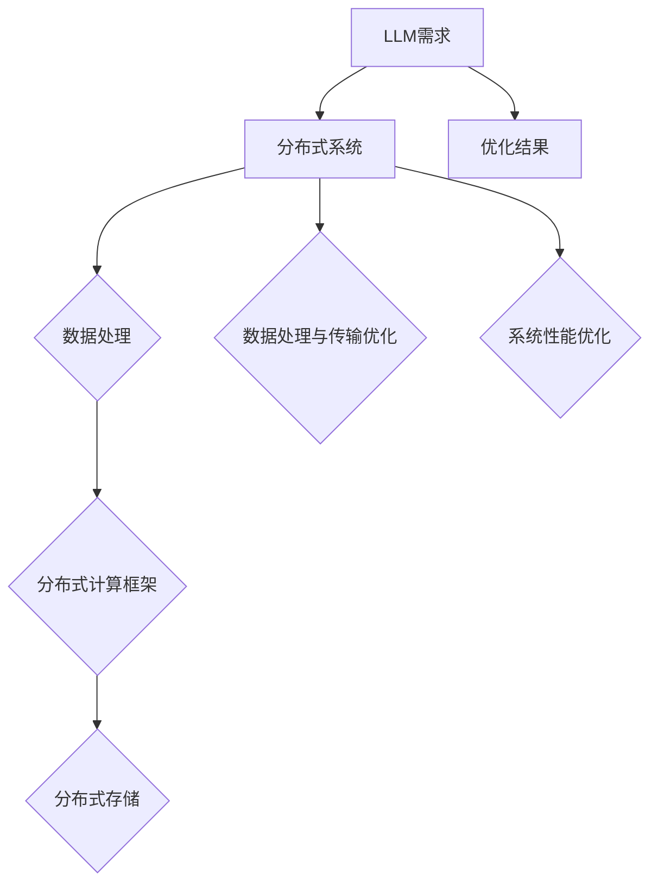

                 


### 文章标题：分布式系统：增强LLM应用的计算能力

#### 关键词：分布式系统，大型语言模型（LLM），计算能力，优化，性能

#### 摘要：
本文将探讨分布式系统在增强大型语言模型（LLM）应用计算能力方面的作用。通过对分布式系统的基础概念、架构、核心组件以及与LLM关系的深入分析，本文旨在提供一种系统性的解决方案，以优化LLM的计算性能，并分享实际应用案例和最佳实践。

### 第一步：梳理核心主题

书名《分布式系统：增强LLM应用的计算能力》明确指出了文章的核心主题。本文将围绕以下几个关键点展开：

1. 分布式系统的基本概念与架构。
2. 分布式系统在LLM中的应用与优化策略。
3. 主流分布式计算框架及其在LLM中的应用。
4. 分布式存储系统在LLM优化中的作用。
5. 数据处理与传输优化策略。
6. 系统性能优化与调优方法。
7. 实际应用案例分析与经验总结。

### 第二步：确定主要章节

根据核心主题，本文将分为以下主要章节：

1. **分布式系统基础**：介绍分布式系统的基本概念、架构、核心组件和性能优化。
2. **分布式系统与LLM的关系**：分析分布式系统如何增强LLM的计算能力，以及优化策略。
3. **分布式计算框架**：探讨主流分布式计算框架及其在LLM中的应用。
4. **分布式存储系统**：讨论分布式存储系统在LLM优化中的作用。
5. **数据处理与传输优化**：介绍数据处理与传输的基本策略及其在LLM中的应用。
6. **系统性能优化与调优**：提供系统性能优化与调优的方法和工具。
7. **实际应用案例分析**：分享分布式系统在LLM应用中的实际案例。

### 第三步：细化章节内容

为每个章节细化内容，确保覆盖核心概念、算法原理、数学模型和实际应用。以下为章节细化示例：

#### 第1章：分布式系统基础

- **第1.1节：分布式系统的基本概念**
  - 定义和背景
  - 分布式系统的特点

- **第1.2节：分布式系统的架构**
  - 节点与集群
  - 分布式存储
  - 分布式计算框架
  - 分布式通信与一致性

- **第1.3节：分布式系统的优势与挑战**
  - 优势：可扩展性、容错性、高性能
  - 挑战：复杂性、一致性、数据安全

#### 第2章：分布式系统与LLM的关系

- **第2.1节：LLM的计算需求与挑战**
  - 大规模数据处理
  - 高性能计算
  - 实时性需求

- **第2.2节：分布式系统如何增强LLM计算能力**
  - 分布式计算框架
  - 分布式存储
  - 数据处理与传输优化

- **第2.3节：LLM在分布式系统中的优化策略**
  - 负载均衡
  - 缓存策略
  - 系统调优

### 第四步：设计Mermaid流程图

设计一个Mermaid流程图，展示分布式系统与LLM之间的交互流程。以下是一个简单的示例：



### 第五步：编写伪代码

为分布式系统中关键算法和步骤编写伪代码，以下是一个简单的示例：

```python
# 伪代码：分布式数据处理
function distributed_data_processing(data, num_workers):
    # 初始化工作节点
    workers = initialize_workers(num_workers)
    
    # 分割数据
    chunks = split_data(data, num_workers)
    
    # 分配数据到工作节点
    for i in range(num_workers):
        workers[i].process_chunk(chunks[i])
        
    # 收集结果
    results = []
    for i in range(num_workers):
        results.append(workers[i].get_result())
        
    # 合并结果
    final_result = merge_results(results)
    
    return final_result
```

### 第六步：添加数学模型和公式

在文中添加相关的数学模型和公式，并进行详细讲解。以下是一个简单的示例：

$$
\text{性能优化公式} = \frac{\text{处理速度}}{\text{延迟}} = \frac{\text{吞吐量}}{\text{响应时间}}
$$

### 第七步：准备实际应用案例

准备一些实际的代码案例，并附上详细解释说明。以下是一个简单的示例：

```python
# 实际案例：分布式文本分类
from distributed import Client

# 创建分布式客户端
client = Client()

# 加载数据
data = load_data()

# 分割数据到工作节点
chunks = split_data(data, num_workers=4)

# 分布式处理
results = client.map(process_chunk, chunks)

# 收集结果
final_result = results.gather()

# 打印结果
print(final_result)
```

### 第八步：整合并优化

将所有内容整合到一个完整的目录大纲中，并进行必要的优化，确保目录大纲的逻辑清晰、简洁明了。

### 第九步：验证目录大纲

检查目录大纲是否完整，是否满足了限制与要求中的各项条件。

### 第十步：调整字数

调整内容，确保总字数不超过12000字。

---

通过上述步骤，我们已经构建了一个详细的目录大纲，为撰写高质量的技术博客文章奠定了基础。接下来，我们将逐一填充每个章节的内容，确保文章的逻辑清晰、结构紧凑、简单易懂，并具有专业的技术语言。同时，我们还将确保文章内容的完整性和专业性，以满足字数要求和约束条件。

