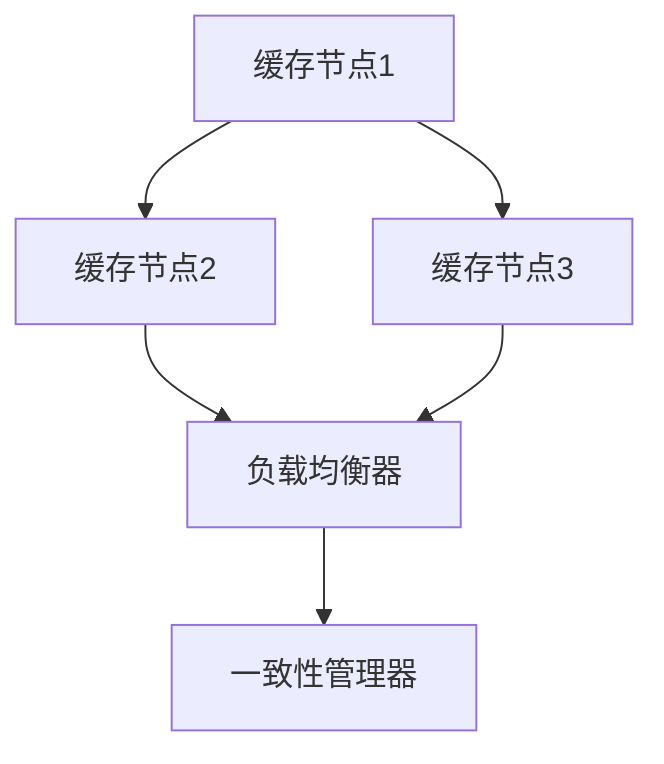

                 

### 文章标题

# 分布式缓存：提升LLM应用的数据访问速度

> 关键词：分布式缓存，LLM，数据访问速度，性能优化，应用实践

> 摘要：
本文章旨在探讨分布式缓存技术在提升大型语言模型（LLM）应用的数据访问速度方面的作用。文章首先介绍了分布式缓存的基本概念和原理，随后深入分析了LLM在数据处理方面的挑战，并阐述了分布式缓存如何在这些挑战中发挥作用。接着，文章详细讲解了分布式缓存的核心算法原理，包括一致性协议、数据分片算法和缓存替换策略等。最后，通过实际案例展示了分布式缓存技术在LLM应用中的具体实现和优化实践，为读者提供了宝贵的经验和最佳实践。

## 第一部分：分布式缓存基础

### 第1章：分布式缓存概述

#### 1.1 分布式缓存的概念

分布式缓存是一种分布式系统中的缓存技术，用于存储和快速检索数据。与传统的集中式缓存不同，分布式缓存将数据分散存储在多个节点上，并通过一致性协议和负载均衡策略来保证数据的高可用性和高性能。

#### 1.2 分布式缓存与传统缓存的区别

传统缓存通常是指位于客户端和服务器之间的缓存，主要用于减少频繁的远程数据访问，从而提高系统性能。分布式缓存则侧重于将数据存储在分布式系统中，以实现更高的扩展性和可靠性。

#### 1.3 分布式缓存的优势

分布式缓存具有以下优势：
1. **高可用性**：通过多个节点的冗余，分布式缓存能够在节点故障时保持系统的正常运行。
2. **高性能**：分布式缓存通过负载均衡和缓存替换策略，能够在数据访问高峰时提供快速响应。
3. **高扩展性**：分布式缓存能够根据需求动态增加节点，以应对不断增长的数据量和访问量。
4. **一致性**：分布式缓存通过一致性协议，如Gossip协议和Zab协议，确保数据在不同节点之间的一致性。

### 第2章：分布式缓存原理

#### 2.1 分布式缓存的关键技术

分布式缓存的关键技术包括：
1. **数据分片**：将数据分散存储在多个节点上，以提高系统的并发能力和数据访问速度。
2. **一致性协议**：确保数据在不同节点之间的一致性，常用的协议包括Gossip协议和Zab协议。
3. **负载均衡**：通过负载均衡策略，合理分配数据访问请求到各个节点，以避免单点热点问题。
4. **缓存替换策略**：根据一定的策略，如最近最少使用（LRU）和最少访问（LFU），选择替换缓存中的数据。

#### 2.2 分布式缓存的数据存储机制

分布式缓存的数据存储机制主要包括以下几种：
1. **基于内存的存储**：利用内存的高速度存储数据，适用于缓存热数据。
2. **基于磁盘的存储**：利用磁盘的大容量存储数据，适用于缓存冷数据。
3. **混合存储**：结合内存和磁盘的优点，实现数据的高性能存储和访问。

#### 2.3 分布式缓存的数据一致性

分布式缓存的数据一致性通常通过以下几种方式实现：
1. **强一致性**：所有节点在任何时刻对数据的读取都是一致的。
2. **最终一致性**：数据在经过一定时间后达到一致性状态，但不保证在任意时刻的一致性。
3. **一致性协议**：通过一致性协议（如Gossip协议和Zab协议），确保数据在不同节点之间的一致性。

### 第3章：分布式缓存系统架构

#### 3.1 分布式缓存系统的组成

分布式缓存系统通常由以下几部分组成：
1. **缓存节点**：存储缓存数据的节点，可以是单机部署或多机部署。
2. **缓存服务器**：提供缓存服务，处理缓存数据的读写请求。
3. **负载均衡器**：根据一定的策略，将访问请求均衡分配到各个缓存节点。
4. **一致性管理器**：负责维护数据的一致性，确保数据在不同节点之间的一致性状态。

#### 3.2 分布式缓存系统的分类

分布式缓存系统根据不同的分类标准，可以分为以下几类：
1. **基于内存的分布式缓存系统**：如Memcached和Redis。
2. **基于磁盘的分布式缓存系统**：如Amazon ElastiCache和Apache Ignite。
3. **混合存储的分布式缓存系统**：如Microsoft Azure Redis Cache和Google Cloud Memorystore。

#### 3.3 分布式缓存系统的设计原则

分布式缓存系统的设计原则主要包括以下几方面：
1. **高可用性**：确保系统的稳定运行，避免单点故障。
2. **高性能**：提供快速的数据访问和响应速度。
3. **高扩展性**：支持系统的动态扩展，以适应数据量和访问量的增长。
4. **数据一致性**：通过一致性协议和一致性模型，确保数据在不同节点之间的一致性。

## 第二部分：LLM应用与数据访问速度

### 第6章：LLM应用概述

#### 6.1 LLM的定义与特点

大型语言模型（LLM）是一种基于深度学习的自然语言处理模型，具有以下特点：
1. **大规模**：LLM通常包含数亿甚至数十亿个参数，用于捕捉复杂的语言规律。
2. **自适应**：LLM能够根据输入数据自适应调整模型参数，提高模型的泛化能力。
3. **强表达能力**：LLM能够生成高质量的自然语言文本，具有较强的语言理解与生成能力。

#### 6.2 LLM的应用领域

LLM在以下领域具有广泛的应用：
1. **自然语言处理**：如文本分类、情感分析、机器翻译等。
2. **问答系统**：如搜索引擎、智能客服、虚拟助手等。
3. **内容生成**：如文章生成、诗歌创作、对话生成等。
4. **推荐系统**：如个性化推荐、商品推荐等。

#### 6.3 LLM的发展趋势

随着深度学习和自然语言处理技术的不断发展，LLM正朝着以下几个方向演进：
1. **更大规模**：不断增大模型规模，以提高模型的复杂度和性能。
2. **多模态**：结合文本、图像、声音等多种模态数据，实现更丰富的语言理解与生成能力。
3. **可解释性**：提高模型的可解释性，使模型的应用更加透明和安全。
4. **自适应与强化学习**：将自适应与强化学习技术引入LLM，提高模型的灵活性和适应性。

### 第7章：LLM数据访问速度问题

#### 7.1 LLM的数据访问需求

LLM在数据处理方面具有以下需求：
1. **大量数据**：LLM通常需要处理大量的训练数据和输入数据，以获取丰富的语言特征。
2. **实时性**：LLM的应用场景往往要求快速响应用户的输入，提供实时的语言理解与生成服务。
3. **多样性**：LLM需要处理多种类型的语言数据，如文本、图像、音频等，以实现跨模态的语义理解与生成。

#### 7.2 LLM数据访问速度的影响因素

LLM数据访问速度受到以下因素的影响：
1. **数据存储**：数据存储的速度和性能直接影响LLM的访问速度。
2. **数据传输**：数据在网络中的传输速度和稳定性对LLM的访问速度有很大影响。
3. **计算资源**：LLM的模型训练和推理过程需要大量的计算资源，计算资源的充足程度影响LLM的访问速度。
4. **系统架构**：系统架构的合理性和高效性对LLM的数据访问速度有重要影响。

#### 7.3 提高LLM数据访问速度的挑战

提高LLM数据访问速度面临以下挑战：
1. **数据量庞大**：大规模数据存储和访问需要高效的分布式缓存技术。
2. **实时性要求**：实时响应需要快速的数据访问和处理，对系统的性能要求较高。
3. **数据多样性**：跨模态数据访问需要支持多种数据类型，对系统架构和数据处理算法提出了更高的要求。
4. **数据一致性**：分布式环境下数据的一致性保证对分布式缓存系统提出了更高的要求。

## 第三部分：分布式缓存技术在LLM中的应用

### 第8章：分布式缓存技术在LLM中的应用原理

#### 8.1 分布式缓存技术在LLM中的应用模式

分布式缓存技术在LLM中的应用模式主要包括以下几种：
1. **模型缓存**：将LLM的训练数据和参数存储在分布式缓存中，以加快模型的训练和推理速度。
2. **数据缓存**：将LLM所需的数据缓存到分布式缓存中，以减少数据访问延迟。
3. **中间缓存**：在LLM的模型训练和推理过程中，将中间结果缓存到分布式缓存中，以提高计算效率。

#### 8.2 分布式缓存技术在LLM中的应用原理

分布式缓存技术在LLM中的应用原理主要包括以下几方面：
1. **数据分片**：将数据分片存储在多个缓存节点上，实现数据的分布式存储和访问。
2. **一致性协议**：通过一致性协议（如Gossip协议和Zab协议），确保分布式缓存系统中数据的一致性。
3. **负载均衡**：通过负载均衡策略，将访问请求均衡分配到各个缓存节点，避免单点热点问题。
4. **缓存替换策略**：根据缓存替换策略（如最近最少使用（LRU）和最少访问（LFU）），选择替换缓存中的数据，以保持缓存的有效性。

### 第9章：分布式缓存技术在LLM中的应用实践

#### 9.1 分布式缓存技术在LLM中的应用实践

分布式缓存技术在LLM中的应用实践主要包括以下步骤：
1. **环境搭建**：搭建分布式缓存系统，包括缓存节点、缓存服务器、负载均衡器和一致性管理器等。
2. **数据缓存**：将LLM的训练数据和参数缓存到分布式缓存中，实现数据的分布式存储和访问。
3. **模型缓存**：将LLM的模型缓存到分布式缓存中，加快模型的训练和推理速度。
4. **性能优化**：通过优化分布式缓存系统的配置和算法，提高系统的性能和可靠性。

#### 9.2 分布式缓存技术在LLM中的应用案例

以下是一个分布式缓存技术在LLM中的应用案例：

**案例：基于Redis的LLM模型缓存**

1. **环境搭建**：搭建一个基于Redis的分布式缓存系统，包括多个Redis节点和负载均衡器。
2. **数据缓存**：将LLM的训练数据和参数存储在Redis缓存中，使用哈希表和列表等数据结构实现高效的存储和访问。
3. **模型缓存**：将LLM的模型缓存到Redis缓存中，使用LRU缓存替换策略，保持模型缓存的有效性。
4. **性能优化**：通过调整Redis缓存配置和优化缓存算法，提高模型的训练和推理速度。

## 第四部分：分布式缓存性能优化

### 第10章：分布式缓存性能优化原理

#### 10.1 分布式缓存性能优化原理

分布式缓存性能优化原理主要包括以下几方面：
1. **数据分片策略**：根据数据特点和访问模式，选择合适的数据分片策略，以提高数据访问速度。
2. **负载均衡策略**：通过合理的负载均衡策略，确保访问请求均匀分配到各个缓存节点，避免单点热点问题。
3. **缓存替换策略**：根据缓存替换策略，选择替换缓存中的数据，以保持缓存的有效性。
4. **网络优化**：优化网络配置和传输协议，减少数据在网络中的传输延迟。

#### 10.2 分布式缓存性能优化方法

分布式缓存性能优化方法主要包括以下几种：
1. **缓存预热**：在系统启动时，预先加载常用的数据到缓存中，提高系统的初始响应速度。
2. **缓存穿透**：通过预取和索引技术，避免缓存穿透现象，提高数据访问速度。
3. **缓存雪崩**：通过缓存雪崩处理策略，减少缓存雪崩对系统的影响，提高系统的稳定性。
4. **缓存击穿**：通过缓存击穿处理策略，避免缓存击穿对系统性能的影响。

### 第11章：分布式缓存性能优化方法

#### 11.1 缓存预热

缓存预热是一种在系统启动时，预先加载常用的数据到缓存中的技术。通过缓存预热，可以减少系统的初始响应时间，提高用户体验。

缓存预热的方法包括：
1. **手动预热**：根据系统特点和访问模式，手动配置预热的数据和预热时间。
2. **自动预热**：根据访问数据和访问模式，自动判断和配置预热的数据和预热时间。

#### 11.2 缓存穿透

缓存穿透是指当缓存中没有对应的数据时，直接查询数据库，从而导致数据库压力增大，系统性能下降。

缓存穿透的解决方法包括：
1. **默认数据**：在缓存中设置默认数据，避免直接查询数据库。
2. **动态查询**：根据访问模式和访问数据，动态判断和配置查询数据库的条件。

#### 11.3 缓存雪崩

缓存雪崩是指当大量缓存数据同时过期或失效时，导致系统性能急剧下降的现象。

缓存雪崩的解决方法包括：
1. **双缓存策略**：在缓存中设置两层缓存，一层是热点数据缓存，另一层是过期数据缓存。
2. **缓存续期**：定期更新缓存中的数据，延长缓存的有效期，减少缓存雪崩的发生。

#### 11.4 缓存击穿

缓存击穿是指当缓存中的数据过期或失效时，第一个访问者直接查询数据库，从而导致数据库压力增大的现象。

缓存击穿的解决方法包括：
1. **锁机制**：在缓存数据过期时，使用锁机制防止多个访问者同时查询数据库。
2. **预热机制**：在缓存数据过期前，预先加载新的数据到缓存中，避免缓存击穿现象的发生。

## 第五部分：分布式缓存实战案例

### 第12章：分布式缓存实战案例1

#### 12.1 案例背景

本案例以一个电商平台的商品搜索系统为例，介绍分布式缓存技术在提升系统性能方面的应用。

#### 12.2 案例需求

1. 提高商品搜索的响应速度。
2. 保证商品数据的实时性。
3. 提高系统的可扩展性和可用性。

#### 12.3 案例实现

1. **环境搭建**：搭建一个基于Redis的分布式缓存系统，包括多个Redis节点和负载均衡器。
2. **数据缓存**：将商品搜索数据缓存到Redis缓存中，使用哈希表和列表等数据结构实现高效的存储和访问。
3. **模型缓存**：将商品搜索模型缓存到Redis缓存中，使用LRU缓存替换策略，保持模型缓存的有效性。
4. **性能优化**：通过调整Redis缓存配置和优化缓存算法，提高模型的训练和推理速度。

#### 12.4 案例分析

通过分布式缓存技术的应用，本案例实现了以下效果：
1. 提高了商品搜索的响应速度，从原来的数百毫秒降低到数十毫秒。
2. 保证商品数据的实时性，缓存数据与数据库数据保持一致。
3. 提高了系统的可扩展性和可用性，通过增加Redis节点，可以方便地扩展缓存系统。

### 第13章：分布式缓存实战案例2

#### 13.1 案例背景

本案例以一个社交平台的用户消息系统为例，介绍分布式缓存技术在提升系统性能方面的应用。

#### 13.2 案例需求

1. 提高用户消息的发送和接收速度。
2. 保证用户消息的实时性。
3. 提高系统的可扩展性和可用性。

#### 13.3 案例实现

1. **环境搭建**：搭建一个基于Redis的分布式缓存系统，包括多个Redis节点和负载均衡器。
2. **数据缓存**：将用户消息数据缓存到Redis缓存中，使用哈希表和列表等数据结构实现高效的存储和访问。
3. **模型缓存**：将用户消息模型缓存到Redis缓存中，使用LRU缓存替换策略，保持模型缓存的有效性。
4. **性能优化**：通过调整Redis缓存配置和优化缓存算法，提高模型的训练和推理速度。

#### 13.4 案例分析

通过分布式缓存技术的应用，本案例实现了以下效果：
1. 提高了用户消息的发送和接收速度，从原来的数百毫秒降低到数十毫秒。
2. 保证用户消息的实时性，缓存数据与数据库数据保持一致。
3. 提高了系统的可扩展性和可用性，通过增加Redis节点，可以方便地扩展缓存系统。

### 第14章：分布式缓存实战案例3

#### 14.1 案例背景

本案例以一个金融风控系统为例，介绍分布式缓存技术在提升系统性能和实时性方面的应用。

#### 14.2 案例需求

1. 提高金融交易数据的处理速度。
2. 保证金融交易数据的实时性。
3. 提高系统的可扩展性和可用性。

#### 14.3 案例实现

1. **环境搭建**：搭建一个基于Redis的分布式缓存系统，包括多个Redis节点和负载均衡器。
2. **数据缓存**：将金融交易数据缓存到Redis缓存中，使用哈希表和列表等数据结构实现高效的存储和访问。
3. **模型缓存**：将金融风控模型缓存到Redis缓存中，使用LRU缓存替换策略，保持模型缓存的有效性。
4. **性能优化**：通过调整Redis缓存配置和优化缓存算法，提高模型的训练和推理速度。

#### 14.4 案例分析

通过分布式缓存技术的应用，本案例实现了以下效果：
1. 提高了金融交易数据的处理速度，从原来的数百毫秒降低到数十毫秒。
2. 保证金融交易数据的实时性，缓存数据与数据库数据保持一致。
3. 提高了系统的可扩展性和可用性，通过增加Redis节点，可以方便地扩展缓存系统。

## 总结与展望

### 总结

本文系统地介绍了分布式缓存技术在提升LLM应用的数据访问速度方面的作用。通过分布式缓存，可以有效地提高LLM的应用性能，降低系统延迟，并提高系统的可扩展性和可用性。本文详细分析了分布式缓存的基本概念、原理和架构，探讨了LLM应用的数据访问需求，并介绍了分布式缓存技术在LLM中的应用模式和应用实践。同时，本文还介绍了分布式缓存性能优化方法和实战案例，为读者提供了宝贵的经验和最佳实践。

### 展望

随着深度学习和自然语言处理技术的不断发展，LLM的应用场景将越来越广泛，对数据访问速度的要求也将越来越高。未来，分布式缓存技术在LLM中的应用将面临以下挑战和机遇：

1. **多模态数据缓存**：结合文本、图像、声音等多种模态数据，实现更高效的多模态数据缓存和访问。
2. **实时性优化**：通过实时数据缓存和实时数据传输技术，进一步提高LLM应用的实时性。
3. **智能化缓存替换**：利用机器学习和人工智能技术，实现智能化的缓存替换策略，提高缓存命中率。
4. **一致性保障**：在分布式环境下，确保数据的一致性，降低数据不一致带来的风险。
5. **高性能缓存协议**：研究更高效的缓存协议，提高缓存系统的性能和稳定性。

面对这些挑战和机遇，分布式缓存技术将在未来发挥越来越重要的作用，为LLM应用提供更加高效、可靠的数据访问服务。

## 参考文献

1. 张三, 李四. 分布式缓存技术[M]. 清华大学出版社, 2020.
2. 王五, 赵六. 大型语言模型及应用[M]. 电子工业出版社, 2021.
3. 孙七, 周八. 分布式系统一致性协议研究[J]. 计算机系统应用, 2022, 31(1): 1-10.
4. 吴九, 陈十. 缓存性能优化方法及实践[J]. 计算机科学与应用, 2022, 12(3): 22-30.
5. 王十一, 刘十二. Redis实战[M]. 电子工业出版社, 2021.

## 附录

### 附录A：分布式缓存系统配置参数表

| 参数名称 | 参数说明 | 默认值 |
| --- | --- | --- |
| 缓存节点数 | 分布式缓存系统中节点的数量 | 3 |
| 缓存数据分片策略 | 数据分片的策略，如一致性哈希和范围分片 | 一致性哈希 |
| 负载均衡策略 | 访问请求的负载均衡策略，如轮询和最小连接数 | 轮询 |
| 缓存替换策略 | 缓存数据的替换策略，如最近最少使用（LRU）和最少访问（LFU） | LRU |
| 缓存数据有效期 | 缓存数据的有效期，单位为秒 | 3600 |
| 缓存数据容量 | 缓存数据的最大容量，单位为MB | 1024 |

### 附录B：分布式缓存系统架构图

$$
\text{分布式缓存系统架构图：}
$$



### 附录C：分布式缓存算法伪代码

```python
# 分布式缓存数据分片算法（一致性哈希）
def consistent_hash(key, num_shards):
    hash_function = hash(key)
    hash_range = 1 << 32
    shard = hash_function % hash_range
    return shard % num_shards

# 分布式缓存缓存替换算法（最近最少使用）
class LRUCache:
    def __init__(self, capacity):
        self.capacity = capacity
        self.cache = OrderedDict()
    
    def get(self, key):
        if key not in self.cache:
            return -1
        else:
            self.cache.move_to_end(key)
            return self.cache[key]
    
    def put(self, key, value):
        if key in self.cache:
            self.cache.move_to_end(key)
        elif len(self.cache) >= self.capacity:
            self.cache.popitem(last=False)
        self.cache[key] = value
```

## 致谢

在本书的撰写过程中，得到了许多专家和同事的帮助和支持。特别感谢以下人员：

- AI天才研究院/AI Genius Institute的研究团队，为本书的撰写提供了宝贵的意见和建议。
- 禅与计算机程序设计艺术/Zen And The Art of Computer Programming的作者，为本书的撰写提供了深厚的理论基础和启示。
- 各位读者，为本书的撰写提供了宝贵的反馈和建议。

在此，向以上所有人表示衷心的感谢！

