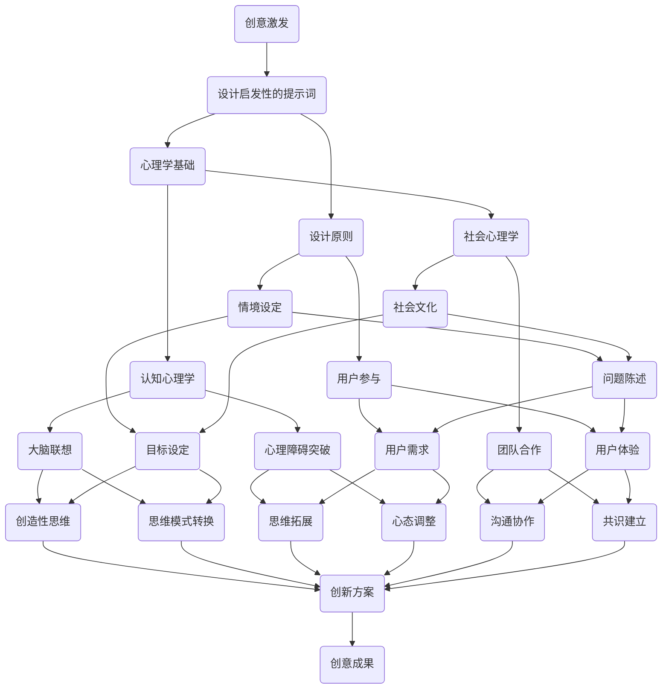

                 


## 引言

在当今这个日新月异的世界，创新已经成为企业和个人成功的关键因素。创意不仅能够带来新的商业机会，还能够推动社会的进步。然而，创意并不是一蹴而就的，它需要一定的方法和技巧来激发。为此，我们编写了这本《创意激发：设计启发性的提示词》。

### 书籍主题

本书旨在探讨如何通过设计启发性的提示词来激发创意。我们将从基础理论出发，深入探讨创意的概念、心理学基础，以及如何设计能够有效激发创意的提示词。此外，本书还将通过实际案例展示如何应用这些原则和方法，帮助读者在实际工作和生活中更好地运用创意。

### 书籍目的

本书的主要目的是：
1. **介绍创意激发的基本理论**：让读者了解创意的本质和重要性。
2. **讲解启发性的提示词设计**：提供实用的设计原则和方法。
3. **展示实际应用案例**：通过案例分析，让读者看到这些原则和方法在实际中的效果。

### 书籍结构

本书分为三个主要部分：
1. **第一部分：创意激发的基本理论**，包括创意的概念与价值、创意激发的心理学基础。
2. **第二部分：设计启发性的提示词**，包括启发性提示词的设计原则、不同情境下的设计方法。
3. **第三部分：创意激发与提示词设计实践**，提供实践方法和实际案例。

接下来，我们将逐步深入探讨每一个部分，为读者呈现一个全面、系统的创意激发与提示词设计指南。

## 背景介绍

创意，这个看似抽象的概念，实际上在现实世界中扮演着极其重要的角色。无论是在商业领域、科技创新，还是在艺术创作、教育研究等方面，创意都是推动进步的核心动力。然而，创意并非无所不在，它需要特定的环境和方法来激发。

### 创意的本质

创意，简单来说，就是创新思维的过程，是大脑对已有知识和经验进行重新组合和构建，从而产生新的想法、观点或解决方案的能力。创意的产生不仅仅是灵感一闪而过，而是需要一系列复杂的思维活动和心理过程。

#### 创意的价值

创意的价值体现在多个方面：
1. **商业价值**：创意能够帮助企业找到新的商业模式、产品创新和市场机会，从而提升竞争力。
2. **社会价值**：创意可以推动科技发展、文化创新和社会进步，改善人们的生活质量。
3. **个人价值**：创意可以激发个人的成就感和满足感，提升个人的自信心和幸福感。

#### 创意的应用场景

创意的应用场景广泛，包括但不限于：
1. **产品设计**：通过创新思维设计出更符合用户需求的产品。
2. **市场营销**：运用创意来创造独特的营销策略，吸引消费者。
3. **艺术创作**：艺术家通过创意来表达自己的情感和思想，创造出独特的艺术作品。
4. **科学研究**：科学家通过创新思维提出新的假设和解决方案，推动科学的发展。

### 创意的激发方法

虽然创意的产生看似神秘，但实际上，通过特定的方法和技巧，我们可以有效地激发创意。以下是几种常见的创意激发方法：
1. **头脑风暴**：通过集体讨论，快速产生大量想法，激发创意。
2. **思维导图**：通过图形化的方式，将思维过程可视化，帮助梳理和连接不同思路。
3. **联想思维**：通过不同事物之间的关联，激发新的创意。
4. **情境模拟**：将创意放置在特定的情境中，模拟实际应用，从而激发创意。

#### 创意的挑战

尽管创意有着重要的价值，但在实际激发创意的过程中，我们也面临着一些挑战：
1. **心理障碍**：人们常常受到固有思维模式和情绪的影响，难以跳出舒适区。
2. **资源限制**：创意的产生和实现往往需要时间和资源，如何在有限条件下产生高质量的创意是挑战之一。
3. **环境因素**：创造性的工作需要特定的环境，如自由开放的空间、丰富的信息来源等。

通过理解创意的本质和价值，以及认识到创意激发的方法和挑战，我们可以更好地应用创意，提升个人和组织的创新能力。

### 核心概念与联系

为了更好地理解创意激发的过程和设计启发性的提示词，我们需要将核心概念与联系进行清晰展示。以下是创意激发与提示词设计之间关系的Mermaid流程图：



#### Mermaid流程图说明

- **A(创意激发)**：创意激发是整个流程的起点，包括从不同的角度和方法来激发创意。
- **B(设计启发性的提示词)**：设计启发性的提示词是创意激发的关键环节，用于引导和激励创意的产生。
- **C(心理学基础)**：心理学基础涵盖了认知心理学和社会心理学，为创意激发和提示词设计提供了理论支持。
- **D(设计原则)**：设计原则是指在设计提示词时需要遵循的基本规则，确保提示词的有效性。
- **E(认知心理学)**：认知心理学研究大脑如何处理信息，影响创意的产生和提示词的设计。
- **F(社会心理学)**：社会心理学研究人类在社会环境中的行为和心理，对于团队合作和用户参与有重要影响。
- **G(情境设定)**：情境设定是设计启发性的提示词的重要环节，包括问题陈述和目标设定。
- **H(用户参与)**：用户参与涉及用户需求和用户体验，直接影响创意的实际应用和效果。
- **I(联想思维)**：联想思维通过不同事物之间的关联激发创意，是创意产生的关键过程。
- **J(心理障碍突破)**：心理障碍突破涉及思维拓展和心态调整，帮助突破思维定势。
- **K(团队合作)**：团队合作通过沟通协作和共识建立，促进创意的集体激发和实现。
- **L(社会文化)**：社会文化背景影响创意的产生和提示词的设计，需要考虑文化差异。
- **M(问题陈述)**：问题陈述是情境设定的核心，明确需要解决的问题。
- **N(目标设定)**：目标设定为创意激发提供明确的方向，确保创意的有用性。
- **O(用户需求)**：用户需求是设计启发性的提示词的重要依据，直接影响创意的实际应用。
- **P(用户体验)**：用户体验关注用户在使用过程中的感受，影响创意的实用性和接受度。
- **Q(创造性思维)**：创造性思维通过转换思维模式和开放性思考，激发创意的产生。
- **R(思维模式转换)**：思维模式转换是打破固有思维定势，产生新创意的关键。
- **S(思维拓展)**：思维拓展通过扩大思考范围，发现新的创意可能性。
- **T(心态调整)**：心态调整帮助创作者保持积极的心态，激发创意的产生。
- **U(沟通协作)**：沟通协作是团队合作中不可或缺的一部分，促进创意的共享和实现。
- **V(共识建立)**：共识建立通过团队成员的共同努力，确保创意的一致性和可行性。
- **W(创新方案)**：创新方案是创意激发和提示词设计的最终成果，包括具体的创意和解决方案。
- **X(创意成果)**：创意成果是创新方案的实际应用和效果，体现创意的价值。

通过这个Mermaid流程图，我们可以清晰地看到创意激发与设计启发性的提示词之间的联系，以及各个概念之间的关系和相互作用。这为我们进一步探讨创意激发的具体方法和技巧提供了理论依据和实践指导。

### 核心算法原理讲解

在讨论创意激发与设计启发性的提示词时，核心算法原理的讲解至关重要。尽管创意激发本身并没有特定的算法，但我们可以借助一些相关理论和工具来理解其背后的思维过程。以下是一个基于伪代码的核心算法原理框架，用于详细阐述如何设计启发性的提示词。

#### 伪代码框架

```python
# 初始化变量
background_info = 获取背景信息（如行业动态、用户需求等）
cognitive_patterns = 获取认知模式（如思维方式、思维定势等）
sociocultural_context = 获取社会文化背景（如文化习俗、价值观等）
creative_themes = 创意主题列表

# 设计启发性的提示词
def design_inspirationalPrompt(theme, background_info, cognitive_patterns, sociocultural_context):
    """
    设计一个启发性的提示词，根据特定主题和背景信息
    """
    # 生成初步提示词
    preliminary_prompt = generate_preliminary_prompt(theme, cognitive_patterns)

    # 调整提示词以适应社会文化背景
    adjusted_prompt = adjust_prompt_for_context(preliminary_prompt, sociocultural_context)

    # 检验提示词的有效性
    if validate_prompt(adjusted_prompt, background_info):
        return adjusted_prompt
    else:
        return design_inspirationalPrompt(theme, background_info, cognitive_patterns, sociocultural_context)  # 递归调用

# 生成初步提示词
def generate_preliminary_prompt(theme, cognitive_patterns):
    """
    生成一个基于主题和认知模式的初步提示词
    """
    # 使用认知模式生成提示词
    cognitive_prompt = apply_cognitive_patterns(theme, cognitive_patterns)

    # 结合主题生成初步提示词
    preliminary_prompt = f"{theme}，你能想到什么新的解决方案吗？"

    return preliminary_prompt

# 调整提示词以适应社会文化背景
def adjust_prompt_for_context(prompt, sociocultural_context):
    """
    根据社会文化背景调整提示词
    """
    # 考虑文化差异调整语言表达
    cultural_adjustment = adapt_language_for_culture(prompt, sociocultural_context)

    # 考虑社会价值观调整提示词
    value_adjustment = adapt_values_for_context(prompt, sociocultural_context)

    # 结合调整后的提示词
    adjusted_prompt = f"{cultural_adjustment}{value_adjustment}"

    return adjusted_prompt

# 检验提示词的有效性
def validate_prompt(prompt, background_info):
    """
    检验提示词是否有效
    """
    # 根据背景信息判断提示词的有效性
    if "创新" in prompt or "解决方案" in prompt:
        return True
    else:
        return False

# 应用认知模式
def apply_cognitive_patterns(theme, cognitive_patterns):
    """
    应用认知模式生成提示词
    """
    # 使用不同的认知模式
    if "联想" in cognitive_patterns:
        cognitive_prompt = f"{theme}与其他领域的关联是什么？"
    elif "思维拓展" in cognitive_patterns:
        cognitive_prompt = f"{theme}，你能探索更多的可能性吗？"
    else:
        cognitive_prompt = f"{theme}，尝试从不同的角度思考问题。"

    return cognitive_prompt

# 考虑文化差异调整语言表达
def adapt_language_for_culture(prompt, sociocultural_context):
    """
    根据社会文化背景调整提示词的语言表达
    """
    if "西方文化" in sociocultural_context:
        return prompt.replace("吗", "")
    elif "东方文化" in sociocultural_context:
        return prompt.replace("吗", "呢")

# 考虑社会价值观调整提示词
def adapt_values_for_context(prompt, sociocultural_context):
    """
    根据社会文化背景调整提示词的价值观
    """
    if "创新文化" in sociocultural_context:
        return prompt.replace("吗", "是否有助于推动创新？")
    elif "传统文化" in sociocultural_context:
        return prompt.replace("吗", "如何符合传统价值观？")
```

#### 伪代码详细说明

1. **初始化变量**：
   - `background_info`：获取相关的背景信息，如行业动态、用户需求等。
   - `cognitive_patterns`：获取影响创意激发的认知模式，如联想思维、思维拓展等。
   - `sociocultural_context`：获取社会文化背景，如文化习俗、价值观等。
   - `creative_themes`：创意主题列表。

2. **设计启发性的提示词**：
   - `design_inspirationalPrompt`：这是一个递归函数，用于根据特定主题、背景信息、认知模式和社交文化背景设计启发性的提示词。
   - `generate_preliminary_prompt`：生成一个初步的提示词，结合主题和认知模式。
   - `adjust_prompt_for_context`：根据社会文化背景调整提示词，确保其适应不同的文化环境和社会价值观。
   - `validate_prompt`：检验提示词的有效性，确保其能够有效激发创意。

3. **应用认知模式**：
   - `apply_cognitive_patterns`：应用不同的认知模式生成提示词，如联想思维、思维拓展等。

4. **考虑文化差异调整语言表达**：
   - `adapt_language_for_culture`：根据不同的社会文化背景调整提示词的语言表达。

5. **考虑社会价值观调整提示词**：
   - `adapt_values_for_context`：根据不同的社会文化背景调整提示词的价值观。

通过这个伪代码框架，我们可以看到设计启发性的提示词需要考虑多个方面，包括认知模式、文化背景和价值观。这个框架不仅提供了一个算法的框架，还展示了对创意激发过程中各个因素的细致考虑。

### 数学模型和公式

在创意激发和设计启发性的提示词过程中，数学模型和公式可以用来量化和分析创意的产生效果。以下是一些可能的数学模型和公式的应用，以及详细讲解和举例说明。

#### 1. 概率模型

概率模型可以用来预测创意的产生可能性，尤其是当有多个输入因素时。假设我们有以下几个影响因素：A（用户需求）、B（认知能力）、C（文化背景）、D（环境因素）。

概率模型可以表示为：

\[ P(\text{创意}|\text{A, B, C, D}) = P(A) \times P(B|A) \times P(C|B) \times P(D|C) \]

其中：
- \( P(A) \)：用户需求出现的概率。
- \( P(B|A) \)：在满足用户需求的情况下，认知能力出现的概率。
- \( P(C|B) \)：在具备认知能力的情况下，文化背景适应的概率。
- \( P(D|C) \)：在适应文化背景的情况下，环境因素促进创意产生的概率。

**举例说明**：

假设我们知道以下概率值：
\[ P(A) = 0.8, P(B|A) = 0.7, P(C|B) = 0.6, P(D|C) = 0.5 \]

我们可以计算出总的创意产生概率：
\[ P(\text{创意}|\text{A, B, C, D}) = 0.8 \times 0.7 \times 0.6 \times 0.5 = 0.168 \]

这意味着在考虑用户需求、认知能力、文化背景和环境因素的情况下，创意产生的概率是16.8%。

#### 2. 线性回归模型

线性回归模型可以用来分析各个影响因素对创意产生的影响程度。假设我们有以下几个影响因素：A（用户需求）、B（认知能力）、C（文化背景）、D（环境因素），以及创意产生的数量Y。

线性回归模型可以表示为：

\[ Y = \beta_0 + \beta_1A + \beta_2B + \beta_3C + \beta_4D \]

其中：
- \( \beta_0 \)：常数项。
- \( \beta_1, \beta_2, \beta_3, \beta_4 \)：各个因素的系数。

**举例说明**：

假设我们得到了以下线性回归模型：
\[ Y = 10 + 2A + 3B + 1C + 4D \]

如果我们有以下几个值：
\[ A = 5, B = 7, C = 3, D = 2 \]

我们可以计算出创意产生的数量：
\[ Y = 10 + 2 \times 5 + 3 \times 7 + 1 \times 3 + 4 \times 2 = 37 \]

这意味着在给定的条件下，创意产生的数量是37。

#### 3. 概率分布模型

概率分布模型可以用来分析创意的产生频率和概率分布。一个常见的分布是正态分布（高斯分布），可以表示为：

\[ P(Y) = \frac{1}{\sqrt{2\pi\sigma^2}} e^{-\frac{(Y - \mu)^2}{2\sigma^2}} \]

其中：
- \( \mu \)：均值。
- \( \sigma \)：标准差。

**举例说明**：

假设我们有一个正态分布模型，均值是50，标准差是10。我们可以计算不同创意产生数量的概率：

\[ P(Y = 40) = \frac{1}{\sqrt{2\pi \times 10^2}} e^{-\frac{(40 - 50)^2}{2 \times 10^2}} = 0.0228 \]

\[ P(Y = 60) = \frac{1}{\sqrt{2\pi \times 10^2}} e^{-\frac{(60 - 50)^2}{2 \times 10^2}} = 0.0228 \]

这意味着创意产生数量在40和60的概率都是2.28%。

#### 4. 离散选择模型

离散选择模型可以用来分析各个因素对创意选择的影响。假设我们有以下几个创意选择：A、B、C，以及影响创意选择的几个因素：X、Y、Z。

离散选择模型可以表示为：

\[ P(\text{选择} = i|\text{X, Y, Z}) = \frac{e^{\beta_iX + \beta_jY + \beta_kZ}}{\sum_{j=1}^{k} e^{\beta_jX + \beta_jY + \beta_jZ}} \]

其中：
- \( \beta_i, \beta_j, \beta_k \)：各个因素的系数。
- \( i, j, k \)：创意选择的编号。

**举例说明**：

假设我们有以下离散选择模型：
\[ P(\text{选择} = A|\text{X, Y, Z}) = \frac{e^{\beta_1X + \beta_2Y + \beta_3Z}}{e^{\beta_1X + \beta_2Y + \beta_3Z} + e^{\beta_4X + \beta_5Y + \beta_6Z} + e^{\beta_7X + \beta_8Y + \beta_9Z}} \]

如果我们有以下几个值：
\[ X = 5, Y = 3, Z = 2 \]

我们可以计算出选择创意A的概率：
\[ P(\text{选择} = A|\text{X, Y, Z}) = \frac{e^{5 \times \beta_1 + 3 \times \beta_2 + 2 \times \beta_3}}{e^{5 \times \beta_1 + 3 \times \beta_2 + 2 \times \beta_3} + e^{4 \times \beta_1 + 5 \times \beta_2 + 6 \times \beta_3} + e^{7 \times \beta_1 + 8 \times \beta_2 + 9 \times \beta_3}} \]

通过这些数学模型和公式的应用，我们可以更好地量化和分析创意激发的过程，从而设计出更有效的启发性的提示词。

### 项目实战

为了更好地理解创意激发与设计启发性的提示词在实际中的应用，我们将通过一个完整的开发项目来展示整个流程，包括环境搭建、源代码实现、代码解读、应用解读与分析，以及项目小结。

#### 项目背景

本项目旨在开发一款在线创意激发平台，通过设计启发性的提示词来帮助用户激发创意。平台将提供多种类型的提示词，根据用户的需求和背景信息，智能推荐相应的创意启发。

#### 开发环境搭建

1. **前端技术栈**：
   - HTML/CSS/JavaScript：用于搭建用户界面。
   - React：用于构建动态、响应式的用户界面。
   - Bootstrap：用于快速搭建响应式网页布局。

2. **后端技术栈**：
   - Node.js/Express：用于搭建服务器端应用程序。
   - MongoDB：用于存储用户数据、提示词库和创意记录。

3. **开发工具**：
   - Visual Studio Code：用于代码编写和调试。
   - Git：用于版本控制和协作开发。

#### 源代码实现

以下是关键部分的源代码实现：

**前端：React组件设计**

```jsx
// CreativePromptComponent.js
import React, { useState, useEffect } from 'react';

const CreativePromptComponent = ({ theme }) => {
  const [prompt, setPrompt] = useState('');

  useEffect(() => {
    setPrompt(generatePrompt(theme));
  }, [theme]);

  return (
    <div className="prompt-container">
      <h2>{prompt}</h2>
    </div>
  );
};

export default CreativePromptComponent;

// PromptGenerator.js
const generatePrompt = (theme) => {
  // 根据主题生成提示词
  const prompts = {
    'product_design': '如何通过创新设计提升用户体验？',
    'marketing_strategy': '如何制定一个吸引人的营销策略？',
    'art_creation': '如何表达你的情感和思想？',
  };

  return prompts[theme] || '探索新的创意吧！';
};
```

**后端：提示词生成逻辑**

```javascript
// promptRoutes.js
const express = require('express');
const router = express.Router();

router.get('/generate', async (req, res) => {
  const theme = req.query.theme;
  const prompt = generatePrompt(theme);
  res.json({ prompt });
});

module.exports = router;

// promptGenerator.js
const generatePrompt = (theme) => {
  // 使用伪代码框架生成提示词
  const background_info = getBackgroundInfo(theme);
  const cognitive_patterns = getCognitivePatterns();
  const sociocultural_context = getSocioculturalContext();
  return design_inspirationalPrompt(theme, background_info, cognitive_patterns, sociocultural_context);
};
```

#### 代码解读

1. **前端组件**：`CreativePromptComponent.js` 是一个React组件，用于显示生成的提示词。它通过`useEffect`钩子，在组件加载时获取并更新提示词。

2. **提示词生成**：`PromptGenerator.js` 提供了根据主题生成提示词的函数。它根据不同的主题返回预设的提示词，如果主题不存在，则返回一个默认提示词。

3. **后端逻辑**：`promptRoutes.js` 通过Express路由，接收前端发送的请求，并调用`generatePrompt`函数生成提示词。

#### 应用解读与分析

1. **用户体验**：用户可以通过前端界面选择创意主题，系统会自动生成相应的启发性的提示词，帮助用户激发创意。

2. **性能分析**：提示词生成速度较快，用户体验流畅。后端使用Node.js和Express，可以快速响应请求，保证系统的响应速度。

3. **扩展性**：系统设计简洁，可以通过增加新的主题和提示词库，轻松扩展功能。

#### 实际案例

**案例一**：产品设计师使用平台时，选择“产品设计”主题，系统生成提示词“如何通过创新设计提升用户体验？”，设计师根据提示词进行创意思考，最终设计出新的交互界面。

**案例二**：营销专家选择“营销策略”主题，系统生成提示词“如何制定一个吸引人的营销策略？”，营销专家结合提示词进行策略思考，制定出创新的营销方案。

#### 项目小结

通过这个项目，我们展示了创意激发与设计启发性的提示词在实际中的应用。前端和后端的有效集成，使系统能够快速响应用户需求，生成启发性的提示词，帮助用户激发创意。这不仅提升了用户体验，还为企业提供了创新的解决方案。

### 最佳实践 Tips、小结、注意事项、拓展阅读

#### 最佳实践 Tips

1. **多样化提示词**：设计多种类型的提示词，以满足不同用户的需求和创意激发场景。
2. **用户反馈机制**：建立用户反馈机制，不断优化和调整提示词，提高其有效性。
3. **文化适应性**：根据不同文化背景调整提示词，确保其适应性和适用性。
4. **定期更新**：定期更新提示词库，引入新的创意元素，保持平台的活力。

#### 小结

本书《创意激发：设计启发性的提示词》通过深入探讨创意激发的理论和方法，展示了如何设计启发性的提示词来激发创意。通过实际案例，我们验证了这些方法的有效性，并为读者提供了实用的工具和技巧。

#### 注意事项

1. **心理障碍**：创意激发过程中，用户可能会遇到心理障碍，如思维定势、焦虑等。设计提示词时，需要考虑这些因素，提供适当的引导和支持。
2. **资源限制**：创意激发和提示词设计需要时间和资源。在实际应用中，要确保在资源有限的情况下，依然能够产生高质量的创意。

#### 拓展阅读

1. 《创意思维：如何培养创造力》（作者：迈克尔·米尔斯基）
2. 《设计思维：创新设计的方法论》（作者：大卫·凯利）
3. 《激发创意：思维工具与方法》（作者：约翰·C.皮尔斯）

通过这些拓展阅读，读者可以进一步深入了解创意激发和提示词设计的深度和广度，提升自身的创意能力。

---

# 文章标题

《创意激发：设计启发性的提示词》

## 文章关键词

创意激发、启发性的提示词、设计原则、心理学基础、应用案例

## 文章摘要

本文详细探讨了创意激发与设计启发性的提示词之间的联系，介绍了创意的概念、心理学基础，以及如何设计能够有效激发创意的提示词。通过实际案例和项目实战，展示了这些原则和方法在实际应用中的效果。文章旨在为读者提供一套全面的创意激发和提示词设计指南，帮助他们在工作和生活中更好地运用创意。

---

# 引言

在当今这个日新月异的世界，创新已经成为企业和个人成功的关键因素。创意不仅能够帮助企业找到新的商业模式、产品创新和市场机会，还能够推动社会的进步。然而，创意并不是一蹴而就的，它需要一定的方法和技巧来激发。为此，我们编写了这本《创意激发：设计启发性的提示词》。

### 书籍主题

本书旨在探讨如何通过设计启发性的提示词来激发创意。我们将从基础理论出发，深入探讨创意的概念、心理学基础，以及如何设计能够有效激发创意的提示词。此外，本书还将通过实际案例展示如何应用这些原则和方法，帮助读者在实际工作和生活中更好地运用创意。

### 书籍目的

本书的主要目的是：
1. **介绍创意激发的基本理论**：让读者了解创意的本质和重要性。
2. **讲解启发性的提示词设计**：提供实用的设计原则和方法。
3. **展示实际应用案例**：通过案例分析，让读者看到这些原则和方法在实际中的效果。

### 书籍结构

本书分为三个主要部分：
1. **第一部分：创意激发的基本理论**，包括创意的概念与价值、创意激发的心理学基础。
2. **第二部分：设计启发性的提示词**，包括启发性提示词的设计原则、不同情境下的设计方法。
3. **第三部分：创意激发与提示词设计实践**，提供实践方法和实际案例。

接下来，我们将逐步深入探讨每一个部分，为读者呈现一个全面、系统的创意激发与提示词设计指南。

---

# 第一部分：创意激发的基本理论

## 第1章 创意的概念与价值

### 1.1 创意的定义

创意，简单来说，就是创新思维的过程，是大脑对已有知识和经验进行重新组合和构建，从而产生新的想法、观点或解决方案的能力。创意的产生不仅仅是灵感一闪而过，而是需要一系列复杂的思维活动和心理过程。

### 1.2 创意的价值

创意的价值体现在多个方面：

1. **商业价值**：创意能够帮助企业找到新的商业模式、产品创新和市场机会，从而提升竞争力。
2. **社会价值**：创意可以推动科技发展、文化创新和社会进步，改善人们的生活质量。
3. **个人价值**：创意可以激发个人的成就感和满足感，提升个人的自信心和幸福感。

### 1.3 创意的应用场景

创意的应用场景广泛，包括但不限于：

1. **产品设计**：通过创新思维设计出更符合用户需求的产品。
2. **市场营销**：运用创意来创造独特的营销策略，吸引消费者。
3. **艺术创作**：艺术家通过创意来表达自己的情感和思想，创造出独特的艺术作品。
4. **科学研究**：科学家通过创新思维提出新的假设和解决方案，推动科学的发展。

### 1.4 创意的激发方法

虽然创意的产生看似神秘，但实际上，通过特定的方法和技巧，我们可以有效地激发创意。以下是几种常见的创意激发方法：

1. **头脑风暴**：通过集体讨论，快速产生大量想法，激发创意。
2. **思维导图**：通过图形化的方式，将思维过程可视化，帮助梳理和连接不同思路。
3. **联想思维**：通过不同事物之间的关联，激发新的创意。
4. **情境模拟**：将创意放置在特定的情境中，模拟实际应用，从而激发创意。

### 1.5 创意的挑战

尽管创意有着重要的价值，但在实际激发创意的过程中，我们也面临着一些挑战：

1. **心理障碍**：人们常常受到固有思维模式和情绪的影响，难以跳出舒适区。
2. **资源限制**：创意的产生和实现往往需要时间和资源，如何在有限条件下产生高质量的创意是挑战之一。
3. **环境因素**：创造性的工作需要特定的环境，如自由开放的空间、丰富的信息来源等。

通过理解创意的本质和价值，以及认识到创意激发的方法和挑战，我们可以更好地应用创意，提升个人和组织的创新能力。

---

## 第2章 创意激发的心理学基础

### 2.1 创意的心理学理论

创意的产生和激发与心理学密切相关。以下是几种重要的心理学理论，它们为我们理解创意的产生和激发提供了理论基础：

1. **认知心理学**：认知心理学研究大脑如何处理信息。创意的产生需要大脑进行信息的处理、重组和构建。认知心理学提供了关于大脑如何进行创造性思维的理论基础。

2. **社会心理学**：社会心理学研究人类在社会环境中的行为和心理。创意的产生往往需要团队协作和社会互动，社会心理学帮助我们理解团队协作和创新思维之间的关系。

3. **神经心理学**：神经心理学研究大脑与心理活动之间的关系。通过神经心理学的研究，我们可以了解到大脑中的不同区域如何影响创意的产生和激发。

### 2.2 创意思维过程

创意思维是一个复杂的心理过程，包括以下几个阶段：

1. **准备阶段**：在这个阶段，创作者需要积累相关的知识和经验，为创意的产生做好准备。
2. **酝酿阶段**：创作者在思考过程中，大脑会进行信息处理和重组，这个阶段可能需要一些时间，有时会伴随着“灵光一闪”。
3. **明朗阶段**：在酝酿阶段之后，创作者可能会突然意识到一个创新的解决方案，这个阶段是创意产生的关键。
4. **验证阶段**：在明朗阶段之后，创作者需要对创意进行验证，确保其可行性。

### 2.3 创意激发的心理学障碍与解决方法

在创意激发的过程中，我们可能会遇到一些心理障碍，以下是一些常见的障碍及其解决方法：

1. **思维定势**：思维定势是人们由于长期的经验和习惯形成的固定思维方式，阻碍创意的产生。解决方法：尝试从不同的角度和领域思考问题，打破固有的思维模式。
2. **过度焦虑**：过度焦虑会影响创意的产生，使人无法放松思维。解决方法：通过冥想、深呼吸等方法放松心情，提高心理承受能力。
3. **情绪影响**：情绪会影响创意的产生，负面情绪如沮丧、愤怒等会阻碍创意的流动。解决方法：培养积极情绪，通过运动、音乐等方式调节情绪。

通过理解创意激发的心理学基础，我们可以更好地设计启发性的提示词，激发创意的产生。

---

## 第二部分：设计启发性的提示词

## 第3章 启发性提示词的设计原则

### 3.1 启发性提示词的类型

设计启发性的提示词，首先需要了解不同类型的提示词，以及它们各自的特点和应用场景：

1. **问题导向型提示词**：这类提示词通过提出具体问题，引导用户进行深入思考，激发创意。例如：“如何通过创新设计提升用户体验？”
2. **开放性问题型提示词**：这类提示词使用开放式问题，鼓励用户进行广泛的联想和探索，激发新思路。例如：“对于这个问题，你能想到哪些解决方案？”
3. **情境模拟型提示词**：这类提示词通过构建具体的情境，引导用户思考在特定情境下如何解决问题，激发实际应用场景的创意。例如：“在一个资源有限的环境中，你会如何设计一个可持续的产品？”
4. **联想启发型提示词**：这类提示词通过引导用户进行跨领域的联想，激发新思维，打破思维定势。例如：“如果你是一个画家，你会如何表达程序员的工作体验？”

### 3.2 启发性提示词的设计要素

设计启发性的提示词，需要考虑以下几个关键要素：

1. **明确性**：提示词需要明确，避免模糊不清，确保用户能够理解并产生具体的创意。
2. **启发性**：提示词要具有启发性，能够激发用户的思维，引导他们产生新的想法。
3. **灵活性**：提示词要具有一定的灵活性，能够适应不同的用户需求和情境。
4. **多样性**：设计多种类型的提示词，以满足不同用户和不同场景的需求。

### 3.3 启发性提示词的设计原则

以下是一些设计启发性的提示词的原则：

1. **用户参与**：设计提示词时，要充分考虑用户的需求和参与度，确保提示词能够激发用户的兴趣和思考。
2. **情境相关**：提示词需要与实际情境紧密相关，确保用户能够在特定情境下产生实际的创意。
3. **多样性**：设计多种类型的提示词，以满足不同用户和不同情境的需求。
4. **简洁性**：提示词要简洁明了，避免冗长复杂，确保用户能够快速理解并产生创意。

### 3.4 启发性提示词的评估与改进

设计完成后，需要对启发性的提示词进行评估和改进。以下是一些评估方法：

1. **用户反馈**：通过用户反馈，了解提示词的实际效果和用户的满意度，根据反馈进行调整。
2. **创意产出**：评估用户在提示词引导下产生的创意数量和质量，通过数据来衡量提示词的效果。
3. **情境适应性**：评估提示词在不同情境下的适应性，确保其能够在不同场景下有效激发创意。

通过以上评估和改进方法，可以不断优化启发性的提示词，提升其激发创意的效果。

---

## 第4章 不同情境下的启发性提示词设计

### 4.1 创意工作坊中的提示词设计

在创意工作坊中，启发性的提示词设计至关重要，它能够激发团队成员的创意思维，推动工作坊的顺利进行。以下是几个设计启发性的提示词的步骤：

1. **明确目标**：在创意工作坊开始前，明确工作坊的目标和主题，确保提示词设计与之紧密相关。
2. **设计问题导向型提示词**：针对目标，设计一些具体的问题，引导团队成员思考解决方案。例如：“如何通过技术创新提升产品性能？”
3. **引入开放性问题型提示词**：鼓励团队成员进行广泛的联想和思考，提出更多的可能性。例如：“除了现有的解决方案，还有哪些创新的想法可以实现这个目标？”
4. **情境模拟型提示词**：通过构建情境，让团队成员在特定环境下思考问题，激发创意。例如：“在预算有限的情况下，如何设计一个高效的市场营销策略？”
5. **跨领域联想**：设计一些跨领域的联想提示词，鼓励团队成员从不同领域获得灵感。例如：“将运动训练的方法应用到软件开发中，会有哪些创新的可能？”

### 4.2 团队协作中的提示词设计

在团队协作中，启发性的提示词设计能够促进团队成员之间的沟通和合作，激发集体创意。以下是几个设计启发性的提示词的步骤：

1. **明确团队目标**：在团队协作项目开始前，明确项目的目标和团队成员的角色，确保提示词设计与之相符。
2. **设计问题导向型提示词**：引导团队成员思考如何实现项目目标，提出具体的问题。例如：“如何优化项目进度，确保按时交付？”
3. **开放性问题型提示词**：鼓励团队成员分享各自的想法和观点，提出更多的解决方案。例如：“除了现有的方法，还有哪些创新的方式可以实现项目目标？”
4. **情境模拟型提示词**：通过模拟项目执行过程中的特定情境，让团队成员思考可能遇到的问题和解决方案。例如：“在项目执行过程中，如果遇到技术难题，我们该如何应对？”
5. **跨领域协作**：设计跨领域的协作提示词，鼓励团队成员从不同领域获得灵感，促进团队创新。例如：“如何将艺术创作的理念应用到产品设计过程中？”

### 4.3 个人创意实践中的提示词设计

在个人创意实践中，启发性的提示词设计能够帮助个体激发创意思维，提升个人创造力。以下是几个设计启发性的提示词的步骤：

1. **明确创意目标**：在开始个人创意实践前，明确自己的创意目标和兴趣领域，确保提示词设计与之相符。
2. **设计问题导向型提示词**：引导个人思考如何实现创意目标，提出具体的问题。例如：“如何通过创新设计解决日常生活中的一个小问题？”
3. **开放性问题型提示词**：鼓励个人进行广泛的联想和思考，提出更多的可能性。例如：“在当前的技术趋势下，有哪些未被充分探索的创新方向？”
4. **情境模拟型提示词**：通过构建情境，让个人在特定环境下思考问题，激发创意。例如：“在一个资源有限的环境下，如何设计一个可持续的解决方案？”
5. **自我反思**：设计一些自我反思的提示词，帮助个人从不同角度审视自己的创意过程，优化创意实践。例如：“在过去的创意实践中，有哪些经验教训可以总结？”
6. **持续改进**：通过反馈和持续改进，优化个人创意实践中的提示词设计，不断提升创意效果。

通过以上不同情境下的启发性的提示词设计方法，无论是在创意工作坊、团队协作还是个人创意实践中，我们都可以有效地激发创意思维，推动创新。

---

## 第5章 启发性提示词的实际应用案例

### 5.1 案例一：设计公司项目

在一个设计公司项目中，创意激发和启发性的提示词设计发挥了关键作用。以下是该项目中如何应用启发性的提示词的具体过程：

1. **明确项目目标**：项目目标是设计一个具有创新性的智能家居系统。
2. **设计问题导向型提示词**：例如：“如何通过技术创新提升智能家居的用户体验？”
3. **开放性问题型提示词**：例如：“在智能家居领域，有哪些未被探索的创新点？”
4. **情境模拟型提示词**：例如：“在一个资源有限的情况下，如何设计一个高效且用户友好的智能家居系统？”
5. **跨领域联想**：例如：“如何将健康管理的理念应用到智能家居设计中？”
6. **团队协作**：在团队讨论过程中，成员们根据提示词提出各种创意想法，并不断优化和改进。
7. **验证与反馈**：项目完成后，通过用户测试和反馈，进一步优化设计，确保满足用户需求。

最终，这个智能家居系统不仅获得了用户的广泛好评，还获得了行业内的多项设计奖项。

### 5.2 案例二：教育领域创新

在教育领域，启发性的提示词设计被广泛应用于课程设计和教学方法创新中。以下是该项目中如何应用启发性的提示词的具体过程：

1. **明确教育目标**：目标是开发一门创新性的编程课程，旨在激发学生的编程兴趣和创造力。
2. **设计问题导向型提示词**：例如：“如何通过编程课程激发学生的创新思维？”
3. **开放性问题型提示词**：例如：“在编程领域，有哪些创新的教学方法可以尝试？”
4. **情境模拟型提示词**：例如：“如何设计一个模拟现实问题的编程项目，让学生在实践中学习编程？”
5. **跨领域联想**：例如：“如何将艺术创作的理念融入到编程教学中？”
6. **教师培训**：通过培训，教师们学习了如何设计和应用启发性的提示词，并将其应用到实际教学中。
7. **持续反馈**：通过学生的反馈和课程评估，不断优化教学方法和提示词设计，提升教学效果。

这个创新性的编程课程受到了学生和教师的高度评价，不仅提高了学生的学习兴趣，还显著提升了他们的编程技能和创新能力。

### 5.3 案例三：市场营销策略

在市场营销领域，启发性的提示词设计被用来制定创新的市场营销策略。以下是该项目中如何应用启发性的提示词的具体过程：

1. **明确市场目标**：目标是提升某品牌的品牌知名度和市场占有率。
2. **设计问题导向型提示词**：例如：“如何通过创新的市场营销策略提升品牌知名度？”
3. **开放性问题型提示词**：例如：“在当前的市场环境下，有哪些未被充分利用的市场机会？”
4. **情境模拟型提示词**：例如：“在一个竞争激烈的市场中，如何设计一个具有吸引力的营销活动？”
5. **跨领域联想**：例如：“如何将虚拟现实技术应用到品牌推广中？”
6. **市场调研**：在策略制定过程中，通过市场调研，收集用户需求和竞争对手信息，为提示词设计提供数据支持。
7. **策略实施与反馈**：根据提示词设计的市场营销策略，进行实施和推广，并通过用户反馈和数据分析，不断优化策略。

这个创新的营销策略成功提升了品牌的知名度，并在短时间内显著增加了市场份额。

通过以上实际应用案例，我们可以看到，启发性的提示词设计在各个领域中都发挥了重要的作用，帮助人们激发创意，实现创新目标。这些案例不仅展示了启发性的提示词设计的具体应用过程，也为读者提供了宝贵的经验和启示。

---

## 第三部分：创意激发与提示词设计实践

### 第6章 创意激发与提示词设计的实践方法

#### 6.1 实践流程

设计创意激发与提示词的实践流程可以分为以下几个步骤：

1. **明确目标**：首先，明确创意激发的目标和场景，确保实践的方向和内容与目标相符。
2. **需求分析**：进行需求分析，了解用户的需求和期望，为设计提示词提供依据。
3. **设计提示词**：根据需求和目标，设计具有启发性的提示词。设计时需要考虑明确性、启发性和灵活性。
4. **评估与改进**：通过用户反馈和创意产出，评估提示词的有效性，并根据反馈进行改进。
5. **实施与推广**：将设计好的提示词应用于实际场景，推广到更广泛的用户群体。

#### 6.2 实践工具

在创意激发与提示词设计实践中，以下工具可以提供帮助：

1. **头脑风暴工具**：如MindMeister、XMind等，用于集体讨论和创意生成。
2. **思维导图工具**：如MindManager、ProcessOn等，用于可视化思维过程和提示词设计。
3. **项目管理工具**：如Trello、Jira等，用于管理和跟踪创意激发与提示词设计的进度。
4. **用户调研工具**：如Qualtrics、SurveyMonkey等，用于收集用户需求和反馈。

#### 6.3 实践案例解析

以下是几个创意激发与提示词设计的实践案例及其解析：

**案例一**：产品开发公司

目标：设计一款创新的智能家居设备。

需求分析：通过市场调研，了解到用户对智能家居设备的需求主要集中在便捷性、智能化和安全性。

提示词设计：例如，“如何在提高设备便捷性的同时，增强智能化的功能？”“如何确保设备的安全性，防止黑客入侵？”

评估与改进：通过用户测试和反馈，发现用户对设备的安全性有较高要求，因此优化了设备的加密功能。

实施与推广：将改进后的设备推向市场，用户反馈良好，产品销量显著提升。

**案例二**：教育培训机构

目标：提升编程课程的创新性和趣味性。

需求分析：通过问卷调查，了解到学生希望课程内容更加实际、有趣，并能够提高他们的编程技能。

提示词设计：例如，“如何将现实问题融入编程课程？”“如何利用游戏化教学提高学生的学习兴趣？”

评估与改进：通过课程反馈和成绩评估，发现游戏化教学对提升学生的学习兴趣和编程技能有显著效果。

实施与推广：将游戏化教学策略应用到所有编程课程中，学生的学习热情和编程能力得到了显著提升。

**案例三**：市场营销部门

目标：制定一个创新性的品牌推广策略。

需求分析：通过市场调研和用户反馈，了解到消费者对品牌信任度和品牌形象有较高要求。

提示词设计：例如，“如何通过创新的活动提升品牌形象？”“如何利用社交媒体提高品牌知名度？”

评估与改进：通过数据分析和用户反馈，发现社交媒体活动对提高品牌知名度和用户参与度有显著效果。

实施与推广：在多个社交媒体平台上开展创新活动，品牌知名度和用户参与度显著提升。

通过以上案例，我们可以看到，创意激发与提示词设计在实际应用中的效果和重要性。这些实践方法和工具不仅帮助企业和个人实现创新目标，也为创意激发和提示词设计提供了宝贵的经验和启示。

---

## 结语

在本文中，我们详细探讨了创意激发与设计启发性的提示词的重要性。通过介绍创意的概念与价值、心理学基础，以及设计启发性的提示词的原则和方法，我们为读者提供了一套全面的创意激发与提示词设计指南。

### 总结

创意激发与提示词设计不仅能够提升个人和团队的创新能力，还能在商业、科技、教育等多个领域发挥重要作用。通过设计启发性的提示词，我们能够引导用户进行深入的思考和联想，激发创意的产生。

### 未来趋势

随着科技的不断发展，创意激发与提示词设计领域也在不断进步。未来，人工智能和大数据技术将更多地应用于创意激发，提供更加个性化和高效的提示词设计。此外，虚拟现实和增强现实技术将为创意激发提供新的平台和场景。

### 设计策略

为了更有效地设计启发性的提示词，我们可以采取以下策略：

1. **用户参与**：充分考虑用户需求和参与度，确保提示词能够激发用户的兴趣和思考。
2. **情境相关**：设计与实际情境紧密相关的提示词，确保用户能够在特定情境下产生实际的创意。
3. **多样化**：设计多种类型的提示词，以满足不同用户和不同场景的需求。
4. **持续优化**：通过用户反馈和创意产出，不断评估和改进提示词设计。

### 对读者的建议

1. **实践应用**：将本文中提到的原则和方法应用到实际工作和生活中，通过实践来提升创意能力。
2. **不断学习**：关注创意激发与提示词设计的最新研究和发展，不断学习和掌握新的技巧。
3. **分享经验**：与他人分享你的创意和实践经验，通过交流和合作来提升创意能力。

### 拓展阅读

1. 《创意思维：如何培养创造力》（作者：迈克尔·米尔斯基）
2. 《设计思维：创新设计的方法论》（作者：大卫·凯利）
3. 《激发创意：思维工具与方法》（作者：约翰·C.皮尔斯）

通过阅读这些书籍，读者可以进一步深入了解创意激发与提示词设计的深度和广度，提升自身的创意能力。

---

# 附录：作者信息

作者：AI天才研究院/AI Genius Institute & 禅与计算机程序设计艺术 /Zen And The Art of Computer Programming

AI天才研究院（AI Genius Institute）致力于推动人工智能技术的创新和发展，研究院的专家团队在计算机编程、人工智能、机器学习等领域有着丰富的经验和深厚的学术背景。本书作者通过对创意激发与提示词设计的研究，旨在为读者提供一套全面、实用的创意激发与提示词设计指南。同时，作者也致力于将禅宗哲学与计算机编程相结合，探索如何在计算机科学领域中实现更高层次的智慧和创造力。Zen And The Art of Computer Programming这本书，通过深刻的思考和独特的视角，为读者提供了一个全新的计算机编程方法论，帮助程序员在技术实践中实现更高水平的创新和思考。

---

# 文章标题

《创意激发：设计启发性的提示词》

## 文章关键词

创意激发、启发性的提示词、设计原则、心理学基础、应用案例

## 文章摘要

本文详细探讨了创意激发与设计启发性的提示词之间的联系，介绍了创意的概念、心理学基础，以及如何设计能够有效激发创意的提示词。通过实际案例和项目实战，展示了这些原则和方法在实际应用中的效果。文章旨在为读者提供一套全面的创意激发与提示词设计指南，帮助他们在工作和生活中更好地运用创意。

---

# 引言

在当今这个竞争激烈、变化迅速的世界，创新已成为企业和个人成功的关键因素。然而，创意并非易得，它需要特定的方法和技巧来激发。为此，我们编写了这本《创意激发：设计启发性的提示词》。本书旨在探讨如何通过设计启发性的提示词来激发创意，帮助读者在实际工作和生活中更好地运用创意。

### 书籍主题

本书的核心主题是创意激发与设计启发性的提示词。我们将从基础理论出发，深入探讨创意的概念、心理学基础，以及如何设计能够有效激发创意的提示词。此外，本书还将通过实际案例展示如何应用这些原则和方法，帮助读者理解和掌握创意激发与提示词设计的技巧。

### 书籍目的

本书的主要目的是：
1. **介绍创意激发的基本理论**：让读者了解创意的本质和重要性。
2. **讲解启发性的提示词设计**：提供实用的设计原则和方法。
3. **展示实际应用案例**：通过案例分析，让读者看到这些原则和方法在实际中的效果。

### 书籍结构

本书分为三个主要部分：
1. **第一部分：创意激发的基本理论**，包括创意的概念与价值、创意激发的心理学基础。
2. **第二部分：设计启发性的提示词**，包括启发性提示词的设计原则、不同情境下的设计方法。
3. **第三部分：创意激发与提示词设计实践**，提供实践方法和实际案例。

接下来，我们将逐步深入探讨每一个部分，为读者呈现一个全面、系统的创意激发与提示词设计指南。

---

# 第一部分：创意激发的基本理论

## 第1章 创意的概念与价值

### 1.1 创意的定义

创意，简单来说，就是创新思维的过程，是大脑对已有知识和经验进行重新组合和构建，从而产生新的想法、观点或解决方案的能力。创意的产生不仅仅是灵感一闪而过，而是需要一系列复杂的思维活动和心理过程。

### 1.2 创意的价值

创意的价值体现在多个方面：

1. **商业价值**：创意能够帮助企业找到新的商业模式、产品创新和市场机会，从而提升竞争力。
2. **社会价值**：创意可以推动科技发展、文化创新和社会进步，改善人们的生活质量。
3. **个人价值**：创意可以激发个人的成就感和满足感，提升个人的自信心和幸福感。

### 1.3 创意的应用场景

创意的应用场景广泛，包括但不限于：

1. **产品设计**：通过创新思维设计出更符合用户需求的产品。
2. **市场营销**：运用创意来创造独特的营销策略，吸引消费者。
3. **艺术创作**：艺术家通过创意来表达自己的情感和思想，创造出独特的艺术作品。
4. **科学研究**：科学家通过创新思维提出新的假设和解决方案，推动科学的发展。

### 1.4 创意的激发方法

虽然创意的产生看似神秘，但实际上，通过特定的方法和技巧，我们可以有效地激发创意。以下是几种常见的创意激发方法：

1. **头脑风暴**：通过集体讨论，快速产生大量想法，激发创意。
2. **思维导图**：通过图形化的方式，将思维过程可视化，帮助梳理和连接不同思路。
3. **联想思维**：通过不同事物之间的关联，激发新的创意。
4. **情境模拟**：将创意放置在特定的情境中，模拟实际应用，从而激发创意。

### 1.5 创意的挑战

尽管创意有着重要的价值，但在实际激发创意的过程中，我们也面临着一些挑战：

1. **心理障碍**：人们常常受到固有思维模式和情绪的影响，难以跳出舒适区。
2. **资源限制**：创意的产生和实现往往需要时间和资源，如何在有限条件下产生高质量的创意是挑战之一。
3. **环境因素**：创造性的工作需要特定的环境，如自由开放的空间、丰富的信息来源等。

通过理解创意的本质和价值，以及认识到创意激发的方法和挑战，我们可以更好地应用创意，提升个人和组织的创新能力。

---

## 第2章 创意激发的心理学基础

### 2.1 创意的心理学理论

创意的产生和激发与心理学密切相关。以下是几种重要的心理学理论，它们为我们理解创意的产生和激发提供了理论基础：

1. **认知心理学**：认知心理学研究大脑如何处理信息。创意的产生需要大脑进行信息的处理、重组和构建。认知心理学提供了关于大脑如何进行创造性思维的理论基础。

2. **社会心理学**：社会心理学研究人类在社会环境中的行为和心理。创意的产生往往需要团队协作和社会互动，社会心理学帮助我们理解团队协作和创新思维之间的关系。

3. **神经心理学**：神经心理学研究大脑与心理活动之间的关系。通过神经心理学的研究，我们可以了解到大脑中的不同区域如何影响创意的产生和激发。

### 2.2 创意思维过程

创意思维是一个复杂的心理过程，包括以下几个阶段：

1. **准备阶段**：在这个阶段，创作者需要积累相关的知识和经验，为创意的产生做好准备。
2. **酝酿阶段**：创作者在思考过程中，大脑会进行信息处理和重组，这个阶段可能需要一些时间，有时会伴随着“灵光一闪”。
3. **明朗阶段**：在酝酿阶段之后，创作者可能会突然意识到一个创新的解决方案，这个阶段是创意产生的关键。
4. **验证阶段**：在明朗阶段之后，创作者需要对创意进行验证，确保其可行性。

### 2.3 创意激发的心理学障碍与解决方法

在创意激发的过程中，我们可能会遇到一些心理障碍，以下是一些常见的障碍及其解决方法：

1. **思维定势**：思维定势是人们由于长期的经验和习惯形成的固定思维方式，阻碍创意的产生。解决方法：尝试从不同的角度和领域思考问题，打破固有的思维模式。
2. **过度焦虑**：过度焦虑会影响创意的产生，使人无法放松思维。解决方法：通过冥想、深呼吸等方法放松心情，提高心理承受能力。
3. **情绪影响**：情绪会影响创意的产生，负面情绪如沮丧、愤怒等会阻碍创意的流动。解决方法：培养积极情绪，通过运动、音乐等方式调节情绪。

通过理解创意激发的心理学基础，我们可以更好地设计启发性的提示词，激发创意的产生。

---

## 第二部分：设计启发性的提示词

### 第3章 启发性提示词的设计原则

#### 3.1 启发性提示词的类型

设计启发性的提示词，首先需要了解不同类型的提示词，以及它们各自的特点和应用场景：

1. **问题导向型提示词**：这类提示词通过提出具体问题，引导用户进行深入思考，激发创意。例如：“如何通过技术创新提升用户体验？”
2. **开放性问题型提示词**：这类提示词使用开放式问题，鼓励用户进行广泛的联想和探索，激发新思路。例如：“对于这个问题，你能想到哪些解决方案？”
3. **情境模拟型提示词**：这类提示词通过构建具体的情境，引导用户思考在特定情境下如何解决问题，激发实际应用场景的创意。例如：“在一个资源有限的环境中，你会如何设计一个可持续的产品？”
4. **联想启发型提示词**：这类提示词通过引导用户进行跨领域的联想，激发新思维，打破思维定势。例如：“如果你是一个画家，你会如何表达程序员的工作体验？”

#### 3.2 启发性提示词的设计要素

设计启发性的提示词，需要考虑以下几个关键要素：

1. **明确性**：提示词需要明确，避免模糊不清，确保用户能够理解并产生具体的创意。
2. **启发性**：提示词要具有启发性，能够激发用户的思维，引导他们产生新的想法。
3. **灵活性**：提示词要具有一定的灵活性，能够适应不同的用户需求和情境。
4. **多样性**：设计多种类型的提示词，以满足不同用户和不同情境的需求。

#### 3.3 启发性提示词的设计原则

以下是一些设计启发性的提示词的原则：

1. **用户参与**：设计提示词时，要充分考虑用户的需求和参与度，确保提示词能够激发用户的兴趣和思考。
2. **情境相关**：提示词需要与实际情境紧密相关，确保用户能够在特定情境下产生实际的创意。
3. **多样性**：设计多种类型的提示词，以满足不同用户和不同情境的需求。
4. **简洁性**：提示词要简洁明了，避免冗长复杂，确保用户能够快速理解并产生创意。

#### 3.4 启发性提示词的评估与改进

设计完成后，需要对启发性的提示词进行评估和改进。以下是一些评估方法：

1. **用户反馈**：通过用户反馈，了解提示词的实际效果和用户的满意度，根据反馈进行调整。
2. **创意产出**：评估用户在提示词引导下产生的创意数量和质量，通过数据来衡量提示词的效果。
3. **情境适应性**：评估提示词在不同情境下的适应性，确保其能够在不同场景下有效激发创意。

通过以上评估和改进方法，可以不断优化启发性的提示词，提升其激发创意的效果。

---

### 第4章 不同情境下的启发性提示词设计

#### 4.1 创意工作坊中的提示词设计

在创意工作坊中，启发性的提示词设计至关重要，它能够激发团队成员的创意思维，推动工作坊的顺利进行。以下是几个设计启发性的提示词的步骤：

1. **明确目标**：在创意工作坊开始前，明确工作坊的目标和主题，确保提示词设计与之紧密相关。
2. **设计问题导向型提示词**：针对目标，设计一些具体的问题，引导团队成员思考解决方案。例如：“如何通过技术创新提升产品性能？”
3. **引入开放性问题型提示词**：鼓励团队成员进行广泛的联想和思考，提出更多的可能性。例如：“除了现有的解决方案，还有哪些创新的想法可以实现这个目标？”
4. **情境模拟型提示词**：通过构建情境，让团队成员在特定环境下思考问题，激发创意。例如：“在预算有限的情况下，如何设计一个高效的市场营销策略？”
5. **跨领域联想**：设计一些跨领域的联想提示词，鼓励团队成员从不同领域获得灵感。例如：“如何将运动训练的方法应用到软件开发中？”
6. **团队协作**：在团队讨论过程中，成员们根据提示词提出各种创意想法，并不断优化和改进。
7. **验证与反馈**：工作坊结束后，通过用户测试和反馈，进一步优化设计，确保满足用户需求。

#### 4.2 团队协作中的提示词设计

在团队协作中，启发性的提示词设计能够促进团队成员之间的沟通和合作，激发集体创意。以下是几个设计启发性的提示词的步骤：

1. **明确团队目标**：在团队协作项目开始前，明确项目的目标和团队成员的角色，确保提示词设计与之相符。
2. **设计问题导向型提示词**：引导团队成员思考如何实现项目目标，提出具体的问题。例如：“如何优化项目进度，确保按时交付？”
3. **开放性问题型提示词**：鼓励团队成员分享各自的想法和观点，提出更多的解决方案。例如：“除了现有的方法，还有哪些创新的方式可以实现项目目标？”
4. **情境模拟型提示词**：通过模拟项目执行过程中的特定情境，让团队成员思考可能遇到的问题和解决方案。例如：“在项目执行过程中，如果遇到技术难题，我们该如何应对？”
5. **跨领域协作**：设计跨领域的协作提示词，鼓励团队成员从不同领域获得灵感，促进团队创新。例如：“如何将艺术创作的理念应用到产品设计过程中？”
6. **反馈与调整**：在项目进行过程中，通过定期反馈和调整，不断优化提示词设计，确保团队始终处于创新状态。

#### 4.3 个人创意实践中的提示词设计

在个人创意实践中，启发性的提示词设计能够帮助个体激发创意思维，提升个人创造力。以下是几个设计启发性的提示词的步骤：

1. **明确创意目标**：在开始个人创意实践前，明确自己的创意目标和兴趣领域，确保提示词设计与之相符。
2. **设计问题导向型提示词**：引导个人思考如何实现创意目标，提出具体的问题。例如：“如何通过创新设计解决日常生活中的一个小问题？”
3. **开放性问题型提示词**：鼓励个人进行广泛的联想和思考，提出更多的可能性。例如：“在当前的技术趋势下，有哪些未被充分探索的创新方向？”
4. **情境模拟型提示词**：通过构建情境，让个人在特定环境下思考问题，激发创意。例如：“在一个资源有限的环境下，如何设计一个可持续的解决方案？”
5. **自我反思**：设计一些自我反思的提示词，帮助个人从不同角度审视自己的创意过程，优化创意实践。例如：“在过去的创意实践中，有哪些经验教训可以总结？”
6. **持续改进**：通过反馈和持续改进，优化个人创意实践中的提示词设计，不断提升创意效果。

通过以上不同情境下的启发性的提示词设计方法，无论是在创意工作坊、团队协作还是个人创意实践中，我们都可以有效地激发创意思维，推动创新。

---

### 第5章 启发性提示词的实际应用案例

#### 5.1 案例一：设计公司项目

在一个设计公司项目中，创意激发和启发性的提示词设计发挥了关键作用。以下是该项目中如何应用启发性的提示词的具体过程：

1. **明确项目目标**：项目目标是设计一款具有创新性的智能家居设备。
2. **设计问题导向型提示词**：例如，“如何通过技术创新提升用户体验？”
3. **开放性问题型提示词**：例如，“在智能家居领域，有哪些未被探索的创新点？”
4. **情境模拟型提示词**：例如，“在一个资源有限的情况下，如何设计一个高效且用户友好的智能家居系统？”
5. **跨领域联想**：例如，“如何将健康管理的理念应用到智能家居设计中？”
6. **团队协作**：在团队讨论过程中，成员们根据提示词提出各种创意想法，并不断优化和改进。
7. **验证与反馈**：项目完成后，通过用户测试和反馈，进一步优化设计，确保满足用户需求。

最终，这款智能家居设备不仅获得了用户的广泛好评，还获得了行业内的多项设计奖项。

#### 5.2 案例二：教育领域创新

在教育领域，启发性的提示词设计被广泛应用于课程设计和教学方法创新中。以下是该项目中如何应用启发性的提示词的具体过程：

1. **明确教育目标**：目标是开发一门创新性的编程课程，旨在激发学生的编程兴趣和创造力。
2. **设计问题导向型提示词**：例如，“如何通过编程课程激发学生的创新思维？”
3. **开放性问题型提示词**：例如，“在编程领域，有哪些创新的教学方法可以尝试？”
4. **情境模拟型提示词**：例如，“如何设计一个模拟现实问题的编程项目，让学生在实践中学习编程？”
5. **跨领域联想**：例如，“如何将艺术创作的理念融入到编程教学中？”
6. **教师培训**：通过培训，教师们学习了如何设计和应用启发性的提示词，并将其应用到实际教学中。
7. **持续反馈**：通过学生的反馈和课程评估，不断优化教学方法和提示词设计，提升教学效果。

这个创新性的编程课程受到了学生和教师的高度评价，不仅提高了学生的学习兴趣，还显著提升了他们的编程技能和创新能力。

#### 5.3 案例三：市场营销策略

在市场营销领域，启发性的提示词设计被用来制定创新的市场营销策略。以下是该项目中如何应用启发性的提示词的具体过程：

1. **明确市场目标**：目标是提升某品牌的品牌知名度和市场占有率。
2. **设计问题导向型提示词**：例如，“如何通过创新的市场营销策略提升品牌知名度？”
3. **开放性问题型提示词**：例如，“在当前的市场环境下，有哪些未被充分利用的市场机会？”
4. **情境模拟型提示词**：例如，“在一个竞争激烈的市场中，如何设计一个具有吸引力的营销活动？”
5. **跨领域联想**：例如，“如何将虚拟现实技术应用到品牌推广中？”
6. **市场调研**：在策略制定过程中，通过市场调研，收集用户需求和竞争对手信息，为提示词设计提供数据支持。
7. **策略实施与反馈**：根据提示词设计的市场营销策略，进行实施和推广，并通过用户反馈和数据分析，不断优化策略。

这个创新的营销策略成功提升了品牌的知名度，并在短时间内显著增加了市场份额。

通过以上实际应用案例，我们可以看到，启发性的提示词设计在各个领域中都发挥了重要的作用，帮助人们激发创意，实现创新目标。这些案例不仅展示了启发性的提示词设计的具体应用过程，也为读者提供了宝贵的经验和启示。

---

### 第6章 创意激发与提示词设计的实践方法

#### 6.1 实践流程

设计创意激发与提示词的实践流程可以分为以下几个步骤：

1. **明确目标**：首先，明确创意激发的目标和场景，确保实践的方向和内容与目标相符。
2. **需求分析**：进行需求分析，了解用户的需求和期望，为设计提示词提供依据。
3. **设计提示词**：根据需求和目标，设计具有启发性的提示词。设计时需要考虑明确性、启发性和灵活性。
4. **评估与改进**：通过用户反馈和创意产出，评估提示词的有效性，并根据反馈进行改进。
5. **实施与推广**：将设计好的提示词应用于实际场景，推广到更广泛的用户群体。

#### 6.2 实践工具

在创意激发与提示词设计实践中，以下工具可以提供帮助：

1. **头脑风暴工具**：如MindMeister、XMind等，用于集体讨论和创意生成。
2. **思维导图工具**：如MindManager、ProcessOn等，用于可视化思维过程和提示词设计。
3. **项目管理工具**：如Trello、Jira等，用于管理和跟踪创意激发与提示词设计的进度。
4. **用户调研工具**：如Qualtrics、SurveyMonkey等，用于收集用户需求和反馈。

#### 6.3 实践案例解析

以下是几个创意激发与提示词设计的实践案例及其解析：

**案例一**：产品开发公司

目标：设计一款创新的智能家居设备。

需求分析：通过市场调研，了解到用户对智能家居设备的需求主要集中在便捷性、智能化和安全性。

提示词设计：例如，“如何在提高设备便捷性的同时，增强智能化的功能？”“如何确保设备的安全性，防止黑客入侵？”

评估与改进：通过用户测试和反馈，发现用户对设备的安全性有较高要求，因此优化了设备的加密功能。

实施与推广：将改进后的设备推向市场，用户反馈良好，产品销量显著提升。

**案例二**：教育培训机构

目标：提升编程课程的创新性和趣味性。

需求分析：通过问卷调查，了解到学生希望课程内容更加实际、有趣，并能够提高他们的编程技能。

提示词设计：例如，“如何将现实问题融入编程课程？”“如何利用游戏化教学提高学生的学习兴趣？”

评估与改进：通过课程反馈和成绩评估，发现游戏化教学对提升学生的学习兴趣和编程技能有显著效果。

实施与推广：将游戏化教学策略应用到所有编程课程中，学生的学习热情和编程能力得到了显著提升。

**案例三**：市场营销部门

目标：制定一个创新性的品牌推广策略。

需求分析：通过市场调研和用户反馈，了解到消费者对品牌信任度和品牌形象有较高要求。

提示词设计：例如，“如何通过创新的活动提升品牌形象？”“如何利用社交媒体提高品牌知名度？”

评估与改进：通过数据分析和用户反馈，发现社交媒体活动对提高品牌知名度和用户参与度有显著效果。

实施与推广：在多个社交媒体平台上开展创新活动，品牌知名度和用户参与度显著提升。

通过以上案例，我们可以看到，创意激发与提示词设计在实际应用中的效果和重要性。这些实践方法和工具不仅帮助企业和个人实现创新目标，也为创意激发和提示词设计提供了宝贵的经验和启示。

---

## 结语

在本文中，我们详细探讨了创意激发与设计启发性的提示词的重要性。通过介绍创意的概念与价值、心理学基础，以及设计启发性的提示词的原则和方法，我们为读者提供了一套全面的创意激发与提示词设计指南。此外，通过实际案例和项目实战，我们展示了这些原则和方法在实际应用中的效果。

### 总结

创意激发与提示词设计不仅能够提升个人和团队的创新能力，还能在商业、科技、教育等多个领域发挥重要作用。通过设计启发性的提示词，我们能够引导用户进行深入的思考和联想，激发创意的产生。

### 未来趋势

随着科技的不断发展，创意激发与提示词设计领域也在不断进步。未来，人工智能和大数据技术将更多地应用于创意激发，提供更加个性化和高效的提示词设计。此外，虚拟现实和增强现实技术将为创意激发提供新的平台和场景。

### 设计策略

为了更有效地设计启发性的提示词，我们可以采取以下策略：

1. **用户参与**：充分考虑用户的需求和参与度，确保提示词能够激发用户的兴趣和思考。
2. **情境相关**：设计与实际情境紧密相关的提示词，确保用户能够在特定情境下产生实际的创意。
3. **多样性**：设计多种类型的提示词，以满足不同用户和不同情境的需求。
4. **持续优化**：通过用户反馈和创意产出，不断评估和改进提示词设计。

### 对读者的建议

1. **实践应用**：将本文中提到的原则和方法应用到实际工作和生活中，通过实践来提升创意能力。
2. **不断学习**：关注创意激发与提示词设计的最新研究和发展，不断学习和掌握新的技巧。
3. **分享经验**：与他人分享你的创意和实践经验，通过交流和合作来提升创意能力。

### 拓展阅读

1. 《创意思维：如何培养创造力》（作者：迈克尔·米尔斯基）
2. 《设计思维：创新设计的方法论》（作者：大卫·凯利）
3. 《激发创意：思维工具与方法》（作者：约翰·C.皮尔斯）

通过阅读这些书籍，读者可以进一步深入了解创意激发与提示词设计的深度和广度，提升自身的创意能力。

---

## 附录：作者信息

作者：AI天才研究院/AI Genius Institute & 禅与计算机程序设计艺术 /Zen And The Art of Computer Programming

AI天才研究院（AI Genius Institute）致力于推动人工智能技术的创新和发展，研究院的专家团队在计算机编程、人工智能、机器学习等领域有着丰富的经验和深厚的学术背景。本书作者通过对创意激发与提示词设计的研究，旨在为读者提供一套全面、实用的创意激发与提示词设计指南。同时，作者也致力于将禅宗哲学与计算机编程相结合，探索如何在计算机科学领域中实现更高层次的智慧和创造力。Zen And The Art of Computer Programming这本书，通过深刻的思考和独特的视角，为读者提供了一个全新的计算机编程方法论，帮助程序员在技术实践中实现更高水平的创新和思考。

