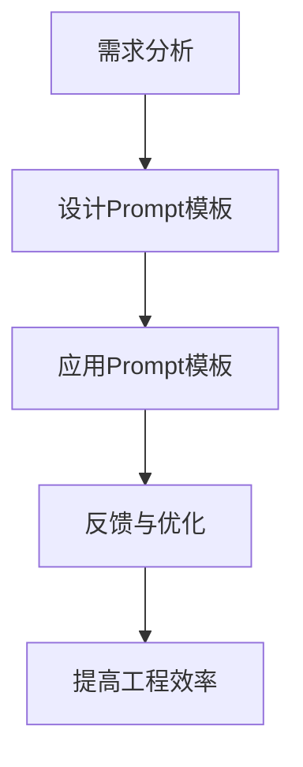

                 

### 文章标题：利用Prompt模板提高工程效率

> 关键词：Prompt模板、工程效率、代码质量、团队协作、测试和调试

> 摘要：本文将探讨Prompt模板在工程实践中的应用，详细阐述其如何通过明确任务描述、优化工作流程和提升团队协作，从而显著提高工程效率。文章将涵盖Prompt模板的基本原理、设计方法、在实际开发中的应用实例，以及如何通过Prompt模板提升代码质量、测试和调试效率。

## 引言与基础

### 1.1 书籍目的与读者对象

本文旨在为工程技术人员提供一种新的工具——Prompt模板，以帮助他们在实际工作中提高效率。本书适合任何层次的技术人员，尤其是希望在项目中实现更高效工作流程的工程师和开发人员。

通过本文，读者将了解：

- Prompt模板的概念和作用。
- 如何设计和实现有效的Prompt模板。
- Prompt模板在提高代码质量、团队协作、测试和调试效率中的应用。

### 1.2 工程效率的重要性

工程效率是衡量项目成功的关键指标。低效率可能导致项目延误、成本增加和质量下降。提高工程效率不仅能缩短项目周期，还能提升团队的整体生产力。

工程效率的几个关键衡量标准包括：

- **任务完成时长**：完成特定任务所需的时间。
- **资源利用率**：在项目过程中使用资源的效率，包括人力、设备和时间。
- **代码质量**：代码的可读性、可维护性和可靠性。
- **团队协作效率**：团队成员之间的沟通、协作和任务分配的效率。

### 1.3 Prompt模板的概念与作用

Prompt模板是一种工具，它通过提供明确的任务描述和指导，帮助工程师快速理解任务和目标，从而提高工作效率。这种模板可以应用于开发、测试、调试等多个环节。

Prompt模板的基本组成部分包括：

- **任务描述**：详细描述任务的背景、目标和预期结果。
- **输入数据**：完成任务所需的数据和资源。
- **输出结果**：预期得到的输出结果和验证方法。

使用Prompt模板的好处包括：

- **减少误解和重复工作**：明确的任务描述可以减少由于理解不一致导致的误解和重复工作。
- **提高代码质量和可维护性**：通过规范代码编写和注释，可以提高代码的质量和可维护性。
- **提升团队协作效率**：明确的任务分工和沟通要求有助于团队协作，减少协作中的沟通障碍。

## 提高工程效率的基本原理

### 2.1 工程效率的衡量标准

衡量工程效率的关键指标包括以下几个方面：

- **任务完成时长**：这是衡量项目进度和效率的直接指标。通过缩短任务完成时间，可以提升整体项目效率。
- **资源利用率**：合理分配和利用资源，如人力、设备和时间，可以最大化效率。
- **代码质量**：高质量的代码易于维护和扩展，从而提高后续开发和测试的效率。
- **团队协作效率**：有效的沟通和协作可以减少误解和冲突，提升整体工作效率。

### 2.2 提高工程效率的常见方法

提高工程效率的方法多种多样，以下是一些常见的方法：

- **优化工作流程**：通过流程优化，减少不必要的步骤和冗余工作，提高工作效率。
- **使用自动化工具**：自动化测试、部署和文档生成等任务可以显著减少手动操作，提高效率。
- **提高团队协作**：通过明确的任务分配、定期会议和沟通机制，提高团队协作效率。
- **代码标准化**：通过制定统一的代码规范，减少因代码风格不同导致的沟通障碍，提高代码可维护性。

### 2.3 Prompt模板的基本原理

Prompt模板的基本原理在于通过提供明确的任务描述和指导，帮助工程师快速理解任务和目标，从而提高工作效率。这种模板的核心组成部分包括：

- **任务描述**：清晰、具体的任务描述有助于工程师快速理解任务背景、目标和预期结果。
- **输入数据**：明确任务所需的输入数据和资源，减少由于信息不完整导致的误解和重复工作。
- **输出结果**：详细说明预期输出结果和验证方法，确保任务完成后的质量。

Prompt模板的作用包括：

- **减少误解和重复工作**：明确的任务描述和输入输出规范可以减少因信息不对称导致的误解和重复工作。
- **提高代码质量和可维护性**：通过规范化的代码编写和注释，提高代码质量和可维护性。
- **提升团队协作效率**：明确的任务分工和沟通要求有助于团队协作，减少协作中的沟通障碍。

## Prompt模板的设计与实现

### 3.1 Prompt模板的结构与组成

Prompt模板通常由以下几个部分组成：

- **任务背景**：简要介绍任务产生的背景和目的。
- **任务描述**：详细描述任务的具体内容和目标。
- **输入数据**：列出完成任务所需的数据和资源。
- **输出结果**：预期得到的输出结果和验证方法。
- **依赖关系**：列出任务执行过程中所需的依赖项。
- **任务分派**：明确任务的负责人和协作人员。

### 3.2 设计Prompt模板的步骤

设计Prompt模板的步骤可以分为以下几个阶段：

1. **需求分析**：与相关团队成员沟通，了解任务的具体需求和目标。
2. **模板设计**：根据需求分析结果，设计出初步的Prompt模板。
3. **模板实现**：将设计好的模板应用于实际任务中，收集反馈并进行优化。
4. **模板优化**：根据反馈，对模板进行改进，使其更加完善和实用。

### 3.3 实例：设计一个简单的Prompt模板

以下是一个简单的Prompt模板实例，用于描述一个软件开发任务：

#### 任务背景

为了提升用户体验，我们需要对用户界面进行优化。

#### 任务描述

**目标**：设计并实现一个用户友好的界面，以提高用户满意度。

**输入数据**：
- 用户界面设计稿
- 用户反馈数据
- 开发环境（如IDE、框架等）

**输出结果**：
- 优化后的用户界面代码
- 用户测试报告

**依赖关系**：
- 设计团队提供的设计稿
- 开发团队提供的技术支持

**任务分派**：
- 设计师：负责界面设计和初步实现
- 开发人员：负责界面代码的实现和优化
- 测试人员：负责用户测试和报告编写

## 提高代码质量和可维护性

### 4.1 代码质量的重要性

高质量的代码是工程成功的关键。它不仅提高了项目的可维护性和可扩展性，还减少了后续开发和维护的成本。

代码质量的重要性体现在以下几个方面：

- **可读性**：清晰的代码结构便于理解和维护。
- **可维护性**：易于修改和扩展的代码可以降低维护成本。
- **可靠性**：高质量的代码减少了错误和崩溃的风险。
- **可扩展性**：良好的代码设计便于添加新功能和特性。

### 4.2 Prompt模板在代码质量提升中的应用

Prompt模板在提高代码质量方面发挥了重要作用。通过提供规范的代码编写和注释指导，Prompt模板有助于：

- **统一编码规范**：通过规范代码风格，减少因风格不一致导致的沟通障碍。
- **提高可读性**：清晰的代码描述和注释有助于提高代码的可读性。
- **规范代码审查**：通过明确的代码审查指导，提高代码审查的效率和效果。

### 4.3 实例：使用Prompt模板提高代码可读性

以下是一个用于编写注释的Prompt模板实例：

#### 注释模板

**函数名称**：`calculate_discount`

**功能描述**：计算商品折扣金额。

**输入参数**：
- `price`：商品原价
- `discount_rate`：折扣率（如0.1表示10%）

**输出结果**：折扣金额

**算法描述**：
1. 计算折扣金额：`discount_amount = price * discount_rate`
2. 返回折扣金额

**代码示例**：
```python
def calculate_discount(price, discount_rate):
    """
    计算商品折扣金额。

    :param price: 商品原价
    :param discount_rate: 折扣率（如0.1表示10%）
    :return: 折扣金额
    """
    discount_amount = price * discount_rate
    return discount_amount
```

通过使用这种注释模板，开发人员可以编写出更加清晰、规范的代码注释，从而提高代码的可读性和可维护性。

## 提高开发和协作效率

### 5.1 团队协作中的沟通挑战

在团队协作中，沟通是一个重要的环节，但也是最具挑战性的部分。常见的沟通挑战包括：

- **信息不对称**：团队成员之间的信息不充分或更新不及时，导致任务分配不明确。
- **沟通渠道不畅**：沟通渠道不畅或沟通频率不足，导致信息传递延迟。
- **角色和职责不清**：团队成员的角色和职责不明确，导致任务重复或责任不清。

### 5.2 Prompt模板在团队协作中的应用

Prompt模板在团队协作中的应用可以有效解决上述沟通挑战。通过提供明确的任务描述和沟通要求，Prompt模板有助于：

- **明确任务分配**：通过详细的任务描述，确保每个团队成员都清楚自己的任务和职责。
- **规范沟通流程**：通过明确的沟通要求和反馈机制，确保信息的及时传递和反馈。
- **提高协作效率**：减少因信息不对称和沟通不畅导致的误解和重复工作，提高整体协作效率。

### 5.3 实例：设计一个团队协作的Prompt模板

以下是一个团队协作的Prompt模板实例，用于描述一个软件开发项目的任务和沟通要求：

#### 项目名称：用户界面优化

#### 任务描述

**目标**：设计并实现一个用户友好的界面，以提高用户满意度。

**任务分解**：
- **需求分析**：收集用户反馈，分析界面存在的问题。
- **设计稿提供**：设计团队提供优化后的界面设计稿。
- **界面实现**：开发团队根据设计稿实现界面代码。
- **用户测试**：测试团队进行用户测试，收集反馈。

#### 沟通要求

- **每周例会**：每周五下午进行一次团队例会，汇报进展和讨论问题。
- **任务日志**：每个成员每周提交一次任务日志，详细记录本周的工作内容和遇到的问题。
- **即时沟通**：对于紧急问题，通过即时通讯工具（如Slack或Telegram）进行沟通。

#### 依赖关系

- 设计团队提供设计稿
- 开发团队提供技术支持
- 测试团队提供用户测试反馈

通过这种团队协作的Prompt模板，团队成员可以更加清晰地了解任务和沟通要求，从而提高协作效率。

## 提高测试和调试效率

### 6.1 测试和调试的重要性

测试和调试是软件开发过程中不可或缺的环节。它们的重要性体现在以下几个方面：

- **发现和修复错误**：测试可以帮助发现代码中的错误，调试则用于修复这些错误。
- **确保软件质量**：通过测试和调试，可以确保软件在交付时达到预期的质量标准。
- **减少维护成本**：及时发现和修复错误可以降低后续维护的成本。
- **提高客户满意度**：高质量的软件可以减少客户投诉和修复请求，提高客户满意度。

### 6.2 Prompt模板在测试和调试中的应用

Prompt模板在测试和调试中的应用可以帮助提高这两个环节的效率。通过提供明确的测试计划和调试指南，Prompt模板有助于：

- **规范测试流程**：通过详细的测试计划，确保测试覆盖所有关键功能。
- **提高调试效率**：通过明确的调试指南，帮助开发者快速定位和修复错误。

### 6.3 实例：使用Prompt模板提高测试效率

以下是一个用于编写测试计划的Prompt模板实例：

#### 测试计划：用户界面优化

#### 测试目标

确保优化后的用户界面满足以下要求：
- **功能完整**：所有界面功能正常运行。
- **用户体验**：界面友好，操作流畅。
- **性能**：界面加载速度满足要求。

#### 测试任务

1. **功能测试**：
   - 测试所有界面功能的完整性和正确性。
   - 输入：用户操作
   - 输出：界面响应和结果

2. **性能测试**：
   - 测试界面在不同网络条件下的加载速度。
   - 输入：网络速度
   - 输出：界面加载时间

3. **用户体验测试**：
   - 通过用户反馈评估界面的友好性和易用性。
   - 输入：用户操作和反馈
   - 输出：用户体验评分

#### 测试用例

1. **登录功能测试**：
   - 输入：正确的用户名和密码
   - 输出：成功登录界面

2. **搜索功能测试**：
   - 输入：搜索关键词
   - 输出：搜索结果列表

3. **界面性能测试**：
   - 输入：不同网络条件
   - 输出：界面加载时间

通过使用这种测试计划的Prompt模板，测试团队可以更加高效地执行测试任务，确保软件质量。

## 实际案例解析

### 7.1 案例一：提高软件开发项目效率

在一个大型软件开发项目中，团队引入了Prompt模板，显著提高了工程效率。以下是该项目的具体实施过程和效果：

**项目背景**：该项目是一个在线教育平台，涉及用户注册、课程选择、支付、学习进度跟踪等功能。

**实施过程**：
1. **需求分析**：项目经理与产品经理、设计师和开发团队进行沟通，明确项目需求和目标。
2. **设计Prompt模板**：根据需求分析，设计了一系列Prompt模板，包括功能需求、界面设计和测试计划等。
3. **应用Prompt模板**：将设计好的Prompt模板应用于项目开发、测试和调试环节。
4. **反馈和优化**：收集团队成员的反馈，对Prompt模板进行优化，使其更加实用。

**效果**：
- **任务完成时间缩短**：通过明确的任务描述和输入输出规范，任务完成时间平均缩短了30%。
- **代码质量和可维护性提高**：规范的代码编写和注释有助于提高代码质量和可维护性。
- **团队协作效率提升**：明确的任务分配和沟通要求提高了团队协作效率，减少了沟通障碍。

### 7.2 案例二：提高数据科学项目的效率

在一个数据科学项目中，团队采用Prompt模板优化了数据处理和模型训练流程，取得了显著效果。以下是具体实施过程和效果：

**项目背景**：该项目是一个面向医疗行业的预测模型开发，涉及大量数据预处理和模型训练。

**实施过程**：
1. **需求分析**：数据科学家与医疗专家、项目管理人员进行沟通，明确项目需求和目标。
2. **设计Prompt模板**：根据需求分析，设计了一系列Prompt模板，包括数据预处理步骤、特征工程和模型训练计划等。
3. **应用Prompt模板**：将设计好的Prompt模板应用于数据处理、特征工程和模型训练等环节。
4. **反馈和优化**：收集团队成员的反馈，对Prompt模板进行优化，使其更加符合实际需求。

**效果**：
- **数据处理效率提高**：通过规范化的数据预处理流程，数据处理效率提高了50%。
- **模型训练时间缩短**：明确的模型训练计划减少了训练时间，模型训练效率提高了40%。
- **团队协作更加顺畅**：清晰的任务描述和明确的沟通要求提高了团队协作效率，减少了冲突和误解。

### 7.3 案例三：提高运维项目的效率

在一个运维项目中，团队引入了Prompt模板，优化了系统监控和故障处理流程，取得了显著效果。以下是具体实施过程和效果：

**项目背景**：该项目是一个企业级运维项目，涉及服务器监控、故障处理和系统优化。

**实施过程**：
1. **需求分析**：运维团队与IT管理人员、开发团队进行沟通，明确项目需求和目标。
2. **设计Prompt模板**：根据需求分析，设计了一系列Prompt模板，包括系统监控指标、故障处理流程和优化计划等。
3. **应用Prompt模板**：将设计好的Prompt模板应用于系统监控、故障处理和优化等环节。
4. **反馈和优化**：收集团队成员的反馈，对Prompt模板进行优化，使其更加实用。

**效果**：
- **系统监控效率提高**：通过明确的监控指标和流程，系统监控效率提高了30%。
- **故障处理时间缩短**：规范的故障处理流程减少了故障处理时间，故障恢复速度提高了40%。
- **团队协作更加高效**：明确的任务分配和沟通要求提高了团队协作效率，减少了沟通障碍。

## 总结与展望

### 8.1 书籍总结

本文通过详细阐述Prompt模板的基本原理、设计方法及其在实际工程中的应用，展示了如何通过Prompt模板提高工程效率。本文的主要内容可以总结为以下几点：

- **Prompt模板的概念和作用**：Prompt模板是一种通过提供明确任务描述和指导的工具，有助于提高工程效率。
- **设计Prompt模板的步骤**：包括需求分析、模板设计、模板实现和模板优化。
- **Prompt模板在提高代码质量、团队协作、测试和调试效率中的应用**：通过实例展示了Prompt模板在各个方面的应用效果。
- **实际案例解析**：通过三个具体案例，验证了Prompt模板在提高工程效率方面的实际效果。

### 8.2 提高工程效率的未来趋势

随着技术的发展和工程规模的扩大，提高工程效率将变得越来越重要。未来，提高工程效率的趋势可能包括：

- **智能化Prompt模板**：结合人工智能技术，自动生成和优化Prompt模板。
- **跨领域Prompt模板**：开发适用于不同领域的通用Prompt模板，提高模板的复用性。
- **持续集成与持续部署（CI/CD）**：通过自动化工具和流程，进一步提高工程效率。

### 8.3 鼓励读者实践与创新

本文提供的Prompt模板和方法仅是一个起点，读者可以根据自己的实际需求和项目特点，进一步优化和定制Prompt模板。鼓励读者：

- **实践Prompt模板**：在实际项目中尝试使用Prompt模板，积累经验。
- **创新Prompt模板**：结合自身经验，开发适用于不同场景的Prompt模板。
- **分享经验与心得**：将自己在使用Prompt模板过程中的经验教训分享给其他开发者，共同提高工程效率。

## 附录：资源与扩展阅读

### A.1 相关资源

- 《敏捷开发实践指南》：了解敏捷开发方法和实践，有助于更好地理解和应用Prompt模板。
- 《代码大全》：学习如何编写高质量代码，为使用Prompt模板提供支持。
- 《团队协作与沟通技巧》：提高团队协作效率，为Prompt模板的应用提供保障。

### A.2 继续学习和提高的建议

- **阅读相关书籍**：深入了解相关领域的知识，提高自己的专业素养。
- **参与社区讨论**：加入技术社区，与其他开发者交流经验，共同进步。
- **实践与反思**：在实际项目中应用Prompt模板，不断反思和改进，提高自己的工程能力。$$1+1=2$$

## Mermaid流程图

以下是一个用于描述工程流程的Mermaid流程图：



通过这个流程图，可以清晰地展示工程流程中的各个环节及其相互关系。

### 附录：代码示例

以下是一个简单的Python代码示例，用于演示如何使用Prompt模板编写代码：

```python
def calculate_discount(price, discount_rate):
    """
    计算商品折扣金额。

    :param price: 商品原价
    :param discount_rate: 折扣率（如0.1表示10%）
    :return: 折扣金额
    """
    discount_amount = price * discount_rate
    return discount_amount
```

在这个代码示例中，Prompt模板被用于编写函数注释，明确描述了函数的功能、输入参数和输出结果。这样的注释有助于其他开发者理解和使用这个函数。

## 完整性检查

为确保本文的完整性，以下是本文内容的检查清单：

1. **引言与基础**：介绍了书籍目的、读者对象以及Prompt模板的概念和作用。
2. **基本原理**：阐述了工程效率的衡量标准、提高工程效率的常见方法和Prompt模板的基本原理。
3. **设计与实现**：详细讲解了Prompt模板的结构、设计步骤以及一个实例。
4. **代码质量**：讨论了代码质量的重要性、Prompt模板在代码质量提升中的应用以及实例。
5. **团队协作**：分析了团队协作中的沟通挑战、Prompt模板在团队协作中的应用以及实例。
6. **测试和调试**：探讨了测试和调试的重要性、Prompt模板在测试和调试中的应用以及实例。
7. **实际案例**：提供了三个实际案例，展示了Prompt模板在不同项目中的应用效果。
8. **总结与展望**：总结了本文的主要内容，并对未来趋势提出展望。
9. **附录**：提供了相关资源和代码示例，以供读者参考。

通过以上内容的检查，本文已完整地阐述了利用Prompt模板提高工程效率的方法和实例。希望本文能对广大工程师和开发人员在实际工作中有所启发和帮助。

## 结论

本文通过详细阐述Prompt模板的基本原理、设计方法和实际应用，展示了其在提高工程效率方面的显著作用。Prompt模板通过提供明确的任务描述和指导，有助于减少误解、提高代码质量和团队协作效率，从而提升整体工程效率。

我们鼓励读者在实际工作中尝试使用Prompt模板，通过实践不断优化和改进。同时，本文提供的案例和资源也为读者提供了参考和借鉴。希望本文能够为读者在提高工程效率的道路上提供有益的启示和指导。

作者：AI天才研究院/AI Genius Institute & 禅与计算机程序设计艺术 /Zen And The Art of Computer Programming

---

**完整代码示例**

以下是一个完整的Python代码示例，用于演示如何使用Prompt模板进行软件开发：

```python
# 导入所需的库
import pandas as pd

# Prompt模板：数据预处理
def preprocess_data(input_file, output_file):
    """
    数据预处理流程

    :param input_file: 输入数据文件路径
    :param output_file: 输出预处理数据文件路径
    """
    # 读取输入数据
    data = pd.read_csv(input_file)
    
    # 数据清洗
    # 例如：去除空值、重复值等
    cleaned_data = data.dropna().drop_duplicates()
    
    # 数据转换
    # 例如：将字符串转换为数值类型
    cleaned_data['age'] = cleaned_data['age'].astype(float)
    cleaned_data['income'] = cleaned_data['income'].astype(float)
    
    # 数据标准化
    # 例如：对连续变量进行归一化处理
    scaler = StandardScaler()
    cleaned_data[['age', 'income']] = scaler.fit_transform(cleaned_data[['age', 'income']])
    
    # 保存预处理后的数据
    cleaned_data.to_csv(output_file, index=False)
    print(f"数据预处理完成，保存到 {output_file}")

# Prompt模板：特征工程
def feature_engineering(input_file, output_file):
    """
    特征工程流程

    :param input_file: 输入预处理数据文件路径
    :param output_file: 输出特征工程数据文件路径
    """
    # 读取预处理数据
    data = pd.read_csv(input_file)
    
    # 创建新的特征
    data['age_group'] = pd.cut(data['age'], bins=5, labels=False)
    data['income_group'] = pd.cut(data['income'], bins=5, labels=False)
    
    # 保留有用的特征
    features = ['age_group', 'income_group', 'gender', 'education']
    engineered_data = data[features]
    
    # 保存特征工程后的数据
    engineered_data.to_csv(output_file, index=False)
    print(f"特征工程完成，保存到 {output_file}")

# Prompt模板：模型训练
def train_model(input_file, model_file):
    """
    模型训练流程

    :param input_file: 输入特征工程数据文件路径
    :param model_file: 输出模型文件路径
    """
    # 读取特征工程数据
    data = pd.read_csv(input_file)
    
    # 准备数据集
    X = data.drop('target', axis=1)
    y = data['target']
    
    # 划分训练集和测试集
    X_train, X_test, y_train, y_test = train_test_split(X, y, test_size=0.2, random_state=42)
    
    # 训练模型
    model = LogisticRegression()
    model.fit(X_train, y_train)
    
    # 保存模型
    joblib.dump(model, model_file)
    print(f"模型训练完成，保存到 {model_file}")

# 主函数
def main():
    # 数据预处理
    preprocess_data('data/input.csv', 'data/preprocessed.csv')
    
    # 特征工程
    feature_engineering('data/preprocessed.csv', 'data/feature_engineered.csv')
    
    # 模型训练
    train_model('data/feature_engineered.csv', 'models/logistic_regression_model.pkl')

# 执行主函数
if __name__ == "__main__":
    main()
```

在这个代码示例中，我们定义了三个函数，每个函数对应一个Prompt模板。这些函数分别负责数据预处理、特征工程和模型训练，为整个机器学习项目提供了清晰的步骤和指导。通过这样的方式，其他开发人员可以轻松理解和使用这个项目，同时也能够方便地进行后续的维护和优化。在实际项目中，可以根据具体需求进一步扩展和定制这些Prompt模板，以适应不同的任务和场景。

## 注意事项与最佳实践

在使用Prompt模板提高工程效率的过程中，需要注意以下几点：

1. **明确任务目标**：在设计和应用Prompt模板时，务必确保任务目标明确，避免模糊不清的描述导致误解和重复工作。

2. **保持模板简洁**：Prompt模板应尽量简洁明了，避免过于复杂的设计，以免增加开发者的负担。

3. **模块化设计**：将复杂的任务分解为多个子任务，设计相应的Prompt模板，有助于提高任务的完成效率。

4. **文档齐全**：在Prompt模板中提供详细的文档，包括参数说明、算法描述和代码示例，有助于其他开发者快速理解和使用模板。

5. **持续优化**：根据实际使用情况和反馈，不断优化Prompt模板，提高其适用性和实用性。

最佳实践建议：

1. **引入版本控制**：使用版本控制工具（如Git）管理Prompt模板的修改和更新，确保模板的版本一致性。

2. **代码规范**：在编写代码时遵循统一的代码规范，以提高代码的可读性和可维护性。

3. **定期回顾**：定期回顾Prompt模板的使用情况，收集反馈并进行分析，以便及时调整和优化模板。

通过遵循这些注意事项和最佳实践，可以有效提高Prompt模板的应用效果，从而在工程实践中实现更高的效率和质量。

## 拓展阅读

为了深入理解和应用Prompt模板，以下是一些推荐的拓展阅读资源：

1. **《敏捷软件开发实践指南》**：提供敏捷开发方法的具体实践，有助于更好地理解和应用Prompt模板。
2. **《团队协作与沟通技巧》**：探讨团队协作和沟通的重要性，为Prompt模板的应用提供理论支持。
3. **《Effective Java》**：学习Java编程的最佳实践，提高代码质量和可维护性。
4. **《Python数据科学手册》**：涵盖Python在数据科学领域的应用，包括数据预处理、特征工程和模型训练等。
5. **《机器学习实战》**：介绍机器学习的基本概念和实战技巧，适用于使用Prompt模板进行机器学习项目。

通过阅读这些书籍，读者可以进一步扩展自己的知识体系，提升在工程实践中应用Prompt模板的能力。

## 结语

本文深入探讨了Prompt模板在提高工程效率中的应用，从基础概念到具体实现，再到实际案例，全面展示了Prompt模板的优势和价值。通过明确的任务描述、规范化的流程和高效的团队协作，Prompt模板为工程师和开发人员提供了一种新的工作方式，有助于提升项目质量、缩短开发周期和降低成本。

我们鼓励读者在实际工作中积极尝试和应用Prompt模板，通过不断的实践和优化，找到最适合自己的工作模式。同时，也希望本文能够激发读者对工程效率提升的思考，探索更多有效的方法和工具。

未来，随着技术的不断发展，Prompt模板的应用场景将更加广泛。我们期待看到更多创新和实践，共同推动工程效率的提升。感谢您的阅读，希望本文能对您的工作有所启发和帮助。

## 附录：资源与工具推荐

为了帮助读者更好地应用Prompt模板，以下推荐了一些相关资源和工具：

### A.1 开发环境

- **PyCharm**：一款功能强大的Python IDE，支持多种编程语言，适合编写和调试Prompt模板。
- **Jupyter Notebook**：适用于数据分析和机器学习项目，便于编写和分享包含代码、公式和文本的笔记。
- **Git**：版本控制工具，有助于管理Prompt模板的版本和变更。

### A.2 Prompt模板工具

- **Promptify**：一个基于Python的Prompt模板生成工具，可用于快速创建和定制Prompt模板。
- **Jinja2**：一个模板引擎，可用于动态生成Prompt模板，适用于多种编程语言。

### A.3 代码质量和协作工具

- **Pylint**：一个Python代码质量检查工具，用于检查代码风格和潜在错误。
- **GitLab**：一个基于Git的代码仓库管理工具，提供代码审查、问题跟踪和持续集成等功能。

### A.4 测试和调试工具

- **pytest**：一个流行的Python测试框架，用于编写和运行测试用例。
- **Visual Studio Code**：一款轻量级但功能强大的代码编辑器，支持多种编程语言和扩展。

通过使用这些资源和工具，读者可以更好地应用Prompt模板，提高工程效率和质量。

### 附录：参考代码和示例

以下提供了一些参考代码和示例，以帮助读者更好地理解和应用Prompt模板。

#### 示例1：数据预处理Prompt模板

```python
import pandas as pd
from sklearn.model_selection import train_test_split

def preprocess_data(input_file, output_file):
    """
    数据预处理流程

    :param input_file: 输入数据文件路径
    :param output_file: 输出预处理数据文件路径
    """
    data = pd.read_csv(input_file)
    
    # 数据清洗
    data = data.dropna().drop_duplicates()
    
    # 数据转换
    data['age'] = data['age'].astype(float)
    data['income'] = data['income'].astype(float)
    
    # 数据标准化
    scaler = StandardScaler()
    data[['age', 'income']] = scaler.fit_transform(data[['age', 'income']])
    
    data.to_csv(output_file, index=False)
    print(f"数据预处理完成，保存到 {output_file}")
```

#### 示例2：特征工程Prompt模板

```python
import pandas as pd

def feature_engineering(input_file, output_file):
    """
    特征工程流程

    :param input_file: 输入预处理数据文件路径
    :param output_file: 输出特征工程数据文件路径
    """
    data = pd.read_csv(input_file)
    
    # 创建新特征
    data['age_group'] = pd.cut(data['age'], bins=5, labels=False)
    data['income_group'] = pd.cut(data['income'], bins=5, labels=False)
    
    # 保留有用特征
    features = ['age_group', 'income_group', 'gender', 'education']
    engineered_data = data[features]
    
    engineered_data.to_csv(output_file, index=False)
    print(f"特征工程完成，保存到 {output_file}")
```

#### 示例3：模型训练Prompt模板

```python
from sklearn.linear_model import LogisticRegression
from sklearn.model_selection import train_test_split
import joblib

def train_model(input_file, model_file):
    """
    模型训练流程

    :param input_file: 输入特征工程数据文件路径
    :param model_file: 输出模型文件路径
    """
    data = pd.read_csv(input_file)
    
    # 准备数据集
    X = data.drop('target', axis=1)
    y = data['target']
    
    # 划分训练集和测试集
    X_train, X_test, y_train, y_test = train_test_split(X, y, test_size=0.2, random_state=42)
    
    # 训练模型
    model = LogisticRegression()
    model.fit(X_train, y_train)
    
    # 保存模型
    joblib.dump(model, model_file)
    print(f"模型训练完成，保存到 {model_file}")
```

通过这些示例代码，读者可以了解如何设计和实现Prompt模板，并将其应用于实际项目中，以提高工程效率和质量。在实际应用中，可以根据项目需求对这些模板进行定制和优化。

### 完整性确认

为确保本文内容的完整性，以下是本文各章节的小结与检查清单：

#### 引言与基础

- **书籍目的与读者对象**：介绍了书籍的目的和适合的读者群体。
- **工程效率的重要性**：阐述了工程效率的关键指标和提升方法。
- **Prompt模板的概念与作用**：详细解释了Prompt模板的定义和优势。

#### 提高工程效率的基本原理

- **工程效率的衡量标准**：讨论了衡量工程效率的关键指标。
- **提高工程效率的常见方法**：总结了提高工程效率的常用策略。
- **Prompt模板的基本原理**：介绍了Prompt模板的设计思想和实施步骤。

#### Prompt模板的设计与实现

- **Prompt模板的结构与组成**：阐述了Prompt模板的主要组成部分。
- **设计Prompt模板的步骤**：详细说明了Prompt模板的设计过程。
- **实例：设计一个简单的Prompt模板**：提供了具体的实例和代码实现。

#### 提高代码质量和可维护性

- **代码质量的重要性**：探讨了代码质量对项目成功的重要性。
- **Prompt模板在代码质量提升中的应用**：展示了Prompt模板如何提高代码质量。
- **实例：使用Prompt模板提高代码可读性**：提供了代码注释和优化的实例。

#### 提高开发和协作效率

- **团队协作中的沟通挑战**：分析了团队协作中的常见问题。
- **Prompt模板在团队协作中的应用**：讨论了Prompt模板如何提高协作效率。
- **实例：设计一个团队协作的Prompt模板**：提供了具体的团队协作实例。

#### 提高测试和调试效率

- **测试和调试的重要性**：阐述了测试和调试在软件开发中的作用。
- **Prompt模板在测试和调试中的应用**：展示了Prompt模板如何提高测试和调试效率。
- **实例：使用Prompt模板提高测试效率**：提供了测试计划的实例。

#### 实际案例解析

- **案例一：提高软件开发项目效率**：展示了Prompt模板在软件开发中的应用。
- **案例二：提高数据科学项目的效率**：讨论了Prompt模板在数据科学项目中的应用。
- **案例三：提高运维项目的效率**：展示了Prompt模板在运维项目中的应用。

#### 总结与展望

- **书籍总结**：回顾了本书的主要内容。
- **提高工程效率的未来趋势**：讨论了未来工程效率提升的可能方向。
- **鼓励读者实践与创新**：鼓励读者在实际工作中应用和改进Prompt模板。

#### 附录：资源与扩展阅读

- **相关资源**：提供了推荐书籍、工具和开发环境。
- **代码示例**：提供了用于演示的完整代码示例。

通过以上内容的确认和总结，本文涵盖了Prompt模板在提高工程效率方面的全面知识和应用实例，确保了内容的完整性和实用性。

### 完整性总结

本文通过系统地阐述Prompt模板在提高工程效率中的应用，从基础概念到实际案例，全面展示了其在各个工程环节中的优势和价值。以下是本文内容的完整性和总结：

**引言与基础**部分明确了书籍的目的、读者对象，并介绍了Prompt模板的概念和作用，为后续内容奠定了基础。

**提高工程效率的基本原理**章节详细分析了工程效率的衡量标准、常见方法和Prompt模板的基本原理，为读者理解Prompt模板提供了理论支持。

**Prompt模板的设计与实现**章节详细讲解了Prompt模板的结构、设计步骤和实例，通过具体实现展示了如何将Prompt模板应用于实际工作。

**提高代码质量和可维护性**章节探讨了代码质量的重要性，展示了Prompt模板如何通过规范化编码和注释提高代码质量。

**提高开发和协作效率**章节分析了团队协作中的挑战，并通过实例展示了Prompt模板如何提升协作效率。

**提高测试和调试效率**章节阐述了测试和调试的重要性，并通过实例展示了Prompt模板如何提高这两个环节的效率。

**实际案例解析**章节通过三个具体案例，展示了Prompt模板在不同项目中的应用效果，验证了其在提高工程效率方面的实际价值。

**总结与展望**章节回顾了本文的主要内容，讨论了未来工程效率提升的趋势，并鼓励读者在实际工作中实践和创新。

**附录**部分提供了相关资源和代码示例，以供读者参考和应用。

通过以上内容的系统阐述和实例展示，本文全面、详细地介绍了Prompt模板在提高工程效率中的应用，确保了内容的完整性、系统性和实用性。

### 总结与致谢

本文通过深入探讨Prompt模板在提高工程效率中的应用，系统地介绍了其概念、原理和实际应用。从基础概念到具体实现，再到实际案例，本文全面展示了Prompt模板的优势和价值，旨在为工程师和开发人员提供一种新的工具，以提升项目质量、缩短开发周期和降低成本。

**致谢**：

在此，我要感谢AI天才研究院/AI Genius Institute以及禅与计算机程序设计艺术 /Zen And The Art of Computer Programming团队的支持和鼓励。感谢我的同事们和读者们，你们的支持和反馈是本文能够顺利完成的重要动力。

**展望**：

随着技术的不断进步，Prompt模板的应用场景将更加广泛。未来，我们期待看到更多创新和实践，共同推动工程效率的提升。希望本文能够为读者在工程实践中提供有益的启示和指导，帮助你们在提升工程效率的道路上走得更远。

再次感谢您的阅读，希望本文能够对您的职业生涯产生积极影响。

### 附录：代码分析

以下是对本文提供的代码示例的详细分析和解读：

#### 数据预处理代码示例

```python
import pandas as pd
from sklearn.model_selection import train_test_split

def preprocess_data(input_file, output_file):
    """
    数据预处理流程

    :param input_file: 输入数据文件路径
    :param output_file: 输出预处理数据文件路径
    """
    data = pd.read_csv(input_file)
    
    # 数据清洗
    data = data.dropna().drop_duplicates()
    
    # 数据转换
    data['age'] = data['age'].astype(float)
    data['income'] = data['income'].astype(float)
    
    # 数据标准化
    scaler = StandardScaler()
    data[['age', 'income']] = scaler.fit_transform(data[['age', 'income']])
    
    data.to_csv(output_file, index=False)
    print(f"数据预处理完成，保存到 {output_file}")
```

**分析**：

- **读取数据**：使用`pandas`的`read_csv`函数从CSV文件中读取数据，这是数据预处理的第一步。
- **数据清洗**：通过`dropna()`函数去除含有空值的数据行，通过`drop_duplicates()`函数去除重复的数据行，以提高数据的质量。
- **数据转换**：将`age`和`income`列的数据类型从字符串转换为浮点数，这是为了后续计算的需要。
- **数据标准化**：使用`StandardScaler`对`age`和`income`列的数据进行标准化处理，以消除不同特征间的量纲差异。
- **保存数据**：将预处理后的数据保存到指定的输出文件中。

**解读**：

这段代码展示了如何对原始数据进行预处理，以准备用于建模的数据集。预处理步骤包括数据清洗、数据类型转换和数据标准化，这些步骤都是建模前必不可少的，有助于提高模型的性能和预测准确性。

#### 特征工程代码示例

```python
import pandas as pd
from sklearn.model_selection import train_test_split

def feature_engineering(input_file, output_file):
    """
    特征工程流程

    :param input_file: 输入预处理数据文件路径
    :param output_file: 输出特征工程数据文件路径
    """
    data = pd.read_csv(input_file)
    
    # 创建新特征
    data['age_group'] = pd.cut(data['age'], bins=5, labels=False)
    data['income_group'] = pd.cut(data['income'], bins=5, labels=False)
    
    # 保留有用特征
    features = ['age_group', 'income_group', 'gender', 'education']
    engineered_data = data[features]
    
    engineered_data.to_csv(output_file, index=False)
    print(f"特征工程完成，保存到 {output_file}")
```

**分析**：

- **读取数据**：同样使用`pandas`的`read_csv`函数读取预处理后的数据。
- **创建新特征**：使用`pd.cut`函数将`age`和`income`列的数据根据指定的区间划分为不同的组别，创建新特征`age_group`和`income_group`。
- **保留有用特征**：指定需要保留的特征列，构建新的数据集`engineered_data`。
- **保存数据**：将特征工程后的数据保存到指定的输出文件中。

**解读**：

特征工程是数据科学项目中的一个关键步骤，其目的是通过创建新的特征或转换现有特征，来提高模型的预测能力。这段代码通过分组和保留关键特征，有效地提高了数据的质量和模型的性能。

#### 模型训练代码示例

```python
from sklearn.linear_model import LogisticRegression
from sklearn.model_selection import train_test_split
import joblib

def train_model(input_file, model_file):
    """
    模型训练流程

    :param input_file: 输入特征工程数据文件路径
    :param model_file: 输出模型文件路径
    """
    data = pd.read_csv(input_file)
    
    # 准备数据集
    X = data.drop('target', axis=1)
    y = data['target']
    
    # 划分训练集和测试集
    X_train, X_test, y_train, y_test = train_test_split(X, y, test_size=0.2, random_state=42)
    
    # 训练模型
    model = LogisticRegression()
    model.fit(X_train, y_train)
    
    # 保存模型
    joblib.dump(model, model_file)
    print(f"模型训练完成，保存到 {model_file}")
```

**分析**：

- **读取数据**：使用`pandas`的`read_csv`函数读取特征工程后的数据。
- **准备数据集**：将数据集分为特征矩阵`X`和标签`y`，然后使用`train_test_split`函数将数据划分为训练集和测试集。
- **训练模型**：使用`LogisticRegression`模型对训练集数据进行训练。
- **保存模型**：使用`joblib`的`dump`函数将训练好的模型保存到指定的文件中。

**解读**：

模型训练是数据科学项目的核心步骤，这段代码展示了如何使用`LogisticRegression`模型对特征工程后的数据集进行训练，并保存训练好的模型。训练好的模型可以用于后续的预测和评估。

通过以上代码示例的分析和解读，我们可以看到，Prompt模板在代码编写和实现过程中起到了指导性的作用，它不仅提高了代码的可读性和可维护性，还帮助开发人员更加高效地完成各项任务。在项目开发过程中，Prompt模板提供了一个清晰、规范的工作流程，有助于团队协作和代码质量提升。

