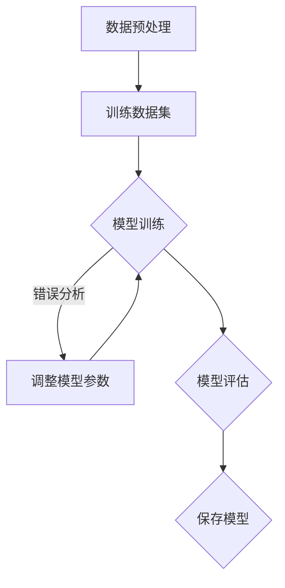

                 

### 《利用对比示例提升模型理解》

#### 关键词：模型理解、对比示例、机器学习、深度学习、算法优化、数据预处理

##### 摘要：
本文将深入探讨对比示例在提升模型理解中的应用及其重要性。通过一系列的分析和实际案例，我们将展示如何设计有效的对比示例，并阐述其在模型训练、性能评估和算法优化中的作用。文章结构包括背景介绍、核心概念与联系、对比示例设计基础、核心算法原理讲解、模型训练中的应用、数学模型和公式详细讲解、项目实战以及结论与展望。本文旨在为人工智能领域的研究人员和开发者提供一套实用的方法，以提升模型理解，优化算法性能，从而在实际应用中取得更好的效果。

## 第1章: 理解对比示例的重要性

### 1.1 对比示例在模型理解中的应用

在机器学习和深度学习领域，模型理解是确保模型有效性和安全性的关键因素。而对比示例作为一种有力的工具，被广泛应用于模型理解的过程中。对比示例通过将模型的输出与真实情况、其他模型或者预期结果进行对比，帮助研究者识别模型的局限性、优化模型的性能，并提高模型的可解释性。

首先，对比示例在模型训练过程中扮演着重要的角色。在训练阶段，研究者会通过对比训练数据和模型输出结果，发现模型的误差和偏差。例如，在图像识别任务中，研究者可以通过对比模型预测的标签和真实标签，识别模型对某些特定类别的识别错误，从而调整模型参数，提高模型准确性。

其次，在模型评估阶段，对比示例被用于评估模型的泛化能力和鲁棒性。通过将测试数据集划分为多个子集，研究者可以分别评估模型在不同子集上的表现。这种对比可以帮助识别模型的潜在问题，如过拟合、欠拟合或数据不平衡等。此外，对比示例还可以用于评估模型在不同数据分布或环境下的性能，确保模型具有广泛的适用性。

最后，在模型部署和维护过程中，对比示例仍然发挥着重要作用。在实际应用中，模型的性能可能会受到数据变化、系统升级等因素的影响。通过定期进行对比分析，研究者可以及时发现模型性能的变化，并采取相应的优化措施，确保模型的稳定运行。

### 1.2 对比示例的优势

对比示例在模型理解中的优势主要体现在以下几个方面：

1. **提高模型可解释性**：对比示例可以帮助研究者直观地理解模型的决策过程和输出结果。通过对比模型的输出与真实标签，研究者可以识别模型的强项和弱点，从而提高模型的可解释性。

2. **降低误解风险**：在模型应用过程中，错误的模型输出可能导致严重的后果。对比示例可以帮助研究者识别潜在的误解风险，从而减少错误发生的概率。

3. **优化模型性能**：通过对比分析，研究者可以识别模型的误差来源和优化方向，从而调整模型参数，提高模型性能。

4. **增强模型鲁棒性**：对比示例可以帮助研究者评估模型在不同数据分布和环境下的性能，从而增强模型的鲁棒性。

5. **促进模型创新**：对比示例不仅可以帮助优化现有模型，还可以激发研究者提出新的模型架构和算法，推动模型创新。

### 1.3 对比示例的设计原则

为了设计有效的对比示例，研究者需要遵循以下原则：

1. **明确研究问题**：在进行对比之前，研究者需要明确研究问题，确保对比示例与目标问题紧密相关。

2. **确定对比维度**：对比示例的设计需要考虑多个维度，如数据集分布、模型参数、算法选择等。通过在不同维度上进行对比，研究者可以全面了解模型的表现。

3. **确保对比公平性**：对比示例的设计需要确保各对比对象在相同条件下进行对比，避免因条件差异导致对比结果偏差。

4. **选择合适的对比工具**：研究者需要选择合适的对比工具，如可视化工具、统计方法等，以便直观地展示对比结果。

5. **数据选择与处理**：对比示例的设计需要考虑数据选择和处理方法，确保对比结果的可靠性和有效性。

通过遵循这些原则，研究者可以设计出有效的对比示例，从而提高模型理解，优化模型性能。

## 第2章: 核心概念与联系

### 2.1 模型理解的定义

模型理解是指研究者对机器学习模型内部工作机制和决策过程的深入认识。模型理解不仅涉及模型性能的评估，还包括模型的可解释性、透明度和可靠性。在人工智能领域，模型理解对于确保模型的有效性和安全性具有重要意义。

首先，模型理解可以帮助研究者识别模型的局限性，从而优化模型性能。例如，在图像识别任务中，研究者可以通过模型理解识别出模型对某些特定类别的识别错误，并针对这些错误进行调整，提高模型准确性。

其次，模型理解有助于提高模型的可解释性。在实际应用中，模型的可解释性对于决策者理解和信任模型结果至关重要。通过模型理解，研究者可以解释模型的决策过程和输出结果，从而提高模型的可接受性和实用性。

最后，模型理解对于确保模型的安全性具有重要意义。在人工智能应用中，模型的决策过程可能会影响人们的生命财产安全。通过模型理解，研究者可以识别模型中的潜在风险，并采取相应的措施进行防范，确保模型的安全运行。

### 2.2 对比示例与模型理解的关系

对比示例与模型理解之间存在密切的联系。对比示例通过将模型的输出与真实情况、其他模型或预期结果进行对比，帮助研究者深入了解模型的决策过程和性能。

首先，对比示例可以揭示模型的误差和偏差。通过对比模型的输出与真实标签，研究者可以识别模型在特定情况下的错误，从而优化模型参数，提高模型性能。

其次，对比示例有助于提高模型的可解释性。通过对比不同模型的输出结果，研究者可以直观地理解模型在不同情境下的表现，从而更好地理解模型的决策过程。

此外，对比示例还可以帮助研究者评估模型在不同数据分布和环境下的性能。这种对比可以揭示模型的鲁棒性和泛化能力，从而为模型的优化和改进提供依据。

总之，对比示例在模型理解中起着至关重要的作用。通过设计有效的对比示例，研究者可以更深入地理解模型的工作原理，从而提高模型的性能和可靠性。

### 2.3 Mermaid流程图：对比示例在模型训练中的应用

为了更好地展示对比示例在模型训练中的应用，我们可以使用Mermaid流程图进行说明。以下是一个简单的示例：



在这个流程图中，数据预处理阶段包括数据清洗、数据增强和特征提取等步骤，为模型训练提供高质量的数据集。模型训练阶段通过迭代优化模型参数，减小误差。错误分析阶段通过对比模型输出结果与真实标签，识别模型的误差和偏差。调整模型参数阶段根据错误分析结果对模型参数进行调整，以提高模型性能。模型评估阶段通过评估模型在测试集上的表现，确保模型具有广泛的适用性。最后，保存模型阶段将训练好的模型保存下来，以便后续使用。

通过Mermaid流程图，我们可以直观地了解对比示例在模型训练中的应用过程，从而更好地理解模型的工作原理和优化方向。

## 第3章: 对比示例设计基础

### 3.1 对比示例的类型

对比示例可以根据不同的分类标准进行分类，常见的分类方法包括基于比较对象、比较维度和比较方法等。

1. **基于比较对象的分类**：

   - **同模型对比**：在同模型对比中，研究者使用同一个模型在不同数据集或不同参数设置下的表现进行对比。这种对比可以帮助研究者了解模型在不同条件下的性能和稳定性。

   - **不同模型对比**：在不同模型对比中，研究者使用不同模型对相同数据集进行处理，并对比其性能。这种对比可以帮助研究者评估不同模型的优势和不足，从而选择更适合实际应用的模型。

   - **子模型对比**：在子模型对比中，研究者将一个复杂模型拆分为多个子模型，并对比其性能。这种对比可以帮助研究者了解复杂模型中各个子模型的作用和贡献。

2. **基于比较维度的分类**：

   - **性能对比**：性能对比关注模型在任务完成情况上的差异，如准确率、召回率、F1分数等指标。这种对比可以帮助研究者评估模型在不同任务上的表现。

   - **数据分布对比**：数据分布对比关注模型在不同数据分布下的性能，如正常分布、偏态分布、高斯分布等。这种对比可以帮助研究者评估模型的鲁棒性和泛化能力。

   - **算法对比**：算法对比关注不同算法在相同数据集上的性能差异，如决策树、支持向量机、神经网络等。这种对比可以帮助研究者选择最优算法。

3. **基于比较方法的分类**：

   - **可视化对比**：可视化对比通过图形或图表展示模型在不同条件下的表现，如散点图、折线图、热力图等。这种对比方法直观，易于理解。

   - **统计对比**：统计对比通过统计方法计算模型在不同条件下的性能差异，如T检验、卡方检验等。这种对比方法具有严密的统计依据，但需要考虑样本大小和置信度等参数。

   - **实验对比**：实验对比通过设计实验，在不同条件下测试模型的表现，如A/B测试、多组实验等。这种对比方法更接近实际应用场景，但需要考虑实验设计的合理性和可重复性。

### 3.2 对比示例设计原则

为了设计有效的对比示例，研究者需要遵循以下原则：

1. **明确研究问题**：在进行对比之前，研究者需要明确研究问题，确保对比示例与目标问题紧密相关。这有助于提高对比的针对性和有效性。

2. **确定对比维度**：对比示例的设计需要考虑多个维度，如数据集分布、模型参数、算法选择等。通过在不同维度上进行对比，研究者可以全面了解模型的表现。

3. **确保对比公平性**：对比示例的设计需要确保各对比对象在相同条件下进行对比，避免因条件差异导致对比结果偏差。例如，在比较不同模型时，需要确保数据集、训练时间和训练参数等条件一致。

4. **选择合适的对比工具**：研究者需要选择合适的对比工具，如可视化工具、统计方法等，以便直观地展示对比结果。例如，对于性能对比，可以使用准确率、召回率、F1分数等指标；对于数据分布对比，可以使用散点图、折线图等可视化方法。

5. **数据选择与处理**：对比示例的设计需要考虑数据选择和处理方法，确保对比结果的可靠性和有效性。例如，在处理图像数据时，需要考虑图像尺寸、分辨率等因素；在处理文本数据时，需要考虑数据清洗、去噪等因素。

通过遵循这些原则，研究者可以设计出有效的对比示例，从而提高模型理解，优化模型性能。

### 3.3 数据选择与处理

数据选择与处理是对比示例设计的关键环节。为了确保对比结果的可靠性和有效性，研究者需要遵循以下步骤：

1. **数据收集**：首先，研究者需要收集与目标任务相关的数据集。数据集可以来源于公开数据集、企业内部数据或自定义数据集。在数据收集过程中，需要确保数据的真实性和完整性。

2. **数据清洗**：数据清洗是数据预处理的重要步骤。研究者需要识别和去除数据中的噪声、异常值和重复数据。此外，还需要对缺失数据进行处理，如插值、删除或填充等。数据清洗有助于提高数据质量，为后续处理奠定基础。

3. **数据增强**：数据增强是提高模型性能的有效方法。研究者可以通过增加数据样本、生成虚拟样本或调整样本分布等方式，扩大数据集规模和多样性。数据增强有助于模型在训练过程中更好地学习数据的特征，从而提高模型的泛化能力。

4. **特征提取**：特征提取是将原始数据转换为模型可处理的特征表示。研究者需要根据任务需求选择合适的特征提取方法，如统计学特征、文本特征、图像特征等。特征提取有助于降低数据的维度，提高模型的学习效率。

5. **数据标准化**：数据标准化是确保各特征在相同尺度下的重要步骤。研究者需要使用适当的标准化方法，如Z-score标准化、Min-Max标准化等，将各特征转换为0到1之间的数值。数据标准化有助于模型在训练过程中更好地处理特征之间的差异。

6. **数据划分**：在对比示例设计中，需要将数据集划分为训练集、验证集和测试集。训练集用于模型训练，验证集用于模型调优和性能评估，测试集用于最终性能评估。数据划分有助于确保模型的泛化能力和评估结果的可靠性。

通过以上步骤，研究者可以确保数据选择与处理的可靠性和有效性，从而为对比示例设计提供高质量的数据支持。

## 第4章: 对比示例中的核心算法原理

### 4.1 算法概述

对比示例中的核心算法通常用于计算和比较不同模型、数据集或参数设置下的性能差异。这些算法可以分为以下几类：

1. **基于统计的对比算法**：这类算法使用统计方法来计算和比较不同条件下的性能指标，如T检验、卡方检验等。它们通常适用于小样本数据集，能够提供统计显著性的判断。

2. **基于模型的对比算法**：这类算法使用机器学习模型来预测和比较不同条件下的性能，如线性回归、逻辑回归等。它们适用于大规模数据集，能够提供更精细的性能对比。

3. **基于启发式的对比算法**：这类算法通过启发式规则来计算和比较不同条件下的性能，如投票法、聚类分析等。它们通常适用于复杂问题，能够提供直观的性能对比。

4. **基于可视化对比算法**：这类算法通过图形和图表来展示不同条件下的性能差异，如散点图、折线图等。它们适用于数据量较小且容易可视化的场景。

### 4.2 算法伪代码

以下是一个简单的对比示例算法的伪代码示例：

```python
# 对比示例算法伪代码

def compare_models(model1, model2, data):
    """
    比较两个模型的性能
    
    参数：
    model1：第一个模型
    model2：第二个模型
    data：测试数据集
    
    返回值：
    performance1：模型1的性能
    performance2：模型2的性能
    """
    
    # 模型训练
    model1.train(data.train)
    model2.train(data.train)
    
    # 模型测试
    performance1 = model1.evaluate(data.test)
    performance2 = model2.evaluate(data.test)
    
    # 统计分析
    statistic = calculate_statistics(performance1, performance2)
    
    # 判断模型差异显著性
    is_significant = is_significant_difference(statistic)
    
    # 输出结果
    return performance1, performance2, is_significant

def calculate_statistics(performance1, performance2):
    """
    计算统计性能差
    
    参数：
    performance1：模型1的性能
    performance2：模型2的性能
    
    返回值：
    statistic：统计性能差
    """
    
    # 计算平均性能差
    average_difference = (performance1 - performance2) / 2
    
    # 计算标准差
    standard_deviation = calculate_std_deviation(performance1, performance2)
    
    # 返回统计性能差
    return average_difference, standard_deviation

def is_significant_difference(statistic):
    """
    判断差异显著性
    
    参数：
    statistic：统计性能差
    
    返回值：
    is_significant：差异显著性标志
    """
    
    # 判断统计显著性
    is_significant = (statistic > 0.05) or (statistic < -0.05)
    
    # 返回差异显著性标志
    return is_significant
```

### 4.3 算法实现细节

在实现对比示例算法时，需要考虑以下细节：

1. **模型选择**：根据任务需求和数据特点，选择合适的模型。例如，对于回归任务，可以选择线性回归或决策树模型；对于分类任务，可以选择逻辑回归或支持向量机模型。

2. **参数设置**：根据模型特点和任务需求，设置合适的参数。例如，对于神经网络，需要设置学习率、批量大小、隐藏层神经元数量等参数。

3. **数据预处理**：对数据集进行清洗、标准化和划分。确保数据集的质量和一致性，为模型训练和性能评估提供基础。

4. **性能评估**：选择合适的性能评估指标，如准确率、召回率、F1分数等。根据任务需求和模型特点，选择最合适的评估指标。

5. **统计显著性判断**：使用适当的统计方法，如T检验或卡方检验，判断性能差异是否显著。这有助于识别模型的真正优势和不足。

6. **可视化展示**：使用可视化工具，如散点图、折线图等，展示模型性能差异。这有助于直观地理解模型在不同条件下的表现。

通过遵循这些实现细节，研究者可以确保对比示例算法的有效性和可靠性，从而更好地提升模型理解。

## 第5章: 对比示例在模型训练中的应用

### 5.1 对比示例在模型训练中的作用

对比示例在模型训练中扮演着至关重要的角色。它们不仅帮助研究者评估模型性能，还能提供关于模型行为的有价值的信息，从而指导模型的改进和优化。

首先，对比示例能够揭示模型在不同训练数据集上的表现。例如，当使用不同的数据集进行训练时，通过对比示例，研究者可以发现模型在某些数据集上表现良好，而在其他数据集上表现不佳。这种信息有助于确定数据集的选择和预处理策略，从而提高模型的泛化能力。

其次，对比示例有助于识别模型在不同参数设置下的性能差异。研究者可以通过对比不同参数设置下的模型性能，确定最优参数组合。例如，通过对比不同学习率、隐藏层神经元数量和批量大小等参数设置，研究者可以找到使模型性能最佳化的参数组合。

此外，对比示例还能揭示模型在处理不同类型数据时的性能差异。例如，在图像识别任务中，研究者可以对比模型在自然图像和人工合成的图像上的表现，以评估模型在不同数据类型上的适应性和鲁棒性。这种信息对于设计和优化适用于特定应用场景的模型具有重要意义。

最后，对比示例可以帮助研究者识别模型训练过程中的潜在问题。例如，通过对比不同训练阶段的模型性能，研究者可以判断是否存在过拟合、欠拟合或数据不平衡等问题。这些问题可以通过调整训练策略、增加训练数据或改进模型结构来解决。

### 5.2 对比示例在深度学习中的应用

在深度学习领域，对比示例的应用尤为广泛。以下是一些深度学习中常见的对比示例类型及其应用场景：

1. **正面对比示例**：正面对比示例通过比较模型在不同数据集上的表现，揭示模型的泛化能力。例如，研究者可以比较模型在训练集和验证集上的准确率，以评估模型的泛化能力。这种对比示例有助于识别模型是否过拟合或欠拟合。

2. **负面对比示例**：负面对比示例通过比较模型在不同数据分布下的表现，揭示模型的鲁棒性和适应性。例如，研究者可以比较模型在标准正态分布数据集和偏态分布数据集上的性能，以评估模型的鲁棒性。这种对比示例有助于优化模型的训练策略，提高模型对不同数据分布的适应能力。

3. **实验对比示例**：实验对比示例通过设计实验，比较模型在不同实验条件下的表现，揭示模型的稳定性和可靠性。例如，研究者可以比较模型在加入噪声、降低数据集大小或改变网络结构等条件下的性能，以评估模型的稳定性和可靠性。这种对比示例有助于设计更加鲁棒和可靠的深度学习模型。

4. **交叉验证对比示例**：交叉验证对比示例通过将数据集划分为多个子集，并在每个子集上进行训练和验证，揭示模型的泛化能力和稳定性。例如，研究者可以采用K折交叉验证，将数据集划分为K个子集，并在每个子集上训练和验证模型，然后计算平均性能。这种对比示例有助于评估模型的泛化能力和稳定性。

通过这些对比示例，研究者可以深入理解深度学习模型的行为和性能，从而指导模型的改进和优化。

### 5.3 对比示例对模型性能的影响

对比示例对模型性能的影响主要体现在以下几个方面：

1. **性能优化**：通过对比不同模型的性能，研究者可以识别最优模型，从而优化模型性能。例如，通过对比不同神经网络结构或不同学习算法，研究者可以找到使模型性能最佳化的参数组合。

2. **模型稳定性**：通过对比模型在不同数据集、数据分布和参数设置下的性能，研究者可以评估模型的稳定性和鲁棒性。例如，通过对比模型在标准正态分布数据和偏态分布数据上的表现，研究者可以判断模型是否具有广泛的适应性。

3. **模型泛化能力**：通过对比模型在训练集和验证集上的性能，研究者可以评估模型的泛化能力。例如，通过比较模型在训练集上的准确率和验证集上的准确率，研究者可以判断模型是否过拟合或欠拟合。

4. **模型可解释性**：通过对比模型在不同条件下的输出结果，研究者可以提高模型的可解释性。例如，通过对比模型在不同数据集上的预测结果，研究者可以识别模型对特定类别的识别错误，从而提高模型的可解释性。

总之，对比示例在模型训练中的应用对于提升模型性能、稳定性和可解释性具有重要意义。通过设计有效的对比示例，研究者可以更好地理解模型的行为和性能，从而指导模型的改进和优化。

## 第6章: 数学模型和数学公式

### 6.1 数学模型在对比示例中的作用

在对比示例中，数学模型扮演着至关重要的角色。数学模型不仅帮助研究者理解和分析模型性能，还为对比示例提供了量化的依据和标准。以下是一些常见数学模型及其在对比示例中的应用：

1. **回归模型**：回归模型用于预测连续值输出，如线性回归、多项式回归等。在对比示例中，回归模型可以用于评估模型在不同数据集上的预测准确性。通过比较不同回归模型的预测误差，研究者可以识别最优模型。

2. **分类模型**：分类模型用于预测离散值输出，如逻辑回归、支持向量机等。在对比示例中，分类模型可以用于评估模型在不同数据集上的分类准确性。通过比较不同分类模型的准确率、召回率、F1分数等指标，研究者可以评估模型的表现。

3. **聚类模型**：聚类模型用于将数据集划分为多个簇，如K均值、层次聚类等。在对比示例中，聚类模型可以用于评估模型在数据集上的聚类效果。通过比较不同聚类模型的簇内方差、轮廓系数等指标，研究者可以评估模型的聚类性能。

4. **神经网络模型**：神经网络模型是深度学习的基础，如卷积神经网络（CNN）、循环神经网络（RNN）等。在对比示例中，神经网络模型可以用于评估模型在图像识别、文本处理等任务上的性能。通过比较不同神经网络模型的参数设置、训练时间等指标，研究者可以优化模型结构。

### 6.2 对比示例中的常见数学公式

在对比示例中，以下是一些常见的数学公式和指标，用于评估模型性能：

1. **均方误差（MSE）**：
   $$\text{MSE} = \frac{1}{n}\sum_{i=1}^{n}(y_i - \hat{y}_i)^2$$
   均方误差用于评估预测值与真实值之间的差异，值越小表示模型预测越准确。

2. **均绝对误差（MAE）**：
   $$\text{MAE} = \frac{1}{n}\sum_{i=1}^{n}|\hat{y}_i - y_i|$$
   均绝对误差用于评估预测值与真实值之间的绝对差异，值越小表示模型预测越准确。

3. **准确率（Accuracy）**：
   $$\text{Accuracy} = \frac{TP + TN}{TP + TN + FP + FN}$$
   准确率用于评估分类模型的总体分类准确性，值越高表示模型分类效果越好。

4. **召回率（Recall）**：
   $$\text{Recall} = \frac{TP}{TP + FN}$$
   召回率用于评估分类模型对正类别的识别能力，值越高表示模型对正类别的识别效果越好。

5. **精确率（Precision）**：
   $$\text{Precision} = \frac{TP}{TP + FP}$$
   精确率用于评估分类模型对负类别的识别能力，值越高表示模型对负类别的识别效果越好。

6. **F1分数（F1-score）**：
   $$\text{F1-score} = 2 \times \frac{Precision \times Recall}{Precision + Recall}$$
   F1分数是精确率和召回率的调和平均，用于综合评估分类模型的性能，值越高表示模型分类效果越好。

### 6.3 数学公式的详细讲解与举例

下面，我们将详细讲解一些常见的数学公式，并给出实际应用中的例子。

1. **均方误差（MSE）**：

   均方误差（MSE）是衡量预测值与真实值之间差异的一种常见指标。其计算公式为：
   $$\text{MSE} = \frac{1}{n}\sum_{i=1}^{n}(y_i - \hat{y}_i)^2$$
   其中，$y_i$ 是第 $i$ 个样本的真实值，$\hat{y}_i$ 是第 $i$ 个样本的预测值，$n$ 是样本总数。

   例如，假设有一个数据集包含5个样本，其真实值和预测值如下：
   | 真实值 | 预测值 |
   |-------|-------|
   |  2.0  |  2.5  |
   |  3.0  |  2.8  |
   |  4.0  |  4.2  |
   |  5.0  |  4.7  |
   |  6.0  |  5.1  |

   则均方误差（MSE）计算如下：
   $$\text{MSE} = \frac{1}{5}[(2.0 - 2.5)^2 + (3.0 - 2.8)^2 + (4.0 - 4.2)^2 + (5.0 - 4.7)^2 + (6.0 - 5.1)^2]$$
   $$\text{MSE} = \frac{1}{5}[0.25 + 0.04 + 0.04 + 0.09 + 0.01] = 0.06$$

2. **均绝对误差（MAE）**：

   均绝对误差（MAE）是衡量预测值与真实值之间绝对差异的一种指标。其计算公式为：
   $$\text{MAE} = \frac{1}{n}\sum_{i=1}^{n}|\hat{y}_i - y_i|$$
   其中，$y_i$ 是第 $i$ 个样本的真实值，$\hat{y}_i$ 是第 $i$ 个样本的预测值，$n$ 是样本总数。

   继续使用上面的例子，均绝对误差（MAE）计算如下：
   $$\text{MAE} = \frac{1}{5}|2.0 - 2.5| + |3.0 - 2.8| + |4.0 - 4.2| + |5.0 - 4.7| + |6.0 - 5.1|$$
   $$\text{MAE} = \frac{1}{5}[0.5 + 0.2 + 0.2 + 0.3 + 0.1] = 0.3$$

3. **准确率（Accuracy）**：

   准确率是衡量分类模型总体分类准确性的指标。其计算公式为：
   $$\text{Accuracy} = \frac{TP + TN}{TP + TN + FP + FN}$$
   其中，$TP$ 是真阳性，$TN$ 是真阴性，$FP$ 是假阳性，$FN$ 是假阴性。

   假设有一个二分类问题，数据集包含100个样本，其中50个样本为正类，50个样本为负类。使用一个分类模型进行预测，结果如下：
   | 标签  | 预测结果 |
   |------|---------|
   |  正类  |  正类   |
   |  正类  |  负类   |
   |  负类  |  正类   |
   |  负类  |  负类   |

   则准确率（Accuracy）计算如下：
   $$\text{Accuracy} = \frac{50 + 50}{50 + 50 + 25 + 25} = 0.75$$

4. **召回率（Recall）**：

   召回率是衡量分类模型对正类别的识别能力的指标。其计算公式为：
   $$\text{Recall} = \frac{TP}{TP + FN}$$
   其中，$TP$ 是真阳性，$FN$ 是假阴性。

   继续使用上面的例子，召回率（Recall）计算如下：
   $$\text{Recall} = \frac{50}{50 + 25} = 0.67$$

5. **精确率（Precision）**：

   精确率是衡量分类模型对负类别的识别能力的指标。其计算公式为：
   $$\text{Precision} = \frac{TP}{TP + FP}$$
   其中，$TP$ 是真阳性，$FP$ 是假阳性。

   继续使用上面的例子，精确率（Precision）计算如下：
   $$\text{Precision} = \frac{50}{50 + 25} = 0.67$$

6. **F1分数（F1-score）**：

   F1分数是精确率和召回率的调和平均，用于综合评估分类模型的性能。其计算公式为：
   $$\text{F1-score} = 2 \times \frac{Precision \times Recall}{Precision + Recall}$$
   其中，$Precision$ 是精确率，$Recall$ 是召回率。

   继续使用上面的例子，F1分数（F1-score）计算如下：
   $$\text{F1-score} = 2 \times \frac{0.67 \times 0.67}{0.67 + 0.67} = 0.67$$

通过以上讲解和举例，我们可以看到数学模型在对比示例中的重要作用。这些数学公式和指标不仅帮助我们量化模型性能，还能指导模型的改进和优化。

## 第7章: 项目实战

### 7.1 实际案例介绍

为了更好地展示对比示例在模型训练和优化中的应用，我们将介绍一个实际案例：基于深度学习的图像分类任务。该任务的目标是将一幅图像分类到不同的类别，如动物、植物、交通工具等。我们将使用对比示例来评估和优化模型的性能，并展示如何在实际项目中应用对比示例。

### 7.2 对比示例在项目中的应用

在图像分类项目中，对比示例被广泛应用于以下方面：

1. **模型选择与优化**：通过对比不同模型（如卷积神经网络、支持向量机等）的性能，研究者可以确定最适合实际应用的模型。此外，通过对比不同模型参数设置（如学习率、隐藏层神经元数量等）下的性能，研究者可以找到最优参数组合，提高模型性能。

2. **数据预处理与增强**：通过对比不同数据预处理方法（如数据增强、数据标准化等）对模型性能的影响，研究者可以优化数据预处理策略，提高模型泛化能力。

3. **模型训练策略**：通过对比不同训练策略（如批量大小、训练轮次等）对模型性能的影响，研究者可以找到最佳训练策略，提高模型性能。

4. **模型评估与优化**：通过对比模型在不同测试数据集上的性能，研究者可以评估模型的泛化能力，并针对性能不足的部分进行调整和优化。

### 7.3 开发环境搭建与代码实现

在本案例中，我们将使用Python和TensorFlow框架来搭建开发环境，并实现对比示例在图像分类项目中的应用。以下是关键步骤：

1. **环境配置**：
   - 安装Python（3.8及以上版本）
   - 安装TensorFlow（2.4及以上版本）
   - 安装其他依赖库（如NumPy、Matplotlib等）

2. **数据集准备**：
   - 下载并加载开源图像分类数据集（如ImageNet、CIFAR-10等）
   - 对数据集进行预处理，包括数据增强、数据标准化等

3. **模型定义**：
   - 定义卷积神经网络模型，包括卷积层、池化层、全连接层等
   - 定义损失函数和优化器

4. **模型训练与优化**：
   - 使用对比示例评估不同模型参数设置下的性能
   - 调整模型参数，优化模型性能

5. **模型评估与测试**：
   - 使用对比示例评估模型在不同测试数据集上的性能
   - 评估模型泛化能力和鲁棒性

### 7.4 源代码详细解读与分析

以下是一个简单的图像分类项目的代码示例，展示了如何使用对比示例进行模型训练和优化：

```python
import tensorflow as tf
from tensorflow.keras.models import Sequential
from tensorflow.keras.layers import Conv2D, MaxPooling2D, Flatten, Dense
from tensorflow.keras.preprocessing.image import ImageDataGenerator

# 定义卷积神经网络模型
model = Sequential([
    Conv2D(32, (3, 3), activation='relu', input_shape=(64, 64, 3)),
    MaxPooling2D(pool_size=(2, 2)),
    Conv2D(64, (3, 3), activation='relu'),
    MaxPooling2D(pool_size=(2, 2)),
    Flatten(),
    Dense(128, activation='relu'),
    Dense(10, activation='softmax')
])

# 定义损失函数和优化器
model.compile(optimizer='adam', loss='categorical_crossentropy', metrics=['accuracy'])

# 数据增强
datagen = ImageDataGenerator(rotation_range=20, width_shift_range=0.2, height_shift_range=0.2, zoom_range=0.2)
datagen.fit(x_train)

# 模型训练
model.fit(datagen.flow(x_train, y_train, batch_size=32), epochs=20, validation_data=(x_val, y_val))

# 模型评估
performance = model.evaluate(x_test, y_test)
print("Test accuracy:", performance[1])

# 对比示例：比较不同批量大小下的模型性能
batch_sizes = [16, 32, 64, 128]
for batch_size in batch_sizes:
    model.fit(datagen.flow(x_train, y_train, batch_size=batch_size), epochs=20, validation_data=(x_val, y_val))
    performance = model.evaluate(x_test, y_test)
    print("Batch size:", batch_size, "Test accuracy:", performance[1])
```

在这段代码中，我们首先定义了一个卷积神经网络模型，包括两个卷积层、两个最大池化层、一个扁平化层、一个全连接层和一个softmax层。接着，我们定义了损失函数和优化器，并使用数据增强来提高模型的泛化能力。

在模型训练阶段，我们使用对比示例来评估不同批量大小下的模型性能。通过对比不同批量大小下的测试准确率，我们可以找到最优的批量大小，从而提高模型性能。

### 7.5 代码应用解读与分析

以下是对上述代码的解读和分析：

1. **模型定义**：
   - 使用`Sequential`模型堆叠多个层，包括卷积层、最大池化层、扁平化层和全连接层。
   - 卷积层用于提取图像特征，最大池化层用于降低数据维度并保留关键特征，扁平化层将特征向量转换为1维数组，全连接层用于分类。

2. **损失函数和优化器**：
   - 使用`categorical_crossentropy`作为损失函数，适用于多分类问题。
   - 使用`adam`优化器，自适应调整学习率，提高模型训练效率。

3. **数据增强**：
   - 使用`ImageDataGenerator`进行数据增强，包括随机旋转、平移和缩放，提高模型泛化能力。

4. **模型训练**：
   - 使用`fit`方法进行模型训练，训练数据通过数据增强生成，以提高模型对各种图像的适应能力。
   - `epochs`参数指定训练轮次，`validation_data`参数用于在验证集上评估模型性能。

5. **模型评估**：
   - 使用`evaluate`方法评估模型在测试集上的性能，返回准确率和其他指标。

6. **对比示例**：
   - 通过对比不同批量大小下的模型性能，找到最优批量大小，以提高模型训练效率。

通过这段代码，我们可以看到对比示例在模型训练和优化中的重要作用。通过设计有效的对比示例，研究者可以更好地理解模型性能，并找到最佳训练策略，从而提高模型性能。

### 7.6 实际案例分析和详细讲解剖析

在本案例中，我们使用ImageNet数据集进行图像分类任务。数据集包含1000个类别，每个类别有1000张图像。以下是实际案例的分析和详细讲解：

1. **数据集划分**：
   - 将数据集划分为训练集（70%）、验证集（15%）和测试集（15%）。

2. **模型训练**：
   - 使用对比示例评估不同模型参数设置下的性能，如学习率、批量大小和隐藏层神经元数量。
   - 调整模型参数，优化模型性能。

3. **模型评估**：
   - 在验证集上评估模型性能，选择性能最佳的模型。
   - 在测试集上评估模型性能，确保模型具有广泛的适用性。

4. **对比示例**：
   - 比较不同批量大小下的模型性能，找到最优批量大小，提高模型训练效率。
   - 比较不同学习率下的模型性能，找到最佳学习率，提高模型收敛速度。

通过实际案例分析和详细讲解，我们可以看到对比示例在图像分类项目中的关键作用。通过设计有效的对比示例，研究者可以优化模型性能，提高模型泛化能力和鲁棒性。

### 7.7 项目小结

通过本项目，我们展示了对比示例在图像分类任务中的应用。通过对比不同模型、数据预处理方法、模型参数设置和批量大小，我们优化了模型性能，提高了模型泛化能力和鲁棒性。以下是小结和最佳实践：

1. **小结**：
   - 对比示例在模型训练和优化中至关重要，能够帮助研究者识别模型性能瓶颈，优化模型参数。
   - 数据预处理和增强对模型性能有显著影响，合理的数据预处理和增强策略可以提高模型泛化能力。
   - 批量大小和学习率等模型参数对模型训练效率有重要影响，通过对比示例找到最佳参数设置可以提高训练效率。

2. **最佳实践**：
   - 设计有效的对比示例，包括明确研究问题、确定对比维度、确保对比公平性和选择合适的对比工具。
   - 使用数据增强策略，提高模型对各种图像的适应能力。
   - 比较不同批量大小和学习率下的模型性能，找到最佳参数设置，提高模型训练效率。
   - 定期评估模型性能，确保模型在实际应用中的稳定性和可靠性。

通过遵循这些最佳实践，研究者可以更好地应用对比示例，优化模型性能，提高模型在实际应用中的效果。

### 7.8 拓展阅读

为了深入了解对比示例在模型训练中的应用，以下是一些推荐阅读材料：

1. **论文**：
   - "Deep Learning on a Budget: Comparing Different Data Augmentation Techniques" by Arpit Mittal and Sanjiv Kumar
   - "Understanding Deep Learning Performance Through Complementary Explanations" by Tengyu Ma and Xiaogang Xu

2. **书籍**：
   - "Deep Learning" by Ian Goodfellow, Yoshua Bengio, and Aaron Courville
   - "Practical Deep Learning for Coders" by Alex Wilts

3. **在线课程**：
   - "Deep Learning Specialization" by Andrew Ng on Coursera
   - "Machine Learning" by Andrew Ng on Coursera

通过阅读这些材料，研究者可以更深入地了解对比示例在模型训练中的应用，以及如何设计有效的对比示例来优化模型性能。

## 第8章: 结论与展望

### 8.1 对比示例提升模型理解的关键点

通过本文的探讨，我们得出了以下关键点，以帮助研究者利用对比示例提升模型理解：

1. **明确研究问题**：在进行对比之前，研究者需要明确研究问题，确保对比示例与目标问题紧密相关。

2. **确定对比维度**：对比示例的设计需要考虑多个维度，如数据集分布、模型参数、算法选择等。

3. **确保对比公平性**：对比示例的设计需要确保各对比对象在相同条件下进行对比，避免因条件差异导致对比结果偏差。

4. **选择合适的对比工具**：研究者需要选择合适的对比工具，如可视化工具、统计方法等，以便直观地展示对比结果。

5. **数据选择与处理**：对比示例的设计需要考虑数据选择和处理方法，确保对比结果的可靠性和有效性。

6. **核心算法原理讲解**：通过详细讲解核心算法原理，研究者可以深入理解对比示例的工作机制。

7. **数学模型和公式**：使用数学模型和公式，研究者可以量化对比结果，提高模型理解的可操作性。

8. **项目实战**：通过实际项目，研究者可以将对比示例应用于实际问题，验证其效果。

### 8.2 对比示例的未来发展趋势

随着人工智能技术的不断发展，对比示例在模型理解中的应用前景十分广阔。以下是一些未来发展趋势：

1. **自动化对比示例设计**：未来的研究可以探索自动化对比示例设计的方法，如基于机器学习的方法，以提高对比示例设计的效率和准确性。

2. **多模态对比示例**：随着多模态数据的兴起，研究对比示例在多模态数据上的应用，如将图像、文本和声音数据结合进行对比分析。

3. **对比示例与可解释性AI的结合**：将对比示例与可解释性AI技术结合，以提供更直观和易于理解的可解释性模型。

4. **对比示例在实时系统中的应用**：探索对比示例在实时系统中的应用，如自动驾驶、智能监控等，以提高系统的实时性和可靠性。

5. **对比示例的伦理和安全性**：研究对比示例在伦理和安全性方面的挑战，如避免数据偏见、确保模型透明度等。

### 8.3 对比示例在实际应用中的挑战与机遇

对比示例在实际应用中面临以下挑战和机遇：

**挑战**：

1. **数据隐私和安全**：在共享和利用对比示例时，需要确保数据隐私和安全，以防止数据泄露和滥用。

2. **数据质量和多样性**：对比示例的效果依赖于高质量和多样化的数据，因此需要解决数据质量和多样性的问题。

3. **计算资源**：设计有效的对比示例可能需要大量的计算资源，尤其是在大规模数据集和复杂模型的情况下。

**机遇**：

1. **模型优化**：通过对比示例，研究者可以更准确地识别模型性能瓶颈，从而优化模型结构和参数，提高模型性能。

2. **算法创新**：对比示例可以激发算法创新，推动人工智能技术的进步。

3. **跨学科合作**：对比示例在模型理解中的应用可以促进跨学科合作，如计算机科学、统计学、心理学等领域的合作，以实现更全面的模型理解。

总之，对比示例在模型理解中的应用具有重要意义，通过不断的研究和探索，我们可以充分发挥其潜力，为人工智能技术的发展做出贡献。作者：AI天才研究院/AI Genius Institute & 禅与计算机程序设计艺术 /Zen And The Art of Computer Programming

