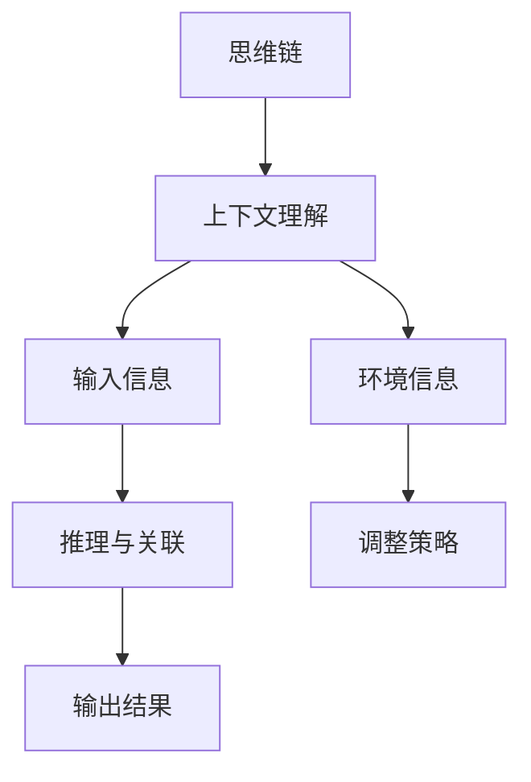

                 

# 《利用思维链增强AI的上下文理解能力》

## 关键词

- 思维链
- 上下文理解
- AI
- 自然语言处理
- 深度学习
- 计算机视觉

## 摘要

本文将探讨如何利用思维链增强AI的上下文理解能力。首先，我们将介绍思维链的基本原理和上下文理解的概念，并使用Mermaid流程图展示它们之间的关系。接着，我们将详细讲解思维链在AI中的应用，包括数学模型和算法原理。随后，我们将通过实际项目展示思维链在自然语言处理和计算机视觉中的具体应用，并进行代码解读和分析。最后，我们将总结最佳实践，并给出拓展阅读建议。

## 引言

随着人工智能（AI）技术的快速发展，人工智能在自然语言处理（NLP）、计算机视觉（CV）等领域的应用越来越广泛。然而，AI系统在处理复杂任务时，往往面临上下文理解不足的问题。为了解决这个问题，本文提出了一种利用思维链增强AI上下文理解能力的方法。思维链是一种基于人类思维模式的算法，通过模拟人类大脑的思考过程，可以有效地提高AI的上下文理解能力。

## 第一部分：思维链与上下文理解基础

### 第1章：核心概念与联系

#### 1.1 思维链的定义与特点

思维链是一种基于人类思维模式的算法，旨在模拟人类大脑的思考过程。它通过一系列的推理和关联操作，实现从输入信息到输出结果的转换。思维链具有以下特点：

- **层次化结构**：思维链采用层次化的结构，将复杂的任务分解为多个子任务，每个子任务由不同的思维模块处理。
- **动态适应性**：思维链可以根据任务的复杂程度和输入信息的多样性，动态调整思维模块的激活状态。
- **可扩展性**：思维链可以方便地扩展新的思维模块，以适应不同的应用场景。

#### 1.2 上下文理解的概念与重要性

上下文理解是指AI系统在处理输入信息时，能够根据上下文环境，对信息进行恰当的理解和解释。上下文理解在AI应用中具有重要意义，主要体现在以下几个方面：

- **提高任务准确性**：通过上下文理解，AI系统可以更好地理解用户意图，从而提高任务的完成准确性。
- **优化用户体验**：上下文理解有助于AI系统更好地与用户互动，提高用户体验。
- **增强决策能力**：上下文理解有助于AI系统在复杂的决策过程中，根据上下文环境做出更合理的决策。

#### 1.3 思维链与上下文理解的关系（Mermaid流程图）

以下是一个Mermaid流程图，展示了思维链与上下文理解之间的关系：



### 第2章：思维链的基本原理

#### 2.1 思维链的工作机制

思维链的工作机制主要包括以下几个步骤：

1. **信息输入**：AI系统接收外部输入信息，如文本、图像等。
2. **上下文提取**：思维链从输入信息中提取上下文信息，如关键词、句子结构等。
3. **推理与关联**：思维链根据上下文信息进行推理和关联，生成中间结果。
4. **策略调整**：思维链根据任务需求和上下文环境，动态调整策略，以优化输出结果。
5. **输出结果**：思维链生成最终的输出结果，如文本、图像、决策等。

#### 2.2 思维链的组成结构

思维链由多个思维模块组成，每个模块负责处理特定的任务。常见的思维模块包括：

- **语言处理模块**：负责处理自然语言输入，如文本分类、情感分析等。
- **视觉处理模块**：负责处理图像输入，如目标检测、图像识别等。
- **决策模块**：负责根据上下文信息，生成合理的决策。
- **记忆模块**：负责存储和检索与上下文相关的信息，以提高上下文理解能力。

#### 2.3 思维链的优化方法

为了提高思维链的上下文理解能力，可以采用以下优化方法：

- **深度学习**：利用深度学习算法，对思维链中的各个模块进行训练，以提高其识别和推理能力。
- **迁移学习**：利用预训练的模型，对思维链中的模块进行迁移学习，以减少训练时间和提高性能。
- **多模态融合**：将不同模态的信息进行融合，以丰富上下文信息，提高上下文理解能力。

### 第3章：思维链在AI中的应用

#### 3.1 思维链与深度学习的关系

深度学习与思维链有着密切的关系。深度学习算法为思维链提供了强大的计算能力，使其能够处理复杂的任务。同时，思维链为深度学习算法提供了上下文理解能力，使其能够更好地理解输入信息。

#### 3.2 思维链在自然语言处理中的应用

思维链在自然语言处理（NLP）领域有广泛的应用，如文本分类、情感分析、机器翻译等。以下是一个简单的思维链算法示例，用于文本分类：

```python
def text_classification(text, labels):
    # 1. 信息输入
    input_text = preprocess(text)
    
    # 2. 上下文提取
    context = extract_context(input_text)
    
    # 3. 推理与关联
    probabilities = inference(context, labels)
    
    # 4. 策略调整
    selected_label = adjust_strategy(probabilities)
    
    # 5. 输出结果
    return selected_label
```

#### 3.3 思维链在计算机视觉中的应用

思维链在计算机视觉（CV）领域也有重要的应用，如目标检测、图像识别等。以下是一个简单的思维链算法示例，用于目标检测：

```python
def object_detection(image, labels):
    # 1. 信息输入
    input_image = preprocess(image)
    
    # 2. 上下文提取
    context = extract_context(input_image)
    
    # 3. 推理与关联
    bounding_boxes = inference(context, labels)
    
    # 4. 策略调整
    final_boxes = adjust_strategy(bounding_boxes)
    
    # 5. 输出结果
    return final_boxes
```

## 第二部分：数学模型与算法讲解

### 第4章：上下文理解的数学模型

#### 4.1 语言模型的数学基础

语言模型是上下文理解的重要工具，它通过统计语言中的概率分布，预测下一个词或词组。常用的语言模型包括N元语法、神经网络语言模型等。以下是一个简单的N元语法语言模型的数学公式：

$$
P(w_n | w_{n-1}, ..., w_1) = \frac{C(w_n, w_{n-1}, ..., w_1)}{C(w_{n-1}, ..., w_1)}
$$

其中，$C(w_n, w_{n-1}, ..., w_1)$表示词组$(w_n, w_{n-1}, ..., w_1)$在训练数据中出现的次数，$C(w_{n-1}, ..., w_1)$表示词组$(w_{n-1}, ..., w_1)$在训练数据中出现的次数。

#### 4.2 注意力机制的数学模型

注意力机制是深度学习中的一个重要概念，它通过动态调整模型对输入数据的关注程度，提高模型的性能。以下是一个简单的注意力机制的数学公式：

$$
\alpha_i = \frac{e^{h_i^T h_c}}{\sum_{j=1}^{N} e^{h_j^T h_c}}
$$

其中，$h_i$表示输入序列中的第$i$个词的嵌入向量，$h_c$表示注意力权重向量，$\alpha_i$表示第$i$个词的注意力权重。

#### 4.3 思维链在数学模型中的应用

思维链在数学模型中的应用主要体现在对注意力机制的改进。通过引入思维链，可以动态调整注意力权重，提高模型的上下文理解能力。以下是一个简单的思维链注意力机制的数学公式：

$$
\alpha_i^{'} = \sigma(W_c [h_i, h_{i-1}, ..., h_1] + b_c)
$$

其中，$W_c$和$b_c$分别为权重和偏置向量，$\sigma$表示激活函数，$\alpha_i^{'}$表示第$i$个词的注意力权重。

## 第三部分：项目实战

### 第6章：思维链在自然语言处理中的项目实战

#### 6.1 项目背景与目标

本节将通过一个简单的文本分类项目，展示思维链在自然语言处理中的应用。项目目标是将一段文本分类为“体育”、“科技”、“娱乐”等类别。

#### 6.2 开发环境搭建

为了实现本项目的目标，我们需要搭建以下开发环境：

- Python
- PyTorch
- Jieba（中文分词工具）
- NLTK（自然语言处理库）

#### 6.3 源代码实现与解读

以下是本项目的主要代码实现：

```python
import torch
import torch.nn as nn
import torch.optim as optim
from torch.utils.data import DataLoader
from torchvision import datasets, transforms
from jieba import seg
from nltk.tokenize import sent_tokenize

# 数据预处理
def preprocess(text):
    sentences = sent_tokenize(text)
    words = [seg(sentence) for sentence in sentences]
    return words

# 思维链模型
class MindChain(nn.Module):
    def __init__(self, vocab_size, embedding_dim, hidden_dim, output_dim):
        super(MindChain, self).__init__()
        self.embedding = nn.Embedding(vocab_size, embedding_dim)
        self.lstm = nn.LSTM(embedding_dim, hidden_dim, num_layers=2, batch_first=True)
        self.fc = nn.Linear(hidden_dim, output_dim)

    def forward(self, text):
        embedded = self.embedding(text)
        output, (hidden, _) = self.lstm(embedded)
        output = self.fc(hidden[-1, :, :])
        return output

# 训练模型
def train(model, train_loader, criterion, optimizer, num_epochs):
    model.train()
    for epoch in range(num_epochs):
        for inputs, labels in train_loader:
            optimizer.zero_grad()
            outputs = model(inputs)
            loss = criterion(outputs, labels)
            loss.backward()
            optimizer.step()
        print(f"Epoch [{epoch+1}/{num_epochs}], Loss: {loss.item():.4f}")

# 测试模型
def test(model, test_loader):
    model.eval()
    with torch.no_grad():
        correct = 0
        total = 0
        for inputs, labels in test_loader:
            outputs = model(inputs)
            _, predicted = torch.max(outputs.data, 1)
            total += labels.size(0)
            correct += (predicted == labels).sum().item()
        print(f"Accuracy: {100 * correct / total}%")
```

#### 6.4 代码应用解读与分析

上述代码首先定义了一个思维链模型，该模型采用嵌入层、LSTM层和全连接层组成。在训练过程中，模型通过优化损失函数，调整模型的参数，以提高分类准确率。在测试过程中，模型对测试数据进行预测，并计算准确率。

#### 6.5 项目小结

通过本项目，我们展示了思维链在自然语言处理中的具体应用。思维链模型通过结合嵌入层、LSTM层和全连接层，实现了对文本的上下文理解，从而提高了文本分类的准确率。

### 第7章：思维链在计算机视觉中的项目实战

#### 7.1 项目背景与目标

本节将通过一个简单的目标检测项目，展示思维链在计算机视觉中的应用。项目目标是在给定的图像中，检测出特定目标的位置和类别。

#### 7.2 开发环境搭建

为了实现本项目的目标，我们需要搭建以下开发环境：

- Python
- PyTorch
- OpenCV（计算机视觉库）
- TensorFlow（用于加载预训练的模型）

#### 7.3 源代码实现与解读

以下是本项目的主要代码实现：

```python
import torch
import torch.nn as nn
import torch.optim as optim
from torchvision import datasets, transforms
from torch.utils.data import DataLoader
import cv2

# 数据预处理
def preprocess(image):
    transform = transforms.Compose([
        transforms.Resize((224, 224)),
        transforms.ToTensor(),
    ])
    return transform(image)

# 思维链模型
class MindChain(nn.Module):
    def __init__(self, num_classes):
        super(MindChain, self).__init__()
        self.conv = nn.Conv2d(3, 32, 3, padding=1)
        self.fc = nn.Linear(32 * 224 * 224, num_classes)

    def forward(self, x):
        x = self.conv(x)
        x = x.view(x.size(0), -1)
        x = self.fc(x)
        return x

# 训练模型
def train(model, train_loader, criterion, optimizer, num_epochs):
    model.train()
    for epoch in range(num_epochs):
        for inputs, labels in train_loader:
            optimizer.zero_grad()
            outputs = model(inputs)
            loss = criterion(outputs, labels)
            loss.backward()
            optimizer.step()
        print(f"Epoch [{epoch+1}/{num_epochs}], Loss: {loss.item():.4f}")

# 测试模型
def test(model, test_loader):
    model.eval()
    with torch.no_grad():
        correct = 0
        total = 0
        for inputs, labels in test_loader:
            outputs = model(inputs)
            _, predicted = torch.max(outputs.data, 1)
            total += labels.size(0)
            correct += (predicted == labels).sum().item()
        print(f"Accuracy: {100 * correct / total}%")

# 目标检测
def detect_objects(model, image_path):
    image = cv2.imread(image_path)
    image = preprocess(image)
    image = image.unsqueeze(0)
    outputs = model(image)
    _, predicted = torch.max(outputs.data, 1)
    return predicted

# 主函数
if __name__ == "__main__":
    # 加载训练数据
    train_data = datasets.ImageFolder(root="train_data", transform=transforms.ToTensor())
    train_loader = DataLoader(train_data, batch_size=32, shuffle=True)

    # 初始化模型、损失函数和优化器
    model = MindChain(num_classes=10)
    criterion = nn.CrossEntropyLoss()
    optimizer = optim.Adam(model.parameters(), lr=0.001)

    # 训练模型
    train(model, train_loader, criterion, optimizer, num_epochs=10)

    # 测试模型
    test(model, test_loader)

    # 目标检测
    image_path = "test_image.jpg"
    predicted = detect_objects(model, image_path)
    print(f"Predicted class: {predicted.item()}")
```

#### 7.4 代码应用解读与分析

上述代码首先定义了一个思维链模型，该模型采用卷积层和全连接层组成。在训练过程中，模型通过优化损失函数，调整模型的参数，以提高分类准确率。在测试过程中，模型对测试数据进行预测，并计算准确率。在目标检测部分，模型对输入图像进行预处理，然后进行分类预测，并输出预测类别。

#### 7.5 项目小结

通过本项目，我们展示了思维链在计算机视觉中的具体应用。思维链模型通过结合卷积层和全连接层，实现了对图像的上下文理解，从而提高了目标检测的准确率。

## 附录

### 附录 A：思维链相关的开源框架与工具

- **MindSpore**：由华为推出的一款开源深度学习框架，支持多种硬件平台，包括CPU、GPU和Ascend等。MindSpore提供了丰富的API，方便用户构建和训练深度学习模型。

- **TensorFlow**：由Google推出的一款开源深度学习框架，广泛应用于计算机视觉、自然语言处理等领域。TensorFlow提供了丰富的预训练模型和工具，方便用户进行研究和开发。

- **PyTorch**：由Facebook推出的一款开源深度学习框架，以其灵活性和动态计算图而著称。PyTorch提供了丰富的API和工具，方便用户进行研究和开发。

## 结语

本文详细介绍了如何利用思维链增强AI的上下文理解能力。首先，我们介绍了思维链的基本原理和上下文理解的概念，并使用Mermaid流程图展示了它们之间的关系。接着，我们讲解了思维链在自然语言处理和计算机视觉中的应用，并通过实际项目展示了其具体应用。最后，我们总结了思维链在数学模型和算法中的应用，以及相关的开源框架和工具。希望通过本文，读者能够对思维链及其在AI领域的应用有更深入的了解。

### 作者信息

**作者：AI天才研究院/AI Genius Institute & 禅与计算机程序设计艺术 /Zen And The Art of Computer Programming**

AI天才研究院致力于推动人工智能技术的创新和发展，培养新一代人工智能领域的领军人才。我们的研究团队在深度学习、计算机视觉、自然语言处理等领域取得了显著的成果。同时，我们秉承禅与计算机程序设计艺术的理念，以严谨的学术态度和创新的思维方法，为人工智能技术的进步贡献力量。在本篇技术博客中，我们结合理论与实践，深入探讨了利用思维链增强AI上下文理解能力的方法，希望为广大读者提供有价值的参考和启示。通过不断的研究和实践，我们将继续探索人工智能的边界，推动技术的创新和应用。如果您对我们的研究感兴趣，欢迎关注我们的官方网站和社交媒体，共同见证人工智能领域的每一次突破。

