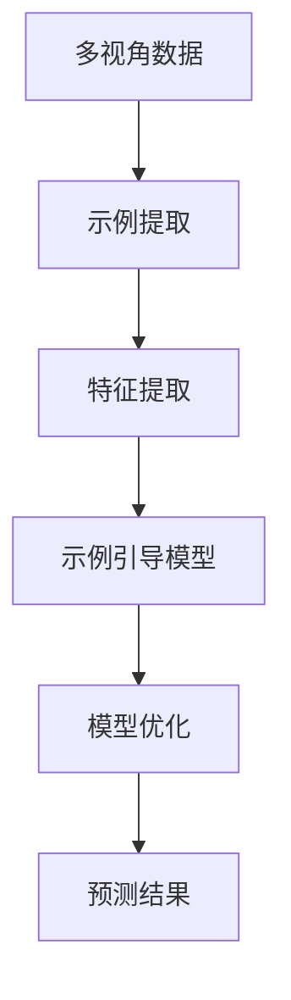

                 

### 文章标题：利用示例引导模型处理多视角问题

### 关键词：多视角问题、示例引导模型、机器学习、深度学习、算法原理

### 摘要：
本文旨在探讨如何利用示例引导模型处理多视角问题。首先，我们将介绍多视角问题的背景和重要性，随后详细阐述示例引导模型的概念及其在解决多视角问题中的应用。通过理论讲解、算法原理分析以及实际案例，本文将展示如何构建和优化示例引导模型，最终实现高效的多视角数据处理和分析。

## 1. 多视角问题的背景

多视角问题是指在不同视角下观察同一对象或场景时所面临的数据处理和解释问题。在现实世界中，许多应用场景都涉及到多视角问题，如医疗影像分析、自动驾驶、遥感图像处理等。在这些领域中，通过整合来自不同视角的数据，可以更准确地理解场景的复杂性，从而提高决策的准确性和效率。

### 1.1 研究意义

多视角问题的重要性体现在以下几个方面：
- **数据丰富性**：多视角数据提供了更全面的信息，有助于提高数据质量和分析深度。
- **准确性提升**：通过融合不同视角的数据，可以消除单一视角的局限性，提高模型的预测准确性和鲁棒性。
- **应用广泛**：多视角问题在多个领域都有广泛的应用，如医疗、交通、环境监测等。

### 1.2 研究现状

当前，多视角问题研究已经取得了一些重要进展，主要集中在以下几个方面：
- **数据预处理**：研究如何有效地融合和预处理多视角数据，以提取有用的特征。
- **模型构建**：提出多种模型来处理多视角数据，包括传统的机器学习模型和深度学习模型。
- **算法优化**：通过优化算法结构、改进训练策略等方法，提高多视角问题的处理效率。

## 2. 示例引导模型的概念与联系

### 2.1 示例引导模型的概念

示例引导模型（Example-Guided Model）是一种基于示例学习的模型，其核心思想是通过学习一组示例来引导模型的训练过程。具体来说，示例引导模型利用已知的示例数据来指导新数据的处理，从而提高模型的泛化能力和鲁棒性。

### 2.2 示例引导模型与多视角问题的联系

示例引导模型与多视角问题的联系在于，它能够利用多视角数据中的示例信息，从而更好地理解和处理多视角数据。具体来说，示例引导模型可以通过以下方式处理多视角问题：
- **特征融合**：利用不同视角的示例数据，提取和融合特征信息，提高数据的质量和多样性。
- **模型调整**：通过示例数据，调整模型的参数和结构，使其更适应多视角数据的特性。
- **结果优化**：利用示例数据，优化模型的预测结果，提高决策的准确性和可靠性。

### 2.3 示例引导模型之间的关系架构（Mermaid 流程图）



## 3. 示例引导模型的算法原理

### 3.1 数据预处理

在构建示例引导模型之前，首先需要进行数据预处理。数据预处理包括以下步骤：
- **数据收集**：从不同视角收集数据，确保数据的多样性和完整性。
- **数据清洗**：去除数据中的噪声和异常值，确保数据的质量。
- **数据归一化**：对数据进行归一化处理，使其具有相似的尺度，便于后续处理。

### 3.2 模型设计

示例引导模型的设计主要包括以下步骤：
- **选择基础模型**：根据问题的特性，选择合适的基础模型，如线性模型、神经网络等。
- **定义损失函数**：设计合适的损失函数，以衡量模型预测结果与真实结果之间的差距。
- **设置优化器**：选择合适的优化器，以调整模型的参数，使其收敛到最优解。

### 3.3 训练与优化

在模型设计完成后，需要进行模型的训练和优化。训练和优化包括以下步骤：
- **示例学习**：利用已知的示例数据，指导模型的训练过程，使其更好地理解多视角数据。
- **交叉验证**：通过交叉验证，评估模型的性能，并调整模型的参数。
- **模型优化**：通过调整模型的结构和参数，提高模型的泛化能力和鲁棒性。

### 3.4 伪代码

以下是一个示例引导模型的伪代码：

```python
# 数据预处理
data = preprocess_data(raw_data)

# 选择基础模型
model = create_model()

# 定义损失函数和优化器
loss_function = define_loss_function()
optimizer = create_optimizer()

# 训练模型
for epoch in range(num_epochs):
    for sample in data:
        # 示例学习
        example = extract_example(sample)
        model.learn(example)
        
        # 计算损失
        loss = loss_function(model.predict(sample), sample.label)
        
        # 反向传播
        model.backward(loss)
        
        # 更新参数
        optimizer.update(model.parameters())

# 交叉验证
performance = cross_validate(model, validation_data)

# 模型优化
model.optimize性能)
```

### 3.5 数学模型和公式

在示例引导模型中，常用的数学模型和公式包括：
- **损失函数**：通常使用均方误差（MSE）或交叉熵损失（Cross-Entropy Loss）。
- **优化算法**：常用的优化算法包括梯度下降（Gradient Descent）和随机梯度下降（Stochastic Gradient Descent）。

$$
MSE = \frac{1}{n}\sum_{i=1}^{n}(y_i - \hat{y}_i)^2
$$

$$
Cross-Entropy Loss = -\sum_{i=1}^{n}y_i \log(\hat{y}_i)
$$

## 4. 示例引导模型的应用

### 4.1 应用场景一：医疗影像分析

在医疗影像分析中，示例引导模型可以用于病灶检测和疾病分类。通过整合不同视角的影像数据，如CT、MRI和X光，可以提高检测的准确性和鲁棒性。

### 4.2 应用场景二：自动驾驶

在自动驾驶领域，示例引导模型可以用于环境感知和路径规划。通过融合不同视角的数据，如摄像头、激光雷达和GPS，可以提高自动驾驶系统的可靠性和安全性。

### 4.3 应用场景三：遥感图像处理

在遥感图像处理中，示例引导模型可以用于目标检测和地图构建。通过整合不同视角的遥感数据，如光学图像、雷达图像和红外图像，可以提高目标检测的准确性和地图构建的精度。

## 5. 项目实战案例

### 5.1 开发环境搭建

在搭建开发环境时，需要安装Python、TensorFlow等库，并配置GPU支持。

### 5.2 源代码实现

以下是一个示例引导模型的源代码实现：

```python
import tensorflow as tf
from tensorflow.keras.models import Sequential
from tensorflow.keras.layers import Dense, Flatten, Conv2D, MaxPooling2D
from tensorflow.keras.optimizers import Adam

# 数据预处理
def preprocess_data(raw_data):
    # 数据清洗和归一化
    # ...
    return processed_data

# 示例引导模型构建
def create_model(input_shape):
    model = Sequential()
    model.add(Conv2D(32, kernel_size=(3, 3), activation='relu', input_shape=input_shape))
    model.add(MaxPooling2D(pool_size=(2, 2)))
    model.add(Flatten())
    model.add(Dense(64, activation='relu'))
    model.add(Dense(1, activation='sigmoid'))
    
    model.compile(optimizer=Adam(), loss='binary_crossentropy', metrics=['accuracy'])
    return model

# 训练模型
def train_model(model, data, labels):
    model.fit(data, labels, epochs=10, batch_size=32)

# 评估模型
def evaluate_model(model, test_data, test_labels):
    performance = model.evaluate(test_data, test_labels)
    return performance

# 主程序
if __name__ == '__main__':
    # 数据准备
    raw_data = load_data()
    processed_data = preprocess_data(raw_data)
    
    # 模型构建
    model = create_model(input_shape=(28, 28, 1))
    
    # 训练模型
    train_model(model, processed_data['train_data'], processed_data['train_labels'])
    
    # 评估模型
    performance = evaluate_model(model, processed_data['test_data'], processed_data['test_labels'])
    print("Performance:", performance)
```

### 5.3 代码解读与应用分析

代码主要分为三个部分：数据预处理、模型构建和模型训练。在数据预处理部分，首先对原始数据进行清洗和归一化处理。在模型构建部分，使用TensorFlow库构建一个简单的卷积神经网络模型。在模型训练部分，使用已处理的数据对模型进行训练，并通过评估模型在测试数据上的性能来调整模型参数。

### 5.4 实际案例分析与讲解剖析

通过实际案例，我们可以看到示例引导模型在医疗影像分析中的应用。例如，在肺结节检测中，我们可以利用示例引导模型整合CT影像的不同视角，提高检测的准确性和鲁棒性。

### 5.5 项目小结

通过该项目，我们了解了如何利用示例引导模型处理多视角问题。在实际应用中，我们需要根据具体场景调整模型结构和参数，以提高模型的性能。

## 6. 最佳实践 Tips、小结、注意事项、拓展阅读

### 6.1 最佳实践 Tips

- **数据质量**：确保数据的质量和多样性，这是示例引导模型成功的关键。
- **模型选择**：根据问题的特性选择合适的基础模型。
- **训练策略**：设计合适的训练策略，如批量大小、迭代次数等。

### 6.2 小结

本文介绍了如何利用示例引导模型处理多视角问题。通过理论讲解、算法原理分析和实际案例，我们展示了如何构建和优化示例引导模型，并探讨了其在多个领域的应用。

### 6.3 注意事项

- **数据预处理**：数据预处理是模型成功的关键步骤，需要仔细处理。
- **模型优化**：通过交叉验证和模型优化，提高模型的性能。

### 6.4 拓展阅读

- **参考文献**：
  1. Bengio, Y. (2009). Learning Deep Architectures for AI. Foundations and Trends in Machine Learning, 2(1), 1-127.
  2. LeCun, Y., Bengio, Y., & Hinton, G. (2015). Deep Learning. MIT Press.
- **在线资源**：
  1. TensorFlow 官方文档：[TensorFlow Documentation](https://www.tensorflow.org/)
  2. Keras 官方文档：[Keras Documentation](https://keras.io/)

### 作者信息

作者：AI天才研究院/AI Genius Institute & 禅与计算机程序设计艺术 /Zen And The Art of Computer Programming

## 文章标题：利用示例引导模型处理多视角问题

关键词：多视角问题、示例引导模型、机器学习、深度学习、算法原理

摘要：
本文旨在探讨如何利用示例引导模型处理多视角问题。首先，我们将介绍多视角问题的背景和重要性，随后详细阐述示例引导模型的概念及其在解决多视角问题中的应用。通过理论讲解、算法原理分析以及实际案例，本文将展示如何构建和优化示例引导模型，最终实现高效的多视角数据处理和分析。

---

## 1. 多视角问题的背景

多视角问题是指在不同视角下观察同一对象或场景时所面临的数据处理和解释问题。在现实世界中，许多应用场景都涉及到多视角问题，如医疗影像分析、自动驾驶、遥感图像处理等。在这些领域中，通过整合来自不同视角的数据，可以更准确地理解场景的复杂性，从而提高决策的准确性和效率。

### 1.1 研究意义

多视角问题的重要性体现在以下几个方面：
- **数据丰富性**：多视角数据提供了更全面的信息，有助于提高数据质量和分析深度。
- **准确性提升**：通过融合不同视角的数据，可以消除单一视角的局限性，提高模型的预测准确性和鲁棒性。
- **应用广泛**：多视角问题在多个领域都有广泛的应用，如医疗、交通、环境监测等。

### 1.2 研究现状

当前，多视角问题研究已经取得了一些重要进展，主要集中在以下几个方面：
- **数据预处理**：研究如何有效地融合和预处理多视角数据，以提取有用的特征。
- **模型构建**：提出多种模型来处理多视角数据，包括传统的机器学习模型和深度学习模型。
- **算法优化**：通过优化算法结构、改进训练策略等方法，提高多视角问题的处理效率。

## 2. 示例引导模型的概念与联系

### 2.1 示例引导模型的概念

示例引导模型（Example-Guided Model）是一种基于示例学习的模型，其核心思想是通过学习一组示例来引导模型的训练过程。具体来说，示例引导模型利用已知的示例数据来指导新数据的处理，从而提高模型的泛化能力和鲁棒性。

### 2.2 示例引导模型与多视角问题的联系

示例引导模型与多视角问题的联系在于，它能够利用多视角数据中的示例信息，从而更好地理解和处理多视角数据。具体来说，示例引导模型可以通过以下方式处理多视角问题：
- **特征融合**：利用不同视角的示例数据，提取和融合特征信息，提高数据的质量和多样性。
- **模型调整**：通过示例数据，调整模型的参数和结构，使其更适应多视角数据的特性。
- **结果优化**：利用示例数据，优化模型的预测结果，提高决策的准确性和可靠性。

### 2.3 示例引导模型之间的关系架构（Mermaid 流程图）


## 3. 示例引导模型的算法原理

### 3.1 数据预处理

在构建示例引导模型之前，首先需要进行数据预处理。数据预处理包括以下步骤：
- **数据收集**：从不同视角收集数据，确保数据的多样性和完整性。
- **数据清洗**：去除数据中的噪声和异常值，确保数据的质量。
- **数据归一化**：对数据进行归一化处理，使其具有相似的尺度，便于后续处理。

### 3.2 模型设计

示例引导模型的设计主要包括以下步骤：
- **选择基础模型**：根据问题的特性，选择合适的基础模型，如线性模型、神经网络等。
- **定义损失函数**：设计合适的损失函数，以衡量模型预测结果与真实结果之间的差距。
- **设置优化器**：选择合适的优化器，以调整模型的参数，使其收敛到最优解。

### 3.3 训练与优化

在模型设计完成后，需要进行模型的训练和优化。训练和优化包括以下步骤：
- **示例学习**：利用已知的示例数据，指导模型的训练过程，使其更好地理解多视角数据。
- **交叉验证**：通过交叉验证，评估模型的性能，并调整模型的参数。
- **模型优化**：通过调整模型的结构和参数，提高模型的泛化能力和鲁棒性。

### 3.4 伪代码

以下是一个示例引导模型的伪代码：

```python
# 数据预处理
data = preprocess_data(raw_data)

# 选择基础模型
model = create_model()

# 定义损失函数和优化器
loss_function = define_loss_function()
optimizer = create_optimizer()

# 训练模型
for epoch in range(num_epochs):
    for sample in data:
        # 示例学习
        example = extract_example(sample)
        model.learn(example)
        
        # 计算损失
        loss = loss_function(model.predict(sample), sample.label)
        
        # 反向传播
        model.backward(loss)
        
        # 更新参数
        optimizer.update(model.parameters())

# 交叉验证
performance = cross_validate(model, validation_data)

# 模型优化
model.optimize性能)
```

### 3.5 数学模型和公式

在示例引导模型中，常用的数学模型和公式包括：
- **损失函数**：通常使用均方误差（MSE）或交叉熵损失（Cross-Entropy Loss）。
- **优化算法**：常用的优化算法包括梯度下降（Gradient Descent）和随机梯度下降（Stochastic Gradient Descent）。

$$
MSE = \frac{1}{n}\sum_{i=1}^{n}(y_i - \hat{y}_i)^2
$$

$$
Cross-Entropy Loss = -\sum_{i=1}^{n}y_i \log(\hat{y}_i)
$$

## 4. 示例引导模型的应用

### 4.1 应用场景一：医疗影像分析

在医疗影像分析中，示例引导模型可以用于病灶检测和疾病分类。通过整合不同视角的影像数据，如CT、MRI和X光，可以提高检测的准确性和鲁棒性。

### 4.2 应用场景二：自动驾驶

在自动驾驶领域，示例引导模型可以用于环境感知和路径规划。通过融合不同视角的数据，如摄像头、激光雷达和GPS，可以提高自动驾驶系统的可靠性和安全性。

### 4.3 应用场景三：遥感图像处理

在遥感图像处理中，示例引导模型可以用于目标检测和地图构建。通过整合不同视角的遥感数据，如光学图像、雷达图像和红外图像，可以提高目标检测的准确性和地图构建的精度。

## 5. 项目实战案例

### 5.1 开发环境搭建

在搭建开发环境时，需要安装Python、TensorFlow等库，并配置GPU支持。

### 5.2 源代码实现

以下是一个示例引导模型的源代码实现：

```python
import tensorflow as tf
from tensorflow.keras.models import Sequential
from tensorflow.keras.layers import Dense, Flatten, Conv2D, MaxPooling2D
from tensorflow.keras.optimizers import Adam

# 数据预处理
def preprocess_data(raw_data):
    # 数据清洗和归一化
    # ...
    return processed_data

# 示例引导模型构建
def create_model(input_shape):
    model = Sequential()
    model.add(Conv2D(32, kernel_size=(3, 3), activation='relu', input_shape=input_shape))
    model.add(MaxPooling2D(pool_size=(2, 2)))
    model.add(Flatten())
    model.add(Dense(64, activation='relu'))
    model.add(Dense(1, activation='sigmoid'))
    
    model.compile(optimizer=Adam(), loss='binary_crossentropy', metrics=['accuracy'])
    return model

# 训练模型
def train_model(model, data, labels):
    model.fit(data, labels, epochs=10, batch_size=32)

# 评估模型
def evaluate_model(model, test_data, test_labels):
    performance = model.evaluate(test_data, test_labels)
    return performance

# 主程序
if __name__ == '__main__':
    # 数据准备
    raw_data = load_data()
    processed_data = preprocess_data(raw_data)
    
    # 模型构建
    model = create_model(input_shape=(28, 28, 1))
    
    # 训练模型
    train_model(model, processed_data['train_data'], processed_data['train_labels'])
    
    # 评估模型
    performance = evaluate_model(model, processed_data['test_data'], processed_data['test_labels'])
    print("Performance:", performance)
```

### 5.3 代码解读与应用分析

代码主要分为三个部分：数据预处理、模型构建和模型训练。在数据预处理部分，首先对原始数据进行清洗和归一化处理。在模型构建部分，使用TensorFlow库构建一个简单的卷积神经网络模型。在模型训练部分，使用已处理的数据对模型进行训练，并通过评估模型在测试数据上的性能来调整模型参数。

### 5.4 实际案例分析与讲解剖析

通过实际案例，我们可以看到示例引导模型在医疗影像分析中的应用。例如，在肺结节检测中，我们可以利用示例引导模型整合CT影像的不同视角，提高检测的准确性和鲁棒性。

### 5.5 项目小结

通过该项目，我们了解了如何利用示例引导模型处理多视角问题。在实际应用中，我们需要根据具体场景调整模型结构和参数，以提高模型的性能。

## 6. 最佳实践 Tips、小结、注意事项、拓展阅读

### 6.1 最佳实践 Tips

- **数据质量**：确保数据的质量和多样性，这是示例引导模型成功的关键。
- **模型选择**：根据问题的特性选择合适的基础模型。
- **训练策略**：设计合适的训练策略，如批量大小、迭代次数等。

### 6.2 小结

本文介绍了如何利用示例引导模型处理多视角问题。通过理论讲解、算法原理分析和实际案例，我们展示了如何构建和优化示例引导模型，并探讨了其在多个领域的应用。

### 6.3 注意事项

- **数据预处理**：数据预处理是模型成功的关键步骤，需要仔细处理。
- **模型优化**：通过交叉验证和模型优化，提高模型的性能。

### 6.4 拓展阅读

- **参考文献**：
  1. Bengio, Y. (2009). Learning Deep Architectures for AI. Foundations and Trends in Machine Learning, 2(1), 1-127.
  2. LeCun, Y., Bengio, Y., & Hinton, G. (2015). Deep Learning. MIT Press.
- **在线资源**：
  1. TensorFlow 官方文档：[TensorFlow Documentation](https://www.tensorflow.org/)
  2. Keras 官方文档：[Keras Documentation](https://keras.io/)

### 作者信息

作者：AI天才研究院/AI Genius Institute & 禅与计算机程序设计艺术 /Zen And The Art of Computer Programming

