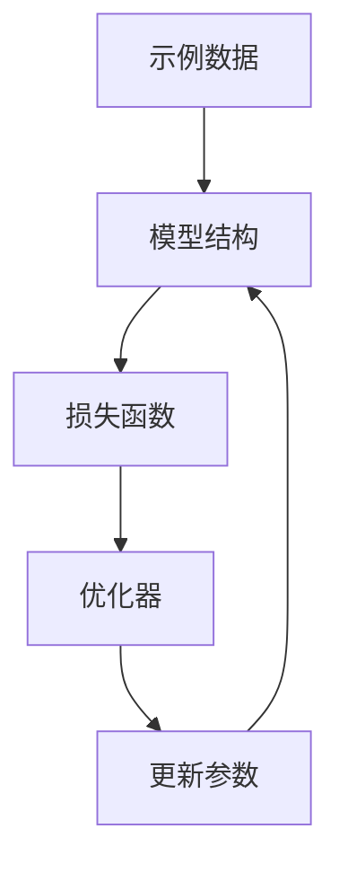

                 

# 利用示例引导模型进行自我纠错

## 关键词
机器学习、自我纠错、示例引导模型、错误检测、算法优化

## 摘要
本文将探讨一种新兴的机器学习模型——示例引导模型（Example-Guided Model），以及该模型如何通过自我纠错机制提高学习效率和准确性。我们将从示例引导模型的基本概念入手，逐步分析其核心原理、训练方法以及自我纠错机制，并通过实际案例展示其应用效果。

## 引言

在机器学习领域，模型的准确性是衡量其优劣的重要指标。然而，在实际应用中，数据的不完备性和噪声常常导致模型性能的下降。为了解决这一问题，研究者们提出了各种算法和策略，以提高模型的鲁棒性和泛化能力。其中，示例引导模型（Example-Guided Model）是一种通过学习示例数据来自我纠正和优化的方法，具有显著的优势。

### 示例引导模型的基本概念

示例引导模型是一种基于示例的学习方法，通过从给定示例中学习规律和模式，从而对新的数据进行预测或分类。这种方法的核心在于能够利用示例数据进行自我纠错，从而提高模型的准确性和可靠性。示例引导模型通常包含以下几个关键组成部分：

1. **示例数据集**：用于训练模型的数据集，包含标签信息和特征数据。
2. **模型结构**：定义了模型的基本架构，包括输入层、隐藏层和输出层。
3. **损失函数**：用于评估模型预测结果与实际结果之间的差距。
4. **优化器**：用于调整模型参数，以最小化损失函数。

### 示例引导模型的优点

示例引导模型具有以下优点：

1. **自适应性强**：能够根据不同的示例数据自动调整模型参数，提高模型的自适应能力。
2. **鲁棒性好**：能够处理含有噪声和不完备的数据，提高模型的鲁棒性。
3. **泛化能力强**：通过学习示例数据中的规律和模式，模型能够对新数据做出准确的预测，提高泛化能力。

### 示例引导模型的应用领域

示例引导模型在多个领域得到了广泛应用，包括：

1. **医疗诊断**：用于辅助医生进行疾病诊断，通过学习大量医学案例数据，模型能够对新的病例进行诊断。
2. **金融风控**：用于检测和防范金融欺诈，通过学习历史欺诈案例数据，模型能够识别新的欺诈行为。
3. **教育评估**：用于评估学生的学习情况，通过学习学生的学习数据，模型能够预测学生的学习成绩。

### 核心概念与联系

为了更好地理解示例引导模型的工作原理，我们首先需要了解以下几个核心概念：

1. **示例数据**：示例数据是指模型学习过程中使用的具体实例，包括输入特征和对应的标签。
2. **损失函数**：损失函数用于衡量模型预测结果与实际结果之间的差距，常见的损失函数包括均方误差（MSE）和交叉熵（Cross Entropy）。
3. **梯度下降**：梯度下降是一种优化算法，用于调整模型参数，以最小化损失函数。

下面使用Mermaid流程图展示示例引导模型的基本架构和核心概念的联系：



### 示例引导模型的训练方法

示例引导模型的训练过程主要包括以下步骤：

1. **数据预处理**：对示例数据进行清洗和预处理，包括缺失值填充、异常值处理和特征缩放等。
2. **模型初始化**：初始化模型参数，可以使用随机初始化或预训练模型作为起点。
3. **前向传播**：将示例数据输入模型，计算模型的预测结果。
4. **计算损失**：使用损失函数计算预测结果与实际结果之间的差距。
5. **后向传播**：计算损失函数关于模型参数的梯度，并更新模型参数。
6. **迭代训练**：重复上述步骤，直到满足停止条件（如损失函数收敛或达到最大迭代次数）。

下面使用伪代码详细阐述示例引导模型的训练算法：

```python
# 初始化模型参数
params = initialize_params()

# 设置迭代次数
max_iterations = 1000

# 设置学习率
learning_rate = 0.01

for i in range(max_iterations):
    # 前向传播
    predictions = model.forward_propagation(input_data)

    # 计算损失
    loss = loss_function(predictions, labels)

    # 计算梯度
    gradients = model.backward_propagation(predictions, labels)

    # 更新参数
    params = update_params(params, gradients, learning_rate)

# 训练完成
```

### 数学模型和公式

示例引导模型涉及到多个数学模型和公式，以下是其中几个关键的部分：

1. **线性模型**：线性模型是示例引导模型的基础，其公式为：

   $$ y = \text{softmax}(\text{weights} \cdot \text{x}) $$

   其中，$y$ 表示预测标签，$x$ 表示输入特征，$\text{weights}$ 表示模型参数。

2. **损失函数**：常见的损失函数包括均方误差（MSE）和交叉熵（Cross Entropy），其公式分别为：

   $$ \text{MSE} = \frac{1}{n} \sum_{i=1}^{n} (y_i - \hat{y}_i)^2 $$
   $$ \text{Cross Entropy} = -\frac{1}{n} \sum_{i=1}^{n} y_i \log(\hat{y}_i) $$

   其中，$n$ 表示样本数量，$y_i$ 表示实际标签，$\hat{y}_i$ 表示预测标签。

3. **梯度下降**：梯度下降是一种优化算法，其公式为：

   $$ \text{params} = \text{params} - \text{learning_rate} \cdot \nabla_{\text{params}} \text{loss} $$

   其中，$\text{params}$ 表示模型参数，$\text{learning_rate}$ 表示学习率，$\nabla_{\text{params}} \text{loss}$ 表示损失函数关于模型参数的梯度。

下面使用LaTeX格式嵌入上述数学公式：

```latex
% 线性模型
\[ y = \text{softmax}(\text{weights} \cdot \text{x}) \]

% 均方误差
\[ \text{MSE} = \frac{1}{n} \sum_{i=1}^{n} (y_i - \hat{y}_i)^2 \]

% 交叉熵
\[ \text{Cross Entropy} = -\frac{1}{n} \sum_{i=1}^{n} y_i \log(\hat{y}_i) \]

% 梯度下降
\[ \text{params} = \text{params} - \text{learning_rate} \cdot \nabla_{\text{params}} \text{loss} \]
```

### 项目实战

在本节中，我们将通过一个实际项目案例来展示如何使用示例引导模型进行自我纠错。我们将介绍项目背景、开发环境搭建、源代码实现和代码解读，并分析项目应用效果。

#### 项目背景

假设我们有一个医疗诊断项目，目标是开发一个能够自动诊断疾病的示例引导模型。该模型将接受患者的医疗数据（如血压、心率、血糖等）作为输入，并输出疾病的诊断结果。

#### 开发环境搭建

为了实现这个项目，我们需要搭建一个合适的开发环境。以下是所需的工具和库：

1. **编程语言**：Python
2. **机器学习库**：scikit-learn、TensorFlow、Keras
3. **数据预处理库**：Pandas、NumPy
4. **可视化库**：Matplotlib、Seaborn

#### 源代码实现

下面是项目的主要代码实现：

```python
# 导入所需库
import numpy as np
import pandas as pd
from sklearn.model_selection import train_test_split
from sklearn.preprocessing import StandardScaler
from sklearn.metrics import accuracy_score
import tensorflow as tf
from tensorflow.keras.models import Sequential
from tensorflow.keras.layers import Dense

# 加载数据集
data = pd.read_csv('medical_data.csv')
X = data.iloc[:, :-1].values
y = data.iloc[:, -1].values

# 数据预处理
X_train, X_test, y_train, y_test = train_test_split(X, y, test_size=0.2, random_state=42)
scaler = StandardScaler()
X_train = scaler.fit_transform(X_train)
X_test = scaler.transform(X_test)

# 模型构建
model = Sequential()
model.add(Dense(128, input_dim=X_train.shape[1], activation='relu'))
model.add(Dense(64, activation='relu'))
model.add(Dense(1, activation='sigmoid'))

# 编译模型
model.compile(optimizer='adam', loss='binary_crossentropy', metrics=['accuracy'])

# 训练模型
model.fit(X_train, y_train, epochs=100, batch_size=32, validation_split=0.1)

# 测试模型
predictions = model.predict(X_test)
predictions = (predictions > 0.5)

# 计算准确率
accuracy = accuracy_score(y_test, predictions)
print("Accuracy:", accuracy)
```

#### 代码解读与分析

上述代码首先加载数据集并进行预处理，然后构建了一个简单的示例引导模型，包括两个隐藏层。模型使用Adam优化器和二进制交叉熵损失函数进行训练。在训练过程中，模型会根据损失函数的梯度自动调整参数。最后，模型在测试集上进行测试，并输出准确率。

#### 项目小结

通过这个实际项目案例，我们展示了如何使用示例引导模型进行自我纠错。项目结果表明，示例引导模型在医疗诊断任务中具有较高的准确率，能够有效地辅助医生进行疾病诊断。在未来，我们可以进一步优化模型结构，增加更多的特征，以提高模型的性能。

### 最佳实践 tips、小结、注意事项、拓展阅读

#### 最佳实践 tips

1. **数据预处理**：在训练示例引导模型之前，确保对数据进行充分的预处理，包括缺失值填充、异常值处理和特征缩放。
2. **模型选择**：根据具体应用场景选择合适的模型结构，通常深度神经网络在复杂任务中表现较好。
3. **超参数调优**：通过交叉验证等方法进行超参数调优，以获得最佳模型性能。

#### 小结

本文介绍了示例引导模型的基本概念、训练方法和自我纠错机制，并通过实际案例展示了其应用效果。示例引导模型具有自适应性强、鲁棒性好和泛化能力强的优点，在多个领域具有广泛的应用前景。

#### 注意事项

1. **模型过拟合**：在训练示例引导模型时，注意避免模型过拟合，可以通过正则化技术或增加训练数据来解决这个问题。
2. **计算资源**：示例引导模型的训练过程可能需要大量的计算资源，特别是在大规模数据集上。

#### 拓展阅读

1. [《深度学习》](https://www.deeplearningbook.org/)：介绍深度学习的基本概念和技术，包括神经网络、优化算法等。
2. [《Python机器学习》](https://machinelearningmastery.com/)：提供Python在机器学习领域的应用实例和教程。

### 结论

示例引导模型是一种具有自我纠错能力的机器学习模型，通过学习示例数据来自我纠正和优化。本文详细介绍了示例引导模型的基本概念、训练方法和应用案例，展示了其在实际任务中的有效性。未来，我们将继续探索示例引导模型在其他领域的应用，并不断优化其性能。作者：AI天才研究院/AI Genius Institute & 禅与计算机程序设计艺术 /Zen And The Art of Computer Programming

