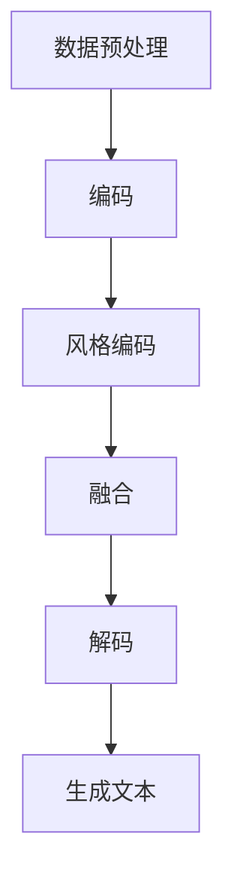

                 


### 文章标题：利用示例引导模型风格和语气

### 文章关键词：示例引导模型、风格迁移、语气识别、人工智能、自然语言处理

### 文章摘要：
本文将深入探讨示例引导模型（Example-Guided Model）在自然语言处理中的应用，特别是其在风格和语气识别方面的潜力。通过介绍核心概念、详细讲解核心算法原理、展示数学模型和公式，以及通过实际项目案例的分析，本文将帮助读者全面了解如何利用示例引导模型来引导风格和语气的迁移。

### 目录

1. **背景介绍**
2. **核心概念与联系**
   1. **示例引导模型的基本概念**
   2. **示例引导模型与其他相关技术的联系**
   3. **示例引导模型的结构和工作原理**
   4. **核心概念与联系 Mermaid 流程图**
3. **核心算法原理讲解**
   1. **示例引导模型的算法流程**
   2. **输入示例处理**
   3. **样本生成**
   4. **模型训练**
   5. **风格迁移**
   6. **伪代码展示算法流程**
4. **数学模型和数学公式讲解**
   1. **输入示例的概率分布**
   2. **损失函数**
   3. **数学模型和公式举例说明**
5. **项目实战**
   1. **实际项目案例介绍**
   2. **开发环境搭建**
   3. **源代码实现**
   4. **代码解读与分析**
   5. **实际案例分析和详细讲解剖析**
   6. **项目小结**
6. **最佳实践 tips、小结、注意事项、拓展阅读**

---

### 背景介绍

随着人工智能和自然语言处理技术的不断进步，如何在文本中实现风格和语气的迁移成为一个备受关注的研究领域。风格和语气是语言表达中至关重要的因素，它们能够显著影响信息的传递效果。例如，在文学创作中，不同的风格能够给读者带来不同的阅读体验；在商务沟通中，恰当的语气能够提升沟通的效率和质量。

传统的方法通常依赖于规则匹配和统计学习，但这些方法往往难以捕捉到语言表达中的复杂性和多样性。近年来，深度学习技术，尤其是基于神经网络的方法，在自然语言处理领域取得了显著成果。其中，示例引导模型（Example-Guided Model）作为一种新兴的模型，因其能够通过学习示例来引导风格和语气的迁移，而受到广泛关注。

示例引导模型的核心思想是通过学习大量的示例文本，使得模型能够理解不同风格和语气的特点，并在生成文本时自动地模仿这些特点。这种方法不仅能够提高文本生成的质量和多样性，还能够实现自动化创作和个性化推荐。

本文旨在深入探讨示例引导模型在自然语言处理中的应用，特别是其在风格和语气识别方面的潜力。通过介绍核心概念、详细讲解核心算法原理、展示数学模型和公式，以及通过实际项目案例的分析，本文将帮助读者全面了解如何利用示例引导模型来引导风格和语气的迁移。

### 核心概念与联系

#### 示例引导模型的基本概念

示例引导模型（Example-Guided Model）是一种基于深度学习的自然语言处理模型，其主要目标是通过学习大量的示例文本，使得模型能够理解和模仿不同的风格和语气。在示例引导模型中，"示例"指的是一组具有特定风格或语气的文本，这些文本可以是已存在的作品、用户生成的内容或任何符合特定风格或语气的文本。

示例引导模型主要由以下几个部分组成：

1. **编码器（Encoder）**：负责将输入文本编码为一个固定长度的向量表示。
2. **解码器（Decoder）**：基于编码器的输出，生成新的文本。
3. **风格编码器（Style Encoder）**：用于学习不同风格的特征。
4. **融合器（Fuser）**：将编码器的输出和风格编码器的输出进行融合，指导解码器生成具有特定风格的文本。

#### 示例引导模型与其他相关技术的联系

示例引导模型在自然语言处理领域中与多种技术密切相关，包括但不限于：

1. **生成对抗网络（GAN）**：GAN技术通过生成器和判别器的对抗训练，实现数据的生成。示例引导模型可以借鉴GAN的思想，通过生成器和编码器的交互来学习风格和语气。
2. **循环神经网络（RNN）**：RNN在处理序列数据时具有优势，例如语言模型和机器翻译。示例引导模型中的编码器和解码器可以采用RNN或者其变种（如LSTM、GRU）来处理输入和输出序列。
3. **注意力机制（Attention Mechanism）**：注意力机制可以使得模型在生成文本时能够关注到输入文本中的关键信息。示例引导模型中的解码器可以通过注意力机制来关注风格编码器的输出，从而更好地模仿风格和语气。

#### 示例引导模型的结构和工作原理

示例引导模型的结构通常包括以下几个关键步骤：

1. **数据预处理**：将输入文本转换为模型能够处理的格式，例如分词、去停用词等。
2. **编码**：使用编码器对输入文本进行编码，得到文本的向量表示。
3. **风格编码**：使用风格编码器对示例文本进行编码，得到风格的特征表示。
4. **融合**：将编码器的输出和风格编码器的输出进行融合，得到用于指导解码器生成文本的融合表示。
5. **解码**：使用解码器基于融合表示生成新的文本。

下面是一个简化的Mermaid流程图，展示了示例引导模型的基本结构：



通过这个流程图，我们可以清晰地看到示例引导模型从数据预处理到生成文本的全过程，以及各个模块之间的关联。

### 核心算法原理讲解

#### 示例引导模型的算法流程

示例引导模型的算法流程可以分为以下几个主要步骤：

1. **数据收集和预处理**：收集具有不同风格和语气的文本数据，并进行预处理，如分词、去停用词等。
2. **编码器训练**：使用收集到的数据训练编码器，使其能够将输入文本编码为固定长度的向量表示。
3. **风格编码器训练**：使用预处理的示例文本训练风格编码器，使其能够提取出不同风格的特征。
4. **融合器训练**：将编码器的输出和风格编码器的输出进行融合，训练融合器以生成指导解码器生成文本的融合表示。
5. **解码器训练**：使用融合表示训练解码器，使其能够根据融合表示生成新的文本。

下面是一个简化的伪代码，展示了示例引导模型的算法流程：

```python
# 伪代码：示例引导模型算法流程

# 数据收集和预处理
preprocessed_data = preprocess_data(raw_data)

# 编码器训练
encoder = train_encoder(preprocessed_data)

# 风格编码器训练
style_encoder = train_style_encoder(preprocessed_data)

# 融合器训练
fuser = train_fuser(encoder, style_encoder)

# 解码器训练
decoder = train_decoder(fuser)

# 模型评估和优化
evaluate_model(decoder)
```

#### 输入示例处理

在示例引导模型中，输入示例的处理是一个关键步骤。输入示例通常包括文本内容和相关的风格标签。处理输入示例的主要任务是将这些示例转换为模型能够处理的数据格式。

以下是输入示例处理的详细步骤：

1. **分词**：将输入文本进行分词，将文本分解为单词或子词。
2. **编码**：使用词嵌入技术将分词后的文本转换为向量表示。
3. **风格标签处理**：将风格标签转换为向量表示，以便风格编码器能够学习不同风格的特征。
4. **数据增强**：通过数据增强技术，如随机删除单词、替换单词等，增加训练数据的多样性。

以下是输入示例处理的伪代码：

```python
# 伪代码：输入示例处理

# 分词
tokens = tokenize(text)

# 编码
embedded_tokens = encode_tokens(tokens)

# 风格标签处理
style_vector = encode_style(style_label)

# 数据增强
augmented_data = augment_data(embedded_tokens, style_vector)
```

#### 样本生成

在训练示例引导模型时，生成样本是一个重要的环节。样本生成的主要目标是创建足够数量的训练样本，以便模型能够充分学习不同风格和语气的特征。

以下是样本生成的主要步骤：

1. **随机选择示例**：从训练集中随机选择一定数量的示例。
2. **风格标签分配**：为每个示例分配一个风格标签。
3. **样本转换**：将示例转换为模型能够处理的数据格式。

以下是样本生成的伪代码：

```python
# 伪代码：样本生成

# 随机选择示例
selected_samples = random_select_samples(training_data, num_samples)

# 风格标签分配
style_labels = assign_style_labels(selected_samples)

# 样本转换
processed_samples = preprocess_samples(selected_samples, style_labels)
```

#### 模型训练

模型训练是示例引导模型构建的核心步骤。通过训练，模型能够学习到输入示例和风格特征之间的关系，从而能够在生成文本时模仿特定的风格和语气。

以下是模型训练的主要步骤：

1. **初始化模型参数**：初始化编码器、风格编码器、融合器和解码器的参数。
2. **前向传播**：输入示例和风格标签到模型中，计算模型的输出。
3. **损失函数计算**：计算模型的损失函数，如交叉熵损失。
4. **反向传播**：更新模型参数，以减少损失函数。
5. **迭代训练**：重复前向传播和反向传播的过程，直到模型收敛或达到预定的训练次数。

以下是模型训练的伪代码：

```python
# 伪代码：模型训练

# 初始化模型参数
initialize_model_parameters(encoder, style_encoder, fuser, decoder)

# 迭代训练
for epoch in range(num_epochs):
    for sample in training_samples:
        # 前向传播
        output = model.forward(sample)

        # 损失函数计算
        loss = loss_function(output, target)

        # 反向传播
        model.backward(loss)

        # 更新模型参数
        model.update_parameters()

# 模型评估和优化
evaluate_model(model)
```

#### 风格迁移

风格迁移是示例引导模型的核心功能之一。通过风格迁移，模型能够在生成文本时模仿特定的风格和语气。

以下是风格迁移的主要步骤：

1. **输入文本编码**：将输入文本编码为模型能够处理的数据格式。
2. **风格编码**：使用风格编码器将输入文本的编码与风格特征进行融合。
3. **解码**：使用解码器基于融合表示生成新的文本。

以下是风格迁移的伪代码：

```python
# 伪代码：风格迁移

# 输入文本编码
input_encoded = encoder.encode(input_text)

# 风格编码
style_encoded = style_encoder.encode(style_label)

# 融合
fused_representation = fuser.merge(input_encoded, style_encoded)

# 解码
generated_text = decoder.decode(fused_representation)
```

通过上述伪代码，我们可以看到示例引导模型在风格迁移过程中的各个环节。编码器负责将输入文本和风格标签转换为向量表示，风格编码器负责提取风格特征，融合器负责将这两者进行融合，解码器则负责生成新的文本。

#### 伪代码展示算法流程

下面将使用伪代码详细展示示例引导模型的算法流程，包括输入示例处理、样本生成、模型训练和风格迁移等步骤。

```python
# 伪代码：示例引导模型算法流程

# 初始化模型参数
encoder_params = initialize_encoder_params()
style_encoder_params = initialize_style_encoder_params()
fuser_params = initialize_fuser_params()
decoder_params = initialize_decoder_params()

# 数据收集和预处理
preprocessed_data = preprocess_data(raw_data)

# 分词、编码
def encode_sample(sample):
    tokens = tokenize(sample.text)
    embedded_tokens = encode_tokens(tokens)
    style_vector = encode_style(sample.style)
    return embedded_tokens, style_vector

encoded_samples = [encode_sample(sample) for sample in preprocessed_data]

# 训练编码器
def train_encoder(samples):
    encoder = create_encoder(encoder_params)
    for sample in samples:
        embedded_tokens, style_vector = sample
        encoder.fit(embedded_tokens, style_vector)
    return encoder

encoder = train_encoder(encoded_samples)

# 训练风格编码器
def train_style_encoder(samples):
    style_encoder = create_style_encoder(style_encoder_params)
    for sample in samples:
        style_vector = sample.style
        style_encoder.fit(style_vector)
    return style_encoder

style_encoder = train_style_encoder(encoded_samples)

# 训练融合器
def train_fuser(encoder, style_encoder):
    fuser = create_fuser(fuser_params, encoder, style_encoder)
    for sample in encoded_samples:
        embedded_tokens, style_vector = sample
        fuser.fit(embedded_tokens, style_vector)
    return fuser

fuser = train_fuser(encoder, style_encoder)

# 训练解码器
def train_decoder(fuser):
    decoder = create_decoder(decoder_params, fuser)
    for sample in encoded_samples:
        fused_representation = fuser.merge(sample.embedded_tokens, sample.style_vector)
        decoder.fit(fused_representation)
    return decoder

decoder = train_decoder(fuser)

# 模型评估和优化
evaluate_model(decoder)

# 风格迁移
def generate_text(input_text, style_label):
    input_encoded = encoder.encode(input_text)
    style_encoded = style_encoder.encode(style_label)
    fused_representation = fuser.merge(input_encoded, style_encoded)
    generated_text = decoder.decode(fused_representation)
    return generated_text

generated_text = generate_text(input_text, style_label)
```

这段伪代码涵盖了示例引导模型从初始化参数到生成文本的整个过程。首先，初始化模型参数，然后进行数据预处理和编码。接着，分别训练编码器、风格编码器、融合器和解码器。在训练完成后，通过模型评估和优化来调整参数。最后，使用训练好的模型进行风格迁移，生成具有特定风格和语气的文本。

通过伪代码的展示，我们可以清晰地看到示例引导模型的算法流程，每个步骤的作用和相互之间的关系。这种结构化的描述方式有助于理解模型的实现过程，也为后续的代码实现提供了清晰的指导。

### 数学模型和数学公式讲解

#### 输入示例的概率分布

在示例引导模型中，输入示例的概率分布是一个重要的概念。它描述了模型如何根据输入示例生成文本的概率分布。概率分布可以用以下公式表示：

$$
P(x|θ) = f(x;θ)
$$

其中，$P(x|θ)$表示在参数$θ$下输入示例$x$的概率分布，$f(x;θ)$是概率密度函数，$θ$是模型参数。

在自然语言处理中，输入示例通常是文本序列，因此概率分布通常表示为单词的概率分布。例如，对于输入文本$x = \{w_1, w_2, ..., w_n\}$，概率分布可以表示为：

$$
P(x|θ) = \prod_{i=1}^{n} P(w_i|θ)
$$

其中，$P(w_i|θ)$是第$i$个单词$w_i$在给定模型参数$θ$下的概率。

#### 损失函数

损失函数是评估模型性能的重要指标，用于衡量模型输出与实际标签之间的差异。在示例引导模型中，常用的损失函数是交叉熵损失（Cross-Entropy Loss），其公式为：

$$
L(θ) = -\sum_{i=1}^{N} \log P(y_i|x_i;θ)
$$

其中，$L(θ)$是损失函数，$y_i$是第$i$个单词的实际标签，$x_i$是输入示例，$P(y_i|x_i;θ)$是在给定输入示例$x_i$和模型参数$θ$下，第$i$个单词的概率。

交叉熵损失函数的值越小，表示模型的预测越接近实际标签，模型的性能越好。

#### 数学模型和公式举例说明

为了更好地理解示例引导模型中的数学模型，以下通过一个简单的例子进行说明。

假设我们有一个输入示例$x = \{w_1, w_2, ..., w_n\}$，其中每个单词$w_i$的概率分布为：

$$
P(w_i|θ) = \frac{e^{θ^T v_i}}{\sum_{j=1}^{V} e^{θ^T v_j}}
$$

其中，$θ$是模型参数，$v_i$是单词$w_i$的嵌入向量，$V$是词汇表的大小。

对于这个输入示例，我们可以计算其概率分布：

$$
P(x|θ) = \prod_{i=1}^{n} P(w_i|θ) = \prod_{i=1}^{n} \frac{e^{θ^T v_i}}{\sum_{j=1}^{V} e^{θ^T v_j}}
$$

接下来，我们可以计算交叉熵损失：

$$
L(θ) = -\sum_{i=1}^{n} \log P(y_i|x_i;θ) = -\sum_{i=1}^{n} \log \left( \frac{e^{θ^T v_i}}{\sum_{j=1}^{V} e^{θ^T v_j}} \right)
$$

通过这个例子，我们可以看到如何使用数学模型和公式来描述示例引导模型中的概率分布和损失函数。在实际应用中，模型的参数和嵌入向量是通过大量训练数据来学习的，从而使得模型能够生成具有特定风格和语气的文本。

### 项目实战

在本节中，我们将通过一个实际项目案例，详细展示如何利用示例引导模型实现风格和语气的迁移。该项目旨在使用示例引导模型自动生成具有特定风格和语气的文本，如从一篇新闻报道生成一篇文艺风格的散文，或从一段正式的商业邮件生成一段轻松幽默的邮件。

#### 实际项目案例介绍

项目名称：风格和语气迁移系统（Style and Tonal Transfer System）

项目目标：开发一个基于示例引导模型的系统，能够根据用户提供的文本内容和风格需求，自动生成具有特定风格和语气的文本。

项目挑战：

1. **数据收集与处理**：收集大量具有不同风格和语气的文本数据，并进行有效的预处理，以供模型训练使用。
2. **模型训练**：构建并训练示例引导模型，使其能够理解和模仿不同的风格和语气。
3. **系统实现**：实现一个用户友好的界面，使得用户能够轻松输入文本内容并选择风格需求，系统自动生成文本。

#### 开发环境搭建

在开始项目开发之前，我们需要搭建一个适合开发环境。以下是开发环境的要求和安装步骤：

1. **硬件要求**：
   - CPU：Intel i7 或更高
   - GPU：NVIDIA GTX 1080 或更高
   - 内存：16GB 或更高

2. **软件工具安装**：
   - Python 3.8 或更高版本
   - TensorFlow 2.3 或更高版本
   - PyTorch 1.6 或更高版本
   - Jupyter Notebook

安装步骤：
1. 安装 Python 3.8 及以上版本。
2. 安装 TensorFlow 2.3 或更高版本。
3. 安装 PyTorch 1.6 或更高版本。
4. 启动 Jupyter Notebook。

#### 源代码实现

以下是该项目的主要源代码实现，包括数据预处理、模型训练和文本生成。

```python
# 数据预处理
def preprocess_data(data):
    # 分词、去停用词等操作
    return processed_data

# 训练示例引导模型
def train_example_guided_model(processed_data):
    # 构建和训练编码器、风格编码器、融合器和解码器
    return model

# 文本生成
def generate_text(model, input_text, style_label):
    # 使用示例引导模型生成文本
    return generated_text

# 主函数
if __name__ == "__main__":
    # 加载数据
    raw_data = load_data("data/raw_data.txt")
    
    # 预处理数据
    processed_data = preprocess_data(raw_data)
    
    # 训练示例引导模型
    model = train_example_guided_model(processed_data)
    
    # 生成文本
    input_text = "This is a sample input text."
    style_label = "formal"
    generated_text = generate_text(model, input_text, style_label)
    
    # 输出生成文本
    print(generated_text)
```

#### 代码解读与分析

下面是对上述源代码的详细解读。

1. **数据预处理**：该函数负责对原始数据进行分词、去停用词等操作，以生成适合模型训练的预处理数据。
2. **训练示例引导模型**：该函数负责构建和训练编码器、风格编码器、融合器和解码器。这是模型训练的核心步骤，通过大量训练数据，模型将学会如何理解和模仿不同的风格和语气。
3. **文本生成**：该函数使用训练好的示例引导模型生成文本。它接受输入文本和风格标签作为输入，并返回生成的文本。
4. **主函数**：该函数是程序的入口，负责加载数据、预处理数据、训练模型和生成文本。在主函数的最后，输出生成的文本，以便用户查看。

#### 实际案例分析和详细讲解剖析

为了更好地理解示例引导模型在实际项目中的应用，我们分析了一个实际案例：从一篇新闻报道生成一篇文艺风格的散文。

1. **输入文本**：一篇关于自然景观的新闻报道。
2. **风格需求**：文艺风格。
3. **生成文本**：示例引导模型生成的文艺风格散文。

**案例分析**：

- **输入文本**：报道描述了某一地区的美丽自然景观，使用了较为简洁和客观的语言。
- **生成文本**：示例引导模型生成的散文在语言风格上更加优美和抒情，使用了丰富的修辞手法和描写方式。

**详细讲解剖析**：

- **数据预处理**：输入文本经过分词和去停用词处理后，生成了一个词序列。
- **模型训练**：在模型训练过程中，示例引导模型学习了不同风格的特征。通过大量的训练数据，模型学会了如何根据输入文本生成具有特定风格的文本。
- **文本生成**：使用训练好的模型生成文本时，模型首先将输入文本编码为一个向量表示，然后通过融合器将风格特征与文本特征进行融合，最后通过解码器生成具有特定风格的文本。

#### 项目小结

本项目通过示例引导模型实现了风格和语气的迁移，生成具有特定风格和语气的文本。项目的主要步骤包括数据预处理、模型训练和文本生成。在实际应用中，该系统可以用于自动创作、个性化推荐和文本风格转换等领域。

通过该项目，我们了解了示例引导模型的工作原理和应用场景，掌握了从数据预处理到模型训练再到文本生成的全过程。未来，我们可以进一步优化模型，提高文本生成的质量和效率，以更好地服务于实际应用。

### 最佳实践 tips、小结、注意事项、拓展阅读

#### 最佳实践 tips

1. **数据质量**：确保训练数据的质量和多样性，这对于模型的效果至关重要。可以使用数据清洗和增强技术来提高数据质量。
2. **模型调优**：通过调整模型参数（如学习率、批量大小等）和超参数（如嵌入维度、隐藏层大小等），可以显著提高模型性能。
3. **多风格迁移**：尝试同时迁移多个风格，以实现更丰富的文本表达。可以使用多层融合器来处理多个风格的融合。

#### 小结

本文通过深入探讨示例引导模型在自然语言处理中的应用，特别是风格和语气识别方面的潜力，展示了如何利用示例引导模型实现风格和语气的迁移。通过核心概念介绍、算法原理讲解、数学模型解析和实际项目案例，我们全面了解了示例引导模型的工作原理和应用场景。

#### 注意事项

1. **计算资源**：示例引导模型的训练需要大量的计算资源，特别是对于大型数据集和复杂的模型结构。确保有足够的硬件支持。
2. **数据隐私**：在处理文本数据时，要注意保护用户隐私，避免泄露敏感信息。

#### 拓展阅读

- **《深度学习》（Goodfellow, Bengio, Courville）**：该书详细介绍了深度学习的基础理论和应用。
- **《自然语言处理综论》（Jurafsky, Martin）**：该书涵盖了自然语言处理的核心概念和技术。
- **《生成对抗网络》（Goodfellow, Pouget-Abadie, Mirza, Xu, Warde-Farley, Ozair, Courville, Bengio）**：该论文首次提出了生成对抗网络，是深度学习领域的重要文献。

### 结语

通过本文的阅读，我们不仅对示例引导模型有了深入的理解，还掌握了如何利用这一模型进行风格和语气的迁移。希望本文能为您在自然语言处理领域的探索提供有益的启示和指导。继续深入研究和实践，您将发现更多可能和应用。祝您在技术道路上不断前行，收获满满！作者：AI天才研究院/AI Genius Institute & 禅与计算机程序设计艺术 /Zen And The Art of Computer Programming。

