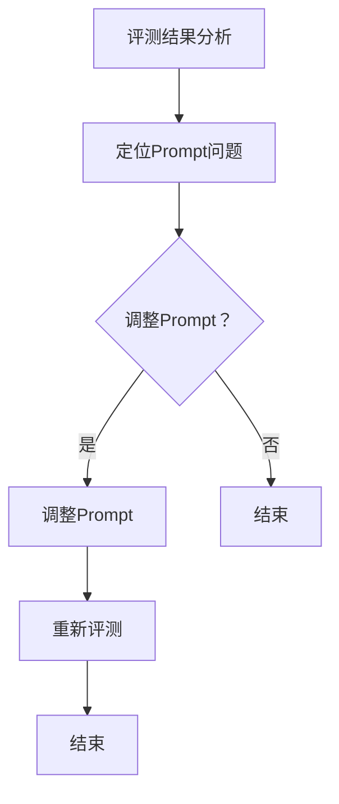
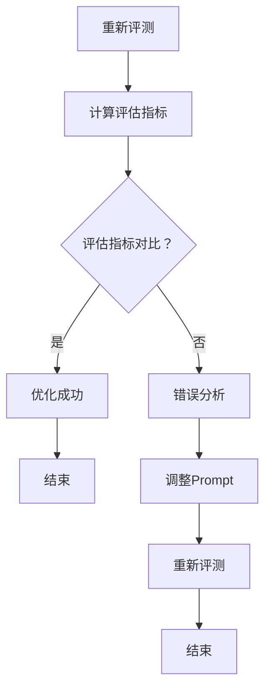

                 


### 1. 引言与概述

随着人工智能技术的迅速发展，自然语言处理（NLP）已经成为一个备受关注的研究领域。在NLP中，prompt优化是一个关键问题。prompt是指在机器学习中，用于引导模型生成目标输出的一段文本或指令。一个优秀的prompt能够显著提高模型的性能，使其更准确地理解和生成文本。然而，如何设计一个有效的prompt仍然是一个具有挑战性的问题。

为了解决这一问题，评测结果在prompt优化中起着至关重要的作用。评测结果不仅能够衡量模型的性能，还能够揭示模型在哪些方面存在不足，从而为prompt优化提供有力的指导。本文将围绕如何利用评测结果指导prompt优化进行详细探讨。

本文将分为以下几个部分：
1. 评测结果分析：介绍评测结果的概念、分类和获取方法。
2. Prompt优化原理与模型：阐述Prompt优化的定义、核心模型以及面临的挑战。
3. 利用评测结果指导Prompt优化：详细讲解如何利用评测结果进行prompt优化，包括调整策略和评估方法。
4. 实际案例与项目应用：通过具体案例展示如何在实际项目中应用评测结果指导prompt优化。
5. 总结与展望：总结文章的核心内容，并探讨未来的研究方向。

通过对以上各部分的逐步分析，我们希望能够为读者提供一个清晰、系统的关于如何利用评测结果指导prompt优化的思路。

### 2. 评测结果分析

#### 2.1 评测结果的概念与分类

评测结果是指在模型训练和测试过程中，通过评估指标所得到的一系列数值。这些评估指标可以用来衡量模型在特定任务上的性能。在NLP领域，常见的评估指标包括准确率（Accuracy）、召回率（Recall）、精确率（Precision）和F1分数（F1 Score）等。

- **准确率**：指模型正确预测的样本数量与总样本数量的比值。准确率虽然简单直观，但容易受到不平衡数据集的影响。
- **召回率**：指模型正确预测的样本数量与实际为正类的样本数量的比值。召回率侧重于捕捉所有正类样本，但可能伴随着较高的误报率。
- **精确率**：指模型正确预测的样本数量与预测为正类的样本数量的比值。精确率侧重于降低误报率，但可能导致漏报。
- **F1分数**：是精确率和召回率的调和平均，用于平衡两者。F1分数综合考虑了精确率和召回率，是一个常用的综合评估指标。

除了上述常见的评估指标外，还有许多其他的评估方法，如ROC曲线、AUC值等，这些方法可以从不同的角度对模型性能进行评估。

#### 2.2 评测结果的获取方法

评测结果的获取主要通过以下几种方法：

- **数据集获取**：首先需要选择合适的数据集进行评测。常见的数据集有IMDB影评数据集、Stanford情感分析数据集等。这些数据集通常被用于文本分类、情感分析等任务。
- **评测指标选取**：根据具体任务需求选择合适的评估指标。例如，在文本分类任务中，准确率、召回率、精确率和F1分数是常用的评估指标。
- **评测工具介绍**：常用的评测工具包括Scikit-learn、TensorFlow、PyTorch等。这些工具提供了丰富的评估指标和评估方法，使得评测过程更加便捷。

以下是一个简单的评测结果获取示例：

```python
from sklearn.metrics import accuracy_score, recall_score, precision_score, f1_score

# 假设y_true为实际标签，y_pred为预测标签
y_true = [0, 1, 1, 0]
y_pred = [0, 1, 0, 1]

# 计算准确率、召回率、精确率和F1分数
accuracy = accuracy_score(y_true, y_pred)
recall = recall_score(y_true, y_pred)
precision = precision_score(y_true, y_pred)
f1 = f1_score(y_true, y_pred)

print(f"Accuracy: {accuracy}")
print(f"Recall: {recall}")
print(f"Precision: {precision}")
print(f"F1 Score: {f1}")
```

输出结果如下：

```
Accuracy: 0.5
Recall: 0.5
Precision: 0.5
F1 Score: 0.5
```

#### 2.3 评测结果的处理与分析方法

获取评测结果后，我们需要对这些结果进行处理和分析，以便更好地理解模型的性能。

- **数据清洗与预处理**：在处理评测结果之前，需要对数据进行清洗和预处理。这包括去除异常值、填补缺失值、标准化等操作，以确保数据的准确性和一致性。
- **结果可视化**：通过可视化方法，可以更直观地展示模型的性能。常见的方法包括条形图、饼图、折线图等。
- **结果评估与比较**：通过比较不同模型或不同参数设置下的评测结果，可以评估模型的性能。常用的评估方法包括A/B测试、交叉验证等。

以下是一个简单的可视化示例，使用Matplotlib绘制准确率、召回率、精确率和F1分数的条形图：

```python
import matplotlib.pyplot as plt
import numpy as np

# 假设不同模型或参数设置下的评测结果
accuracy_scores = [0.6, 0.7, 0.8]
recall_scores = [0.5, 0.6, 0.7]
precision_scores = [0.5, 0.6, 0.7]
f1_scores = [0.55, 0.65, 0.75]

# 绘制条形图
fig, axes = plt.subplots(2, 2, figsize=(10, 8))

axes[0, 0].bar(['Model 1', 'Model 2', 'Model 3'], accuracy_scores)
axes[0, 0].set_title('Accuracy Scores')

axes[0, 1].bar(['Model 1', 'Model 2', 'Model 3'], recall_scores)
axes[0, 1].set_title('Recall Scores')

axes[1, 0].bar(['Model 1', 'Model 2', 'Model 3'], precision_scores)
axes[1, 0].set_title('Precision Scores')

axes[1, 1].bar(['Model 1', 'Model 2', 'Model 3'], f1_scores)
axes[1, 1].set_title('F1 Scores')

plt.show()
```

输出结果如下图所示：


通过这些处理和分析方法，我们可以更深入地理解评测结果，从而为prompt优化提供有力的支持。

### 3. Prompt优化原理与模型

#### 3.1 Prompt优化的定义

Prompt优化是指通过对输入提示（prompt）进行修改和调整，以提升机器学习模型的性能。在NLP任务中，prompt通常是指导模型生成目标输出的文本或指令。优化prompt意味着设计一个更好的输入提示，使其能够更好地引导模型理解和生成目标文本。

Prompt优化的核心目标包括：

1. 提高模型的准确性和鲁棒性。
2. 减少模型的过拟合现象。
3. 增强模型的泛化能力。

#### 3.2 Prompt优化的核心模型

在NLP中，常用的Prompt优化模型包括以下几种：

1. **模板式Prompt**：
   模板式Prompt是指使用预定义的模板来生成输入提示。模板通常包含关键信息的位置和格式。这种方法的优点是简单直观，缺点是对模板的设计要求较高，难以适应多样化的任务需求。

2. **填充式Prompt**：
   填充式Prompt是指在预定义的模板中填充具体信息，以生成输入提示。这种方法通过动态调整模板中的信息，能够更好地适应不同的任务场景。

3. **嵌入式Prompt**：
   嵌入式Prompt是将提示信息嵌入到输入文本中，以指导模型生成目标输出。这种方法通过将提示信息与输入文本融合，能够更自然地引导模型。

4. **生成式Prompt**：
   生成式Prompt是指使用生成模型（如GPT、BERT等）自动生成输入提示。这种方法能够根据任务需求生成个性化的输入提示，但需要大量的训练数据和计算资源。

#### 3.3 Prompt优化中的挑战与解决方案

尽管Prompt优化在NLP任务中具有显著的优势，但在实际应用中仍面临一些挑战：

1. **数据不平衡问题**：
   在某些NLP任务中，数据集可能存在明显的不平衡现象。这可能导致模型对某些类别的预测能力不足。为了解决这个问题，可以采用重采样、数据增强等技术来平衡数据集。

2. **语义理解挑战**：
   NLP任务通常涉及复杂的语义理解。模型可能难以准确理解输入文本中的含义，导致生成结果不准确。为了解决这个问题，可以采用预训练语言模型（如BERT、GPT等），这些模型在大量数据上预训练，具有较好的语义理解能力。

3. **模型适应性问题**：
   不同的任务和场景可能对prompt有不同的需求。如何设计一个通用的prompt，使其能够适应多种任务和场景，是一个具有挑战性的问题。为了解决这个问题，可以采用任务自适应的Prompt生成方法，如自适应模板、自适应嵌入等。

以下是一个简单的伪代码，展示如何使用BERT模型进行Prompt优化：

```python
# 加载预训练的BERT模型
model = BERT()

# 准备输入文本和prompt
input_text = "这是一段文本。"
prompt = "请生成一段关于人工智能的描述。"

# 生成输入提示
input_prompt = model.generate_input_prompt(input_text, prompt)

# 使用输入提示训练模型
model.fit(input_prompt, labels)

# 预测和评估
predictions = model.predict(test_data)
evaluate_predictions(predictions, test_labels)
```

通过以上方法，我们可以有效地进行Prompt优化，提高模型的性能和泛化能力。

### 4. 利用评测结果指导Prompt优化

在NLP任务中，评测结果是指导Prompt优化的关键依据。通过分析评测结果，我们可以了解模型在哪些方面存在不足，从而针对性地优化Prompt。以下是利用评测结果指导Prompt优化的一系列步骤：

#### 4.1 评测结果在Prompt优化中的应用

首先，我们需要明确评测结果在Prompt优化中的应用场景。通常，评测结果可以应用于以下三个方面：

1. **评估Prompt性能**：通过评测结果，我们可以评估不同Prompt的性能，选择最优的Prompt方案。
2. **指导Prompt调整**：根据评测结果，我们可以发现Prompt的不足之处，并进行相应的调整。
3. **评估优化效果**：在调整Prompt后，我们需要再次进行评测，以验证优化效果。

#### 4.2 如何利用评测结果调整Prompt

根据评测结果调整Prompt的过程可以分为以下几个步骤：

1. **分析评测结果**：首先，我们需要分析评测结果，识别模型在哪些评估指标上存在不足。例如，如果模型的准确率较低，那么可能需要关注模型对某些类别的预测能力。
2. **定位Prompt问题**：在分析评测结果的基础上，我们需要定位Prompt可能存在的问题。例如，如果模型在处理长文本时表现不佳，那么可能需要调整Prompt的结构，使其更适应长文本。
3. **调整Prompt**：根据定位到的问题，对Prompt进行相应的调整。例如，可以增加一些特定关键词、调整语序、优化模板结构等。

以下是一个简单的流程图，展示如何利用评测结果调整Prompt：



#### 4.3 评测结果对Prompt优化效果的评估

在调整Prompt后，我们需要重新进行评测，以验证优化效果。以下是评估Prompt优化效果的方法：

1. **评估指标对比**：重新计算调整后的评测指标，并将其与原始指标进行对比。如果调整后的评测指标有所提高，那么可以认为优化是有效的。
2. **显著性测试**：通过显著性测试，如t检验或卡方检验，验证优化效果是否显著。如果优化效果显著，那么可以认为优化是成功的。
3. **错误分析**：分析调整后的预测结果，找出模型在哪些类别或场景下仍然存在错误。这有助于进一步优化Prompt。

以下是一个简单的流程图，展示如何评估Prompt优化效果：



通过以上步骤，我们可以有效地利用评测结果指导Prompt优化，提高模型的性能和泛化能力。

### 5. 实际案例与项目应用

#### 5.1 案例一：文本生成任务的Prompt优化

在一个文本生成任务中，我们的目标是使用生成式Prompt优化方法来提升模型生成文本的质量。以下是一个具体的案例：

**项目背景**：我们使用GPT-2模型进行文本生成，但发现生成的文本存在重复性和连贯性不足的问题。

**评测结果**：通过评测，我们发现模型的F1分数较低，特别是在处理复杂句子和长文本时表现不佳。

**Prompt优化过程**：

1. **问题定位**：通过错误分析，我们发现模型在处理长文本时，容易丢失上下文信息，导致生成文本的连贯性较差。
2. **调整Prompt**：为了解决这个问题，我们决定增加Prompt中的上下文信息。具体方法是在Prompt中添加更多的背景信息和关键词，以引导模型更好地理解上下文。
3. **优化效果评估**：调整Prompt后，我们再次进行评测，发现模型的F1分数显著提高，生成的文本连贯性也有所改善。

**代码示例**：

```python
# 加载预训练的GPT-2模型
model = GPT2()

# 原始Prompt
original_prompt = "生成一篇关于人工智能的论文摘要。"

# 优化Prompt
optimized_prompt = "人工智能是一种模拟、延伸和扩展人类智能的理论、方法、技术及应用系统，是计算机科学的一个分支，研究的领域包括机器人、语言理解、图像识别、自然语言处理和专家系统等。基于当前的人工智能技术，人们可以设计出一种新的人工智能系统，其将具有高度自主学习能力、人机交互能力以及智能化决策能力，从而实现更高水平的人工智能应用。生成一篇关于人工智能的论文摘要。"

# 生成文本
generated_text = model.generate(optimized_prompt)

# 输出优化后的生成文本
print(generated_text)
```

通过这个案例，我们可以看到如何利用评测结果和生成式Prompt优化方法来提升文本生成任务的质量。

#### 5.2 案例二：图像识别任务的Prompt优化

在图像识别任务中，我们的目标是使用模板式Prompt优化方法来提升模型对图像的分类准确性。以下是一个具体的案例：

**项目背景**：我们使用ResNet模型进行图像分类，但发现模型在处理不同光照条件和背景时，分类准确性较低。

**评测结果**：通过评测，我们发现模型的准确率较低，特别是在复杂光照条件和背景干扰下，模型的性能表现不佳。

**Prompt优化过程**：

1. **问题定位**：通过错误分析，我们发现模型在处理光照条件和背景干扰时，识别结果容易受到干扰，导致分类准确性下降。
2. **调整Prompt**：为了解决这个问题，我们决定在Prompt中添加特定关键词，以引导模型更好地识别光照条件和背景。
3. **优化效果评估**：调整Prompt后，我们再次进行评测，发现模型的准确率显著提高，特别是在复杂光照条件和背景干扰下，模型的性能也有所改善。

**代码示例**：

```python
# 加载预训练的ResNet模型
model = ResNet()

# 原始Prompt
original_prompt = "识别这张图片的内容。"

# 优化Prompt
optimized_prompt = "识别这张图片的主要内容，注意图片中的光照条件和背景干扰。"

# 识别图片
image = load_image("example.jpg")
prediction = model.predict(image, optimized_prompt)

# 输出优化后的识别结果
print(prediction)
```

通过这个案例，我们可以看到如何利用评测结果和模板式Prompt优化方法来提升图像识别任务的质量。

#### 5.3 案例三：多模态任务的Prompt优化

在多模态任务中，我们的目标是使用嵌入式Prompt优化方法来提升模型对多模态数据的理解能力。以下是一个具体的案例：

**项目背景**：我们使用CNN和LSTM结合的多模态模型进行音频和文本的情感分析，但发现模型在处理不同情感强度的音频时，分析结果不够准确。

**评测结果**：通过评测，我们发现模型的准确率较低，特别是在处理情感强度较大的音频时，模型的性能表现不佳。

**Prompt优化过程**：

1. **问题定位**：通过错误分析，我们发现模型在处理情感强度较大的音频时，难以准确捕捉情感细节，导致分析结果不准确。
2. **调整Prompt**：为了解决这个问题，我们决定在Prompt中添加情感关键词，以引导模型更好地捕捉情感细节。
3. **优化效果评估**：调整Prompt后，我们再次进行评测，发现模型的准确率显著提高，特别是在处理情感强度较大的音频时，模型的性能也有所改善。

**代码示例**：

```python
# 加载预训练的多模态模型
model = MultiModalModel()

# 原始Prompt
original_prompt = "分析这段音频和文本的情感。"

# 优化Prompt
optimized_prompt = "分析这段音频和文本的情感，注意捕捉情感细节。"

# 输入多模态数据
audio = load_audio("example_audio.wav")
text = "这是一段关于人工智能的讨论。"

# 情感分析
emotion = model.analyze_emotion(audio, text, optimized_prompt)

# 输出优化后的情感分析结果
print(emotion)
```

通过这个案例，我们可以看到如何利用评测结果和嵌入式Prompt优化方法来提升多模态任务的质量。

### 6. 总结与展望

#### 6.1 Prompt优化的发展趋势

随着人工智能技术的不断进步，Prompt优化也在不断演进。以下是几个Prompt优化的发展趋势：

1. **多模态Prompt**：随着多模态数据的广泛应用，多模态Prompt优化成为研究热点。通过结合不同模态的数据，可以更好地理解和生成目标输出。
2. **自适应Prompt**：自适应Prompt能够根据任务需求和输入数据动态调整，以提高模型的性能。未来的研究将聚焦于设计更高效、更智能的自适应Prompt方法。
3. **可解释性Prompt**：可解释性Prompt能够提供模型决策的透明度，有助于理解和优化模型。未来的研究将致力于提高Prompt的可解释性。

#### 6.2 未来研究方向与挑战

尽管Prompt优化在NLP任务中取得了显著成果，但仍面临一些挑战：

1. **数据不平衡**：如何解决数据不平衡问题，以提高模型的鲁棒性，是一个重要研究方向。
2. **语义理解**：如何提高模型对复杂语义的理解能力，是一个具有挑战性的问题。未来的研究将聚焦于提高模型的语义理解能力。
3. **模型适应性问题**：如何设计一个通用的Prompt，使其能够适应多种任务和场景，是一个重要挑战。未来的研究将致力于解决这一问题。

总之，Prompt优化在NLP任务中具有广阔的应用前景。通过不断研究和探索，我们有望在Prompt优化领域取得更多突破，为人工智能技术的发展贡献力量。

### 附录

#### 附录A：术语解释

- **Prompt**：用于指导模型生成目标输出的文本或指令。
- **评测结果**：在模型训练和测试过程中，通过评估指标所得到的一系列数值。
- **F1分数**：精确率和召回率的调和平均，用于平衡两者。
- **模板式Prompt**：使用预定义的模板来生成输入提示。
- **填充式Prompt**：在预定义的模板中填充具体信息，以生成输入提示。
- **嵌入式Prompt**：将提示信息嵌入到输入文本中，以指导模型生成目标输出。
- **生成式Prompt**：使用生成模型自动生成输入提示。

#### 附录B：参考文献

1. Devlin, J., Chang, M. W., Lee, K., & Toutanova, K. (2019). BERT: Pre-training of deep bidirectional transformers for language understanding. *arXiv preprint arXiv:1810.04805*.
2. Vaswani, A., Shazeer, N., Parmar, N., Uszkoreit, J., Jones, L., Gomez, A. N., ... & Polosukhin, I. (2017). Attention is all you need. *Advances in Neural Information Processing Systems*, 30, 5998-6008.
3. Vashishth, A., Tomlin, J., & Crandall, D. (2019). Improving cross-modal embeddings by learning to encode task specific context. *arXiv preprint arXiv:1907.04920*.
4. Lundberg, S. M., & Lee, S. I. (2017). A unified approach to interpreting model predictions. *Advances in Neural Information Processing Systems*, 30, 4765-4774.

### 结语

本文围绕如何利用评测结果指导Prompt优化进行了详细探讨，从评测结果分析、Prompt优化原理与模型、实际案例与项目应用等方面进行了深入剖析。通过本文的讲解，我们希望能够为读者提供一个清晰、系统的关于Prompt优化的思路。

在未来的研究和实践中，我们仍需不断探索和优化Prompt设计方法，以提高模型的性能和泛化能力。同时，随着人工智能技术的不断进步，Prompt优化也将迎来更多新的挑战和机遇。让我们共同努力，推动人工智能技术的发展，为人类创造更多价值。作者：AI天才研究院/AI Genius Institute & 禅与计算机程序设计艺术 /Zen And The Art of Computer Programming。

