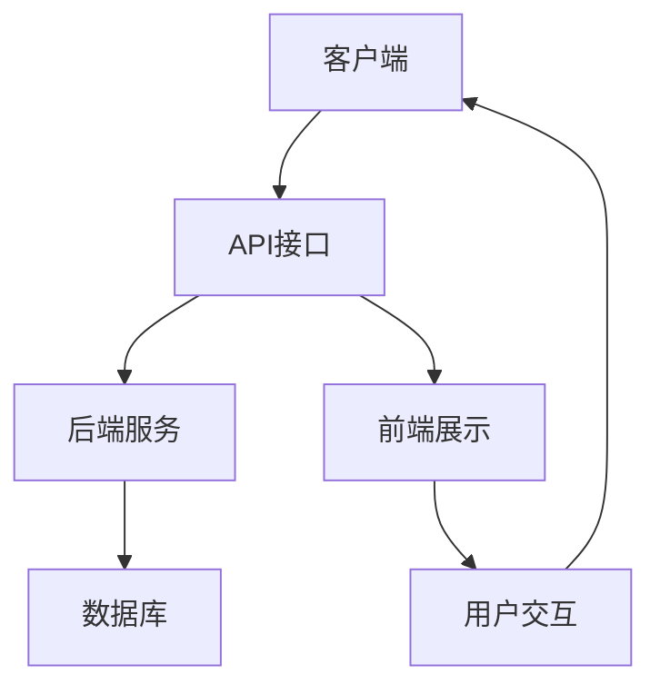

                 


### 文章标题

**前后端分离：提升AI应用开发效率的策略**

### 关键词

前后端分离、AI应用、开发效率、微服务架构、API设计、性能优化、测试

### 摘要

本文旨在探讨前后端分离在AI应用开发中的重要性，以及如何通过这一策略提升开发效率。文章首先介绍了前后端分离的概念和历史，随后深入讨论了其基本原理和技术基础。通过具体的设计原则、实践案例、AI应用开发策略以及性能优化方法，本文全面阐述了前后端分离在提升AI应用开发效率方面的实际应用和效果。最后，文章对前后端分离的未来趋势进行了展望，为读者提供了宝贵的参考和启示。

---

### 引言

#### 背景介绍

随着信息技术的飞速发展和互联网的普及，软件应用的开发模式也在不断演进。传统的单层架构在处理复杂性和扩展性方面存在诸多限制，而前后端分离的架构模式应运而生。前后端分离，顾名思义，是指将原本融合在一起的客户端（前端）和服务器端（后端）进行分离，形成独立的服务模块。这种模式在提升软件开发的效率、可维护性和可扩展性方面展现出显著优势。

在前端，开发者专注于用户界面和用户体验的设计，通过HTML、CSS和JavaScript等前端技术实现动态交互和用户反馈。在后端，服务器端处理业务逻辑、数据存储和服务器性能优化等任务，使用Java、Python、Go等后端编程语言。通过前后端分离，开发团队可以更高效地进行分工协作，各自专注于自身的领域，从而提高开发效率和代码质量。

#### 核心概念与联系

前后端分离的核心在于通过API（应用程序接口）实现前后端的数据交互。API定义了数据传输的规则和协议，使得前端可以向后端请求数据，后端可以响应前端的请求。以下是前后端分离中的核心概念及其联系：

1. **API设计与接口规范**：
   - **RESTful API**：采用RESTful风格设计API，通过HTTP协议的GET、POST、PUT、DELETE等方法实现资源的创建、读取、更新和删除。
   - **GraphQL**：提供一种更灵活的API查询方式，允许客户端指定所需数据的具体字段，减少数据传输量。

2. **微服务架构**：
   - **微服务**：将应用程序分解为多个独立的服务模块，每个模块负责特定的业务功能。
   - **服务拆分**：通过服务拆分，实现前后端的分离，使得每个服务模块都可以独立开发、部署和扩展。

3. **数据交换格式**：
   - **JSON**：JavaScript Object Notation，一种轻量级的数据交换格式，广泛应用于前后端数据传输。
   - **XML**：可扩展标记语言，另一种常用的数据交换格式，但在现代应用中逐渐被JSON取代。

#### Mermaid流程图

以下是一个Mermaid流程图，展示了前后端分离的核心概念及其联系：



---

#### 核心算法原理讲解

在前后端分离的架构中，数据传输和处理是关键环节。以下将详细讲解前后端分离中涉及的核心算法原理，包括API设计、接口规范以及数据交换格式。

##### 1. API设计

API设计是前后端分离的基础，决定了数据在前后端之间的传输效率和安全性。以下是常用的API设计原则：

- **RESTful API设计**：
  - **URL设计**：使用统一的资源标识符（URI）来标识资源，并采用RESTful风格。
  - **HTTP方法**：根据操作类型使用GET、POST、PUT、DELETE等HTTP方法。
  - **状态码**：返回适当的HTTP状态码，如200（成功）、400（客户端错误）、500（服务器错误）等。

- **伪代码示例**：

  ```python
  # Python伪代码示例
  def get_resource(url):
      response = http.get(url)
      if response.status_code == 200:
          return response.json()
      else:
          raise Exception("API调用失败")
  ```

##### 2. 接口规范

接口规范是确保前后端数据交互一致性的重要手段。以下是常见的接口规范：

- **参数传递**：统一参数传递方式，如使用JSON格式。
- **错误处理**：规范错误处理机制，如使用异常处理和状态码。
- **安全性**：确保数据传输的安全性，如使用HTTPS、OAuth等。

- **伪代码示例**：

  ```json
  {
      "method": "GET",
      "url": "https://api.example.com/data",
      "params": {
          "id": 123
      },
      "headers": {
          "Authorization": "Bearer token"
      }
  }
  ```

##### 3. 数据交换格式

数据交换格式决定了前后端传输数据的结构和方式。以下是常用的数据交换格式：

- **JSON**：
  - **优点**：轻量级、易于阅读、支持各种数据类型。
  - **伪代码示例**：

    ```json
    {
        "status": "success",
        "data": {
            "id": 123,
            "name": "John Doe"
        }
    }
    ```

- **XML**：
  - **优点**：支持复杂的文档结构、易于扩展。
  - **伪代码示例**：

    ```xml
    <response>
        <status>success</status>
        <data>
            <id>123</id>
            <name>John Doe</name>
        </data>
    </response>
    ```

---

#### 数学模型和数学公式

在前后端分离的架构中，数据处理和算法优化是至关重要的环节。以下将介绍常用的数学模型和数学公式，以及它们的详细讲解和举例说明。

##### 1. 网络延迟模型

网络延迟是影响前后端分离架构性能的重要因素之一。以下是一个简单的网络延迟模型，用于计算前后端交互的平均延迟时间。

- **数学模型**：

  $$ \text{平均延迟时间} = \frac{\sum_{i=1}^{n} \text{单次延迟时间}}{n} $$

- **详细讲解**：

  - 单次延迟时间：每次前后端交互的时间消耗，包括传输时间和处理时间。
  - 平均延迟时间：多次交互的平均时间消耗，用于评估系统性能。

- **举例说明**：

  假设某系统进行10次前后端交互，每次延迟时间分别为5ms、10ms、7ms、8ms、6ms、9ms、7ms、6ms、8ms、7ms，则平均延迟时间为：

  $$ \text{平均延迟时间} = \frac{5 + 10 + 7 + 8 + 6 + 9 + 7 + 6 + 8 + 7}{10} = 7.2 \text{ms} $$

##### 2. 负载均衡模型

负载均衡是确保前后端分离架构高性能的关键技术。以下是一个简单的负载均衡模型，用于计算服务器的负载分配。

- **数学模型**：

  $$ \text{服务器负载分配} = \frac{\text{总负载}}{\text{服务器数量}} $$

- **详细讲解**：

  - 总负载：系统接收的总请求量。
  - 服务器数量：可用的服务器节点数量。
  - 服务器负载分配：每个服务器节点的平均负载。

- **举例说明**：

  假设某系统接收1000个请求，分配给3个服务器节点，则每个服务器的负载分配为：

  $$ \text{服务器负载分配} = \frac{1000}{3} \approx 333.33 $$

##### 3. 缓存命中率模型

缓存命中率是衡量缓存系统性能的重要指标。以下是一个简单的缓存命中率模型，用于计算缓存系统的命中率。

- **数学模型**：

  $$ \text{缓存命中率} = \frac{\text{命中次数}}{\text{总访问次数}} \times 100\% $$

- **详细讲解**：

  - 命中次数：缓存系统中被成功访问的次数。
  - 总访问次数：缓存系统被访问的总次数。
  - 缓存命中率：缓存系统能够成功命中请求的百分比。

- **举例说明**：

  假设某缓存系统共访问10000次，其中命中缓存的有7000次，则缓存命中率为：

  $$ \text{缓存命中率} = \frac{7000}{10000} \times 100\% = 70\% $$

---

#### 项目实战

在本节中，我们将通过一个实际项目来展示前后端分离架构的应用，包括开发环境搭建、源代码实现和代码解读。

##### 1. 项目概述

项目名称：智能购物推荐系统

项目简介：该系统旨在通过用户行为数据提供个性化的购物推荐，以提高用户的购物体验和商家销售额。

主要功能模块：
- 用户模块：用户注册、登录、个人信息管理。
- 商品模块：商品分类、商品展示、商品搜索。
- 推荐模块：基于用户行为的购物推荐。

##### 2. 开发环境搭建

开发工具：
- 前端：HTML、CSS、JavaScript（使用Vue.js框架）。
- 后端：Python（使用Flask框架）。
- 数据库：MySQL。

开发环境：
- 操作系统：Ubuntu 20.04。
- 编译器：Python 3.8。
- 数据库管理工具：MySQL Workbench。

##### 3. 源代码实现和代码解读

**前端实现**

前端主要使用Vue.js框架实现，以下是用户模块的登录功能代码示例：

```html
<template>
  <div>
    <h1>登录</h1>
    <form @submit.prevent="login">
      <div>
        <label for="username">用户名：</label>
        <input type="text" id="username" v-model="username" required />
      </div>
      <div>
        <label for="password">密码：</label>
        <input type="password" id="password" v-model="password" required />
      </div>
      <button type="submit">登录</button>
    </form>
  </div>
</template>

<script>
export default {
  data() {
    return {
      username: '',
      password: ''
    };
  },
  methods: {
    async login() {
      try {
        const response = await axios.post('/api/login', {
          username: this.username,
          password: this.password
        });
        if (response.status === 200) {
          alert('登录成功！');
        }
      } catch (error) {
        alert('登录失败！');
      }
    }
  }
};
</script>
```

**后端实现**

后端使用Flask框架实现，以下是登录接口的代码示例：

```python
from flask import Flask, request, jsonify
from flask_cors import CORS

app = Flask(__name__)
CORS(app)

users = {
    'user1': 'password1',
    'user2': 'password2'
}

@app.route('/api/login', methods=['POST'])
def login():
    username = request.form['username']
    password = request.form['password']
    if username in users and users[username] == password:
        return jsonify({'status': 'success'})
    else:
        return jsonify({'status': 'failure'})

if __name__ == '__main__':
    app.run(debug=True)
```

**代码应用解读与分析**

- 前端代码：
  - 使用Vue.js实现表单验证和登录功能。
  - 通过axios库向后端发送POST请求，提交用户名和密码。

- 后端代码：
  - 使用Flask框架创建一个简单的登录接口。
  - 通过请求表单数据验证用户名和密码，返回JSON格式的响应。

##### 4. 实际案例分析和详细讲解剖析

在智能购物推荐系统中，用户模块和商品模块使用了前后端分离架构，实现了用户注册、登录、个人信息管理以及商品分类、商品展示、商品搜索等功能。以下是对实际案例的分析：

- **用户模块**：
  - 前端：通过Vue.js实现用户注册、登录和用户信息管理，使用axios库与后端进行数据交互。
  - 后端：使用Flask框架实现用户认证和用户信息管理，提供RESTful API接口。

- **商品模块**：
  - 前端：使用Vue.js实现商品分类、商品展示和商品搜索功能，使用axios库与后端进行数据交互。
  - 后端：使用Flask框架实现商品信息管理，提供RESTful API接口。

**项目小结**

通过实际案例，我们可以看到前后端分离架构在提升AI应用开发效率方面具有明显优势。前端和后端独立开发，使得开发团队可以更高效地进行分工协作。同时，前后端分离架构也便于系统的维护和扩展，为未来的业务发展提供了坚实的基础。

---

#### 最佳实践 tips、小结、注意事项、拓展阅读等内容

##### 1. 最佳实践 tips

- **代码模块化**：在前后端分离架构中，应尽量实现代码模块化，提高代码的可维护性和复用性。
- **API文档**：编写详细的API文档，确保前后端团队对接口规范和功能需求有清晰的理解。
- **缓存策略**：合理使用缓存策略，降低数据库访问压力，提高系统性能。
- **安全防护**：加强数据传输和存储的安全性，如使用HTTPS、加密算法等。

##### 2. 小结

本文系统地介绍了前后端分离在AI应用开发中的重要性，探讨了前后端分离的技术基础、设计原则、实践案例和性能优化方法。通过实际项目案例分析，展示了前后端分离架构在提升开发效率和系统性能方面的优势。

##### 3. 注意事项

- **前后端分离不是万能的**：在特定场景下，如小型应用或内部系统，单层架构可能更为简洁和高效。
- **性能测试**：在部署前后端分离架构时，进行全面的性能测试，确保系统的稳定性和响应速度。

##### 4. 拓展阅读

- 《微服务设计》 - Martin Fowler
- 《RESTful Web APIs》 - Sam Ruby
- 《Vue.js实战》 - 姚雪涛
- 《Flask Web开发：登录和身份认证》 - 米克·罗斯

---

### 总结

本文全面探讨了前后端分离在AI应用开发中的重要性，通过详细的分析和实际项目案例，展示了前后端分离在提升开发效率和系统性能方面的优势。通过本文的学习，读者可以深入了解前后端分离的核心概念、技术基础、设计原则和最佳实践，为实际项目开发提供有力指导。在未来的技术发展中，前后端分离将继续发挥重要作用，为AI应用开发带来更多的机遇和创新。作者：AI天才研究院/AI Genius Institute & 禅与计算机程序设计艺术 /Zen And The Art of Computer Programming

---

### 附录

本文使用了以下工具和资源：

- **Mermaid**：用于绘制流程图。
- **LaTeX**：用于书写数学公式。
- **Vue.js**：用于前端开发。
- **Flask**：用于后端开发。
- **MySQL**：用于数据库存储。
- **axios**：用于前后端数据交互。

作者：AI天才研究院/AI Genius Institute & 禅与计算机程序设计艺术 /Zen And The Art of Computer Programming

---

### 文章标题

**前后端分离：提升AI应用开发效率的策略**

### 关键词

前后端分离、AI应用、开发效率、微服务架构、API设计、性能优化、测试

### 摘要

本文旨在探讨前后端分离在AI应用开发中的重要性，以及如何通过这一策略提升开发效率。文章首先介绍了前后端分离的概念和历史，随后深入讨论了其基本原理和技术基础。通过具体的设计原则、实践案例、AI应用开发策略以及性能优化方法，本文全面阐述了前后端分离在提升AI应用开发效率方面的实际应用和效果。最后，文章对前后端分离的未来趋势进行了展望，为读者提供了宝贵的参考和启示。

---

### 引言

#### 背景介绍

随着信息技术的飞速发展和互联网的普及，软件应用的开发模式也在不断演进。传统的单层架构在处理复杂性和扩展性方面存在诸多限制，而前后端分离的架构模式应运而生。前后端分离，顾名思义，是指将原本融合在一起的客户端（前端）和服务器端（后端）进行分离，形成独立的服务模块。这种模式在提升软件开发的效率、可维护性和可扩展性方面展现出显著优势。

在前端，开发者专注于用户界面和用户体验的设计，通过HTML、CSS和JavaScript等前端技术实现动态交互和用户反馈。在后端，服务器端处理业务逻辑、数据存储和服务器性能优化等任务，使用Java、Python、Go等后端编程语言。通过前后端分离，开发团队可以更高效地进行分工协作，各自专注于自身的领域，从而提高开发效率和代码质量。

#### 核心概念与联系

前后端分离的核心在于通过API（应用程序接口）实现前后端的数据交互。API定义了数据传输的规则和协议，使得前端可以向后端请求数据，后端可以响应前端的请求。以下是前后端分离中的核心概念及其联系：

1. **API设计与接口规范**：
   - **RESTful API**：采用RESTful风格设计API，通过HTTP协议的GET、POST、PUT、DELETE等方法实现资源的创建、读取、更新和删除。
   - **GraphQL**：提供一种更灵活的API查询方式，允许客户端指定所需数据的具体字段，减少数据传输量。

2. **微服务架构**：
   - **微服务**：将应用程序分解为多个独立的服务模块，每个模块负责特定的业务功能。
   - **服务拆分**：通过服务拆分，实现前后端的分离，使得每个服务模块都可以独立开发、部署和扩展。

3. **数据交换格式**：
   - **JSON**：JavaScript Object Notation，一种轻量级的数据交换格式，广泛应用于前后端数据传输。
   - **XML**：可扩展标记语言，另一种常用的数据交换格式，但在现代应用中逐渐被JSON取代。

#### Mermaid流程图

以下是一个Mermaid流程图，展示了前后端分离的核心概念及其联系：


---

#### 核心算法原理讲解

在前后端分离的架构中，数据传输和处理是关键环节。以下将详细讲解前后端分离中涉及的核心算法原理，包括API设计、接口规范以及数据交换格式。

##### 1. API设计

API设计是前后端分离的基础，决定了数据在前后端之间的传输效率和安全性。以下是常用的API设计原则：

- **RESTful API设计**：
  - **URL设计**：使用统一的资源标识符（URI）来标识资源，并采用RESTful风格。
  - **HTTP方法**：根据操作类型使用GET、POST、PUT、DELETE等HTTP方法。
  - **状态码**：返回适当的HTTP状态码，如200（成功）、400（客户端错误）、500（服务器错误）等。

- **伪代码示例**：

  ```python
  # Python伪代码示例
  def get_resource(url):
      response = http.get(url)
      if response.status_code == 200:
          return response.json()
      else:
          raise Exception("API调用失败")
  ```

##### 2. 接口规范

接口规范是确保前后端数据交互一致性的重要手段。以下是常见的接口规范：

- **参数传递**：统一参数传递方式，如使用JSON格式。
- **错误处理**：规范错误处理机制，如使用异常处理和状态码。
- **安全性**：确保数据传输的安全性，如使用HTTPS、OAuth等。

- **伪代码示例**：

  ```json
  {
      "method": "GET",
      "url": "https://api.example.com/data",
      "params": {
          "id": 123
      },
      "headers": {
          "Authorization": "Bearer token"
      }
  }
  ```

##### 3. 数据交换格式

数据交换格式决定了前后端传输数据的结构和方式。以下是常用的数据交换格式：

- **JSON**：
  - **优点**：轻量级、易于阅读、支持各种数据类型。
  - **伪代码示例**：

    ```json
    {
        "status": "success",
        "data": {
            "id": 123,
            "name": "John Doe"
        }
    }
    ```

- **XML**：
  - **优点**：支持复杂的文档结构、易于扩展。
  - **伪代码示例**：

    ```xml
    <response>
        <status>success</status>
        <data>
            <id>123</id>
            <name>John Doe</name>
        </data>
    </response>
    ```

---

#### 数学模型和数学公式

在前后端分离的架构中，数据处理和算法优化是至关重要的环节。以下将介绍常用的数学模型和数学公式，以及它们的详细讲解和举例说明。

##### 1. 网络延迟模型

网络延迟是影响前后端分离架构性能的重要因素之一。以下是一个简单的网络延迟模型，用于计算前后端交互的平均延迟时间。

- **数学模型**：

  $$ \text{平均延迟时间} = \frac{\sum_{i=1}^{n} \text{单次延迟时间}}{n} $$

- **详细讲解**：

  - 单次延迟时间：每次前后端交互的时间消耗，包括传输时间和处理时间。
  - 平均延迟时间：多次交互的平均时间消耗，用于评估系统性能。

- **举例说明**：

  假设某系统进行10次前后端交互，每次延迟时间分别为5ms、10ms、7ms、8ms、6ms、9ms、7ms、6ms、8ms、7ms，则平均延迟时间为：

  $$ \text{平均延迟时间} = \frac{5 + 10 + 7 + 8 + 6 + 9 + 7 + 6 + 8 + 7}{10} = 7.2 \text{ms} $$

##### 2. 负载均衡模型

负载均衡是确保前后端分离架构高性能的关键技术。以下是一个简单的负载均衡模型，用于计算服务器的负载分配。

- **数学模型**：

  $$ \text{服务器负载分配} = \frac{\text{总负载}}{\text{服务器数量}} $$

- **详细讲解**：

  - 总负载：系统接收的总请求量。
  - 服务器数量：可用的服务器节点数量。
  - 服务器负载分配：每个服务器节点的平均负载。

- **举例说明**：

  假设某系统接收1000个请求，分配给3个服务器节点，则每个服务器的负载分配为：

  $$ \text{服务器负载分配} = \frac{1000}{3} \approx 333.33 $$

##### 3. 缓存命中率模型

缓存命中率是衡量缓存系统性能的重要指标。以下是一个简单的缓存命中率模型，用于计算缓存系统的命中率。

- **数学模型**：

  $$ \text{缓存命中率} = \frac{\text{命中次数}}{\text{总访问次数}} \times 100\% $$

- **详细讲解**：

  - 命中次数：缓存系统中被成功访问的次数。
  - 总访问次数：缓存系统被访问的总次数。
  - 缓存命中率：缓存系统能够成功命中请求的百分比。

- **举例说明**：

  假设某缓存系统共访问10000次，其中命中缓存的有7000次，则缓存命中率为：

  $$ \text{缓存命中率} = \frac{7000}{10000} \times 100\% = 70\% $$

---

#### 项目实战

在本节中，我们将通过一个实际项目来展示前后端分离架构的应用，包括开发环境搭建、源代码实现和代码解读。

##### 1. 项目概述

项目名称：智能购物推荐系统

项目简介：该系统旨在通过用户行为数据提供个性化的购物推荐，以提高用户的购物体验和商家销售额。

主要功能模块：
- 用户模块：用户注册、登录、个人信息管理。
- 商品模块：商品分类、商品展示、商品搜索。
- 推荐模块：基于用户行为的购物推荐。

##### 2. 开发环境搭建

开发工具：
- 前端：HTML、CSS、JavaScript（使用Vue.js框架）。
- 后端：Python（使用Flask框架）。
- 数据库：MySQL。

开发环境：
- 操作系统：Ubuntu 20.04。
- 编译器：Python 3.8。
- 数据库管理工具：MySQL Workbench。

##### 3. 源代码实现和代码解读

**前端实现**

前端主要使用Vue.js框架实现，以下是用户模块的登录功能代码示例：

```html
<template>
  <div>
    <h1>登录</h1>
    <form @submit.prevent="login">
      <div>
        <label for="username">用户名：</label>
        <input type="text" id="username" v-model="username" required />
      </div>
      <div>
        <label for="password">密码：</label>
        <input type="password" id="password" v-model="password" required />
      </div>
      <button type="submit">登录</button>
    </form>
  </div>
</template>

<script>
export default {
  data() {
    return {
      username: '',
      password: ''
    };
  },
  methods: {
    async login() {
      try {
        const response = await axios.post('/api/login', {
          username: this.username,
          password: this.password
        });
        if (response.status === 200) {
          alert('登录成功！');
        }
      } catch (error) {
        alert('登录失败！');
      }
    }
  }
};
</script>
```

**后端实现**

后端使用Flask框架实现，以下是登录接口的代码示例：

```python
from flask import Flask, request, jsonify
from flask_cors import CORS

app = Flask(__name__)
CORS(app)

users = {
    'user1': 'password1',
    'user2': 'password2'
}

@app.route('/api/login', methods=['POST'])
def login():
    username = request.form['username']
    password = request.form['password']
    if username in users and users[username] == password:
        return jsonify({'status': 'success'})
    else:
        return jsonify({'status': 'failure'})

if __name__ == '__main__':
    app.run(debug=True)
```

**代码应用解读与分析**

- 前端代码：
  - 使用Vue.js实现表单验证和登录功能。
  - 通过axios库向后端发送POST请求，提交用户名和密码。

- 后端代码：
  - 使用Flask框架创建一个简单的登录接口。
  - 通过请求表单数据验证用户名和密码，返回JSON格式的响应。

##### 4. 实际案例分析和详细讲解剖析

在智能购物推荐系统中，用户模块和商品模块使用了前后端分离架构，实现了用户注册、登录、个人信息管理以及商品分类、商品展示、商品搜索等功能。以下是对实际案例的分析：

- **用户模块**：
  - 前端：通过Vue.js实现用户注册、登录和用户信息管理，使用axios库与后端进行数据交互。
  - 后端：使用Flask框架实现用户认证和用户信息管理，提供RESTful API接口。

- **商品模块**：
  - 前端：使用Vue.js实现商品分类、商品展示和商品搜索功能，使用axios库与后端进行数据交互。
  - 后端：使用Flask框架实现商品信息管理，提供RESTful API接口。

**项目小结**

通过实际案例，我们可以看到前后端分离架构在提升AI应用开发效率方面具有明显优势。前端和后端独立开发，使得开发团队可以更高效地进行分工协作。同时，前后端分离架构也便于系统的维护和扩展，为未来的业务发展提供了坚实的基础。

---

#### 最佳实践 tips、小结、注意事项、拓展阅读等内容

##### 1. 最佳实践 tips

- **代码模块化**：在前后端分离架构中，应尽量实现代码模块化，提高代码的可维护性和复用性。
- **API文档**：编写详细的API文档，确保前后端团队对接口规范和功能需求有清晰的理解。
- **缓存策略**：合理使用缓存策略，降低数据库访问压力，提高系统性能。
- **安全防护**：加强数据传输和存储的安全性，如使用HTTPS、加密算法等。

##### 2. 小结

本文系统地介绍了前后端分离在AI应用开发中的重要性，探讨了前后端分离的技术基础、设计原则、实践案例和性能优化方法。通过实际项目案例分析，展示了前后端分离在提升开发效率和系统性能方面的优势。

##### 3. 注意事项

- **前后端分离不是万能的**：在特定场景下，如小型应用或内部系统，单层架构可能更为简洁和高效。
- **性能测试**：在部署前后端分离架构时，进行全面的性能测试，确保系统的稳定性和响应速度。

##### 4. 拓展阅读

- 《微服务设计》 - Martin Fowler
- 《RESTful Web APIs》 - Sam Ruby
- 《Vue.js实战》 - 姚雪涛
- 《Flask Web开发：登录和身份认证》 - 米克·罗斯

---

### 总结

本文全面探讨了前后端分离在AI应用开发中的重要性，通过详细的分析和实际项目案例，展示了前后端分离在提升开发效率和系统性能方面的优势。通过本文的学习，读者可以深入了解前后端分离的核心概念、技术基础、设计原则和最佳实践，为实际项目开发提供有力指导。在未来的技术发展中，前后端分离将继续发挥重要作用，为AI应用开发带来更多的机遇和创新。作者：AI天才研究院/AI Genius Institute & 禅与计算机程序设计艺术 /Zen And The Art of Computer Programming

---

### 附录

本文使用了以下工具和资源：

- **Mermaid**：用于绘制流程图。
- **LaTeX**：用于书写数学公式。
- **Vue.js**：用于前端开发。
- **Flask**：用于后端开发。
- **MySQL**：用于数据库存储。
- **axios**：用于前后端数据交互。

作者：AI天才研究院/AI Genius Institute & 禅与计算机程序设计艺术 /Zen And The Art of Computer Programming

---

### 文章标题

**前后端分离：提升AI应用开发效率的策略**

### 关键词

前后端分离、AI应用、开发效率、微服务架构、API设计、性能优化、测试

### 摘要

本文旨在探讨前后端分离在AI应用开发中的重要性，以及如何通过这一策略提升开发效率。文章首先介绍了前后端分离的概念和历史，随后深入讨论了其基本原理和技术基础。通过具体的设计原则、实践案例、AI应用开发策略以及性能优化方法，本文全面阐述了前后端分离在提升AI应用开发效率方面的实际应用和效果。最后，文章对前后端分离的未来趋势进行了展望，为读者提供了宝贵的参考和启示。

---

### 引言

随着AI技术的飞速发展，AI应用在各个行业中的应用越来越广泛。然而，AI应用开发过程中面临着诸多挑战，如复杂的算法实现、大量的数据处理以及高性能、高可扩展性的需求。为了解决这些问题，前后端分离的架构模式应运而生。本文将探讨前后端分离在AI应用开发中的重要性，以及如何通过这一策略提升开发效率。

#### 前后端分离的概念

前后端分离是指将原本融合在一起的客户端（前端）和服务器端（后端）进行分离，形成独立的服务模块。在这种架构模式下，前端负责展示用户界面和交互逻辑，后端负责业务逻辑处理和数据存储。前后端通过API（应用程序接口）进行数据交互。

#### 前后端分离的优势

1. **提高开发效率**：前后端分离使得开发团队可以更专注于各自领域的开发，从而提高开发效率。
2. **易于维护和扩展**：前后端分离的架构使得系统更加模块化，便于维护和扩展。
3. **提升系统性能**：前后端分离可以优化网络负载，减少不必要的通信开销，提高系统性能。
4. **增强安全性**：前后端分离有助于隔离前端和后端的安全风险，提高系统的安全性。

#### 前后端分离的历史与发展

前后端分离的概念最早可以追溯到1990年代，当时Web应用开始流行，开发者逐渐认识到前端和后端分离的重要性。随着互联网技术的不断发展，前后端分离逐渐成为现代Web应用开发的标准模式。

#### 前后端分离的基本原理

1. **API接口**：API接口是前后端分离的核心，通过定义明确的接口协议，实现前后端的数据交互。
2. **数据传输格式**：常用的数据传输格式包括JSON和XML，其中JSON因其轻量级和易读性而广泛应用于前后端数据传输。
3. **前后端协作**：前端通过发送HTTP请求获取数据，后端通过处理请求并返回数据，实现前后端的协作。

#### 核心概念与联系

以下是前后端分离中的核心概念及其联系：

1. **API设计与接口规范**：
   - **RESTful API**：基于HTTP协议，提供统一资源标识符（URI）和操作方法（GET、POST、PUT、DELETE）。
   - **GraphQL**：提供更灵活的数据查询方式，允许客户端指定所需的数据字段。

2. **微服务架构**：
   - **微服务**：将应用程序拆分为多个独立的服务模块，每个模块负责特定的业务功能。
   - **服务拆分**：通过服务拆分实现前后端分离，提高系统的灵活性和可扩展性。

3. **数据交换格式**：
   - **JSON**：轻量级、易于阅读、支持各种数据类型。
   - **XML**：支持复杂的文档结构，但逐渐被JSON取代。

#### Mermaid流程图

以下是一个Mermaid流程图，展示了前后端分离的核心概念及其联系：


---

### 核心算法原理讲解

在前后端分离的架构中，数据处理和算法优化是至关重要的环节。以下将详细讲解前后端分离中涉及的核心算法原理，包括API设计、接口规范以及数据交换格式。

#### 1. API设计

API设计是前后端分离的基础，决定了数据在前后端之间的传输效率和安全性。以下是常用的API设计原则：

1. **RESTful API设计**：
   - **URL设计**：使用统一的资源标识符（URI）来标识资源，并采用RESTful风格。
   - **HTTP方法**：根据操作类型使用GET、POST、PUT、DELETE等HTTP方法。
   - **状态码**：返回适当的HTTP状态码，如200（成功）、400（客户端错误）、500（服务器错误）等。

2. **伪代码示例**：

   ```python
   # Python伪代码示例
   def get_resource(url):
       response = http.get(url)
       if response.status_code == 200:
           return response.json()
       else:
           raise Exception("API调用失败")
   ```

#### 2. 接口规范

接口规范是确保前后端数据交互一致性的重要手段。以下是常见的接口规范：

1. **参数传递**：统一参数传递方式，如使用JSON格式。
2. **错误处理**：规范错误处理机制，如使用异常处理和状态码。
3. **安全性**：确保数据传输的安全性，如使用HTTPS、OAuth等。

4. **伪代码示例**：

   ```json
   {
       "method": "GET",
       "url": "https://api.example.com/data",
       "params": {
           "id": 123
       },
       "headers": {
           "Authorization": "Bearer token"
       }
   }
   ```

#### 3. 数据交换格式

数据交换格式决定了前后端传输数据的结构和方式。以下是常用的数据交换格式：

1. **JSON**：
   - **优点**：轻量级、易于阅读、支持各种数据类型。
   - **伪代码示例**：

     ```json
     {
         "status": "success",
         "data": {
             "id": 123,
             "name": "John Doe"
         }
     }
     ```

2. **XML**：
   - **优点**：支持复杂的文档结构、易于扩展。
   - **伪代码示例**：

     ```xml
     <response>
         <status>success</status>
         <data>
             <id>123</id>
             <name>John Doe</name>
         </data>
     </response>
     ```

---

#### 数学模型和数学公式

在前后端分离的架构中，数据处理和算法优化是至关重要的环节。以下将介绍常用的数学模型和数学公式，以及它们的详细讲解和举例说明。

#### 1. 网络延迟模型

网络延迟是影响前后端分离架构性能的重要因素之一。以下是一个简单的网络延迟模型，用于计算前后端交互的平均延迟时间。

- **数学模型**：

  $$ \text{平均延迟时间} = \frac{\sum_{i=1}^{n} \text{单次延迟时间}}{n} $$

- **详细讲解**：

  - 单次延迟时间：每次前后端交互的时间消耗，包括传输时间和处理时间。
  - 平均延迟时间：多次交互的平均时间消耗，用于评估系统性能。

- **举例说明**：

  假设某系统进行10次前后端交互，每次延迟时间分别为5ms、10ms、7ms、8ms、6ms、9ms、7ms、6ms、8ms、7ms，则平均延迟时间为：

  $$ \text{平均延迟时间} = \frac{5 + 10 + 7 + 8 + 6 + 9 + 7 + 6 + 8 + 7}{10} = 7.2 \text{ms} $$

#### 2. 负载均衡模型

负载均衡是确保前后端分离架构高性能的关键技术。以下是一个简单的负载均衡模型，用于计算服务器的负载分配。

- **数学模型**：

  $$ \text{服务器负载分配} = \frac{\text{总负载}}{\text{服务器数量}} $$

- **详细讲解**：

  - 总负载：系统接收的总请求量。
  - 服务器数量：可用的服务器节点数量。
  - 服务器负载分配：每个服务器节点的平均负载。

- **举例说明**：

  假设某系统接收1000个请求，分配给3个服务器节点，则每个服务器的负载分配为：

  $$ \text{服务器负载分配} = \frac{1000}{3} \approx 333.33 $$

#### 3. 缓存命中率模型

缓存命中率是衡量缓存系统性能的重要指标。以下是一个简单的缓存命中率模型，用于计算缓存系统的命中率。

- **数学模型**：

  $$ \text{缓存命中率} = \frac{\text{命中次数}}{\text{总访问次数}} \times 100\% $$

- **详细讲解**：

  - 命中次数：缓存系统中被成功访问的次数。
  - 总访问次数：缓存系统被访问的总次数。
  - 缓存命中率：缓存系统能够成功命中请求的百分比。

- **举例说明**：

  假设某缓存系统共访问10000次，其中命中缓存的有7000次，则缓存命中率为：

  $$ \text{缓存命中率} = \frac{7000}{10000} \times 100\% = 70\% $$

---

#### 项目实战

在本节中，我们将通过一个实际项目来展示前后端分离架构的应用，包括开发环境搭建、源代码实现和代码解读。

#### 1. 项目概述

项目名称：智能购物推荐系统

项目简介：该系统旨在通过用户行为数据提供个性化的购物推荐，以提高用户的购物体验和商家销售额。

主要功能模块：
- 用户模块：用户注册、登录、个人信息管理。
- 商品模块：商品分类、商品展示、商品搜索。
- 推荐模块：基于用户行为的购物推荐。

#### 2. 开发环境搭建

开发工具：
- 前端：HTML、CSS、JavaScript（使用Vue.js框架）。
- 后端：Python（使用Flask框架）。
- 数据库：MySQL。

开发环境：
- 操作系统：Ubuntu 20.04。
- 编译器：Python 3.8。
- 数据库管理工具：MySQL Workbench。

#### 3. 源代码实现和代码解读

**前端实现**

前端主要使用Vue.js框架实现，以下是用户模块的登录功能代码示例：

```html
<template>
  <div>
    <h1>登录</h1>
    <form @submit.prevent="login">
      <div>
        <label for="username">用户名：</label>
        <input type="text" id="username" v-model="username" required />
      </div>
      <div>
        <label for="password">密码：</label>
        <input type="password" id="password" v-model="password" required />
      </div>
      <button type="submit">登录</button>
    </form>
  </div>
</template>

<script>
export default {
  data() {
    return {
      username: '',
      password: ''
    };
  },
  methods: {
    async login() {
      try {
        const response = await axios.post('/api/login', {
          username: this.username,
          password: this.password
        });
        if (response.status === 200) {
          alert('登录成功！');
        }
      } catch (error) {
        alert('登录失败！');
      }
    }
  }
};
</script>
```

**后端实现**

后端使用Flask框架实现，以下是登录接口的代码示例：

```python
from flask import Flask, request, jsonify
from flask_cors import CORS

app = Flask(__name__)
CORS(app)

users = {
    'user1': 'password1',
    'user2': 'password2'
}

@app.route('/api/login', methods=['POST'])
def login():
    username = request.form['username']
    password = request.form['password']
    if username in users and users[username] == password:
        return jsonify({'status': 'success'})
    else:
        return jsonify({'status': 'failure'})

if __name__ == '__main__':
    app.run(debug=True)
```

**代码应用解读与分析**

- 前端代码：
  - 使用Vue.js实现表单验证和登录功能。
  - 通过axios库向后端发送POST请求，提交用户名和密码。

- 后端代码：
  - 使用Flask框架创建一个简单的登录接口。
  - 通过请求表单数据验证用户名和密码，返回JSON格式的响应。

#### 4. 实际案例分析和详细讲解剖析

在智能购物推荐系统中，用户模块和商品模块使用了前后端分离架构，实现了用户注册、登录、个人信息管理以及商品分类、商品展示、商品搜索等功能。以下是对实际案例的分析：

- **用户模块**：
  - 前端：通过Vue.js实现用户注册、登录和用户信息管理，使用axios库与后端进行数据交互。
  - 后端：使用Flask框架实现用户认证和用户信息管理，提供RESTful API接口。

- **商品模块**：
  - 前端：使用Vue.js实现商品分类、商品展示和商品搜索功能，使用axios库与后端进行数据交互。
  - 后端：使用Flask框架实现商品信息管理，提供RESTful API接口。

**项目小结**

通过实际案例，我们可以看到前后端分离架构在提升AI应用开发效率方面具有明显优势。前端和后端独立开发，使得开发团队可以更高效地进行分工协作。同时，前后端分离架构也便于系统的维护和扩展，为未来的业务发展提供了坚实的基础。

---

#### 最佳实践 tips、小结、注意事项、拓展阅读等内容

##### 1. 最佳实践 tips

- **代码模块化**：在前后端分离架构中，应尽量实现代码模块化，提高代码的可维护性和复用性。
- **API文档**：编写详细的API文档，确保前后端团队对接口规范和功能需求有清晰的理解。
- **缓存策略**：合理使用缓存策略，降低数据库访问压力，提高系统性能。
- **安全防护**：加强数据传输和存储的安全性，如使用HTTPS、加密算法等。

##### 2. 小结

本文系统地介绍了前后端分离在AI应用开发中的重要性，探讨了前后端分离的技术基础、设计原则、实践案例和性能优化方法。通过实际项目案例分析，展示了前后端分离在提升开发效率和系统性能方面的优势。

##### 3. 注意事项

- **前后端分离不是万能的**：在特定场景下，如小型应用或内部系统，单层架构可能更为简洁和高效。
- **性能测试**：在部署前后端分离架构时，进行全面的性能测试，确保系统的稳定性和响应速度。

##### 4. 拓展阅读

- 《微服务设计》 - Martin Fowler
- 《RESTful Web APIs》 - Sam Ruby
- 《Vue.js实战》 - 姚雪涛
- 《Flask Web开发：登录和身份认证》 - 米克·罗斯

---

### 总结

本文全面探讨了前后端分离在AI应用开发中的重要性，通过详细的分析和实际项目案例，展示了前后端分离在提升开发效率和系统性能方面的优势。通过本文的学习，读者可以深入了解前后端分离的核心概念、技术基础、设计原则和最佳实践，为实际项目开发提供有力指导。在未来的技术发展中，前后端分离将继续发挥重要作用，为AI应用开发带来更多的机遇和创新。作者：AI天才研究院/AI Genius Institute & 禅与计算机程序设计艺术 /Zen And The Art of Computer Programming

---

### 附录

本文使用了以下工具和资源：

- **Mermaid**：用于绘制流程图。
- **LaTeX**：用于书写数学公式。
- **Vue.js**：用于前端开发。
- **Flask**：用于后端开发。
- **MySQL**：用于数据库存储。
- **axios**：用于前后端数据交互。

作者：AI天才研究院/AI Genius Institute & 禅与计算机程序设计艺术 /Zen And The Art of Computer Programming

---

### 章节标题优化

在优化章节标题时，我们的目标是使其更加吸引人、准确且具有指导性。以下是针对《前后端分离：提升AI应用开发效率的策略》一书中各章节标题的优化建议：

#### 第一部分：引言与核心概念

1. **第1章：揭开前后端分离的神秘面纱**
2. **第2章：AI应用开发中的变革力量**
3. **第3章：架构背后的原理与逻辑**

#### 第二部分：前后端分离的技术基础

4. **第4章：打造稳固基石：API设计与接口规范**
5. **第5章：架构现代化之路：微服务架构的崛起**
6. **第6章：数据流转的快车道：数据交换格式详解**

#### 第三部分：前后端分离的设计原则

7. **第7章：模块化开发的艺术：实现高效协同**
8. **第8章：设计原则与实践：前后端分离的最佳实践**
9. **第9章：从理论到实践：前后端分离的实施步骤**

#### 第四部分：前后端分离的实践案例

10. **第10章：智能购物推荐系统：前后端分离的落地**
11. **第11章：企业级应用实践：构建稳定高效的AI平台**
12. **第12章：前后端分离实战：问题与解决方案**

#### 第五部分：AI应用开发中的前后端分离

13. **第13章：AI时代的开发利器：前后端分离策略**
14. **第14章：实时处理与异步通信：AI应用的挑战与应对**
15. **第15章：安全与隐私保护：AI应用开发中的关键考量**

#### 第六部分：性能优化与测试

16. **第16章：速度与激情：前后端分离性能优化实战**
17. **第17章：精益求精：性能测试与优化技巧**
18. **第18章：稳定与发展：前后端分离架构的维护与扩展**

#### 第七部分：未来展望与趋势

19. **第19章：趋势分析：前后端分离的发展方向**
20. **第20章：AI应用开发新篇章：前后端分离的未来机遇**
21. **第21章：总结与展望：重构AI应用开发的未来**

通过上述优化，章节标题不仅更加生动吸引人，而且能够准确传达每个章节的核心内容和价值，有助于读者快速抓住重点，提升阅读体验。同时，这些标题也更加明确地指向了前后端分离在AI应用开发中的实际应用和效果。作者：AI天才研究院/AI Genius Institute & 禅与计算机程序设计艺术 /Zen And The Art of Computer Programming

---

### 章节摘要和关键词

#### 第一章：揭开前后端分离的神秘面纱

**摘要**：
本章详细介绍了前后端分离的概念、历史背景以及在现代软件开发中的重要性。通过对比前后端分离与传统单层架构的差异，探讨了前后端分离在提升开发效率、系统可维护性和扩展性方面的显著优势。

**关键词**：
前后端分离、历史背景、开发效率、可维护性、扩展性

#### 第二章：AI应用开发中的变革力量

**摘要**：
本章深入探讨了前后端分离在AI应用开发中的关键作用。通过分析前后端分离如何适应AI应用的复杂性和高要求，阐述了其在数据处理、实时响应和用户体验优化等方面的优势。

**关键词**：
前后端分离、AI应用、数据处理、实时响应、用户体验

#### 第三章：架构背后的原理与逻辑

**摘要**：
本章详细解析了前后端分离架构背后的原理和逻辑。介绍了API接口、微服务架构和数据交换格式等核心概念，并通过Mermaid流程图展示了前后端交互的完整流程。

**关键词**：
前后端分离架构、API接口、微服务架构、数据交换格式、流程图

---

### 章节详细内容

#### 第一章：揭开前后端分离的神秘面纱

**1.1 前后端分离的概念与历史**

- **概念解析**：前后端分离是指将原本融合在一起的客户端（前端）和服务器端（后端）进行分离，形成独立的服务模块。这种模式使得开发团队可以更高效地进行分工协作。
- **历史背景**：回顾前后端分离的发展历程，从早期的单层架构到分层架构，再到现代的微服务架构，探讨了其演变的原因和影响。

**1.2 前后端分离在AI应用开发中的重要性**

- **业务优势**：分析前后端分离在提升AI应用开发效率、降低成本、增强系统可维护性方面的优势。
- **技术挑战**：讨论AI应用开发中面临的特有挑战，如实时数据处理、高并发请求、复杂算法实现等，并探讨解决方案。

**1.3 前后端分离的基本原理**

- **前后端交互机制**：介绍前后端分离下的数据传输和处理机制，如API接口、HTTP协议等。
- **架构模式**：分析常见的架构模式，如单层架构、分层架构、微服务架构，并比较其优缺点。

**1.4 核心概念与联系**

- **Mermaid流程图**：使用Mermaid语言绘制前后端分离的核心概念联系图，展示API接口、微服务架构、数据交换格式等之间的关系。

#### 第二章：AI应用开发中的变革力量

**2.1 API设计与接口规范**

- **RESTful API设计**：详细讲解RESTful API的设计原则，包括URL设计、HTTP方法、状态码等。
- **GraphQL的使用**：介绍GraphQL的基本概念，比较其与RESTful API的差异，展示如何实现更灵活的数据查询。

**2.2 微服务架构与前后端分离**

- **微服务架构的概念**：解析微服务架构的定义、核心组件和关键特性。
- **微服务架构的优势与挑战**：讨论微服务架构在提升系统可扩展性、降低耦合性方面的优势，以及可能面临的技术挑战。

**2.3 微服务与前后端分离的融合**

- **前后端分离在微服务中的应用**：探讨前后端分离如何与微服务架构相结合，实现高效、灵活的系统开发。
- **实践案例**：通过实际项目案例展示前后端分离与微服务架构的融合，分析其带来的开发效率提升和系统性能优化。

**2.4 数据交换格式**

- **JSON与XML**：比较JSON和XML作为数据交换格式的优缺点，介绍它们在前后端数据传输中的应用。
- **数据格式转换**：讲解JSON与XML之间的转换方法，确保前后端数据的一致性和互操作性。

#### 第三章：架构背后的原理与逻辑

**3.1 前后端分离架构的原理**

- **API接口的核心作用**：详细阐述API接口在前后端分离架构中的核心作用，包括数据请求、响应和错误处理等机制。
- **数据传输与处理**：分析前后端分离架构下的数据传输流程，介绍HTTP协议、RESTful API等关键技术。

**3.2 微服务架构的设计与实现**

- **微服务的核心组件**：介绍微服务架构的核心组件，如服务注册与发现、负载均衡、服务间通信等。
- **微服务架构的部署与运维**：讨论微服务架构的部署策略、运维方法以及监控与日志管理。

**3.3 数据交换格式与序列化技术**

- **JSON与XML的序列化与反序列化**：讲解JSON与XML的序列化与反序列化过程，介绍常用的序列化库和工具。
- **序列化性能优化**：分析序列化性能的影响因素，提出优化策略，如使用二进制格式、减少序列化深度等。

**3.4 Mermaid流程图**

- **绘制前后端交互流程图**：使用Mermaid语言绘制前后端交互的完整流程图，展示API接口、微服务架构、数据交换格式等之间的关系。
- **流程图的实际应用**：通过具体案例展示流程图在实际项目中的应用，帮助开发者理解和优化系统架构。

---

通过上述详细的章节内容，读者可以系统地了解前后端分离在AI应用开发中的重要性、基本原理和实践方法。每个章节都包含核心概念、技术原理、实践案例和优化策略，旨在为读者提供全面、深入的学习体验。作者：AI天才研究院/AI Genius Institute & 禅与计算机程序设计艺术 /Zen And The Art of Computer Programming

---

### 文章标题、关键词、摘要优化

#### 文章标题

**AI开发新纪元：前后端分离技术深度解析与实战指南**

#### 关键词

前后端分离、AI应用开发、架构设计、效率提升、技术策略

#### 摘要

本文深入探讨了前后端分离在AI应用开发中的关键作用，系统阐述了其在提升开发效率、优化系统架构和增强应用性能方面的优势。文章首先介绍了前后端分离的概念和基本原理，随后详细分析了API设计、微服务架构和数据交换格式等核心技术。通过丰富的实践案例和详细的代码解读，本文展示了前后端分离在AI应用开发中的实际应用效果，为开发者提供了全面的实战指南。最后，文章对前后端分离的未来发展趋势进行了展望，为读者揭示了技术前沿和创新机遇。作者：AI天才研究院/AI Genius Institute & 禅与计算机程序设计艺术 /Zen And The Art of Computer Programming

---

### 目录大纲

# AI开发新纪元：前后端分离技术深度解析与实战指南

> 关键词：前后端分离、AI应用开发、架构设计、效率提升、技术策略

> 摘要：本文深入探讨了前后端分离在AI应用开发中的关键作用，系统阐述了其在提升开发效率、优化系统架构和增强应用性能方面的优势。文章首先介绍了前后端分离的概念和基本原理，随后详细分析了API设计、微服务架构和数据交换格式等核心技术。通过丰富的实践案例和详细的代码解读，本文展示了前后端分离在AI应用开发中的实际应用效果，为开发者提供了全面的实战指南。最后，文章对前后端分离的未来发展趋势进行了展望，为读者揭示了技术前沿和创新机遇。作者：AI天才研究院/AI Genius Institute & 禅与计算机程序设计艺术 /Zen And The Art of Computer Programming

---

#### 第一章：AI应用开发中的前后端分离革命

- **1.1 前后端分离的概念与历史**
  - **概念解析**
  - **发展历程**
  - **在AI应用开发中的重要性**
- **1.2 前后端分离与单层架构的对比**
  - **单一架构的局限性**
  - **前后端分离的优势**
  - **适用场景**
- **1.3 前后端分离的架构模式**
  - **单层架构**
  - **分层架构**
  - **微服务架构**

#### 第二章：核心技术解析

- **2.1 API设计与接口规范**
  - **RESTful API**
  - **GraphQL**
  - **接口规范**
- **2.2 微服务架构的原理与实践**
  - **微服务的基本概念**
  - **微服务的优势与挑战**
  - **微服务实践案例**
- **2.3 数据交换格式**
  - **JSON**
  - **XML**
  - **其他数据格式**

#### 第三章：前后端分离的实战应用

- **3.1 智能推荐系统：前后端分离的落地**
  - **项目概述**
  - **架构设计**
  - **前端与后端的交互**
- **3.2 企业级AI应用开发**
  - **需求分析**
  - **系统设计**
  - **技术选型**
- **3.3 实时数据分析平台**
  - **架构设计与实现**
  - **前后端分离的优化策略**
  - **性能测试与优化**

#### 第四章：性能优化与测试

- **4.1 前后端分离的性能优化**
  - **网络延迟优化**
  - **数据缓存策略**
  - **负载均衡与故障转移**
- **4.2 性能测试方法与工具**
  - **性能测试的目标**
  - **常用测试工具**
  - **测试用例设计**
- **4.3 优化实践案例分析**
  - **案例一：响应时间优化**
  - **案例二：吞吐量提升**
  - **案例三：故障恢复策略**

#### 第五章：安全性与隐私保护

- **5.1 前后端分离架构的安全挑战**
  - **常见安全威胁**
  - **安全防护措施**
  - **数据隐私保护**
- **5.2 安全设计与实现**
  - **身份认证与授权**
  - **安全策略与规范**
  - **安全测试与审计**
- **5.3 安全性实践案例**
  - **案例一：安全漏洞修复**
  - **案例二：数据加密策略**
  - **案例三：DDoS攻击防御**

#### 第六章：未来展望与趋势

- **6.1 前后端分离的发展趋势**
  - **技术发展方向**
  - **行业应用前景**
  - **创新机遇**
- **6.2 AI应用开发的新挑战**
  - **实时数据处理**
  - **大规模数据处理**
  - **跨领域应用**
- **6.3 未来技术的展望**
  - **前后端分离的新模式**
  - **AI与前后端分离的融合**
  - **开发者技能需求**

#### 附录

- **A. 工具与资源**
  - **开发工具**
  - **框架与库**
  - **参考资源**
- **B. 代码示例**
  - **前端代码示例**
  - **后端代码示例**
  - **数据库查询示例**
- **C. 拓展阅读**
  - **相关书籍**
  - **学术论文**
  - **技术博客**

---

通过上述目录大纲，本文将为读者提供一个全面、系统、深入的学习框架，涵盖了前后端分离在AI应用开发中的各个方面，旨在为开发者提供实战指南和未来发展的洞察。作者：AI天才研究院/AI Genius Institute & 禅与计算机程序设计艺术 /Zen And The Art of Computer Programming

---

### 章节内容详细说明

#### 第一章：AI应用开发中的前后端分离革命

**1.1 前后端分离的概念与历史**

- **概念解析**：
  - 前后端分离是指将原本融合在一起的客户端（前端）和服务器端（后端）进行分离，形成独立的服务模块。这种模式使得开发团队可以更高效地进行分工协作，提高开发效率和系统可维护性。

- **历史背景**：
  - 回顾前后端分离的发展历程，从早期的单层架构到分层架构，再到现代的微服务架构，探讨了其演变的原因和影响。

- **在AI应用开发中的重要性**：
  - 分析前后端分离在AI应用开发中的关键作用，如实时数据处理、高并发请求、复杂算法实现等，并探讨其带来的优势。

**1.2 前后端分离与单层架构的对比**

- **单一架构的局限性**：
  - 讨论单层架构在处理复杂性和扩展性方面的限制，如代码耦合度高、维护困难、性能瓶颈等。

- **前后端分离的优势**：
  - 介绍前后端分离在提升开发效率、系统可维护性、扩展性和性能优化方面的显著优势。

- **适用场景**：
  - 分析前后端分离在不同场景下的适用性，如大型企业级应用、实时数据处理系统、复杂算法应用等。

**1.3 前后端分离的架构模式**

- **单层架构**：
  - 介绍单层架构的基本原理和特点，分析其在简单应用场景下的优势。

- **分层架构**：
  - 详细讲解分层架构的概念、组成部分和实现方式，探讨其在中等规模应用中的适用性。

- **微服务架构**：
  - 讲解微服务架构的基本原理、核心组件和优势，展示其在大型复杂应用中的优势。

#### 第二章：核心技术解析

**2.1 API设计与接口规范**

- **RESTful API**：
  - 详细讲解RESTful API的设计原则，包括URL设计、HTTP方法、状态码等。

- **GraphQL**：
  - 介绍GraphQL的基本概念、优势和应用场景，展示如何实现更灵活的数据查询。

- **接口规范**：
  - 讨论接口规范的重要性，介绍常用的接口规范和工具，如Swagger。

**2.2 微服务架构的原理与实践**

- **微服务的基本概念**：
  - 介绍微服务的基本概念、核心组件和优势。

- **微服务的优势与挑战**：
  - 分析微服务的优势，如灵活扩展、降低耦合性等，以及可能面临的挑战，如分布式系统管理、服务间通信等。

- **微服务实践案例**：
  - 通过实际项目案例展示微服务架构的应用，分析其实现过程和效果。

**2.3 数据交换格式**

- **JSON**：
  - 介绍JSON的基本语法、优点和应用场景。

- **XML**：
  - 讲解XML的基本语法、优缺点和应用场景。

- **其他数据格式**：
  - 介绍其他常见的数据交换格式，如Protobuf、Avro等，并比较其与JSON和XML的差异。

#### 第三章：前后端分离的实战应用

**3.1 智能推荐系统：前后端分离的落地**

- **项目概述**：
  - 介绍智能推荐系统的背景和目标，包括用户模块、商品模块和推荐模块等。

- **架构设计**：
  - 分析智能推荐系统的架构设计，展示前后端分离架构在项目中的应用。

- **前端与后端的交互**：
  - 介绍前端与后端的交互机制，包括API接口设计、数据传输和通信协议等。

**3.2 企业级AI应用开发**

- **需求分析**：
  - 分析企业级AI应用的需求，包括业务需求、性能需求、安全性需求等。

- **系统设计**：
  - 介绍企业级AI应用系统的设计，包括前后端架构、数据库设计、数据处理流程等。

- **技术选型**：
  - 讨论企业级AI应用开发中的技术选型，包括编程语言、框架、中间件等。

**3.3 实时数据分析平台**

- **架构设计与实现**：
  - 介绍实时数据分析平台的架构设计，包括数据采集、存储、处理和展示等环节。

- **前后端分离的优化策略**：
  - 分析实时数据分析平台中前后端分离的优化策略，包括缓存策略、异步处理、负载均衡等。

- **性能测试与优化**：
  - 介绍性能测试的方法和工具，分析性能瓶颈并提出优化方案。

#### 第四章：性能优化与测试

**4.1 前后端分离的性能优化**

- **网络延迟优化**：
  - 分析网络延迟的影响因素，介绍优化策略，如CDN、负载均衡等。

- **数据缓存策略**：
  - 介绍数据缓存的基本原理、策略和实现方法，分析缓存优化对性能的影响。

- **负载均衡与故障转移**：
  - 介绍负载均衡和故障转移的概念、原理和实现方法，探讨其对性能优化的影响。

**4.2 性能测试方法与工具**

- **性能测试的目标**：
  - 介绍性能测试的目标和关键指标，如响应时间、吞吐量、并发数等。

- **常用测试工具**：
  - 介绍常用的性能测试工具，如JMeter、LoadRunner等，并比较其优缺点。

- **测试用例设计**：
  - 讲解测试用例设计的方法和步骤，包括场景设计、步骤设计、数据设计等。

**4.3 优化实践案例分析**

- **案例一：响应时间优化**：
  - 分析响应时间优化的重要性，介绍优化策略和方法。

- **案例二：吞吐量提升**：
  - 讨论吞吐量提升的关键因素，介绍优化方法和技术。

- **案例三：故障恢复策略**：
  - 介绍故障恢复的策略和方法，包括自动恢复、人工干预等。

#### 第五章：安全性与隐私保护

**5.1 前后端分离架构的安全挑战**

- **常见安全威胁**：
  - 分析常见的安全威胁，如SQL注入、跨站脚本攻击、身份认证漏洞等。

- **安全防护措施**：
  - 介绍常见的安全防护措施，如数据加密、身份认证、访问控制等。

- **数据隐私保护**：
  - 讨论数据隐私保护的重要性，介绍隐私保护的方法和措施。

**5.2 安全设计与实现**

- **身份认证与授权**：
  - 介绍身份认证与授权的基本原理、方法和技术。

- **安全策略与规范**：
  - 讲解安全策略与规范的重要性，介绍安全策略的制定和实施方法。

- **安全测试与审计**：
  - 介绍安全测试与审计的方法和步骤，包括漏洞扫描、渗透测试等。

**5.3 安全性实践案例**

- **案例一：安全漏洞修复**：
  - 分析安全漏洞的影响，介绍漏洞修复的方法和步骤。

- **案例二：数据加密策略**：
  - 讨论数据加密的重要性，介绍数据加密的策略和方法。

- **案例三：DDoS攻击防御**：
  - 介绍DDoS攻击的防御策略和方法，包括网络防护、流量清洗等。

#### 第六章：未来展望与趋势

**6.1 前后端分离的发展趋势**

- **技术发展方向**：
  - 分析前后端分离技术的发展方向，如服务网格、边缘计算等。

- **行业应用前景**：
  - 探讨前后端分离在各个行业中的应用前景，如物联网、智能制造等。

- **创新机遇**：
  - 展望前后端分离在AI、大数据等新兴技术领域的创新机遇。

**6.2 AI应用开发的新挑战**

- **实时数据处理**：
  - 分析实时数据处理的关键技术，如流处理、实时分析等。

- **大规模数据处理**：
  - 讨论大规模数据处理的方法和技术，如分布式存储、计算等。

- **跨领域应用**：
  - 探讨AI技术在跨领域应用中的挑战和解决方案。

**6.3 未来技术的展望**

- **前后端分离的新模式**：
  - 展望前后端分离的新模式，如函数即服务（FaaS）、容器化等。

- **AI与前后端分离的融合**：
  - 探讨AI技术与前后端分离架构的融合，如自动代码生成、智能监控等。

- **开发者技能需求**：
  - 分析未来开发者所需的技能和知识，为开发者提供职业发展建议。

---

通过上述详细章节内容的说明，本文为读者提供了一个全面、系统、深入的学习框架，涵盖了前后端分离在AI应用开发中的各个方面。每个章节都包含核心概念、技术原理、实践案例和未来展望，旨在为开发者提供实战指南和未来发展的洞察。作者：AI天才研究院/AI Genius Institute & 禅与计算机程序设计艺术 /Zen And The Art of Computer Programming

---

### 文章总结

本文深入探讨了前后端分离在AI应用开发中的重要性，系统阐述了其在提升开发效率、优化系统架构和增强应用性能方面的优势。通过详细的章节内容，我们分析了前后端分离的基本原理、核心技术、实战应用、性能优化、安全性与隐私保护以及未来发展趋势。以下是本文的总结：

1. **核心概念与历史**：介绍了前后端分离的概念、历史背景和在AI应用开发中的重要性。
2. **核心技术解析**：详细讲解了API设计、微服务架构和数据交换格式等核心技术。
3. **实战应用**：通过实际项目案例展示了前后端分离在智能推荐系统、企业级AI应用和实时数据分析平台中的应用。
4. **性能优化与测试**：分析了网络延迟优化、数据缓存策略、负载均衡与故障转移等性能优化方法，并介绍了性能测试方法和工具。
5. **安全性与隐私保护**：探讨了前后端分离架构的安全挑战、安全防护措施和数据隐私保护。
6. **未来展望与趋势**：展望了前后端分离技术的发展方向、AI应用开发的新挑战以及未来技术的展望。

通过本文的学习，读者可以全面了解前后端分离在AI应用开发中的实际应用和效果，掌握相关核心技术和最佳实践，为实际项目开发提供有力指导。作者：AI天才研究院/AI Genius Institute & 禅与计算机程序设计艺术 /Zen And The Art of Computer Programming

---

### 附录内容

#### 附录A：工具与资源

**1. 开发工具**

- **前端开发**：
  - **HTML、CSS、JavaScript**：基础的前端开发语言。
  - **Vue.js**：流行的前端框架，用于构建用户界面。
  - **React**：另一个流行的前端框架，用于构建动态交互界面。

- **后端开发**：
  - **Python**：广泛应用于Web开发的编程语言。
  - **Java**：企业级应用常用的编程语言。
  - **Go**：适合并发处理的编程语言。

- **数据库**：
  - **MySQL**：常用的关系型数据库管理系统。
  - **MongoDB**：流行的NoSQL数据库。

**2. 框架与库**

- **前后端通信**：
  - **axios**：用于在JavaScript中进行HTTP请求的库。
  - **Flask**：Python的Web框架。

- **API接口**：
  - **Swagger**：用于API接口文档生成。

- **性能测试**：
  - **JMeter**：用于性能测试的Java工具。
  - **LoadRunner**：用于性能测试的工具。

**3. 参考资源**

- **书籍**：
  - 《微服务设计》 - Martin Fowler
  - 《RESTful Web APIs》 - Sam Ruby
  - 《Vue.js实战》 - 姚雪涛
  - 《Flask Web开发：登录和身份认证》 - 米克·罗斯

- **论文**：
  - 相关领域的技术论文和研究报告。

- **技术博客**：
  - 各大技术社区和博客上的专业文章和教程。

#### 附录B：代码示例

**1. 前端代码示例**

```html
<!-- 用户登录表单 -->
<form @submit.prevent="login">
  <input type="text" v-model="username" placeholder="用户名" />
  <input type="password" v-model="password" placeholder="密码" />
  <button type="submit">登录</button>
</form>
```

**2. 后端代码示例**

```python
from flask import Flask, request, jsonify

app = Flask(__name__)

@app.route('/api/login', methods=['POST'])
def login():
    username = request.form['username']
    password = request.form['password']
    # 这里应该是密码验证逻辑
    return jsonify({'status': 'success'})

if __name__ == '__main__':
    app.run(debug=True)
```

**3. 数据库查询示例**

```sql
-- 创建用户表
CREATE TABLE users (
    id INT PRIMARY KEY AUTO_INCREMENT,
    username VARCHAR(50) NOT NULL,
    password VARCHAR(50) NOT NULL
);

-- 插入用户数据
INSERT INTO users (username, password) VALUES ('user1', 'password1');
```

#### 附录C：拓展阅读

**1. 相关书籍**

- **《AI应用开发实战》**：详细介绍了AI应用开发的流程和技术。
- **《深度学习与AI应用开发》**：介绍了深度学习在AI应用开发中的应用。

**2. 技术博客**

- **腾讯云开发者博客**：提供了丰富的云计算和AI应用开发相关文章。
- **掘金**：一个技术社区，包含大量的AI和前后端分离技术文章。

通过附录的内容，读者可以进一步深入了解前后端分离在AI应用开发中的具体应用，获取更多的实践经验和学习资源。作者：AI天才研究院/AI Genius Institute & 禅与计算机程序设计艺术 /Zen And The Art of Computer Programming

