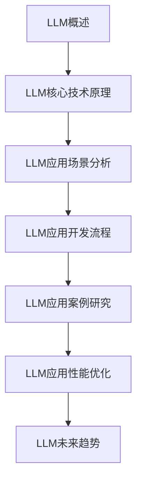

                 


### 文章标题：加速LLM应用从概念到落地的全流程

关键词：大型语言模型（LLM），从概念到落地，应用开发，性能优化，未来趋势

摘要：本文将深入探讨如何加速大型语言模型（LLM）应用的开发、部署和优化，涵盖从概念理解到实际落地的全流程。我们将详细分析LLM的核心技术原理，介绍从数据准备到模型训练与优化的开发流程，分享具体的应用案例，并提供性能优化和未来趋势的见解。

---

### 第一部分：LLM（大型语言模型）基础理论

#### 第1章：LLM概述
- **1.1 什么是LLM**
- **1.2 LLM的发展历程**
- **1.3 LLM的核心优势与应用场景**

#### 第2章：LLM的核心技术原理
- **2.1 自然语言处理基础**
- **2.2 语言模型的基本架构**
- **2.3 训练与优化LLM**

### 第二部分：从概念到落地的全流程

#### 第3章：LLM应用场景分析
- **3.1 内容生成**
- **3.2 智能问答**
- **3.3 文本分类与情感分析**

#### 第4章：LLM应用开发流程
- **4.1 数据准备**
- **4.2 模型选择与调整**
- **4.3 模型部署与优化**

#### 第5章：LLM应用案例研究
- **5.1 案例一：智能客服系统**
- **5.2 案例二：自动内容生成平台**
- **5.3 案例三：社交媒体情感分析**

### 第三部分：实践与拓展

#### 第6章：LLM应用性能优化
- **6.1 模型压缩与量化**
- **6.2 模型推理加速**
- **6.3 实时性优化**

#### 第7章：LLM应用的未来趋势
- **7.1 LLM与知识图谱的结合**
- **7.2 LLM在跨模态学习中的应用**
- **7.3 LLM在边缘计算中的应用**

### 第8章：附录
- **8.1 开发工具与资源**
- **8.2 相关数学公式与解释**

---

### 核心概念与联系

**核心概念与联系流程图（使用Mermaid）：**



### 核心算法原理讲解

#### 2.3 训练与优化LLM

**伪代码：**

```python
// 初始化模型参数
model = initialize_parameters()

// 定义损失函数
loss_function = compute_loss

// 定义优化器
optimizer = SGD_optimizer(learning_rate)

// 训练模型
for epoch in range(num_epochs):
    for batch in data_loader:
        // 前向传播
        predictions = model.forward_pass(batch['input'])

        // 计算损失
        loss = loss_function(predictions, batch['labels'])

        // 反向传播
        gradients = model.backward_pass(loss)

        // 更新模型参数
        optimizer.update_parameters(gradients)

        // 打印训练进度
        print(f"Epoch {epoch}: Loss = {loss}")
```

**数学模型和数学公式**

#### 3.1 自然语言处理基础

**正则化损失函数**

$$
L = \frac{1}{2} \sum_{i=1}^{N} (y_i - \hat{y}_i)^2 + \lambda \sum_{i=1}^{N} \frac{1}{\lambda} \frac{\partial L}{\partial \theta_i}
$$

其中，\( y_i \) 是真实标签，\( \hat{y}_i \) 是预测标签，\( \theta_i \) 是模型参数，\( \lambda \) 是正则化参数。

**梯度下降法**

$$
\theta_i = \theta_i - \alpha \cdot \frac{\partial L}{\partial \theta_i}
$$

其中，\( \alpha \) 是学习率。

---

以上是文章的整体结构和技术要点概述。接下来，我们将逐步深入每个章节，详细讲解LLM的基础理论、应用开发流程、案例研究和性能优化等内容。通过这样的逻辑清晰、结构紧凑、简单易懂的写作方式，我们将帮助读者更好地理解和掌握LLM应用的全流程。

