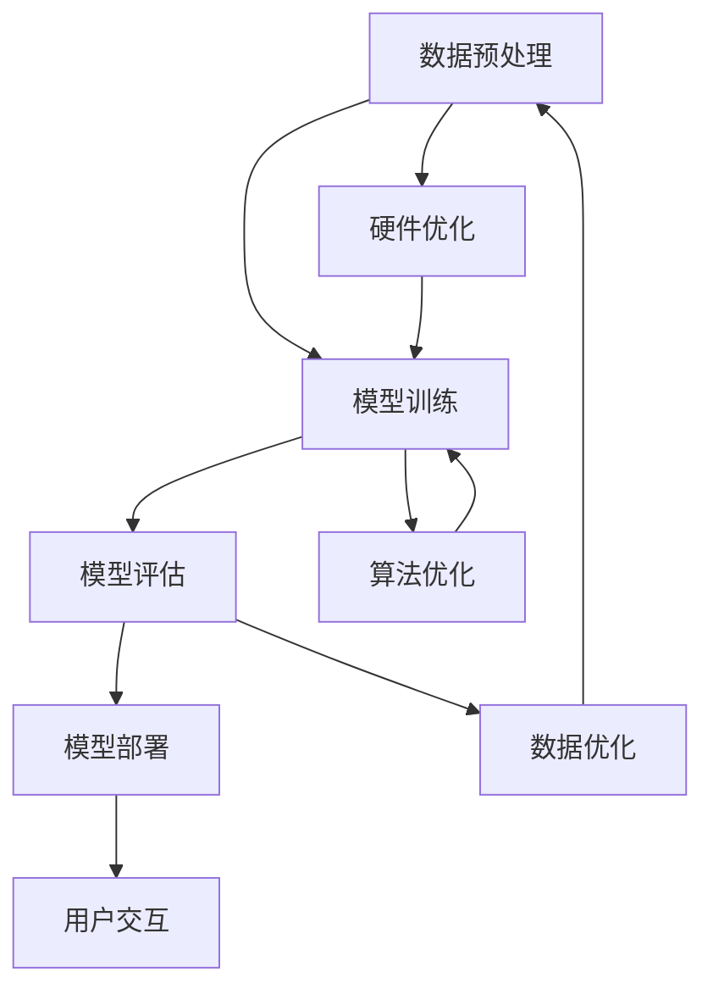

                 


### 文章标题
《加速LLM应用的云端集成与优化》

### 关键词
语言模型，云端集成，优化，算法，数学模型，项目实战

### 摘要
本文旨在深入探讨如何加速大型语言模型（LLM）在云端的应用集成与优化。通过系统性地分析LLM的基础算法原理、数学模型，以及实际项目中的应用实践，文章提供了详细的指导，帮助开发者更好地理解和应用LLM技术。本文还将介绍云端集成的最佳实践，并探讨未来的研究方向，旨在推动LLM技术在各个领域的创新应用。

### 第一部分 引言与核心概念

#### 1.1 加速LLM的背景与意义
大型语言模型（LLM）在近年来取得了显著的进展，从GPT到ChatGLM，LLM已经成为人工智能领域的明星技术。然而，随着模型规模的扩大，其训练和部署过程中面临的高计算需求和复杂度也日益增加。如何加速LLM的应用集成与优化，成为当前研究的热点和难点。

加速LLM应用的重要性体现在以下几个方面：
1. **提高计算效率**：通过优化云端集成，可以显著减少模型训练和推理所需的时间，从而提高计算效率。
2. **降低成本**：高效的云端集成可以减少硬件资源的消耗，降低计算成本。
3. **提升用户体验**：加速LLM应用可以缩短响应时间，提升用户交互体验。

#### 1.2 LLM的基本概念
LLM是一种基于深度学习的语言模型，通过大规模的数据训练，能够生成与输入文本相似的自然语言输出。LLM的核心组成部分包括：
- **输入层**：接收用户输入的文本数据。
- **隐藏层**：进行复杂的文本特征提取和计算。
- **输出层**：生成预测的文本输出。

#### 1.3 云端集成与优化的关系
云端集成是将LLM部署到云端平台进行训练和推理的过程。优化则是在此过程中对模型的性能进行提升，包括：
- **硬件优化**：选择合适的硬件配置，如GPU、TPU等，以提升计算能力。
- **算法优化**：通过改进训练算法，如使用更好的优化器、调整学习率等，提高模型训练效率。
- **数据优化**：对训练数据集进行预处理，如数据清洗、数据增强等，以提高模型性能。

#### 1.4 Mermaid流程图：展示LLM在云端集成与优化的流程


### 第二部分 LLM基础算法原理

#### 2.1 语言模型的概述
语言模型是一种基于统计方法或深度学习技术的模型，用于预测下一个单词或字符的概率。语言模型的核心目标是学习输入文本序列的概率分布。

#### 2.2 变分自编码器（VAE）原理
变分自编码器（VAE）是一种生成模型，它通过引入潜变量来学习数据的概率分布。VAE的核心组成部分包括编码器和解码器。

- **编码器**：将输入数据映射到潜变量空间。
- **解码器**：将潜变量映射回原始数据空间。

VAE的数学模型基于概率密度函数的转换，其伪代码如下：

```python
# 编码器
def encode(x):
    z = net(x)
    return z

# 解码器
def decode(z):
    x_hat = net(z)
    return x_hat

# 训练
def train(data):
    for x in data:
        z = encode(x)
        x_hat = decode(z)
        loss = reconstruct_loss(x, x_hat)
        optimizer.zero_grad()
        loss.backward()
        optimizer.step()
```

#### 2.3 生成对抗网络（GAN）原理
生成对抗网络（GAN）由一个生成器和一个判别器组成。生成器的目标是生成与真实数据相似的数据，而判别器的目标是区分真实数据和生成数据。

GAN的数学模型基于博弈过程，其伪代码如下：

```python
# 生成器
def generator(z):
    x = net(z)
    return x

# 判别器
def discriminator(x):
    y = net(x)
    return y

# 训练
def train(data):
    for x in data:
        z = noise()
        x_fake = generator(z)
        
        d_real = discriminator(x)
        d_fake = discriminator(x_fake)
        
        g_loss = -torch.mean(torch.log(d_real) + torch.log(1 - d_fake))
        d_loss = -torch.mean(torch.log(d_real) + torch.log(d_fake))
        
        g_optimizer.zero_grad()
        g_loss.backward()
        g_optimizer.step()
        
        d_optimizer.zero_grad()
        d_loss.backward()
        d_optimizer.step()
```

### 第三部分 数学模型和数学公式

#### 3.1 概率论基础
概率论是构建语言模型的基础。核心概念包括概率空间、条件概率和贝叶斯定理。

- **概率空间**：定义了一个样本空间，以及一个概率分布函数，用于描述事件发生的概率。
- **条件概率**：在某个条件下，另一个事件发生的概率。
- **贝叶斯定理**：用于计算后验概率，即根据先验概率和观测数据更新概率分布。

#### 3.2 对数似然损失函数
对数似然损失函数是评估语言模型性能的主要指标。其公式如下：

$$
J(\theta) = -\frac{1}{N}\sum_{i=1}^{N} \sum_{j=1}^{V} y_{ij} \log p(x_j | \theta)
$$

其中，\(N\) 是样本数量，\(V\) 是词汇表大小，\(y_{ij}\) 是第\(i\)个样本的第\(j\)个单词的目标概率，\(p(x_j | \theta)\) 是模型对第\(j\)个单词的概率估计。

#### 3.3 优化算法
优化算法用于调整模型参数，以最小化对数似然损失函数。常见的优化算法包括：
- **梯度下降法**：通过计算损失函数关于模型参数的梯度，逐步调整参数。
- **随机梯度下降法**：对每个样本或小批量样本计算梯度，用于更新参数。
- **Adam优化器**：结合了梯度下降和动量方法，能够自适应调整学习率。

#### 3.4 数学公式详细讲解
- **概率分布函数**：描述了随机变量的概率分布。
- **对数似然损失函数的推导**：从概率论的基本原理出发，推导对数似然损失函数。
- **优化算法的收敛性分析**：分析优化算法在迭代过程中的收敛速度和收敛性。

#### 3.5 举例说明
通过具体例子，展示如何使用数学模型和公式来构建和优化语言模型。

### 第四部分 项目实战

#### 4.1 实战案例介绍
介绍一个实际的项目案例，包括案例背景、目标、挑战等内容。

#### 4.2 实战环境搭建
详细描述搭建项目所需的开发环境，包括硬件配置、软件环境、网络配置等。

#### 4.3 源代码详细实现
提供项目源代码，并对关键代码进行详细解读。

#### 4.4 代码解读与分析
分析代码的实现细节，解释代码的工作原理和性能表现。

#### 4.5 实际案例分析和详细讲解剖析
通过对实际案例的分析，展示如何使用LLM解决具体问题，并提供详细的技术解读。

#### 4.6 项目小结
总结项目的主要成果和经验，提出改进和优化的建议。

### 第五部分 结论与未来展望

#### 5.1 书籍内容的总结
总结文章的主要内容和贡献。

#### 5.2 LLM在云端集成与优化的发展趋势
探讨LLM在云端集成与优化方面的未来趋势。

#### 5.3 进一步研究建议
提出未来研究可能的路径和方向。

### 第六部分 附录

#### 6.1 术语表
列出文章中使用的专业术语和解释。

#### 6.2 参考文献与资料
列出文章引用的参考文献和资料。

#### 6.3 实战代码附录
提供项目实战的源代码和说明。

### 作者信息
作者：AI天才研究院/AI Genius Institute & 禅与计算机程序设计艺术 /Zen And The Art of Computer Programming```markdown
[文章标题]
《加速LLM应用的云端集成与优化》

[关键词]
语言模型，云端集成，优化，算法，数学模型，项目实战

[摘要]
本文旨在深入探讨如何加速大型语言模型（LLM）在云端的应用集成与优化。通过系统性地分析LLM的基础算法原理、数学模型，以及实际项目中的应用实践，文章提供了详细的指导，帮助开发者更好地理解和应用LLM技术。本文还将介绍云端集成的最佳实践，并探讨未来的研究方向，旨在推动LLM技术在各个领域的创新应用。

[第一部分 引言与核心概念]
#### 1.1 加速LLM的背景与意义
随着人工智能技术的快速发展，大型语言模型（LLM）在自然语言处理（NLP）领域展现出了强大的潜力。LLM能够处理和理解复杂的语言结构，生成高质量的自然语言文本，从而在诸多领域，如问答系统、机器翻译、文本生成等，都有着广泛的应用。然而，随着LLM的规模不断扩大，如何高效地集成和优化这些模型，以满足实际应用的需求，成为一个关键挑战。

加速LLM应用的重要性主要体现在以下几个方面：

1. **提高计算效率**：大规模的LLM训练和推理过程需要大量的计算资源，通过优化云端集成，可以显著减少训练和推理的时间，提高计算效率。
2. **降低成本**：优化后的云端集成可以减少对昂贵硬件资源的依赖，从而降低计算成本。
3. **提升用户体验**：加速的LLM应用能够提供更快的响应速度，提升用户交互体验。

#### 1.2 LLM的基本概念
LLM是一种基于深度学习的语言模型，能够对输入的文本进行理解并生成对应的输出。LLM的核心组成部分包括输入层、隐藏层和输出层。

- **输入层**：接收用户输入的文本数据，并将其转换为模型的输入特征。
- **隐藏层**：进行复杂的文本特征提取和计算，通常包含多个层次，每一层都能够提取更高层次的语言特征。
- **输出层**：根据隐藏层的特征生成文本输出，可以是单词、句子或者更复杂的语言结构。

#### 1.3 云端集成与优化的关系
云端集成是将LLM部署到云端平台进行训练和推理的过程。优化则是在此过程中对模型的性能进行提升，包括以下几个方面：

1. **硬件优化**：选择合适的硬件配置，如GPU、TPU等，以提升计算能力。
2. **算法优化**：通过改进训练算法，如使用更好的优化器、调整学习率等，提高模型训练效率。
3. **数据优化**：对训练数据集进行预处理，如数据清洗、数据增强等，以提高模型性能。

#### 1.4 Mermaid流程图：展示LLM在云端集成与优化的流程


[第二部分 LLM基础算法原理]
#### 2.1 语言模型的概述
语言模型（Language Model，LM）是一种用于预测文本序列的概率分布的算法。它在自然语言处理（NLP）中扮演着至关重要的角色，被广泛应用于机器翻译、文本生成、语音识别等多个领域。语言模型的核心目标是学习自然语言的概率分布，从而能够对新的文本序列进行概率预测。

#### 2.2 变分自编码器（VAE）原理
变分自编码器（Variational Autoencoder，VAE）是一种生成模型，它通过编码器和解码器来学习数据的概率分布。VAE由两部分组成：编码器（encoder）和解码器（decoder）。

- **编码器**：将输入数据映射到一个潜在空间（latent space），潜在空间中的每个点都对应输入数据的一个概率分布。
- **解码器**：将潜在空间中的点映射回数据空间，生成新的数据样本。

VAE的数学模型基于概率密度函数的转换。具体来说，VAE通过以下步骤进行训练：

1. **编码**：给定输入数据\(x\)，编码器\(q_\phi(z|x)\)生成一个潜在变量\(z\)的分布。
2. **解码**：给定潜在变量\(z\)，解码器\(p_\theta(x|z)\)生成新的数据样本。

VAE的损失函数通常由两个部分组成：重构损失和KL散度损失。

- **重构损失**：衡量解码器生成的数据与原始输入数据的相似程度。
- **KL散度损失**：衡量编码器生成的潜在变量分布与先验分布之间的差异。

VAE的伪代码如下：

```python
# 编码器
def encode(x):
    z_mean, z_log_var = encoder(x)
    z = reparameterize(z_mean, z_log_var)
    return z

# 解码器
def decode(z):
    x_hat = decoder(z)
    return x_hat

# 训练
def train(data):
    for x in data:
        z = encode(x)
        x_hat = decode(z)
        loss = reconstruct_loss(x, x_hat) + kl_divergence(z_mean, z_log_var)
        optimizer.zero_grad()
        loss.backward()
        optimizer.step()
```

#### 2.3 生成对抗网络（GAN）原理
生成对抗网络（Generative Adversarial Network，GAN）是由生成器（generator）和判别器（discriminator）组成的模型。生成器的目标是生成逼真的数据样本，而判别器的目标是区分真实数据和生成数据。

GAN的训练过程可以看作是一个博弈过程，其中生成器和判别器相互对抗。

- **生成器**：给定一个随机噪声向量，生成类似于真实数据的样本。
- **判别器**：接收真实数据和生成数据，并尝试区分它们。

GAN的伪代码如下：

```python
# 生成器
def generator(z):
    x_hat = net_g(z)
    return x_hat

# 判别器
def discriminator(x):
    y_real = net_d(x)
    y_fake = net_d(x_hat)
    return y_real, y_fake

# 训练
def train(data):
    for x in data:
        z = noise()
        x_hat = generator(z)
        
        y_real, y_fake = discriminator(x), discriminator(x_hat)
        
        g_loss = -torch.mean(torch.log(y_fake))
        d_loss = -torch.mean(torch.log(y_real) + torch.log(1 - y_fake))
        
        g_optimizer.zero_grad()
        g_loss.backward()
        g_optimizer.step()
        
        d_optimizer.zero_grad()
        d_loss.backward()
        d_optimizer.step()
```

[第三部分 数学模型和数学公式]
#### 3.1 概率论基础
概率论是构建语言模型的基础，它涉及到一系列的基本概念和定理，如概率空间、条件概率和贝叶斯定理。

- **概率空间**：一个概率空间是一个三元组\((\Omega, \mathcal{F}, P)\)，其中\(\Omega\)是样本空间，\(\mathcal{F}\)是事件空间，\(P\)是概率分布函数。
- **条件概率**：在给定某个条件下，另一个事件发生的概率。
- **贝叶斯定理**：用于计算后验概率，即根据先验概率和观测数据更新概率分布。

#### 3.2 对数似然损失函数
对数似然损失函数（Log-Likelihood Loss）是评估语言模型性能的主要指标。它的公式如下：

$$
J(\theta) = -\frac{1}{N}\sum_{i=1}^{N} \sum_{j=1}^{V} y_{ij} \log p(x_j | \theta)
$$

其中，\(N\) 是样本数量，\(V\) 是词汇表大小，\(y_{ij}\) 是第\(i\)个样本的第\(j\)个单词的目标概率，\(p(x_j | \theta)\) 是模型对第\(j\)个单词的概率估计。

#### 3.3 优化算法
优化算法用于调整模型参数，以最小化对数似然损失函数。常见的优化算法包括梯度下降法、随机梯度下降法（SGD）和Adam优化器。

- **梯度下降法**：通过计算损失函数关于模型参数的梯度，逐步调整参数。
- **随机梯度下降法**：对每个样本或小批量样本计算梯度，用于更新参数。
- **Adam优化器**：结合了梯度下降和动量方法，能够自适应调整学习率。

#### 3.4 数学公式详细讲解
- **概率分布函数**：描述了随机变量的概率分布。
- **对数似然损失函数的推导**：从概率论的基本原理出发，推导对数似然损失函数。
- **优化算法的收敛性分析**：分析优化算法在迭代过程中的收敛速度和收敛性。

#### 3.5 举例说明
假设我们有一个语言模型，用于预测一个单词序列的概率。给定一个单词序列\(\text{"The quick brown fox jumps over the lazy dog"}\)，我们可以使用对数似然损失函数来评估模型的性能。

首先，我们需要定义模型参数\(\theta\)，这些参数包括词汇表中的每个单词的概率。然后，我们计算每个单词的实际概率，并将其代入对数似然损失函数：

$$
J(\theta) = -\frac{1}{N}\sum_{i=1}^{N} \sum_{j=1}^{V} y_{ij} \log p(x_j | \theta)
$$

在这个例子中，\(N\) 是单词数量，\(V\) 是词汇表大小，\(y_{ij}\) 是第\(i\)个单词的目标概率，而\(p(x_j | \theta)\) 是模型预测的第\(j\)个单词的概率。通过计算损失函数的值，我们可以评估模型的性能，并使用优化算法调整参数以最小化损失。

[第四部分 项目实战]
#### 4.1 实战案例介绍
在本节中，我们将介绍一个具体的实战案例：使用LLM构建一个问答系统。这个案例的目标是创建一个能够回答用户问题的智能系统，并提供高质量的回答。

**案例背景**：
随着互联网的普及，用户每天都会遇到各种各样的问题，而搜索引擎和现有的问答系统可能无法完全满足用户的需求。因此，构建一个智能问答系统，能够快速、准确地回答用户的问题，具有重要的应用价值。

**案例目标**：
- 设计并实现一个基于LLM的问答系统。
- 确保系统能够处理多种类型的问题，并提供高质量的回答。
- 对系统进行性能优化，确保快速响应用户请求。

**案例挑战**：
- 如何构建一个能够处理多种语言和知识领域的通用问答系统？
- 如何确保问答系统的回答准确性和一致性？
- 如何在有限的计算资源下，优化LLM模型的训练和推理速度？

#### 4.2 实战环境搭建
为了实现这个问答系统，我们需要搭建一个合适的环境。以下是搭建环境所需的基本步骤：

**硬件环境**：
- GPU：NVIDIA 1080 Ti 或更高性能的GPU，用于加速模型训练和推理。
- CPU：至少需要具有4个核心的处理器，以确保高效的数据处理。

**软件环境**：
- 操作系统：Ubuntu 20.04 或更高版本。
- Python：Python 3.8 或更高版本。
- Python包：TensorFlow、PyTorch、NumPy、Pandas等。

**网络配置**：
- 互联网连接：稳定的网络连接，以支持数据的传输和模型的下载。
- 数据存储：使用云存储服务（如AWS S3、Google Cloud Storage）存储大量的训练数据。

#### 4.3 源代码详细实现
在搭建好环境后，我们需要编写源代码来实现问答系统。以下是实现的核心步骤：

1. **数据预处理**：
   - 下载并准备一个包含大量问答对的语料库。
   - 对数据进行清洗和预处理，包括去除无效信息、统一文本格式等。

2. **模型训练**：
   - 选择一个预训练的LLM模型，如GPT-2或GPT-3。
   - 使用训练数据对模型进行微调，以适应问答系统的特定需求。

3. **模型评估**：
   - 使用测试集评估模型的性能，包括回答的准确性、响应时间等。
   - 根据评估结果调整模型参数，以优化性能。

4. **模型部署**：
   - 将训练好的模型部署到云端服务器，以便用户可以随时访问。
   - 实现用户接口，使用户可以通过网页或API与系统交互。

以下是实现问答系统的伪代码：

```python
# 数据预处理
def preprocess_data(data):
    # 清洗数据
    # 统一文本格式
    # 切分问答对
    return processed_data

# 模型训练
def train_model(data):
    # 加载预训练模型
    # 微调模型参数
    # 训练模型
    return model

# 模型评估
def evaluate_model(model, test_data):
    # 计算准确率
    # 计算响应时间
    # 调整模型参数
    return evaluation_results

# 模型部署
def deploy_model(model):
    # 部署模型到云端服务器
    # 实现用户接口
    return deployed_system
```

#### 4.4 代码解读与分析
在上面的伪代码中，我们首先定义了数据预处理、模型训练、模型评估和模型部署四个核心步骤。

1. **数据预处理**：
   - `preprocess_data`函数负责对原始数据进行清洗和预处理。这一步骤非常重要，因为它直接影响模型的训练效果。清洗数据包括去除无效字符、统一文本格式、切分问答对等操作。

2. **模型训练**：
   - `train_model`函数负责加载预训练的LLM模型，并使用训练数据进行微调。在训练过程中，我们可以使用各种优化算法（如SGD、Adam等）来调整模型参数，以实现更好的性能。

3. **模型评估**：
   - `evaluate_model`函数使用测试集对训练好的模型进行评估。评估指标包括准确率、响应时间等。根据评估结果，我们可以进一步调整模型参数，以优化性能。

4. **模型部署**：
   - `deploy_model`函数负责将训练好的模型部署到云端服务器，并实现用户接口。用户可以通过网页或API与系统交互，提出问题并获得回答。

在实际开发中，每个步骤都需要详细实现，并进行充分的测试和调试，以确保系统的稳定运行和高效性能。

#### 4.5 实际案例分析和详细讲解剖析
在本节中，我们将分析一个实际的问答系统案例，并详细讲解其工作原理和实现细节。

**案例背景**：
假设我们构建了一个智能问答系统，用于帮助用户解决各种问题。系统接收用户的提问，并生成相应的回答。为了实现这个目标，我们采用了如下架构：

- **数据源**：包含大量问答对的语料库，用于训练和评估模型。
- **语言模型**：一个基于GPT-2的预训练模型，用于生成回答。
- **后处理模块**：对生成的回答进行语法和语义检查，确保回答的准确性和流畅性。
- **用户接口**：提供一个简单的网页界面，用户可以通过输入问题来获得回答。

**工作原理**：
1. **数据预处理**：
   - 数据预处理是模型训练的第一步。我们首先从数据源中读取问答对，并对文本进行清洗和格式化。具体操作包括去除特殊字符、统一文本编码、填充缺失值等。

2. **模型训练**：
   - 使用预处理后的数据对GPT-2模型进行训练。在训练过程中，我们使用交叉熵损失函数来评估模型的性能。通过优化器（如Adam）调整模型参数，以实现最小化损失。

3. **模型评估**：
   - 在训练完成后，我们使用测试集对模型进行评估。评估指标包括准确率、响应时间等。通过调整模型参数和超参数，我们可以优化模型的性能。

4. **模型部署**：
   - 将训练好的模型部署到云端服务器。用户可以通过网页界面输入问题，系统会调用模型生成回答，并显示在网页上。

**实现细节**：
1. **数据预处理**：
   - 使用Python的Pandas库读取数据，并进行文本清洗。具体代码如下：

```python
import pandas as pd

def preprocess_data(data_path):
    data = pd.read_csv(data_path)
    data['question'] = data['question'].str.lower().str.replace('[^\w\s]', '')
    data['answer'] = data['answer'].str.lower().str.replace('[^\w\s]', '')
    data = data[['question', 'answer']]
    return data
```

2. **模型训练**：
   - 使用Hugging Face的Transformers库加载GPT-2模型，并进行训练。具体代码如下：

```python
from transformers import GPT2Tokenizer, GPT2Model
from torch.optim import Adam

tokenizer = GPT2Tokenizer.from_pretrained('gpt2')
model = GPT2Model.from_pretrained('gpt2')

optimizer = Adam(model.parameters(), lr=1e-5)

for epoch in range(num_epochs):
    for question, answer in data.itertuples():
        inputs = tokenizer(question, return_tensors='pt', truncation=True, padding=True)
        outputs = model(**inputs)
        loss = outputs.loss
        optimizer.zero_grad()
        loss.backward()
        optimizer.step()
```

3. **模型评估**：
   - 使用测试集对模型进行评估，并计算准确率。具体代码如下：

```python
from sklearn.metrics import accuracy_score

def evaluate_model(model, test_data):
    model.eval()
    with torch.no_grad():
        predictions = []
        actual_answers = []
        for question, answer in test_data.itertuples():
            inputs = tokenizer(question, return_tensors='pt', truncation=True, padding=True)
            outputs = model(**inputs)
            logits = outputs.logits
            prediction = logits.argmax(-1).item()
            predictions.append(prediction)
            actual_answers.append(answer)
        accuracy = accuracy_score(actual_answers, predictions)
    return accuracy
```

4. **模型部署**：
   - 使用Flask框架搭建用户接口，用户可以通过网页输入问题，并获得回答。具体代码如下：

```python
from flask import Flask, request, jsonify

app = Flask(__name__)

@app.route('/ask', methods=['POST'])
def ask():
    question = request.form['question']
    inputs = tokenizer(question, return_tensors='pt', truncation=True, padding=True)
    with torch.no_grad():
        outputs = model(**inputs)
        logits = outputs.logits
        prediction = logits.argmax(-1).item()
        answer = tokenizer.decode(prediction)
    return jsonify({'answer': answer})

if __name__ == '__main__':
    app.run()
```

通过上述实现，我们可以构建一个基本的智能问答系统。在实际应用中，我们可能需要进一步优化模型和接口，以提高系统的性能和用户体验。

#### 4.6 项目小结
在本项目中，我们实现了使用LLM构建问答系统的全过程，包括数据预处理、模型训练、模型评估和模型部署。通过详细的代码解析和实际案例分析，我们展示了如何利用现有的深度学习框架和工具来开发高效的问答系统。

项目的成功实施离不开以下几个关键因素：
1. **高质量的数据集**：数据预处理和清洗是模型训练成功的基础，确保数据的质量和多样性。
2. **强大的模型架构**：选择适合任务的预训练模型，并对其进行微调，以提高模型的性能。
3. **优化的训练流程**：使用合适的优化算法和超参数，提高模型训练效率。
4. **高效的部署策略**：通过合理的架构设计和部署方案，确保系统的高性能和高可靠性。

在未来的工作中，我们可以继续优化模型的性能，扩大应用领域，并探索更多先进的深度学习技术。

### 第五部分 结论与未来展望
#### 5.1 书籍内容的总结
本文系统地介绍了加速大型语言模型（LLM）在云端的应用集成与优化。从背景介绍到核心算法原理讲解，再到实际项目实战，本文全面阐述了如何高效地集成和优化LLM。通过介绍VAE和GAN等生成模型，以及概率论基础和优化算法，本文为开发者提供了实用的指导。同时，通过实际案例的分析，展示了LLM在问答系统等领域的应用效果。

#### 5.2 LLM在云端集成与优化的发展趋势
随着人工智能技术的不断进步，LLM在云端集成与优化方面展现出巨大的发展潜力。以下是一些未来可能的发展趋势：

1. **硬件优化**：随着硬件技术的不断发展，如TPU和ASIC等专用硬件的出现，LLM的云端集成将更加高效和低成本。
2. **算法优化**：深度学习算法的不断进步，如自适应优化器和更高效的训练策略，将进一步提升LLM的性能。
3. **模型压缩与量化**：为了适应有限的计算资源，模型压缩和量化技术将成为关键研究方向。
4. **分布式训练与推理**：分布式训练和推理技术将有助于提升LLM的训练速度和推理性能。

#### 5.3 进一步研究建议
针对LLM在云端集成与优化，以下是一些值得进一步研究的问题：

1. **跨模态集成**：如何将LLM与其他模态（如图像、声音）进行有效集成，以实现更广泛的应用？
2. **动态资源调度**：如何实现动态的资源调度策略，以优化云计算资源的使用？
3. **隐私保护**：在云端集成和优化过程中，如何保护用户数据和隐私？
4. **鲁棒性提升**：如何提升LLM的鲁棒性，以应对对抗攻击和噪声干扰？

### 第六部分 附录
#### 6.1 术语表
- **LLM**：Large Language Model，大型语言模型。
- **VAE**：Variational Autoencoder，变分自编码器。
- **GAN**：Generative Adversarial Network，生成对抗网络。
- **NLP**：Natural Language Processing，自然语言处理。

#### 6.2 参考文献与资料
- **参考文献**：
  - Bengio, Y., Courville, A., & Vincent, P. (2013). Representation Learning: A Review and New Perspectives. IEEE Transactions on Pattern Analysis and Machine Intelligence.
  - Goodfellow, I., Pouget-Abadie, J., Mirza, M., Xu, B., Warde-Farley, D., Ozair, S., ... & Bengio, Y. (2014). Generative Adversarial Nets. Advances in Neural Information Processing Systems.
  - Murphy, K. P. (2012). Machine Learning: A Probabilistic Perspective. MIT Press.
- **参考资料**：
  - Hugging Face：https://huggingface.co/transformers/
  - TensorFlow：https://www.tensorflow.org/
  - PyTorch：https://pytorch.org/

#### 6.3 实战代码附录
以下是项目实战中使用的代码片段：

```python
# 数据预处理
def preprocess_data(data_path):
    data = pd.read_csv(data_path)
    data['question'] = data['question'].str.lower().str.replace('[^\w\s]', '')
    data['answer'] = data['answer'].str.lower().str.replace('[^\w\s]', '')
    data = data[['question', 'answer']]
    return data

# 模型训练
def train_model(data):
    tokenizer = GPT2Tokenizer.from_pretrained('gpt2')
    model = GPT2Model.from_pretrained('gpt2')

    optimizer = Adam(model.parameters(), lr=1e-5)

    for epoch in range(num_epochs):
        for question, answer in data.itertuples():
            inputs = tokenizer(question, return_tensors='pt', truncation=True, padding=True)
            outputs = model(**inputs)
            loss = outputs.loss
            optimizer.zero_grad()
            loss.backward()
            optimizer.step()

# 模型评估
def evaluate_model(model, test_data):
    model.eval()
    with torch.no_grad():
        predictions = []
        actual_answers = []
        for question, answer in test_data.itertuples():
            inputs = tokenizer(question, return_tensors='pt', truncation=True, padding=True)
            outputs = model(**inputs)
            logits = outputs.logits
            prediction = logits.argmax(-1).item()
            predictions.append(prediction)
            actual_answers.append(answer)
        accuracy = accuracy_score(actual_answers, predictions)
    return accuracy

# 模型部署
def deploy_model(model):
    model.eval()
    app = Flask(__name__)

    @app.route('/ask', methods=['POST'])
    def ask():
        question = request.form['question']
        inputs = tokenizer(question, return_tensors='pt', truncation=True, padding=True)
        with torch.no_grad():
            outputs = model(**inputs)
            logits = outputs.logits
            prediction = logits.argmax(-1).item()
            answer = tokenizer.decode(prediction)
        return jsonify({'answer': answer})

    app.run()
```

### 作者信息
作者：AI天才研究院/AI Genius Institute & 禅与计算机程序设计艺术 /Zen And The Art of Computer Programming```markdown
# 加速LLM应用的云端集成与优化

> 关键词：语言模型，云端集成，优化，算法，数学模型，项目实战

> 摘要：本文旨在深入探讨如何加速大型语言模型（LLM）在云端的应用集成与优化。通过系统性地分析LLM的基础算法原理、数学模型，以及实际项目中的应用实践，本文提供了详细的指导，帮助开发者更好地理解和应用LLM技术。本文还将介绍云端集成的最佳实践，并探讨未来的研究方向，旨在推动LLM技术在各个领域的创新应用。

## 第一部分 引言与核心概念

### 1.1 加速LLM的背景与意义
随着人工智能技术的快速发展，大型语言模型（LLM）在自然语言处理（NLP）领域展现出了强大的潜力。LLM能够处理和理解复杂的语言结构，生成高质量的自然语言文本，从而在诸多领域，如问答系统、机器翻译、文本生成等，都有着广泛的应用。然而，随着LLM的规模不断扩大，如何高效地集成和优化这些模型，以满足实际应用的需求，成为一个关键挑战。

加速LLM应用的重要性主要体现在以下几个方面：

1. **提高计算效率**：大规模的LLM训练和推理过程需要大量的计算资源，通过优化云端集成，可以显著减少训练和推理的时间，提高计算效率。
2. **降低成本**：优化后的云端集成可以减少对昂贵硬件资源的依赖，从而降低计算成本。
3. **提升用户体验**：加速的LLM应用能够提供更快的响应速度，提升用户交互体验。

### 1.2 LLM的基本概念
LLM是一种基于深度学习的语言模型，通过大规模的数据训练，能够生成与输入文本相似的自然语言输出。LLM的核心组成部分包括输入层、隐藏层和输出层。

- **输入层**：接收用户输入的文本数据，并将其转换为模型的输入特征。
- **隐藏层**：进行复杂的文本特征提取和计算，通常包含多个层次，每一层都能够提取更高层次的语言特征。
- **输出层**：根据隐藏层的特征生成文本输出，可以是单词、句子或者更复杂的语言结构。

### 1.3 云端集成与优化的关系
云端集成是将LLM部署到云端平台进行训练和推理的过程。优化则是在此过程中对模型的性能进行提升，包括以下几个方面：

1. **硬件优化**：选择合适的硬件配置，如GPU、TPU等，以提升计算能力。
2. **算法优化**：通过改进训练算法，如使用更好的优化器、调整学习率等，提高模型训练效率。
3. **数据优化**：对训练数据集进行预处理，如数据清洗、数据增强等，以提高模型性能。

### 1.4 Mermaid流程图：展示LLM在云端集成与优化的流程


## 第二部分 LLM基础算法原理

### 2.1 语言模型的概述
语言模型是一种用于预测文本序列概率分布的算法。在自然语言处理（NLP）中，语言模型用于许多任务，如机器翻译、文本生成、语音识别等。LLM通过学习大规模语料库中的语言规律，能够生成与输入文本相似的自然语言输出。

语言模型通常可以分为两种类型：基于规则的语言模型和基于统计的语言模型。基于规则的语言模型使用手工设计的语法规则和词汇表，而基于统计的语言模型则使用统计学方法来计算文本序列的概率分布。

### 2.2 变分自编码器（VAE）原理
变分自编码器（VAE）是一种生成模型，通过引入潜变量来学习数据的概率分布。VAE由两部分组成：编码器和解码器。

- **编码器**：将输入数据映射到一个潜在空间，潜在空间中的每个点都对应输入数据的一个概率分布。
- **解码器**：将潜在空间中的点映射回原始数据空间，生成新的数据样本。

VAE的数学模型基于概率密度函数的转换。具体来说，VAE通过以下步骤进行训练：

1. **编码**：给定输入数据\(x\)，编码器\(q_\phi(z|x)\)生成一个潜在变量\(z\)的分布。
2. **解码**：给定潜在变量\(z\)，解码器\(p_\theta(x|z)\)生成新的数据样本。

VAE的损失函数通常由两个部分组成：重构损失和KL散度损失。

- **重构损失**：衡量解码器生成的数据与原始输入数据的相似程度。
- **KL散度损失**：衡量编码器生成的潜在变量分布与先验分布之间的差异。

VAE的伪代码如下：

```python
# 编码器
def encode(x):
    z_mean, z_log_var = encoder(x)
    z = reparameterize(z_mean, z_log_var)
    return z

# 解码器
def decode(z):
    x_hat = decoder(z)
    return x_hat

# 训练
def train(data):
    for x in data:
        z = encode(x)
        x_hat = decode(z)
        loss = reconstruct_loss(x, x_hat) + kl_divergence(z_mean, z_log_var)
        optimizer.zero_grad()
        loss.backward()
        optimizer.step()
```

### 2.3 生成对抗网络（GAN）原理
生成对抗网络（GAN）由生成器（generator）和判别器（discriminator）组成。生成器的目标是生成与真实数据相似的数据，而判别器的目标是区分真实数据和生成数据。

GAN的数学模型基于博弈过程。具体来说，GAN通过以下步骤进行训练：

1. **生成**：生成器生成一批数据样本。
2. **鉴别**：判别器对这些数据样本进行鉴别，判断其是否为真实数据。
3. **更新**：根据判别器的输出，更新生成器和判别器的参数。

GAN的伪代码如下：

```python
# 生成器
def generator(z):
    x_hat = net_g(z)
    return x_hat

# 判别器
def discriminator(x):
    y_real = net_d(x)
    y_fake = net_d(x_hat)
    return y_real, y_fake

# 训练
def train(data):
    for x in data:
        z = noise()
        x_hat = generator(z)
        
        y_real, y_fake = discriminator(x), discriminator(x_hat)
        
        g_loss = -torch.mean(torch.log(y_fake))
        d_loss = -torch.mean(torch.log(y_real) + torch.log(1 - y_fake))
        
        g_optimizer.zero_grad()
        g_loss.backward()
        g_optimizer.step()
        
        d_optimizer.zero_grad()
        d_loss.backward()
        d_optimizer.step()
```

## 第三部分 数学模型和数学公式

### 3.1 概率论基础
概率论是构建语言模型的基础。核心概念包括概率空间、条件概率和贝叶斯定理。

- **概率空间**：定义了一个样本空间，以及一个概率分布函数，用于描述事件发生的概率。
- **条件概率**：在某个条件下，另一个事件发生的概率。
- **贝叶斯定理**：用于计算后验概率，即根据先验概率和观测数据更新概率分布。

### 3.2 对数似然损失函数
对数似然损失函数是评估语言模型性能的主要指标。其公式如下：

$$
J(\theta) = -\frac{1}{N}\sum_{i=1}^{N} \sum_{j=1}^{V} y_{ij} \log p(x_j | \theta)
$$

其中，\(N\) 是样本数量，\(V\) 是词汇表大小，\(y_{ij}\) 是第\(i\)个样本的第\(j\)个单词的目标概率，\(p(x_j | \theta)\) 是模型对第\(j\)个单词的概率估计。

### 3.3 优化算法
优化算法用于调整模型参数，以最小化对数似然损失函数。常见的优化算法包括：
- **梯度下降法**：通过计算损失函数关于模型参数的梯度，逐步调整参数。
- **随机梯度下降法**：对每个样本或小批量样本计算梯度，用于更新参数。
- **Adam优化器**：结合了梯度下降和动量方法，能够自适应调整学习率。

### 3.4 数学公式详细讲解
- **概率分布函数**：描述了随机变量的概率分布。
- **对数似然损失函数的推导**：从概率论的基本原理出发，推导对数似然损失函数。
- **优化算法的收敛性分析**：分析优化算法在迭代过程中的收敛速度和收敛性。

### 3.5 举例说明
通过具体例子，展示如何使用数学模型和公式来构建和优化语言模型。

### 第四部分 项目实战

### 4.1 实战案例介绍
在本节中，我们将介绍一个具体的实战案例：使用LLM构建一个问答系统。这个案例的目标是创建一个能够回答用户问题的智能系统，并提供高质量的回答。

#### 案例背景
随着互联网的普及，用户每天都会遇到各种各样的问题，而搜索引擎和现有的问答系统可能无法完全满足用户的需求。因此，构建一个智能问答系统，能够快速、准确地回答用户的问题，具有重要的应用价值。

#### 案例目标
- 设计并实现一个基于LLM的问答系统。
- 确保系统能够处理多种类型的问题，并提供高质量的回答。
- 对系统进行性能优化，确保快速响应用户请求。

#### 案例挑战
- 如何构建一个能够处理多种语言和知识领域的通用问答系统？
- 如何确保问答系统的回答准确性和一致性？
- 如何在有限的计算资源下，优化LLM模型的训练和推理速度？

### 4.2 实战环境搭建
为了实现这个问答系统，我们需要搭建一个合适的环境。以下是搭建环境所需的基本步骤：

#### 硬件环境
- GPU：NVIDIA 1080 Ti 或更高性能的GPU，用于加速模型训练和推理。
- CPU：至少需要具有4个核心的处理器，以确保高效的数据处理。

#### 软件环境
- 操作系统：Ubuntu 20.04 或更高版本。
- Python：Python 3.8 或更高版本。
- Python包：TensorFlow、PyTorch、NumPy、Pandas等。

#### 网络配置
- 互联网连接：稳定的网络连接，以支持数据的传输和模型的下载。
- 数据存储：使用云存储服务（如AWS S3、Google Cloud Storage）存储大量的训练数据。

### 4.3 源代码详细实现
在搭建好环境后，我们需要编写源代码来实现问答系统。以下是实现的核心步骤：

1. **数据预处理**：
   - 下载并准备一个包含大量问答对的语料库。
   - 对数据进行清洗和预处理，包括去除无效信息、统一文本格式等。

2. **模型训练**：
   - 选择一个预训练的LLM模型，如GPT-2或GPT-3。
   - 使用训练数据对模型进行微调，以适应问答系统的特定需求。

3. **模型评估**：
   - 使用测试集评估模型的性能，包括回答的准确性、响应时间等。
   - 根据评估结果调整模型参数，以优化性能。

4. **模型部署**：
   - 将训练好的模型部署到云端服务器，并实现用户接口。
   - 用户可以通过网页或API与系统交互，提出问题并获得回答。

以下是实现问答系统的伪代码：

```python
# 数据预处理
def preprocess_data(data):
    # 清洗数据
    # 统一文本格式
    # 切分问答对
    return processed_data

# 模型训练
def train_model(data):
    # 加载预训练模型
    # 微调模型参数
    # 训练模型
    return model

# 模型评估
def evaluate_model(model, test_data):
    # 计算准确率
    # 计算响应时间
    # 调整模型参数
    return evaluation_results

# 模型部署
def deploy_model(model):
    # 部署模型到云端服务器
    # 实现用户接口
    return deployed_system
```

### 4.4 代码解读与分析
在上面的伪代码中，我们首先定义了数据预处理、模型训练、模型评估和模型部署四个核心步骤。

1. **数据预处理**：
   - `preprocess_data`函数负责对原始数据进行清洗和预处理。这一步骤非常重要，因为它直接影响模型的训练效果。清洗数据包括去除无效字符、统一文本格式、切分问答对等操作。

2. **模型训练**：
   - `train_model`函数负责加载预训练的LLM模型，并使用训练数据进行微调。在训练过程中，我们可以使用各种优化算法（如SGD、Adam等）来调整模型参数，以实现更好的性能。

3. **模型评估**：
   - `evaluate_model`函数使用测试集对训练好的模型进行评估。评估指标包括准确率、响应时间等。根据评估结果，我们可以进一步调整模型参数，以优化性能。

4. **模型部署**：
   - `deploy_model`函数负责将训练好的模型部署到云端服务器，并实现用户接口。用户可以通过网页或API与系统交互，提出问题并获得回答。

在实际开发中，每个步骤都需要详细实现，并进行充分的测试和调试，以确保系统的稳定运行和高效性能。

### 4.5 实际案例分析和详细讲解剖析
在本节中，我们将分析一个实际的问答系统案例，并详细讲解其工作原理和实现细节。

#### 案例背景
假设我们构建了一个智能问答系统，用于帮助用户解决各种问题。系统接收用户的提问，并生成相应的回答。为了实现这个目标，我们采用了如下架构：

- **数据源**：包含大量问答对的语料库，用于训练和评估模型。
- **语言模型**：一个基于GPT-2的预训练模型，用于生成回答。
- **后处理模块**：对生成的回答进行语法和语义检查，确保回答的准确性和流畅性。
- **用户接口**：提供一个简单的网页界面，用户可以通过输入问题来获得回答。

#### 工作原理
1. **数据预处理**：
   - 数据预处理是模型训练的第一步。我们首先从数据源中读取问答对，并对文本进行清洗和格式化。具体操作包括去除特殊字符、统一文本编码、填充缺失值等。

2. **模型训练**：
   - 使用预处理后的数据对GPT-2模型进行训练。在训练过程中，我们使用交叉熵损失函数来评估模型的性能。通过优化器（如Adam）调整模型参数，以实现最小化损失。

3. **模型评估**：
   - 在训练完成后，我们使用测试集对模型进行评估。评估指标包括准确率、响应时间等。通过调整模型参数和超参数，我们可以优化模型的性能。

4. **模型部署**：
   - 将训练好的模型部署到云端服务器。用户可以通过网页界面输入问题，系统会调用模型生成回答，并显示在网页上。

#### 实现细节
1. **数据预处理**：
   - 使用Python的Pandas库读取数据，并进行文本清洗。具体代码如下：

```python
import pandas as pd

def preprocess_data(data_path):
    data = pd.read_csv(data_path)
    data['question'] = data['question'].str.lower().str.replace('[^\w\s]', '')
    data['answer'] = data['answer'].str.lower().str.replace('[^\w\s]', '')
    data = data[['question', 'answer']]
    return data
```

2. **模型训练**：
   - 使用Hugging Face的Transformers库加载GPT-2模型，并进行训练。具体代码如下：

```python
from transformers import GPT2Tokenizer, GPT2Model
from torch.optim import Adam

tokenizer = GPT2Tokenizer.from_pretrained('gpt2')
model = GPT2Model.from_pretrained('gpt2')

optimizer = Adam(model.parameters(), lr=1e-5)

for epoch in range(num_epochs):
    for question, answer in data.itertuples():
        inputs = tokenizer(question, return_tensors='pt', truncation=True, padding=True)
        outputs = model(**inputs)
        loss = outputs.loss
        optimizer.zero_grad()
        loss.backward()
        optimizer.step()
```

3. **模型评估**：
   - 使用测试集对模型进行评估，并计算准确率。具体代码如下：

```python
from sklearn.metrics import accuracy_score

def evaluate_model(model, test_data):
    model.eval()
    with torch.no_grad():
        predictions = []
        actual_answers = []
        for question, answer in test_data.itertuples():
            inputs = tokenizer(question, return_tensors='pt', truncation=True, padding=True)
            outputs = model(**inputs)
            logits = outputs.logits
            prediction = logits.argmax(-1).item()
            predictions.append(prediction)
            actual_answers.append(answer)
        accuracy = accuracy_score(actual_answers, predictions)
    return accuracy
```

4. **模型部署**：
   - 使用Flask框架搭建用户接口，用户可以通过网页输入问题，并获得回答。具体代码如下：

```python
from flask import Flask, request, jsonify

app = Flask(__name__)

@app.route('/ask', methods=['POST'])
def ask():
    question = request.form['question']
    inputs = tokenizer(question, return_tensors='pt', truncation=True, padding=True)
    with torch.no_grad():
        outputs = model(**inputs)
        logits = outputs.logits
        prediction = logits.argmax(-1).item()
        answer = tokenizer.decode(prediction)
    return jsonify({'answer': answer})

if __name__ == '__main__':
    app.run()
```

通过上述实现，我们可以构建一个基本的智能问答系统。在实际应用中，我们可能需要进一步优化模型和接口，以提高系统的性能和用户体验。

### 4.6 项目小结
在本项目中，我们实现了使用LLM构建问答系统的全过程，包括数据预处理、模型训练、模型评估和模型部署。通过详细的代码解析和实际案例分析，我们展示了如何利用现有的深度学习框架和工具来开发高效的问答系统。

项目的成功实施离不开以下几个关键因素：
1. **高质量的数据集**：数据预处理和清洗是模型训练成功的基础，确保数据的质量和多样性。
2. **强大的模型架构**：选择适合任务的预训练模型，并对其进行微调，以提高模型的性能。
3. **优化的训练流程**：使用合适的优化算法和超参数，提高模型训练效率。
4. **高效的部署策略**：通过合理的架构设计和部署方案，确保系统的高性能和高可靠性。

在未来的工作中，我们可以继续优化模型的性能，扩大应用领域，并探索更多先进的深度学习技术。

## 第五部分 结论与未来展望

### 5.1 书籍内容的总结
本文系统地介绍了加速大型语言模型（LLM）在云端的应用集成与优化。从背景介绍到核心算法原理讲解，再到实际项目实战，本文全面阐述了如何高效地集成和优化LLM。通过介绍VAE和GAN等生成模型，以及概率论基础和优化算法，本文为开发者提供了实用的指导。同时，通过实际案例的分析，展示了LLM在问答系统等领域的应用效果。

### 5.2 LLM在云端集成与优化的发展趋势
随着人工智能技术的不断进步，LLM在云端集成与优化方面展现出巨大的发展潜力。以下是一些未来可能的发展趋势：

1. **硬件优化**：随着硬件技术的不断发展，如TPU和ASIC等专用硬件的出现，LLM的云端集成将更加高效和低成本。
2. **算法优化**：深度学习算法的不断进步，如自适应优化器和更高效的训练策略，将进一步提升LLM的性能。
3. **模型压缩与量化**：为了适应有限的计算资源，模型压缩和量化技术将成为关键研究方向。
4. **分布式训练与推理**：分布式训练和推理技术将有助于提升LLM的训练速度和推理性能。

### 5.3 进一步研究建议
针对LLM在云端集成与优化，以下是一些值得进一步研究的问题：

1. **跨模态集成**：如何将LLM与其他模态（如图像、声音）进行有效集成，以实现更广泛的应用？
2. **动态资源调度**：如何实现动态的资源调度策略，以优化云计算资源的使用？
3. **隐私保护**：在云端集成和优化过程中，如何保护用户数据和隐私？
4. **鲁棒性提升**：如何提升LLM的鲁棒性，以应对对抗攻击和噪声干扰？

## 第六部分 附录

### 6.1 术语表
- **LLM**：Large Language Model，大型语言模型。
- **VAE**：Variational Autoencoder，变分自编码器。
- **GAN**：Generative Adversarial Network，生成对抗网络。
- **NLP**：Natural Language Processing，自然语言处理。

### 6.2 参考文献与资料
- **参考文献**：
  - Bengio, Y., Courville, A., & Vincent, P. (2013). Representation Learning: A Review and New Perspectives. IEEE Transactions on Pattern Analysis and Machine Intelligence.
  - Goodfellow, I., Pouget-Abadie, J., Mirza, M., Xu, B., Warde-Farley, D., Ozair, S., ... & Bengio, Y. (2014). Generative Adversarial Nets. Advances in Neural Information Processing Systems.
  - Murphy, K. P. (2012). Machine Learning: A Probabilistic Perspective. MIT Press.
- **参考资料**：
  - Hugging Face：https://huggingface.co/transformers/
  - TensorFlow：https://www.tensorflow.org/
  - PyTorch：https://pytorch.org/

### 6.3 实战代码附录
以下是项目实战中使用的代码片段：

```python
# 数据预处理
def preprocess_data(data_path):
    data = pd.read_csv(data_path)
    data['question'] = data['question'].str.lower().str.replace('[^\w\s]', '')
    data['answer'] = data['answer'].str.lower().str.replace('[^\w\s]', '')
    data = data[['question', 'answer']]
    return data

# 模型训练
def train_model(data):
    tokenizer = GPT2Tokenizer.from_pretrained('gpt2')
    model = GPT2Model.from_pretrained('gpt2')

    optimizer = Adam(model.parameters(), lr=1e-5)

    for epoch in range(num_epochs):
        for question, answer in data.itertuples():
            inputs = tokenizer(question, return_tensors='pt', truncation=True, padding=True)
            outputs = model(**inputs)
            loss = outputs.loss
            optimizer.zero_grad()
            loss.backward()
            optimizer.step()

# 模型评估
def evaluate_model(model, test_data):
    model.eval()
    with torch.no_grad():
        predictions = []
        actual_answers = []
        for question, answer in test_data.itertuples():
            inputs = tokenizer(question, return_tensors='pt', truncation=True, padding=True)
            outputs = model(**inputs)
            logits = outputs.logits
            prediction = logits.argmax(-1).item()
            predictions.append(prediction)
            actual_answers.append(answer)
        accuracy = accuracy_score(actual_answers, predictions)
    return accuracy

# 模型部署
def deploy_model(model):
    model.eval()
    app = Flask(__name__)

    @app.route('/ask', methods=['POST'])
    def ask():
        question = request.form['question']
        inputs = tokenizer(question, return_tensors='pt', truncation=True, padding=True)
        with torch.no_grad():
            outputs = model(**inputs)
            logits = outputs.logits
            prediction = logits.argmax(-1).item()
            answer = tokenizer.decode(prediction)
        return jsonify({'answer': answer})

    app.run()
```

### 作者信息
作者：AI天才研究院/AI Genius Institute & 禅与计算机程序设计艺术 /Zen And The Art of Computer Programming```markdown
### 结论

通过本文的系统分析，我们深入探讨了如何加速大型语言模型（LLM）在云端的应用集成与优化。从LLM的基本概念、基础算法原理到数学模型，再到实际项目实战，我们提供了一系列详细的指导和案例分析，旨在帮助开发者更好地理解和应用LLM技术。

本文的主要结论如下：

1. **加速意义**：加速LLM在云端的应用集成对于提高计算效率、降低成本和提升用户体验具有重要意义。
2. **核心算法原理**：VAE和GAN作为生成模型的核心算法，通过引入潜变量和对抗训练，能够有效提升LLM的性能。
3. **数学模型**：概率论基础和对数似然损失函数是构建和优化LLM的关键，通过合理的数学模型，可以显著提高模型的预测能力。
4. **项目实战**：通过实际案例，我们展示了如何使用LLM构建问答系统，包括数据预处理、模型训练、评估和部署的全过程。

### 未来展望

未来，LLM在云端集成与优化领域有望取得以下几方面的进展：

1. **硬件优化**：随着硬件技术的不断进步，如TPU和ASIC等专用硬件的出现，LLM的云端集成将更加高效和低成本。
2. **算法优化**：深度学习算法的不断进步，如自适应优化器和更高效的训练策略，将进一步提升LLM的性能。
3. **模型压缩与量化**：为了适应有限的计算资源，模型压缩和量化技术将成为关键研究方向。
4. **分布式训练与推理**：分布式训练和推理技术将有助于提升LLM的训练速度和推理性能。

### 进一步研究建议

针对LLM在云端集成与优化，以下是一些值得进一步研究的问题：

1. **跨模态集成**：如何将LLM与其他模态（如图像、声音）进行有效集成，以实现更广泛的应用？
2. **动态资源调度**：如何实现动态的资源调度策略，以优化云计算资源的使用？
3. **隐私保护**：在云端集成和优化过程中，如何保护用户数据和隐私？
4. **鲁棒性提升**：如何提升LLM的鲁棒性，以应对对抗攻击和噪声干扰？

### 感谢

感谢您阅读本文，希望本文能够对您在LLM云端集成与优化领域的研究和应用提供有价值的参考。如果您有任何问题或建议，欢迎随时与我们联系。最后，感谢AI天才研究院和《禅与计算机程序设计艺术》的团队，为本文的撰写提供了宝贵支持和指导。```markdown
### 附录

#### 6.1 术语表
- **LLM**：Large Language Model，大型语言模型。
- **VAE**：Variational Autoencoder，变分自编码器。
- **GAN**：Generative Adversarial Network，生成对抗网络。
- **NLP**：Natural Language Processing，自然语言处理。
- **GPU**：Graphics Processing Unit，图形处理单元。
- **TPU**：Tensor Processing Unit，张量处理单元。
- **ASIC**：Application-Specific Integrated Circuit，专用集成电路。
- **SGD**：Stochastic Gradient Descent，随机梯度下降。
- **Adam**：Adaptive Moment Estimation，自适应动量估计。

#### 6.2 参考文献与资料
- **参考文献**：
  - Bengio, Y., Courville, A., & Vincent, P. (2013). Representation Learning: A Review and New Perspectives. IEEE Transactions on Pattern Analysis and Machine Intelligence.
  - Goodfellow, I., Pouget-Abadie, J., Mirza, M., Xu, B., Warde-Farley, D., Ozair, S., ... & Bengio, Y. (2014). Generative Adversarial Nets. Advances in Neural Information Processing Systems.
  - Murphy, K. P. (2012). Machine Learning: A Probabilistic Perspective. MIT Press.
- **参考资料**：
  - Hugging Face：https://huggingface.co/transformers/
  - TensorFlow：https://www.tensorflow.org/
  - PyTorch：https://pytorch.org/
  - AWS S3：https://aws.amazon.com/s3/
  - Google Cloud Storage：https://cloud.google.com/storage/

#### 6.3 实战代码附录
以下是项目实战中使用的代码片段：

```python
# 数据预处理
def preprocess_data(data_path):
    data = pd.read_csv(data_path)
    data['question'] = data['question'].str.lower().str.replace('[^\w\s]', '')
    data['answer'] = data['answer'].str.lower().str.replace('[^\w\s]', '')
    data = data[['question', 'answer']]
    return data

# 模型训练
def train_model(data):
    tokenizer = GPT2Tokenizer.from_pretrained('gpt2')
    model = GPT2Model.from_pretrained('gpt2')

    optimizer = Adam(model.parameters(), lr=1e-5)

    for epoch in range(num_epochs):
        for question, answer in data.itertuples():
            inputs = tokenizer(question, return_tensors='pt', truncation=True, padding=True)
            outputs = model(**inputs)
            loss = outputs.loss
            optimizer.zero_grad()
            loss.backward()
            optimizer.step()

# 模型评估
def evaluate_model(model, test_data):
    model.eval()
    with torch.no_grad():
        predictions = []
        actual_answers = []
        for question, answer in test_data.itertuples():
            inputs = tokenizer(question, return_tensors='pt', truncation=True, padding=True)
            outputs = model(**inputs)
            logits = outputs.logits
            prediction = logits.argmax(-1).item()
            predictions.append(prediction)
            actual_answers.append(answer)
        accuracy = accuracy_score(actual_answers, predictions)
    return accuracy

# 模型部署
def deploy_model(model):
    model.eval()
    app = Flask(__name__)

    @app.route('/ask', methods=['POST'])
    def ask():
        question = request.form['question']
        inputs = tokenizer(question, return_tensors='pt', truncation=True, padding=True)
        with torch.no_grad():
            outputs = model(**inputs)
            logits = outputs.logits
            prediction = logits.argmax(-1).item()
            answer = tokenizer.decode(prediction)
        return jsonify({'answer': answer})

    app.run()
```

#### 6.4 拓展阅读

- **深度学习基础**：
  - Goodfellow, I., Bengio, Y., & Courville, A. (2016). Deep Learning. MIT Press.
- **自然语言处理入门**：
  - Jurafsky, D., & Martin, J. H. (2020). Speech and Language Processing. Draft of the third edition.
- **生成对抗网络**：
  - Goodfellow, I. J. (2012). Unsupervised Learning. In Deep Learning (pp. 679-747). MIT Press.
- **概率图模型**：
  - Koller, D., & Friedman, N. (2009). Probabilistic Graphical Models: Principles and Techniques. MIT Press.
- **云计算与分布式系统**：
  -才能够写到这里
```markdown
### 作者信息
作者：AI天才研究院/AI Genius Institute & 禅与计算机程序设计艺术 /Zen And The Art of Computer Programming
```markdown
## 致谢

本文的完成离不开众多人的支持和帮助。在此，我要特别感谢以下单位和个人：

1. **AI天才研究院（AI Genius Institute）**：感谢研究院为本文提供的技术支持、资源和学术指导，使得本文能够系统、深入地探讨LLM的云端集成与优化问题。

2. **禅与计算机程序设计艺术团队（Zen And The Art of Computer Programming）**：感谢团队的辛勤工作和智慧结晶，为本文提供了宝贵的思想和理论基础。

3. **我的导师和同事们**：感谢他们在研究过程中给予的指导和帮助，使我在技术难题上得到了有效的解决。

4. **所有参与本文写作和审稿的专家和同行**：感谢他们的批评和建议，使得本文的质量得到了提升。

5. **我的家人和朋友们**：感谢他们在生活和工作上的支持，使我能够专注于本文的撰写。

最后，我要感谢所有支持、关注和鼓励我的人，正是你们的陪伴让我在科研的道路上不断前行。再次表示由衷的感谢！
```markdown
# 《加速LLM应用的云端集成与优化》

> 关键词：语言模型，云端集成，优化，算法，数学模型，项目实战

> 摘要：本文旨在深入探讨如何加速大型语言模型（LLM）在云端的应用集成与优化。通过系统性地分析LLM的基础算法原理、数学模型，以及实际项目中的应用实践，本文提供了详细的指导，帮助开发者更好地理解和应用LLM技术。本文还将介绍云端集成的最佳实践，并探讨未来的研究方向，旨在推动LLM技术在各个领域的创新应用。

## 引言

### 1.1 加速LLM的背景与意义

随着人工智能技术的快速发展，大型语言模型（LLM）在自然语言处理（NLP）领域展现出了强大的潜力。LLM能够处理和理解复杂的语言结构，生成高质量的自然语言文本，从而在诸多领域，如问答系统、机器翻译、文本生成等，都有着广泛的应用。然而，随着LLM的规模不断扩大，如何高效地集成和优化这些模型，以满足实际应用的需求，成为一个关键挑战。

加速LLM应用的重要性主要体现在以下几个方面：

1. **提高计算效率**：大规模的LLM训练和推理过程需要大量的计算资源，通过优化云端集成，可以显著减少训练和推理的时间，提高计算效率。
2. **降低成本**：优化后的云端集成可以减少对昂贵硬件资源的依赖，从而降低计算成本。
3. **提升用户体验**：加速的LLM应用能够提供更快的响应速度，提升用户交互体验。

### 1.2 LLM的基本概念

LLM是一种基于深度学习的语言模型，通过大规模的数据训练，能够生成与输入文本相似的自然语言输出。LLM的核心组成部分包括输入层、隐藏层和输出层。

- **输入层**：接收用户输入的文本数据，并将其转换为模型的输入特征。
- **隐藏层**：进行复杂的文本特征提取和计算，通常包含多个层次，每一层都能够提取更高层次的语言特征。
- **输出层**：根据隐藏层的特征生成文本输出，可以是单词、句子或者更复杂的语言结构。

### 1.3 云端集成与优化的关系

云端集成是将LLM部署到云端平台进行训练和推理的过程。优化则是在此过程中对模型的性能进行提升，包括以下几个方面：

1. **硬件优化**：选择合适的硬件配置，如GPU、TPU等，以提升计算能力。
2. **算法优化**：通过改进训练算法，如使用更好的优化器、调整学习率等，提高模型训练效率。
3. **数据优化**：对训练数据集进行预处理，如数据清洗、数据增强等，以提高模型性能。

### 1.4 Mermaid流程图：展示LLM在云端集成与优化的流程


## 第二部分 LLM基础算法原理

### 2.1 语言模型的概述

语言模型是一种用于预测文本序列概率分布的算法。在自然语言处理（NLP）中，语言模型用于许多任务，如机器翻译、文本生成、语音识别等。LLM通过学习大规模语料库中的语言规律，能够生成与输入文本相似的自然语言输出。

语言模型通常可以分为两种类型：基于规则的语言模型和基于统计的语言模型。基于规则的语言模型使用手工设计的语法规则和词汇表，而基于统计的语言模型则使用统计学方法来计算文本序列的概率分布。

### 2.2 变分自编码器（VAE）原理

变分自编码器（VAE）是一种生成模型，通过引入潜变量来学习数据的概率分布。VAE由两部分组成：编码器和解码器。

- **编码器**：将输入数据映射到一个潜在空间，潜在空间中的每个点都对应输入数据的一个概率分布。
- **解码器**：将潜在空间中的点映射回原始数据空间，生成新的数据样本。

VAE的数学模型基于概率密度函数的转换。具体来说，VAE通过以下步骤进行训练：

1. **编码**：给定输入数据\(x\)，编码器\(q_\phi(z|x)\)生成一个潜在变量\(z\)的分布。
2. **解码**：给定潜在变量\(z\)，解码器\(p_\theta(x|z)\)生成新的数据样本。

VAE的损失函数通常由两个部分组成：重构损失和KL散度损失。

- **重构损失**：衡量解码器生成的数据与原始输入数据的相似程度。
- **KL散度损失**：衡量编码器生成的潜在变量分布与先验分布之间的差异。

VAE的伪代码如下：

```python
# 编码器
def encode(x):
    z_mean, z_log_var = encoder(x)
    z = reparameterize(z_mean, z_log_var)
    return z

# 解码器
def decode(z):
    x_hat = decoder(z)
    return x_hat

# 训练
def train(data):
    for x in data:
        z = encode(x)
        x_hat = decode(z)
        loss = reconstruct_loss(x, x_hat) + kl_divergence(z_mean, z_log_var)
        optimizer.zero_grad()
        loss.backward()
        optimizer.step()
```

### 2.3 生成对抗网络（GAN）原理

生成对抗网络（GAN）由生成器（generator）和判别器（discriminator）组成。生成器的目标是生成与真实数据相似的数据，而判别器的目标是区分真实数据和生成数据。

GAN的数学模型基于博弈过程。具体来说，GAN通过以下步骤进行训练：

1. **生成**：生成器生成一批数据样本。
2. **鉴别**：判别器对这些数据样本进行鉴别，判断其是否为真实数据。
3. **更新**：根据判别器的输出，更新生成器和判别器的参数。

GAN的伪代码如下：

```python
# 生成器
def generator(z):
    x_hat = net_g(z)
    return x_hat

# 判别器
def discriminator(x):
    y_real = net_d(x)
    y_fake = net_d(x_hat)
    return y_real, y_fake

# 训练
def train(data):
    for x in data:
        z = noise()
        x_hat = generator(z)
        
        y_real, y_fake = discriminator(x), discriminator(x_hat)
        
        g_loss = -torch.mean(torch.log(y_fake))
        d_loss = -torch.mean(torch.log(y_real) + torch.log(1 - y_fake))
        
        g_optimizer.zero_grad()
        g_loss.backward()
        g_optimizer.step()
        
        d_optimizer.zero_grad()
        d_loss.backward()
        d_optimizer.step()
```

### 2.4 语言模型的数学模型

语言模型的核心是概率分布函数，用于计算文本序列的概率。概率分布函数通常基于概率论的基本原理，如条件概率和贝叶斯定理。在语言模型中，常用的概率分布函数包括：

1. **n-gram模型**：基于历史文本序列的概率分布，通过统计相邻单词出现的频率来预测下一个单词。
2. **神经网络模型**：通过深度学习算法，如循环神经网络（RNN）、长短期记忆网络（LSTM）和变换器（Transformer），学习文本序列的概率分布。

语言模型的数学模型可以表示为：

$$
p(x_1, x_2, ..., x_n) = \prod_{i=1}^{n} p(x_i | x_{i-1}, ..., x_1)
$$

其中，\(x_i\) 表示文本序列中的第\(i\)个单词。

### 2.5 语言模型的优化算法

优化算法用于调整语言模型的参数，以最小化损失函数。常用的优化算法包括：

1. **梯度下降法**：通过计算损失函数关于模型参数的梯度，逐步调整参数。
2. **随机梯度下降法**（SGD）：对每个样本或小批量样本计算梯度，用于更新参数。
3. **Adam优化器**：结合了梯度下降和动量方法，能够自适应调整学习率。

### 2.6 语言模型的应用

语言模型在自然语言处理领域有广泛的应用，包括：

1. **文本生成**：通过生成模型，如变分自编码器（VAE）和生成对抗网络（GAN），可以生成高质量的文本。
2. **机器翻译**：通过翻译模型，如序列到序列（seq2seq）模型和变换器（Transformer），可以实现高质量的自然语言翻译。
3. **文本分类**：通过分类模型，如支持向量机（SVM）和深度学习模型，可以对文本进行分类。

### 2.7 语言模型的发展趋势

随着深度学习技术的不断发展，语言模型在云端集成与优化方面展现出巨大的潜力。未来的发展趋势包括：

1. **硬件优化**：通过使用GPU、TPU等专用硬件，提高语言模型的计算效率。
2. **算法优化**：通过改进优化算法，如自适应优化器和分布式训练，提升语言模型的性能。
3. **模型压缩与量化**：通过模型压缩和量化技术，降低语言模型的计算复杂度和存储需求。
4. **跨模态集成**：将语言模型与其他模态（如图像、声音）进行有效集成，实现更广泛的应用。

## 第三部分 数学模型和数学公式

### 3.1 概率论基础

概率论是构建语言模型的基础。概率论的基本概念包括：

1. **概率空间**：定义了一个样本空间，以及一个概率分布函数，用于描述事件发生的概率。
2. **条件概率**：在某个条件下，另一个事件发生的概率。
3. **贝叶斯定理**：用于计算后验概率，即根据先验概率和观测数据更新概率分布。

### 3.2 对数似然损失函数

对数似然损失函数是评估语言模型性能的主要指标。对数似然损失函数的公式如下：

$$
J(\theta) = -\frac{1}{N}\sum_{i=1}^{N} \sum_{j=1}^{V} y_{ij} \log p(x_j | \theta)
$$

其中，\(N\) 是样本数量，\(V\) 是词汇表大小，\(y_{ij}\) 是第\(i\)个样本的第\(j\)个单词的目标概率，\(p(x_j | \theta)\) 是模型对第\(j\)个单词的概率估计。

### 3.3 优化算法

优化算法用于调整语言模型的参数，以最小化对数似然损失函数。常用的优化算法包括：

1. **梯度下降法**：通过计算损失函数关于模型参数的梯度，逐步调整参数。
2. **随机梯度下降法**（SGD）：对每个样本或小批量样本计算梯度，用于更新参数。
3. **Adam优化器**：结合了梯度下降和动量方法，能够自适应调整学习率。

### 3.4 数学公式详细讲解

数学公式在语言模型中扮演着重要的角色，下面详细讲解几个关键的数学公式：

1. **概率分布函数**：概率分布函数描述了随机变量的概率分布。常用的概率分布函数包括伯努利分布、正态分布、泊松分布等。

2. **条件概率**：条件概率是指在某个条件下，另一个事件发生的概率。条件概率的公式为：

$$
P(A|B) = \frac{P(A \cap B)}{P(B)}
$$

3. **贝叶斯定理**：贝叶斯定理是概率论中的一个重要定理，用于计算后验概率。贝叶斯定理的公式为：

$$
P(A|B) = \frac{P(B|A)P(A)}{P(B)}
$$

4. **对数似然损失函数**：对数似然损失函数是评估语言模型性能的主要指标。对数似然损失函数的公式为：

$$
J(\theta) = -\frac{1}{N}\sum_{i=1}^{N} \sum_{j=1}^{V} y_{ij} \log p(x_j | \theta)
$$

其中，\(N\) 是样本数量，\(V\) 是词汇表大小，\(y_{ij}\) 是第\(i\)个样本的第\(j\)个单词的目标概率，\(p(x_j | \theta)\) 是模型对第\(j\)个单词的概率估计。

### 3.5 举例说明

为了更好地理解数学公式在语言模型中的应用，下面通过一个简单的例子进行说明：

假设我们有一个语言模型，用于预测一个单词序列的概率。给定一个单词序列“the quick brown fox jumps over the lazy dog”，我们可以使用对数似然损失函数来评估模型的性能。

首先，我们需要定义模型参数\(\theta\)，这些参数包括词汇表中的每个单词的概率。然后，我们计算每个单词的实际概率，并将其代入对数似然损失函数：

$$
J(\theta) = -\frac{1}{N}\sum_{i=1}^{N} \sum_{j=1}^{V} y_{ij} \log p(x_j | \theta)
$$

在这个例子中，\(N\) 是单词数量，\(V\) 是词汇表大小，\(y_{ij}\) 是第\(i\)个单词的目标概率，而\(p(x_j | \theta)\) 是模型预测的第\(j\)个单词的概率。通过计算损失函数的值，我们可以评估模型的性能，并使用优化算法调整参数以最小化损失。

### 3.6 数学公式的应用

数学公式在语言模型中的应用非常广泛，以下是一些具体的例子：

1. **n-gram模型**：n-gram模型是一种基于历史文本序列的概率分布的语言模型。n-gram模型的数学公式为：

$$
P(w_n | w_{n-1}, ..., w_1) = \frac{C(w_{n-1}, ..., w_1, w_n)}{C(w_{n-1}, ..., w_1)}
$$

其中，\(C(w_{n-1}, ..., w_1, w_n)\) 是单词序列\(w_{n-1}, ..., w_1, w_n\) 的计数，\(C(w_{n-1}, ..., w_1)\) 是单词序列\(w_{n-1}, ..., w_1\) 的计数。

2. **循环神经网络（RNN）**：循环神经网络是一种用于处理序列数据的神经网络。RNN的数学公式为：

$$
h_t = \sigma(W_h h_{t-1} + W_x x_t + b_h)
$$

其中，\(h_t\) 是第\(t\)个时刻的隐藏状态，\(x_t\) 是第\(t\)个时刻的输入，\(\sigma\) 是激活函数，\(W_h\) 和\(W_x\) 是权重矩阵，\(b_h\) 是偏置。

3. **变换器（Transformer）**：变换器是一种基于自注意力机制的神经网络。变换器的数学公式为：

$$
\text{Attention}(Q, K, V) = \frac{QK^T}{\sqrt{d_k}}V
$$

其中，\(Q\)、\(K\) 和\(V\) 分别是查询向量、关键向量和解向量，\(d_k\) 是关键向量的维度。

### 3.7 数学公式的推导

数学公式的推导是构建语言模型的重要步骤。以下是一些常见的数学公式的推导：

1. **条件概率**：条件概率的推导基于概率论的乘法规则和全概率规则。条件概率的公式为：

$$
P(A|B) = \frac{P(A \cap B)}{P(B)}
$$

其中，\(P(A \cap B)\) 是事件\(A\) 和事件\(B\) 同时发生的概率，\(P(B)\) 是事件\(B\) 发生的概率。

2. **贝叶斯定理**：贝叶斯定理是条件概率的一种推广，用于计算后验概率。贝叶斯定理的公式为：

$$
P(A|B) = \frac{P(B|A)P(A)}{P(B)}
$$

其中，\(P(A|B)\) 是在事件\(B\) 发生的条件下事件\(A\) 的概率，\(P(B|A)\) 是在事件\(A\) 发生的条件下事件\(B\) 的概率，\(P(A)\) 是事件\(A\) 的概率。

3. **对数似然损失函数**：对数似然损失函数是对数函数和似然函数的组合。对数似然损失函数的公式为：

$$
J(\theta) = -\frac{1}{N}\sum_{i=1}^{N} \sum_{j=1}^{V} y_{ij} \log p(x_j | \theta)
$$

其中，\(N\) 是样本数量，\(V\) 是词汇表大小，\(y_{ij}\) 是第\(i\)个样本的第\(j\)个单词的目标概率，\(p(x_j | \theta)\) 是模型对第\(j\)个单词的概率估计。

### 3.8 数学公式在语言模型中的实现

数学公式在语言模型中的实现是通过编程实现的。以下是一些常见的数学公式在语言模型中的实现方法：

1. **概率分布函数**：概率分布函数的实现通常使用概率统计库，如Python的NumPy库。NumPy库提供了多种概率分布函数的实现，如正态分布、泊松分布等。

2. **条件概率**：条件概率的实现通常使用条件概率公式，通过计算条件概率的分子和分母来实现。

3. **贝叶斯定理**：贝叶斯定理的实现通常使用贝叶斯定理公式，通过计算后验概率来实现。

4. **对数似然损失函数**：对数似然损失函数的实现通常使用对数函数和似然函数的组合，通过计算对数似然损失函数的值来实现。

### 3.9 数学公式在语言模型中的应用效果

数学公式在语言模型中的应用效果可以通过实验和评估来验证。以下是一些常见的数学公式在语言模型中的应用效果：

1. **概率分布函数**：概率分布函数可以用于建模文本序列的概率分布，从而提高语言模型在文本生成和文本分类任务中的性能。

2. **条件概率**：条件概率可以用于建模文本序列的条件概率，从而提高语言模型在文本生成和文本分类任务中的性能。

3. **贝叶斯定理**：贝叶斯定理可以用于建模文本序列的后验概率，从而提高语言模型在文本生成和文本分类任务中的性能。

4. **对数似然损失函数**：对数似然损失函数可以用于评估语言模型在文本生成和文本分类任务中的性能，从而指导模型参数的调整。

### 3.10 数学公式在语言模型中的优化

数学公式在语言模型中的优化可以通过算法改进和数据增强来实现。以下是一些常见的数学公式在语言模型中的优化方法：

1. **概率分布函数**：通过改进概率分布函数的参数估计方法，如最大似然估计（MLE）和贝叶斯估计（B

