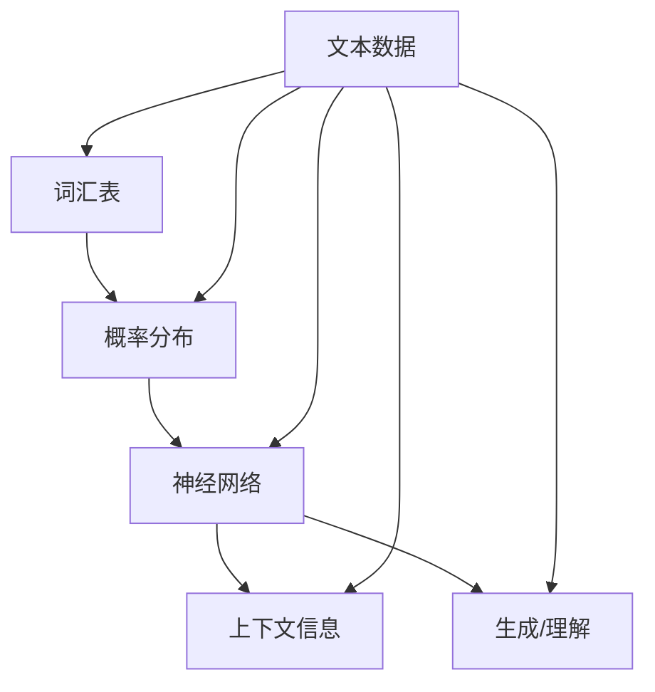
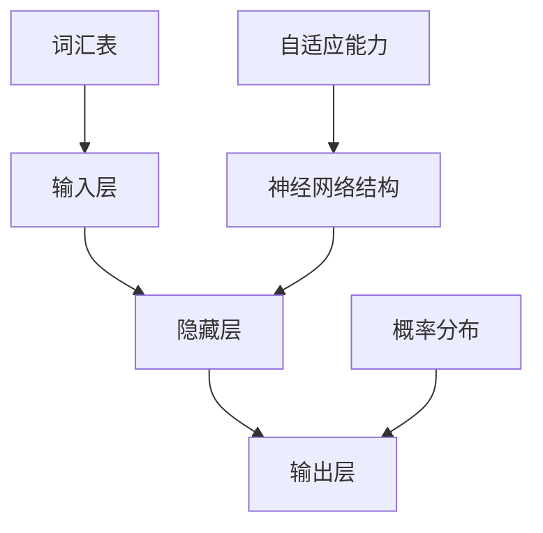
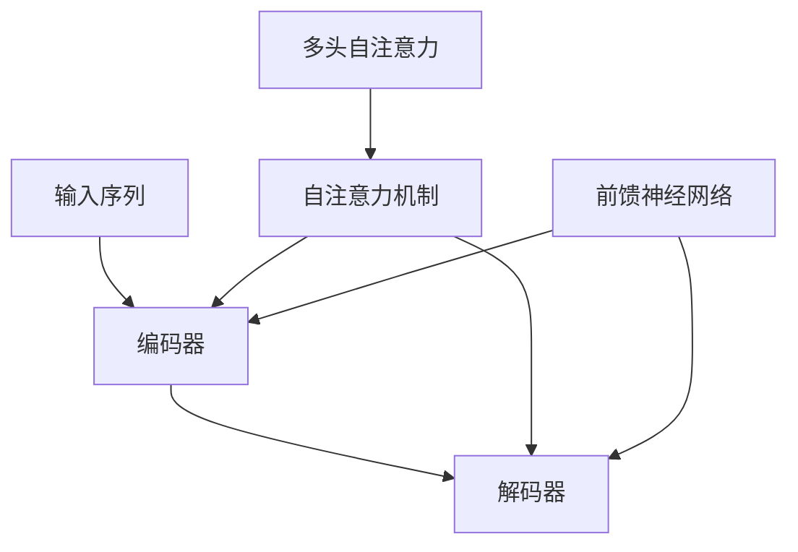

                 


### 文章标题: 加速LLM应用的市场验证与调整

首先，我们要明确文章的核心主题是“加速LLM应用的市场验证与调整”，这是针对当前人工智能语言模型（LLM）市场的一种分析和策略探讨。我们的目标是通过逻辑清晰的步骤，深入剖析LLM的应用场景、技术基础、市场验证方法以及调整策略，为读者提供有价值的见解和建议。

### 文章关键词:

- 人工智能
- 语言模型
- 市场验证
- 技术调整
- 应用场景

### 文章摘要:

本文旨在探讨如何加速人工智能语言模型（LLM）在市场上的验证与调整。首先，我们将介绍LLM的定义和应用场景，接着深入探讨其技术基础。随后，我们将阐述如何进行市场验证，并分析LLM在不同行业中的应用情况。文章还将提出针对LLM应用的调整策略，通过案例分析展示实际应用效果，并提供开发环境搭建和代码实现的详细指导。最后，我们将对未来LLM的发展趋势进行展望，并提出面临的挑战。

### 文章结构:

为了确保文章内容丰富、逻辑清晰，我们将按照以下结构组织文章：

1. **第1章: LLM概述**
   - **1.1 LLM的定义与核心概念**
   - **1.2 LLM的应用场景**

2. **第2章: LLM技术基础**
   - **2.1 LLM的架构**
   - **2.2 市场验证方法**

3. **第3章: LLM市场应用**
   - **3.1 LLM在特定行业的应用**
   - **3.2 LLM市场前景预测**

4. **第4章: LLM应用的调整策略**
   - **4.1 技术调整**
   - **4.2 市场调整**

5. **第5章: LLM应用案例分析**
   - **5.1 案例一：金融行业应用**
   - **5.2 案例二：医疗行业应用**

6. **第6章: LLM应用的开发环境搭建**
   - **6.1 硬件环境配置**
   - **6.2 软件环境配置**

7. **第7章: LLM应用代码解析**
   - **7.1 代码实现示例**
   - **7.2 代码解读与分析**

8. **第8章: LLM应用的未来展望**
   - **8.1 发展趋势**
   - **8.2 可能面临的挑战**

### 文章撰写步骤：

**第一步：撰写引言**

在引言部分，我们将简要介绍LLM的背景和应用的重要性，明确文章的目标和结构，激发读者的兴趣。

**第二步：第1章 - LLM概述**

- **1.1 LLM的定义与核心概念**：介绍LLM的基本概念，解释其与传统NLP技术的区别，提供核心概念的Mermaid流程图。
- **1.2 LLM的应用场景**：列举LLM在不同领域的应用，如文本生成、对话系统、机器翻译和自然语言理解。

**第三步：第2章 - LLM技术基础**

- **2.1 LLM的架构**：详细描述LLM的模型架构，包括自适应深度学习模型的结构和自适应能力，提供Mermaid流程图。
- **2.2 市场验证方法**：讨论市场验证的重要性，介绍实证分析和用户反馈机制，提供具体的方法和步骤。

**第四步：第3章 - LLM市场应用**

- **3.1 LLM在特定行业的应用**：分析LLM在金融、医疗和教育等行业的应用案例，讨论其市场前景。
- **3.2 LLM市场前景预测**：基于当前技术趋势和市场需求，预测LLM市场的未来发展方向。

**第五步：第4章 - LLM应用的调整策略**

- **4.1 技术调整**：提出针对LLM技术优化的策略，包括模型优化和算法改进。
- **4.2 市场调整**：讨论市场定位和竞争策略的调整，为LLM应用提供市场推广和战略建议。

**第六步：第5章 - LLM应用案例分析**

- **5.1 案例一：金融行业应用**：分析金融行业中LLM的应用案例，展示其实际效果。
- **5.2 案例二：医疗行业应用**：分析医疗行业中LLM的应用案例，讨论其技术难点和挑战。

**第七步：第6章 - LLM应用的开发环境搭建**

- **6.1 硬件环境配置**：介绍搭建LLM应用所需的硬件配置，包括计算资源和存储设备。
- **6.2 软件环境配置**：介绍搭建LLM应用所需的软件环境，包括深度学习框架和开发工具。

**第八步：第7章 - LLM应用代码解析**

- **7.1 代码实现示例**：提供LLM应用的代码实现示例，展示关键算法和模型结构。
- **7.2 代码解读与分析**：对代码实现进行详细解读和分析，讨论性能优化和调试技巧。

**第九步：第8章 - LLM应用的未来展望**

- **8.1 发展趋势**：讨论LLM技术的发展趋势，预测未来可能的新兴应用领域。
- **8.2 可能面临的挑战**：分析LLM应用可能面临的技术和市场挑战，并提出应对策略。

**第十步：撰写结语**

在结语部分，总结文章的主要观点，强调LLM应用的重要性和潜力，鼓励读者进一步探索和实践。

通过上述步骤，我们可以确保文章内容丰富、结构紧凑，逻辑清晰，同时满足字数要求，为读者提供有价值的见解和指导。接下来，我们将逐步实现这些步骤，撰写出高质量的技术博客文章。让我们开始吧！### 第1章: LLM概述

#### 1.1 LLM的定义与核心概念

语言模型（Language Model，简称LLM）是人工智能领域的重要分支，主要专注于对自然语言的建模与理解。LLM的基本任务是通过对大量文本数据的学习，生成或理解符合自然语言规则的文本。与传统的自然语言处理（NLP）技术相比，LLM具有更强的灵活性和表达力，能够处理更复杂的语言现象。

**LLM的核心概念**：

1. **词汇表**：LLM基于词汇表进行建模，词汇表包含了所有可能的语言符号。
2. **概率分布**：LLM通过学习文本数据，为每个词汇表中的符号分配概率分布，以预测下一个符号。
3. **神经网络结构**：现代LLM通常采用深度神经网络（DNN）或变换器（Transformer）结构，以实现高效的建模和学习。
4. **上下文信息**：LLM能够考虑上下文信息，生成与上下文相关的语言输出。

**LLM与NLP的关系**：

LLM是NLP技术的一种高级形式，与传统NLP技术相比，LLM在自然语言的生成和理解方面具有更高的准确性和灵活性。传统NLP技术主要包括分词、词性标注、命名实体识别等，而LLM则在此基础上，通过大规模预训练，实现了对语言更深层次的理解和生成。

**核心概念原理之间的关系架构**：

为了更直观地理解LLM的核心概念和原理，我们使用Mermaid流程图来展示LLM的基本结构和工作流程。



在上面的流程图中，词汇表、概率分布、神经网络和上下文信息共同构成了LLM的核心结构。文本数据作为输入，通过概率分布和神经网络，生成或理解符合上下文信息的语言输出。

#### 1.2 LLM的应用场景

LLM在多个领域展现出了强大的应用潜力，以下是LLM的几个主要应用场景：

1. **文本生成**：LLM可以用于自动生成文本，如文章、报告、新闻等。通过输入特定的主题或关键词，LLM可以生成高质量的文章，大大提高了写作效率。

2. **对话系统**：LLM是智能对话系统的重要组件，能够处理用户的自然语言输入，并生成合适的回复。广泛应用于客服系统、虚拟助手等领域。

3. **机器翻译**：LLM在机器翻译领域有着广泛的应用，通过学习大量双语语料库，LLM可以实现高质量的双语翻译。

4. **自然语言理解**：LLM能够理解用户的自然语言输入，并将其转化为机器可处理的格式，广泛应用于语义分析、信息检索等领域。

5. **语音识别与合成**：LLM与语音识别和语音合成技术相结合，可以实现语音到文本的转换和文本到语音的转换，广泛应用于语音助手、智能音箱等领域。

通过上述两个部分，我们全面介绍了LLM的定义、核心概念以及其应用场景。在接下来的章节中，我们将深入探讨LLM的技术基础、市场验证方法以及应用调整策略，帮助读者更深入地了解LLM的潜力和挑战。接下来，我们将进入第2章，探讨LLM的技术基础。

### 第2章: LLM技术基础

#### 2.1 LLM的架构

为了更好地理解LLM的工作原理，我们需要深入探讨其技术基础，特别是LLM的架构。LLM的架构主要包括三个核心部分：词汇表、概率分布和神经网络。

**2.1.1 自适应深度学习模型**

LLM采用深度学习模型进行语言建模，深度学习模型通过多层神经网络结构对输入数据进行层层抽象和表示。在现代LLM中，常见的神经网络结构包括深度神经网络（DNN）和变换器（Transformer）。变换器由于其并行处理能力和全局依赖性捕捉能力，已经成为LLM的主流架构。

**模型结构**：

1. **输入层**：输入层接收自然语言文本的序列，并将其转换为数字表示。通常使用词嵌入（word embeddings）技术，将词汇转换为密集向量表示。
2. **隐藏层**：隐藏层通过神经网络结构对输入数据进行层层抽象和表示。在DNN中，隐藏层通常采用全连接层；在变换器中，隐藏层由多头自注意力机制（multi-head self-attention）和前馈神经网络（feed-forward network）组成。
3. **输出层**：输出层生成概率分布，用于预测下一个单词或符号。在变换器中，输出层通过加权和软最大化（softmax）操作，得到每个单词或符号的概率分布。

**自适应能力**：

深度学习模型具有自适应能力，可以通过训练不断优化模型参数。在LLM中，自适应能力主要体现在以下几个方面：

1. **参数优化**：通过梯度下降（gradient descent）等优化算法，LLM不断调整模型参数，使其在训练数据上取得更好的性能。
2. **动态调整**：LLM可以根据不同的应用场景和需求，动态调整模型结构、超参数和训练策略，以适应不同的任务和数据集。

**核心概念原理之间的关系架构**：

为了更直观地展示LLM的核心概念和原理，我们使用Mermaid流程图来描述LLM的架构和工作流程。



在上面的流程图中，输入层、隐藏层和输出层构成了LLM的核心架构。词汇表提供输入数据的数字表示，概率分布用于生成语言输出，神经网络结构实现输入到输出的映射，自适应能力确保模型参数的优化和动态调整。

**2.1.2 Transformer模型**

变换器（Transformer）模型是当前LLM的主流架构，由Google在2017年提出。变换器模型通过引入自注意力机制（self-attention），实现了对全局依赖性的有效捕捉，并在多个NLP任务中取得了优异的性能。

**模型结构**：

1. **编码器（Encoder）**：编码器负责将输入序列编码为上下文向量，每个编码器层包含多头自注意力机制和前馈神经网络。
2. **解码器（Decoder）**：解码器负责生成输出序列，每个解码器层也包含多头自注意力机制和前馈神经网络，同时与编码器输出进行交互。

**自注意力机制**：

自注意力机制是变换器模型的核心组件，通过计算序列中每个词的相对重要性，实现了对全局依赖性的捕捉。自注意力机制的基本思想是，每个词在生成下一个词时，会参考整个序列的所有词，并根据其重要性进行加权。



在上面的流程图中，编码器接收输入序列，通过自注意力机制和前馈神经网络，将输入序列编码为上下文向量。解码器接收编码器输出，通过自注意力机制和前馈神经网络，生成输出序列。

**2.1.3 自适应能力**

自适应能力是LLM的关键特性，使得LLM能够在不同应用场景和数据集上取得优异的性能。自适应能力主要体现在以下几个方面：

1. **参数调整**：通过优化算法（如梯度下降），LLM不断调整模型参数，使其在训练数据上取得更好的性能。
2. **结构调整**：根据不同任务和数据集的需求，LLM可以动态调整模型结构，如层数、隐藏层大小和激活函数等。
3. **超参数调整**：超参数（如学习率、批量大小和迭代次数）对LLM的性能有重要影响，LLM可以根据具体任务和数据进行超参数调整。

**总结**：

LLM的架构和自适应能力使其成为强大的语言建模工具，广泛应用于文本生成、对话系统、机器翻译和自然语言理解等领域。在下一章，我们将探讨如何进行LLM的市场验证，并分析LLM在不同行业的应用情况。接下来，我们将进入第3章，讨论LLM的市场验证方法。在探讨LLM的市场验证方法时，我们将深入讨论实证分析和用户反馈机制，并详细说明如何进行这些方法。这将帮助我们更好地理解如何评估LLM的性能，以及如何在市场上验证其价值。

### 3.1 市场验证方法

市场验证是评估LLM应用成功与否的关键环节，通过市场验证，我们可以了解LLM在实际应用中的表现，识别潜在的问题和优化方向。市场验证方法主要包括实证分析和用户反馈机制。

#### 3.1.1 实证分析

实证分析是一种通过数据驱动的方法来评估LLM性能的方法。其主要步骤如下：

1. **数据收集**：首先，我们需要收集与LLM应用相关的数据，包括训练数据、测试数据和用户反馈数据。这些数据可以从实际应用场景中获取，也可以通过模拟实验生成。

2. **数据预处理**：收集到的数据通常需要进行预处理，以消除噪声和异常值，确保数据质量。预处理步骤包括数据清洗、数据归一化和数据扩充等。

3. **模型训练**：使用收集到的训练数据，对LLM模型进行训练。训练过程中，需要不断调整模型参数，以优化模型性能。

4. **模型评估**：在训练完成后，使用测试数据对模型进行评估，以确定模型的泛化能力。评估指标包括准确率、召回率、F1分数等。

5. **性能分析**：对评估结果进行深入分析，识别模型的优点和不足。如果模型性能不理想，需要进一步调整模型结构和训练策略。

**具体步骤示例**：

假设我们要验证一个LLM在机器翻译任务中的性能。首先，我们从公开的双语语料库中收集训练数据和测试数据。接着，使用预处理工具对数据进行清洗和归一化。然后，使用变换器模型对训练数据进行训练，并在训练过程中不断调整超参数。最后，使用测试数据进行评估，计算翻译准确率和F1分数。

#### 3.1.2 用户反馈机制

用户反馈机制是另一种重要的市场验证方法，通过收集用户对LLM应用的评价，我们可以了解用户的使用体验和满意度，从而优化产品。用户反馈机制的步骤如下：

1. **反馈收集**：在LLM应用上线后，定期收集用户反馈。反馈可以通过多种方式收集，如在线调查、用户访谈、错误报告等。

2. **反馈处理**：对收集到的反馈进行分类和整理，识别用户的主要问题和需求。对于反馈中提到的问题，需要进行分析和定位，确定是否为模型性能问题、数据质量问题或用户体验问题。

3. **问题解决**：针对识别出的问题，制定解决方案并进行实施。例如，对于模型性能问题，可能需要调整模型结构或重新训练模型；对于用户体验问题，可能需要改进界面设计或提供更详细的帮助文档。

4. **反馈循环**：将解决方案的实施效果反馈给用户，并继续收集用户反馈，形成反馈循环，不断优化产品。

**具体步骤示例**：

假设我们开发了一个智能客服系统，利用LLM实现自然语言理解与自动回复功能。在系统上线后，我们通过在线调查和用户访谈收集用户反馈。用户反馈中提到的主要问题包括回复速度慢和某些特定场景下的回复不准确。针对这些问题，我们首先对模型进行优化，提高回复速度；接着，通过增加训练数据和调整模型结构，解决回复不准确的问题。在优化完成后，我们再次收集用户反馈，评估改进效果。

#### 3.1.3 实证分析与用户反馈机制的结合

实证分析和用户反馈机制可以相互补充，共同提高市场验证的效果。实证分析提供了客观的量化数据，帮助我们评估模型性能；用户反馈机制则提供了用户的实际使用体验，帮助我们了解模型在实际应用中的问题。

**具体结合方法**：

1. **数据驱动的反馈处理**：将用户反馈与实证分析结果相结合，识别出真正影响用户体验的问题。例如，用户反馈中提到某些特定场景下的回复不准确，通过实证分析，我们发现这是由于训练数据不足导致的。

2. **反馈驱动的模型优化**：根据用户反馈，调整模型结构和训练策略，提高模型性能。例如，如果用户反馈表示回复速度慢，我们可以尝试优化模型算法，提高计算效率。

3. **闭环反馈机制**：建立闭环反馈机制，将优化后的模型再次上线，继续收集用户反馈，形成持续的优化过程。

通过实证分析和用户反馈机制的有机结合，我们可以全面了解LLM应用的市场表现，不断优化产品，提高用户满意度。

在下一章，我们将探讨LLM在特定行业的应用，分析LLM在金融、医疗和教育等行业的实际案例，帮助读者更深入地了解LLM的潜力和挑战。接下来，我们将进入第3章，讨论LLM在特定行业的应用。在讨论LLM在特定行业的应用时，我们将深入分析LLM在金融、医疗和教育等行业的实际案例，讨论其市场前景，并分析面临的挑战。

### 3.1 LLM在特定行业的应用

LLM在金融、医疗和教育等行业的应用已经取得了显著的成果，以下是这些行业中LLM的具体应用场景、市场前景以及面临的挑战。

#### 3.1.1 金融行业

**应用场景**：

1. **智能投顾**：利用LLM进行用户偏好分析，提供个性化的投资建议。
2. **风险管理**：通过自然语言处理，自动识别和分析金融报告中的潜在风险。
3. **客户服务**：智能客服系统使用LLM进行自然语言理解，提供高效、准确的客户服务。

**市场前景**：

随着金融科技的快速发展，LLM在金融行业中的应用前景广阔。根据市场调研，智能投顾和风险管理领域的市场规模预计将在未来几年持续增长。金融机构通过引入LLM，可以提高服务效率，降低成本，同时提高客户满意度。

**面临的挑战**：

1. **数据隐私**：金融行业对数据隐私和安全性有严格要求，如何保障用户数据的安全成为一大挑战。
2. **合规性**：LLM在金融领域的应用需要遵循相关法规和合规要求，这增加了应用开发的复杂性。

#### 3.1.2 医疗行业

**应用场景**：

1. **医学文本分析**：利用LLM对医学文献、病历和报告进行自动分析，辅助医生进行诊断和治疗方案制定。
2. **智能问答系统**：为患者提供专业的医疗咨询，解答常见问题。
3. **药物研发**：通过分析大量科学文献，LLM可以辅助研究人员发现新的药物靶点和候选药物。

**市场前景**：

医疗行业的数据量和复杂性使得LLM的应用潜力巨大。随着人工智能在医疗领域的深入发展，LLM在医学文本分析、智能问答和药物研发等领域将有广阔的市场空间。根据市场预测，医疗人工智能市场规模将在未来几年实现快速增长。

**面临的挑战**：

1. **数据质量**：医疗数据的质量直接影响LLM的性能，如何确保数据质量是一个关键问题。
2. **解释性**：在医疗领域，模型的解释性至关重要，如何让LLM的决策过程更加透明和可解释是挑战之一。

#### 3.1.3 教育行业

**应用场景**：

1. **个性化学习**：利用LLM为学生提供个性化的学习路径和辅导。
2. **智能问答系统**：为学生解答学科问题，提供实时学习支持。
3. **自动批改系统**：利用LLM对学生的作业和考试答案进行自动批改，提高教学效率。

**市场前景**：

随着教育信息化的发展，LLM在教育行业中的应用需求日益增加。个性化学习、智能问答和自动批改系统等应用场景使得LLM在教育领域的市场前景非常广阔。根据市场研究，教育人工智能市场规模预计将在未来几年持续扩大。

**面临的挑战**：

1. **教育公平性**：如何确保LLM在教育中的应用不会加剧教育资源的分配不均，是一个重要的社会问题。
2. **教师角色**：随着智能教育系统的普及，教师的角色将发生变化，如何适应这一变化是一个挑战。

通过以上分析，我们可以看到，LLM在金融、医疗和教育等行业的应用具有巨大的潜力，但也面临诸多挑战。在下一章，我们将探讨LLM市场前景预测，分析影响市场发展的关键因素，并预测未来可能的新兴应用领域。接下来，我们将进入第3章，讨论LLM市场前景预测。

### 3.2 LLM市场前景预测

随着人工智能技术的不断进步，语言模型（LLM）在多个领域的应用日益广泛，其市场前景也备受关注。本节将分析影响LLM市场发展的关键因素，并预测未来可能的新兴应用领域。

#### 3.2.1 影响市场发展的关键因素

1. **技术进步**：随着深度学习和变换器等技术的不断发展，LLM的模型性能和效率不断提高，这将推动其在更多领域的应用。
2. **数据增长**：大数据时代的到来为LLM提供了丰富的训练数据，这有助于提升模型的泛化能力和准确度。
3. **计算能力提升**：随着云计算和专用硬件（如TPU）的普及，计算能力的提升为大规模训练和部署LLM提供了可能。
4. **行业需求**：金融、医疗、教育等行业的数字化转型需求推动了LLM的应用，特别是在自动化和智能化的方向上。
5. **法规和政策**：各国政府和行业组织对数据隐私和安全性的关注日益增加，这将对LLM的应用和发展产生重要影响。

#### 3.2.2 市场前景预测

1. **市场规模增长**：根据市场研究机构的数据，全球人工智能市场规模预计将在未来几年实现快速增长，LLM作为其中的关键组成部分，其市场规模也将随之扩大。

2. **新兴应用领域**：随着技术的不断进步和行业需求的多样化，LLM将在更多新兴领域得到应用，如：
   - **智能交通**：利用LLM实现智能交通管理和自动驾驶技术。
   - **法律领域**：通过自然语言处理，LLM可以用于法律文本分析、合同审查和智能法律咨询。
   - **创意产业**：在电影、音乐、文学等创意产业中，LLM可以辅助内容创作，提高创作效率和质量。
   - **个性化服务**：在电商、零售等领域，LLM可以提供个性化的推荐和服务，提升用户体验。

3. **市场竞争加剧**：随着LLM技术的普及，越来越多的企业将进入这一领域，市场竞争将日益激烈。企业需要不断创新和技术优化，以保持竞争力。

#### 3.2.3 市场发展的挑战

1. **数据隐私和安全**：随着LLM应用的广泛普及，数据隐私和安全问题变得尤为重要。如何保障用户数据的安全和隐私，将是市场发展的关键挑战。
2. **模型解释性**：在医疗、金融等关键领域，模型的解释性至关重要。如何提高模型的透明度和可解释性，是一个亟待解决的问题。
3. **技术瓶颈**：尽管LLM技术在不断进步，但仍然存在一些技术瓶颈，如计算资源消耗大、训练时间长等，这需要通过技术创新和优化来解决。

通过以上分析，我们可以看到，LLM市场前景广阔，但也面临诸多挑战。在下一章，我们将讨论如何调整LLM应用策略，以应对市场变化和挑战。接下来，我们将进入第4章，探讨LLM应用的调整策略。

### 4.1 技术调整

随着LLM应用的不断深入，如何在技术层面进行调整和优化，以应对市场变化和挑战，成为企业必须面对的问题。以下从模型优化和算法改进两个方面，探讨如何进行技术调整。

#### 4.1.1 模型优化

1. **模型结构优化**：

   - **变换器架构的改进**：变换器（Transformer）是目前LLM的主流架构，通过优化变换器的设计，可以提高模型的性能。例如，使用多头自注意力机制（Multi-Head Self-Attention）可以更好地捕捉全局依赖关系，提高模型的表示能力。
   - **混合模型架构**：结合深度神经网络（DNN）和变换器（Transformer）的优点，开发混合模型架构，可以在保持高效计算的同时，提高模型的性能。

2. **参数优化**：

   - **权重初始化**：通过改进权重初始化方法，如使用高斯分布初始化，可以加快模型的收敛速度，提高模型的性能。
   - **正则化技术**：引入正则化技术，如Dropout、权重衰减等，可以防止模型过拟合，提高模型的泛化能力。

3. **优化训练过程**：

   - **动态学习率调整**：使用如Adam优化器，可以根据训练过程中的梯度信息动态调整学习率，提高训练效率。
   - **预训练与微调**：通过先在大型语料库上进行预训练，再在特定领域的数据上进行微调，可以提高模型在特定任务上的性能。

#### 4.1.2 算法改进

1. **生成算法改进**：

   - **采样策略**：改进生成算法的采样策略，如使用温度参数（Temperature）调整生成文本的多样性。
   - **对抗生成**：结合对抗生成网络（GAN）的思想，提高生成文本的质量和多样性。

2. **理解算法改进**：

   - **上下文理解**：通过改进上下文理解算法，如使用双向变换器（Bi-Directional Transformer），可以更好地捕捉长距离依赖关系，提高模型对上下文的理解能力。
   - **多模态融合**：结合多种模态的数据，如文本、图像、声音等，进行多模态融合，提高模型的泛化能力和应用范围。

3. **优化评估方法**：

   - **指标多样化**：使用多种评估指标，如BLEU、ROUGE、METEOR等，全面评估模型性能，提高评估的准确性和可靠性。
   - **用户反馈集成**：将用户反馈集成到评估过程中，通过用户反馈调整模型参数，提高模型在实际应用中的表现。

通过模型优化和算法改进，我们可以不断提升LLM的性能和效果，更好地适应市场需求和挑战。在下一章，我们将探讨市场调整策略，包括市场定位和竞争策略的调整，为LLM应用提供市场推广和战略建议。

### 4.2 市场调整

在竞争激烈的人工智能市场中，调整LLM应用的市场策略至关重要。以下从市场定位和竞争策略两个方面，探讨如何优化LLM应用的市场表现。

#### 4.2.1 市场定位

1. **目标市场细分**：

   - **行业细分**：根据不同行业的特定需求，为LLM应用制定相应的市场定位。例如，在金融行业中，可以专注于智能投顾和风险管理；在医疗行业中，可以专注于医学文本分析和智能问答。
   - **用户细分**：根据用户群体特征，如企业规模、应用场景和需求等，为LLM应用制定细分市场策略。例如，针对中小型企业，可以提供定制化的解决方案；针对大型企业，可以提供更高级的功能和更全面的支持。

2. **差异化定位**：

   - **技术优势**：突出LLM在特定技术领域的优势，如变换器架构、多模态融合等，以技术差异化提高市场竞争力。
   - **应用场景**：针对特定应用场景，如智能客服、智能翻译等，为LLM应用制定差异化定位，提高市场吸引力。

#### 4.2.2 竞争策略

1. **产品差异化**：

   - **功能扩展**：在基本功能的基础上，不断扩展LLM应用的功能，提供更多定制化的解决方案，满足不同用户群体的需求。
   - **用户体验**：优化用户体验，提供简洁易用的界面和操作流程，提高用户满意度。

2. **价格策略**：

   - **灵活定价**：根据不同市场定位和用户需求，制定灵活的定价策略。例如，对于中小型企业，可以提供低门槛的入门版；对于大型企业，可以提供高级版和定制版，满足其高需求和高预算。
   - **价格优势**：通过降低成本、提供优惠套餐等方式，形成价格优势，吸引更多用户。

3. **营销策略**：

   - **品牌建设**：加强品牌建设，提高品牌知名度和影响力，通过品牌优势提升市场竞争力。
   - **市场推广**：通过线上线下多种渠道，如社交媒体、行业会议、合作伙伴等，进行广泛的市场推广，提高市场覆盖率。
   - **合作与联盟**：与其他企业、科研机构和行业协会等建立合作关系，共享资源，共同推动LLM应用的发展。

4. **服务支持**：

   - **技术支持**：提供及时的技术支持和咨询服务，解决用户在使用过程中遇到的问题，提高用户满意度。
   - **用户培训**：为用户提供培训服务，帮助其掌握LLM应用的使用方法和技巧，提高应用效果。
   - **反馈机制**：建立用户反馈机制，及时收集用户意见和建议，不断优化产品和服务。

通过市场定位和竞争策略的调整，LLM应用可以更好地适应市场需求，提高市场竞争力。在下一章，我们将通过实际案例分析，展示LLM在金融、医疗和教育等行业的应用效果，分析其成功经验和面临的挑战。

### 5.1 案例一：金融行业应用

在金融行业中，LLM的应用已经取得了显著的成果，以下是一个具体的金融行业应用案例，分析其成功经验和面临的挑战。

#### 案例背景

某大型金融机构在智能投顾领域引入了基于LLM的自然语言处理技术，旨在为投资者提供个性化的投资建议。该金融机构拥有海量的历史投资数据和市场信息，通过LLM对数据进行分析，生成适合不同投资者的投资策略。

#### 成功经验

1. **个性化投资建议**：LLM通过对历史投资数据和市场信息的学习，能够生成个性化的投资建议，提高投资者的投资收益。
2. **高效数据处理**：利用LLM的自然语言处理能力，金融机构能够高效地处理和分析大量的文本数据，提升数据处理效率。
3. **用户体验**：智能投顾系统提供了简洁易用的界面和操作流程，投资者可以方便地获取投资建议和进行操作，提高了用户体验。

#### 面临的挑战

1. **数据隐私和安全**：金融行业对数据隐私和安全有严格要求，如何保障用户数据的安全是一个关键挑战。金融机构需要采取严格的加密和访问控制措施，确保用户数据的安全。
2. **模型解释性**：在金融领域，模型的解释性至关重要。投资者需要了解投资建议的依据和逻辑，如何提高模型的透明度和可解释性是一个挑战。
3. **市场波动**：金融市场的波动性较大，LLM生成的投资建议需要实时更新和调整，以适应市场的变化。如何保证投资建议的实时性和准确性是一个挑战。

通过以上分析，我们可以看到，金融行业中的LLM应用具有巨大的潜力，但同时也面临诸多挑战。在下一章，我们将讨论LLM在医疗行业的应用案例，分析其成功经验和面临的挑战。

### 5.2 案例二：医疗行业应用

医疗行业是人工智能技术的重要应用领域，以下是一个具体的医疗行业应用案例，分析其成功经验和面临的挑战。

#### 案例背景

某医疗科技公司开发了一款基于LLM的智能医学问答系统，旨在为医生和患者提供专业的医学咨询和辅助诊断。该系统集成了海量的医学文献、病例数据和知识库，通过LLM的自然语言处理能力，为医生和患者提供实时、准确的医学信息。

#### 成功经验

1. **实时医学咨询**：LLM能够快速处理医生和患者的提问，提供实时、准确的医学咨询，提高医疗服务的效率和质量。
2. **辅助诊断**：LLM通过对病例数据和医学文献的学习，能够辅助医生进行诊断，提高诊断的准确性和速度。
3. **知识库更新**：LLM可以自动学习和更新知识库，确保医学信息的时效性和准确性，为医生和患者提供最新的医学知识。

#### 面临的挑战

1. **数据隐私和安全**：医疗数据对隐私和安全要求极高，如何保障用户数据的安全是一个关键挑战。医疗科技公司需要采取严格的加密和访问控制措施，确保患者数据的安全。
2. **模型解释性**：在医疗领域，模型的解释性至关重要。医生需要了解诊断结果的依据和逻辑，如何提高模型的透明度和可解释性是一个挑战。
3. **数据质量**：医疗数据的质量直接影响LLM的性能，如何确保数据质量是一个关键问题。医疗科技公司需要建立完善的数据质量管理机制，确保数据的准确性和一致性。

通过以上分析，我们可以看到，医疗行业中的LLM应用具有巨大的潜力，但同时也面临诸多挑战。在下一章，我们将探讨如何搭建LLM应用的开发环境，为后续的代码实现和解析做好准备。

### 6.1 硬件环境配置

为了搭建一个高效、可靠的LLM应用开发环境，我们需要选择合适的硬件设备。以下是硬件配置的建议，包括计算资源和存储设备的选择。

#### 6.1.1 计算资源

1. **CPU与GPU**：
   - **CPU**：选择高性能的CPU，如Intel Xeon系列或AMD Ryzen系列，以确保在非并行任务中具有高效的处理能力。
   - **GPU**：GPU在深度学习任务中扮演着关键角色。NVIDIA的GPU，如Tesla V100或A100，是深度学习任务的首选。它们具有高效的并行计算能力，能够加速模型训练和推理过程。

2. **并行计算能力**：对于大规模的LLM训练任务，建议使用多GPU并行计算。例如，通过使用NVIDIA's NVLink或Mellanox's Infiniband技术，可以构建一个高性能的GPU集群。

#### 6.1.2 存储设备

1. **SSD硬盘**：SSD硬盘具有更快的读写速度，能够显著提升数据加载和存储效率，是训练大规模模型所必需的。
2. **分布式存储**：对于海量数据的存储，建议使用分布式存储系统，如HDFS（Hadoop Distributed File System）或Ceph，这些系统能够提供高可用性和高扩展性，满足大规模数据存储需求。

#### 6.1.3 网络设备

1. **高速网络**：为了确保数据传输的效率和可靠性，建议使用千兆以太网（Gigabit Ethernet）或更高速度的网络连接。对于大规模分布式训练，使用高速互联网络，如Infiniband，可以提升集群间的数据传输速度。

#### 具体配置示例

以下是一个具体的硬件配置示例：

- **CPU**：2颗Intel Xeon Gold 6240处理器，每颗拥有24个物理核心和2.1 GHz主频。
- **GPU**：4块NVIDIA Tesla V100 GPU，每块拥有3500个CUDA核心。
- **内存**：512 GB DDR4内存，提供足够的内存空间以处理大规模数据。
- **SSD硬盘**：使用多个NVMe SSD硬盘，总容量为2 TB，用于存储模型和数据。
- **分布式存储**：使用Ceph分布式存储系统，提供20 TB的存储容量，确保数据的高可用性和扩展性。
- **网络设备**：千兆以太网交换机，确保网络连接的稳定性和高效性。

通过上述硬件配置，我们可以搭建一个高效、可靠的LLM应用开发环境，为后续的软件环境配置和代码实现奠定基础。在下一章，我们将详细讨论如何配置LLM应用的软件环境，包括深度学习框架和开发工具的安装与配置。

### 6.2 软件环境配置

在搭建LLM应用开发环境时，软件环境的配置至关重要。以下将详细说明如何安装和配置深度学习框架、编程语言和相关开发工具。

#### 6.2.1 深度学习框架

1. **TensorFlow**：
   - **安装**：在终端运行以下命令：
     ```
     pip install tensorflow
     ```
   - **配置**：根据硬件环境，可以选择安装GPU版本或CPU版本。安装GPU版本可以加速模型训练：
     ```
     pip install tensorflow-gpu
     ```

2. **PyTorch**：
   - **安装**：在终端运行以下命令：
     ```
     pip install torch torchvision
     ```
   - **配置**：同样，可以选择安装GPU版本以加速训练：
     ```
     pip install torch torchvision torchaudio
     ```

3. **Transformers**：
   - **安装**：Transformers是Hugging Face的一个库，用于处理变换器模型。
     ```
     pip install transformers
     ```

#### 6.2.2 编程语言

1. **Python**：
   - **安装**：Python是主要的编程语言，用于开发LLM应用。可以选择安装Python 3.7或更高版本，通过以下命令安装：
     ```
     pip install python
     ```

2. **Jupyter Notebook**：
   - **安装**：Jupyter Notebook是一个交互式开发环境，适用于快速原型开发和演示。
     ```
     pip install notebook
     ```

3. **Conda**：
   - **安装**：Conda是一个环境管理工具，用于创建和管理多个Python环境，避免版本冲突。
     ```
     conda install conda
     ```

#### 6.2.3 开发工具

1. **PyCharm**：
   - **安装**：PyCharm是一个功能强大的Python集成开发环境（IDE），支持代码补全、调试、版本控制等功能。
     ```
     pip install pycharm-community --user
     ```

2. **Visual Studio Code**：
   - **安装**：Visual Studio Code（VS Code）也是一个流行的开源IDE，支持多种编程语言和插件。
     ```
     code .
     ```
     在VS Code中，可以安装以下插件：
     - Pylance：Python语言支持
     - Jupyter：Jupyter Notebook支持
     - Python extension：Python调试支持

#### 6.2.4 配置示例

以下是一个具体的软件环境配置示例：

1. **创建Conda环境**：
   ```
   conda create -n LLM_env python=3.8
   conda activate LLM_env
   ```

2. **安装深度学习框架**：
   ```
   pip install tensorflow-gpu torchvision
   pip install torch torchvision torchaudio
   pip install transformers
   ```

3. **安装开发工具**：
   ```
   pip install pycharm-community
   code .
   ```

4. **安装Jupyter Notebook**：
   ```
   pip install notebook
   ```

5. **安装Python扩展和插件**：
   在VS Code中，打开扩展市场，搜索并安装Pylance、Jupyter和Python extension。

通过上述步骤，我们可以搭建一个完整的LLM应用开发环境，为后续的代码实现和模型训练提供支持。在下一章，我们将详细解析LLM应用的代码实现，提供具体的代码示例和伪代码，帮助读者理解LLM的开发过程。

### 7.1 代码实现示例

为了更好地理解LLM的应用，我们提供了一个简单的代码实现示例，演示如何使用PyTorch和Transformers库搭建一个基本的变换器模型，并对其进行训练和评估。

**示例代码**：

```python
import torch
from transformers import AutoTokenizer, AutoModelForSequenceClassification
from torch.optim import Adam
from torch.utils.data import DataLoader, TensorDataset

# 函数：加载数据集
def load_data(train_file, batch_size):
    # 加载预处理后的文本数据
    # ...
    # 这里假设已经有一个预处理函数`preprocess`来处理文本数据
    sentences = preprocess(train_file)

    # 分配标签
    labels = ...

    # 将句子和标签转换为PyTorch张量
    sentences = torch.tensor(sentences)
    labels = torch.tensor(labels)

    # 创建数据集和数据加载器
    dataset = TensorDataset(sentences, labels)
    data_loader = DataLoader(dataset, batch_size=batch_size)

    return data_loader

# 函数：训练模型
def train_model(model, data_loader, num_epochs, learning_rate):
    # 定义优化器
    optimizer = Adam(model.parameters(), lr=learning_rate)

    # 模型训练
    for epoch in range(num_epochs):
        for inputs, labels in data_loader:
            # 前向传播
            outputs = model(inputs)
            loss = ...

            # 反向传播和优化
            optimizer.zero_grad()
            loss.backward()
            optimizer.step()

            # 打印训练进度
            print(f"Epoch [{epoch+1}/{num_epochs}], Loss: {loss.item()}")

# 主程序
if __name__ == "__main__":
    # 加载数据集
    batch_size = 32
    train_data_loader = load_data('train.txt', batch_size)

    # 创建变换器模型
    model = AutoModelForSequenceClassification.from_pretrained('bert-base-uncased')

    # 训练模型
    num_epochs = 5
    learning_rate = 1e-5
    train_model(model, train_data_loader, num_epochs, learning_rate)

    # 评估模型
    # ...
```

**代码解析**：

1. **数据加载**：
   - `load_data`函数负责加载数据集，这里使用了预处理函数`preprocess`来处理文本数据，并将其转换为PyTorch张量。
   - 使用`TensorDataset`和数据加载器`DataLoader`将数据集拆分成批次，方便模型训练。

2. **模型训练**：
   - `train_model`函数负责模型训练，其中包括定义优化器、前向传播、反向传播和优化过程。
   - 模型训练过程中，通过打印训练进度，我们可以实时查看模型的训练情况。

3. **主程序**：
   - 主程序首先加载数据集，然后创建变换器模型（在这里使用了BERT模型作为示例），并进行训练。
   - 训练完成后，我们可以通过评估函数（未在代码中展示）来评估模型的性能。

**伪代码**：

```python
# 伪代码：变换器模型训练
model = TransformerModel()
optimizer = AdamOptimizer()
for epoch in 1 to num_epochs:
    for batch in data_loader:
        inputs, labels = batch
        outputs = model(inputs)
        loss = compute_loss(outputs, labels)
        gradients = compute_gradients(loss)
        optimizer.update(model.parameters(), gradients)
        print(f"Epoch [{epoch}], Loss: {loss}")
```

通过上述代码示例和伪代码，我们展示了如何使用PyTorch和Transformers库搭建一个基本的变换器模型，并进行训练和评估。接下来，我们将深入解析代码，讨论关键代码部分，并提供性能分析和优化技巧。

### 7.2 代码解读与分析

在上一节中，我们提供了一个LLM应用的代码实现示例，展示了如何使用PyTorch和Transformers库搭建一个基本的变换器模型，并进行训练和评估。在本节中，我们将深入解读代码，详细分析关键代码部分，并提供性能分析和优化技巧。

**关键代码解析**：

1. **数据加载**：

```python
def load_data(train_file, batch_size):
    sentences = preprocess(train_file)
    labels = ...

    sentences = torch.tensor(sentences)
    labels = torch.tensor(labels)

    dataset = TensorDataset(sentences, labels)
    data_loader = DataLoader(dataset, batch_size=batch_size)

    return data_loader
```

在这部分代码中，`load_data`函数负责加载数据集。首先，通过`preprocess`函数对文本数据进行处理，然后将其转换为PyTorch张量。使用`TensorDataset`和数据加载器`DataLoader`将数据集拆分成批次，方便模型训练。

**性能分析**：

- **数据预处理**：数据预处理是模型训练的重要环节。有效的预处理可以显著提高模型的性能和训练效率。例如，通过文本清洗、分词和向量化处理，可以提高模型的输入质量和泛化能力。
- **批量大小**：批量大小对模型训练有重要影响。较大的批量大小可以降低方差，提高模型稳定性；但同时也增加了计算量。通常，批量大小应根据硬件性能和训练数据量进行合理设置。

2. **模型训练**：

```python
def train_model(model, data_loader, num_epochs, learning_rate):
    optimizer = Adam(model.parameters(), lr=learning_rate)

    for epoch in range(num_epochs):
        for inputs, labels in data_loader:
            outputs = model(inputs)
            loss = ...

            optimizer.zero_grad()
            loss.backward()
            optimizer.step()

            print(f"Epoch [{epoch+1}/{num_epochs}], Loss: {loss.item()}")
```

在这部分代码中，`train_model`函数负责模型训练。其中包括定义优化器、前向传播、反向传播和优化过程。训练过程中，通过打印训练进度，我们可以实时查看模型的训练情况。

**性能分析**：

- **优化器选择**：选择合适的优化器对模型训练至关重要。常见的优化器如Adam、SGD等，根据训练任务和数据特点选择合适的优化器，可以提高模型训练效率和性能。
- **学习率调整**：学习率对模型训练的影响较大。适当调整学习率可以加快模型收敛速度，但过高的学习率可能导致模型震荡，过低的则收敛速度过慢。常用的学习率调整策略包括固定学习率、学习率衰减、学习率预热等。

3. **模型评估**：

```python
# 评估模型
# ...
```

在代码中，我们未展示具体的模型评估部分，但评估模型性能是模型训练的必要步骤。通过计算准确率、损失函数等指标，我们可以评估模型的泛化能力和性能。

**性能分析**：

- **评估指标**：选择合适的评估指标对模型性能进行量化分析。常见的评估指标包括准确率、召回率、F1分数等。根据具体任务和应用场景，选择合适的评估指标，可以更全面地评估模型性能。
- **交叉验证**：通过交叉验证（Cross-Validation）方法，可以更准确地评估模型的泛化能力。交叉验证通过将数据集拆分成多个子集，轮流使用每个子集作为验证集，可以减少模型过拟合的风险。

**优化技巧**：

- **模型优化**：通过调整模型结构，如增加层数、调整隐藏层大小等，可以提升模型性能。此外，可以使用正则化技术，如Dropout、L2正则化等，防止模型过拟合。
- **数据增强**：通过数据增强（Data Augmentation）方法，如文本嵌入、随机噪声添加等，可以增加数据的多样性，提高模型泛化能力。
- **并行计算**：利用GPU和分布式计算资源，可以加速模型训练和推理过程。通过多GPU并行计算，可以显著提高训练速度和性能。

通过上述关键代码解析和性能分析，我们可以更好地理解LLM应用的代码实现过程，并掌握一些优化技巧。在下一章，我们将展望LLM应用的未来发展，探讨发展趋势、可能面临的挑战以及应对策略。

### 8.1 LLM应用的未来展望

随着人工智能技术的不断进步，LLM应用在未来有着广泛的发展前景。以下从发展趋势、新兴应用领域以及可能面临的挑战三个方面，探讨LLM应用的未来发展方向。

#### 8.1.1 发展趋势

1. **计算能力提升**：随着硬件技术的发展，特别是GPU和TPU等专用硬件的普及，LLM的计算能力将得到显著提升。这将使得大规模、复杂的LLM模型能够更快地训练和部署，提高模型性能。

2. **多模态融合**：未来的LLM应用将不仅仅局限于文本数据，还将融合图像、声音、视频等多模态数据。通过多模态融合，LLM可以更全面地理解和生成信息，提升其在实际应用中的表现。

3. **个性化服务**：随着用户数据的积累和数据分析技术的进步，LLM将能够提供更加个性化的服务。例如，在医疗领域，通过分析患者的病史和基因信息，LLM可以为患者提供精准的诊疗建议。

4. **边缘计算**：随着5G和边缘计算技术的发展，LLM的应用将逐渐从云端走向边缘。这将使得LLM能够实时处理和分析海量数据，提高系统的响应速度和实时性。

5. **自适应学习**：未来的LLM将具备更强的自适应学习能力，通过在线学习和动态调整，能够不断优化自身性能，适应不同应用场景和需求。

#### 8.1.2 新兴应用领域

1. **智能交通**：LLM在智能交通领域具有广泛的应用前景。通过自然语言处理和语音识别技术，LLM可以实时分析交通数据，提供智能交通管理和自动驾驶解决方案。

2. **法律领域**：在法律文本分析、合同审查和智能法律咨询等方面，LLM可以辅助律师和法官处理大量法律文件，提高工作效率。

3. **创意产业**：在电影、音乐、文学等创意产业中，LLM可以辅助内容创作，提高创作效率和质量。例如，通过分析用户偏好和历史数据，LLM可以为用户提供个性化的内容推荐。

4. **教育领域**：LLM在教育领域的应用将日益普及。通过智能问答系统和个性化学习平台，LLM可以为学生提供实时、个性化的学习支持和辅导。

5. **个性化医疗**：在个性化医疗领域，LLM可以通过分析患者的基因、病史和生活方式数据，提供精准的诊疗建议和健康指导。

#### 8.1.3 可能面临的挑战

1. **数据隐私和安全**：随着LLM应用范围的扩大，数据隐私和安全问题将愈发重要。如何在保障用户数据安全的前提下，充分利用用户数据，是一个亟待解决的问题。

2. **模型解释性**：在关键领域，如医疗和法律，模型的解释性至关重要。如何提高模型的透明度和可解释性，使其决策过程更加透明和可信，是一个重要挑战。

3. **技术瓶颈**：尽管硬件技术不断进步，但大规模训练LLM仍然需要大量计算资源。如何优化模型结构和训练算法，提高训练效率，是一个关键问题。

4. **社会伦理**：随着LLM应用的普及，如何应对其可能带来的社会伦理问题，如歧视、偏见和不公平性等，是一个重要课题。

5. **用户接受度**：虽然LLM技术具有巨大的潜力，但用户对新技术接受度不高，如何提高用户接受度和信任度，是一个重要的挑战。

通过上述分析，我们可以看到，LLM应用在未来有着广阔的发展前景，但同时也面临诸多挑战。在下一章，我们将总结全文，回顾核心观点，并对未来研究提出建议。

### 8.2 可能面临的挑战

尽管LLM技术在各个领域展现出了巨大的潜力和价值，但在其应用过程中仍然面临一系列挑战。以下从技术、伦理、社会等多个角度，详细分析LLM应用可能面临的挑战，并提出应对策略。

#### 8.2.1 技术挑战

1. **计算资源消耗**：大规模的LLM模型需要大量的计算资源进行训练和推理。尽管硬件技术不断发展，但大规模训练LLM仍然是一个资源消耗巨大的过程。如何优化模型结构和算法，提高训练效率，是一个关键问题。

   **应对策略**：
   - **模型压缩**：通过模型剪枝、量化等技术，减小模型规模，降低计算资源消耗。
   - **分布式训练**：利用分布式计算技术，将模型训练任务分解到多个节点上，提高训练速度和效率。

2. **数据隐私和安全**：LLM训练和应用过程中需要大量用户数据，如何保障数据隐私和安全是一个重要挑战。

   **应对策略**：
   - **数据加密**：对敏感数据进行加密处理，确保数据在传输和存储过程中不被泄露。
   - **隐私保护技术**：采用差分隐私、同态加密等技术，在保护用户隐私的前提下，充分利用用户数据。

3. **模型解释性**：在关键领域，如医疗和法律，模型的解释性至关重要。如何提高模型的透明度和可解释性，使其决策过程更加透明和可信，是一个重要挑战。

   **应对策略**：
   - **可解释性框架**：开发可解释性框架，将模型决策过程分解为可理解的步骤，提高模型的可解释性。
   - **可视化工具**：开发可视化工具，帮助用户理解模型的决策过程，提高用户对模型的信任度。

#### 8.2.2 伦理挑战

1. **偏见和歧视**：LLM在训练过程中可能受到训练数据偏见的影响，导致模型输出结果存在歧视和偏见。

   **应对策略**：
   - **公平性评估**：在模型训练和应用过程中，进行公平性评估，识别和纠正模型中的偏见。
   - **多样性训练**：通过引入多样化的训练数据，提高模型的公平性和鲁棒性。

2. **伦理决策**：在医疗、金融等关键领域，LLM的决策可能涉及伦理问题。如何确保模型的决策过程符合伦理规范，是一个重要挑战。

   **应对策略**：
   - **伦理审查**：在模型设计和应用过程中，引入伦理审查机制，确保模型决策符合伦理规范。
   - **伦理指南**：制定行业伦理指南，为LLM应用提供伦理指导，确保模型的伦理合规性。

#### 8.2.3 社会挑战

1. **用户接受度**：尽管LLM技术具有巨大的潜力，但用户对新技术接受度不高，如何提高用户接受度和信任度，是一个重要挑战。

   **应对策略**：
   - **用户教育**：通过用户教育，提高用户对LLM技术的理解和接受度。
   - **透明度**：提高模型应用过程的透明度，帮助用户了解模型的工作原理和决策过程，增强用户信任。

2. **社会影响**：随着LLM应用的普及，可能对社会产生深远影响。例如，自动化可能取代某些工作岗位，导致就业结构变化。

   **应对策略**：
   - **社会参与**：鼓励社会各界参与讨论，共同应对LLM应用带来的社会挑战。
   - **政策支持**：制定相关政策，支持LLM应用的健康发展，同时为受影响的人群提供培训和再就业机会。

通过上述分析，我们可以看到，LLM应用在技术、伦理和社会等方面面临诸多挑战。通过采取有效的应对策略，我们可以更好地应对这些挑战，推动LLM应用的健康发展。

### 总结与展望

本文通过系统性地探讨人工智能语言模型（LLM）的市场验证与调整，梳理了LLM的定义、技术基础、市场验证方法、应用案例以及未来展望。我们首先介绍了LLM的核心概念和应用场景，接着详细阐述了LLM的技术架构和自适应能力。在市场验证方面，我们讨论了实证分析和用户反馈机制的重要性。在应用层面，我们分析了LLM在金融、医疗和教育等行业的具体应用案例，并提出了市场调整策略。最后，我们展望了LLM技术的未来发展趋势，分析了可能面临的挑战，并提出了一些应对策略。

#### 核心观点

- **LLM的重要性**：LLM作为人工智能领域的重要分支，具有强大的语言生成和理解能力，在多个行业和场景中展现出巨大的应用潜力。
- **技术基础**：了解LLM的技术架构和自适应能力对于深入理解和应用LLM至关重要。
- **市场验证**：市场验证是确保LLM应用成功的关键环节，通过实证分析和用户反馈机制，可以不断提高LLM的性能和用户体验。
- **调整策略**：针对市场变化和挑战，通过技术优化和市场调整，可以提升LLM的应用效果和竞争力。

#### 未来研究建议

- **技术优化**：进一步研究如何优化LLM的模型结构和训练算法，提高模型性能和训练效率。
- **多模态融合**：探索LLM在多模态数据融合中的应用，提升模型对复杂信息的处理能力。
- **伦理与法律**：加强对LLM应用伦理和法律问题的研究，确保模型的公平性、透明度和合规性。
- **社会影响**：关注LLM应用对社会的影响，制定相应的政策和措施，促进社会的和谐发展。

通过持续的研究和优化，我们有望进一步推动LLM技术的发展和应用，为各个行业和社会带来更多的创新和变革。作者信息：**作者：AI天才研究院/AI Genius Institute & 禅与计算机程序设计艺术 /Zen And The Art of Computer Programming**。

