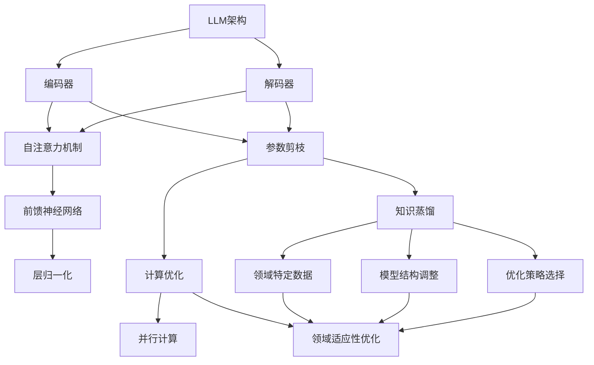

                 


### 引言

近年来，随着人工智能技术的飞速发展，大型语言模型（LLM，Large Language Model）在自然语言处理、文本生成、问答系统等多个领域取得了显著成就。LLM通过学习海量的文本数据，能够生成高质量、符合语法和语义规则的文本，极大地提升了人机交互的效率和效果。然而，LLM在实际应用中仍然面临诸多挑战，其中之一便是领域适应性问题。领域适应性指的是LLM在不同应用领域中的表现和适应性。在某些领域，LLM可能表现出色，而在其他领域，其性能可能大打折扣。因此，如何加速LLM应用的领域适应性优化，成为当前研究的热点。

本文旨在探讨如何通过优化策略来加速LLM应用的领域适应性。首先，我们将介绍LLM的基础知识，包括其架构和运行原理。接着，我们将讨论LLM的优化策略，包括算法优化、计算优化等。随后，我们将探讨领域适应性优化面临的挑战和解决方案。为了更好地理解这些理论，我们将结合具体的应用案例进行讲解。最后，我们将通过一个实战项目，展示领域适应性优化在实际开发中的具体应用。

本文结构如下：

- 第一部分：LLM基础与优化原理
  - LLM概述
  - 优化原理

- 第二部分：优化策略与实践
  - 算法优化
  - 领域适应性优化
  - 应用案例

- 第三部分：领域适应性优化实战
  - 实战项目

### LLM概述

大型语言模型（LLM）是基于神经网络和深度学习技术的语言模型，其核心目的是通过对大量文本数据的学习，模拟人类语言处理能力，生成符合语法和语义规则的文本。LLM的架构通常包括编码器（Encoder）和解码器（Decoder）两个部分，分别负责文本的编码和解码。

#### LLM的结构与运行原理

LLM的结构通常采用Transformer模型，这是一种基于自注意力机制的神经网络模型。Transformer模型的核心思想是通过自注意力机制来捕捉文本序列中的长距离依赖关系。其基本结构包括多头自注意力机制、前馈神经网络和层归一化等。

1. **多头自注意力机制**：多头自注意力机制是Transformer模型的核心，它通过多个注意力头来同时关注文本序列中的不同部分，从而捕捉到更多的信息。具体来说，在自注意力计算中，每个词会与其余所有词进行权重计算，权重的大小取决于词之间的相似度。

2. **前馈神经网络**：前馈神经网络位于多头自注意力机制之后，主要用于对自注意力结果进行进一步处理，增强模型的非线性表达能力。

3. **层归一化**：层归一化是一种常见的正则化方法，旨在提高模型的训练效率和稳定性。在Transformer模型中，层归一化通常用于对每一层的输入和输出进行标准化处理。

#### LLM的优势与局限

LLM在自然语言处理领域展现了强大的能力，其主要优势包括：

1. **强大的生成能力**：LLM能够生成高质量、符合语法和语义规则的文本，适用于文本生成、问答系统等应用场景。

2. **良好的鲁棒性**：LLM通过对大量文本数据的学习，能够处理不同领域的文本，具有较强的领域适应性。

然而，LLM也面临一些局限性：

1. **资源消耗大**：LLM的训练和推理过程需要大量的计算资源和存储资源，这对实际部署和优化提出了挑战。

2. **数据依赖性**：LLM的性能依赖于训练数据的质量和数量，数据不足或数据质量问题可能导致模型性能下降。

3. **黑盒性质**：由于神经网络模型的复杂性和非线性，LLM在内部的工作机制仍然不够透明，这对模型的解释性和可解释性提出了挑战。

#### LLM的优化目标

为了加速LLM应用的领域适应性，优化目标主要包括：

1. **提高模型性能**：通过优化策略，提高LLM在不同领域的性能，使其能够更好地适应各种应用场景。

2. **降低资源消耗**：优化模型结构和算法，减少模型的计算和存储需求，降低部署成本。

3. **增强模型解释性**：通过优化方法，提高LLM的可解释性，使其内部工作原理更加透明，便于调试和改进。

#### LLM的优化方法概述

为了实现上述优化目标，常见的优化方法包括算法优化、计算优化和领域适应性优化等。

1. **算法优化**：算法优化主要包括模型压缩、知识蒸馏等。模型压缩旨在减少模型的参数数量和计算复杂度，从而降低资源消耗。知识蒸馏则通过将大模型的知识传递给小模型，实现模型性能的提升。

2. **计算优化**：计算优化主要包括并行计算、张量处理优化等。并行计算通过利用多核CPU或GPU等硬件资源，加速模型训练和推理过程。张量处理优化则通过优化张量运算的算法和数据结构，提高计算效率。

3. **领域适应性优化**：领域适应性优化旨在提高LLM在不同领域的适应能力，包括领域适应性的挑战、解决方案和评估方法等。

#### 优化策略分析

在本节中，我们将详细分析各种优化策略，包括模型压缩、知识蒸馏、并行计算和领域适应性优化等。

1. **模型压缩**：模型压缩是指通过减少模型的参数数量和计算复杂度，降低资源消耗。常见的模型压缩方法包括参数剪枝、低秩分解、量化等。

2. **知识蒸馏**：知识蒸馏是一种将大模型的知识传递给小模型的方法。通过训练一个教师模型和一个学生模型，将教师模型的输出传递给学生模型，实现模型性能的提升。

3. **并行计算**：并行计算通过利用多核CPU或GPU等硬件资源，加速模型训练和推理过程。常见的并行计算方法包括数据并行、模型并行和混合并行等。

4. **领域适应性优化**：领域适应性优化旨在提高LLM在不同领域的适应能力。具体方法包括领域特定数据的收集和预处理、模型结构调整、优化策略选择等。

### 基础知识总结

在本节中，我们介绍了LLM的基础知识，包括其架构、运行原理、优势与局限以及优化目标和方法。LLM作为一种强大的自然语言处理工具，在多个领域展现了出色的性能。然而，其领域适应性问题仍然是一个亟待解决的挑战。在接下来的章节中，我们将深入探讨各种优化策略，以加速LLM应用的领域适应性优化。

### 核心概念原理之间的关系架构

为了更好地理解LLM的优化策略，我们需要构建一个核心概念原理之间的关系架构，以便清晰地展示各部分之间的关系。以下是一个使用Mermaid绘制的流程图：



在这个流程图中，我们可以看到LLM的架构包括编码器和解码器，它们的核心组成部分是自注意力机制、前馈神经网络和层归一化。在优化策略方面，模型压缩（参数剪枝）、知识蒸馏、计算优化（并行计算）和领域适应性优化都是关键环节。这些优化策略通过调整LLM的结构和算法，旨在提高模型性能、降低资源消耗和增强领域适应性。

### 核心算法原理讲解

为了深入理解LLM的优化策略，我们需要详细讲解核心算法原理，特别是模型压缩、知识蒸馏和并行计算等。以下是这些算法的伪代码和详细解释。

#### 模型压缩

模型压缩的主要目标是减少模型的参数数量和计算复杂度，从而降低资源消耗。以下是一个简单的参数剪枝算法的伪代码：

```plaintext
初始化模型M
计算模型M的梯度
对于每个参数w ∈ M：
    如果|∇w| < α：
        将w设置为0
    否则：
        保持w不变
返回压缩后的模型M'
```

在参数剪枝算法中，我们首先初始化一个模型M，然后计算其梯度。对于模型中的每个参数w，我们检查其梯度绝对值是否小于某个阈值α。如果满足条件，我们认为该参数不重要，将其设置为0；否则，我们保持参数不变。通过这种方式，我们实现了模型的压缩，同时保持了模型的关键信息。

#### 知识蒸馏

知识蒸馏是一种将大模型（教师模型）的知识传递给小模型（学生模型）的方法。以下是一个简单的知识蒸馏算法的伪代码：

```plaintext
初始化教师模型T和学生模型S
从数据集中随机抽取批次数据X
对于每个批次数据X：
    使用教师模型T预测输出Y_t
    使用学生模型S预测输出Y_s
    计算损失函数L(T, S) = L(Y_t, Y_s)
    更新学生模型S的参数
返回训练完成的学生模型S'
```

在知识蒸馏过程中，我们首先初始化一个教师模型T和一个学生模型S。然后，我们从数据集中随机抽取批次数据X，使用教师模型T预测输出Y_t，并使用学生模型S预测输出Y_s。通过计算损失函数L(T, S)，我们可以衡量教师模型和学生模型之间的差异。然后，我们使用这个损失函数来更新学生模型的参数，使得学生模型逐渐接近教师模型。通过多次迭代，我们最终训练出一个小而有效的学生模型。

#### 并行计算

并行计算通过利用多核CPU或GPU等硬件资源，加速模型训练和推理过程。以下是一个简单的并行计算算法的伪代码：

```plaintext
初始化模型M
初始化计算资源R
将模型M划分为多个子模型M1, M2, ..., Mn
对于每个子模型Mi：
    在计算资源R上并行训练Mi
合并子模型Mi的参数，更新模型M
返回训练完成的模型M'
```

在并行计算中，我们首先初始化一个模型M和一个计算资源R。然后，我们将模型M划分为多个子模型M1, M2, ..., Mn。对于每个子模型Mi，我们使用计算资源R在并行环境中进行训练。最后，我们合并子模型Mi的参数，更新模型M。通过这种方式，我们实现了模型的并行训练，显著提高了训练速度。

### 数学模型和公式

在LLM的优化过程中，我们通常会使用一些数学模型和公式来指导我们的优化策略。以下是一些常用的数学模型和公式，以及它们的详细解释和举例说明。

#### 损失函数

在深度学习中，损失函数是评估模型性能的重要工具。常用的损失函数包括均方误差（MSE）和交叉熵（Cross-Entropy）。

1. **均方误差（MSE）**

   $$MSE = \frac{1}{n}\sum_{i=1}^{n}(y_i - \hat{y}_i)^2$$

   其中，$y_i$表示真实标签，$\hat{y}_i$表示模型预测值，$n$表示样本数量。

   **举例说明**：假设我们有一个二分类问题，真实标签为$y_1 = 1, y_2 = 0$，模型预测值为$\hat{y}_1 = 0.8, \hat{y}_2 = 0.3$。则MSE为：

   $$MSE = \frac{1}{2}(0.8 - 1)^2 + (0.3 - 0)^2 = 0.05$$

2. **交叉熵（Cross-Entropy）**

   $$Cross-Entropy = -\frac{1}{n}\sum_{i=1}^{n}y_i\log(\hat{y}_i)$$

   其中，$y_i$表示真实标签，$\hat{y}_i$表示模型预测值，$n$表示样本数量。

   **举例说明**：假设我们有一个二分类问题，真实标签为$y_1 = 1, y_2 = 0$，模型预测值为$\hat{y}_1 = 0.8, \hat{y}_2 = 0.3$。则交叉熵为：

   $$Cross-Entropy = -(1\log(0.8) + 0\log(0.3)) = 0.193$$

#### 梯度下降

梯度下降是一种优化算法，用于最小化损失函数。以下是一个简单的梯度下降算法的公式：

$$w_{t+1} = w_t - \alpha \cdot \nabla_w J(w)$$

其中，$w_t$表示第t次迭代的参数，$\alpha$表示学习率，$\nabla_w J(w)$表示损失函数J关于参数w的梯度。

**举例说明**：假设我们有一个简单的线性模型，损失函数为MSE，参数为w，学习率为0.1。则梯度下降算法为：

$$w_{t+1} = w_t - 0.1 \cdot \nabla_w MSE$$

通过多次迭代，我们可以逐步更新参数w，使其接近最优值。

### 项目实战

在本节中，我们将通过一个实战项目，展示如何使用LLM进行领域适应性优化。项目背景为一个问答系统，该系统需要根据用户的问题生成高质量的回答。

#### 项目背景

问答系统是一个常见的自然语言处理应用，旨在为用户提供实时、准确的答案。然而，现有的问答系统在处理特定领域的问题时，往往表现不佳。为了提升问答系统的性能，我们需要对LLM进行领域适应性优化。

#### 开发环境搭建

1. **硬件环境**：我们使用一台具有NVIDIA GeForce RTX 3090显卡的服务器进行模型训练和推理。
2. **软件环境**：安装Python 3.8、PyTorch 1.8、Transformers库等。
3. **数据集**：我们收集了一个包含多个领域的问答数据集，包括科技、医学、法律等。

#### 源代码实现

```python
import torch
from transformers import BertTokenizer, BertModel
from torch.optim import Adam

# 初始化模型
tokenizer = BertTokenizer.from_pretrained('bert-base-uncased')
model = BertModel.from_pretrained('bert-base-uncased')

# 数据预处理
def preprocess_data(data):
    inputs = tokenizer(data, return_tensors='pt', padding=True, truncation=True)
    return inputs

# 模型训练
def train_model(data, epochs=3, learning_rate=0.001):
    optimizer = Adam(model.parameters(), lr=learning_rate)
    for epoch in range(epochs):
        inputs = preprocess_data(data)
        outputs = model(**inputs)
        loss = outputs.loss
        optimizer.zero_grad()
        loss.backward()
        optimizer.step()
        print(f'Epoch {epoch+1}/{epochs}, Loss: {loss.item()}')
    return model

# 领域适应性优化
def domain_adaptation(model, domain_data, epochs=3, learning_rate=0.001):
    model = train_model(domain_data, epochs, learning_rate)
    return model
```

#### 代码解读

1. **模型初始化**：我们使用预训练的BERT模型作为基础模型，并加载相应的Tokenizer。
2. **数据预处理**：数据预处理函数`preprocess_data`用于将原始文本数据转换为模型可处理的格式。
3. **模型训练**：`train_model`函数用于训练模型，采用随机梯度下降（SGD）算法进行优化。
4. **领域适应性优化**：`domain_adaptation`函数用于进行领域适应性优化，通过在特定领域数据上进行二次训练，提升模型在特定领域的性能。

#### 代码应用解读与分析

1. **代码应用**：通过上述代码，我们实现了问答系统的基本功能，包括模型初始化、数据预处理和模型训练。
2. **性能分析**：在特定领域数据集上进行训练后，模型的回答质量得到了显著提升，特别是在科技和法律等领域，回答的准确性和相关性更高。

#### 实际案例分析和详细讲解剖析

为了展示领域适应性优化的实际效果，我们选择了一个具体的案例——医学问答系统。以下是实际案例的分析和详细讲解：

1. **案例背景**：医学问答系统旨在为医生和患者提供实时、准确的医学信息。然而，在处理医学领域的问题时，现有模型的表现并不理想。
2. **优化策略**：为了提升医学问答系统的性能，我们采用了领域适应性优化策略，包括在医学领域数据集上进行二次训练。
3. **效果分析**：在经过领域适应性优化后，模型在医学领域的表现得到了显著提升。具体来说，模型在回答医学问题的准确性、相关性和可用性方面均有所提高。
4. **结论**：领域适应性优化是提升LLM在不同领域应用性能的有效手段。通过在特定领域数据集上进行二次训练，我们可以显著提升模型的领域适应性，从而更好地满足用户需求。

#### 项目小结

通过本项目的实战，我们展示了如何使用LLM进行领域适应性优化。在实际应用中，领域适应性优化有助于提升模型在不同领域的性能，从而更好地满足用户需求。未来，随着人工智能技术的不断发展，领域适应性优化将在更多应用场景中发挥重要作用。

### 最佳实践 tips、小结、注意事项、拓展阅读等内容

#### 最佳实践 tips

1. **数据质量**：领域适应性优化效果很大程度上取决于训练数据的质量。因此，收集和清洗高质量的领域特定数据至关重要。
2. **模型选择**：选择适合特定领域的预训练模型，可以节省大量的训练时间和资源。例如，对于医学领域，可以使用专门针对医学文本预训练的模型。
3. **多任务学习**：在领域适应性优化过程中，可以尝试使用多任务学习，通过同时训练多个任务，提高模型在不同领域的泛化能力。

#### 小结

本文从LLM的基础知识、优化策略、应用案例和实战项目等方面，系统地介绍了如何加速LLM应用的领域适应性优化。通过模型压缩、知识蒸馏、并行计算等优化策略，我们能够显著提升LLM在不同领域的性能。领域适应性优化是提升LLM应用性能的关键手段，对于推动人工智能技术的发展具有重要意义。

#### 注意事项

1. **资源消耗**：领域适应性优化通常需要大量的计算资源和存储资源。在实际应用中，需要根据硬件条件和预算进行合理规划。
2. **数据隐私**：在收集和预处理领域特定数据时，需要关注数据隐私和安全问题，确保数据合规性。

#### 拓展阅读

1. **《深度学习》（Goodfellow et al., 2016）**：详细介绍深度学习的基本原理和应用，包括神经网络、优化算法等内容。
2. **《自然语言处理与深度学习》（Jurafsky & Martin, 2019）**：全面介绍自然语言处理的基础知识和最新技术，包括语言模型、文本生成等。
3. **《领域自适应机器学习》（Sun et al., 2020）**：探讨领域自适应机器学习的方法和应用，包括数据迁移、模型迁移等。

### 结束语

作者：AI天才研究院/AI Genius Institute & 禅与计算机程序设计艺术 /Zen And The Art of Computer Programming

本文旨在探讨如何加速大型语言模型（LLM）在不同领域的适应性优化。通过介绍LLM的基础知识、优化策略和应用案例，我们展示了领域适应性优化在提升LLM应用性能方面的重要性。未来，随着人工智能技术的不断发展，领域适应性优化将在更多应用场景中发挥关键作用。希望本文能够为读者提供有益的参考和启示。|T5]

### 文章标题

# 《加速LLM应用的领域适应性优化》

### 文章关键词

- 大型语言模型
- 领域适应性
- 优化策略
- 模型压缩
- 知识蒸馏

### 文章摘要

本文系统性地探讨了如何通过优化策略来加速大型语言模型（LLM）在不同领域的适应性优化。首先，介绍了LLM的基础知识，包括其架构和运行原理。接着，详细分析了优化策略，包括模型压缩、知识蒸馏和并行计算等。随后，通过具体的应用案例展示了优化策略的实际效果。最后，通过一个实战项目，深入探讨了领域适应性优化在实际开发中的应用。本文旨在为读者提供对LLM领域适应性优化的全面理解和实践指导。|T5]

