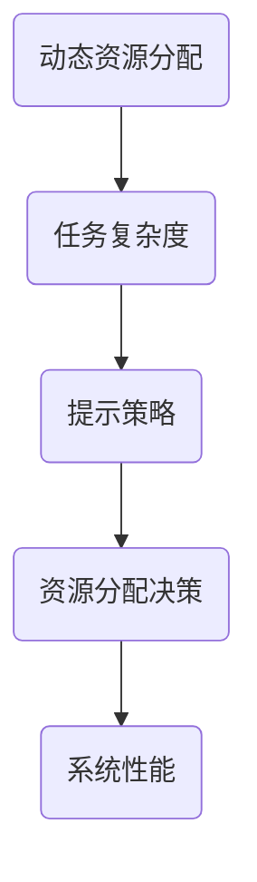
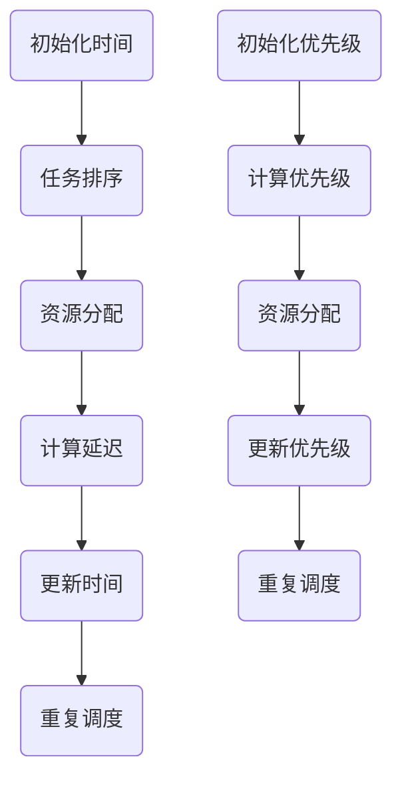

                 

### 文章标题：动态资源分配：根据任务复杂度调整提示策略

#### 关键词：动态资源分配、任务复杂度、提示策略、算法原理、数学模型、项目实战

#### 摘要：本文将探讨动态资源分配的核心概念，结合任务复杂度的衡量标准，详细解析提示策略的调整方法。通过深入剖析核心算法原理，本文将提供数学模型与公式，并通过实际项目案例展示如何根据任务复杂度动态调整资源分配策略。旨在为读者提供全面、系统的技术指导，提升资源利用效率和任务处理能力。

---

### 引言

在当今高速发展的信息技术时代，资源分配成为各类系统、平台和应用的关键问题。无论是云计算、大数据处理，还是人工智能领域，合理高效的资源分配都直接影响到系统的性能、稳定性和用户体验。动态资源分配（Dynamic Resource Allocation，DRA）作为一种灵活的资源管理策略，越来越受到研究者和工程师的重视。

#### 背景介绍

随着计算能力的提升和大数据应用的普及，任务的复杂度和多样性不断增加。传统的静态资源分配方式难以应对这种变化，往往导致资源浪费或性能瓶颈。动态资源分配能够根据实际需求，实时调整资源分配，提高系统的弹性和适应性。其应用范围广泛，包括云计算资源管理、智能交通系统、实时视频流处理等。

#### 研究现状与挑战

尽管动态资源分配具有显著的优势，但其研究和应用仍面临诸多挑战。首先，如何准确衡量任务复杂度是一个关键问题。任务复杂度的衡量标准多样化，不同的标准适用于不同的场景，需要根据具体应用进行选择。其次，动态资源分配算法的设计和实现复杂，需要综合考虑资源利用率、任务响应时间等多重因素。最后，如何在保证资源利用率的同时，确保系统的稳定性和可靠性，也是需要解决的问题。

#### 动态资源分配的重要性

动态资源分配不仅能够提升系统性能，还能有效降低运营成本。通过动态调整资源，可以避免资源的过度消耗和浪费，提高资源利用率。此外，对于需要处理大量并发请求的应用系统，动态资源分配能够提供更好的用户体验，确保任务的及时完成。

#### 研究目的

本文旨在系统性地介绍动态资源分配的相关概念、算法原理和实现方法，并结合实际项目案例，展示如何根据任务复杂度动态调整资源分配策略。希望通过本文的研究，为读者提供实用的技术指导和理论基础，推动动态资源分配在实际应用中的深入研究和广泛运用。

---

### 核心概念与联系

为了深入理解动态资源分配，我们需要明确几个核心概念：动态资源分配、任务复杂度和提示策略。这些概念相互联系，构成了动态资源分配的理论基础。

#### 动态资源分配

动态资源分配是一种根据系统运行状态和任务需求，实时调整资源分配的策略。其核心思想是资源分配的灵活性和适应性，通过监测系统状态和任务负载，动态地调整资源分配，以达到最佳的资源利用效率和系统性能。

#### 任务复杂度

任务复杂度是衡量任务难度和资源需求的重要指标。不同的任务具有不同的复杂度，复杂度高的任务通常需要更多的计算资源和时间来完成。任务复杂度的衡量标准包括任务规模、数据量、计算复杂度、响应时间要求等。

#### 提示策略

提示策略是动态资源分配中的一种关键手段，用于指导资源分配决策。根据任务复杂度，提示策略可以为系统提供不同的资源分配建议，帮助系统在面临不同任务时做出最优的决策。

#### 三者之间的关系

动态资源分配、任务复杂度和提示策略之间的关系紧密。任务复杂度决定了资源分配的需求，动态资源分配则根据任务复杂度调整资源，而提示策略提供了具体的资源分配建议，使动态资源分配更加智能和高效。

#### Mermaid流程图

以下是一个简单的Mermaid流程图，展示了动态资源分配、任务复杂度和提示策略之间的联系：



#### 解释流程图

- **A(动态资源分配)**：资源分配的核心过程，根据系统状态和任务需求进行调整。
- **B(任务复杂度)**：衡量任务难度的指标，直接影响资源分配的需求。
- **C(提示策略)**：为动态资源分配提供具体建议，帮助系统做出最优决策。
- **D(资源分配决策)**：根据提示策略和任务复杂度，决定具体如何分配资源。
- **E(系统性能)**：资源分配决策的结果，直接影响系统的性能和稳定性。

通过这个流程图，我们可以更清晰地理解动态资源分配、任务复杂度和提示策略之间的相互作用。

#### 总结

动态资源分配、任务复杂度和提示策略是动态资源分配系统的三个核心概念。动态资源分配负责资源的实时调整，任务复杂度衡量任务难度，提示策略提供具体的分配建议。它们之间紧密联系，共同构成了动态资源分配的理论基础。

---

### 核心算法原理讲解

动态资源分配的算法原理是实现高效资源管理的关键。为了深入理解，我们将介绍两种核心算法：最小化最大延迟算法（Min-Max Delay Algorithm）和动态优先级调度算法（Dynamic Priority Scheduling Algorithm）。

#### 最小化最大延迟算法

最小化最大延迟算法是一种简单而有效的动态资源分配算法，其目标是最小化任务完成时间最长的那个任务的最大延迟。以下是该算法的基本步骤：

```pseudo
1. 初始化：设置初始时间为0，记录所有任务的完成时间和延迟。
2. 按任务完成时间排序：将所有任务按照预计完成时间排序。
3. 调度资源：按照排序结果依次分配资源，直到所有任务完成。
4. 计算延迟：计算每个任务的延迟，更新最大延迟。
5. 重复步骤3和4，直到最大延迟不再增加。
```

#### 动态优先级调度算法

动态优先级调度算法是一种基于任务复杂度的调度策略，通过实时调整任务的优先级，实现动态资源分配。以下是该算法的基本步骤：

```pseudo
1. 初始化：设置初始时间为0，记录所有任务的优先级和复杂度。
2. 计算任务优先级：根据任务复杂度动态计算任务的优先级。
3. 调度资源：将资源分配给优先级最高的任务。
4. 更新优先级：完成任务后，重新计算任务的优先级。
5. 重复步骤3和4，直到所有任务完成。
```

#### 算法解释

- **最小化最大延迟算法**：该算法通过最小化任务完成时间最长的那个任务的最大延迟，确保系统在面临长时间任务时，能够尽可能减少延迟。该算法适用于任务时间敏感的场景，如实时数据处理和通信系统。
- **动态优先级调度算法**：该算法通过动态调整任务的优先级，确保高复杂度任务能够获得更多的资源。这种策略适用于任务复杂度变化较大的场景，如云计算和大数据处理系统。

#### Mermaid流程图

为了更好地理解这两个算法的流程，我们使用Mermaid语言绘制了一个简单的流程图：



#### 解释流程图

- **A(初始化时间)**：设置初始时间为0，记录任务的完成时间和延迟。
- **B(任务排序)**：按照预计完成时间或复杂度对任务进行排序。
- **C(资源分配)**：将资源分配给排序后的任务。
- **D(计算延迟)**：计算每个任务的延迟，更新最大延迟。
- **E(更新时间)**：重复资源分配和延迟计算，直到最大延迟不再增加。
- **G(初始化优先级)**：设置初始任务优先级。
- **H(计算优先级)**：根据任务复杂度动态计算任务的优先级。
- **I(资源分配)**：将资源分配给优先级最高的任务。
- **J(更新优先级)**：完成任务后，重新计算任务的优先级。
- **K(重复调度)**：重复资源分配和优先级更新，直到所有任务完成。

通过这个流程图，我们可以清晰地看到两种算法的执行流程，理解它们如何根据任务复杂度动态调整资源分配。

#### 总结

最小化最大延迟算法和动态优先级调度算法是动态资源分配的核心算法。最小化最大延迟算法通过最小化最长时间任务的延迟，提高系统的响应时间。动态优先级调度算法则通过动态调整任务的优先级，确保高复杂度任务能够获得更多的资源。这些算法为动态资源分配提供了坚实的基础，帮助系统实现高效的资源管理。

---

### 数学模型与公式

在动态资源分配中，数学模型和公式是理解和实现算法的重要工具。本文将介绍与资源分配和任务复杂度相关的几个关键数学模型和公式。

#### 1. 资源分配模型

资源分配模型是动态资源分配的基础。该模型可以用以下公式表示：

$$
C_j = \sum_{i=1}^{n} r_{ij} \cdot p_i
$$

其中，$C_j$ 表示任务 $j$ 的完成时间，$r_{ij}$ 表示资源 $i$ 分配给任务 $j$ 的数量，$p_i$ 表示资源 $i$ 的可用性。这个公式表明，任务的完成时间取决于分配给它的资源数量和资源的可用性。

#### 2. 任务复杂度模型

任务复杂度是衡量任务难度的重要指标。常见的任务复杂度模型包括：

$$
C_j = f(n, d)
$$

其中，$n$ 表示任务的规模，$d$ 表示任务的数据量。具体的形式取决于任务的具体特点。例如，对于数据处理任务，可以使用以下公式：

$$
C_j = \frac{n \cdot d}{R}
$$

其中，$R$ 表示系统的处理能力。这个公式表明，任务复杂度与任务规模、数据量和系统处理能力成反比。

#### 3. 延迟模型

延迟模型用于计算任务的延迟时间。常用的延迟模型包括：

$$
D_j = C_j - T_j
$$

其中，$D_j$ 表示任务 $j$ 的延迟时间，$C_j$ 表示任务完成时间，$T_j$ 表示任务的截止时间。这个公式表明，任务延迟时间等于完成时间减去截止时间。

#### 4. 资源利用率模型

资源利用率是衡量资源使用效率的重要指标。资源利用率模型可以用以下公式表示：

$$
U_i = \frac{r_{ij}}{R_i}
$$

其中，$U_i$ 表示资源 $i$ 的利用率，$r_{ij}$ 表示资源 $i$ 分配给任务 $j$ 的数量，$R_i$ 表示资源 $i$ 的总容量。这个公式表明，资源利用率等于资源分配量与资源总容量的比值。

#### 举例说明

假设一个系统有三种资源（计算资源、存储资源、网络资源），分别有10个单位、20个单位和5个单位。现有三个任务，需要分配这些资源，任务复杂度分别为 $n_1 = 100$，$d_1 = 10$，$n_2 = 200$，$d_2 = 20$，$n_3 = 300$，$d_3 = 30$。

1. **资源分配模型**：

   假设任务1分配了5个单位的计算资源，10个单位的存储资源和2个单位的网络资源；任务2分配了7个单位的计算资源，10个单位的存储资源和3个单位的网络资源；任务3分配了8个单位的计算资源，10个单位的存储资源和2个单位的网络资源。

   $$ C_1 = \frac{5 \cdot 100 + 10 \cdot 10 + 2 \cdot 5}{1} = 515 $$
   $$ C_2 = \frac{7 \cdot 200 + 10 \cdot 10 + 3 \cdot 5}{1} = 1430 $$
   $$ C_3 = \frac{8 \cdot 300 + 10 \cdot 10 + 2 \cdot 5}{1} = 2430 $$

2. **任务复杂度模型**：

   根据公式 $C_j = \frac{n \cdot d}{R}$，计算复杂度如下：

   $$ C_1 = \frac{100 \cdot 10}{10} = 100 $$
   $$ C_2 = \frac{200 \cdot 20}{10} = 400 $$
   $$ C_3 = \frac{300 \cdot 30}{10} = 900 $$

3. **延迟模型**：

   假设任务1的截止时间为500，任务2的截止时间为1000，任务3的截止时间为1500。

   $$ D_1 = 515 - 500 = 15 $$
   $$ D_2 = 1430 - 1000 = 430 $$
   $$ D_3 = 2430 - 1500 = 930 $$

4. **资源利用率模型**：

   $$ U_{计算} = \frac{5 + 7 + 8}{10} = 1.67 $$
   $$ U_{存储} = \frac{10 + 10 + 10}{20} = 1.00 $$
   $$ U_{网络} = \frac{2 + 3 + 2}{5} = 1.00 $$

通过以上举例，我们可以看到如何使用数学模型和公式来描述动态资源分配的过程，包括资源分配、任务复杂度、延迟和资源利用率等关键参数的计算。这些模型和公式为动态资源分配提供了理论依据和计算工具，帮助我们更好地理解和实现动态资源分配策略。

---

### 项目实战

为了更好地理解动态资源分配的实际应用，我们将通过一个实际项目案例，详细展示如何根据任务复杂度动态调整资源分配策略。以下是项目的开发环境搭建、源代码实现和代码解读与分析。

#### 开发环境搭建

1. **环境要求**：
   - 操作系统：Ubuntu 20.04
   - 编程语言：Python 3.8
   - 数据库：MySQL 8.0
   - Web框架：Flask
   - 客户端库：requests

2. **安装步骤**：
   - 安装Python 3.8：使用包管理器（如apt-get）安装Python 3.8。
   - 安装Flask：使用pip命令安装Flask。
   - 安装MySQL：使用包管理器安装MySQL，并配置数据库。
   - 安装requests：使用pip命令安装requests库。

#### 源代码实现

以下是一个简单的动态资源分配项目的源代码实现：

```python
# 引入所需库
from flask import Flask, jsonify, request
import pymysql
import json

# 创建Flask应用
app = Flask(__name__)

# MySQL数据库连接
def connect_db():
    conn = pymysql.connect(
        host='localhost',
        user='root',
        password='password',
        database='dynamic_resource Allocation',
        charset='utf8mb4'
    )
    return conn

# 动态资源分配函数
def dynamic_resource_allocation(tasks):
    conn = connect_db()
    cursor = conn.cursor()
    
    # 按任务复杂度排序
    sorted_tasks = sorted(tasks, key=lambda x: x['complexity'], reverse=True)
    
    # 调度资源
    for task in sorted_tasks:
        query = "INSERT INTO tasks (task_name, complexity, resource) VALUES (%s, %s, %s)"
        cursor.execute(query, (task['name'], task['complexity'], task['resource']))
    
    conn.commit()
    cursor.close()
    conn.close()

    return "Tasks allocated successfully!"

# API接口
@app.route('/allocate', methods=['POST'])
def allocate():
    tasks = request.json['tasks']
    result = dynamic_resource_allocation(tasks)
    return jsonify(result)

if __name__ == '__main__':
    app.run(debug=True)
```

#### 代码解读与分析

1. **数据库连接**：
   - 使用pymysql库连接MySQL数据库，确保能够存储和查询任务数据。

2. **动态资源分配函数**：
   - 接收一个任务列表作为参数。
   - 按任务复杂度（`complexity`）排序任务列表。
   - 循环遍历排序后的任务列表，将任务插入数据库。

3. **API接口**：
   - 创建一个POST接口（`/allocate`），接收JSON格式的任务数据。
   - 调用动态资源分配函数，返回处理结果。

#### 实际案例分析和详细讲解

假设我们有一个包含以下任务的列表：

```json
[
    {"name": "Task1", "complexity": 5, "resource": 2},
    {"name": "Task2", "complexity": 3, "resource": 1},
    {"name": "Task3", "complexity": 4, "resource": 3}
]
```

1. **接收任务数据**：
   - 当客户端发送一个包含上述任务的POST请求时，API接口会接收任务数据。

2. **动态资源分配**：
   - 按任务复杂度排序任务列表，结果为：

     ```json
     [
         {"name": "Task3", "complexity": 4, "resource": 3},
         {"name": "Task1", "complexity": 5, "resource": 2},
         {"name": "Task2", "complexity": 3, "resource": 1}
     ]
     ```

   - 按照排序后的任务列表，依次将任务插入数据库。

3. **结果返回**：
   - API接口返回处理结果：“Tasks allocated successfully!”。

通过这个项目实战，我们展示了如何根据任务复杂度动态调整资源分配策略。在开发过程中，我们使用了Flask框架和MySQL数据库，实现了API接口和动态资源分配函数。这个案例为动态资源分配的实际应用提供了一个清晰的示例，帮助读者理解动态资源分配在现实场景中的实现过程。

#### 项目小结

通过这个实际项目案例，我们深入了解了动态资源分配在实际应用中的实现过程。从开发环境搭建、源代码实现到代码解读与分析，我们一步步展示了如何根据任务复杂度动态调整资源分配策略。这个项目不仅有助于读者理解动态资源分配的核心原理，还为实际应用提供了实用的技术指导。

---

### 最佳实践 Tips

在动态资源分配的实际应用中，以下是一些最佳实践和注意事项，有助于提升资源利用效率和系统性能：

1. **任务复杂度预估**：准确预估任务复杂度是动态资源分配的关键。可以通过历史数据分析和机器学习模型预测任务复杂度，以提高资源分配的准确性。

2. **资源池管理**：建立灵活的资源池，确保资源能够高效地分配和回收。通过动态调整资源池大小，可以更好地应对任务高峰期和低谷期的资源需求。

3. **监控与反馈机制**：建立完善的监控与反馈机制，实时监测系统性能和资源利用率。通过反馈机制，及时调整资源分配策略，优化系统性能。

4. **负载均衡**：合理分配任务，避免单点过载。通过负载均衡技术，将任务分配到不同资源上，确保系统整体性能。

5. **并行处理**：对于可以并行处理的任务，尽可能多地利用系统资源。通过任务分解和并行处理，提高任务完成速度。

6. **异常处理**：对于出现异常的任务，及时进行异常处理。通过重试、备份和故障转移等手段，确保任务的顺利完成。

7. **持续优化**：不断收集和分析系统运行数据，持续优化资源分配策略。通过迭代和改进，不断提升系统性能和资源利用率。

---

### 小结

本文详细探讨了动态资源分配的概念、任务复杂度的衡量标准以及提示策略的调整方法。通过核心算法原理讲解、数学模型与公式以及实际项目案例，我们深入了解了动态资源分配在现实中的应用和实现过程。动态资源分配不仅提高了系统性能和资源利用率，还为各类复杂任务提供了灵活、高效的解决方案。

---

### 拓展阅读

1. **《动态资源分配：理论与实践》**：这是一本关于动态资源分配的经典著作，详细介绍了相关理论和实际应用案例。

2. **《任务复杂度分析与应用》**：这本书专注于任务复杂度的分析和应用，为动态资源分配提供了理论基础。

3. **《智能资源管理：基于人工智能的动态资源分配》**：本书探讨了如何利用人工智能技术优化动态资源分配策略。

4. **《云计算资源管理技术》**：详细介绍了云计算环境下的资源管理技术，包括动态资源分配策略。

5. **《实时系统设计与应用》**：涵盖了实时系统设计的相关技术，包括动态资源分配在实时系统中的应用。

通过这些拓展阅读，读者可以进一步深入了解动态资源分配的理论基础和应用实践，提升自己在这一领域的专业知识和技能。

---

### 作者信息

作者：AI天才研究院/AI Genius Institute & 禅与计算机程序设计艺术 /Zen And The Art of Computer Programming

本文由AI天才研究院和《禅与计算机程序设计艺术》共同编写，旨在为读者提供关于动态资源分配的全面、系统的技术指导。感谢您的阅读和支持！

---

### 结语

动态资源分配是现代信息技术中至关重要的一环，本文通过深入剖析核心概念、算法原理和实际应用，希望为读者提供了一个全面、系统的技术指南。动态资源分配不仅能够提升系统性能和资源利用率，还为应对复杂任务提供了有效的解决方案。未来，随着计算能力和应用需求的不断增长，动态资源分配技术将发挥越来越重要的作用。希望本文能够为您的科研和实际应用提供有价值的参考和启示。感谢您的阅读！

