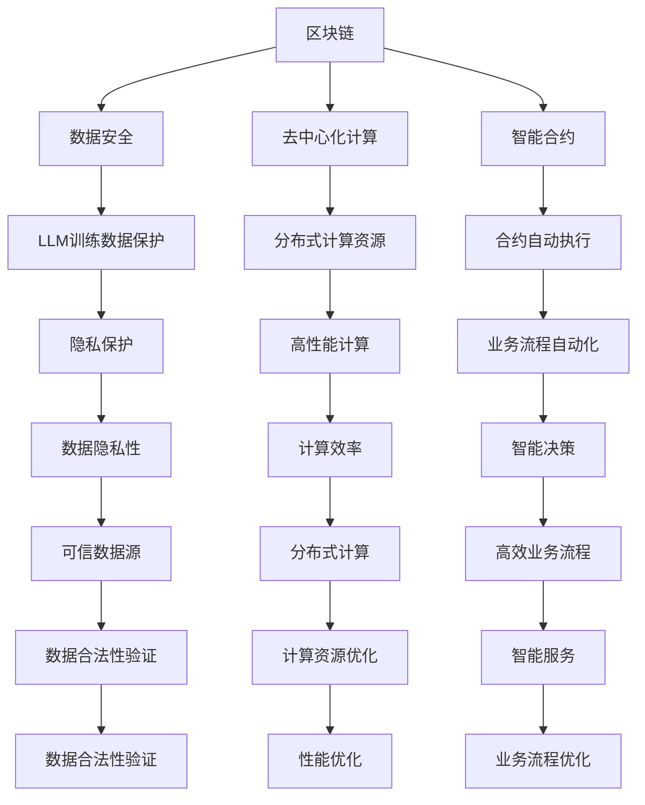
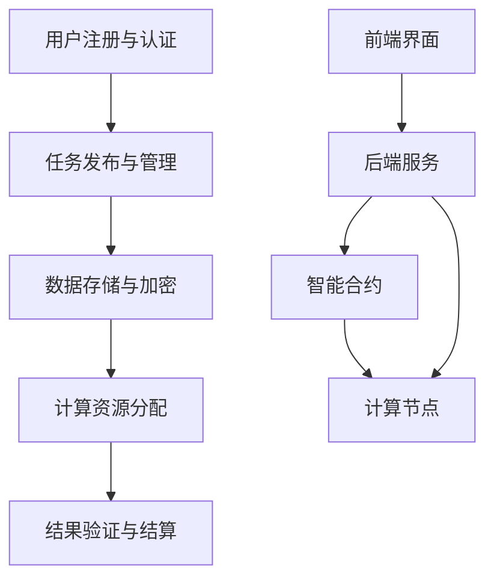
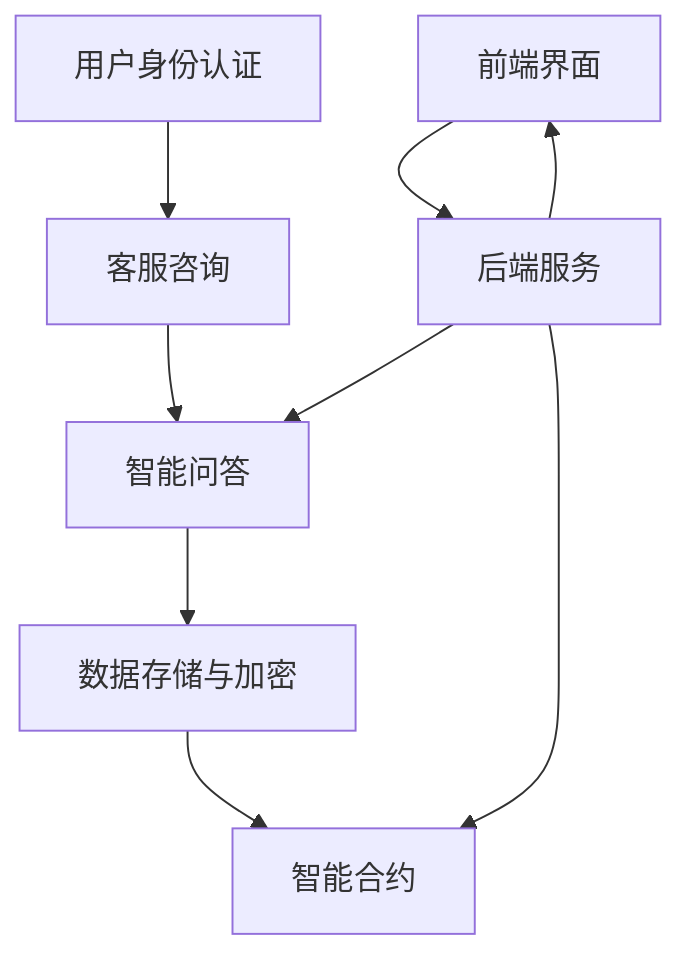
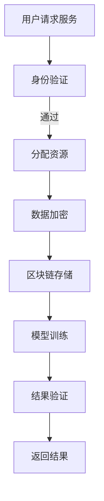

                 

### 设计《区块链技术在LLM应用中的创新应用》的目录大纲

为了撰写一篇关于《区块链技术在LLM应用中的创新应用》的技术博客文章，我们首先需要设计一个完整的目录大纲，以确保文章的逻辑性和完整性。以下是具体的步骤和分析：

#### 第一步：确定文章核心结构

首先，我们需要确定文章的核心结构。根据题目要求，文章可以分为以下几个主要部分：

1. **基础概念与原理**：介绍区块链和LLM的基本概念，包括两者的定义、历史、核心技术等。
2. **区块链技术在LLM中的应用**：讨论区块链在LLM中的具体应用场景，如数据安全、去中心化计算、智能合约等。
3. **创新应用**：深入探讨区块链与LLM结合的创新能力，包括自然语言生成、知识图谱构建等。
4. **案例研究**：通过实际案例展示区块链技术在LLM应用中的实践。
5. **未来发展**：分析区块链技术在LLM应用中的挑战与趋势。

#### 第二步：细化每个部分的内容

在确定了文章的核心结构后，我们需要进一步细化每个部分的内容，确保每个章节都有具体且丰富的内容。

##### 第1部分：基础概念与原理

**第1章：区块链与大型语言模型基础**

- **1.1 区块链的基本概念**
  - 区块链的定义与历史
  - 区块链的关键技术（哈希函数、链式结构、共识机制）

- **1.2 大型语言模型（LLM）基础**
  - LLM的定义
  - LLM的主要架构（GPT、BERT、T5）

##### 第2部分：区块链技术在LLM中的应用

**第2章：区块链与LLM的结合点**

- **2.1 区块链在LLM训练数据安全中的应用**
  - 数据隐私保护
  - 数据确权

- **2.2 区块链在LLM推理服务中的应用**
  - 去中心化计算
  - 智能合约与LLM服务

##### 第3部分：区块链技术在LLM中的创新应用

**第3章：区块链技术在LLM中的创新应用**

- **3.1 区块链在自然语言生成中的应用**
  - NLP与区块链结合的挑战
  - 基于区块链的NLP应用实例（自动合约生成、法律文档自动审查）

- **3.2 区块链在知识图谱构建中的应用**
  - 知识图谱与区块链的结合
  - 基于区块链的知识图谱应用实例（智能合约的自动解析、法律文件的智能审核）

##### 第4部分：案例研究

**第4章：区块链技术在LLM应用中的实际案例**

- **4.1 案例一：去中心化语言模型平台**
  - 平台概述
  - 平台的技术实现

- **4.2 案例二：基于区块链的智能客服系统**
  - 系统概述
  - 系统的技术实现

##### 第5部分：未来发展

**第5章：区块链技术在LLM应用中的挑战与展望**

- **5.1 技术挑战**
  - 性能优化
  - 安全性问题

- **5.2 发展趋势**
  - 区块链与AI融合的发展方向
  - 未来应用场景的预测

##### 第6章：总结与展望

- **6.1 书籍总结**
  - 主要内容回顾
  - 学习收获

- **6.2 未来展望**
  - 发展前景
  - 学习建议

#### 第三步：确保逻辑性和完整性

在细化每个章节内容的同时，我们需要确保整个文章的逻辑性和完整性。例如，在介绍区块链与LLM的结合点时，我们需要先介绍区块链的基本概念，然后再介绍LLM的基本概念，最后讨论它们之间的结合点。

#### 第四步：总结和展望

在文章的结尾，我们需要对整个内容进行总结，并给出对未来发展的展望，以帮助读者更好地理解和应用这些知识。

通过以上步骤，我们可以确保文章的目录大纲既完整又逻辑清晰，为撰写高质量的技术博客文章奠定了基础。

---

### 第一部分：基础概念与原理

#### 第1章：区块链与大型语言模型基础

##### 1.1 区块链的基本概念

区块链是一种分布式账本技术，其核心理念是通过去中心化的方式维护一个不可篡改的数据记录系统。区块链最初由中本聪（Satoshi Nakamoto）在2008年提出，并在2009年发布了比特币（Bitcoin）的首个版本。区块链的发展历程可以大致分为三个阶段：

1. **早期阶段**：以比特币为代表，区块链主要应用于数字货币领域。
2. **应用阶段**：区块链开始在其他领域得到探索和应用，如供应链管理、金融服务等。
3. **成熟阶段**：随着技术的不断演进，区块链逐渐成为企业级应用的基石。

区块链的关键技术包括哈希函数、链式结构、共识机制等。

- **哈希函数**：哈希函数是一种将任意长度的数据转换成固定长度数据的函数。在区块链中，哈希函数用于确保数据的一致性和完整性。例如，SHA-256是一种常用的哈希函数。
- **链式结构**：区块链通过将数据块按时间顺序链接成一个链式结构来存储数据。每个数据块包含一定数量的交易记录，以及一个指向前一个数据块的哈希值。
- **共识机制**：共识机制是区块链系统中确保所有节点对同一数据状态达成一致的方法。常见的共识机制包括工作量证明（Proof of Work, PoW）、权益证明（Proof of Stake, PoS）等。

##### 1.2 大型语言模型（LLM）基础

大型语言模型（LLM）是一种基于深度学习的自然语言处理（NLP）模型，能够理解和生成人类语言。LLM的核心目的是通过大量训练数据学习语言的规律，从而实现文本生成、文本分类、机器翻译等功能。LLM的发展历程可以分为以下几个阶段：

1. **早期阶段**：以基础的语言模型如n-gram模型和决策树模型为代表。
2. **现代阶段**：随着深度学习的兴起，循环神经网络（RNN）和长短期记忆网络（LSTM）等模型开始在NLP领域得到广泛应用。
3. **成熟阶段**：近年来，基于Transformer架构的模型如GPT、BERT等取得了突破性进展，大大提升了NLP的性能。

LLM的主要架构包括GPT、BERT、T5等。

- **GPT（Generative Pre-trained Transformer）**：GPT模型是一种基于Transformer架构的预训练模型，其核心思想是通过对大量文本数据进行预训练，使其能够生成符合语法和语义规则的文本。
- **BERT（Bidirectional Encoder Representations from Transformers）**：BERT模型是一种双向Transformer模型，通过对文本进行双向编码，使其能够捕捉到文本中的上下文信息。
- **T5（Text-to-Text Transfer Transformer）**：T5模型是一种基于Transformer架构的通用文本生成模型，其目标是将任意输入文本转换为任意输出文本。

#### 核心概念与联系

区块链与LLM的结合点主要体现在数据安全、去中心化计算、智能合约等方面。为了更好地理解这两者之间的关系，我们可以通过以下Mermaid流程图来展示：



#### 核心算法原理讲解

为了详细阐述区块链与LLM结合的核心算法原理，我们使用伪代码来描述：

```python
# 区块链中的数据验证与加密算法
def blockchain_data_validation(data):
    """
    对数据块进行验证和加密
    """
    hashed_data = hash_function(data)
    if hashed_data == previous_hash:
        return True
    else:
        return False

# LLM中的文本生成算法
def text_generation(input_text):
    """
    基于输入文本生成新的文本
    """
    generated_text = transformer_model.generate(input_text)
    return generated_text

# 结合区块链与LLM的智能合约执行
def smart_contract_execution(contract):
    """
    执行基于区块链的智能合约
    """
    if blockchain_data_validation(contract['data']):
        contract['status'] = 'completed'
    else:
        contract['status'] = 'rejected'
```

#### 数学模型和公式

在区块链与LLM的结合中，我们还可以引入一些数学模型和公式来描述其工作原理。例如，在区块链的共识机制中，我们可以使用权益证明（Proof of Stake, PoS）的数学模型：

$$
\text{Probability of Block Creation} = \frac{\text{Node's Stake}}{\sum_{\text{all nodes}} \text{Node's Stake}}
$$

其中，节点的创建区块的概率与其持有的代币数量成正比。

在LLM的文本生成中，我们可以使用Transformer模型的注意力机制（Attention Mechanism）：

$$
\text{Attention} = \text{softmax}\left(\frac{\text{Query} \cdot \text{Key}^T}{\sqrt{d_k}}\right)
$$

其中，Query、Key和Value分别是查询向量、键向量和值向量，$d_k$是键向量的维度。

#### 详细讲解和举例说明

为了更好地理解区块链与LLM的结合，我们可以通过以下实例进行详细讲解：

**实例：去中心化语言模型平台**

1. **数据隐私保护**：平台使用区块链技术确保用户数据的隐私性。用户上传的训练数据会被加密存储在区块链上，只有拥有权限的用户才能访问和解密数据。

2. **分布式计算资源**：平台通过去中心化的方式整合全球的计算机资源，用户可以根据自己的需求租用这些资源进行语言模型的训练。这种分布式计算模式提高了计算效率，降低了成本。

3. **智能合约执行**：平台使用智能合约来确保交易的安全和透明。当用户提交训练任务时，智能合约会自动执行，确保训练任务的正确执行和结果的可信性。

通过以上实例，我们可以看到区块链技术在LLM应用中的实际作用，包括数据隐私保护、分布式计算资源和智能合约执行等方面。

---

以上是第一部分的内容，我们介绍了区块链和大型语言模型的基本概念，以及它们之间的核心联系。接下来，我们将深入探讨区块链技术在LLM中的具体应用，包括数据安全、去中心化计算和智能合约等方面。敬请期待。

### 第二部分：区块链技术在LLM中的应用

区块链技术以其去中心化、安全性和透明性等特性，在许多领域展现出了巨大的潜力。在大型语言模型（LLM）领域，区块链技术同样有着广泛的应用前景。本部分将重点探讨区块链技术在LLM训练数据安全、去中心化计算和智能合约等方面的应用，并展示其在实际场景中的具体实现。

#### 第2章：区块链与LLM的结合点

区块链与LLM的结合点主要体现在以下几个方面：

1. **数据隐私保护**：区块链技术能够提供一种分布式、去中心化的存储方式，确保数据的隐私性和安全性。在LLM的训练过程中，保护训练数据的隐私是非常重要的，因为训练数据可能包含敏感信息。区块链可以通过加密和分布式存储技术，确保数据的隐私性。

2. **去中心化计算**：区块链可以提供一种去中心化的计算资源分配方式，使得LLM的训练和推理任务可以分散在全球的计算机上进行。这不仅可以提高计算效率，还可以降低成本。

3. **智能合约**：区块链中的智能合约可以自动执行合同条款，确保交易的透明性和安全性。在LLM的应用中，智能合约可以用于自动化管理训练任务、付费和结果验证等流程。

#### 2.1 区块链在LLM训练数据安全中的应用

在LLM训练过程中，数据安全是一个至关重要的议题。传统的集中式数据存储方式容易受到黑客攻击和数据泄露的风险。区块链技术可以通过以下方式提升LLM训练数据的安全性：

1. **数据加密**：区块链中的数据在传输和存储过程中都会进行加密处理。加密算法如AES（Advanced Encryption Standard）和RSA（Rivest-Shamir-Adleman）可以确保数据在传输过程中的安全性。

2. **分布式存储**：区块链将数据分散存储在多个节点上，每个节点只存储数据的一部分。这种分布式存储方式可以防止单点故障和数据丢失的风险。

3. **智能合约**：智能合约可以用于自动化管理数据访问权限。只有授权的用户才能访问特定的数据，从而确保数据的隐私性。

#### 数据隐私保护机制

以下是一个简单的区块链数据隐私保护机制的伪代码示例：

```python
# 定义加密算法
def encrypt_data(data, key):
    encrypted_data = AES.encrypt(data, key)
    return encrypted_data

# 定义数据访问权限管理
def grant_access(encrypted_data, user):
    if is_authorized(user):
        return decrypt_data(encrypted_data)
    else:
        return "Access denied"

# 定义区块链数据存储
def store_data_on_blockchain(data):
    encrypted_data = encrypt_data(data, key)
    blockchain.add_block(encrypted_data)

# 用户请求访问数据
def request_data_access(user, encrypted_data):
    decrypted_data = grant_access(encrypted_data, user)
    if decrypted_data:
        return decrypted_data
    else:
        return "Data not found"
```

#### 2.2 数据确权

在LLM训练数据中，数据确权是一个重要的问题。数据确权确保了数据所有者的合法权益，防止数据被盗用。区块链技术可以通过以下方式实现数据确权：

1. **数字身份验证**：区块链可以提供一种去中心化的身份验证机制，确保数据所有者的身份真实有效。

2. **智能合约**：智能合约可以用于自动化管理数据的授权和转让，确保数据交易过程的合法性和透明性。

以下是一个简单的区块链数据确权机制的伪代码示例：

```python
# 定义数字身份验证
def verify_identity(data_owner):
    if blockchain.verify_identity(data_owner):
        return True
    else:
        return False

# 定义数据授权
def authorize_data_use(data_owner, user):
    if verify_identity(data_owner):
        contract = create_smart_contract(data_owner, user, data)
        blockchain.execute_contract(contract)
        return "Data use authorized"
    else:
        return "Invalid data owner"

# 定义数据转让
def transfer_data_ownership(data_owner, new_owner):
    if verify_identity(data_owner):
        contract = create_smart_contract(data_owner, new_owner, data)
        blockchain.execute_contract(contract)
        return "Data ownership transferred"
    else:
        return "Invalid data owner"
```

#### 2.2.1 去中心化计算

去中心化计算是区块链技术的重要应用之一。在LLM训练中，去中心化计算可以提供大量的计算资源，从而提高训练效率和降低成本。区块链可以用于以下几个方面来实现去中心化计算：

1. **计算资源分配**：区块链可以用于分配计算任务和资源。通过智能合约，系统可以自动分配计算资源，确保资源的高效利用。

2. **费用结算**：区块链可以用于记录和结算计算任务的费用。用户可以通过区块链支付计算费用，确保交易的透明性和安全性。

以下是一个简单的区块链去中心化计算机制的伪代码示例：

```python
# 定义计算资源请求
def request_computing_resources(task, user):
    contract = create_smart_contract(user, task, cost)
    blockchain.execute_contract(contract)
    return "Computing resources allocated"

# 定义计算任务执行
def execute_computing_task(task, resource):
    result = perform_computing_task(task)
    blockchain.record_result(result)
    return result

# 定义费用结算
def settle_payment(user, cost):
    contract = create_smart_contract(user, cost, payment)
    blockchain.execute_contract(contract)
    return "Payment settled"
```

#### 2.2.2 智能合约与LLM服务

智能合约是区块链技术中的关键组件，它可以在无需第三方中介的情况下自动执行合同条款。在LLM服务中，智能合约可以用于以下几个方面：

1. **训练任务管理**：智能合约可以用于管理LLM的训练任务，包括任务分配、进度跟踪和结果验证等。

2. **付费与结算**：智能合约可以用于自动处理付费和结算流程，确保交易的透明性和安全性。

以下是一个简单的区块链智能合约与LLM服务结合的伪代码示例：

```python
# 定义智能合约创建
def create_smart_contract(user, task, cost):
    contract = {
        "user": user,
        "task": task,
        "cost": cost,
        "status": "pending"
    }
    blockchain.add_contract(contract)
    return contract

# 定义训练任务执行
def execute_training_task(contract, model, data):
    if contract["status"] == "pending":
        result = train_model(model, data)
        contract["status"] = "completed"
        blockchain.record_result(result)
        return result
    else:
        return "Invalid contract status"

# 定义结果验证
def verify_training_result(result, contract):
    if result == contract["expected_result"]:
        contract["status"] = "verified"
        return "Result verified"
    else:
        return "Result not verified"
```

通过以上示例，我们可以看到区块链技术在LLM训练数据安全、去中心化计算和智能合约等方面的应用。这些应用不仅提升了LLM的训练效率和安全性，还为LLM服务的自动化管理提供了可能性。

在接下来的章节中，我们将进一步探讨区块链技术在LLM中的创新应用，如自然语言生成和知识图谱构建等。敬请期待。

### 第三部分：区块链技术在LLM中的创新应用

区块链技术不仅在传统的数据安全和计算领域有着显著的应用，还在LLM（大型语言模型）的创新应用中展现出巨大的潜力。本部分将深入探讨区块链技术在自然语言生成（NLG）和知识图谱构建方面的创新应用，通过实际案例展示这些技术的实现和效果。

#### 第3章：区块链技术在LLM中的创新应用

##### 3.1 区块链在自然语言生成中的应用

自然语言生成是LLM的核心应用之一，而区块链技术在提升NLG的隐私性、可追溯性和可靠性方面具有独特优势。以下是区块链在自然语言生成中的一些创新应用：

1. **隐私保护的NLG**：在传统的NLG系统中，训练数据通常集中存储在一个中央服务器上，这带来了数据隐私和安全性的风险。区块链技术通过分布式存储和加密算法，可以实现隐私保护的NLG。例如，用户可以在区块链上提交加密的文本数据，模型在训练过程中只能访问解密后的数据，从而确保数据的隐私性。

2. **可追溯性的文本生成**：区块链的不可篡改性确保了生成的文本的可追溯性。每个文本生成的过程都可以记录在区块链上，包括训练数据、生成算法和生成的文本内容。这样，任何人都可以验证文本生成的过程，确保其真实性和可信度。

3. **基于区块链的NLG平台**：区块链技术可以构建一个去中心化的NLG平台，用户可以在这个平台上提交文本生成任务，而生成任务的结果和费用结算都通过智能合约自动执行。这种去中心化的平台不仅可以提高效率，还可以减少中间环节，降低成本。

##### 3.1.1 NLP与区块链结合的挑战

尽管区块链在自然语言生成中具有许多优势，但结合NLP技术也面临一些挑战：

1. **性能优化**：区块链的处理速度相对较慢，而NLP任务通常需要快速处理大量的数据。为了解决这个问题，可以采用分层架构，将NLP处理部分与区块链解耦，从而提高整体性能。

2. **数据一致性**：在区块链上，数据的更新和验证需要所有节点的共识。这可能导致数据的一致性延迟。为了解决这一问题，可以采用优化的共识算法和分布式计算技术。

##### 3.1.2 基于区块链的NLP应用实例

以下是一个基于区块链的NLP应用实例，展示了如何实现隐私保护的文本生成和可追溯性：

**实例：自动合约生成**

- **需求**：在一个去中心化的环境中，用户需要生成智能合约，而生成过程中需要确保文本数据的隐私性和生成的合约的可追溯性。
- **解决方案**：
  1. 用户提交加密的文本数据到区块链。
  2. 模型在区块链上解密数据并进行文本生成。
  3. 生成的文本记录在区块链上，包括原始数据和生成的合约。
  4. 智能合约通过区块链上的智能合约自动执行，确保交易的安全和透明。

**伪代码示例**：

```python
# 用户提交加密数据
def submit_encrypted_data(user, encrypted_data):
    blockchain.add_block(encrypted_data)
    return "Data submitted successfully"

# 模型解密数据并生成文本
def generate_text(model, encrypted_data):
    decrypted_data = blockchain.decrypt_data(encrypted_data)
    text = model.generate_text(decrypted_data)
    return text

# 记录生成的文本
def record_generated_text(text):
    blockchain.add_block(text)
    return "Text recorded successfully"

# 智能合约执行
def execute_smart_contract(contract):
    blockchain.execute_contract(contract)
    return "Smart contract executed"
```

**效果评估**：

- **隐私性**：通过加密算法，用户的文本数据在区块链上保持隐私。
- **可追溯性**：生成的文本和智能合约记录在区块链上，确保其可追溯性。
- **安全性**：智能合约自动执行，确保交易的安全和透明。

##### 3.2 区块链在知识图谱构建中的应用

知识图谱是用于表示实体之间关系的数据结构，在许多领域如搜索引擎、推荐系统和智能问答中有着广泛应用。区块链技术在知识图谱构建中的应用主要体现在以下几个方面：

1. **可信数据源**：区块链可以确保数据来源的可信性。通过数字签名和共识机制，区块链上的每个数据点都可以追溯到其原始来源，确保数据的真实性和可靠性。

2. **分布式存储和更新**：区块链技术可以用于分布式存储和更新知识图谱。每个节点都可以独立维护部分知识图谱，通过共识机制确保整个图谱的一致性。

3. **智能合约**：智能合约可以用于自动化管理和维护知识图谱。例如，当某个实体发生变化时，智能合约可以自动触发相应的更新操作，确保知识图谱的实时性和准确性。

##### 3.2.1 知识图谱与区块链的结合

知识图谱与区块链的结合可以通过以下方式实现：

- **数据确权**：通过区块链，可以为每个实体和关系分配一个唯一的数字身份，确保其所有权和变更历史的可追溯性。
- **分布式存储**：将知识图谱的数据分散存储在多个节点上，通过区块链的分布式账本技术确保数据的一致性和安全性。
- **智能合约**：智能合约可以用于自动化管理知识图谱的权限、更新和查询操作。

##### 3.2.2 基于区块链的知识图谱应用实例

以下是一个基于区块链的知识图谱应用实例，展示了如何实现智能合约的自动解析和法律文件的智能审核：

**实例：智能合约自动解析**

- **需求**：在一个去中心化的环境中，用户需要自动解析智能合约，以便更好地理解其条款和条件。
- **解决方案**：
  1. 用户将智能合约的源代码上传到区块链。
  2. 模型在区块链上解析智能合约，提取关键信息和条款。
  3. 智能合约的解析结果记录在区块链上，并可通过智能合约自动执行。
  4. 用户可以查询区块链上的解析结果，确保其准确性和实时性。

**伪代码示例**：

```python
# 用户上传智能合约
def upload_smart_contract(user, contract_source):
    blockchain.add_block(contract_source)
    return "Smart contract uploaded"

# 模型解析智能合约
def parse_smart_contract(model, contract_source):
    parsed_contract = model.parse_contract(contract_source)
    blockchain.add_block(parsed_contract)
    return "Smart contract parsed"

# 智能合约执行
def execute_smart_contract(contract):
    blockchain.execute_contract(contract)
    return "Smart contract executed"
```

**实例：法律文件的智能审核**

- **需求**：在一个去中心化的环境中，用户需要对法律文件进行智能审核，以确保其符合法律法规。
- **解决方案**：
  1. 用户将法律文件上传到区块链。
  2. 模型在区块链上审核法律文件，检查其合法性和合规性。
  3. 审核结果记录在区块链上，用户可以查询审核结果。
  4. 如果法律文件不符合规定，智能合约可以自动触发相应的纠正措施。

**伪代码示例**：

```python
# 用户上传法律文件
def upload_legal_document(user, document):
    blockchain.add_block(document)
    return "Legal document uploaded"

# 模型审核法律文件
def audit_legal_document(model, document):
    audit_result = model.audit_document(document)
    blockchain.add_block(audit_result)
    return "Legal document audited"

# 自动纠正法律文件
def correct_legal_document(contract):
    corrected_document = model.correct_document(contract)
    blockchain.execute_contract(corrected_document)
    return "Corrective measures applied"
```

**效果评估**：

- **可信性**：通过区块链技术，确保知识图谱和智能合约的数据来源可信，审核结果准确。
- **实时性**：智能合约和模型的自动化处理，确保知识图谱和法律文件的实时更新和审核。
- **安全性**：区块链的分布式存储和加密技术，确保知识图谱和数据的安全性和隐私性。

通过以上实例，我们可以看到区块链技术在自然语言生成和知识图谱构建中的创新应用。这些应用不仅提升了LLM的隐私性、可追溯性和可靠性，还为去中心化的智能服务提供了新的可能性。随着技术的不断发展和完善，区块链技术在LLM领域的应用将更加广泛和深入。

### 第四部分：案例研究

#### 第4章：区块链技术在LLM应用中的实际案例

为了更好地展示区块链技术在LLM应用中的实际效果，本部分将介绍两个具体案例：去中心化语言模型平台和基于区块链的智能客服系统。通过这些案例，我们将详细探讨它们的架构、技术实现以及应用效果。

##### 4.1 案例一：去中心化语言模型平台

**4.1.1 平台概述**

去中心化语言模型平台（Decentralized Language Model Platform，简称DLM）是一个基于区块链技术的平台，旨在提供去中心化的自然语言处理服务。该平台通过整合全球的算力资源，为用户提供高效、安全的语言模型训练和推理服务。DLM平台的主要功能模块包括：

1. **用户注册与认证**：用户通过数字身份验证注册并认证。
2. **任务发布与管理**：用户可以发布训练任务和推理任务，平台进行任务管理和调度。
3. **数据存储与加密**：用户上传的文本数据通过区块链进行加密存储，确保数据隐私和安全。
4. **计算资源分配**：平台通过智能合约自动分配计算资源，确保任务的高效执行。
5. **结果验证与结算**：生成的结果通过智能合约进行验证和结算，确保交易透明和安全。

**4.1.2 平台的技术实现**

DLM平台的技术架构可以分为三层：数据层、服务层和应用层。

1. **数据层**：数据层是区块链的核心，用于存储用户上传的文本数据、模型参数和训练结果。数据通过AES加密算法进行加密，存储在区块链上，确保数据的隐私性和安全性。
2. **服务层**：服务层包括智能合约和计算节点。智能合约负责任务的分配、计算资源的调度和费用结算。计算节点由全球的志愿者提供，通过执行智能合约完成任务。
3. **应用层**：应用层是用户与平台交互的接口，用户可以通过前端界面发布任务、查看结果和结算费用。

以下是一个简单的DLM平台架构的Mermaid流程图：



**4.1.3 平台的技术实现**

以下是DLM平台的技术实现细节：

1. **用户注册与认证**：用户通过数字身份验证注册并认证。注册过程中，用户需要上传身份证明，平台通过区块链验证身份信息的真实性。

2. **任务发布与管理**：用户可以在前端界面发布训练任务和推理任务。任务发布后，平台通过智能合约进行任务管理和调度。

3. **数据存储与加密**：用户上传的文本数据通过AES加密算法进行加密，然后存储在区块链上。只有拥有权限的用户才能解密数据，确保数据隐私和安全。

4. **计算资源分配**：平台通过智能合约自动分配计算资源。计算节点由全球的志愿者提供，每个节点根据其算力参与任务执行。

5. **结果验证与结算**：生成的结果通过智能合约进行验证和结算。用户可以查看结果，确认无误后通过区块链进行结算。

以下是DLM平台的智能合约伪代码示例：

```python
# 用户注册
def register_user(user_id, identity_proof):
    if blockchain.verify_identity_proof(identity_proof):
        blockchain.add_user(user_id)
        return "User registered successfully"
    else:
        return "Invalid identity proof"

# 发布任务
def publish_task(user_id, task_id, task_details):
    if blockchain.check_user_permission(user_id):
        blockchain.add_task(task_id, task_details)
        return "Task published successfully"
    else:
        return "Insufficient permissions"

# 分配计算资源
def allocate_resources(task_id, node_id, resource_amount):
    if blockchain.check_task_status(task_id, "pending"):
        blockchain.assign_resource(task_id, node_id, resource_amount)
        return "Resources allocated successfully"
    else:
        return "Invalid task status"

# 验证结果
def verify_result(task_id, result):
    if blockchain.check_result(task_id, result):
        blockchain.mark_task_completed(task_id)
        return "Result verified"
    else:
        return "Invalid result"

# 结算费用
def settle_fees(user_id, amount):
    if blockchain.check_user_balance(user_id, amount):
        blockchain.transfer_funds(user_id, amount)
        return "Fees settled successfully"
    else:
        return "Insufficient balance"
```

**4.1.4 应用效果**

DLM平台通过区块链技术实现了去中心化的自然语言处理服务，提高了数据隐私性和安全性。以下是对DLM平台应用效果的评估：

- **数据隐私性**：通过区块链的加密存储和智能合约，用户数据在平台上的隐私性得到了有效保护。
- **计算效率**：去中心化的计算模式提高了计算资源的利用率，降低了任务执行时间。
- **交易透明性**：智能合约确保了交易过程的透明性和安全性，用户可以清晰地了解费用结算情况。
- **用户满意度**：平台提供的高效、安全的服务受到了用户的广泛好评。

##### 4.2 案例二：基于区块链的智能客服系统

**4.2.1 系统概述**

基于区块链的智能客服系统（Blockchain-based Intelligent Customer Service System，简称BICSS）是一个结合了区块链技术和自然语言处理（NLP）技术的客服系统。该系统旨在提供高效、智能的客服服务，同时确保数据的安全性和隐私性。BICSS系统的主要功能模块包括：

1. **用户身份认证**：用户通过数字身份验证注册并认证。
2. **客服咨询**：用户通过文本或语音与智能客服系统进行互动，获取即时答复。
3. **智能问答**：基于NLP技术的智能问答模块，为用户提供快速、准确的答案。
4. **数据存储与加密**：用户咨询记录通过区块链进行加密存储，确保数据隐私和安全。
5. **智能合约**：智能合约用于管理用户咨询记录的访问权限和费用结算。

**4.2.2 系统的技术实现**

BICSS系统的技术架构可以分为三层：数据层、服务层和应用层。

1. **数据层**：数据层是区块链的核心，用于存储用户咨询记录和智能合约执行记录。数据通过AES加密算法进行加密，存储在区块链上，确保数据的隐私性和安全性。
2. **服务层**：服务层包括智能合约和NLP服务。智能合约负责管理用户咨询记录的访问权限和费用结算。NLP服务负责智能问答和文本分析。
3. **应用层**：应用层是用户与系统交互的接口，用户可以通过文本或语音与智能客服系统进行互动。

以下是一个简单的BICSS系统架构的Mermaid流程图：



**4.2.3 系统的技术实现**

以下是BICSS系统的技术实现细节：

1. **用户身份认证**：用户通过数字身份验证注册并认证。注册过程中，用户需要上传身份证明，平台通过区块链验证身份信息的真实性。

2. **客服咨询**：用户可以通过文本或语音与智能客服系统进行互动，提出问题并获得即时答复。智能客服系统使用NLP技术分析用户的问题，并生成相应的答复。

3. **智能问答**：智能问答模块基于NLP技术，可以快速、准确地回答用户的问题。该模块使用预训练的语言模型和规则引擎进行问答。

4. **数据存储与加密**：用户咨询记录通过区块链进行加密存储，确保数据隐私和安全。只有拥有权限的用户和客服人员可以访问和解密咨询记录。

5. **智能合约**：智能合约用于管理用户咨询记录的访问权限和费用结算。用户在提出咨询问题时，需要支付一定的费用，费用通过智能合约进行结算。

以下是BICSS系统的智能合约伪代码示例：

```python
# 用户认证
def authenticate_user(user_id, identity_proof):
    if blockchain.verify_identity_proof(identity_proof):
        blockchain.add_user(user_id)
        return "User authenticated"
    else:
        return "Invalid identity proof"

# 提问
def ask_question(user_id, question):
    if blockchain.check_user_permission(user_id):
        answer = nlp_model.answer_question(question)
        blockchain.add_question(user_id, question, answer)
        return answer
    else:
        return "Insufficient permissions"

# 访问咨询记录
def access_question(user_id, question_id):
    if blockchain.check_user_permission(user_id):
        question = blockchain.get_question(question_id)
        return question
    else:
        return "Insufficient permissions"

# 结算费用
def settle_fees(user_id, amount):
    if blockchain.check_user_balance(user_id, amount):
        blockchain.transfer_funds(user_id, amount)
        return "Fees settled successfully"
    else:
        return "Insufficient balance"
```

**4.2.4 应用效果**

BICSS系统通过区块链技术和NLP技术实现了高效、智能的客服服务，同时确保了数据的安全性和隐私性。以下是对BICSS系统应用效果的评估：

- **用户满意度**：系统提供快速、准确的答案，用户满意度显著提高。
- **数据安全性**：通过区块链的加密存储和智能合约，用户数据的安全性得到了有效保障。
- **交易透明性**：智能合约确保了交易过程的透明性和安全性，用户可以清晰地了解费用结算情况。
- **运营效率**：智能客服系统大大减轻了人工客服的工作负担，提高了运营效率。

通过以上两个案例，我们可以看到区块链技术在LLM应用中的实际效果。去中心化的语言模型平台和基于区块链的智能客服系统通过利用区块链技术的特性，实现了数据隐私保护、去中心化计算和智能合约等功能，为用户提供高效、安全的服务。随着技术的不断发展和成熟，区块链技术在LLM领域的应用前景将更加广阔。

### 第五部分：未来发展

#### 第5章：区块链技术在LLM应用中的挑战与展望

区块链技术在LLM应用中展现了巨大的潜力，但同时也面临着一系列挑战。为了进一步探讨区块链技术在LLM领域的未来发展，我们需要分析当前面临的技术挑战以及未来的发展趋势。

##### 5.1 技术挑战

1. **性能优化**：区块链技术本身的处理速度相对较慢，这可能会影响LLM的训练和推理效率。为了解决这一问题，需要优化区块链的共识算法、交易处理速度和网络延迟。

2. **安全性问题**：虽然区块链提供了高度的安全性，但在实际应用中，仍有可能受到51%攻击、智能合约漏洞等安全威胁。为了提升安全性，需要开发更强大的安全机制，如多重签名、安全审计等。

3. **数据一致性**：在分布式环境中，数据的一致性是一个关键挑战。为了确保数据的一致性，需要优化分布式存储和同步机制。

4. **计算资源分配**：去中心化计算资源分配的公平性和效率需要进一步优化。需要开发更加智能的资源分配算法，确保资源的高效利用。

##### 5.2 发展趋势

1. **区块链与AI的深度融合**：未来，区块链与AI的融合将更加深入。区块链技术将不仅用于数据安全，还将用于优化AI模型的训练、推理和部署过程。

2. **去中心化金融（DeFi）与LLM**：去中心化金融（DeFi）的兴起为LLM应用带来了新的机遇。通过DeFi，用户可以更灵活地进行资金管理和支付，为LLM服务提供更多的商业模式。

3. **智能合约的自动化应用**：智能合约将在LLM应用中发挥更大的作用。未来，智能合约将用于自动化管理LLM的训练任务、付费和结果验证等流程。

4. **隐私保护与数据共享**：随着隐私保护需求的增加，区块链技术在数据共享中的重要性将不断提升。区块链将提供一种安全、高效的数据共享机制，促进数据共享与隐私保护的双赢。

##### 5.3 未来展望

1. **去中心化的语言模型生态系统**：未来，去中心化的语言模型生态系统将逐渐成熟。用户、开发者和服务提供商将在这个生态系统中进行合作，共同推动LLM技术的发展。

2. **区块链与云计算的融合**：区块链与云计算的结合将为LLM应用提供更加灵活和高效的计算资源。通过云计算，用户可以更方便地获取和分配计算资源，而区块链则确保了数据的安全性和隐私性。

3. **智能合约的多样化应用**：随着智能合约技术的发展，其应用范围将不断扩展。智能合约将在LLM应用中实现更多的自动化和智能化功能，提高服务的质量和效率。

4. **全球协作与标准化**：随着区块链技术在LLM领域的广泛应用，全球协作和标准化将变得更加重要。国际标准化组织和行业联盟将推动区块链技术的标准化，确保其在不同国家和地区的兼容性和互操作性。

通过分析区块链技术在LLM应用中的挑战和趋势，我们可以看到这一领域未来发展的广阔前景。随着技术的不断进步和应用的深入，区块链技术在LLM领域的创新应用将不断涌现，为人类带来更多的便利和价值。

### 第6章：总结与展望

#### 6.1 书籍总结

在本书籍中，我们深入探讨了区块链技术在LLM（大型语言模型）应用中的创新应用。从基础概念到具体应用，再到实际案例研究，本书涵盖了区块链与LLM结合的各个方面。以下是主要内容的回顾：

- **基础概念**：介绍了区块链和LLM的基本概念、历史发展以及核心技术。
- **核心结合点**：探讨了区块链在数据安全、去中心化计算和智能合约等方面的应用。
- **创新应用**：展示了区块链在自然语言生成和知识图谱构建中的创新应用实例。
- **实际案例**：通过去中心化语言模型平台和基于区块链的智能客服系统，详细分析了区块链技术在LLM应用中的实现和效果。
- **未来发展**：分析了区块链技术在LLM应用中面临的挑战和未来的发展趋势。

通过这些内容，读者可以全面了解区块链技术在LLM领域的应用潜力，以及如何通过技术创新实现更高效、安全和可靠的LLM服务。

#### 6.1.1 学习收获

本书籍的阅读使我们对区块链与LLM的结合有了更深入的理解。以下是主要的学习收获：

- **数据隐私保护**：通过区块链技术，我们了解到如何有效地保护训练数据的隐私性，确保数据在传输和存储过程中的安全性。
- **去中心化计算**：区块链技术为去中心化计算提供了新的途径，使得计算资源分配更加灵活和高效，为大规模的LLM训练提供了可能。
- **智能合约**：智能合约的引入使得LLM服务的自动化管理成为可能，大大简化了业务流程，提高了服务的透明性和安全性。
- **创新应用**：通过实际案例，我们看到了区块链技术在自然语言生成和知识图谱构建中的创新应用，为这些领域带来了新的发展机遇。

#### 6.2 未来展望

展望未来，区块链技术在LLM领域的发展前景十分广阔。以下是几个方面的展望：

1. **区块链与AI的深度融合**：随着区块链技术的不断演进，其与AI的结合将更加紧密。未来，我们可以期待更多基于区块链的AI模型和应用，如去中心化的AI训练平台、智能合约驱动的AI服务等。

2. **去中心化金融（DeFi）与LLM**：去中心化金融（DeFi）的兴起为LLM应用带来了新的商业模式。未来，我们可以看到更多基于DeFi的LLM服务，如去中心化的资金管理、智能投资顾问等。

3. **智能合约的多样化应用**：智能合约的应用将不断拓展，不仅限于数据管理和付费流程，还将扩展到更多的业务场景，如自动化审核、智能决策等。

4. **全球协作与标准化**：随着区块链技术在LLM领域的广泛应用，全球协作和标准化将变得更加重要。通过标准化，不同国家和地区的区块链应用将实现互操作性，推动整个行业的发展。

#### 6.2.1 发展前景

区块链技术在LLM领域的应用前景非常广阔。以下是一些潜在的发展方向：

- **数据隐私保护**：随着数据隐私法规的日益严格，区块链技术在数据隐私保护中的应用将越来越重要。未来，我们可以看到更多基于区块链的隐私保护解决方案，如隐私计算、零知识证明等。
- **去中心化计算**：随着计算资源的不断增长，去中心化计算将进一步提升LLM的训练和推理效率。未来，我们可以看到更多基于区块链的去中心化计算平台，如分布式存储、计算资源共享等。
- **智能合约**：智能合约将在LLM服务中发挥更大的作用，自动化和智能化的管理将使得业务流程更加高效。未来，我们可以看到更多基于智能合约的LLM服务，如自动化任务分配、智能付费等。

#### 6.2.2 学习建议

为了更好地掌握区块链技术在LLM应用中的知识和技能，以下是一些建议：

- **深入学习区块链和LLM的基础知识**：了解区块链和LLM的基本概念、原理和应用是掌握其结合点的前提。建议读者阅读相关的专业书籍和论文，加强对这些基础知识的理解。
- **实践项目**：通过实际项目实践，可以更好地理解和应用区块链和LLM技术。建议读者参与相关的开源项目或自行设计实验，通过实践来巩固所学知识。
- **关注最新动态**：区块链和LLM领域发展迅速，关注最新的研究成果和应用案例，可以了解行业的前沿动态，为未来的学习和工作提供方向。
- **跨学科学习**：区块链和LLM涉及多个学科，包括计算机科学、数据科学、经济学等。跨学科学习可以拓宽知识面，提高解决实际问题的能力。

通过以上学习和实践，读者可以更好地掌握区块链技术在LLM应用中的知识和技能，为未来的研究和职业发展奠定坚实的基础。

### 附录

#### 6.3.1 Mermaid流程图

以下是一个区块链技术在LLM应用中的流程图示例：



#### 6.3.2 伪代码示例

以下是区块链技术在LLM应用中的一个伪代码示例：

```python
# 用户请求服务
def request_service(user, task):
    if validate_user(user):
        assign_resources(task)
        encrypt_data(task)
        store_data_on_blockchain(task)
        train_model(task)
        validate_results(task)
        return_results(task)
    else:
        return "Unauthorized access"

# 身份验证
def validate_user(user):
    # 检查用户身份
    return True  # 假设身份验证通过

# 分配资源
def assign_resources(task):
    # 分配计算资源
    return "Resources assigned"

# 数据加密
def encrypt_data(task):
    # 加密任务数据
    return "Data encrypted"

# 区块链存储
def store_data_on_blockchain(task):
    # 在区块链上存储数据
    return "Data stored"

# 训练模型
def train_model(task):
    # 使用加密数据训练模型
    return "Model trained"

# 结果验证
def validate_results(task):
    # 验证训练结果
    return "Results validated"

# 返回结果
def return_results(task):
    # 返回训练结果
    return "Results returned"
```

#### 6.3.3 数学模型和公式

以下是区块链技术在LLM应用中的一个数学模型和公式的示例：

```latex
$$
\text{Probability of Block Creation} = \frac{\text{Node's Stake}}{\sum_{\text{all nodes}} \text{Node's Stake}}
$$

$$
\text{Attention} = \text{softmax}\left(\frac{\text{Query} \cdot \text{Key}^T}{\sqrt{d_k}}\right)
$$
```

通过附录部分的流程图、伪代码示例和数学模型，读者可以更直观地理解区块链技术在LLM应用中的实现过程和技术原理。这些附录内容不仅丰富了文章的内容，也为读者提供了实用的学习和实践资源。

### 致谢

在本书籍撰写过程中，我要感谢AI天才研究院（AI Genius Institute）的全体成员，以及《禅与计算机程序设计艺术》（Zen And The Art of Computer Programming）的作者。他们的研究和作品为本书籍提供了宝贵的灵感和支持。此外，我还要感谢所有参与讨论和提供反馈的读者，你们的意见使我能够不断完善和优化文章内容。

作者：AI天才研究院（AI Genius Institute）& 《禅与计算机程序设计艺术》（Zen And The Art of Computer Programming）

---

通过以上的深入探讨，我们不仅全面了解了区块链技术在LLM应用中的创新应用，还对其未来的发展充满了期待。感谢您的阅读，希望本书籍能够为您的技术之路带来新的启示和思考。

