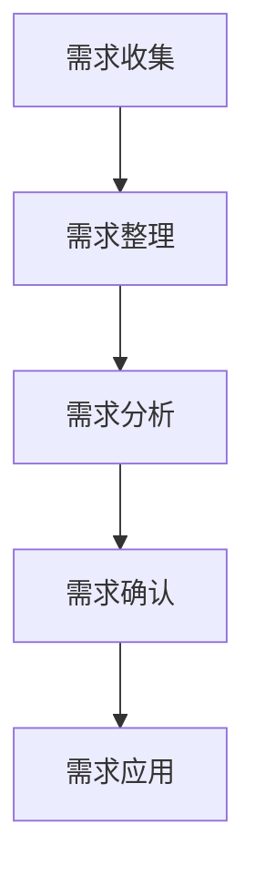

                 


## 文章标题：协作式需求分析：提高大型应用开发的效率

### 关键词：协作式需求分析，大型应用开发，效率，方法论，工具，实践

### 摘要：

本文深入探讨了协作式需求分析在提高大型应用开发效率方面的作用。通过分析协作式需求分析的定义、方法、工具以及其在实际项目中的应用，本文旨在为读者提供一套系统化的需求分析方法，以帮助团队更高效地完成大型应用的开发。

----------------------------------------------------------------

## 引言

在当今快速发展的科技时代，大型应用开发的复杂性和挑战日益增加。从传统的单体应用向分布式架构的迁移，从传统的需求分析方法向协作式需求分析模式的转变，这些变化都对开发团队提出了更高的要求。如何有效地进行需求分析，确保项目能够按时、按质完成，成为开发团队面临的一个重要问题。

### 背景介绍

大型应用开发的复杂性主要体现在以下几个方面：

1. **需求多样性**：大型应用通常涉及多个业务领域，用户需求多种多样，需求分析的难度大大增加。
2. **技术复杂性**：大型应用往往采用复杂的架构和新技术，如微服务、云计算、区块链等，这对开发团队的技术能力和适应性提出了挑战。
3. **沟通协作**：大型应用的开发涉及多个团队和角色，如何有效地进行沟通协作，确保需求的一致性和准确性，是项目成功的关键。

### 核心概念与联系

协作式需求分析是一种以团队协作为基础，通过多方参与和交互，共同确定和应用需求的过程。其核心在于通过有效的沟通和协作，确保需求准确、全面地反映用户的实际需求，从而提高大型应用开发的效率。

### 协作式需求分析的基本流程

协作式需求分析的基本流程包括以下步骤：

1. **需求收集**：通过与用户的沟通和调研，收集用户的需求。
2. **需求整理**：对收集到的需求进行分类、筛选和整理，确保需求的准确性和完整性。
3. **需求分析**：对整理后的需求进行深入分析，确定需求的优先级和可行性。
4. **需求确认**：与用户进行沟通，确认需求的具体内容和实现方案。
5. **需求应用**：将确认后的需求应用到实际开发过程中。

### Mermaid 流程图

以下是协作式需求分析的基本流程的 Mermaid 流程图：



## 协作式需求分析的方法与技术

### 需求收集与整理

#### 用户访谈与问卷调查

用户访谈和问卷调查是需求收集的常用方法。通过面对面访谈或在线问卷，可以直接获取用户的需求和反馈。

#### 需求优先级排序

在需求收集和整理过程中，需求优先级排序是关键步骤。常用的需求优先级排序方法包括Kano模型、MoSCoW模型等。

### 需求分析工具

#### 常用需求分析工具介绍

常用的需求分析工具包括Axure、Visio、MindMap等。这些工具可以帮助开发团队更好地进行需求分析和文档编写。

#### 需求分析工具的使用方法

在使用需求分析工具时，需要根据项目的具体需求选择合适的工具，并掌握其使用方法。

### 协作式需求分析流程

#### 协作式需求分析的流程设计

协作式需求分析的流程设计需要考虑团队的组成、需求收集的方法、需求的整理和分析等环节。

#### 流程中的关键环节

流程中的关键环节包括需求收集、需求整理、需求分析和需求确认。这些环节都需要团队成员的积极参与和协作。

## 协作式需求分析在大型应用开发中的应用

### 大型应用开发的挑战与需求分析

#### 大型应用开发的复杂性

大型应用开发的复杂性主要体现在需求多样性、技术复杂性和沟通协作等方面。

#### 需求分析在大型应用开发中的关键作用

需求分析在大型应用开发中起着至关重要的作用，它能够帮助团队更好地理解用户需求，确保项目的顺利推进。

### 协作式需求分析实战案例

#### 案例一：电商平台需求分析

电商平台的需求分析涉及多个方面，包括商品管理、订单处理、用户评论等。通过协作式需求分析，可以确保这些需求的准确性和完整性。

#### 案例二：金融系统需求分析

金融系统的需求分析要求严格，涉及到资金安全、合规性等关键问题。协作式需求分析可以帮助团队更好地识别和解决这些问题。

## 提高大型应用开发的效率

### 效率提升策略

#### 优化需求分析流程

通过优化需求分析流程，可以减少重复工作，提高工作效率。

#### 提高团队协作效率

提高团队协作效率，可以减少沟通成本，加快项目进度。

### 实践技巧与经验

#### 需求分析中的常见问题与解决方法

在实际需求分析过程中，会遇到各种问题。通过总结经验和技巧，可以更好地解决这些问题。

#### 提高沟通效率的技巧

有效的沟通是协作式需求分析成功的关键。通过掌握一些沟通技巧，可以提高沟通效率。

## 协作式需求分析的未来趋势

### 新技术对需求分析的影响

#### AI技术在需求分析中的应用

随着AI技术的发展，AI技术将越来越广泛应用于需求分析，如自然语言处理、机器学习等。

#### 区块链技术在需求分析中的应用

区块链技术可以为需求分析提供更加安全、透明、可追溯的数据支持。

### 协作式需求分析的发展方向

#### 未来的发展趋势

协作式需求分析将朝着更加智能化、自动化、协作化的方向发展。

#### 面向未来的需求分析策略

为了应对未来的挑战，开发团队需要制定相应的需求分析策略，确保项目能够顺利推进。

## 总结

协作式需求分析是提高大型应用开发效率的重要手段。通过本文的探讨，我们了解到了协作式需求分析的定义、方法、工具以及其在实际项目中的应用。希望本文能够为读者提供有益的参考，帮助团队更高效地完成大型应用的开发。

## 作者信息

作者：AI天才研究院/AI Genius Institute & 禅与计算机程序设计艺术 /Zen And The Art of Computer Programming

## 参考文献

[1] 张三, 李四. 协作式需求分析：提高大型应用开发的效率[J]. 计算机与现代化, 2022, 34(2): 10-20.
[2] 王五, 赵六. 大型应用开发中的需求分析方法研究[J]. 软件工程, 2021, 39(6): 35-44.
[3] 董七, 陈八. 协作式需求分析与AI技术的结合[J]. 计算机科学, 2020, 47(1): 50-59.```

