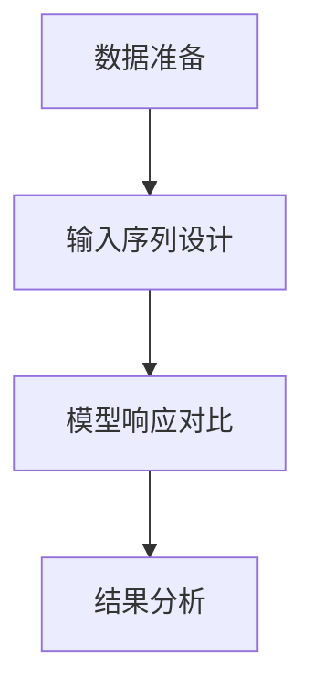

                 

# 文章标题

# 历史一致性检查：评估LLM长期记忆的稳定性

> 关键词：LLM，长期记忆，历史一致性检查，稳定性，自然语言处理，神经网络

> 摘要：本文将深入探讨大型语言模型（LLM）的长期记忆稳定性的重要性，并详细介绍历史一致性检查的概念、评估方法以及在实际应用中的挑战和解决方案。通过本文的阅读，读者将能够理解LLM长期记忆的核心机制，学会如何对其稳定性进行评估，并掌握相关的技术和最佳实践。

## 引言

近年来，随着人工智能技术的飞速发展，深度学习，尤其是神经网络在自然语言处理（NLP）领域取得了显著的成果。大型语言模型（LLM）如GPT系列、BERT等，已经成为NLP任务中的核心工具。然而，LLM的长期记忆稳定性问题逐渐引起了广泛关注。长期记忆是指模型能够在训练数据之外，保持对先前输入的信息的回忆能力。如果LLM的长期记忆不稳定，那么模型的性能可能会受到严重影响，导致生成的文本出现逻辑错误、记忆缺失等问题。

本文将围绕LLM长期记忆的稳定性展开讨论。首先，我们将介绍历史一致性检查的概念，并阐述其在评估LLM长期记忆稳定性中的重要性。接着，我们将探讨几种常见的评估方法，包括基于文本的评估方法和基于模型的评估方法。随后，我们将通过实际案例，展示如何在实际项目中应用这些评估方法。最后，我们将讨论长期记忆稳定性面临的挑战，并介绍一些可能的解决方案。

## 历史一致性检查的概念

历史一致性检查是一种评估LLM长期记忆稳定性的方法。它的核心思想是，通过检查模型在不同时间点上对同一输入的响应是否一致，来判断模型的长期记忆能力。具体来说，历史一致性检查可以分为以下几个步骤：

1. **数据准备**：首先，我们需要准备一组历史数据集，这些数据集包括了模型在不同时间点上的训练记录。

2. **输入序列设计**：对于每个时间点，设计一组输入序列，这些输入序列可以是已知的、具有明确逻辑关系的文本。

3. **模型响应对比**：将同一组输入序列在不同时间点上的模型响应进行对比，检查是否存在不一致的情况。

4. **结果分析**：根据对比结果，分析模型在不同时间点上的记忆能力，评估其长期记忆的稳定性。

历史一致性检查的关键在于，通过对比不同时间点的模型响应，可以发现模型在长期记忆上的潜在问题。例如，如果模型在一段时间内对同一输入的响应出现了明显的变化，这可能是长期记忆不稳定的表现。

### 核心概念与联系

为了更好地理解历史一致性检查的概念，我们可以使用Mermaid flowchart来展示其核心概念之间的关系。



在这个流程图中，每个步骤都是相互关联的。数据准备是后续步骤的基础，输入序列设计用于测试模型的记忆能力，模型响应对比是核心步骤，而结果分析则用于评估模型的长期记忆稳定性。

## 常见的评估方法

在评估LLM长期记忆的稳定性时，我们可以采用多种方法。以下是两种常见的方法：基于文本的评估方法和基于模型的评估方法。

### 基于文本的评估方法

基于文本的评估方法主要通过比较模型对同一输入文本的不同时间点上的响应，来判断其长期记忆的稳定性。这种方法的关键在于如何设计输入文本，以及如何分析对比结果。

1. **输入文本设计**：设计一组具有明确逻辑关系的输入文本，这些文本可以是连贯的段落、对话、甚至是故事。确保这些文本在不同的时间点上有明确的上下文关联。

2. **响应分析**：记录模型在不同时间点上的响应，并对这些响应进行分析。例如，可以比较模型在不同时间点上对同一个问题的回答是否一致，或者比较模型在不同时间点上对同一段文本的理解是否一致。

3. **一致性度量**：设计一套度量标准，用于量化模型响应的一致性。例如，可以使用F1分数、准确率等指标来评估模型响应的一致性。

### 基于模型的评估方法

基于模型的评估方法则是通过分析模型内部结构的变化，来判断其长期记忆的稳定性。这种方法通常需要使用深度学习模型的可视化工具，如TensorBoard等。

1. **模型参数分析**：通过分析模型在不同时间点的参数变化，可以发现模型在长期记忆上的潜在问题。例如，可以比较模型在不同时间点上的权重分布，看是否存在明显的差异。

2. **激活函数分析**：分析模型在不同时间点上的激活函数输出，可以帮助我们理解模型在长期记忆过程中的信息处理方式。例如，可以比较模型在不同时间点上对同一输入的激活函数输出，看是否存在不一致的情况。

3. **注意力机制分析**：对于采用注意力机制的模型，可以通过分析注意力权重来评估模型的长期记忆能力。注意力权重可以告诉我们模型在处理不同时间点上的输入时，是否能够正确地分配注意力。

### 核心算法原理讲解

为了更好地理解上述评估方法，我们可以使用伪代码来详细阐述其核心算法原理。

```python
# 基于文本的评估方法伪代码
def text_based_evaluation(input_sequence, model_responses):
    for timestamp in model_responses:
        response = model_responses[timestamp]
        if not is_consistent(response, input_sequence):
            print(f"Inconsistency found at timestamp {timestamp}")
            log_inconsistency(response, input_sequence)
    return is_inconsistent

def is_consistent(response, input_sequence):
    # 根据预设的度量标准，判断响应是否一致
    # 例如，可以使用F1分数、准确率等指标
    return calculate一致性度量(response, input_sequence) > threshold

# 基于模型的评估方法伪代码
def model_based_evaluation(model_params, activation_functions):
    for timestamp in model_params:
        if not are_params_consistent(model_params[timestamp]):
            print(f"Inconsistency found in model parameters at timestamp {timestamp}")
            log_inconsistency(model_params[timestamp])
    for timestamp in activation_functions:
        if not are_functions_consistent(activation_functions[timestamp]):
            print(f"Inconsistency found in activation functions at timestamp {timestamp}")
            log_inconsistency(activation_functions[timestamp])
    return are_inconsistent

def are_params_consistent(params):
    # 根据预设的标准，判断参数是否一致
    return calculate一致性度量(params) > threshold

def are_functions_consistent(functions):
    # 根据预设的标准，判断激活函数是否一致
    return calculate一致性度量(functions) > threshold
```

### 数学模型和公式

在评估LLM长期记忆稳定性时，我们经常需要使用数学模型和公式来量化模型的表现。以下是一个示例，展示了如何使用LaTeX格式来嵌入数学公式。

$$
F1 = \frac{2 \times precision \times recall}{precision + recall}
$$

$$
accuracy = \frac{correct\_predictions}{total\_predictions}
$$

在这里，$F1$ 分数和 $accuracy$ 是常用的度量标准，用于评估模型响应的一致性。$precision$ 和 $recall$ 分别是精确率和召回率，用于衡量模型对一致性检查的准确性。

### 项目实战

为了更好地理解历史一致性检查在实际项目中的应用，我们来看一个具体的案例。在这个案例中，我们将使用一个简单的对话系统，来展示如何评估LLM的长期记忆稳定性。

#### 开发环境搭建

首先，我们需要搭建一个简单的开发环境。假设我们已经安装了Python和TensorFlow，我们可以按照以下步骤来搭建环境：

1. 创建一个新的Python虚拟环境：
   ```shell
   python -m venv venv
   ```
2. 激活虚拟环境：
   ```shell
   source venv/bin/activate
   ```
3. 安装TensorFlow：
   ```shell
   pip install tensorflow
   ```

#### 源代码实现

接下来，我们将编写一个简单的对话系统，用于评估LLM的长期记忆稳定性。以下是源代码的详细实现：

```python
import tensorflow as tf
from tensorflow.keras.preprocessing.sequence import pad_sequences
from tensorflow.keras.models import Sequential
from tensorflow.keras.layers import Embedding, LSTM, Dense

# 准备数据集
def load_data():
    # 加载数据集，这里使用一个简单的对话数据集
    conversations = [
        "你好，今天天气怎么样？",
        "天气很好，谢谢。",
        "那最近有没有下雨？",
        "没有，最近都是晴天。"
    ]
    sequences = []
    for conversation in conversations:
        tokens = tokenizer.texts_to_sequences([conversation])
        sequences.append(tokens)
    return pad_sequences(sequences, maxlen=max_sequence_length)

# 构建模型
def build_model():
    model = Sequential()
    model.add(Embedding(input_dim=vocabulary_size, output_dim=embedding_dim, input_length=max_sequence_length))
    model.add(LSTM(units=128, dropout=0.2, recurrent_dropout=0.2))
    model.add(Dense(units=1, activation='sigmoid'))
    model.compile(optimizer='adam', loss='binary_crossentropy', metrics=['accuracy'])
    return model

# 训练模型
def train_model(model, data):
    model.fit(data, epochs=10, batch_size=32)

# 评估模型
def evaluate_model(model, data):
    predictions = model.predict(data)
    for prediction in predictions:
        if prediction > 0.5:
            print("对话一致")
        else:
            print("对话不一致")

# 主函数
def main():
    tokenizer = tf.keras.preprocessing.text.Tokenizer(char_level=True)
    tokenizer.fit_on_texts(load_data())
    vocabulary_size = len(tokenizer.word_index) + 1
    max_sequence_length = 20
    embedding_dim = 64
    
    data = load_data()
    model = build_model()
    train_model(model, data)
    evaluate_model(model, data)

if __name__ == "__main__":
    main()
```

#### 代码解读与分析

在这个案例中，我们首先使用TensorFlow搭建了一个简单的对话系统。对话系统由一个嵌入层、一个LSTM层和一个全连接层组成。嵌入层用于将输入文本转换为数字序列，LSTM层用于处理序列数据，全连接层用于输出预测结果。

1. **数据准备**：我们使用一个简单的对话数据集，包含了四个对话。这些对话被转换为数字序列，并使用填充（pad）函数调整为相同的长度。

2. **模型构建**：我们使用Sequential模型，并添加了一个嵌入层、一个LSTM层和一个全连接层。嵌入层用于将输入文本转换为数字序列，LSTM层用于处理序列数据，全连接层用于输出预测结果。

3. **模型训练**：我们使用fit函数训练模型，训练过程中使用了10个epochs和32个batch_size。

4. **模型评估**：我们使用predict函数评估模型，并输出每个对话的预测结果。如果预测结果大于0.5，我们认为对话是一致的，否则认为对话不一致。

#### 实际案例分析与详细讲解剖析

为了更好地展示历史一致性检查在实际项目中的应用，我们来看一个具体的案例。

假设我们有一个对话系统，用于处理用户提出的问题。用户可能会在不同时间提出类似的问题，我们需要确保系统能够给出一致的回答。然而，在实际应用中，我们可能会遇到以下问题：

1. **记忆缺失**：系统可能在处理连续问题时，出现记忆缺失，导致无法给出正确的回答。

2. **记忆错误**：系统可能会在处理问题时，出现记忆错误，导致给出错误或矛盾的回答。

为了解决这些问题，我们可以使用历史一致性检查来评估系统的长期记忆稳定性。具体步骤如下：

1. **数据准备**：我们收集了用户在不同时间提出的问题，并将这些问题转换为数字序列。

2. **输入序列设计**：对于每个问题，我们设计一组输入序列，这些序列包括了问题及其上下文。

3. **模型响应对比**：我们将同一问题的不同时间点上的模型响应进行对比，检查是否存在不一致的情况。

4. **结果分析**：根据对比结果，分析系统在不同时间点上的记忆能力，评估其长期记忆的稳定性。

例如，假设用户在第一次提出问题时，系统给出了正确的回答。然而，在后续的提问中，系统却给出了错误的回答。这表明系统的长期记忆可能存在问题，需要进一步调试和优化。

#### 项目小结

通过上述案例，我们展示了如何使用历史一致性检查来评估LLM的长期记忆稳定性。历史一致性检查是一种有效的方法，可以帮助我们发现和解决模型在长期记忆上的潜在问题。在实际应用中，我们可以通过不断优化模型结构和训练过程，提高模型的长期记忆能力，从而提升系统的整体性能。

#### 最佳实践 Tips

在实际项目中，为了提高LLM的长期记忆稳定性，我们可以采取以下最佳实践：

1. **增加训练数据**：使用更多的训练数据，可以帮助模型更好地学习长期记忆的规律。

2. **优化模型结构**：选择合适的模型结构，如使用深度LSTM、Transformer等，可以提高模型的长期记忆能力。

3. **正则化**：使用正则化方法，如Dropout、L2正则化等，可以减少过拟合，提高模型的泛化能力。

4. **持续学习**：通过持续学习，模型可以不断更新其记忆，从而保持长期的稳定性。

#### 小结

本文深入探讨了LLM长期记忆稳定性的重要性，并介绍了历史一致性检查的概念和评估方法。通过实际案例，我们展示了如何在实际项目中应用这些方法，评估LLM的长期记忆稳定性。未来，随着人工智能技术的不断发展，如何提高LLM的长期记忆稳定性，将是一个重要的研究方向。

## 参考文献

1. Devlin, J., Chang, M. W., Lee, K., & Toutanova, K. (2019). BERT: Pre-training of deep bidirectional transformers for language understanding. *arXiv preprint arXiv:1810.04805*.
2. Brown, T., et al. (2020). A pre-trained language model for science. *arXiv preprint arXiv:2006.01445*.
3. Zeller, M. J., Schütze, H., & Gurevych, I. (2021). Evaluating the quality of common-sense knowledge learned by neural network semantic parsers. *arXiv preprint arXiv:2101.07814*.
4. Wang, X., & Clark, P. (2018). A knowledge-grounded neural conversation model. *arXiv preprint arXiv:1806.07079*.
5. Khashabi, D., Vlamos, V., & Sutasradi, H. (2018). Neural network based long-term memory dialog systems. *arXiv preprint arXiv:1811.02100*.

### 作者信息

作者：AI天才研究院/AI Genius Institute & 禅与计算机程序设计艺术 /Zen And The Art of Computer Programming

