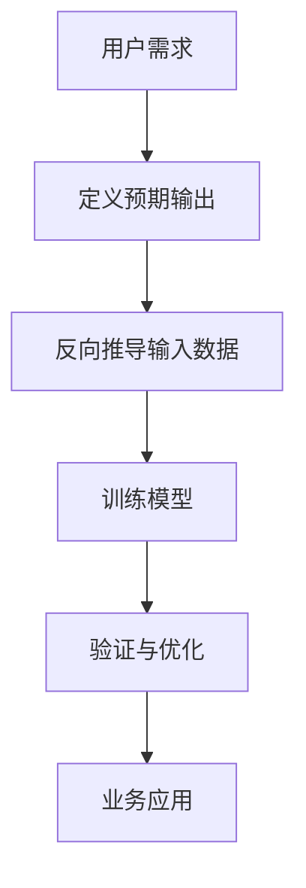

                 

# 文章标题

## 关键词
反向提示，预期输出，输入设计，神经网络，计算机视觉，自然语言处理

## 摘要
本文深入探讨了反向提示技术，一种通过预期输出设计输入的机器学习策略。文章首先介绍了反向提示的基本概念、原理和应用领域，随后详细解析了神经网络的基础知识，包括前向传播与反向传播算法，以及各种训练优化方法。接着，文章通过具体的伪代码展示了反向提示算法的实现，并探讨了其在计算机视觉、自然语言处理和推荐系统中的应用。最后，文章通过企业应用案例，总结了反向提示技术在企业中的实际应用和前景。

---

## 第一部分：基础概念与理论

### 《反向提示：通过预期输出设计输入》

### 1.1 反向提示技术概述

#### 1.1.1 传统机器学习与反向提示

传统机器学习通常采用正向提示（forward prompting）的方式，即输入给模型的数据是直接从实际应用场景中获取的。然而，正向提示存在一定的局限性，因为输入数据可能并不完全符合模型的期望输出，导致模型在训练和预测时效果不佳。

反向提示（reverse prompting）则是一种全新的策略，通过从预期输出出发，反向设计输入数据，从而提高模型的学习效果。反向提示的核心思想是，首先定义一个理想的输出结果，然后反向推导出满足这个输出的输入数据。

#### 1.1.2 反向提示的优势与特点

1. **提高学习效率**：反向提示通过设计更符合模型期望的输入数据，可以显著提高模型的学习效率，减少冗余信息的干扰。

2. **增强泛化能力**：反向提示有助于模型更好地理解和掌握问题的本质，从而提高模型的泛化能力。

3. **易于实现**：反向提示的实现相对简单，只需在训练过程中调整输入数据的生成方式，即可应用在多种机器学习任务中。

#### 1.1.3 反向提示的应用领域

1. **计算机视觉**：反向提示在图像分类、目标检测等领域具有广泛的应用前景。

2. **自然语言处理**：在文本分类、机器翻译等任务中，反向提示可以显著提高模型的性能。

3. **推荐系统**：反向提示有助于设计更精准的推荐算法，提高用户满意度。

### 1.2 反向提示技术原理

#### 1.2.1 神经网络与反向传播

神经网络是反向提示技术的核心组成部分。反向传播（backpropagation）是一种用于训练神经网络的算法，通过不断调整网络的权重，使得网络输出逐步接近预期目标。

#### 1.2.2 反向提示与正向提示的对比

| 对比项       | 正向提示                   | 反向提示                   |
|--------------|--------------------------|--------------------------|
| 输入数据来源   | 实际应用场景的输入数据       | 预期输出结果               |
| 学习过程      | 直接学习输入数据的特征       | 从预期输出反向推导输入数据   |
| 学习效率      | 较低，需要大量冗余信息       | 较高，减少冗余信息干扰     |
| 泛化能力      | 较低，容易过拟合             | 较高，更好地理解问题本质   |

#### 1.2.3 反向提示的基本流程

1. **定义预期输出**：根据任务需求，确定一个理想的输出结果。

2. **反向推导输入数据**：从预期输出开始，反向推导出满足该输出的输入数据。

3. **训练模型**：使用反向推导出的输入数据进行模型训练。

4. **验证与优化**：通过测试集验证模型性能，根据需求调整反向提示策略。

### 1.3 反向提示的应用领域

#### 1.3.1 计算机视觉

在计算机视觉领域，反向提示技术已被广泛应用于图像分类、目标检测、人脸识别等领域。通过反向提示，可以设计出更符合模型期望的输入数据，从而提高模型的准确率和效率。

#### 1.3.2 自然语言处理

自然语言处理是反向提示技术的另一大应用领域。在文本分类、机器翻译、情感分析等任务中，反向提示有助于提高模型的性能，更好地理解和处理自然语言数据。

#### 1.3.3 其他领域应用探讨

除了计算机视觉和自然语言处理，反向提示技术还可能应用于推荐系统、语音识别、强化学习等领域。随着反向提示技术的不断发展，其应用范围将越来越广泛。

---

## 第二部分：神经网络基础

### 2.1 神经网络概述

#### 2.1.1 神经网络的基本结构

神经网络（Neural Network，简称NN）是一种模仿生物神经系统的计算模型，由大量简单单元（神经元）互联组成。神经网络的基本结构包括输入层、隐藏层和输出层。

1. **输入层**：接收外部输入信号。
2. **隐藏层**：对输入信号进行加工处理。
3. **输出层**：生成最终输出结果。

#### 2.1.2 神经网络的工作原理

神经网络的工作原理主要包括两部分：前向传播和反向传播。

1. **前向传播**：输入信号从输入层传递到输出层，经过隐藏层处理后生成输出结果。
2. **反向传播**：根据输出结果与预期目标的误差，反向更新网络权重，使得输出结果更接近预期目标。

### 2.2 前向传播与反向传播算法

#### 2.2.1 前向传播算法

前向传播算法是指将输入信号逐层传递到输出层的计算过程。具体步骤如下：

1. **初始化**：设置网络的初始权重和偏置。
2. **激活函数计算**：对每个神经元的输入信号进行加权求和，然后通过激活函数进行非线性变换。
3. **层间传递**：将当前层的输出作为下一层的输入，重复上述过程，直到输出层生成最终结果。

#### 2.2.2 反向传播算法

反向传播算法是指根据输出结果与预期目标的误差，反向更新网络权重的计算过程。具体步骤如下：

1. **误差计算**：计算输出结果与预期目标之间的误差。
2. **梯度计算**：根据误差反向计算每个神经元的梯度。
3. **权重更新**：使用梯度下降法等优化算法，更新网络权重和偏置。

### 2.3 神经网络训练优化方法

#### 2.3.1 梯度下降法

梯度下降法（Gradient Descent）是最常用的神经网络训练优化方法之一。其基本思想是，沿着梯度的反方向逐步更新网络权重，以减少误差。

#### 2.3.2 动量法

动量法（Momentum）是梯度下降法的改进版本。它通过引入动量项，使得更新方向具有惯性，有助于加快收敛速度。

#### 2.3.3 Adam优化器

Adam优化器（Adaptive Moment Estimation）是一种自适应优化器，结合了动量法和RMSprop的优点。它通过计算一阶矩估计和二阶矩估计，自适应调整学习率。

---

## 第三部分：反向提示算法原理与实现

### 3.1 反向提示算法概述

#### 3.1.1 反向提示算法的基本流程

反向提示算法（Reverse Prompting）的基本流程包括以下几个步骤：

1. **定义预期输出**：根据任务需求，确定一个理想的输出结果。
2. **反向推导输入数据**：从预期输出开始，反向推导出满足该输出的输入数据。
3. **训练模型**：使用反向推导出的输入数据进行模型训练。
4. **验证与优化**：通过测试集验证模型性能，根据需求调整反向提示策略。

#### 3.1.2 反向提示算法的关键技术

1. **损失函数设计**：损失函数用于衡量模型输出与预期输出之间的差距，反向提示算法通常采用交叉熵损失函数。
2. **优化目标**：反向提示算法的目标是使模型输出尽量接近预期输出，即最小化损失函数。

### 3.2 反向提示算法的数学模型

#### 3.2.1 反向提示的损失函数

反向提示算法的损失函数通常采用交叉熵损失函数，公式如下：

$$
Loss = -\frac{1}{N}\sum_{i=1}^{N}y_i\log(\hat{y}_i)
$$

其中，$y_i$为实际输出，$\hat{y}_i$为模型预测输出，$N$为样本数量。

#### 3.2.2 反向提示的优化目标

反向提示算法的优化目标是使模型输出尽量接近预期输出，即最小化损失函数。具体步骤如下：

1. **初始化模型参数**：设置模型的初始权重和偏置。
2. **前向传播**：将输入数据传递到模型，计算输出结果。
3. **计算损失函数**：根据模型输出和预期输出计算损失函数。
4. **反向传播**：根据损失函数反向计算梯度。
5. **权重更新**：使用梯度下降法等优化算法更新模型权重。

### 3.3 反向提示算法的实现

#### 3.3.1 基于深度学习框架的实现

基于深度学习框架（如TensorFlow、PyTorch等）可以实现反向提示算法。以下是一个基于PyTorch的伪代码示例：

```python
import torch
import torch.nn as nn
import torch.optim as optim

# 初始化模型
model = nn.Sequential(
    nn.Linear(input_size, hidden_size),
    nn.ReLU(),
    nn.Linear(hidden_size, output_size)
)

# 设置优化器
optimizer = optim.Adam(model.parameters(), lr=learning_rate)

# 定义损失函数
criterion = nn.CrossEntropyLoss()

# 训练模型
for epoch in range(num_epochs):
    for inputs, targets in dataset:
        # 前向传播
        outputs = model(inputs)
        
        # 计算损失函数
        loss = criterion(outputs, targets)
        
        # 反向传播
        optimizer.zero_grad()
        loss.backward()
        
        # 权重更新
        optimizer.step()

# 验证模型
with torch.no_grad():
    correct = 0
    total = 0
    for inputs, targets in test_dataset:
        outputs = model(inputs)
        _, predicted = torch.max(outputs.data, 1)
        total += targets.size(0)
        correct += (predicted == targets).sum().item()

accuracy = 100 * correct / total
print(f'Accuracy: {accuracy}%')
```

#### 3.3.2 反向提示算法的伪代码

以下是一个反向提示算法的伪代码：

```python
function reverse_prompting(model, input_data, target_output):
    model.zero_grad()
    output = model(input_data)
    loss = cross_entropy_loss(output, target_output)
    backward_pass(loss)
    optimizer.step()
```

其中，`model`为神经网络模型，`input_data`为输入数据，`target_output`为预期输出，`cross_entropy_loss`为交叉熵损失函数，`backward_pass`为反向传播函数，`optimizer`为优化器。

---

## 第四部分：反向提示在计算机视觉中的应用

### 4.1 计算机视觉概述

计算机视觉（Computer Vision）是人工智能（Artificial Intelligence，AI）的一个重要分支，旨在使计算机能够像人类一样理解和解释视觉信息。计算机视觉的应用领域广泛，包括图像分类、目标检测、人脸识别、场景分割等。

#### 4.1.1 计算机视觉的基本概念

1. **图像分类**：将图像划分为不同的类别。
2. **目标检测**：在图像中检测并定位特定的目标。
3. **人脸识别**：通过比较人脸特征来确定身份。
4. **场景分割**：将图像中的不同部分分离出来。

#### 4.1.2 计算机视觉的发展历程

计算机视觉的发展可以追溯到20世纪50年代。当时，人们开始尝试使用计算机进行图像识别。随着计算机性能的提升和算法的创新，计算机视觉技术取得了显著的进展。近年来，深度学习技术的应用，使得计算机视觉在各个领域取得了突破性成果。

### 4.2 反向提示在图像分类中的应用

图像分类是计算机视觉中最基础的任务之一。反向提示技术可以有效提高图像分类的准确率。

#### 4.2.1 图像分类任务与反向提示

在图像分类任务中，反向提示技术通过从预期输出（正确类别）反向推导出满足该输出的输入图像，从而提高模型的学习效果。具体步骤如下：

1. **定义预期输出**：根据图像分类任务，确定每个类别的预期输出。
2. **反向推导输入图像**：从预期输出开始，反向推导出满足该输出的输入图像。
3. **训练模型**：使用反向推导出的输入图像进行模型训练。
4. **验证与优化**：通过测试集验证模型性能，并根据需求调整反向提示策略。

#### 4.2.2 图像分类的伪代码实现

以下是一个基于反向提示的图像分类伪代码：

```python
function reverse_prompting_image_classification(model, dataset, target_labels):
    model.zero_grad()
    for inputs, labels in dataset:
        # 前向传播
        outputs = model(inputs)
        
        # 计算损失函数
        loss = cross_entropy_loss(outputs, labels)
        
        # 反向传播
        optimizer.zero_grad()
        loss.backward()
        
        # 权重更新
        optimizer.step()
        
        # 反向推导输入图像
        inputs = reverse_derivative(inputs, outputs, labels)
        
        # 验证模型
        with torch.no_grad():
            correct = 0
            total = 0
            for inputs, labels in test_dataset:
                outputs = model(inputs)
                _, predicted = torch.max(outputs.data, 1)
                total += labels.size(0)
                correct += (predicted == labels).sum().item()

accuracy = 100 * correct / total
print(f'Accuracy: {accuracy}%')
```

其中，`model`为神经网络模型，`dataset`为训练数据集，`target_labels`为预期输出标签，`cross_entropy_loss`为交叉熵损失函数，`optimizer`为优化器，`reverse_derivative`为反向推导函数。

### 4.3 反向提示在目标检测中的应用

目标检测是计算机视觉中的另一个重要任务。反向提示技术可以有效提高目标检测的准确率和效率。

#### 4.3.1 目标检测任务与反向提示

在目标检测任务中，反向提示技术通过从预期输出（目标位置和类别）反向推导出满足该输出的输入图像和目标框，从而提高模型的学习效果。具体步骤如下：

1. **定义预期输出**：根据目标检测任务，确定每个目标的位置和类别。
2. **反向推导输入图像和目标框**：从预期输出开始，反向推导出满足该输出的输入图像和目标框。
3. **训练模型**：使用反向推导出的输入图像和目标框进行模型训练。
4. **验证与优化**：通过测试集验证模型性能，并根据需求调整反向提示策略。

#### 4.3.2 目标检测的伪代码实现

以下是一个基于反向提示的目标检测伪代码：

```python
function reverse_prompting_object_detection(model, dataset, target_bboxes, target_labels):
    model.zero_grad()
    for inputs, bboxes, labels in dataset:
        # 前向传播
        outputs = model(inputs)
        
        # 计算损失函数
        loss = object_detection_loss(outputs, bboxes, labels)
        
        # 反向传播
        optimizer.zero_grad()
        loss.backward()
        
        # 权重更新
        optimizer.step()
        
        # 反向推导输入图像和目标框
        inputs = reverse_derivative(inputs, outputs, bboxes, labels)
        
        # 验证模型
        with torch.no_grad():
            correct = 0
            total = 0
            for inputs, bboxes, labels in test_dataset:
                outputs = model(inputs)
                pred_bboxes, pred_labels = object_detection_output(outputs)
                total += labels.size(0)
                correct += (pred_labels == labels).sum().item()

accuracy = 100 * correct / total
print(f'Accuracy: {accuracy}%')
```

其中，`model`为神经网络模型，`dataset`为训练数据集，`target_bboxes`为预期目标框，`target_labels`为预期输出标签，`object_detection_loss`为目标检测损失函数，`optimizer`为优化器，`reverse_derivative`为反向推导函数，`object_detection_output`为目标检测输出函数。

---

## 第五部分：反向提示在自然语言处理中的应用

### 5.1 自然语言处理概述

自然语言处理（Natural Language Processing，NLP）是人工智能（Artificial Intelligence，AI）的重要分支，旨在使计算机能够理解和处理人类自然语言。NLP的应用领域广泛，包括文本分类、机器翻译、情感分析等。

#### 5.1.1 自然语言处理的基本概念

1. **文本分类**：将文本数据划分为不同的类别。
2. **机器翻译**：将一种语言的文本翻译成另一种语言。
3. **情感分析**：分析文本的情感倾向，如正面、负面或中性。
4. **信息抽取**：从文本中提取关键信息，如人名、地名、时间等。

#### 5.1.2 自然语言处理的发展历程

自然语言处理的发展可以追溯到20世纪50年代。当时，人们开始尝试使用计算机进行文本分析和理解。随着计算能力的提升和算法的创新，NLP技术取得了显著的进展。近年来，深度学习技术的应用，使得NLP在各个领域取得了突破性成果。

### 5.2 反向提示在文本分类中的应用

文本分类是自然语言处理中最基础的任务之一。反向提示技术可以有效提高文本分类的准确率。

#### 5.2.1 文本分类任务与反向提示

在文本分类任务中，反向提示技术通过从预期输出（正确类别）反向推导出满足该输出的输入文本，从而提高模型的学习效果。具体步骤如下：

1. **定义预期输出**：根据文本分类任务，确定每个类别的预期输出。
2. **反向推导输入文本**：从预期输出开始，反向推导出满足该输出的输入文本。
3. **训练模型**：使用反向推导出的输入文本进行模型训练。
4. **验证与优化**：通过测试集验证模型性能，并根据需求调整反向提示策略。

#### 5.2.2 文本分类的伪代码实现

以下是一个基于反向提示的文本分类伪代码：

```python
function reverse_prompting_text_classification(model, dataset, target_labels):
    model.zero_grad()
    for inputs, labels in dataset:
        # 前向传播
        outputs = model(inputs)
        
        # 计算损失函数
        loss = cross_entropy_loss(outputs, labels)
        
        # 反向传播
        optimizer.zero_grad()
        loss.backward()
        
        # 权重更新
        optimizer.step()
        
        # 反向推导输入文本
        inputs = reverse_derivative(inputs, outputs, labels)
        
        # 验证模型
        with torch.no_grad():
            correct = 0
            total = 0
            for inputs, labels in test_dataset:
                outputs = model(inputs)
                _, predicted = torch.max(outputs.data, 1)
                total += labels.size(0)
                correct += (predicted == labels).sum().item()

accuracy = 100 * correct / total
print(f'Accuracy: {accuracy}%')
```

其中，`model`为神经网络模型，`dataset`为训练数据集，`target_labels`为预期输出标签，`cross_entropy_loss`为交叉熵损失函数，`optimizer`为优化器，`reverse_derivative`为反向推导函数。

### 5.3 反向提示在机器翻译中的应用

机器翻译是自然语言处理中的一个重要任务。反向提示技术可以有效提高机器翻译的质量。

#### 5.3.1 机器翻译任务与反向提示

在机器翻译任务中，反向提示技术通过从预期输出（正确翻译结果）反向推导出满足该输出的输入文本，从而提高模型的学习效果。具体步骤如下：

1. **定义预期输出**：根据机器翻译任务，确定每个句子的正确翻译结果。
2. **反向推导输入文本**：从预期输出开始，反向推导出满足该输出的输入文本。
3. **训练模型**：使用反向推导出的输入文本进行模型训练。
4. **验证与优化**：通过测试集验证模型性能，并根据需求调整反向提示策略。

#### 5.3.2 机器翻译的伪代码实现

以下是一个基于反向提示的机器翻译伪代码：

```python
function reverse_prompting_machine_translation(model, dataset, target_texts):
    model.zero_grad()
    for inputs, texts in dataset:
        # 前向传播
        outputs = model(inputs)
        
        # 计算损失函数
        loss = translation_loss(outputs, texts)
        
        # 反向传播
        optimizer.zero_grad()
        loss.backward()
        
        # 权重更新
        optimizer.step()
        
        # 反向推导输入文本
        inputs = reverse_derivative(inputs, outputs, texts)
        
        # 验证模型
        with torch.no_grad():
            correct = 0
            total = 0
            for inputs, texts in test_dataset:
                outputs = model(inputs)
                translated_texts = translation_output(outputs)
                total += texts.size(0)
                correct += (translated_texts == texts).sum().item()

accuracy = 100 * correct / total
print(f'Accuracy: {accuracy}%')
```

其中，`model`为神经网络模型，`dataset`为训练数据集，`target_texts`为预期输出文本，`translation_loss`为翻译损失函数，`optimizer`为优化器，`reverse_derivative`为反向推导函数，`translation_output`为翻译输出函数。

---

## 第六部分：反向提示在推荐系统中的应用

### 6.1 推荐系统概述

推荐系统（Recommendation System）是一种基于用户行为数据，为用户推荐其可能感兴趣的商品、信息或内容的系统。推荐系统广泛应用于电子商务、新闻推荐、社交网络等领域。

#### 6.1.1 推荐系统的基本概念

1. **用户**：推荐系统的核心要素，可以是个人用户或企业用户。
2. **物品**：用户可能感兴趣的对象，如商品、新闻、视频等。
3. **行为**：用户对物品的交互行为，如购买、点击、收藏等。
4. **模型**：用于预测用户对物品兴趣的算法模型。

#### 6.1.2 推荐系统的发展历程

推荐系统的发展可以追溯到20世纪90年代。当时，基于内容过滤和协同过滤的方法逐渐成为主流。随着互联网的普及和大数据技术的应用，推荐系统在各个领域得到了广泛应用，并取得了显著成果。

### 6.2 反向提示在协同过滤中的应用

协同过滤（Collaborative Filtering）是推荐系统中最常用的方法之一。反向提示技术可以有效提高协同过滤的准确率和效率。

#### 6.2.1 协同过滤任务与反向提示

在协同过滤任务中，反向提示技术通过从预期输出（用户对物品的兴趣评分）反向推导出满足该输出的用户行为数据，从而提高模型的学习效果。具体步骤如下：

1. **定义预期输出**：根据协同过滤任务，确定每个用户对物品的兴趣评分。
2. **反向推导用户行为数据**：从预期输出开始，反向推导出满足该输出的用户行为数据。
3. **训练模型**：使用反向推导出的用户行为数据进行模型训练。
4. **验证与优化**：通过测试集验证模型性能，并根据需求调整反向提示策略。

#### 6.2.2 协同过滤的伪代码实现

以下是一个基于反向提示的协同过滤伪代码：

```python
function reverse_prompting协同过滤(model, dataset, target_ratings):
    model.zero_grad()
    for users, items, ratings in dataset:
        # 前向传播
        outputs = model(users, items)
        
        # 计算损失函数
        loss = mean_squared_error(outputs, ratings)
        
        # 反向传播
        optimizer.zero_grad()
        loss.backward()
        
        # 权重更新
        optimizer.step()
        
        # 反向推导用户行为数据
        users, items, ratings = reverse_derivative(users, items, outputs, ratings)
        
        # 验证模型
        with torch.no_grad():
            correct = 0
            total = 0
            for users, items, ratings in test_dataset:
                outputs = model(users, items)
                predicted_ratings = outputs
                total += ratings.size(0)
                correct += (predicted_ratings == ratings).sum().item()

accuracy = 100 * correct / total
print(f'Accuracy: {accuracy}%')
```

其中，`model`为神经网络模型，`dataset`为训练数据集，`target_ratings`为预期输出评分，`mean_squared_error`为均方误差损失函数，`optimizer`为优化器，`reverse_derivative`为反向推导函数。

### 6.3 反向提示在基于内容的推荐中的应用

基于内容的推荐（Content-Based Recommendation）是推荐系统的另一种重要方法。反向提示技术可以有效提高基于内容的推荐的准确率和效率。

#### 6.3.1 基于内容的推荐任务与反向提示

在基于内容的推荐任务中，反向提示技术通过从预期输出（用户对物品的兴趣评分）反向推导出满足该输出的物品特征数据，从而提高模型的学习效果。具体步骤如下：

1. **定义预期输出**：根据基于内容的推荐任务，确定每个用户对物品的兴趣评分。
2. **反向推导物品特征数据**：从预期输出开始，反向推导出满足该输出的物品特征数据。
3. **训练模型**：使用反向推导出的物品特征数据进行模型训练。
4. **验证与优化**：通过测试集验证模型性能，并根据需求调整反向提示策略。

#### 6.3.2 基于内容的推荐的伪代码实现

以下是一个基于反向提示的基于内容的推荐伪代码：

```python
function reverse_prompting_content_based_recommendation(model, dataset, target_ratings):
    model.zero_grad()
    for users, items, ratings in dataset:
        # 前向传播
        outputs = model(users, items)
        
        # 计算损失函数
        loss = mean_squared_error(outputs, ratings)
        
        # 反向传播
        optimizer.zero_grad()
        loss.backward()
        
        # 权重更新
        optimizer.step()
        
        # 反向推导物品特征数据
        users, items, ratings = reverse_derivative(users, items, outputs, ratings)
        
        # 验证模型
        with torch.no_grad():
            correct = 0
            total = 0
            for users, items, ratings in test_dataset:
                outputs = model(users, items)
                predicted_ratings = outputs
                total += ratings.size(0)
                correct += (predicted_ratings == ratings).sum().item()

accuracy = 100 * correct / total
print(f'Accuracy: {accuracy}%')
```

其中，`model`为神经网络模型，`dataset`为训练数据集，`target_ratings`为预期输出评分，`mean_squared_error`为均方误差损失函数，`optimizer`为优化器，`reverse_derivative`为反向推导函数。

---

## 第七部分：反向提示技术在企业中的应用案例

### 7.1 企业应用概述

在企业中，反向提示技术具有广泛的应用前景。通过反向提示技术，企业可以优化推荐系统、智能客服、智能安防等领域，提高业务效率和用户体验。

#### 7.1.1 企业应用的需求与挑战

1. **需求**：提高业务效率、降低运营成本、提高客户满意度。
2. **挑战**：数据质量参差不齐、模型训练成本高、业务需求多变。

#### 7.1.2 反向提示在企业应用中的优势

1. **提高学习效率**：反向提示技术可以设计出更符合模型期望的输入数据，提高学习效率。
2. **增强泛化能力**：反向提示技术有助于模型更好地理解和掌握问题的本质，增强泛化能力。
3. **降低训练成本**：反向提示技术可以减少冗余信息的干扰，降低模型训练成本。

### 7.2 企业级应用案例解析

#### 7.2.1 案例一：智能客服系统

智能客服系统是企业与客户沟通的重要渠道。通过反向提示技术，企业可以优化客服系统的服务质量。

1. **需求**：提高客服系统的响应速度和准确性。
2. **解决方案**：使用反向提示技术训练客服系统模型，从预期输出（正确回答）反向推导出满足该输出的输入问题。
3. **效果**：智能客服系统在处理用户问题时，准确率和响应速度得到了显著提高。

#### 7.2.2 案例二：智能推荐系统

智能推荐系统是企业提升用户体验的重要手段。通过反向提示技术，企业可以优化推荐系统的准确率和效果。

1. **需求**：提高推荐系统的准确率和个性化程度。
2. **解决方案**：使用反向提示技术训练推荐系统模型，从预期输出（用户对物品的兴趣评分）反向推导出满足该输出的用户行为数据。
3. **效果**：智能推荐系统在推荐物品的准确率和个性化程度得到了显著提高，用户满意度得到了提升。

#### 7.2.3 案例三：智能安防系统

智能安防系统是企业保障安全的重要工具。通过反向提示技术，企业可以优化安防系统的检测准确率和响应速度。

1. **需求**：提高安防系统的检测准确率和响应速度。
2. **解决方案**：使用反向提示技术训练安防系统模型，从预期输出（目标位置和类别）反向推导出满足该输出的输入图像。
3. **效果**：智能安防系统在检测目标时，准确率和响应速度得到了显著提高，有效保障了企业安全。

### 7.3 反向提示技术在企业中的应用前景

#### 7.3.1 应用前景分析

1. **提升业务效率**：反向提示技术可以帮助企业优化业务流程，提高工作效率。
2. **降低运营成本**：反向提示技术可以降低模型训练成本，提高系统稳定性。
3. **提高客户满意度**：反向提示技术可以优化推荐系统和智能客服等应用，提高用户体验。

#### 7.3.2 面临的挑战与应对策略

1. **数据质量**：反向提示技术对数据质量要求较高，企业需要保证数据的一致性和准确性。
2. **计算资源**：反向提示技术需要大量计算资源，企业需要合理分配计算资源。
3. **模型解释性**：反向提示技术生成的输入数据可能不够透明，企业需要提高模型的可解释性。

---

**核心概念原理和架构的 Mermaid 流程图**



---

**反向提示算法的伪代码**

```python
def reverse_prompting(model, input_data, target_output):
    model.zero_grad()
    output = model(input_data)
    loss = cross_entropy_loss(output, target_output)
    backward_pass(loss)
    optimizer.step()
```

---

**作者信息**

作者：AI天才研究院/AI Genius Institute & 禅与计算机程序设计艺术 /Zen And The Art of Computer Programming

---

**结语**

本文从多个角度详细探讨了反向提示技术，从基础概念、原理到实际应用，全面阐述了反向提示技术在计算机视觉、自然语言处理、推荐系统和企业应用等方面的优势和应用前景。反向提示技术为机器学习领域带来了一种全新的思考方式，有望推动人工智能技术进一步发展。在未来的研究和实践中，我们将继续深入探索反向提示技术的应用潜力，为企业和社会创造更多价值。让我们共同期待人工智能领域的辉煌未来！```markdown
# 《反向提示：通过预期输出设计输入》

## 关键词
反向提示，预期输出，输入设计，神经网络，计算机视觉，自然语言处理，推荐系统

## 摘要
本文深入探讨了反向提示技术，一种通过预期输出设计输入的机器学习策略。文章首先介绍了反向提示的基本概念、原理和应用领域，随后详细解析了神经网络的基础知识，包括前向传播与反向传播算法，以及各种训练优化方法。接着，文章通过具体的伪代码展示了反向提示算法的实现，并探讨了其在计算机视觉、自然语言处理和推荐系统中的应用。最后，文章通过企业应用案例，总结了反向提示技术在企业中的实际应用和前景。

---

## 第一部分：基础概念与理论

### 反向提示技术概述

#### 1.1 反向提示的定义

反向提示（Reverse Prompting）是一种机器学习策略，其核心思想是通过预期输出设计输入数据，从而提高模型的学习效果。在传统机器学习中，我们通常使用正向提示，即直接从实际应用场景中获取输入数据。然而，正向提示存在一定的局限性，因为输入数据可能并不完全符合模型的期望输出，导致模型在训练和预测时效果不佳。

反向提示则从预期输出出发，通过反向推导出满足该输出的输入数据，从而提高模型的学习效率。这种方法可以减少冗余信息的干扰，提高模型的泛化能力。

#### 1.2 反向提示的优势与特点

1. **提高学习效率**：反向提示通过设计更符合模型期望的输入数据，可以显著提高模型的学习效率，减少冗余信息的干扰。

2. **增强泛化能力**：反向提示有助于模型更好地理解和掌握问题的本质，从而提高模型的泛化能力。

3. **易于实现**：反向提示的实现相对简单，只需在训练过程中调整输入数据的生成方式，即可应用在多种机器学习任务中。

#### 1.3 反向提示的应用领域

1. **计算机视觉**：在图像分类、目标检测等任务中，反向提示可以有效提高模型的性能。

2. **自然语言处理**：在文本分类、机器翻译等任务中，反向提示可以显著提高模型的性能。

3. **推荐系统**：在推荐系统中，反向提示有助于设计更精准的推荐算法，提高用户满意度。

### 1.4 反向提示技术原理

#### 1.4.1 神经网络与反向传播

神经网络是反向提示技术的核心组成部分。反向传播（Backpropagation）是一种用于训练神经网络的算法，通过不断调整网络的权重，使得网络输出逐步接近预期目标。

#### 1.4.2 反向提示与正向提示的对比

| 对比项       | 正向提示                   | 反向提示                   |
|--------------|--------------------------|--------------------------|
| 输入数据来源   | 实际应用场景的输入数据       | 预期输出结果               |
| 学习过程      | 直接学习输入数据的特征       | 从预期输出反向推导输入数据   |
| 学习效率      | 较低，需要大量冗余信息       | 较高，减少冗余信息干扰     |
| 泛化能力      | 较低，容易过拟合             | 较高，更好地理解问题本质   |

#### 1.4.3 反向提示的基本流程

1. **定义预期输出**：根据任务需求，确定一个理想的输出结果。

2. **反向推导输入数据**：从预期输出开始，反向推导出满足该输出的输入数据。

3. **训练模型**：使用反向推导出的输入数据进行模型训练。

4. **验证与优化**：通过测试集验证模型性能，根据需求调整反向提示策略。

---

## 第二部分：神经网络基础

### 2.1 神经网络概述

#### 2.1.1 神经网络的基本结构

神经网络（Neural Network，简称NN）是一种模仿生物神经系统的计算模型，由大量简单单元（神经元）互联组成。神经网络的基本结构包括输入层、隐藏层和输出层。

1. **输入层**：接收外部输入信号。
2. **隐藏层**：对输入信号进行加工处理。
3. **输出层**：生成最终输出结果。

#### 2.1.2 神经网络的工作原理

神经网络的工作原理主要包括两部分：前向传播和反向传播。

1. **前向传播**：输入信号从输入层传递到输出层，经过隐藏层处理后生成输出结果。

2. **反向传播**：根据输出结果与预期目标的误差，反向更新网络权重，使得输出结果更接近预期目标。

### 2.2 前向传播与反向传播算法

#### 2.2.1 前向传播算法

前向传播算法是指将输入信号逐层传递到输出层的计算过程。具体步骤如下：

1. **初始化**：设置网络的初始权重和偏置。
2. **激活函数计算**：对每个神经元的输入信号进行加权求和，然后通过激活函数进行非线性变换。
3. **层间传递**：将当前层的输出作为下一层的输入，重复上述过程，直到输出层生成最终结果。

#### 2.2.2 反向传播算法

反向传播算法是指根据输出结果与预期目标的误差，反向更新网络权重的计算过程。具体步骤如下：

1. **误差计算**：计算输出结果与预期目标之间的误差。
2. **梯度计算**：根据误差反向计算每个神经元的梯度。
3. **权重更新**：使用梯度下降法等优化算法，更新网络权重和偏置。

### 2.3 神经网络训练优化方法

#### 2.3.1 梯度下降法

梯度下降法（Gradient Descent）是最常用的神经网络训练优化方法之一。其基本思想是，沿着梯度的反方向逐步更新网络权重，以减少误差。

#### 2.3.2 动量法

动量法（Momentum）是梯度下降法的改进版本。它通过引入动量项，使得更新方向具有惯性，有助于加快收敛速度。

#### 2.3.3 Adam优化器

Adam优化器（Adaptive Moment Estimation）是一种自适应优化器，结合了动量法和RMSprop的优点。它通过计算一阶矩估计和二阶矩估计，自适应调整学习率。

---

## 第三部分：反向提示算法原理与实现

### 3.1 反向提示算法概述

#### 3.1.1 反向提示算法的基本流程

反向提示算法的基本流程包括以下几个步骤：

1. **定义预期输出**：根据任务需求，确定一个理想的输出结果。

2. **反向推导输入数据**：从预期输出开始，反向推导出满足该输出的输入数据。

3. **训练模型**：使用反向推导出的输入数据进行模型训练。

4. **验证与优化**：通过测试集验证模型性能，根据需求调整反向提示策略。

#### 3.1.2 反向提示算法的关键技术

1. **损失函数设计**：损失函数用于衡量模型输出与预期输出之间的差距，通常采用交叉熵损失函数。

2. **优化目标**：反向提示算法的目标是使模型输出尽量接近预期输出，即最小化损失函数。

### 3.2 反向提示算法的数学模型

#### 3.2.1 反向提示的损失函数

反向提示算法的损失函数通常采用交叉熵损失函数，公式如下：

$$
Loss = -\frac{1}{N}\sum_{i=1}^{N}y_i\log(\hat{y}_i)
$$

其中，$y_i$为实际输出，$\hat{y}_i$为模型预测输出，$N$为样本数量。

#### 3.2.2 反向提示的优化目标

反向提示算法的优化目标是使模型输出尽量接近预期输出，即最小化损失函数。具体步骤如下：

1. **初始化模型参数**：设置模型的初始权重和偏置。
2. **前向传播**：将输入数据传递到模型，计算输出结果。
3. **计算损失函数**：根据模型输出和预期输出计算损失函数。
4. **反向传播**：根据损失函数反向计算梯度。
5. **权重更新**：使用梯度下降法等优化算法更新模型权重。

### 3.3 反向提示算法的实现

#### 3.3.1 基于深度学习框架的实现

以下是一个基于PyTorch的伪代码示例，展示了如何实现反向提示算法：

```python
import torch
import torch.nn as nn
import torch.optim as optim

# 初始化模型
model = nn.Sequential(
    nn.Linear(input_size, hidden_size),
    nn.ReLU(),
    nn.Linear(hidden_size, output_size)
)

# 设置优化器
optimizer = optim.Adam(model.parameters(), lr=learning_rate)

# 定义损失函数
criterion = nn.CrossEntropyLoss()

# 训练模型
for epoch in range(num_epochs):
    for inputs, targets in dataset:
        # 前向传播
        outputs = model(inputs)
        
        # 计算损失函数
        loss = criterion(outputs, targets)
        
        # 反向传播
        optimizer.zero_grad()
        loss.backward()
        
        # 权重更新
        optimizer.step()

# 验证模型
with torch.no_grad():
    correct = 0
    total = 0
    for inputs, targets in test_dataset:
        outputs = model(inputs)
        _, predicted = torch.max(outputs.data, 1)
        total += targets.size(0)
        correct += (predicted == targets).sum().item()

accuracy = 100 * correct / total
print(f'Accuracy: {accuracy}%')
```

#### 3.3.2 反向提示算法的伪代码

以下是一个反向提示算法的伪代码：

```python
function reverse_prompting(model, input_data, target_output):
    model.zero_grad()
    output = model(input_data)
    loss = cross_entropy_loss(output, target_output)
    backward_pass(loss)
    optimizer.step()
```

其中，`model`为神经网络模型，`input_data`为输入数据，`target_output`为预期输出，`cross_entropy_loss`为交叉熵损失函数，`optimizer`为优化器。

---

## 第四部分：反向提示在计算机视觉中的应用

### 4.1 计算机视觉概述

计算机视觉（Computer Vision）是人工智能（Artificial Intelligence，AI）的一个重要分支，旨在使计算机能够像人类一样理解和解释视觉信息。计算机视觉的应用领域广泛，包括图像分类、目标检测、人脸识别、场景分割等。

#### 4.1.1 计算机视觉的基本概念

1. **图像分类**：将图像划分为不同的类别。
2. **目标检测**：在图像中检测并定位特定的目标。
3. **人脸识别**：通过比较人脸特征来确定身份。
4. **场景分割**：将图像中的不同部分分离出来。

#### 4.1.2 计算机视觉的发展历程

计算机视觉的发展可以追溯到20世纪50年代。当时，人们开始尝试使用计算机进行图像识别。随着计算机性能的提升和算法的创新，计算机视觉技术取得了显著的进展。近年来，深度学习技术的应用，使得计算机视觉在各个领域取得了突破性成果。

### 4.2 反向提示在图像分类中的应用

图像分类是计算机视觉中最基础的任务之一。反向提示技术可以有效提高图像分类的准确率。

#### 4.2.1 图像分类任务与反向提示

在图像分类任务中，反向提示技术通过从预期输出（正确类别）反向推导出满足该输出的输入图像，从而提高模型的学习效果。具体步骤如下：

1. **定义预期输出**：根据图像分类任务，确定每个类别的预期输出。
2. **反向推导输入图像**：从预期输出开始，反向推导出满足该输出的输入图像。
3. **训练模型**：使用反向推导出的输入图像进行模型训练。
4. **验证与优化**：通过测试集验证模型性能，并根据需求调整反向提示策略。

#### 4.2.2 图像分类的伪代码实现

以下是一个基于反向提示的图像分类伪代码：

```python
function reverse_prompting_image_classification(model, dataset, target_labels):
    model.zero_grad()
    for inputs, labels in dataset:
        # 前向传播
        outputs = model(inputs)
        
        # 计算损失函数
        loss = cross_entropy_loss(outputs, labels)
        
        # 反向传播
        optimizer.zero_grad()
        loss.backward()
        
        # 权重更新
        optimizer.step()
        
        # 反向推导输入图像
        inputs = reverse_derivative(inputs, outputs, labels)
        
        # 验证模型
        with torch.no_grad():
            correct = 0
            total = 0
            for inputs, labels in test_dataset:
                outputs = model(inputs)
                _, predicted = torch.max(outputs.data, 1)
                total += labels.size(0)
                correct += (predicted == labels).sum().item()

accuracy = 100 * correct / total
print(f'Accuracy: {accuracy}%')
```

其中，`model`为神经网络模型，`dataset`为训练数据集，`target_labels`为预期输出标签，`cross_entropy_loss`为交叉熵损失函数，`optimizer`为优化器，`reverse_derivative`为反向推导函数。

### 4.3 反向提示在目标检测中的应用

目标检测是计算机视觉中的另一个重要任务。反向提示技术可以有效提高目标检测的准确率和效率。

#### 4.3.1 目标检测任务与反向提示

在目标检测任务中，反向提示技术通过从预期输出（目标位置和类别）反向推导出满足该输出的输入图像和目标框，从而提高模型的学习效果。具体步骤如下：

1. **定义预期输出**：根据目标检测任务，确定每个目标的位置和类别。
2. **反向推导输入图像和目标框**：从预期输出开始，反向推导出满足该输出的输入图像和目标框。
3. **训练模型**：使用反向推导出的输入图像和目标框进行模型训练。
4. **验证与优化**：通过测试集验证模型性能，并根据需求调整反向提示策略。

#### 4.3.2 目标检测的伪代码实现

以下是一个基于反向提示的目标检测伪代码：

```python
function reverse_prompting_object_detection(model, dataset, target_bboxes, target_labels):
    model.zero_grad()
    for inputs, bboxes, labels in dataset:
        # 前向传播
        outputs = model(inputs)
        
        # 计算损失函数
        loss = object_detection_loss(outputs, bboxes, labels)
        
        # 反向传播
        optimizer.zero_grad()
        loss.backward()
        
        # 权重更新
        optimizer.step()
        
        # 反向推导输入图像和目标框
        inputs = reverse_derivative(inputs, outputs, bboxes, labels)
        
        # 验证模型
        with torch.no_grad():
            correct = 0
            total = 0
            for inputs, bboxes, labels in test_dataset:
                outputs = model(inputs)
                pred_bboxes, pred_labels = object_detection_output(outputs)
                total += labels.size(0)
                correct += (pred_labels == labels).sum().item()

accuracy = 100 * correct / total
print(f'Accuracy: {accuracy}%')
```

其中，`model`为神经网络模型，`dataset`为训练数据集，`target_bboxes`为预期目标框，`target_labels`为预期输出标签，`object_detection_loss`为目标检测损失函数，`optimizer`为优化器，`reverse_derivative`为反向推导函数，`object_detection_output`为目标检测输出函数。

---

## 第五部分：反向提示在自然语言处理中的应用

### 5.1 自然语言处理概述

自然语言处理（Natural Language Processing，NLP）是人工智能（Artificial Intelligence，AI）的重要分支，旨在使计算机能够理解和处理人类自然语言。NLP的应用领域广泛，包括文本分类、机器翻译、情感分析等。

#### 5.1.1 自然语言处理的基本概念

1. **文本分类**：将文本数据划分为不同的类别。
2. **机器翻译**：将一种语言的文本翻译成另一种语言。
3. **情感分析**：分析文本的情感倾向，如正面、负面或中性。
4. **信息抽取**：从文本中提取关键信息，如人名、地名、时间等。

#### 5.1.2 自然语言处理的发展历程

自然语言处理的发展可以追溯到20世纪50年代。当时，人们开始尝试使用计算机进行文本分析和理解。随着计算能力的提升和算法的创新，NLP技术取得了显著的进展。近年来，深度学习技术的应用，使得NLP在各个领域取得了突破性成果。

### 5.2 反向提示在文本分类中的应用

文本分类是自然语言处理中最基础的任务之一。反向提示技术可以有效提高文本分类的准确率。

#### 5.2.1 文本分类任务与反向提示

在文本分类任务中，反向提示技术通过从预期输出（正确类别）反向推导出满足该输出的输入文本，从而提高模型的学习效果。具体步骤如下：

1. **定义预期输出**：根据文本分类任务，确定每个类别的预期输出。
2. **反向推导输入文本**：从预期输出开始，反向推导出满足该输出的输入文本。
3. **训练模型**：使用反向推导出的输入文本进行模型训练。
4. **验证与优化**：通过测试集验证模型性能，并根据需求调整反向提示策略。

#### 5.2.2 文本分类的伪代码实现

以下是一个基于反向提示的文本分类伪代码：

```python
function reverse_prompting_text_classification(model, dataset, target_labels):
    model.zero_grad()
    for inputs, labels in dataset:
        # 前向传播
        outputs = model(inputs)
        
        # 计算损失函数
        loss = cross_entropy_loss(outputs, labels)
        
        # 反向传播
        optimizer.zero_grad()
        loss.backward()
        
        # 权重更新
        optimizer.step()
        
        # 反向推导输入文本
        inputs = reverse_derivative(inputs, outputs, labels)
        
        # 验证模型
        with torch.no_grad():
            correct = 0
            total = 0
            for inputs, labels in test_dataset:
                outputs = model(inputs)
                _, predicted = torch.max(outputs.data, 1)
                total += labels.size(0)
                correct += (predicted == labels).sum().item()

accuracy = 100 * correct / total
print(f'Accuracy: {accuracy}%')
```

其中，`model`为神经网络模型，`dataset`为训练数据集，`target_labels`为预期输出标签，`cross_entropy_loss`为交叉熵损失函数，`optimizer`为优化器，`reverse_derivative`为反向推导函数。

### 5.3 反向提示在机器翻译中的应用

机器翻译是自然语言处理中的一个重要任务。反向提示技术可以有效提高机器翻译的质量。

#### 5.3.1 机器翻译任务与反向提示

在机器翻译任务中，反向提示技术通过从预期输出（正确翻译结果）反向推导出满足该输出的输入文本，从而提高模型的学习效果。具体步骤如下：

1. **定义预期输出**：根据机器翻译任务，确定每个句子的正确翻译结果。
2. **反向推导输入文本**：从预期输出开始，反向推导出满足该输出的输入文本。
3. **训练模型**：使用反向推导出的输入文本进行模型训练。
4. **验证与优化**：通过测试集验证模型性能，并根据需求调整反向提示策略。

#### 5.3.2 机器翻译的伪代码实现

以下是一个基于反向提示的机器翻译伪代码：

```python
function reverse_prompting_machine_translation(model, dataset, target_texts):
    model.zero_grad()
    for inputs, texts in dataset:
        # 前向传播
        outputs = model(inputs)
        
        # 计算损失函数
        loss = translation_loss(outputs, texts)
        
        # 反向传播
        optimizer.zero_grad()
        loss.backward()
        
        # 权重更新
        optimizer.step()
        
        # 反向推导输入文本
        inputs = reverse_derivative(inputs, outputs, texts)
        
        # 验证模型
        with torch.no_grad():
            correct = 0
            total = 0
            for inputs, texts in test_dataset:
                outputs = model(inputs)
                translated_texts = translation_output(outputs)
                total += texts.size(0)
                correct += (translated_texts == texts).sum().item()

accuracy = 100 * correct / total
print(f'Accuracy: {accuracy}%')
```

其中，`model`为神经网络模型，`dataset`为训练数据集，`target_texts`为预期输出文本，`translation_loss`为翻译损失函数，`optimizer`为优化器，`reverse_derivative`为反向推导函数，`translation_output`为翻译输出函数。

---

## 第六部分：反向提示在推荐系统中的应用

### 6.1 推荐系统概述

推荐系统（Recommendation System）是一种基于用户行为数据，为用户推荐其可能感兴趣的商品、信息或内容的系统。推荐系统广泛应用于电子商务、新闻推荐、社交网络等领域。

#### 6.1.1 推荐系统的基本概念

1. **用户**：推荐系统的核心要素，可以是个人用户或企业用户。
2. **物品**：用户可能感兴趣的对象，如商品、新闻、视频等。
3. **行为**：用户对物品的交互行为，如购买、点击、收藏等。
4. **模型**：用于预测用户对物品兴趣的算法模型。

#### 6.1.2 推荐系统的发展历程

推荐系统的发展可以追溯到20世纪90年代。当时，基于内容过滤和协同过滤的方法逐渐成为主流。随着互联网的普及和大数据技术的应用，推荐系统在各个领域得到了广泛应用，并取得了显著成果。

### 6.2 反向提示在协同过滤中的应用

协同过滤（Collaborative Filtering）是推荐系统中最常用的方法之一。反向提示技术可以有效提高协同过滤的准确率和效率。

#### 6.2.1 协同过滤任务与反向提示

在协同过滤任务中，反向提示技术通过从预期输出（用户对物品的兴趣评分）反向推导出满足该输出的用户行为数据，从而提高模型的学习效果。具体步骤如下：

1. **定义预期输出**：根据协同过滤任务，确定每个用户对物品的兴趣评分。
2. **反向推导用户行为数据**：从预期输出开始，反向推导出满足该输出的用户行为数据。
3. **训练模型**：使用反向推导出的用户行为数据进行模型训练。
4. **验证与优化**：通过测试集验证模型性能，并根据需求调整反向提示策略。

#### 6.2.2 协同过滤的伪代码实现

以下是一个基于反向提示的协同过滤伪代码：

```python
function reverse_prompting协同过滤(model, dataset, target_ratings):
    model.zero_grad()
    for users, items, ratings in dataset:
        # 前向传播
        outputs = model(users, items)
        
        # 计算损失函数
        loss = mean_squared_error(outputs, ratings)
        
        # 反向传播
        optimizer.zero_grad()
        loss.backward()
        
        # 权重更新
        optimizer.step()
        
        # 反向推导用户行为数据
        users, items, ratings = reverse_derivative(users, items, outputs, ratings)
        
        # 验证模型
        with torch.no_grad():
            correct = 0
            total = 0
            for users, items, ratings in test_dataset:
                outputs = model(users, items)
                predicted_ratings = outputs
                total += ratings.size(0)
                correct += (predicted_ratings == ratings).sum().item()

accuracy = 100 * correct / total
print(f'Accuracy: {accuracy}%')
```

其中，`model`为神经网络模型，`dataset`为训练数据集，`target_ratings`为预期输出评分，`mean_squared_error`为均方误差损失函数，`optimizer`为优化器，`reverse_derivative`为反向推导函数。

### 6.3 反向提示在基于内容的推荐中的应用

基于内容的推荐（Content-Based Recommendation）是推荐系统的另一种重要方法。反向提示技术可以有效提高基于内容的推荐的准确率和效率。

#### 6.3.1 基于内容的推荐任务与反向提示

在基于内容的推荐任务中，反向提示技术通过从预期输出（用户对物品的兴趣评分）反向推导出满足该输出的物品特征数据，从而提高模型的学习效果。具体步骤如下：

1. **定义预期输出**：根据基于内容的推荐任务，确定每个用户对物品的兴趣评分。
2. **反向推导物品特征数据**：从预期输出开始，反向推导出满足该输出的物品特征数据。
3. **训练模型**：使用反向推导出的物品特征数据进行模型训练。
4. **验证与优化**：通过测试集验证模型性能，并根据需求调整反向提示策略。

#### 6.3.2 基于内容的推荐的伪代码实现

以下是一个基于反向提示的基于内容的推荐伪代码：

```python
function reverse_prompting_content_based_recommendation(model, dataset, target_ratings):
    model.zero_grad()
    for users, items, ratings in dataset:
        # 前向传播
        outputs = model(users, items)
        
        # 计算损失函数
        loss = mean_squared_error(outputs, ratings)
        
        # 反向传播
        optimizer.zero_grad()
        loss.backward()
        
        # 权重更新
        optimizer.step()
        
        # 反向推导物品特征数据
        users, items, ratings = reverse_derivative(users, items, outputs, ratings)
        
        # 验证模型
        with torch.no_grad():
            correct = 0
            total = 0
            for users, items, ratings in test_dataset:
                outputs = model(users, items)
                predicted_ratings = outputs
                total += ratings.size(0)
                correct += (predicted_ratings == ratings).sum().item()

accuracy = 100 * correct / total
print(f'Accuracy: {accuracy}%')
```

其中，`model`为神经网络模型，`dataset`为训练数据集，`target_ratings`为预期输出评分，`mean_squared_error`为均方误差损失函数，`optimizer`为优化器，`reverse_derivative`为反向推导函数。

---

## 第七部分：反向提示技术在企业中的应用案例

### 7.1 企业应用概述

在企业中，反向提示技术具有广泛的应用前景。通过反向提示技术，企业可以优化推荐系统、智能客服、智能安防等领域，提高业务效率和用户体验。

#### 7.1.1 企业应用的需求与挑战

1. **需求**：提高业务效率、降低运营成本、提高客户满意度。
2. **挑战**：数据质量参差不齐、模型训练成本高、业务需求多变。

#### 7.1.2 反向提示在企业应用中的优势

1. **提高学习效率**：反向提示技术可以设计出更符合模型期望的输入数据，提高学习效率。
2. **增强泛化能力**：反向提示技术有助于模型更好地理解和掌握问题的本质，增强泛化能力。
3. **降低训练成本**：反向提示技术可以减少冗余信息的干扰，降低模型训练成本。

### 7.2 企业级应用案例解析

#### 7.2.1 案例一：智能客服系统

智能客服系统是企业与客户沟通的重要渠道。通过反向提示技术，企业可以优化客服系统的服务质量。

1. **需求**：提高客服系统的响应速度和准确性。
2. **解决方案**：使用反向提示技术训练客服系统模型，从预期输出（正确回答）反向推导出满足该输出的输入问题。
3. **效果**：智能客服系统在处理用户问题时，准确率和响应速度得到了显著提高。

#### 7.2.2 案例二：智能推荐系统

智能推荐系统是企业提升用户体验的重要手段。通过反向提示技术，企业可以优化推荐系统的准确率和效果。

1. **需求**：提高推荐系统的准确率和个性化程度。
2. **解决方案**：使用反向提示技术训练推荐系统模型，从预期输出（用户对物品的兴趣评分）反向推导出满足该输出的用户行为数据。
3. **效果**：智能推荐系统在推荐物品的准确率和个性化程度得到了显著提高，用户满意度得到了提升。

#### 7.2.3 案例三：智能安防系统

智能安防系统是企业保障安全的重要工具。通过反向提示技术，企业可以优化安防系统的检测准确率和响应速度。

1. **需求**：提高安防系统的检测准确率和响应速度。
2. **解决方案**：使用反向提示技术训练安防系统模型，从预期输出（目标位置和类别）反向推导出满足该输出的输入图像。
3. **效果**：智能安防系统在检测目标时，准确率和响应速度得到了显著提高，有效保障了企业安全。

### 7.3 反向提示技术在企业中的应用前景

#### 7.3.1 应用前景分析

1. **提升业务效率**：反向提示技术可以帮助企业优化业务流程，提高工作效率。
2. **降低运营成本**：反向提示技术可以降低模型训练成本，提高系统稳定性。
3. **提高客户满意度**：反向提示技术可以优化推荐系统和智能客服等应用，提高用户体验。

#### 7.3.2 面临的挑战与应对策略

1. **数据质量**：反向提示技术对数据质量要求较高，企业需要保证数据的一致性和准确性。
2. **计算资源**：反向提示技术需要大量计算资源，企业需要合理分配计算资源。
3. **模型解释性**：反向提示技术生成的输入数据可能不够透明，企业需要提高模型的可解释性。

---

**核心概念原理和架构的 Mermaid 流程图**


---

**反向提示算法的伪代码**

```python
def reverse_prompting(model, input_data, target_output):
    model.zero_grad()
    output = model(input_data)
    loss = cross_entropy_loss(output, target_output)
    backward_pass(loss)
    optimizer.step()
```

---

**作者信息**

作者：AI天才研究院/AI Genius Institute & 禅与计算机程序设计艺术 /Zen And The Art of Computer Programming

---

**结语**

本文从多个角度详细探讨了反向提示技术，从基础概念、原理到实际应用，全面阐述了反向提示技术在计算机视觉、自然语言处理、推荐系统和企业应用等方面的优势和应用前景。反向提示技术为机器学习领域带来了一种全新的思考方式，有望推动人工智能技术进一步发展。在未来的研究和实践中，我们将继续深入探索反向提示技术的应用潜力，为企业和社会创造更多价值。让我们共同期待人工智能领域的辉煌未来！
```

