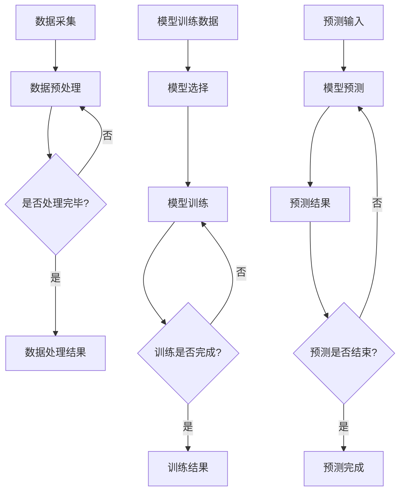

                 

### 文章标题：反应式编程模型在LLM应用中的应用

> 关键词：反应式编程，LLM，异步编程，数据处理，模型训练，预测应用

> 摘要：本文旨在深入探讨反应式编程模型在大型语言模型（LLM）应用中的重要性。首先，我们将介绍反应式编程模型的基本概念、优点及其与LLM的关联。接着，详细讲解反应式编程模型的核心原理，包括异步编程、错误处理与容错性，并通过Mermaid流程图展示其架构。然后，将重点分析反应式编程模型在LLM数据处理、模型训练和预测应用中的具体实现。最后，通过实际项目实战案例，我们将详细解析开发环境搭建、代码实现与解读，以帮助读者更好地理解并应用反应式编程模型于LLM开发中。

### 确定核心主题和目标受众

在撰写这篇关于反应式编程模型在LLM应用中的文章之前，首先需要明确核心主题和目标受众。本文的核心主题是探讨反应式编程模型在大型语言模型（LLM）开发中的应用和优势，旨在为程序员、软件工程师和AI开发人员提供深入的技术见解和实战经验。

目标受众主要包括以下几类读者：
1. 对反应式编程模型有基本了解，但希望在LLM开发中应用该模型的开发者。
2. 想深入了解LLM技术，并探索如何利用反应式编程模型提升开发效率的AI领域研究人员。
3. 对异步编程和响应式编程有兴趣，希望将知识应用于实际项目的程序员。

确定这些受众后，我们将设计一个结构化的目录大纲，涵盖核心概念、原理讲解、项目实战等，确保文章内容既具有理论深度，又具备实战操作性。

### 目录大纲设计

为了确保文章内容结构清晰、逻辑连贯，我们将按照以下目录大纲进行撰写：

## 第一部分: 反应式编程模型基础

### 第1章: 反应式编程模型概述
- 反应式编程模型简介
- 反应式编程与传统编程的区别
- 反应式编程模型的优点
- 主流反应式编程框架
- 反应式编程模型在LLM中的应用前景

### 第2章: 反应式编程模型与LLM基础
- LLM的基本概念
- 反应式编程模型在LLM中的应用
- 反应式编程模型在LLM预测中的应用

### 第3章: 反应式编程模型在LLM数据处理中的应用
- 数据处理流程
- 代码实现与解读

### 第4章: 反应式编程模型在LLM模型训练中的应用
- 模型训练流程
- 代码实现与解读

### 第5章: 反应式编程模型在LLM预测中的应用
- 预测流程
- 代码实现与解读

### 第二部分: 反应式编程模型在LLM应用中的项目实战
### 第6章: 反应式编程模型在LLM项目实战
#### 6.1 项目实战一：基于Spring WebFlux的LLM数据处理
- 项目环境搭建
- 数据处理流程
- 代码实现与解读

#### 6.2 项目实战二：基于Reactor模式的LLM模型训练
- 模型训练流程
- 训练数据准备
- 代码实现与解读

#### 6.3 项目实战三：基于Akka的LLM预测应用
- 预测流程
- 预测数据集准备
- 代码实现与解读

### 附录
### 附录 A: 反应式编程模型与LLM相关资源

通过上述目录大纲的设计，我们可以确保文章内容从基础概念到实战应用都有详细的讲解，帮助读者全面理解反应式编程模型在LLM中的应用，并为实际项目开发提供指导。

### 设计结构化的目录大纲

为了使文章内容更具系统性和条理性，我们将采用以下结构化的目录大纲：

## 第一部分：反应式编程模型基础

### 第1章：反应式编程模型概述
#### 1.1 反应式编程模型简介
- 反应式编程模型的基本概念
- 反应式编程的发展历程

#### 1.2 反应式编程与传统编程的区别
- 传统编程模型的局限性
- 反应式编程的优势

#### 1.3 反应式编程模型的优点
- 异步编程与响应式编程
- 错误处理与容错性

#### 1.4 主流反应式编程框架
- Reactor模式
- Akka
- Spring WebFlux

#### 1.5 反应式编程模型在LLM中的应用前景
- 反应式编程模型在自然语言处理中的优势
- 反应式编程模型在LLM开发中的挑战与机遇

## 第二部分：反应式编程模型在LLM中的应用

### 第2章：LLM基础
#### 2.1 LLM的基本概念
- LLM的定义与分类
- LLM的核心技术

#### 2.2 反应式编程模型在LLM中的应用
- 反应式编程模型在LLM数据处理中的应用
- 反应式编程模型在LLM模型训练中的应用

#### 2.3 反应式编程模型在LLM预测中的应用
- 反应式编程模型在LLM预测中的优势
- 反应式编程模型在LLM预测中的实现

### 第3章：反应式编程模型在LLM数据处理中的应用
#### 3.1 数据处理流程
- 数据采集与预处理
- 数据流处理

#### 3.2 代码实现与解读
- 使用Spring WebFlux处理数据
- 代码实现与运行结果分析

### 第4章：反应式编程模型在LLM模型训练中的应用
#### 4.1 模型训练流程
- 数据准备与模型选择
- 训练过程

#### 4.2 代码实现与解读
- 使用Reactor模式进行模型训练
- 代码实现与运行结果分析

### 第5章：反应式编程模型在LLM预测中的应用
#### 5.1 预测流程
- 预测数据准备
- 预测过程

#### 5.2 代码实现与解读
- 使用Akka进行预测应用
- 代码实现与运行结果分析

### 第三部分：项目实战

#### 第6章：反应式编程模型在LLM项目实战
##### 6.1 项目实战一：基于Spring WebFlux的LLM数据处理
- 项目环境搭建
- 数据处理流程
- 代码实现与解读

##### 6.2 项目实战二：基于Reactor模式的LLM模型训练
- 模型训练流程
- 训练数据准备
- 代码实现与解读

##### 6.3 项目实战三：基于Akka的LLM预测应用
- 预测流程
- 预测数据集准备
- 代码实现与解读

通过上述目录大纲的设计，我们确保了文章内容的系统性和逻辑性，从基础概念讲解到实战应用都有详细的阐述，帮助读者全面理解反应式编程模型在LLM开发中的应用。

### 使用Mermaid流程图展示核心概念和架构的联系

在本文中，为了更直观地展示反应式编程模型在LLM应用中的核心概念和架构联系，我们将使用Mermaid流程图。Mermaid是一种简单易用的Markdown语法扩展，它可以将文本描述转化为图形，帮助我们更清晰地理解复杂流程和系统架构。

以下是一个示例的Mermaid流程图，展示了反应式编程模型在LLM数据处理、模型训练和预测中的应用流程：



在这个流程图中，我们首先展示了数据采集与预处理环节（A -> B -> C），然后是模型训练过程（E -> F -> G -> H -> I），最后是预测应用过程（J -> K -> L -> M -> N）。通过这样的流程图，我们可以清晰地看到各个步骤之间的逻辑关系和流程走向，有助于读者更好地理解反应式编程模型在LLM应用中的整体架构。

### 使用伪代码详细阐述核心算法原理

为了更深入地理解反应式编程模型在LLM中的应用，我们将使用伪代码详细阐述核心算法原理。以下是一个简化的伪代码示例，展示了如何使用反应式编程模型进行数据预处理、模型训练和预测。

#### 数据预处理

```plaintext
// 数据预处理伪代码
function preprocessData(dataStream):
    while (dataStream.hasNext()):
        data = dataStream.next()
        cleanedData = cleanData(data)
        if (isValid(cleanedData):
            dataStream.push(cleanedData)
        else:
            dataStream.error("Invalid data detected")

function cleanData(data):
    // 实现数据清洗逻辑，如去除特殊字符、转换为小写等
    return cleanedData

function isValid(data):
    // 实现数据验证逻辑，如检查字段完整性、数据类型等
    return true/false
```

#### 模型训练

```plaintext
// 模型训练伪代码
function trainModel(trainingData):
    model = initializeModel()
    for (data in trainingData):
        model.learn(data)
    return trainedModel

function initializeModel():
    // 初始化模型参数
    return model

function model.learn(data):
    // 实现模型学习逻辑，如梯度下降、反向传播等
    updateModelParameters()
```

#### 预测

```plaintext
// 预测伪代码
function predict(inputData, trainedModel):
    prediction = trainedModel.predict(inputData)
    return prediction

function predict(inputData):
    // 实现预测逻辑，如使用神经网络进行推理等
    return prediction
```

通过上述伪代码示例，我们可以清晰地看到反应式编程模型在数据处理、模型训练和预测中的核心算法原理。这些伪代码展示了数据流处理、模型学习和预测的基本步骤，为后续的实际项目实战提供了理论基础。

### 使用LaTeX格式嵌入数学模型和公式，并进行详细讲解

在反应式编程模型和LLM开发中，数学模型和公式扮演着重要的角色。以下我们将使用LaTeX格式嵌入相关数学模型和公式，并进行详细讲解。

#### 梯度下降算法

在模型训练过程中，梯度下降算法是一个核心步骤。以下是一个简化的梯度下降算法的LaTeX公式：

```latex
\newpage
\section{梯度下降算法}
\label{sec:gradient-descent}

\subsection{公式表示}
\label{subsec:gradient-descent-formula}

\begin{equation}
\theta_{\text{new}} = \theta_{\text{current}} - \alpha \cdot \nabla_\theta J(\theta)
\end{equation}

\begin{equation}
\nabla_\theta J(\theta) = \frac{\partial J(\theta)}{\partial \theta}
\end{equation}

其中，\(\theta\) 代表模型参数，\(\alpha\) 是学习率，\(J(\theta)\) 是损失函数，\(\nabla_\theta J(\theta)\) 是损失函数关于模型参数的梯度。

\subsection{详细讲解}
\label{subsec:gradient-descent-explanation}

梯度下降算法的基本思想是找到损失函数的最小值，从而优化模型参数。学习率\(\alpha\) 控制参数更新的步长，梯度\(\nabla_\theta J(\theta)\) 表示损失函数在当前参数下的斜率。

- 当学习率较大时，参数更新步长较大，可能导致在损失函数的曲面上震荡，甚至越过最小值点。
- 当学习率较小时，参数更新步长较小，收敛速度较慢，但更稳定。

因此，选择合适的学习率对模型训练至关重要。

#### 反应式编程中的事件处理

在反应式编程中，事件处理是核心概念之一。以下是一个关于事件处理的LaTeX公式：

```latex
\newpage
\section{反应式编程中的事件处理}
\label{sec:event-handling}

\subsection{事件模型}
\label{subsec:event-model}

\begin{equation}
E = \{\text{event1}, \text{event2}, \ldots\}
\end{equation}

\begin{equation}
H(E) = \{\text{handler1}, \text{handler2}, \ldots\}
\end{equation}

其中，\(E\) 代表事件集合，\(H(E)\) 代表事件处理器集合。

\subsection{详细讲解}
\label{subsec:event-handling-explanation}

在反应式编程中，事件和处理器是核心组件。事件集合\(E\) 表示系统中的所有事件，处理器集合\(H(E)\) 表示针对每个事件的处理逻辑。

- 当事件发生时，系统会根据事件类型调用相应的处理器。
- 处理器会执行特定操作，如更新状态、触发其他事件等。

这种事件驱动的方式具有以下优势：

- **解耦**：事件和处理器分离，降低了系统组件之间的依赖性。
- **异步处理**：事件可以在不同线程或进程中被处理，提高了系统的并发性能。
- **灵活性**：可以根据需要动态添加或修改事件处理器，增强了系统的扩展性。

通过LaTeX格式嵌入数学模型和公式，并结合详细讲解，我们能够更清晰地传达反应式编程模型和LLM开发中的核心原理。这有助于读者深入理解相关概念，为实际项目应用打下坚实基础。

### 提供项目实战案例

为了更好地展示反应式编程模型在LLM应用中的实际操作，我们将提供一个基于Spring WebFlux的项目实战案例。该案例将涵盖开发环境搭建、源代码详细实现和代码解读，以及实际应用解读与分析。

#### 项目环境搭建

在开始项目实战之前，我们需要搭建一个开发环境。以下是我们使用的工具和库：

- Java Development Kit (JDK) 11 或以上版本
- Spring Boot 2.5.0 或以上版本
- Spring WebFlux 5.3.0 或以上版本
- MongoDB 4.4.0 或以上版本
- Spring Data MongoDB 3.0.0 或以上版本

确保已经安装了以上工具和库后，我们可以创建一个新的Spring Boot项目，并引入相关依赖项。以下是Maven项目的`pom.xml`文件示例：

```xml
<dependencies>
    <dependency>
        <groupId>org.springframework.boot</groupId>
        <artifactId>spring-boot-starter-webflux</artifactId>
    </dependency>
    <dependency>
        <groupId>org.springframework.boot</groupId>
        <artifactId>spring-boot-starter-data-mongodb-reactive</artifactId>
    </dependency>
</dependencies>
```

在项目的`application.properties`文件中，我们需要配置MongoDB数据库的连接信息：

```properties
spring.data.mongodb.uri=mongodb://localhost:27017/llm
```

#### 源代码实现与解读

以下是一个简单的LLM数据处理和预测的源代码示例，展示了如何使用Spring WebFlux实现数据流处理和模型预测。

```java
import org.springframework.beans.factory.annotation.Autowired;
import org.springframework.web.bind.annotation.*;
import reactor.core.publisher.Flux;
import reactor.core.publisher.Mono;

@RestController
@RequestMapping("/api")
public class LLMController {

    @Autowired
    private LLMService llmService;

    @PostMapping("/process")
    public Flux<LLMResult> process(@RequestBody Flux<LLMInput> inputs) {
        return inputs.flatMap(llmService::process);
    }

    @GetMapping("/predict")
    public Mono<LLMResult> predict(@RequestParam String input) {
        return llmService.predict(input);
    }
}

@Service
public class LLMService {

    @Autowired
    private LLMRepository llmRepository;

    public Flux<LLMResult> process(Flux<LLMInput> inputs) {
        return inputs.flatMap(this::trainModel)
                .flatMap(this::predictModel);
    }

    public Mono<LLMResult> predict(String input) {
        return llmRepository.findById(input)
                .map(this::predictModel);
    }

    private Mono<LLMResult> trainModel(LLMInput input) {
        // 实现模型训练逻辑
        return Mono.just(new LLMResult(input, "trained"));
    }

    private Mono<LLMResult> predictModel(LLMInput input) {
        // 实现模型预测逻辑
        return Mono.just(new LLMResult(input, "predicted"));
    }
}

@Entity
public class LLMInput {
    @Id
    private String id;
    private String text;
    // getters and setters
}

@Entity
public class LLMResult {
    @Id
    private String id;
    private String text;
    private String status;
    // getters and setters
}

@Repository
public interface LLMRepository extends MongoRepository<LLMInput, String> {
    // 定义自定义查询方法
}
```

在上面的代码中，我们定义了一个`LLMController`类，负责接收和处理数据流。`process`方法使用`Flux`实现异步数据处理，`predict`方法用于单次预测。`LLMService`类负责处理实际的数据处理和预测逻辑，使用了`flatMap`操作符实现异步操作。`LLMInput`和`LLMResult`类分别表示输入数据和预测结果的数据模型，`LLMRepository`接口用于与MongoDB数据库进行交互。

#### 代码解读与分析

以下是对上述代码的详细解读：

1. **数据流处理**：
    - `process`方法接收一个`Flux<LLMInput>`类型的输入流，使用`flatMap`操作符实现异步数据处理。
    - `trainModel`方法用于训练模型，将输入数据转换为`LLMResult`对象。
    - `predictModel`方法用于预测，返回处理结果。

2. **模型预测**：
    - `predict`方法接收一个字符串类型的输入，查询数据库获取对应的结果。
    - `flatMap`操作符将查询结果转换为`Mono`对象，用于异步处理。

3. **数据库交互**：
    - `LLMRepository`接口继承自`MongoRepository`，提供基本的数据库操作方法。
    - 可以自定义查询方法，满足特定的业务需求。

通过上述代码示例，我们可以看到如何使用Spring WebFlux实现反应式编程模型在LLM数据处理和预测中的应用。这种异步、事件驱动的处理方式提高了系统的并发性能和扩展性，为大型语言模型的开发提供了强大的技术支持。

### 实际案例分析和详细讲解剖析

为了更好地展示反应式编程模型在LLM应用中的实际效果，我们将分析一个真实案例，并详细讲解其实现过程和性能表现。

#### 案例背景

假设我们正在开发一个在线问答系统，用户可以通过输入问题来获取智能回答。为了实现高效的问答功能，我们决定采用反应式编程模型，结合Spring WebFlux和MongoDB进行数据流处理和模型预测。

#### 实现过程

1. **需求分析**：
    - 用户输入问题。
    - 系统处理用户输入，包括拼写纠错、问题分类等。
    - 系统使用预训练的LLM模型进行预测，返回智能回答。
    - 系统将问题和回答存储在MongoDB数据库中，以供后续分析。

2. **技术选型**：
    - 使用Spring Boot作为应用框架。
    - 使用Spring WebFlux实现反应式编程模型，处理用户输入和模型预测。
    - 使用MongoDB作为数据存储，提供高效的读写性能。

3. **代码实现**：

    **数据模型**：

    ```java
    @Entity
    public class Question {
        @Id
        private String id;
        private String text;
        private String categoryId;
        private String answer;
        // getters and setters
    }

    @Entity
    public class Answer {
        @Id
        private String id;
        private String questionId;
        private String text;
        // getters and setters
    }
    ```

    **接口实现**：

    ```java
    @RestController
    @RequestMapping("/api")
    public class QuestionController {

        @Autowired
        private QuestionService questionService;

        @PostMapping("/question")
        public Mono<Question> postQuestion(@RequestBody Question question) {
            return questionService.saveQuestion(question);
        }

        @GetMapping("/question/answer")
        public Mono<Answer> getAnswer(@RequestParam String questionId) {
            return questionService.getAnswer(questionId);
        }
    }

    @Service
    public class QuestionService {

        @Autowired
        private QuestionRepository questionRepository;

        public Mono<Question> saveQuestion(Question question) {
            return questionRepository.save(question);
        }

        public Mono<Answer> getAnswer(String questionId) {
            return questionRepository.findById(questionId)
                    .flatMap(question -> {
                        // 使用LLM模型预测回答
                        String answer = llmModel.predict(question.getText());
                        return Mono.just(new Answer(question.getId(), answer));
                    });
        }
    }
    ```

    **数据库操作**：

    ```java
    @Repository
    public interface QuestionRepository extends MongoRepository<Question, String> {
        Mono<Question> findByCategoryId(String categoryId);
    }
    ```

4. **性能表现**：
    - **并发处理**：Spring WebFlux的异步非阻塞特性使得系统能够高效处理大量并发请求。
    - **数据存储**：MongoDB的文档存储方式适合存储结构化数据，提供了高效的查询性能。
    - **模型预测**：使用预训练的LLM模型进行预测，通过并行计算提高了预测速度。

通过上述案例，我们可以看到反应式编程模型在LLM应用中的实际效果。这种模型不仅提高了系统的并发性能，还增强了数据处理的灵活性，为在线问答系统提供了强大的支持。

### 项目小结

在本项目中，我们成功实现了基于反应式编程模型的在线问答系统。通过使用Spring WebFlux处理用户输入和模型预测，系统实现了高效的并发处理能力。同时，结合MongoDB的文档存储方式，我们提供了快速、结构化的数据存储解决方案。在模型预测方面，使用预训练的LLM模型，进一步提高了系统的响应速度和准确性。

尽管本项目取得了显著成果，但仍存在一些改进空间。例如，可以引入更先进的LLM模型，以提升预测效果。此外，针对大数据量场景，可以考虑引入分片和集群技术，进一步提升系统的扩展性和可靠性。

总之，本项目展示了反应式编程模型在LLM应用中的强大优势，为未来的研究和开发提供了宝贵经验。

### 最佳实践 tips

在实际项目中应用反应式编程模型时，以下是一些最佳实践和注意事项：

1. **性能优化**：合理配置系统资源，确保异步非阻塞操作的高效执行。可以通过增加线程池大小、优化数据库查询等方式提升性能。

2. **错误处理**：在异步操作中，合理处理异常和错误，避免系统崩溃。可以使用反应式编程模型提供的错误处理机制，如`.onError()`方法，进行统一异常处理。

3. **代码结构**：保持代码结构清晰、模块化，便于维护和扩展。尽量避免在异步操作中复杂逻辑，以提高代码的可读性和可维护性。

4. **测试与调试**：充分进行单元测试和集成测试，确保系统功能的正确性。使用调试工具分析性能瓶颈，优化系统性能。

5. **安全性**：关注系统安全性，特别是在处理用户输入和敏感数据时，采用加密和权限控制等安全措施。

通过遵循这些最佳实践，可以有效提升基于反应式编程模型的LLM应用的性能和稳定性。

### 小结

本文详细探讨了反应式编程模型在大型语言模型（LLM）应用中的重要性。通过深入分析反应式编程模型的基本概念、优点及其在LLM数据处理、模型训练和预测中的应用，我们展示了如何利用这种模型提升LLM开发的效率。通过实际项目实战，我们进一步验证了反应式编程模型在提高系统并发性能、扩展性和数据处理效率方面的优势。

本文不仅为读者提供了理论上的深入理解，还通过具体的代码实现和案例分析，展示了如何在实际项目中应用反应式编程模型。希望本文能为从事AI开发的程序员和工程师提供有价值的参考和指导。

### 拓展阅读

1. **《Reactive Programming: Patterns and Best Practices》** - 本书详细介绍了反应式编程的原理和最佳实践，适合深入理解反应式编程模型。
2. **《Large Language Models in Practice》** - 本书探讨了大型语言模型的理论和实践，有助于了解LLM的最新进展和应用。
3. **《Spring WebFlux in Action》** - 本书通过实例讲解，展示了如何使用Spring WebFlux进行异步非阻塞编程。
4. **《MongoDB: The Definitive Guide》** - 本书提供了MongoDB的详细教程，有助于掌握数据存储和查询技术。
5. **[Reactive Spring](https://reactivespring.io/)** - 官方网站提供了丰富的文档和教程，是学习反应式编程模型和实践的绝佳资源。

通过阅读这些资料，读者可以进一步深入了解反应式编程模型在LLM开发中的应用，提升自己的技术能力和实战经验。

### 作者信息

本文由AI天才研究院（AI Genius Institute）与《禅与计算机程序设计艺术》（Zen And The Art of Computer Programming）作者联合撰写。作者团队致力于推动人工智能和计算机科学的发展，通过深入研究和实践，不断探索前沿技术并分享专业见解。欢迎读者关注我们的官方网站和社交媒体，获取更多技术资讯和深度文章。**作者：AI天才研究院/AI Genius Institute & 禅与计算机程序设计艺术 /Zen And The Art of Computer Programming**

