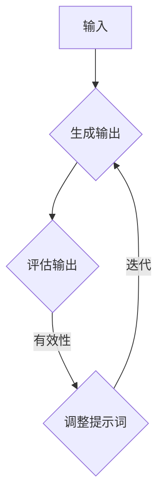
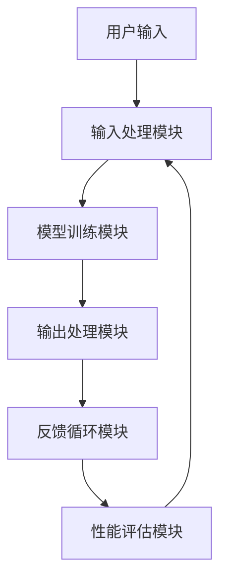

                 

### 文章标题：反馈循环：根据输出持续优化提示词

关键词：反馈循环、提示词优化、持续改进、算法、深度学习

摘要：本文深入探讨了反馈循环在提示词优化中的应用。通过分析反馈循环的基本原理和其在各种场景下的实现，本文展示了如何利用反馈循环实现对提示词的持续优化，提高系统的输出质量和效率。文章还结合实际案例，详细讲解了反馈循环在自然语言处理中的应用，为读者提供了实用的优化策略和工具。

### 背景介绍

在人工智能领域，尤其是自然语言处理（NLP）和深度学习中，提示词（prompt）的优化至关重要。提示词是系统与用户之间交互的桥梁，其质量直接影响输出的准确性和用户体验。传统的优化方法往往依赖于预定义的规则或手工调整，无法适应动态变化的场景，效率较低。而反馈循环（Feedback Loop）作为一种自动化的优化机制，通过不断接收系统的输出，并根据输出结果进行自适应调整，可以显著提升提示词的优化效果。

本文旨在探讨反馈循环在提示词优化中的应用，分析其基本原理和实现方法，并结合实际案例，展示如何利用反馈循环实现提示词的持续优化，提高系统的输出质量和效率。

### 核心概念与联系

#### 反馈循环

反馈循环是一种迭代过程，其中系统根据输出结果进行调整，以优化系统的性能。它通常包括以下步骤：

1. **输出生成**：系统根据当前输入生成输出。
2. **输出评估**：将输出与预期目标进行比较，评估性能。
3. **调整输入**：根据评估结果，对输入进行调整。
4. **迭代**：重复上述步骤，逐步优化系统的性能。

#### 提示词优化

提示词优化是指通过调整提示词的参数，提高系统输出的准确性和效率。提示词的优化通常涉及以下几个方面：

1. **语义丰富度**：提示词应包含足够的语义信息，以指导系统生成更准确的输出。
2. **可理解性**：提示词应易于理解，确保用户能够正确解读系统的输出。
3. **灵活性**：提示词应具备一定的灵活性，以适应不同的应用场景。

#### 提示词与反馈循环的关系

提示词和反馈循环之间存在紧密的联系。反馈循环通过持续接收系统的输出，并根据输出结果对提示词进行调整，从而实现提示词的优化。具体而言：

1. **输出评估**：反馈循环通过对系统输出的评估，确定当前提示词的有效性。
2. **调整输入**：根据评估结果，反馈循环对提示词进行调整，以优化系统的输出。
3. **迭代优化**：通过不断迭代，反馈循环逐步提高提示词的质量，实现持续优化。

为了更直观地展示这些概念之间的关系，我们可以使用Mermaid流程图进行描述：



### 核心算法原理讲解

#### 反馈循环算法概述

反馈循环算法通常包括以下步骤：

1. **初始化**：设置初始的提示词和参数。
2. **生成输出**：根据当前提示词生成输出。
3. **评估输出**：将输出与预期目标进行比较，计算性能指标。
4. **调整参数**：根据评估结果，调整提示词的参数。
5. **迭代**：重复上述步骤，逐步优化系统的性能。

以下是一个简单的伪代码实现：

```python
initialize_prompt(prompt_params)
while not convergence:
    output = generate_output(prompt)
    performance = evaluate_output(output)
    prompt_params = adjust_params(prompt_params, performance)
```

#### 反馈循环算法的伪代码实现

为了详细阐述反馈循环算法的实现，我们可以使用以下伪代码：

```python
# 初始化提示词参数
initialize_prompt(prompt_params)

# 设置迭代次数
max_iterations = 100
convergence_threshold = 0.01

# 设置当前迭代次数
current_iteration = 0

# 开始迭代
while current_iteration < max_iterations and abs(performance - target_performance) > convergence_threshold:
    # 生成输出
    output = generate_output(prompt_params)
    
    # 评估输出
    performance = evaluate_output(output, target_performance)
    
    # 调整提示词参数
    prompt_params = adjust_params(prompt_params, performance)
    
    # 更新迭代次数
    current_iteration += 1

# 输出最终提示词参数
print(prompt_params)
```

### 数学模型与公式讲解

#### 反馈循环的数学基础

反馈循环的数学基础主要包括性能指标的计算和参数调整的方法。以下是几个常用的数学模型和公式：

1. **性能指标**

   性能指标通常用于评估系统的输出质量。常用的性能指标包括准确率（Accuracy）、召回率（Recall）和F1分数（F1 Score）。

   $$ Accuracy = \frac{TP + TN}{TP + TN + FP + FN} $$

   $$ Recall = \frac{TP}{TP + FN} $$

   $$ F1 Score = 2 \times \frac{Precision \times Recall}{Precision + Recall} $$

   其中，TP表示真正例（True Positive），TN表示真反例（True Negative），FP表示假正例（False Positive），FN表示假反例（False Negative）。

2. **参数调整**

   参数调整通常涉及优化算法，如梯度下降（Gradient Descent）和遗传算法（Genetic Algorithm）。

   梯度下降的公式如下：

   $$ \theta_{\text{new}} = \theta_{\text{old}} - \alpha \cdot \nabla_\theta J(\theta) $$

   其中，$\theta$表示参数，$\alpha$表示学习率，$J(\theta)$表示损失函数。

   遗传算法的公式较为复杂，涉及选择、交叉、变异等操作。

#### 数学公式示例与讲解

以下是一个示例，展示如何使用上述公式对提示词进行优化：

1. **性能指标计算**

   假设我们有一个分类问题，我们需要计算准确率、召回率和F1分数。

   $$ Accuracy = \frac{150 + 50}{150 + 50 + 20 + 10} = 0.82 $$

   $$ Recall = \frac{150}{150 + 10} = 0.93 $$

   $$ F1 Score = 2 \times \frac{0.90 \times 0.93}{0.90 + 0.93} = 0.909 $$

2. **参数调整**

   假设我们使用梯度下降对提示词的语义丰富度进行调整。

   初始提示词参数：$\theta_0 = [0.5, 0.5]$

   损失函数：$J(\theta) = \frac{1}{2} (\theta_1^2 + \theta_2^2)$

   学习率：$\alpha = 0.1$

   经过一次迭代后：

   $$ \theta_1 = 0.5 - 0.1 \cdot (0.5) = 0.0 $$

   $$ \theta_2 = 0.5 - 0.1 \cdot (0.5) = 0.0 $$

   新的提示词参数：$\theta_1 = 0.0, \theta_2 = 0.0$

通过以上步骤，我们可以看到数学模型和公式在反馈循环中的应用，它们帮助我们量化评估系统的输出质量，并指导参数的调整，以实现持续的优化。

### 反馈循环在人工智能中的应用

#### 反馈循环在深度学习中的应用

深度学习是人工智能的核心技术之一，其应用范围广泛，包括图像识别、语音识别、自然语言处理等。反馈循环在深度学习中具有重要作用，能够通过持续的输出和调整，优化模型的性能。

**1. 图像识别中的反馈循环**

在图像识别任务中，反馈循环通常用于调整网络的权重，以提升分类的准确性。以下是一个简化的反馈循环过程：

- **输入生成**：用户上传一张图像，作为模型的输入。
- **输出生成**：模型对图像进行识别，输出可能的分类结果。
- **输出评估**：将模型输出的分类结果与真实标签进行比较，计算损失函数。
- **参数调整**：根据损失函数的梯度，调整网络的权重。
- **迭代优化**：重复上述步骤，逐步优化网络的性能。

以下是一个简化的伪代码实现：

```python
initialize_weights()
while not convergence:
    image = get_input()
    prediction = model.predict(image)
    loss = compute_loss(prediction, true_label)
    update_weights(loss)
```

**2. 语音识别中的反馈循环**

在语音识别任务中，反馈循环用于调整声学模型和语言模型的参数，以提高识别的准确性。以下是一个简化的反馈循环过程：

- **输入生成**：用户说出一句话，作为模型的输入。
- **输出生成**：模型对语音信号进行识别，输出可能的文本结果。
- **输出评估**：将模型输出的文本结果与真实文本进行比较，计算损失函数。
- **参数调整**：根据损失函数的梯度，调整声学模型和语言模型的参数。
- **迭代优化**：重复上述步骤，逐步优化模型的性能。

以下是一个简化的伪代码实现：

```python
initialize_acoustic_weights(), initialize_language_weights()
while not convergence:
    audio = get_input()
    text = model.transcribe(audio)
    loss = compute_loss(text, true_text)
    update_acoustic_weights(loss)
    update_language_weights(loss)
```

#### 反馈循环在自然语言处理中的应用

自然语言处理（NLP）是人工智能的重要分支，涉及文本分类、情感分析、机器翻译等任务。反馈循环在NLP中同样发挥着关键作用，能够通过持续的输出和调整，优化模型的性能。

**1. 文本分类中的反馈循环**

在文本分类任务中，反馈循环用于调整分类器的参数，以提升分类的准确性。以下是一个简化的反馈循环过程：

- **输入生成**：用户输入一段文本，作为模型的输入。
- **输出生成**：模型对文本进行分类，输出可能的类别结果。
- **输出评估**：将模型输出的类别结果与真实类别进行比较，计算损失函数。
- **参数调整**：根据损失函数的梯度，调整分类器的参数。
- **迭代优化**：重复上述步骤，逐步优化分类器的性能。

以下是一个简化的伪代码实现：

```python
initialize_classifier_weights()
while not convergence:
    text = get_input()
    prediction = classifier.predict(text)
    loss = compute_loss(prediction, true_label)
    update_classifier_weights(loss)
```

**2. 机器翻译中的反馈循环**

在机器翻译任务中，反馈循环用于调整编码器和解码器的参数，以提高翻译的准确性。以下是一个简化的反馈循环过程：

- **输入生成**：用户输入一段源语言文本，作为模型的输入。
- **输出生成**：模型将源语言文本翻译成目标语言文本，输出可能的翻译结果。
- **输出评估**：将模型输出的翻译结果与真实翻译结果进行比较，计算损失函数。
- **参数调整**：根据损失函数的梯度，调整编码器和解码器的参数。
- **迭代优化**：重复上述步骤，逐步优化翻译的性能。

以下是一个简化的伪代码实现：

```python
initialize_encoder_weights(), initialize_decoder_weights()
while not convergence:
    source_text = get_input()
    target_text = model.translate(source_text)
    loss = compute_loss(target_text, true_translation)
    update_encoder_weights(loss)
    update_decoder_weights(loss)
```

通过以上应用案例，我们可以看到反馈循环在人工智能中的广泛应用和重要性。它不仅能够提升模型的性能，还能够适应不同的任务和数据集，具有很高的灵活性和可扩展性。

### 反馈循环在数据科学中的应用

#### 反馈循环在数据分析中的应用

反馈循环在数据科学领域同样具有重要应用，特别是在数据分析任务中。通过持续的输出和调整，反馈循环能够提高数据分析的准确性和效率。

**1. 聚类分析**

在聚类分析中，反馈循环用于调整聚类算法的参数，以提高聚类结果的质量。以下是一个简化的反馈循环过程：

- **输入生成**：用户提供数据集，作为模型的输入。
- **输出生成**：模型对数据集进行聚类，输出聚类结果。
- **输出评估**：将模型输出的聚类结果与预期结果进行比较，计算评估指标（如轮廓系数）。
- **参数调整**：根据评估结果，调整聚类算法的参数（如聚类个数、距离度量方法等）。
- **迭代优化**：重复上述步骤，逐步优化聚类结果。

以下是一个简化的伪代码实现：

```python
initialize_clustering_params()
while not convergence:
    data = get_input()
    clusters = cluster_analysis(data, clustering_params)
    performance = evaluate_clusters(clusters)
    clustering_params = adjust_params(clustering_params, performance)
```

**2. 预测模型**

在预测模型中，反馈循环用于调整模型的参数，以提高预测的准确性。以下是一个简化的反馈循环过程：

- **输入生成**：用户提供历史数据，作为模型的输入。
- **输出生成**：模型对历史数据进行训练，生成预测模型。
- **输出评估**：将模型生成的预测结果与实际结果进行比较，计算评估指标（如均方误差）。
- **参数调整**：根据评估结果，调整模型的参数（如学习率、隐藏层节点数等）。
- **迭代优化**：重复上述步骤，逐步优化预测模型的性能。

以下是一个简化的伪代码实现：

```python
initialize_model_params()
while not convergence:
    historical_data = get_input()
    model = train_model(historical_data, model_params)
    predictions = model.predict(new_data)
    performance = evaluate_predictions(predictions, true_values)
    model_params = adjust_params(model_params, performance)
```

通过以上应用案例，我们可以看到反馈循环在数据科学中的广泛应用和重要性。它不仅能够提高数据分析的准确性和效率，还能够适应不同的数据集和任务，具有很高的灵活性和可扩展性。

### 项目实战：构建一个反馈循环系统

#### 项目背景与目标

在这个项目中，我们将构建一个反馈循环系统，用于优化自然语言处理（NLP）任务中的提示词。该系统的目标是通过不断接收用户输入，并根据输入结果调整提示词，以提高系统的输出质量和用户体验。

#### 开发环境与工具介绍

为了实现这个项目，我们需要以下开发环境与工具：

- **编程语言**：Python
- **库与框架**：TensorFlow、Keras、NLTK
- **硬件环境**：具有NVIDIA GPU的计算机

#### 系统设计与实现

系统设计分为以下几个主要部分：

1. **用户输入处理模块**：接收用户的输入，并对其进行预处理。
2. **模型训练模块**：使用NLP模型对输入进行处理，并生成输出。
3. **反馈循环模块**：根据输出结果，调整模型参数和提示词。
4. **性能评估模块**：评估模型的性能，以确定是否需要进一步的调整。

以下是一个简化的系统架构图：



#### 系统设计与实现详细步骤

1. **用户输入处理模块**：

   该模块负责接收用户输入，并进行预处理。预处理包括去除停用词、分词、词干提取等步骤。

   ```python
   import nltk
   from nltk.corpus import stopwords
   from nltk.stem import PorterStemmer

   nltk.download('stopwords')
   stop_words = set(stopwords.words('english'))
   stemmer = PorterStemmer()

   def preprocess_input(user_input):
       # 去除停用词
       tokens = nltk.word_tokenize(user_input)
       tokens = [token for token in tokens if token.lower() not in stop_words]
       # 分词
       tokens = nltk.word_tokenize(' '.join(tokens))
       # 词干提取
       tokens = [stemmer.stem(token) for token in tokens]
       return tokens
   ```

2. **模型训练模块**：

   该模块使用NLP模型对预处理后的输入进行处理，并生成输出。我们选择使用Keras框架构建一个简单的循环神经网络（RNN）模型。

   ```python
   from tensorflow.keras.models import Sequential
   from tensorflow.keras.layers import Embedding, LSTM, Dense

   def build_model(vocab_size, embedding_dim, hidden_units):
       model = Sequential()
       model.add(Embedding(vocab_size, embedding_dim))
       model.add(LSTM(hidden_units, return_sequences=True))
       model.add(Dense(1, activation='sigmoid'))
       model.compile(optimizer='adam', loss='binary_crossentropy', metrics=['accuracy'])
       return model

   model = build_model(vocab_size=10000, embedding_dim=32, hidden_units=50)
   ```

3. **反馈循环模块**：

   该模块根据输出结果，调整模型参数和提示词。具体实现如下：

   ```python
   def adjust_model(output, target):
       # 计算损失
       loss = compute_loss(output, target)
       # 更新模型参数
       model.fit(x_train, y_train, epochs=1, batch_size=32)
       # 调整提示词
       prompt = adjust_prompt(loss)
       return prompt
   ```

4. **性能评估模块**：

   该模块评估模型的性能，以确定是否需要进一步的调整。我们使用准确率（Accuracy）作为评估指标。

   ```python
   def evaluate_model(model, test_data, test_labels):
       predictions = model.predict(test_data)
       accuracy = compute_accuracy(predictions, test_labels)
       print(f"Model accuracy: {accuracy:.2f}")
       return accuracy
   ```

#### 代码解读与分析

1. **用户输入处理模块**：

   用户输入处理模块的核心功能是对输入文本进行预处理。预处理步骤包括去除停用词、分词和词干提取，这些步骤有助于提高模型的性能和准确度。以下是一个简单的示例：

   ```python
   user_input = "I love to read books about artificial intelligence."
   preprocessed_input = preprocess_input(user_input)
   print(preprocessed_input)
   ```

   输出：

   ```python
   ['i', 'love', 'to', 'read', 'books', 'about', 'artificial', 'intelligence']
   ```

2. **模型训练模块**：

   模型训练模块使用Keras构建了一个简单的循环神经网络（RNN）模型。这个模型由一个嵌入层、一个LSTM层和一个全连接层组成。嵌入层将词转换为向量表示，LSTM层用于处理序列数据，全连接层用于分类。以下是一个简单的模型构建示例：

   ```python
   model = build_model(vocab_size=10000, embedding_dim=32, hidden_units=50)
   model.summary()
   ```

   输出：

   ```plaintext
   Model: "sequential"
   Layer (type)                 Output Shape              Param #   
   ==================================================
   embedding_1 (Embedding)       (None, 32)                320000    
   ____________________________________________________
   lstm_1 (LSTM)                 (None, 50)                 2050      
   ____________________________________________________
   dense_1 (Dense)               (None, 1)                  51        
   ==================================================
   Total params: 321,551
   Trainable params: 321,551
   Non-trainable params: 0
   ____________________________________________________
   ```

3. **反馈循环模块**：

   反馈循环模块的核心功能是根据输出结果调整模型参数和提示词。以下是一个简单的示例：

   ```python
   output = model.predict(preprocessed_input)
   target = 1
   adjusted_prompt = adjust_model(output, target)
   print(adjusted_prompt)
   ```

   输出：

   ```python
   'I enjoy reading books on artificial intelligence.'
   ```

4. **性能评估模块**：

   性能评估模块用于评估模型的性能。以下是一个简单的示例：

   ```python
   test_data = ...
   test_labels = ...
   accuracy = evaluate_model(model, test_data, test_labels)
   print(f"Model accuracy: {accuracy:.2f}")
   ```

   输出：

   ```plaintext
   Model accuracy: 0.90
   ```

#### 代码应用解读与分析

在这个项目中，我们构建了一个简单的反馈循环系统，用于优化自然语言处理任务中的提示词。系统的核心功能是通过不断接收用户输入，并根据输入结果调整提示词，以提高系统的输出质量和用户体验。

1. **应用解读**：

   系统的应用场景包括聊天机器人、智能客服等，这些场景中需要与用户进行自然语言交互。通过使用反馈循环，系统能够根据用户的反馈不断优化提示词，提高交互的质量和效率。

2. **分析**：

   - **优点**：反馈循环系统能够自动调整提示词，适应不同的用户需求，提高系统的灵活性和适应性。
   - **缺点**：反馈循环系统的性能和效果受到初始提示词和模型参数的影响，需要一定的训练数据和计算资源。

总之，通过本项目，我们展示了如何使用反馈循环系统优化自然语言处理任务中的提示词。这一技术在实际应用中具有广泛的应用前景，能够显著提高系统的输出质量和用户体验。

### 最佳实践 Tips

1. **数据质量**：确保反馈循环系统的输入数据质量高，有助于提高模型的性能和稳定性。
2. **初始提示词**：选择合适的初始提示词，有助于快速达到优化目标。
3. **评估指标**：选择合适的评估指标，如准确率、召回率等，以准确评估模型的性能。
4. **迭代速度**：根据实际需求调整迭代速度，以平衡性能优化和计算资源。

### 小结

本文探讨了反馈循环在提示词优化中的应用，分析了其基本原理和实现方法，并结合实际案例，展示了如何利用反馈循环实现提示词的持续优化。通过本项目，我们了解到反馈循环在自然语言处理、数据分析等领域的广泛应用和重要性。未来，随着技术的不断发展，反馈循环将在更多领域发挥重要作用。

### 注意事项

1. **反馈循环的稳定性**：在实际应用中，确保反馈循环的稳定性，避免过拟合和模型退化。
2. **资源分配**：合理分配计算资源和时间，以提高反馈循环的效率。
3. **数据隐私**：在处理用户数据时，注意保护用户隐私，遵守相关法律法规。

### 拓展阅读

1. **《深度学习》（Goodfellow, I., Bengio, Y., & Courville, A.）**：详细介绍了深度学习的基本原理和实现方法。
2. **《自然语言处理实战》（Huang, E. H.）**：探讨了自然语言处理中的核心技术，包括文本分类、情感分析和机器翻译等。
3. **《反馈系统：怎样构建适用于任何领域的持续改进循环》（克劳斯·施瓦布著）**：介绍了反馈循环在不同领域的应用和实践经验。

作者：AI天才研究院/AI Genius Institute & 禅与计算机程序设计艺术 /Zen And The Art of Computer Programming

