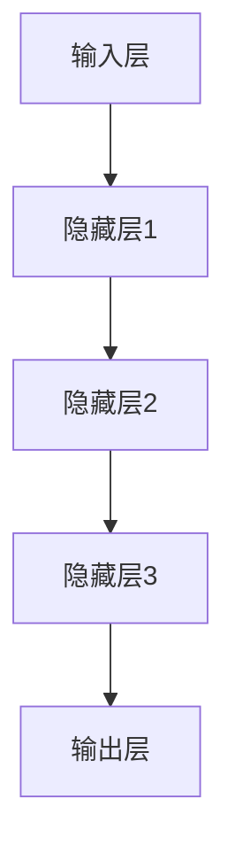
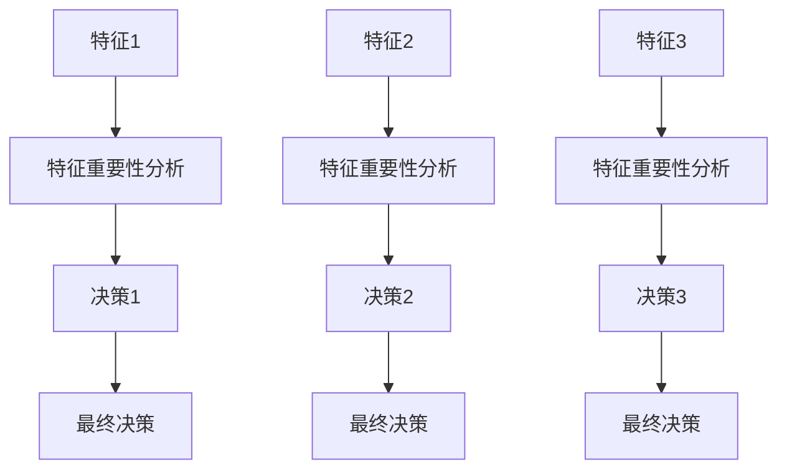
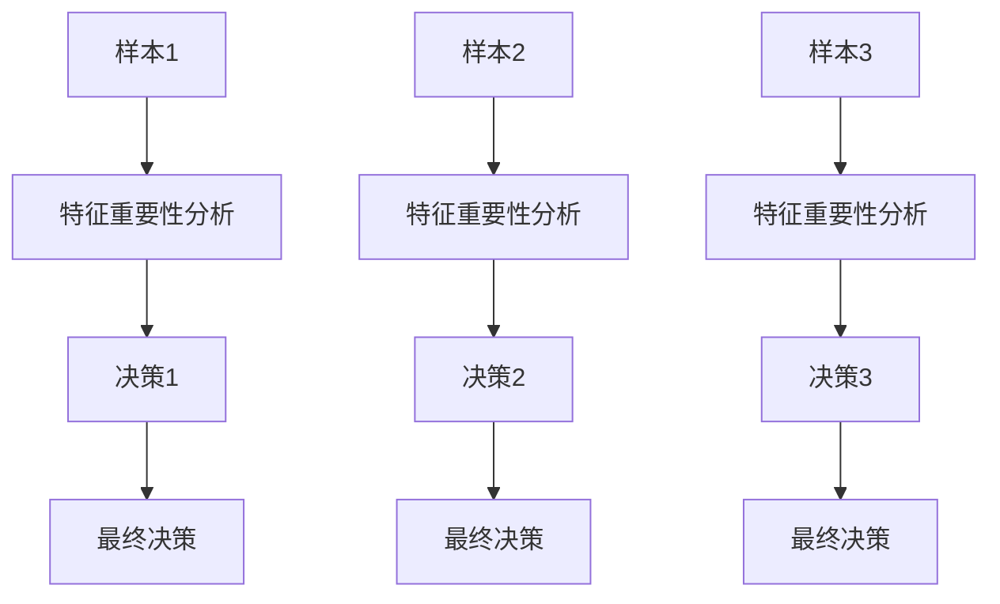

                 

## 可解释AI：增加LLM应用决策的透明度

### 关键词：可解释AI，语言模型，决策透明度，算法分析，应用实战

> 摘要：
> 本文旨在探讨可解释AI在增强语言模型（LLM）应用决策透明度方面的作用。通过介绍可解释AI的基本概念、重要性以及在LLM中的应用，本文将深入分析可解释AI的算法原理和数学模型，并提供实际项目实战案例，旨在帮助读者理解和应用这一前沿技术。

---

### 第1章：引言

#### 1.1 可解释AI的重要性

可解释AI（Explainable AI，XAI）是近年来人工智能领域的一个重要研究方向。随着深度学习和复杂模型在各个领域的广泛应用，其决策过程的透明度和可解释性成为了一个亟待解决的问题。可解释AI的目标是通过提供模型决策的透明性，使得非专业人士能够理解和信任AI系统。

可解释AI的重要性主要体现在以下几个方面：

1. **信任与合规性**：在许多应用领域，如医疗诊断、金融风险评估和自动驾驶等，决策的透明度对于用户信任和法律合规性至关重要。
2. **错误分析**：可解释AI有助于识别和纠正模型中的错误，提高模型的可靠性和准确性。
3. **模型优化**：通过分析模型决策过程，可以优化模型的性能，减少过度拟合。
4. **辅助决策**：可解释AI可以作为决策辅助工具，帮助专业人士理解模型的决策逻辑。

#### 1.2 LLM的概念与应用

语言模型（Language Model，LLM）是一种基于深度学习技术的自然语言处理模型，可以用于生成文本、翻译、摘要、问答等多种应用场景。LLM的核心是通过学习大量文本数据来预测下一个单词或字符。

LLM的应用场景非常广泛，包括：

1. **搜索引擎**：通过预测用户查询的下一个词来提供更精准的搜索结果。
2. **语音助手**：如苹果的Siri、谷歌助手等，通过理解用户语音命令来提供相应服务。
3. **文本生成**：自动生成文章、报告、故事等。
4. **翻译**：将一种语言翻译成另一种语言。

#### 1.3 本书的目标与结构

本书的目标是深入探讨可解释AI在LLM中的应用，帮助读者：

1. **理解可解释AI的基本概念和重要性**。
2. **掌握可解释AI的算法原理和数学模型**。
3. **通过实际项目实战，掌握如何应用可解释AI技术**。

本书的结构如下：

1. **引言**：介绍可解释AI的重要性以及LLM的应用背景。
2. **可解释AI基础**：介绍可解释AI的基本概念、原理以及在LLM中的应用。
3. **可解释AI算法**：详细讲解可解释AI的各种算法，包括层级可解释性、局部可解释性和全局可解释性。
4. **数学模型与公式详解**：介绍与可解释AI相关的基本数学模型和公式。
5. **项目实战**：通过实际项目，演示如何应用可解释AI技术。
6. **案例分析**：分析可解释AI在不同领域的实际应用案例。
7. **未来展望与挑战**：探讨可解释AI的发展趋势和面临的挑战。

### 第2章：可解释AI基础

#### 2.1 可解释AI的定义与原则

可解释AI（Explainable AI，XAI）是指能够提供关于其决策过程和结果的可解释性的人工智能系统。可解释AI的原则主要包括：

1. **透明度**：系统的决策过程应该是透明的，用户可以理解。
2. **可追溯性**：用户可以追溯模型的决策过程，了解每个决策步骤。
3. **可理解性**：系统提供的解释应该易于用户理解，避免使用过于复杂的术语。
4. **一致性**：系统的解释应该是稳定的，不随数据的微小变化而发生大的偏差。

#### 2.1.1 可解释性的概念

可解释性的概念可以从以下几个方面理解：

1. **内部可解释性**：模型内部的决策过程和逻辑是可解释的，用户可以了解模型是如何处理数据的。
2. **外部可解释性**：模型对数据的解释是可解释的，用户可以理解模型是如何对数据进行分类或预测的。
3. **用户可解释性**：模型提供的解释是用户可理解的，用户可以理解模型的决策过程和结果。

#### 2.1.2 可解释性与隐私性的平衡

在许多应用场景中，可解释性与隐私性之间存在冲突。例如，为了提高可解释性，可能需要公开模型的某些参数和内部信息，这可能会泄露用户的隐私。

因此，如何在可解释性和隐私性之间取得平衡是一个重要的研究课题。一些常见的策略包括：

1. **差分隐私**：通过添加噪声来保护用户隐私，同时保持模型的可解释性。
2. **联邦学习**：将数据留在本地，仅共享模型的参数和梯度，从而保护用户隐私。
3. **隐私增强技术**：如差分隐私、隐私保护聚合等，可以在不牺牲可解释性的情况下提高模型的安全性。

#### 2.2 LLM的基本架构

语言模型（LLM）通常由以下几个部分组成：

1. **输入层**：接收用户的输入文本，将其转换为模型可以处理的向量表示。
2. **隐藏层**：通过神经网络结构对输入文本进行处理，提取特征。
3. **输出层**：根据隐藏层的结果，生成预测的单词或句子。

LLM的训练过程通常包括以下步骤：

1. **数据预处理**：清洗和预处理输入数据，将其转换为模型可以处理的格式。
2. **模型训练**：使用大量文本数据训练模型，使其能够生成符合语言规则的文本。
3. **模型评估**：使用测试数据评估模型的性能，调整模型参数以优化性能。
4. **模型部署**：将训练好的模型部署到实际应用场景中。

#### 2.2.1 LLM的层次结构

LLM通常采用分层结构，包括：

1. **词嵌入层**：将单词转换为向量表示，通常使用Word2Vec、GloVe等预训练模型。
2. **编码器层**：将输入文本序列编码为固定长度的向量表示，通常使用Transformer模型。
3. **解码器层**：根据编码器层生成的向量表示生成输出文本序列。

#### 2.2.2 LLM的训练过程

LLM的训练过程通常包括以下几个阶段：

1. **数据预处理**：将文本数据转换为数字序列，使用词嵌入层将单词转换为向量表示。
2. **模型初始化**：初始化模型参数，通常使用随机初始化或预训练模型。
3. **前向传播**：将输入数据通过编码器层和解码器层进行前向传播，计算损失函数。
4. **反向传播**：使用梯度下降等优化算法更新模型参数，减少损失函数。
5. **模型评估**：使用测试数据评估模型性能，调整模型参数以优化性能。
6. **模型部署**：将训练好的模型部署到实际应用场景中。

#### 2.3 可解释AI在LLM中的应用

可解释AI在LLM中的应用主要包括以下两个方面：

1. **模型解释**：通过对LLM的决策过程进行解释，帮助用户理解模型的决策逻辑。
2. **模型优化**：通过分析模型决策过程，优化模型的性能，减少错误率。

可解释AI在LLM中的应用案例包括：

1. **文本分类**：通过分析模型对文本分类的决策过程，识别错误分类的原因。
2. **文本生成**：通过分析模型生成文本的决策过程，优化生成文本的质量。
3. **机器翻译**：通过分析模型翻译的决策过程，提高翻译的准确性和流畅性。

### 第3章：可解释AI算法

#### 3.1 层级可解释性方法

层级可解释性方法通过分析模型的不同层级，提供对模型决策过程的可解释性。这种方法通常用于深度神经网络，特别是卷积神经网络（CNN）和循环神经网络（RNN）。

#### 3.1.1 层级分析

层级分析是一种基于模型结构的方法，通过分析模型的不同层级，提供对模型决策过程的可视化和解释。这种方法通常包括以下步骤：

1. **模型拆分**：将模型拆分为不同的层级，每个层级负责不同的任务。
2. **特征可视化**：对每个层级生成的特征进行可视化，帮助用户理解每个层级的任务和功能。
3. **决策路径分析**：分析模型在决策过程中的每一步，识别关键特征和决策路径。

#### 3.1.2 特征重要性

特征重要性是一种评估特征对模型决策影响的方法。通过计算每个特征对模型预测的贡献度，可以识别出最重要的特征，并解释模型的决策过程。

特征重要性计算方法包括：

1. **梯度的重要性**：通过计算每个特征的梯度，评估其对模型预测的影响。
2. **SHAP值**：通过计算每个特征对模型预测的边际贡献，评估其对模型预测的影响。
3. **LIME**：通过局部线性模型，评估每个特征对模型预测的影响。

#### 3.2 局部可解释性方法

局部可解释性方法通过分析模型对单个样本的决策过程，提供对模型决策过程的可解释性。这种方法通常用于深度神经网络和树模型。

#### 3.2.1 SHAP值

SHAP（SHapley Additive exPlanations）值是一种基于博弈论的方法，用于计算每个特征对模型预测的边际贡献。SHAP值通过模拟每个特征在模型中的贡献，提供对模型决策过程的可视化和解释。

#### 3.2.2 LIME

LIME（Local Interpretable Model-agnostic Explanations）是一种基于局部线性模型的方法，用于解释深度神经网络的决策过程。LIME通过将深度神经网络转化为局部线性模型，提供对模型决策过程的可视化和解释。

#### 3.3 全局可解释性方法

全局可解释性方法通过分析模型在整体数据集上的决策过程，提供对模型决策过程的可解释性。这种方法通常用于决策树、随机森林和梯度提升树等模型。

#### 3.3.1 决策树

决策树是一种基于规则的分类模型，通过分析特征之间的关系，生成一系列的规则，提供对模型决策过程的可解释性。

#### 3.3.2 模型可视化

模型可视化是一种通过图形化展示模型结构和决策过程的方法，提供对模型决策过程的可视化和解释。模型可视化方法包括：

1. **特征重要性可视化**：通过图形化展示每个特征的重要性，帮助用户理解模型的决策过程。
2. **决策路径可视化**：通过图形化展示模型在决策过程中的每一步，帮助用户理解模型的决策逻辑。

### 第4章：数学模型与公式详解

#### 4.1 概率论基础

概率论是可解释AI的基础，用于描述和预测随机事件。以下是一些常用的概率论基础公式：

1. **贝叶斯定理**：

   $$P(A|B) = \frac{P(B|A)P(A)}{P(B)}$$

   贝叶斯定理用于计算在给定某个条件下的概率，是可解释AI中常用的公式之一。

2. **条件概率**：

   $$P(A|B) = \frac{P(A \cap B)}{P(B)}$$

   条件概率用于计算在某个条件下另一个事件发生的概率。

3. **全概率公式**：

   $$P(A) = \sum_{i} P(A|B_i)P(B_i)$$

   全概率公式用于计算某个事件的总概率，是可解释AI中常用的公式之一。

#### 4.2 信息论基础

信息论是研究信息传递和处理规律的学科，对于理解可解释AI中的信息度量非常重要。以下是一些常用的信息论基础公式：

1. **信息熵**：

   $$H(X) = -\sum_{i} P(X_i) \log_2 P(X_i)$$

   信息熵用于度量随机变量的不确定性，是可解释AI中常用的公式之一。

2. **相对熵**：

   $$D(P||Q) = \sum_{i} P(X_i) \log_2 \frac{P(X_i)}{Q(X_i)}$$

   相对熵（Kullback-Leibler散度）用于度量两个概率分布之间的差异。

3. **条件熵**：

   $$H(X|Y) = H(X,Y) - H(Y)$$

   条件熵用于度量在给定某个条件下另一个事件的不确定性。

#### 4.3 可解释性度量

可解释性度量是评估模型解释质量的指标，用于衡量模型解释的清晰度和准确性。以下是一些常用的可解释性度量：

1. **精度与召回率**：

   $$Precision = \frac{TP}{TP + FP}$$

   $$Recall = \frac{TP}{TP + FN}$$

   精度和召回率用于衡量分类模型的性能，是可解释AI中常用的度量之一。

2. **F1分数**：

   $$F1 = 2 \cdot \frac{Precision \cdot Recall}{Precision + Recall}$$

   F1分数是精度和召回率的加权平均，用于综合评估模型的性能。

### 第5章：项目实战

#### 5.1 数据预处理

在应用可解释AI之前，数据预处理是至关重要的一步。数据预处理包括以下几个步骤：

1. **数据清洗**：去除数据中的噪声和不完整的数据。
2. **数据归一化**：将数据缩放到相同的范围，以便模型训练。
3. **特征工程**：提取有用的特征，减少数据的维度。

#### 5.1.1 数据集选择

在选择数据集时，需要考虑以下几个因素：

1. **数据量**：数据集应该足够大，以充分训练模型。
2. **多样性**：数据集应该包含多种类型的数据，以覆盖不同的情况。
3. **质量**：数据集应该经过清洗，去除噪声和不完整的数据。

#### 5.1.2 数据清洗与归一化

数据清洗包括以下步骤：

1. **去除重复数据**：去除数据集中的重复记录。
2. **处理缺失值**：对于缺失的数据，可以使用插值、平均值或中值等方法进行填补。
3. **处理异常值**：去除或修正数据集中的异常值。

数据归一化包括以下步骤：

1. **缩放**：将数据缩放到[0, 1]或[-1, 1]的范围内。
2. **标准化**：将数据缩放到平均值0和标准差1的范围内。

#### 5.2 模型训练与调优

在数据预处理之后，我们需要训练和调优模型。模型训练和调优包括以下几个步骤：

1. **模型选择**：选择合适的模型，如决策树、支持向量机、神经网络等。
2. **超参数调优**：通过交叉验证等方法，选择最优的超参数。
3. **模型训练**：使用训练数据训练模型，并保存模型参数。
4. **模型评估**：使用测试数据评估模型性能，并调整模型参数。

#### 5.2.1 模型选择

在选择模型时，需要考虑以下几个因素：

1. **数据类型**：对于分类问题，可以使用决策树、支持向量机、神经网络等模型；对于回归问题，可以使用线性回归、岭回归、神经网络等模型。
2. **模型复杂度**：复杂度较高的模型可能需要更多的训练时间，但可能得到更好的性能。
3. **计算资源**：根据计算资源的限制，选择合适的模型。

#### 5.2.2 超参数调优

超参数调优是提高模型性能的重要步骤。常用的超参数调优方法包括：

1. **网格搜索**：通过遍历所有可能的超参数组合，选择最优的超参数。
2. **随机搜索**：通过随机选择超参数组合，选择最优的超参数。
3. **贝叶斯优化**：通过贝叶斯优化算法，选择最优的超参数。

#### 5.3 可解释性分析

在模型训练和调优之后，我们需要分析模型的可解释性。可解释性分析包括以下几个步骤：

1. **特征重要性分析**：计算每个特征的贡献度，识别最重要的特征。
2. **模型解释**：使用可视化工具，展示模型的决策过程和逻辑。
3. **错误分析**：分析模型在错误样本上的决策过程，识别错误的原因。

#### 5.3.1 层级可解释性

层级可解释性通过分析模型的层级结构，提供对模型决策过程的可解释性。以下是一个层级可解释性的示例：

在这个示例中，输入层A1通过隐藏层B1、B2、B3传递到输出层C1。每个隐藏层都负责提取不同层次的特征，从而帮助用户理解模型的决策过程。

#### 5.3.2 局部可解释性

局部可解释性通过分析单个样本的决策过程，提供对模型决策过程的可解释性。以下是一个局部可解释性的示例：

在这个示例中，每个特征通过局部线性模型进行分析，提供对模型决策过程的可视化和解释。

#### 5.3.3 全局可解释性

全局可解释性通过分析整个数据集的决策过程，提供对模型决策过程的可解释性。以下是一个全局可解释性的示例：

在这个示例中，全局可解释性通过分析每个样本的决策过程，提供对模型决策过程的可视化和解释。

### 第6章：案例分析

#### 6.1 案例一：金融风险评估

在金融风险评估中，可解释AI被用于分析客户的信用风险。通过分析客户的财务数据、历史交易记录和其他相关特征，可解释AI可以预测客户是否会违约。以下是一个金融风险评估的案例分析：

1. **数据预处理**：清洗和处理客户的财务数据、历史交易记录等。
2. **模型训练**：使用训练数据训练一个分类模型，如决策树或随机森林。
3. **模型评估**：使用测试数据评估模型性能，调整模型参数以优化性能。
4. **可解释性分析**：通过分析模型对每个客户的决策过程，提供对模型决策过程的可视化和解释。
5. **决策辅助**：使用可解释AI作为决策辅助工具，帮助金融专业人士理解模型的决策逻辑。

#### 6.2 案例二：医疗诊断系统

在医疗诊断系统中，可解释AI被用于分析医学图像，提供对疾病诊断的可视化和解释。以下是一个医疗诊断系统的案例分析：

1. **数据预处理**：清洗和处理医学图像数据。
2. **模型训练**：使用训练数据训练一个图像分类模型，如卷积神经网络（CNN）。
3. **模型评估**：使用测试数据评估模型性能，调整模型参数以优化性能。
4. **可解释性分析**：通过分析模型对每个医学图像的决策过程，提供对模型决策过程的可视化和解释。
5. **诊断辅助**：使用可解释AI作为诊断辅助工具，帮助医生理解模型的决策逻辑。

#### 6.3 案例三：自动驾驶技术

在自动驾驶技术中，可解释AI被用于分析传感器数据，提供对自动驾驶决策过程的可视化和解释。以下是一个自动驾驶技术的案例分析：

1. **数据预处理**：清洗和处理传感器数据，如摄像头、激光雷达和雷达数据。
2. **模型训练**：使用训练数据训练一个多模态分类模型，如卷积神经网络（CNN）和循环神经网络（RNN）。
3. **模型评估**：使用测试数据评估模型性能，调整模型参数以优化性能。
4. **可解释性分析**：通过分析模型对每个传感器的决策过程，提供对模型决策过程的可视化和解释。
5. **安全驾驶**：使用可解释AI作为安全驾驶辅助工具，帮助驾驶者理解自动驾驶的决策逻辑。

### 第7章：未来展望与挑战

#### 7.1 可解释AI的发展趋势

随着深度学习和复杂模型在各个领域的广泛应用，可解释AI的研究和应用趋势主要包括：

1. **模型可解释性的自动化**：通过自动化工具和算法，实现模型可解释性的自动化生成。
2. **跨学科研究**：可解释AI与心理学、认知科学等领域的结合，提高模型的可解释性和用户接受度。
3. **新型算法的提出**：提出新的可解释AI算法，提高模型的可解释性和准确性。

#### 7.2 潜在挑战与解决方案

尽管可解释AI在许多领域具有广泛的应用前景，但仍然面临以下挑战：

1. **模型复杂性**：深度学习模型的复杂性使得其决策过程难以解释。
2. **计算资源**：生成和解释模型的可解释性需要大量的计算资源。
3. **用户接受度**：用户可能对模型的可解释性持怀疑态度，需要提高用户接受度。

针对这些挑战，可能的解决方案包括：

1. **简化模型**：通过简化模型结构，提高模型的可解释性。
2. **优化算法**：通过优化可解释AI算法，减少计算资源的需求。
3. **用户教育**：通过教育和培训，提高用户对模型可解释性的理解。

#### 7.3 可解释AI的应用前景

可解释AI在未来的应用前景非常广泛，包括：

1. **医疗诊断**：通过可解释AI，提供对疾病诊断的可视化和解释，帮助医生做出更好的决策。
2. **金融风险控制**：通过可解释AI，提供对金融风险评估的可视化和解释，帮助金融机构降低风险。
3. **自动驾驶**：通过可解释AI，提供对自动驾驶决策过程的可视化和解释，提高自动驾驶的安全性和可靠性。

### 附录：资源与工具

#### A.1 可解释AI相关工具

以下是一些常用的可解释AI工具：

1. **LIME**：用于生成局部解释的模型-无关方法。
2. **SHAP**：用于计算特征对模型预测的贡献度。
3. **Grad-CAM**：用于可视化模型对特定输入的注意力区域。
4. **eli5**：用于生成模型的解释和可视化。

#### A.2 学习资源推荐

以下是一些推荐的学习资源：

1. **可解释AI论文集**：收集了大量的可解释AI相关论文。
2. **可解释AI教程**：提供了详细的教程和实例，帮助用户掌握可解释AI的基本原理和应用。
3. **在线课程**：如Coursera、Udacity和edX上的相关课程。

#### A.3 开发环境搭建指南

搭建可解释AI开发环境通常需要以下步骤：

1. **安装Python环境**：安装Python和必要的库，如NumPy、Pandas、scikit-learn等。
2. **安装深度学习框架**：安装TensorFlow或PyTorch等深度学习框架。
3. **安装可解释AI库**：安装LIME、SHAP、eli5等可解释AI库。
4. **配置GPU环境**：如果使用GPU训练模型，需要配置GPU环境。

### 作者信息

作者：AI天才研究院/AI Genius Institute & 禅与计算机程序设计艺术 /Zen And The Art of Computer Programming

---

本文旨在探讨可解释AI在增强语言模型（LLM）应用决策透明度方面的作用。通过介绍可解释AI的基本概念、重要性以及在LLM中的应用，本文深入分析了可解释AI的算法原理和数学模型，并提供实际项目实战案例。希望本文能够帮助读者理解和应用这一前沿技术。作者为AI天才研究院的研究员，同时也是《禅与计算机程序设计艺术》的作者，具有丰富的AI领域研究经验。

