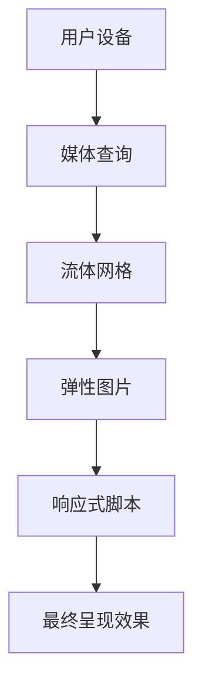

                 

### 《响应式设计确保LLM应用的多设备适配》

> 关键词：响应式设计、LLM、多设备适配、用户体验、前端开发

> 摘要：
随着人工智能语言模型（LLM）技术的飞速发展，LLM应用在各个领域得到了广泛的应用。为了确保这些应用能够提供良好的用户体验，响应式设计成为了关键因素。本文将深入探讨响应式设计在确保LLM应用多设备适配中的重要性，分析其核心概念、优势与挑战，并给出具体的实现策略与优化方法。

### 引言

近年来，人工智能语言模型（LLM）以其强大的自然语言处理能力，在各个领域如教育、医疗、金融等得到了广泛应用。然而，随着用户设备种类的增多和设备屏幕尺寸的多样化，如何确保LLM应用在不同设备上提供一致且优秀的用户体验，成为了开发者面临的重要挑战。此时，响应式设计（Responsive Design）作为一种能够动态适应各种屏幕尺寸和设备类型的网页设计方法，成为了解决这一问题的有效手段。

响应式设计的目标是通过一套代码，让网页在不同设备上都能呈现出最佳的视觉效果和用户交互体验。对于LLM应用来说，响应式设计不仅能够提高用户体验，还能降低开发成本、提升搜索引擎排名，因此其重要性不容忽视。

本文将围绕响应式设计在LLM应用多设备适配中的作用，详细探讨其核心概念、优势与挑战，并提供具体的实现策略与优化方法。希望通过本文的讨论，能够为开发者提供有益的参考和启示。

### 响应式设计概述

#### 响应式设计的概念

响应式设计（Responsive Design）是一种网页设计理念，旨在通过灵活的布局和设计，使网页能够适应不同屏幕尺寸和设备类型。其核心思想是利用媒体查询（Media Queries）技术，根据设备的显示尺寸、分辨率、方向等特性，动态调整网页的布局和样式。

简单来说，响应式设计通过以下方式实现：

1. **流体网格布局**：使用相对单位（如百分比）而非固定单位（如像素）定义网页元素的宽度和高度，使其能够根据屏幕尺寸自动缩放。
2. **弹性图片**：通过`max-width: 100%`和`height: auto`属性，确保图片在缩放时保持其宽高比例，不会失真。
3. **媒体查询**：根据不同的屏幕尺寸和应用场景，使用CSS媒体查询（Media Queries）来调整样式，实现个性化的布局和设计。

#### 核心概念与联系

为了更好地理解响应式设计的核心概念，我们可以通过以下Mermaid流程图来展示其各部分之间的关系：



在这个流程图中，用户设备通过媒体查询向网页发送特定的信息，流体网格和弹性图片根据这些信息动态调整布局和样式，最终呈现给用户的是一种一致且优化的用户体验。

#### 响应式设计的优势

响应式设计的优势在于其能够提供跨设备的一致性和灵活性，从而提升用户体验和开发效率。以下是响应式设计的几个关键优势：

1. **更好的用户体验**：通过自动适应不同设备，响应式设计能够为用户提供一致且流畅的浏览体验，减少用户在不同设备上的适应时间和学习成本。
2. **提高搜索引擎排名**：搜索引擎如Google更倾向于为用户推荐响应式设计的网页，因为这种设计能够提供更好的用户体验。因此，响应式设计有助于提高网页在搜索引擎中的排名。
3. **减少开发成本**：使用响应式设计，开发者只需编写一套代码即可实现多设备适配，从而减少了重复开发和维护的工作量，降低了开发成本。
4. **适应未来变化**：随着设备技术的发展，新的屏幕尺寸和设备类型不断涌现。响应式设计能够灵活应对这些变化，无需频繁修改代码，保持网页的适应性。

#### 响应式设计的挑战

尽管响应式设计具有诸多优势，但在实际应用中仍面临一些挑战：

1. **兼容性问题**：不同浏览器和设备对CSS媒体查询的支持程度不同，可能导致页面在某些设备上呈现异常。
2. **性能问题**：媒体查询和脚本可能会增加页面的加载时间，影响用户体验。
3. **复杂性和学习成本**：响应式设计需要开发者具备一定的前端开发知识和技能，特别是对于流体网格和弹性图片的实现，可能需要较长时间的熟悉和实践。

### 语言模型（LLM）概述

#### 语言模型简介

语言模型（Language Model，简称LM）是自然语言处理（Natural Language Processing，简称NLP）中的一个核心组件，用于预测文本中的下一个单词或字符。它通过对大量文本数据的学习，捕捉语言的结构和规律，从而能够生成语义相关的文本。

语言模型可以分为以下几种类型：

1. **统计语言模型**：基于统计方法，如N-gram模型，通过计算词频和条件概率来预测下一个词。
2. **神经网络语言模型**：基于深度学习，如循环神经网络（RNN）和变换器（Transformer）模型，通过学习大量文本数据，捕捉复杂的语言结构。

#### LLM的工作原理

语言模型的工作原理主要包括以下几个步骤：

1. **数据预处理**：对输入文本进行分词、去停用词、词性标注等预处理操作，以便更好地进行建模。
2. **特征提取**：将预处理后的文本转化为向量表示，通常使用词嵌入（Word Embedding）技术，如Word2Vec和BERT。
3. **模型训练**：使用训练数据，通过优化损失函数，如交叉熵损失，训练语言模型参数。
4. **预测生成**：对于新的输入文本，通过模型预测下一个词或字符，生成完整的文本序列。

#### LLM的应用场景

语言模型在多个领域和场景中得到了广泛应用，主要包括：

1. **文本生成**：如自动写作、摘要生成、对话系统等。
2. **机器翻译**：将一种语言的文本翻译成另一种语言。
3. **问答系统**：如智能客服、问答机器人等。
4. **文本分类**：如情感分析、垃圾邮件检测等。
5. **语音识别**：将语音信号转换为文本。

### 响应式网页设计（RWD）

#### 响应式网页设计的基础

响应式网页设计（Responsive Web Design，简称RWD）是一种设计方法，通过流体网格、弹性图片和媒体查询等技术，实现网页在不同设备上的自动适配。RWD的核心原则包括：

1. **弹性布局**：使用百分比而非像素来定义网页元素的宽度，使其能够根据屏幕尺寸自动调整。
2. **弹性媒体**：使用`max-width: 100%`和`height: auto`属性，确保图片和视频在缩放时保持其宽高比例。
3. **灵活的导航**：使用堆叠布局（stack layout）或滑动菜单（hamburger menu），以适应小屏幕设备。

#### CSS媒体查询

CSS媒体查询（CSS Media Queries）是响应式网页设计的核心工具，允许开发者根据不同的设备特性（如屏幕宽度、分辨率、方向等）调整样式。媒体查询的基本语法如下：

```css
@media screen and (max-width: 600px) {
  /* 在屏幕宽度小于600px时的样式 */
}
```

通过媒体查询，开发者可以实现以下功能：

1. **动态调整布局**：根据屏幕宽度调整导航菜单、侧边栏、文本大小等。
2. **优化响应速度**：通过加载不同的样式文件，针对不同设备优化页面加载速度。
3. **增强交互体验**：针对触屏设备，优化手势操作和响应行为。

#### 常用的响应式布局技术

在响应式网页设计中，常用的布局技术包括：

1. **流体网格布局**：使用百分比宽度，使网页元素能够根据屏幕尺寸自适应调整。
2. **弹性布局**：使用CSS Flexbox，实现一维或二维布局的自动适应。
3. **网格系统**：如Bootstrap和Foundation等框架，提供预定义的网格布局和组件，方便快速开发。

#### 流体网格布局

流体网格布局（Fluid Grid Layout）是一种通过相对单位（如百分比）定义网页元素宽度和高度的布局方法。其核心优势在于能够实现网页内容在不同屏幕尺寸上的自动适应。

实现流体网格布局的关键技术包括：

1. **百分比宽度**：使用百分比定义元素的宽度，使其能够根据屏幕尺寸自动缩放。
2. **弹性对齐**：通过`flexbox`或`grid`布局，实现元素在网格中的灵活对齐。

以下是一个简单的流体网格布局示例：

```html
<div class="grid-container">
  <div class="grid-item">Item 1</div>
  <div class="grid-item">Item 2</div>
  <div class="grid-item">Item 3</div>
</div>
```

```css
.grid-container {
  display: flex;
  flex-wrap: wrap;
}

.grid-item {
  flex: 1 0 20%; /* 自动调整宽度，最小宽度为20% */
  padding: 10px;
  border: 1px solid #ccc;
}
```

#### 弹性布局

弹性布局（Flexbox Layout）是一种基于CSS3的新布局方式，旨在实现一维或二维布局的灵活适应。Flexbox布局的主要特性包括：

1. **主轴（Main Axis）和交叉轴（Cross Axis）**：Flexbox布局分为主轴和交叉轴，主轴默认为水平方向，交叉轴为垂直方向。
2. **弹性容器（Flexible Container）和弹性项目（Flexible Item）**：弹性容器通过`display: flex`或`display: inline-flex`属性定义，弹性项目是容器内的子元素。
3. **对齐和分配**：通过`align-items`、`justify-content`等属性，实现元素在主轴和交叉轴上的对齐和分配。

以下是一个简单的弹性布局示例：

```html
<div class="flex-container">
  <div class="flex-item">Item 1</div>
  <div class="flex-item">Item 2</div>
  <div class="flex-item">Item 3</div>
</div>
```

```css
.flex-container {
  display: flex;
  justify-content: space-between;
  align-items: center;
  padding: 10px;
}

.flex-item {
  flex: 1;
  margin: 10px;
  padding: 10px;
  border: 1px solid #ccc;
}
```

#### 网格系统

网格系统（Grid System）是一种通过预定义的网格布局和组件，快速构建响应式网页的设计方法。常用的网格系统框架包括Bootstrap和Foundation等。

1. **Bootstrap**：Bootstrap是一个流行的前端框架，提供了一套预定义的网格系统，通过`container`、`row`和`column`等类实现响应式布局。

```html
<div class="container">
  <div class="row">
    <div class="col-md-4">列1</div>
    <div class="col-md-4">列2</div>
    <div class="col-md-4">列3</div>
  </div>
</div>
```

2. **Foundation**：Foundation是一个响应式前端框架，提供了一套灵活的网格系统，通过`grid-row`和`grid-column`等类实现布局。

```html
<div class="row">
  <div class="small-6 medium-4 large-3 columns">列1</div>
  <div class="small-6 medium-4 large-3 columns">列2</div>
  <div class="small-6 medium-4 large-3 columns">列3</div>
</div>
```

### 响应式设计中的JavaScript

#### JavaScript在响应式设计中的作用

在响应式设计中，JavaScript扮演着重要的角色，它不仅能实现页面的动态响应，还能优化用户体验和性能。JavaScript在响应式设计中的作用主要体现在以下几个方面：

1. **动态调整布局**：通过JavaScript，可以动态调整网页元素的样式和位置，实现更灵活的响应式布局。
2. **增强交互性**：JavaScript可以添加各种交互效果，如滚动动画、响应式菜单、轮播图等，提升用户体验。
3. **优化性能**：使用JavaScript可以减少HTTP请求和页面重绘，从而提高页面加载速度和响应性能。

#### JavaScript响应式布局的实现

实现JavaScript响应式布局，通常需要以下几个步骤：

1. **监听窗口大小变化**：通过监听窗口的`resize`事件，可以实时获取窗口大小变化，并动态调整页面布局。
2. **编写响应式脚本**：根据不同的屏幕尺寸和设备类型，编写相应的JavaScript脚本，调整页面元素的样式和位置。
3. **优化脚本性能**：避免不必要的计算和DOM操作，优化脚本执行效率，减少页面加载时间和响应延迟。

以下是一个简单的JavaScript响应式布局示例：

```javascript
window.addEventListener('resize', function() {
  const windowWidth = window.innerWidth;
  if (windowWidth < 768) {
    // 设置小屏幕布局
    document.getElementById('main-container').classList.add('small-screen');
  } else {
    // 设置大屏幕布局
    document.getElementById('main-container').classList.remove('small-screen');
  }
});
```

#### JavaScript动画与交互设计

在响应式设计中，动画和交互设计是提升用户体验的重要手段。JavaScript提供了丰富的动画库和交互组件，如jQuery、GreenSock Animation Platform（GSAP）等，可以实现各种复杂的动画效果和交互行为。

以下是一些常见的JavaScript动画和交互设计技巧：

1. **滚动动画**：通过监听滚动事件，实现页面滚动时元素动画的渐显或渐隐效果。
2. **响应式菜单**：使用JavaScript实现小屏幕设备上的响应式菜单，如Hamburger菜单、滑动菜单等。
3. **轮播图**：使用JavaScript和CSS实现响应式轮播图，适应不同屏幕尺寸和设备类型。
4. **触摸事件**：针对触屏设备，使用触摸事件（如`touchstart`、`touchmove`、`touchend`）实现交互效果，如滑动、拖动等。

### 多设备适配的考虑因素

#### 设备差异性分析

在多设备适配中，设备差异性是一个关键因素。不同设备的屏幕尺寸、分辨率、操作系统和浏览器等特性，都会对网页的呈现效果产生影响。因此，开发者需要对这些差异进行详细分析，以便制定合适的适配策略。

以下是常见的设备差异性：

1. **屏幕尺寸和分辨率**：智能手机、平板电脑、笔记本电脑和台式机的屏幕尺寸和分辨率差异较大，需要根据具体设备进行调整。
2. **操作系统和浏览器**：不同的操作系统和浏览器对CSS、JavaScript等前端技术的支持程度不同，可能导致页面在不同设备上呈现不一致。
3. **输入方式**：触屏设备、键盘和鼠标等输入方式差异，需要设计不同的交互界面和交互方式。

#### 网络条件考虑

网络条件也是多设备适配的重要考虑因素。不同设备在网络环境、带宽和延迟等方面存在差异，可能影响网页的加载速度和用户体验。以下是一些网络条件的考虑点：

1. **带宽限制**：网络带宽较低时，需要优化图片和资源的加载，减少HTTP请求。
2. **延迟问题**：网络延迟较高时，需要优化脚本和样式文件的加载顺序，减少页面加载时间。
3. **离线访问**：考虑提供离线访问功能，使用本地缓存技术，提高网页的访问速度和可用性。

#### 用户行为分析

用户行为分析是确保多设备适配有效性的重要环节。通过分析用户在不同设备上的行为，可以优化网页的设计和功能，提高用户体验。以下是一些用户行为分析的方法：

1. **用户跟踪**：使用分析工具，如Google Analytics，跟踪用户在不同设备上的浏览行为，了解用户偏好。
2. **A/B测试**：通过A/B测试，比较不同设备上的用户体验和转化率，找出最佳的适配方案。
3. **用户反馈**：收集用户对网页的反馈，了解用户在使用过程中的问题和需求，不断优化设计。

### 多设备测试与优化

#### 多设备测试的重要性

多设备测试是确保网页在不同设备上表现一致且优秀的必要环节。通过多设备测试，开发者可以及时发现和解决设备兼容性问题，优化页面性能和用户体验。

以下是多设备测试的重要性：

1. **确保兼容性**：不同设备上的浏览器和操作系统对前端技术的支持程度不同，可能导致页面呈现异常。多设备测试可以帮助开发者发现并解决这些问题，确保网页在不同设备上表现一致。
2. **提升用户体验**：通过多设备测试，可以验证网页在不同设备上的用户体验，确保页面在触摸、滚动、加载等方面表现良好，提高用户满意度。
3. **降低维护成本**：早期发现和解决设备兼容性问题，可以减少后续维护和修复的成本，提高开发效率。

#### 多设备测试方法

以下是一些常见多设备测试方法：

1. **手动测试**：开发者使用不同的设备（如智能手机、平板电脑、笔记本电脑等）手动浏览网页，检查页面布局、交互效果和功能完整性。
2. **自动化测试**：使用自动化测试工具，如Selenium和Cypress，模拟不同设备上的浏览器行为，自动化执行测试脚本，提高测试效率和覆盖率。
3. **云测试平台**：使用云测试平台，如BrowserStack和LambdaTest，提供多种设备和浏览器的虚拟环境，方便开发者进行大规模测试。

#### 多设备优化策略

为了确保网页在不同设备上表现一致且优秀，开发者可以采取以下优化策略：

1. **优化资源**：针对不同设备优化图片、脚本和样式文件，减少资源加载时间和体积，提高页面性能。
2. **适应不同输入方式**：设计适合不同输入方式的交互界面和交互逻辑，如触摸屏、键盘和鼠标等。
3. **使用框架和工具**：使用响应式布局框架和工具，如Bootstrap和Flexbox，简化多设备适配的复杂度，提高开发效率。
4. **持续测试和优化**：定期进行多设备测试，收集用户反馈，不断优化网页设计和功能，提高用户体验。

### 案例分析

#### 案例背景

某知名电商平台在上线新版本时，面临多设备适配的挑战。由于平台涵盖多种设备和操作系统，不同设备的浏览器对前端技术的支持程度不同，导致页面在部分设备上呈现异常。此外，用户在不同设备上的行为和需求也存在差异，需要设计适应不同场景的交互界面。

#### 案例分析

1. **设备差异性分析**：
   - **屏幕尺寸**：智能手机、平板电脑、笔记本电脑和台式机的屏幕尺寸差异较大，需要针对不同设备调整页面布局和样式。
   - **操作系统和浏览器**：不同设备的操作系统和浏览器对CSS、JavaScript等前端技术的支持程度不同，需要进行兼容性处理。
   - **输入方式**：触摸屏、键盘和鼠标等输入方式差异，需要设计不同的交互界面和交互逻辑。

2. **网络条件考虑**：
   - **带宽限制**：针对网络带宽较低的设备，优化图片和资源的加载，减少HTTP请求，提高页面加载速度。
   - **延迟问题**：针对网络延迟较高的设备，优化脚本和样式文件的加载顺序，减少页面加载时间。

3. **用户行为分析**：
   - **用户跟踪**：使用分析工具，如Google Analytics，跟踪用户在不同设备上的浏览行为，了解用户偏好。
   - **A/B测试**：通过A/B测试，比较不同设备上的用户体验和转化率，找出最佳的适配方案。
   - **用户反馈**：收集用户对网页的反馈，了解用户在使用过程中的问题和需求，不断优化设计。

#### 案例总结

通过详细的设备差异性分析、网络条件考虑和用户行为分析，电商平台成功实现了多设备适配。在具体实现过程中，使用了响应式布局框架（如Bootstrap）和自动化测试工具（如Selenium），提高了开发效率和质量。此外，持续进行多设备测试和优化，收集用户反馈，不断改进网页设计和功能，提高了用户体验和满意度。

### 附录

#### 附录A：响应式设计与LLM应用资源推荐

1. **学习资源**：
   - 《响应式网页设计：HTML5和CSS3实战》
   - 《JavaScript和jQuery高级编程：响应式网页设计》
   - 《自然语言处理入门：基于Python的语言模型》

2. **开发工具**：
   - Bootstrap：https://getbootstrap.com/
   - Flexbox：https://css-tricks.com/snippets/css/a-guide-to-flexbox/
   - GSAP：https://greensock.com/gsap/

3. **测试平台**：
   - BrowserStack：https://www.browserstack.com/
   - LambdaTest：https://www.lambdatest.com/

#### 附录B：常见问题与解答

1. **Q：响应式设计与传统网页设计有什么区别？**
   - **A**：响应式设计是一种能够动态适应各种屏幕尺寸和设备类型的网页设计方法，通过流体网格、弹性图片和媒体查询等技术，实现网页内容的自动调整。而传统网页设计通常采用固定宽度布局，无法适应不同设备。

2. **Q：如何优化响应式网页的性能？**
   - **A**：优化响应式网页的性能可以从以下几个方面入手：
     - 优化图片和资源加载，如使用懒加载、压缩图片和资源压缩。
     - 优化脚本和样式文件的加载顺序，减少页面加载时间。
     - 避免不必要的CSS和JavaScript代码，减少HTTP请求。
     - 使用浏览器缓存技术，提高页面访问速度。

3. **Q：如何进行多设备测试？**
   - **A**：多设备测试可以通过以下方法进行：
     - 手动测试：使用不同的设备和浏览器手动浏览网页，检查页面布局、交互效果和功能完整性。
     - 自动化测试：使用自动化测试工具，如Selenium和Cypress，模拟不同设备上的浏览器行为，自动化执行测试脚本。
     - 云测试平台：使用云测试平台，如BrowserStack和LambdaTest，提供多种设备和浏览器的虚拟环境，方便开发者进行大规模测试。

### 结束语

响应式设计和LLM应用的多设备适配是现代前端开发的重要方向。通过本文的探讨，我们深入了解了响应式设计的核心概念、优势与挑战，以及LLM应用在不同设备上的适配策略。希望本文能为开发者提供有益的参考和启示，帮助他们在实际项目中实现高质量的多设备适配。

最后，感谢您阅读本文。如果您有任何疑问或建议，欢迎在评论区留言。期待与您共同探讨前端开发的最新动态和技术趋势。再次感谢您的关注和支持！

### 作者信息

作者：AI天才研究院/AI Genius Institute & 禅与计算机程序设计艺术 /Zen And The Art of Computer Programming

