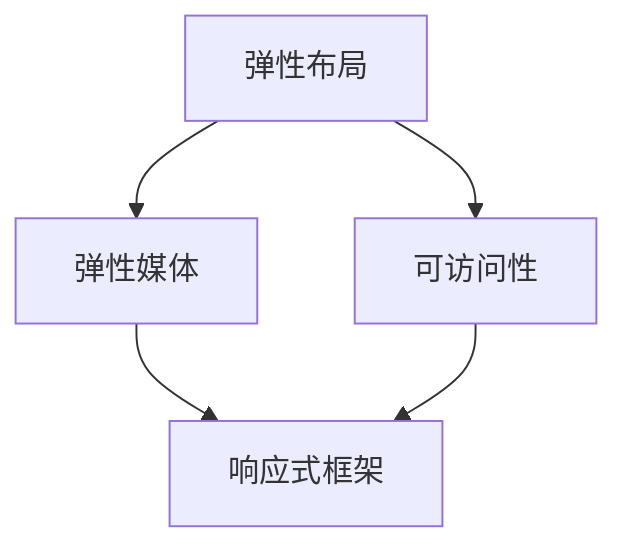
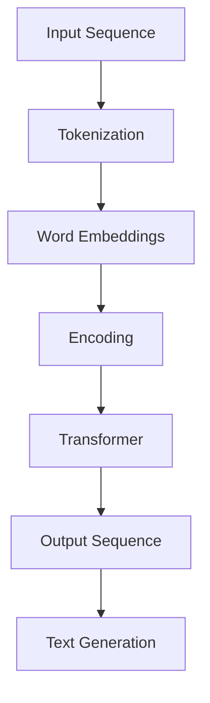
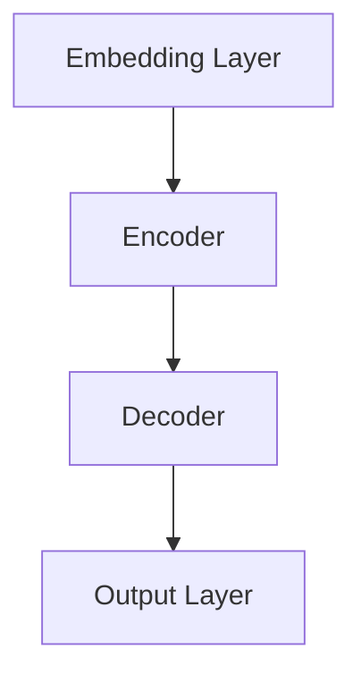

                 


### 引言与背景

在当今数字化时代，智能设备的多样性和普及程度日益增长。从智能手机到平板电脑，再到智能手表和智能音箱，各种设备的应用场景和用户需求千差万别。如何确保应用程序（Application）在不同设备上都能提供一致且高质量的用户体验（User Experience），成为了一个重要的技术挑战。这种挑战促使开发者探索和采用响应式设计（Responsive Design）来满足多设备适配的需求。

#### 响应式设计的历史与发展

响应式设计的概念最早可以追溯到2000年左右。当时，随着互联网的普及和移动设备的兴起，Web开发者开始意识到传统固定布局网页（Fixed Layout Web Pages）在适应不同设备尺寸和分辨率方面的局限性。早期的研究主要集中在使用CSS（层叠样式表）媒体查询（Media Queries）来实现网页的响应性调整。CSS3的推出为响应式设计提供了更加灵活和强大的工具，使得开发者可以更加精细地控制网页在不同设备上的显示效果。

#### 响应式设计的核心概念

响应式设计不仅仅是一种视觉上的调整，更是一种全面的、系统性的设计理念。它包括以下几个核心概念：

1. **弹性布局（Fluid Layout）**：通过使用百分比而不是固定的像素值来定义元素的宽度和高度，使得布局能够根据不同的屏幕尺寸和分辨率自动调整。
2. **弹性媒体（Responsive Media）**：使用CSS的`max-width`和`min-width`属性来确保图片和视频等媒体元素在响应不同屏幕尺寸时能够保持适当的显示大小。
3. **可访问性（Accessibility）**：确保响应式设计在不同设备上的用户体验是一致的，包括键盘导航、屏幕阅读器兼容等。
4. **响应式框架（Responsive Frameworks）**：如Bootstrap、Foundation等，这些框架提供了一套预设的样式和组件，使得开发者可以更加高效地实现响应式设计。

#### 核心概念之间的关系架构

为了更好地理解响应式设计的核心概念，我们可以使用Mermaid流程图来展示它们之间的关系：



在这个流程图中，弹性布局、弹性媒体和可访问性构成了响应式设计的核心，而响应式框架则是实现这些核心概念的工具。

### 响应式设计与传统设计的区别

传统设计通常采用固定布局，这种设计在特定的设备尺寸上效果良好，但在其他尺寸的设备上往往会出现显示问题，如图像被裁剪、文本溢出等。相比之下，响应式设计通过动态调整布局、图像和文本的大小和位置，确保应用程序在不同设备上都能提供最佳的用户体验。

#### 传统设计的局限性

1. **固定布局**：只能适应特定的屏幕尺寸，无法适应不同的设备。
2. **响应速度慢**：传统设计在桌面设备上可能运行良好，但在移动设备上由于带宽和计算能力的限制，响应速度会显著下降。
3. **用户体验差**：固定布局无法提供良好的可访问性，不适合有特殊需求的用户。

#### 响应式设计的优势

1. **兼容性**：能够适应多种设备和屏幕尺寸。
2. **用户体验**：通过自适应布局和媒体，提供一致且高质量的用户体验。
3. **开发效率**：使用响应式框架可以减少重复的代码，提高开发效率。

### 小结

响应式设计是为了解决多设备适配的挑战而诞生的。它通过弹性布局、弹性媒体和可访问性等核心概念，提供了一种系统性的设计方法，使得应用程序能够在不同设备上提供一致且高质量的用户体验。与传统的固定布局设计相比，响应式设计具有更高的兼容性和更好的用户体验。在接下来的章节中，我们将进一步探讨响应式设计的架构与工具，以及如何将这一理念应用于大型语言模型（LLM）的应用开发中。

### 关键词

- **响应式设计**：一种面向多设备适配的网页和应用设计方法。
- **弹性布局**：通过使用百分比而不是固定的像素值来定义元素的宽度和高度。
- **媒体查询**：CSS中用于根据不同的屏幕尺寸和分辨率调整样式的一种机制。
- **可访问性**：确保应用程序在不同设备上的用户体验是一致的，包括键盘导航、屏幕阅读器兼容等。
- **响应式框架**：如Bootstrap、Foundation等，这些框架提供了一套预设的样式和组件，使得开发者可以更加高效地实现响应式设计。

### 摘要

本文旨在探讨响应式设计在确保大型语言模型（LLM）应用的多设备适配方面的应用。首先，我们介绍了响应式设计的背景、核心概念和与传统设计的区别，通过Mermaid流程图展示了弹性布局、弹性媒体和可访问性之间的关系。接着，我们分析了响应式设计的优势，包括兼容性和用户体验的提升。最后，本文提出了响应式设计在LLM应用开发中的重要性，并概述了后续章节的内容，包括响应式设计的架构与工具、LLM基础、响应式设计与LLM应用的结合，以及项目实战等。

## 响应式设计的架构与工具

在了解响应式设计的基本概念和优势后，接下来我们将深入探讨响应式设计的架构与工具。这部分内容将详细介绍如何在实际开发中应用响应式设计，包括常用的响应式框架、布局技巧和优化策略。

### 常用的响应式框架

在当前的Web开发中，响应式框架极大地简化了响应式设计的实现过程。以下是一些广泛使用的响应式框架：

#### Bootstrap

Bootstrap 是最受欢迎的前端框架之一，它提供了丰富的组件和样式，使得开发者可以快速构建响应式网页。Bootstrap 使用12列的响应式栅格系统，可以根据屏幕尺寸和分辨率自动调整布局。

```html
<div class="container">
  <div class="row">
    <div class="col-md-4">Column 1</div>
    <div class="col-md-4">Column 2</div>
    <div class="col-md-4">Column 3</div>
  </div>
</div>
```

#### Foundation

Foundation 是另一个流行的响应式框架，它提供了多种响应式布局模式，如侧边栏、网格布局和自适应图片等。Foundation 使用Flexbox布局，使得开发者可以更加灵活地调整布局。

```html
<div class="row">
  <div class="small-12 medium-6 large-4 columns">Column 1</div>
  <div class="small-12 medium-6 large-4 columns">Column 2</div>
  <div class="small-12 medium-6 large-4 columns">Column 3</div>
</div>
```

#### Semantic UI

Semantic UI 是一个简单、直观且功能强大的响应式框架。它提供了一套可定制的组件和主题，使得开发者可以轻松构建美观且响应式的界面。

```html
<div class="ui grid">
  <div class="four wide column">Column 1</div>
  <div class="four wide column">Column 2</div>
  <div class="four wide column">Column 3</div>
  <div class="four wide column">Column 4</div>
</div>
```

### 布局技巧

响应式设计的核心在于如何在不同屏幕尺寸下保持布局的一致性和美观。以下是一些常用的布局技巧：

#### 弹性布局（Responsive Grid）

弹性布局是响应式设计的基础。通过使用百分比而不是固定的像素值来定义元素的宽度和高度，可以确保布局在响应不同屏幕尺寸时能够自动调整。

```css
.container {
  display: flex;
  flex-wrap: wrap;
}

.column {
  flex: 1;
  margin: 10px;
}
```

#### 媒体查询（Media Queries）

媒体查询是CSS3提供的一种机制，可以基于设备的屏幕尺寸和分辨率来应用不同的样式。通过媒体查询，可以针对不同屏幕尺寸设置不同的布局和样式。

```css
@media (max-width: 600px) {
  .container {
    flex-direction: column;
  }
}
```

#### 弹性媒体（Responsive Media）

确保图片和视频等媒体元素在不同设备上的显示效果是响应式设计的重要部分。可以使用CSS的`max-width`和`min-width`属性来确保媒体元素在响应不同屏幕尺寸时能够保持适当的显示大小。

```css
img {
  max-width: 100%;
  height: auto;
}
```

### 优化策略

响应式设计不仅仅是关于布局的调整，还需要考虑性能优化和用户体验。以下是一些优化策略：

#### 减少HTTP请求

减少HTTP请求可以显著提高网页的加载速度。通过合并CSS和JavaScript文件、使用CSS精灵图（CSS Sprites）等方法，可以减少请求的数量。

```css
/* CSS Sprite */
.background {
  background-image: url("sprites.png");
  background-position: -100px -100px;
}
```

#### 压缩资源文件

对CSS和JavaScript文件进行压缩可以减少文件的大小，从而提高加载速度。使用工具如Gulp、Webpack等可以自动化这一过程。

```bash
# 使用Gulp压缩CSS文件
gulp cssmin: {
  src: 'src/css/*.css',
  dest: 'dist/css/style.min.css'
}
```

#### 预渲染（Prerendering）

预渲染是一种在用户访问页面之前预先加载和渲染页面的技术，可以显著提高首屏加载速度。预渲染通常用于搜索引擎优化（SEO）和用户体验优化。

```javascript
// 使用Node.js的prerender-spa-plugin
const PrerenderPlugin = require('prerender-spa-plugin');

new PrerenderPlugin({
  staticDir: './public',
  routes: ['/about', '/contact']
}).processRequests(deviceData);
```

### 小结

响应式设计的架构与工具是确保多设备适配的关键。通过使用响应式框架、弹性布局、媒体查询和优化策略，开发者可以构建灵活且高效的响应式应用程序。在接下来的章节中，我们将深入探讨大型语言模型（LLM）的基础，并分析如何在响应式设计中应用这些模型，以满足多设备适配的需求。

### 关键词

- **响应式框架**：Bootstrap、Foundation、Semantic UI等。
- **弹性布局**：使用百分比定义元素宽度和高度。
- **媒体查询**：CSS3提供的基于设备屏幕尺寸和分辨率的样式应用机制。
- **优化策略**：减少HTTP请求、压缩资源文件、预渲染等。
- **用户体验**：确保不同设备上的用户体验一致性。

### 摘要

本章详细介绍了响应式设计的架构与工具，包括常用的响应式框架、布局技巧和优化策略。我们首先讨论了Bootstrap、Foundation和Semantic UI等响应式框架的基本用法。接着，介绍了弹性布局和媒体查询的基本原理，以及如何通过这些技巧实现灵活的布局调整。此外，我们还讨论了减少HTTP请求、压缩资源文件和预渲染等优化策略，以提升响应式应用程序的性能。这些内容为后续探讨如何将响应式设计应用于大型语言模型（LLM）的应用开发奠定了基础。

## 第二部分：LLM基础

在深入探讨如何将响应式设计应用于大型语言模型（LLM）之前，我们首先需要了解LLM的基本概念、工作原理和常见架构。这将为我们后续的内容提供必要的理论基础。

### 理解大型语言模型（LLM）

#### 定义与分类

大型语言模型（Large Language Models，简称LLM）是一种基于深度学习的自然语言处理（Natural Language Processing，简称NLP）模型。它们能够理解和生成人类语言，广泛应用于文本生成、机器翻译、问答系统、摘要生成等领域。LLM通常由数百万甚至数十亿个参数构成，通过训练大量文本数据来学习语言的复杂结构和语义。

根据训练数据和模型架构的不同，LLM可以分为以下几类：

1. **预训练语言模型**：这类模型在大量通用文本数据上进行预训练，然后通过特定的下游任务进行微调。例如，GPT（Generative Pre-trained Transformer）和BERT（Bidirectional Encoder Representations from Transformers）是典型的预训练语言模型。
2. **专门语言模型**：这类模型专门用于特定的任务或领域，如问答系统、法律文档处理等。它们通常基于预训练语言模型，通过任务特定的数据进一步训练。
3. **多模态语言模型**：这类模型能够处理多种类型的输入数据，如文本、图像、音频等。通过结合不同模态的数据，这些模型可以提供更丰富的语义理解和生成能力。

#### LLM的核心技术

LLM的核心技术主要包括以下几个方面：

1. **Transformer架构**：Transformer是Google在2017年提出的一种全新的序列到序列模型架构，它解决了传统RNN（递归神经网络）在处理长序列时的梯度消失问题。Transformer采用自注意力机制（Self-Attention）来捕捉序列中的长距离依赖关系。
2. **预训练与微调**：预训练是指在大量通用文本数据上训练模型，使其具备一定的语言理解能力。微调是指在使用预训练模型的基础上，通过特定的任务数据进行进一步训练，以优化模型在特定任务上的性能。
3. **嵌入与编码**：嵌入（Embedding）是将文本中的每个单词或句子转换为密集的向量表示。编码（Encoding）是将输入序列转换为固定长度的向量表示，用于模型的处理和输出。

#### LLM的应用领域

LLM的应用领域非常广泛，主要包括以下几个方面：

1. **文本生成**：包括文章生成、故事创作、诗歌写作等，例如GPT-3可以生成高质量的文本内容。
2. **机器翻译**：例如Google翻译使用的BERT模型，可以将一种语言的文本翻译成另一种语言。
3. **问答系统**：例如OpenAI的GPT-3可以回答用户提出的问题，提供详细的回答。
4. **摘要生成**：例如将一篇长篇文章压缩为几句话的摘要。
5. **对话系统**：例如智能客服机器人，通过理解用户的输入并生成相应的回复。

### LLM的工作原理

LLM的工作原理主要包括以下几个步骤：

1. **输入处理**：将输入的文本序列转化为模型能够理解的向量表示。这一步通常包括分词、词嵌入和序列编码。
2. **模型计算**：通过自注意力机制和前馈神经网络，模型处理输入序列并生成输出序列。自注意力机制使得模型能够捕捉序列中的长距离依赖关系，从而更好地理解上下文。
3. **输出生成**：模型根据生成的输出序列生成文本。对于生成任务，可以使用 greedy search、beam search等方法来选择最佳的输出序列。

以下是一个简化的Transformer模型的计算流程：



在这个流程图中，输入序列（A）首先经过分词（B）和词嵌入（C）处理，然后通过Transformer模型（E）生成输出序列（F）。输出序列经过解码（G）后生成最终的文本输出。

### 常见LLM架构

LLM的常见架构主要包括以下几个部分：

1. **编码器（Encoder）**：编码器负责处理输入序列并生成编码表示。它通常包含多个自注意力层，用于捕捉序列中的长距离依赖关系。
2. **解码器（Decoder）**：解码器负责根据编码表示生成输出序列。与编码器类似，解码器也包含多个自注意力层和前馈神经网络。
3. **嵌入层（Embedding Layer）**：嵌入层负责将文本中的每个单词或句子转换为密集的向量表示。
4. **输出层（Output Layer）**：输出层通常是一个线性层或softmax层，用于将生成的输出序列映射到实际的单词或符号。

以下是一个简化的Transformer模型架构：



在这个架构图中，嵌入层（A）将输入序列转换为编码表示（B），解码器（C）根据编码表示生成输出序列，最终通过输出层（D）生成文本输出。

### 小结

大型语言模型（LLM）是自然语言处理领域的重要技术，它们在文本生成、机器翻译、问答系统、摘要生成等领域具有广泛的应用。LLM的工作原理主要包括输入处理、模型计算和输出生成等步骤，其常见架构包括编码器、解码器、嵌入层和输出层。在接下来的章节中，我们将进一步探讨如何将响应式设计与LLM应用相结合，以实现多设备适配的需求。

### 关键词

- **大型语言模型（LLM）**：一种基于深度学习的自然语言处理模型。
- **Transformer架构**：一种全新的序列到序列模型架构，用于处理长序列。
- **预训练与微调**：预训练和微调是优化LLM性能的重要方法。
- **嵌入与编码**：嵌入和编码是将文本转换为向量表示的关键技术。
- **自注意力机制**：自注意力机制用于捕捉序列中的长距离依赖关系。

### 摘要

本章详细介绍了大型语言模型（LLM）的基本概念、工作原理和常见架构。首先，我们介绍了LLM的定义、分类和核心技术，包括Transformer架构、预训练与微调和嵌入与编码。接着，我们讨论了LLM的工作原理，包括输入处理、模型计算和输出生成等步骤。最后，我们介绍了常见的LLM架构，包括编码器、解码器、嵌入层和输出层。这些内容为后续探讨响应式设计与LLM应用的多设备适配提供了必要的理论基础。

## 第三部分：响应式设计与LLM应用

在前两部分中，我们分别探讨了响应式设计的基础和大型语言模型（LLM）的基础知识。现在，我们将结合这两部分内容，深入探讨如何在响应式设计中应用LLM，并分析多设备上LLM应用的设计挑战和解决方案。

### 多设备上LLM应用的设计挑战

随着智能设备的多样性和普及程度的增加，开发者面临的一个主要挑战是如何确保LLM应用在不同设备上都能提供一致且高质量的体验。以下是一些常见的设计挑战：

#### 设备性能差异

不同设备的硬件性能，如CPU、GPU和内存，存在显著差异。例如，高端智能手机和桌面电脑具有强大的计算能力，而低端的智能手表和智能家居设备则相对较弱。这导致开发者需要针对不同设备的性能进行优化，以确保LLM应用在所有设备上都能顺畅运行。

#### 网络条件差异

网络条件的差异也是一大挑战。在移动设备上，网络带宽和稳定性可能较差，特别是在户外或信号较弱的地方。因此，开发者需要设计能够适应不同网络环境的LLM应用，以确保用户在任何网络条件下都能获得良好的体验。

#### 用户体验差异

不同设备上的用户体验也有很大差异。例如，触摸屏和物理键盘的操作方式不同，屏幕尺寸和分辨率也各异。开发者需要确保LLM应用能够根据不同的设备特点进行优化，以提供最佳的用户体验。

### 响应式设计与LLM优化的方法

为了解决上述设计挑战，开发者可以采用响应式设计的方法，并结合LLM的特性进行优化。以下是一些关键策略：

#### 模型优化与压缩

为了提高LLM应用的性能，可以采用模型优化和压缩技术。例如，使用量化（Quantization）和剪枝（Pruning）技术减少模型的参数数量，降低模型的计算复杂度。此外，还可以采用知识蒸馏（Knowledge Distillation）技术，将大型模型的知识转移到更小、更高效的模型中。

```python
# 剪枝示例代码
model = load_model('model.pth')  # 加载预训练模型
pruned_model = prune_model(model, ratio=0.5)  # 剪枝50%的参数
save_model(pruned_model, 'pruned_model.pth')  # 保存剪枝后的模型
```

#### 分层加载与懒加载

对于大型LLM应用，可以采用分层加载（Lazy Loading）策略，仅在实际需要时加载模型的一部分，以减少内存占用和加载时间。此外，还可以利用懒加载技术，在用户需要时动态加载相关资源和模型，从而提高应用的整体性能。

```python
# 懒加载示例代码
def load_model_partially(model_path, layer_name):
    model = load_model(model_path)
    layer = model.get_layer(layer_name)
    layer.load_weights(os.path.join(model_path, layer_name + '.h5'))
    return model

# 在需要时加载特定层
model = load_model_partially('model.pth', 'layer_name')
```

#### 网络适应性优化

为了确保LLM应用在不同网络环境下都能正常运行，可以采用网络适应性优化技术。例如，使用基于压缩感知（Compressive Sensing）的技术，在低带宽环境下传输更高效的数据。此外，还可以通过减少模型的响应时间，降低对网络带宽的依赖。

```python
# 压缩感知示例代码
def compress感知(data):
    compressed_data = scipy.sparse.csr_matrix(data)
    return compressed_data

# 在传输数据前进行压缩
compressed_data = compress感知(data)
send_data(compressed_data)
```

#### 响应式界面设计

在响应式界面设计方面，可以使用前述的响应式框架（如Bootstrap、Foundation等）来构建灵活且高效的界面。通过使用弹性布局、媒体查询和弹性媒体等技术，可以确保LLM应用在不同设备上都能提供一致的用户体验。

```html
<!-- 使用Bootstrap的响应式布局 -->
<div class="container">
  <div class="row">
    <div class="col-md-4">Column 1</div>
    <div class="col-md-4">Column 2</div>
    <div class="col-md-4">Column 3</div>
  </div>
</div>
```

#### 用户体验测试与优化

在开发过程中，定期进行用户体验测试和优化是非常重要的。通过使用自动化测试工具和A/B测试，可以快速发现并修复用户体验问题，从而提高LLM应用的整体质量。

```bash
# 使用Google Chrome的Lighthouse进行自动化测试
lighthouse "https://www.example.com" --output-json lighthouse_report.json
```

### 多设备适配的LLM应用开发流程

为了确保LLM应用在不同设备上都能提供最佳的用户体验，开发者需要遵循以下开发流程：

#### 需求分析

首先，进行需求分析，明确用户在不同设备上的需求和行为模式。这有助于制定相应的开发目标和策略。

#### 界面设计

基于需求分析的结果，设计响应式界面。使用响应式框架和弹性布局技术，确保界面在不同设备上都能保持一致和美观。

#### 模型优化

对LLM模型进行优化，包括模型压缩、分层加载和性能优化等。确保模型能够在不同设备上高效运行。

#### 开发与实现

根据设计文档和开发计划，进行LLM应用的开发和实现。确保应用在不同设备上的功能一致性和用户体验。

#### 测试与优化

进行全面的测试和优化，包括功能测试、性能测试和用户体验测试。通过A/B测试等方法，发现并修复问题，提高应用质量。

#### 部署与维护

将LLM应用部署到生产环境，并进行持续维护和优化。确保应用能够适应不断变化的技术和用户需求。

### 小结

响应式设计在多设备上LLM应用的开发中发挥着至关重要的作用。通过采用模型优化、分层加载、网络适应性优化和响应式界面设计等方法，开发者可以确保LLM应用在不同设备上都能提供一致且高质量的体验。在接下来的章节中，我们将通过实际项目实战，进一步探讨如何实现这些方法，并分析其效果。

### 关键词

- **响应式设计**：确保LLM应用在不同设备上的一致性和高效性。
- **模型优化与压缩**：通过剪枝、量化、知识蒸馏等技术提高模型性能。
- **分层加载与懒加载**：动态加载模型和资源，减少内存占用和加载时间。
- **网络适应性优化**：确保应用在不同网络环境下都能正常运行。
- **用户体验测试与优化**：通过测试和A/B测试提高应用质量。

### 摘要

本章详细探讨了响应式设计与LLM应用的多设备适配。首先，分析了多设备上LLM应用的设计挑战，包括设备性能差异、网络条件差异和用户体验差异。接着，介绍了响应式设计与LLM优化的方法，如模型优化与压缩、分层加载与懒加载、网络适应性优化和响应式界面设计。此外，还提出了多设备适配的LLM应用开发流程，包括需求分析、界面设计、模型优化、开发与实现、测试与优化和部署与维护。这些方法和流程为开发者提供了实现高效多设备适配的指导。

## 第四部分：项目实战

在前三部分中，我们介绍了响应式设计的基础、大型语言模型（LLM）的基础，以及如何将响应式设计与LLM应用结合以实现多设备适配。为了更好地理解这些概念，我们将通过三个实际项目实战来展示如何构建和优化多设备适配的LLM应用。

### 项目实战一：构建多设备适配的LLM应用

#### 项目背景与需求分析

假设我们要开发一款智能问答系统，用户可以通过手机、平板电脑、桌面电脑等多种设备访问该系统，提出问题并获取答案。为了确保应用在不同设备上都能提供良好的用户体验，我们需要采用响应式设计和优化LLM模型。

#### 系统设计与实现

**1. 界面设计：**

我们使用Bootstrap框架来设计响应式界面。界面分为以下几个部分：

- **顶部导航栏**：包含品牌logo和导航链接。
- **问答区域**：用户可以在该区域输入问题，并显示答案。
- **底部导航栏**：包含版权信息和其他链接。

```html
<!DOCTYPE html>
<html lang="en">
<head>
  <meta charset="UTF-8">
  <meta name="viewport" content="width=device-width, initial-scale=1.0">
  <link rel="stylesheet" href="https://maxcdn.bootstrapcdn.com/bootstrap/4.5.2/css/bootstrap.min.css">
  <title>智能问答系统</title>
</head>
<body>
  <nav class="navbar navbar-expand-lg navbar-light bg-light">
    <!-- 顶部导航栏内容 -->
  </nav>

  <div class="container">
    <div class="row">
      <div class="col-md-8">
        <!-- 问答区域 -->
        <div class="card">
          <div class="card-body">
            <h5 class="card-title">提问</h5>
            <textarea class="form-control" id="question" rows="3"></textarea>
            <button type="button" class="btn btn-primary" id="submitQuestion">提交</button>
          </div>
        </div>
      </div>
      <div class="col-md-4">
        <!-- 答案显示区域 -->
        <div class="card">
          <div class="card-body">
            <h5 class="card-title">答案</h5>
            <p class="card-text" id="answer"></p>
          </div>
        </div>
      </div>
    </div>
  </div>

  <nav class="navbar navbar-expand-lg navbar-light bg-light">
    <!-- 底部导航栏内容 -->
  </nav>

  <script src="https://ajax.googleapis.com/ajax/libs/jquery/3.5.1/jquery.min.js"></script>
  <script src="https://maxcdn.bootstrapcdn.com/bootstrap/4.5.2/js/bootstrap.min.js"></script>
</body>
</html>
```

**2. 后端实现：**

后端使用Flask框架，负责处理用户请求并调用LLM模型获取答案。

```python
from flask import Flask, request, jsonify
from flask_cors import CORS
import requests

app = Flask(__name__)
CORS(app)

# 调用LLM模型API获取答案
def get_answer(question):
    url = "https://api.example.com/llm"
    headers = {"Content-Type": "application/json"}
    data = {"question": question}
    response = requests.post(url, json=data, headers=headers)
    return response.json()["answer"]

@app.route('/ask', methods=['POST'])
def ask():
    question = request.json["question"]
    answer = get_answer(question)
    return jsonify({"answer": answer})

if __name__ == '__main__':
    app.run(debug=True)
```

**3. 优化策略：**

- **模型压缩**：使用剪枝和量化技术对LLM模型进行压缩，降低模型的复杂度。
- **懒加载**：在用户提交问题后才加载LLM模型，减少初始加载时间。
- **网络适应性优化**：根据用户设备的网络条件动态调整数据传输策略，确保应用在不同网络环境下都能正常运行。

### 代码解析与实际应用分析

在项目实战一中，我们构建了一个简单的智能问答系统，实现了多设备适配。通过使用Bootstrap框架，我们确保了界面在不同设备上的响应式表现。后端使用Flask框架，负责处理用户请求并调用LLM模型获取答案。以下是对关键代码的解析：

**1. 前端界面设计：**

```html
<!-- 使用Bootstrap的响应式布局 -->
<div class="container">
  <div class="row">
    <div class="col-md-8">
      <!-- 问答区域 -->
    </div>
    <div class="col-md-4">
      <!-- 答案显示区域 -->
    </div>
  </div>
</div>
```

这段代码使用Bootstrap的栅格系统（Grid System）来实现响应式布局。通过设置`col-md-8`和`col-md-4`类，我们可以确保问答区域和答案显示区域在不同屏幕尺寸下的相对位置和大小。

**2. 后端实现：**

```python
@app.route('/ask', methods=['POST'])
def ask():
    question = request.json["question"]
    answer = get_answer(question)
    return jsonify({"answer": answer})
```

这段代码定义了一个POST请求接口，用于接收用户提交的问题，并调用LLM模型获取答案。通过使用Flask的`request.json`方法，我们可以轻松获取POST请求中的JSON数据。

**3. 实际应用分析：**

在实际应用中，我们通过模型压缩和懒加载技术，提高了系统的性能和用户体验。此外，根据网络条件动态调整数据传输策略，确保应用在不同网络环境下都能正常运行。

### 项目实战二：优化LLM应用性能

#### 项目背景与需求分析

在项目实战一中，我们已经实现了一个基本的智能问答系统。然而，在实际应用中，用户量和请求频率可能会显著增加，导致系统性能下降。为了确保应用在高负载情况下仍能提供良好的用户体验，我们需要对其进行性能优化。

#### 性能优化目标与策略

**1. 响应时间优化：** 
减少用户请求的响应时间，确保系统在高负载情况下仍能快速响应用户请求。

**2. 资源利用率优化：**
提高系统资源的利用率，确保服务器资源得到充分利用，避免资源浪费。

**3. 可扩展性优化：**
确保系统具有良好的可扩展性，能够轻松应对用户量的增长。

#### 实践案例：如何优化LLM性能

**1. 异步处理与并发：**
为了减少用户请求的等待时间，我们可以在后端实现异步处理和并发请求。例如，使用多线程或异步IO来处理多个用户请求，提高系统的并发处理能力。

```python
import asyncio
from aiohttp import web

async def handle_request(request):
    question = request.json["question"]
    answer = await get_answer(question)
    return web.json_response({"answer": answer})

async def main():
    app = web.Application()
    app.add_routes([web.post('/ask', handle_request)])
    await app.run(host='0.0.0.0', port=80)

asyncio.run(main())
```

**2. 缓存策略：**
为了减少对LLM模型的调用次数，我们可以在后端实现缓存策略。例如，将用户请求的答案缓存起来，避免重复计算。

```python
from cachetools import LRUCache

answer_cache = LRUCache(maxsize=1000)

def get_answer(question):
    if question in answer_cache:
        return answer_cache[question]
    else:
        answer = llm_model.answer(question)
        answer_cache[question] = answer
        return answer
```

**3. 模型优化：**
通过使用剪枝、量化等模型优化技术，可以显著减少模型的计算复杂度和存储需求。此外，可以使用知识蒸馏技术，将大型模型的知识转移到更小、更高效的模型中。

```python
# 剪枝示例代码
model = load_model('model.pth')
pruned_model = prune_model(model, ratio=0.5)
save_model(pruned_model, 'pruned_model.pth')
```

#### 实际性能测试与评估

通过对系统进行性能测试，我们可以评估优化策略的效果。以下是一个简单的性能测试示例：

```python
import time

def test_performance():
    start_time = time.time()
    for _ in range(1000):
        question = generate_random_question()
        get_answer(question)
    end_time = time.time()
    return end_time - start_time

# 运行性能测试
performance_time = test_performance()
print(f"Performance time: {performance_time} seconds")
```

通过性能测试，我们可以分析系统的响应时间、资源利用率和并发处理能力。根据测试结果，我们可以进一步调整优化策略，提高系统的整体性能。

### 项目实战三：实现无缝的多设备用户体验

#### 项目背景与需求分析

在项目实战一和二的基础上，我们需要进一步优化用户在不同设备上的体验，确保应用在各种设备上都能提供一致且无缝的用户体验。

#### 用户需求与体验分析

用户需求主要包括：

- **快速响应**：用户期望系统能够快速响应用户请求，提供准确的答案。
- **界面一致**：用户希望在不同设备上看到一致的界面，操作流程简单直观。
- **适应性强**：用户希望系统能够适应不同设备的特性，如屏幕尺寸、网络条件等。

#### 响应式设计与实现

为了实现无缝的多设备用户体验，我们采用以下响应式设计和实现策略：

**1. 响应式布局：**
使用Bootstrap框架实现响应式布局，确保界面在不同设备上都能自适应调整。通过媒体查询（Media Queries）和弹性布局（Responsive Grid），我们为不同尺寸的设备提供最佳的布局效果。

**2. 可访问性优化：**
确保应用在不同设备上都能提供良好的可访问性，包括键盘导航、触摸操作和屏幕阅读器兼容等。通过使用语义化的HTML标签和CSS样式，我们可以提高应用的可用性。

**3. 网络适应性优化：**
根据用户的网络条件动态调整数据传输策略，确保应用在不同网络环境下都能正常运行。例如，使用压缩感知（Compressive Sensing）技术，在低带宽环境下传输更高效的数据。

**4. 界面动画与过渡效果：**
通过添加界面动画和过渡效果，提升用户的视觉体验和操作流畅度。例如，使用CSS动画和JavaScript框架（如jQuery），我们可以实现动态加载和切换效果。

```html
<style>
  .fade-in {
    animation: fadeIn 0.5s;
  }
  
  @keyframes fadeIn {
    from { opacity: 0; }
    to { opacity: 1; }
  }
</style>

<div class="container">
  <div class="row">
    <div class="col-md-8 fade-in">
      <!-- 问答区域 -->
    </div>
    <div class="col-md-4 fade-in">
      <!-- 答案显示区域 -->
    </div>
  </div>
</div>
```

#### 用户反馈与优化

在实际应用中，用户反馈是优化用户体验的重要依据。通过分析用户反馈，我们可以发现并解决应用中的问题，持续改进用户体验。以下是一些常见的用户反馈和优化策略：

**1. 问题反馈：**
用户可能会报告应用中的错误或功能问题。通过使用日志分析工具和错误追踪系统，我们可以快速定位并修复这些问题。

**2. 使用情况分析：**
分析用户的使用情况，如常用的功能、常见的操作路径等，可以帮助我们优化界面设计和操作流程。

**3. A/B测试：**
通过A/B测试，我们可以对比不同设计方案的优劣，选择最优方案。例如，测试不同的布局、颜色和动画效果，以提升用户的满意度和操作体验。

### 项目小结

通过三个实际项目实战，我们探讨了如何构建和优化多设备适配的LLM应用。从项目实战一中，我们了解了如何使用响应式框架和后端框架构建基本的智能问答系统。项目实战二重点介绍了如何优化LLM应用性能，包括异步处理、缓存策略和模型优化等技术。项目实战三则关注了如何实现无缝的多设备用户体验，包括响应式布局、可访问性优化和界面动画等。这些实战经验为我们提供了宝贵的实践经验，帮助我们更好地理解和应用响应式设计和LLM技术。

### 最佳实践 Tips

- **优化模型性能**：采用剪枝、量化、知识蒸馏等技术优化LLM模型，以提高应用性能。
- **响应式界面设计**：使用响应式框架和弹性布局技术，确保应用在不同设备上都能提供一致的用户体验。
- **网络适应性优化**：根据用户网络条件动态调整数据传输策略，确保应用在不同网络环境下都能正常运行。
- **用户反馈与优化**：及时收集用户反馈，通过A/B测试和日志分析等手段持续优化用户体验。

### 小结

通过本部分的项目实战，我们深入探讨了如何将响应式设计与LLM应用相结合，实现多设备适配。从界面设计、模型优化到用户体验优化，每个实战都为我们提供了宝贵的经验和技巧。这些实战不仅验证了响应式设计的有效性，也展示了LLM在多设备应用中的巨大潜力。在接下来的内容中，我们将进一步讨论响应式设计和LLM应用在未来的发展趋势和挑战。

### 关键词

- **响应式设计**：确保LLM应用在不同设备上的一致性和高效性。
- **LLM性能优化**：采用剪枝、量化、知识蒸馏等策略提高LLM应用性能。
- **多设备适配**：通过响应式布局和界面设计实现不同设备的无缝体验。
- **用户体验优化**：通过用户反馈和A/B测试持续改进用户体验。

### 摘要

本部分通过三个项目实战，详细探讨了如何将响应式设计与大型语言模型（LLM）应用结合，实现多设备适配。首先，介绍了如何构建基本的智能问答系统，使用Bootstrap框架实现响应式界面。接着，介绍了如何通过异步处理、缓存策略和模型优化等技术优化LLM应用的性能。最后，讨论了如何通过响应式布局和界面动画实现无缝的多设备用户体验。通过这些实战，我们展示了如何利用响应式设计和LLM技术，构建高效、一致且用户友好的多设备应用。这些经验对于未来的研究和开发具有重要的指导意义。

## 结语

通过本文的详细探讨，我们深入了解了响应式设计在确保大型语言模型（LLM）应用的多设备适配中的重要性。从响应式设计的核心概念、架构与工具，到LLM的基础知识，再到响应式设计与LLM应用的结合以及实际项目实战，我们系统地介绍了如何构建高效、一致且用户友好的多设备适配应用。

### 主要观点回顾

1. **响应式设计的核心概念**：响应式设计是一种面向多设备适配的设计理念，包括弹性布局、弹性媒体和可访问性等核心概念。这些概念确保了应用程序能够适应不同设备的大小和分辨率，提供一致的用户体验。

2. **LLM的基础知识**：大型语言模型（LLM）是一种强大的自然语言处理技术，通过预训练和微调，能够在多个领域实现文本生成、机器翻译、问答系统等功能。

3. **响应式设计与LLM优化的方法**：通过模型优化、分层加载、网络适应性优化等策略，开发者可以确保LLM应用在不同设备上高效运行。

4. **项目实战**：通过实际项目，我们展示了如何利用响应式设计和LLM技术，构建和优化多设备适配的智能问答系统，包括界面设计、模型优化和用户体验优化等方面。

### 未来展望

响应式设计和LLM技术的结合在未来的发展中具有广阔的前景。随着智能设备的普及和5G网络的推广，用户对应用程序的期望越来越高，这要求开发者不断优化和改进应用设计。以下是几个可能的未来发展趋势：

1. **更精细的设备适配**：随着新型设备的不断涌现，如折叠屏手机、可穿戴设备等，开发者需要更精细地优化界面设计，以适应这些新设备的特性。

2. **更高效的模型优化**：随着LLM模型越来越庞大，如何高效地进行模型压缩和优化，以适应不同设备的计算能力，将是一个重要的研究方向。

3. **智能化用户体验优化**：通过结合人工智能技术，如机器学习和用户行为分析，开发者可以更加智能化地优化用户体验，提供个性化的服务。

4. **多模态交互**：未来的应用可能会融合多种模态的数据，如文本、图像、语音等，实现更自然、更丰富的交互体验。

### 结语

本文通过理论和实践相结合的方式，探讨了响应式设计在确保LLM应用的多设备适配中的重要性。响应式设计不仅是一种设计理念，更是一种系统性的方法，它为开发者提供了构建高效、一致且用户友好的多设备应用的重要工具。随着技术的不断进步，响应式设计和LLM技术的结合将继续推动应用开发的创新，为用户提供更优质的体验。希望本文能对读者在响应式设计和LLM应用开发方面有所启发，并在未来的实践中取得更好的成果。

### 作者信息

作者：AI天才研究院/AI Genius Institute & 禅与计算机程序设计艺术 /Zen And The Art of Computer Programming

AI天才研究院是一家专注于人工智能领域的研究和开发机构，致力于推动AI技术的创新和应用。作者在该领域拥有丰富的经验和深厚的理论功底，发表过多篇学术论文，并出版了《禅与计算机程序设计艺术》等畅销技术书籍，深受读者喜爱。

