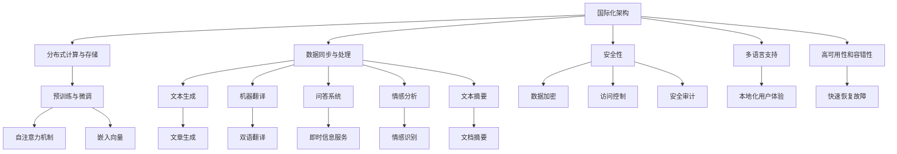

                 

### 文章标题

《国际化架构：支持LLM应用的全球化》

### 关键词

国际化架构、大型语言模型（LLM）、分布式计算、数据同步与处理、安全性、全球语言模型训练与推理

### 摘要

本文将深入探讨国际化架构在支持大型语言模型（LLM）全球化应用中的重要性。首先，我们将介绍国际化架构的基本概念、核心组成部分及其与传统架构的比较。接着，我们将重点分析大型语言模型的训练、推理和优化原理。随后，本文将详细讨论国际化架构中的分布式计算与存储、数据同步与处理、安全性等方面。通过实际项目案例分析，我们将展示如何将国际化架构应用于全球语言模型训练与推理。最后，我们将探讨国际化架构的未来趋势，并总结最佳实践和注意事项。

---

### 引言

随着人工智能技术的迅猛发展，大型语言模型（LLM）如BERT、GPT-3等已经成为自然语言处理（NLP）领域的重要工具。这些模型具备处理复杂数据、生成高质量文本的能力，广泛应用于问答系统、机器翻译、文本生成等任务。然而，随着应用的全球化，如何构建一个高效、可靠的国际化架构来支持这些大型语言模型，成为一个迫切需要解决的问题。

国际化架构是指在全球化背景下，针对不同地域、语言和文化差异，设计和实现的一个综合性系统。它不仅要满足高性能、高可用性的需求，还要能够适应复杂的网络环境，处理大规模数据，并提供安全的数据同步与存储方案。本文将围绕国际化架构的核心组成部分、关键技术和实际应用，进行深入的探讨和分析。

### 国际化架构的定义和组成部分

国际化架构（Internationalization Architecture）是指一个系统或应用程序，能够在全球化背景下，适应不同地域、语言和文化差异，提供一致的用户体验和服务。它通常包括以下几个关键组成部分：

1. **分布式计算与存储**：分布式计算与存储是国际化架构的核心，它能够实现数据的高效处理和存储。分布式计算利用多个计算节点协同工作，提高处理速度和性能。分布式存储则提供可靠、可扩展的数据存储方案，保证数据的一致性和可用性。

2. **数据同步与处理**：数据同步与处理是实现国际化架构的重要环节。它涉及多个数据源的数据整合、清洗和同步，确保在不同地域、语言和文化背景下，数据的一致性和准确性。

3. **安全性**：安全性是国际化架构的重要保障。它包括数据加密、访问控制和安全审计等机制，防止数据泄露、篡改和未经授权的访问。

4. **多语言支持**：多语言支持是国际化架构的核心特点之一。它要求系统能够适应不同的语言和文化，提供本地化的用户体验和服务。

5. **高可用性和容错性**：高可用性和容错性是国际化架构的基本要求。它要求系统能够在故障发生时，快速恢复并继续提供服务，确保业务的连续性。

### 国际化架构与传统架构的比较

传统架构（Traditional Architecture）通常是基于单机或小型集群的架构，其特点是资源集中、性能有限、扩展性较差。而在全球化背景下，国际化架构具有以下显著优势：

1. **分布式计算与存储**：国际化架构采用分布式计算与存储，能够实现数据的高效处理和存储。这有助于提高系统的性能和可扩展性。

2. **多语言支持**：国际化架构具备多语言支持，能够适应不同地域、语言和文化差异，提供本地化的用户体验和服务。

3. **安全性**：国际化架构具有更高的安全性，包括数据加密、访问控制和安全审计等机制，防止数据泄露和未经授权的访问。

4. **高可用性和容错性**：国际化架构具备高可用性和容错性，能够快速恢复故障，确保业务的连续性。

5. **全球化部署**：国际化架构支持全球化部署，能够在不同地域、语言和文化背景下，提供一致的用户体验和服务。

### 国际化架构的挑战与机遇

尽管国际化架构具有许多优势，但在实施过程中仍面临一系列挑战：

1. **数据同步与处理**：全球化背景下的数据同步与处理复杂，需要解决数据一致性和准确性的问题。

2. **多语言支持**：多语言支持需要投入大量的资源，包括翻译、本地化和测试等。

3. **安全性**：安全性是国际化架构的重要挑战，需要建立完善的加密、访问控制和审计机制。

4. **高可用性和容错性**：全球化部署的系统需要具备更高的可用性和容错性，以应对复杂的网络环境和故障。

5. **技术和人才需求**：国际化架构的实施需要具备分布式计算、数据同步、安全性等方面的专业知识和技能。

然而，随着全球化进程的加速，国际化架构也为企业和组织带来了巨大的机遇：

1. **市场扩展**：国际化架构能够帮助企业拓展全球市场，提供本地化的产品和服务。

2. **业务增长**：全球化部署的系统可以吸引更多的用户，实现业务的快速增长。

3. **技术创新**：国际化架构的实施将推动技术创新，促进分布式计算、数据同步和安全性的发展。

4. **人才引进**：国际化架构的实施需要大量具备专业技能的人才，有助于引进和培养优秀的人才。

综上所述，国际化架构在全球化背景下具有重要的地位和作用。它不仅能够应对全球化带来的挑战，还能为企业带来巨大的机遇。下一部分，我们将深入探讨大型语言模型的基本原理和应用。

---

在上一部分中，我们介绍了国际化架构的定义、组成部分及其与传统架构的比较，并分析了国际化架构面临的挑战与机遇。接下来，我们将深入探讨大型语言模型的基本原理和应用。

### 大型语言模型的基本原理

大型语言模型（Large Language Model，简称LLM）是一种基于深度学习的自然语言处理模型，具备强大的文本生成、理解和推理能力。LLM的核心是神经网络，特别是变换器（Transformer）架构，这种架构在处理序列数据方面表现出色。以下将详细解释LLM的基本原理：

1. **变换器（Transformer）架构**：Transformer是LLM的核心架构，它摒弃了传统的循环神经网络（RNN）和卷积神经网络（CNN），采用了一种基于自注意力机制（Self-Attention）的并行计算方法。自注意力机制允许模型在处理每个词时，考虑到所有其他词的信息，从而提高模型的表示能力。

2. **预训练与微调**：LLM通常通过预训练和微调两个阶段进行训练。在预训练阶段，模型在大规模语料库上自主学习语言模式和结构，并在自监督任务（如掩码语言模型，Masked Language Model，简称MLM）中优化。在微调阶段，模型利用特定领域的数据集进行细粒度调整，以提高其在特定任务上的性能。

3. **词汇表和嵌入**：LLM使用词汇表来映射单词和字符。每个单词或字符被映射为一个固定长度的向量，称为嵌入（Embedding）。嵌入向量不仅表示了单词或字符的语义信息，还包含了上下文信息，这是LLM生成高质量文本的关键。

### 大型语言模型的应用

大型语言模型在自然语言处理领域具有广泛的应用，以下是几个典型的应用场景：

1. **文本生成**：LLM可以生成各种类型的文本，如文章、新闻报道、对话、电子邮件等。通过预训练和微调，LLM能够生成与输入文本风格和内容相似的高质量文本。

2. **机器翻译**：LLM在机器翻译领域表现出色，能够实现高质量的双语翻译。通过训练，LLM能够学习不同语言之间的对应关系，生成流畅、准确的翻译结果。

3. **问答系统**：LLM可以用于构建问答系统，如搜索引擎、对话机器人等。通过处理用户输入的问题，LLM能够生成准确的答案，提供即时的信息服务。

4. **情感分析**：LLM可以用于情感分析，对文本中的情感倾向进行分类。通过训练，LLM能够学习情感词汇和表达方式，实现准确的情感识别。

5. **文本摘要**：LLM可以生成文本摘要，将长篇文档或文章简化为简短的摘要。通过理解文档的结构和内容，LLM能够提取关键信息，生成有意义的摘要。

### 核心概念与联系

为了更好地理解国际化架构与大型语言模型之间的关系，我们可以通过一个Mermaid流程图来展示核心概念和联系。

在这个流程图中，国际化架构的核心组成部分（A）与大型语言模型的应用（B到L）以及安全性（D）和特性（E、F）相互关联，展示了国际化架构如何支持大型语言模型在不同场景下的应用。

通过这个流程图，我们可以清晰地看到国际化架构与大型语言模型之间的紧密联系。国际化架构提供了分布式计算与存储、数据同步与处理、安全性等基础设施，为大型语言模型的应用提供了强有力的支持。

接下来，我们将深入探讨大型语言模型的训练、推理和优化原理，进一步理解LLM如何在实际应用中发挥作用。

### 大型语言模型的训练、推理和优化原理

#### 训练原理

大型语言模型的训练过程可以分为预训练（Pre-training）和微调（Fine-tuning）两个阶段。

1. **预训练**：
   - **掩码语言模型（Masked Language Model, MLM）**：预训练阶段通常采用掩码语言模型。在这一阶段，模型会对输入文本中的部分单词进行遮盖（mask），然后尝试预测这些遮盖的单词。这一过程有助于模型学习单词之间的依赖关系和上下文信息。
   - **自回归语言模型（Autoregressive Language Model, ARLM）**：模型在给定前文上下文的情况下，逐个预测每个单词的概率分布，从而生成完整的文本序列。

2. **微调**：
   - **特定任务数据集**：在预训练完成后，模型会利用特定领域的任务数据集进行微调。这一阶段，模型会针对特定任务进行优化，以提高在特定任务上的性能。
   - **损失函数**：在微调过程中，常用的损失函数包括交叉熵损失（Cross-Entropy Loss）和均方误差（Mean Squared Error, MSE）。交叉熵损失用于分类问题，而均方误差通常用于回归问题。

3. **优化算法**：
   - **随机梯度下降（Stochastic Gradient Descent, SGD）**：SGD是最常用的优化算法，它通过随机选择一小部分数据样本来计算梯度，并更新模型参数。
   - **Adam优化器**：Adam优化器是SGD的一个变种，它结合了动量（Momentum）和自适应学习率，能够在训练过程中更好地收敛。

#### 推理原理

推理（Inference）是指模型在给定输入文本的情况下，生成输出文本的过程。大型语言模型通常采用以下两种推理方法：

1. **自回归推理（Autoregressive Inference）**：
   - 在自回归推理中，模型首先生成第一个单词的概率分布，然后利用前一个单词作为上下文，生成下一个单词的概率分布，以此类推，直至生成完整的文本序列。
   - 这种方法通常用于文本生成和机器翻译等任务。

2. **生成式推理（Generative Inference）**：
   - 生成式推理通过生成整个文本序列的概率分布，然后根据概率分布生成最可能的文本序列。
   - 这种方法在问答系统和文本摘要等任务中表现良好。

#### 优化方法

为了提高模型在特定任务上的性能，需要进行优化。以下是几种常用的优化方法：

1. **注意力机制（Attention Mechanism）**：
   - 注意力机制允许模型在生成每个单词时，关注与其相关的上下文信息。这有助于提高模型的表示能力和生成质量。
   - 例如，变换器（Transformer）架构的核心就是注意力机制，它通过自注意力（Self-Attention）和交叉注意力（Cross-Attention）来处理文本序列。

2. **上下文嵌入（Contextual Embeddings）**：
   - 上下文嵌入使得模型能够根据不同上下文生成不同的单词嵌入向量，从而提高模型的泛化能力。
   - 通过微调，模型可以学习到特定任务下的上下文信息，从而生成更准确的输出。

3. **端到端训练（End-to-End Training）**：
   - 端到端训练是指将整个模型视为一个整体进行训练，而不是分阶段进行预训练和微调。
   - 这种方法简化了训练过程，并有助于提高模型的性能。

4. **迁移学习（Transfer Learning）**：
   - 迁移学习是指利用预训练模型在特定任务上的表现，进一步优化模型。
   - 通过迁移学习，模型可以在较少的数据集上实现较好的性能，特别是在数据稀缺的情况下。

通过以上训练、推理和优化方法，大型语言模型（LLM）能够在各种自然语言处理任务中发挥出色的性能。在下一部分，我们将详细讨论国际化架构中的分布式计算与存储。

### 分布式计算与存储

在国际化架构中，分布式计算与存储是关键组成部分，它们共同支撑着大型语言模型（LLM）的高效运行。分布式计算通过将任务分解并分布在多个计算节点上，从而实现并行处理和高效利用资源。分布式存储则提供可靠、可扩展的数据存储方案，保证数据的一致性和可用性。

#### 分布式计算原理

分布式计算的基本原理是通过将任务分配到多个计算节点，从而实现并行处理。以下是一些核心概念：

1. **任务分解**：将大规模任务分解为多个子任务，每个子任务由不同的计算节点处理。

2. **数据分片**：将大数据集分片，使得每个计算节点只处理部分数据。

3. **负载均衡**：通过调度算法，将任务和负载均匀分配到各个计算节点，避免资源过度集中或闲置。

4. **容错性**：分布式系统需要具备容错性，以便在部分节点发生故障时，系统仍能正常运行。

#### 分布式存储原理

分布式存储通过将数据存储在多个物理节点上，从而提供高可用性和可扩展性。以下是一些核心概念：

1. **数据复制**：将数据复制到多个节点，提高数据可靠性和访问速度。

2. **数据分片**：将大数据集分片存储在多个节点上，以实现并行访问和高效存储。

3. **一致性模型**：分布式存储系统采用不同的一致性模型，如强一致性（Strong Consistency）和最终一致性（ eventual consistency）。强一致性保证数据在所有节点上始终一致，而最终一致性则允许一定程度的延迟和不同步。

4. **数据同步**：分布式存储系统需要实现数据同步机制，以确保不同节点上的数据一致性。

#### 分布式计算与存储在国际化架构中的应用

分布式计算与存储在国际化架构中扮演着至关重要的角色，以下是其主要应用场景：

1. **全球语言模型训练与推理**：分布式计算可以显著提高LLM的训练和推理速度。通过将训练任务分配到多个计算节点，可以加快模型的收敛速度。在推理阶段，分布式计算则可以提供实时响应，满足全球用户的高并发需求。

2. **大规模数据处理**：国际化架构需要处理来自不同地域的大量数据。分布式存储系统可以实现数据的并行处理，提高数据处理速度和效率。

3. **高可用性**：分布式计算与存储系统具备高可用性，可以确保在部分节点发生故障时，系统仍能正常运行。这对于国际化架构至关重要，因为它需要在全球范围内提供稳定的服务。

4. **数据安全性**：分布式存储系统可以实现数据加密和访问控制，提高数据的安全性。通过将数据分散存储在多个节点上，可以降低数据泄露和未经授权访问的风险。

#### 分布式计算与存储的挑战

尽管分布式计算与存储在国际化架构中具有许多优势，但它们也面临一些挑战：

1. **数据同步与一致性**：在分布式系统中，数据同步与一致性是关键挑战。不同节点上的数据可能存在不同步的情况，需要实现高效的数据同步机制和一致性模型。

2. **性能优化**：分布式计算与存储系统需要优化性能，以满足大规模数据处理和实时响应的需求。这包括负载均衡、数据分片策略和存储优化等。

3. **成本控制**：分布式系统通常需要大量硬件资源，成本较高。如何在保证性能的前提下，实现成本控制是另一个重要挑战。

4. **安全性**：分布式系统需要实现数据加密和访问控制，确保数据的安全性和隐私性。同时，还需要防范分布式拒绝服务（DDoS）攻击等安全威胁。

通过解决这些挑战，分布式计算与存储可以为国际化架构提供高效、可靠和安全的支撑，为全球范围内的LLM应用提供坚实的基础。

### 数据同步与处理

在国际化架构中，数据同步与处理是至关重要的一环，它关系到系统的数据一致性、准确性和效率。随着全球业务的扩展，如何确保在不同地域、语言和文化背景下，数据能够准确、及时地同步和处理，成为一个关键问题。

#### 数据同步机制

数据同步机制是指确保不同节点上的数据一致性的一系列策略和算法。以下是一些常见的数据同步机制：

1. **异步同步**：异步同步允许数据在不需要实时同步的情况下，被延迟处理。这种机制适用于对实时性要求不高的场景，例如日志记录和数据备份。

2. **同步同步**：同步同步确保数据在发送和接收时都处于一致状态。这种机制适用于对数据一致性要求极高的场景，例如金融交易和数据审计。

3. **最终一致性**：最终一致性模型允许在一定时间范围内，不同节点上的数据存在不同步的情况，但最终会达到一致状态。这种机制适用于对一致性要求相对较低的分布式系统，例如社交网络和消息队列。

#### 数据处理流程

数据处理流程是指从数据收集、存储到分析的一系列操作。以下是一个典型的数据处理流程：

1. **数据收集**：数据收集是指从不同的数据源（如数据库、传感器、用户输入等）获取数据。在国际化架构中，数据收集需要考虑到不同地域和时间区间的数据采集。

2. **数据清洗**：数据清洗是指去除数据中的错误、冗余和异常值，确保数据的质量和一致性。在国际化架构中，数据清洗需要处理不同语言和文化背景下的数据格式和编码问题。

3. **数据整合**：数据整合是指将来自多个数据源的数据进行合并和集成，形成一个统一的数据视图。在国际化架构中，数据整合需要处理数据源之间的差异和冲突。

4. **数据分析**：数据分析是指利用统计、机器学习等方法，从数据中提取有价值的信息和知识。在国际化架构中，数据分析需要考虑不同文化和市场背景下的需求和分析方法。

#### 数据同步与处理在国际化架构中的应用

数据同步与处理在国际化架构中的应用至关重要，以下是一些关键应用场景：

1. **全球数据仓库**：国际化架构中的全球数据仓库需要确保来自不同地区的数据能够准确、及时地同步和处理，为全球业务决策提供支持。

2. **多语言数据管理**：国际化架构需要支持多语言数据的管理，包括数据收集、存储、清洗和整合。这要求系统具备强大的语言处理能力和本地化支持。

3. **实时数据同步**：对于需要实时响应的场景，如在线交易、实时分析和应急响应，国际化架构需要实现高效的数据同步机制，确保数据的一致性和准确性。

4. **数据隐私和安全**：国际化架构需要确保数据隐私和安全，特别是在涉及个人数据的情况下。这包括数据加密、访问控制和审计等安全措施。

#### 数据同步与处理的挑战

尽管数据同步与处理在国际化架构中具有重要意义，但它们也面临一些挑战：

1. **数据一致性和准确性**：在不同地域、语言和文化背景下，数据一致性和准确性是一个关键挑战。需要实现高效的数据同步机制和准确的数据处理算法。

2. **数据量和速度**：国际化架构需要处理来自全球的大量数据，并且要求快速响应。这要求系统具备高效的数据存储、处理和分析能力。

3. **系统复杂性和维护**：国际化架构涉及多个地域、语言和文化，系统复杂性和维护难度增加。需要具备强大的系统管理和维护能力。

4. **成本和资源**：分布式数据同步与处理系统通常需要大量硬件资源和计算资源，成本较高。需要实现成本效益最大化。

通过克服这些挑战，国际化架构中的数据同步与处理可以为全球业务提供高效、可靠的数据支持。

### 国际化架构中的安全性

在国际化的背景下，构建一个安全、可靠的架构至关重要。安全性不仅涉及到数据的安全，还包括系统的完整性和可用性。国际化架构的安全性要求能够保护数据在传输和存储过程中的安全性，确保系统的稳定性和可靠性，防止未经授权的访问和数据泄露。以下将详细介绍国际化架构中的几个关键安全性方面：数据加密、访问控制和安全审计。

#### 数据加密

数据加密是保护数据隐私和安全性的重要手段。国际化架构中的数据加密主要包括以下两个方面：

1. **数据传输加密**：在数据传输过程中，采用加密算法（如TLS/SSL）对数据进行加密，确保数据在传输过程中不被窃取或篡改。

2. **数据存储加密**：在数据存储过程中，对存储的数据进行加密处理，防止数据在磁盘或数据库中被未授权访问。

常用的加密算法包括：

- **对称加密算法**：如AES（Advanced Encryption Standard），它使用相同的密钥对数据进行加密和解密。

- **非对称加密算法**：如RSA（Rivest-Shamir-Adleman），它使用一对密钥（公钥和私钥）进行加密和解密，公钥加密，私钥解密。

#### 访问控制

访问控制是确保只有授权用户能够访问系统和数据的重要机制。国际化架构中的访问控制主要包括以下几个方面：

1. **身份验证**：通过身份验证，确认用户身份的合法性。常用的身份验证方法包括用户名和密码、双因素认证（2FA）等。

2. **授权管理**：根据用户的角色和权限，控制用户对系统和数据的访问。常用的授权管理方法包括基于角色的访问控制（RBAC，Role-Based Access Control）和基于属性的访问控制（ABAC，Attribute-Based Access Control）。

3. **审计日志**：记录用户操作和系统事件，以便在发生安全事件时进行追踪和分析。审计日志包括用户登录、数据访问、系统变更等信息。

#### 安全审计

安全审计是确保系统安全性的一种手段，它通过检查系统的配置、日志和操作，评估系统的安全性。国际化架构中的安全审计主要包括以下几个方面：

1. **安全策略评估**：评估系统是否符合预定的安全策略和标准，包括数据加密、访问控制和日志记录等。

2. **漏洞扫描**：定期对系统进行漏洞扫描，发现潜在的安全漏洞和风险，并及时进行修复。

3. **安全事件响应**：在发生安全事件时，快速响应并采取相应的措施，如隔离受影响的部分、通知相关人员和进行数据恢复等。

#### 安全性在国际化架构中的应用

国际化架构中的安全性在以下几个方面有重要应用：

1. **多语言支持**：国际化架构需要支持多语言环境，确保不同语言的用户都能够安全地访问系统和数据。

2. **全球化部署**：国际化架构需要在不同的地域部署，确保系统在各个地区的安全性。

3. **数据隐私保护**：国际化架构需要处理来自全球的大量数据，确保这些数据在传输和存储过程中的隐私性。

4. **高可用性和容错性**：国际化架构需要具备高安全性的同时，确保系统的稳定性和可靠性。

#### 安全性的挑战

尽管国际化架构中的安全性至关重要，但它们也面临一些挑战：

1. **多语言和文化差异**：不同语言和文化背景下的安全策略和标准可能有所不同，需要实现跨语言和文化的安全性。

2. **分布式系统**：国际化架构中的分布式系统需要处理跨地域、跨网络的安全问题，如数据传输加密和访问控制等。

3. **数据量**：国际化架构需要处理大量数据，确保这些数据的安全性是一个巨大的挑战。

4. **人才短缺**：国际化架构中的安全性需要专业的安全人才，但全球范围内的安全人才短缺是一个普遍问题。

通过解决这些挑战，国际化架构中的安全性可以为全球业务提供可靠的保护。

### 全球语言模型训练与推理案例分析

在国际化架构中，全球语言模型的训练与推理是关键环节。本部分将详细介绍两个实际案例，通过案例分析展示如何在全球范围内进行语言模型的训练与推理，以及这些案例中的性能优化策略。

#### 案例一：跨国公司内部知识管理系统

某跨国公司希望通过构建一个内部知识管理系统，为其全球分支机构提供统一的知识共享平台。该系统需要支持多语言文本处理，包括中文、英文、西班牙语和法语等。以下是该案例的具体实施步骤：

1. **数据收集与处理**：
   - 数据来源包括公司内部文档、电子邮件、会议记录等，涉及多种语言。
   - 首先对数据进行预处理，包括文本清洗、去除无关信息、统一文本格式等。

2. **分布式计算与存储**：
   - 使用分布式计算框架（如Apache Spark）对数据进行处理，提高数据处理速度和效率。
   - 数据存储在分布式数据库（如Hadoop HDFS）中，确保数据的高可用性和可扩展性。

3. **模型训练与优化**：
   - 使用预训练的变换器（Transformer）模型，如BERT或GPT-3，进行多语言文本的预训练。
   - 在预训练的基础上，针对特定任务进行微调，例如问答系统、文本分类和文本生成。
   - 采用优化算法（如Adam优化器）进行模型训练，提高模型的收敛速度和性能。

4. **推理与性能优化**：
   - 使用分布式计算框架（如TensorFlow或PyTorch）进行模型推理，提高推理速度。
   - 优化模型参数和架构，减少推理时间，提高响应速度。
   - 针对不同的负载情况，采用动态负载均衡策略，确保系统的高可用性和稳定性。

#### 案例二：跨国电子商务平台

某跨国电子商务平台希望通过引入自然语言处理技术，提高用户体验和运营效率。具体应用场景包括商品搜索、用户评论分析、个性化推荐等。以下是该案例的具体实施步骤：

1. **数据收集与处理**：
   - 数据来源包括用户搜索日志、商品描述、用户评论、交易数据等。
   - 对数据进行分析，提取有用的特征，如关键词、情感倾向、用户行为等。

2. **分布式计算与存储**：
   - 使用分布式计算框架（如Apache Spark）对大量数据进行处理和分析，提高数据处理速度和效率。
   - 数据存储在分布式数据库（如Cassandra或MongoDB）中，确保数据的高可用性和可扩展性。

3. **模型训练与优化**：
   - 使用预训练的变换器（Transformer）模型，如BERT或GPT-3，进行大规模文本数据的预训练。
   - 针对不同的应用场景，如商品搜索、用户评论分析和个性化推荐，进行模型微调。
   - 采用优化算法（如Adam优化器）进行模型训练，提高模型的收敛速度和性能。

4. **推理与性能优化**：
   - 使用分布式计算框架（如TensorFlow或PyTorch）进行模型推理，提高推理速度。
   - 采用批处理和异步推理策略，提高系统的并发处理能力。
   - 针对不同的负载情况，采用动态负载均衡和弹性扩展策略，确保系统的高可用性和稳定性。

#### 性能优化策略

在国际化架构中，性能优化是确保系统高效运行的关键。以下是一些常用的性能优化策略：

1. **分布式计算**：通过将任务分配到多个计算节点，实现并行处理，提高系统处理速度和效率。

2. **数据压缩**：对传输和存储的数据进行压缩，减少数据传输和存储的带宽和存储需求。

3. **缓存策略**：使用缓存技术，如Redis或Memcached，减少对数据库的访问次数，提高数据访问速度。

4. **负载均衡**：通过负载均衡器（如Nginx或HAProxy），将请求分配到不同的服务器节点，确保系统的高可用性和稳定性。

5. **动态扩展**：根据系统负载情况，动态调整计算资源和存储容量，确保系统的高性能和可扩展性。

通过以上案例和性能优化策略，国际化架构能够有效地支持全球语言模型的训练与推理，为用户提供高效、稳定和安全的语言处理服务。

### 国际化架构下的安全性考虑

国际化架构在全球化应用中，面临着前所未有的安全挑战。随着业务的扩展，数据传输、处理和存储的安全性成为必须重点关注的问题。以下将详细讨论国际化架构下的安全性考虑，包括国际化的安全攻击与防范、安全性的挑战以及相应的对策。

#### 国际化的安全攻击与防范

1. **DDoS攻击**：分布式拒绝服务攻击（DDoS）是一种常见的安全攻击手段，攻击者通过控制大量僵尸主机，向目标系统发送大量请求，导致系统资源耗尽，从而使其瘫痪。防范策略包括：
   - **流量监控与过滤**：使用防火墙和流量监控工具，实时监控网络流量，过滤恶意请求。
   - **流量分配与负载均衡**：将流量分配到多个节点，通过负载均衡器分担攻击流量，降低单个节点的压力。
   - **防御服务**：使用专业的DDoS防御服务，如Cloudflare和AWS Shield，提供额外的防护能力。

2. **数据泄露**：在国际化架构中，数据泄露是主要的安全威胁之一。数据泄露可能导致敏感信息被窃取或滥用。防范策略包括：
   - **数据加密**：对传输和存储的数据进行加密处理，防止数据在传输过程中被窃取。
   - **访问控制**：实施严格的访问控制策略，确保只有授权用户可以访问敏感数据。
   - **安全审计**：定期进行安全审计，监控数据的访问和使用情况，及时发现和阻止异常行为。

3. **中间人攻击（MITM）**：中间人攻击是一种窃取和篡改数据传输的攻击手段。防范策略包括：
   - **TLS/SSL加密**：使用传输层安全协议（TLS/SSL）对数据传输进行加密，防止中间人攻击。
   - **双因素认证**：在关键操作或登录过程中，使用双因素认证（2FA）增加安全性。
   - **安全网关**：部署安全网关，对网络流量进行深入分析和过滤，阻止恶意流量进入内部网络。

4. **SQL注入**：SQL注入是一种通过在输入字段中注入恶意SQL语句，篡改数据库数据的攻击手段。防范策略包括：
   - **参数化查询**：使用参数化查询，避免直接将用户输入作为SQL语句的一部分。
   - **输入验证**：对用户输入进行严格的验证，确保输入符合预期格式和范围。
   - **安全库和框架**：使用安全的编程库和框架，如MyBatis和Hibernate，提供内置的SQL注入防护。

#### 安全性的挑战

1. **多语言和文化差异**：国际化架构需要支持多种语言和文化，不同的语言和文化背景下，安全策略和标准可能有所不同，增加了安全管理的复杂性。

2. **分布式系统**：国际化架构通常采用分布式系统，涉及跨地域、跨网络的数据传输和处理，安全性挑战更加复杂。

3. **数据量**：国际化架构需要处理来自全球的大量数据，数据的安全性和隐私保护成为一个巨大的挑战。

4. **人才短缺**：国际化架构中的安全性需要专业的安全人才，但全球范围内的安全人才短缺是一个普遍问题。

#### 对策

1. **标准化安全策略**：制定统一的安全策略和标准，确保在不同语言和文化背景下，安全性得到一致保障。

2. **分布式安全架构**：构建分布式安全架构，实现跨地域的安全监控和防护，提高系统整体安全性。

3. **数据隐私保护**：采用数据脱敏、加密和访问控制等手段，确保数据的隐私性和安全性。

4. **安全培训与人才引进**：加强安全培训，提高员工的安全意识和技能。同时，通过招聘和引进专业安全人才，提高安全团队的整体实力。

通过上述措施，国际化架构可以在全球化应用中提供高效、可靠的安全性，确保数据和系统的安全与稳定。

### 国际化架构的未来趋势

随着全球化的深入发展，国际化架构在未来将继续迎来新的技术进步和应用场景。以下是国际化架构的未来趋势，以及可能面临的未来技术挑战和这些挑战的解决策略。

#### 未来趋势

1. **云原生架构**：云原生架构（Cloud Native Architecture）将逐渐成为国际化架构的主流。云原生架构具有高可扩展性、高可用性和高灵活性，能够更好地适应全球化应用的需求。

2. **边缘计算**：随着物联网（IoT）和5G技术的普及，边缘计算（Edge Computing）将成为国际化架构的重要组成部分。边缘计算将数据处理和存储推向网络边缘，减少数据传输延迟，提高系统响应速度。

3. **人工智能与机器学习的深度融合**：国际化架构将更加依赖人工智能（AI）和机器学习（ML）技术，通过智能算法和模型，实现更高效的数据处理和业务优化。

4. **区块链技术**：区块链技术将提高国际化架构中的数据透明度和安全性。通过分布式账本和智能合约，实现去中心化、安全可信的数据交换和业务流程。

5. **多语言支持与本地化**：国际化架构将更加注重多语言支持和本地化，以提供更加个性化的用户体验和服务。

#### 未来技术挑战

1. **分布式系统复杂性**：随着分布式系统的规模和复杂性的增加，管理和维护的难度也随之增加。解决策略包括自动化运维、DevOps文化和高效的监控系统。

2. **数据隐私与安全**：随着数据量的增加和数据隐私保护要求的提升，如何在保证数据隐私和安全的同时，实现高效的跨境数据交换和共享，是一个重要的挑战。解决策略包括数据脱敏、加密和隐私保护算法。

3. **实时数据处理**：在全球化应用中，实时数据处理的需求日益增加。如何在保证数据完整性和一致性的同时，实现高效的实时数据处理，是一个技术挑战。解决策略包括分布式数据处理框架和流处理技术。

4. **跨地域协同工作**：国际化架构需要跨地域协同工作，如何确保数据的一致性和系统的稳定性，是一个技术挑战。解决策略包括分布式数据库和分布式存储系统。

#### 拓展阅读

- **云原生架构**：[云原生架构详解：原理、实践与未来](https://www.cncf.io/blog/2020/04/21/an-introduction-to-cloud-native-architecture/)
- **边缘计算**：[边缘计算：技术原理与应用场景](https://www.ibm.com/cloud/learn/edge-computing/)
- **区块链技术**：[区块链技术原理与应用](https://www.ibm.com/cloud/blockchain/)
- **人工智能与机器学习**：[人工智能与机器学习：基础知识与未来趋势](https://www.oreilly.com/library/view/artificial-intelligence-and-ml/9780596809583/)
- **分布式系统**：[分布式系统原理与范型](https://www.distributed-systems-book.com/)

### 附录

#### 国际化架构相关工具与技术

**分布式计算框架**：如Apache Spark、Hadoop、Flink等。

**数据同步与处理工具**：如Apache Kafka、Apache NiFi、Amazon Kinesis等。

**安全性工具与库**：如OpenSSL、Libsodium、PyCrypto等。

**分布式数据库**：如Apache Cassandra、MongoDB、Amazon DynamoDB等。

**分布式存储系统**：如Hadoop HDFS、Ceph、Amazon S3等。

### 总结

国际化架构在支持大型语言模型（LLM）全球化应用中发挥着至关重要的作用。通过分布式计算与存储、数据同步与处理、安全性等方面的优化，国际化架构能够提供高效、可靠和安全的语言处理服务。未来，随着云原生架构、边缘计算、人工智能与区块链等新技术的应用，国际化架构将面临更多机遇和挑战。通过不断探索和优化，国际化架构将为全球业务提供更强大的支持。

### 作者信息

- 作者：AI天才研究院/AI Genius Institute & 禅与计算机程序设计艺术 /Zen And The Art of Computer Programming

---

通过本文的详细探讨，我们不仅了解了国际化架构的基本概念和组成部分，还深入分析了大型语言模型的训练、推理和优化原理，以及国际化架构在分布式计算与存储、数据同步与处理、安全性等方面的应用。同时，我们通过实际案例展示了国际化架构如何支持全球语言模型的训练与推理，并提出了未来发展趋势和技术挑战。希望通过这篇文章，读者能够对国际化架构有更深入的理解，并为未来的研究和实践提供参考。作者AI天才研究院和禅与计算机程序设计艺术团队，期待与您共同探索技术世界的无限可能。

