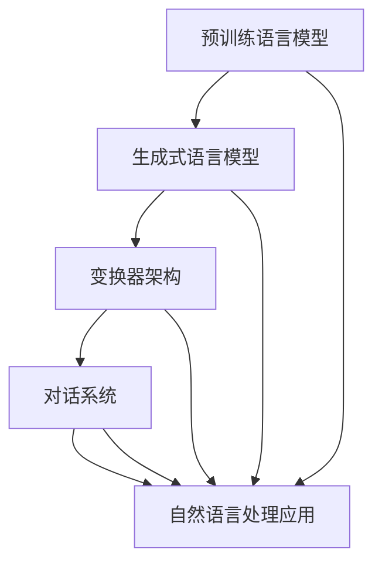

                 

## 文章标题：基于ChatGPT的LLM对话交互能力测试

### 关键词：ChatGPT，LLM，对话交互，能力测试，自然语言处理，预训练模型

### 摘要：
本文将深入探讨基于ChatGPT的预训练语言模型（LLM）在对话交互能力方面的测试方法与实践。我们将从基础概念出发，逐步分析ChatGPT的工作原理及其对话交互能力的评估指标，详细讲解测试方法与案例，并探讨如何提升LLM的对话交互能力。最后，我们将展望未来LLM对话交互能力的发展趋势和面临的挑战。

## 引言

随着人工智能技术的快速发展，自然语言处理（NLP）领域取得了显著进展。特别是预训练语言模型（Pre-Trained Language Model，简称PLM），如GPT系列模型，在处理文本数据方面展现出了强大的能力。ChatGPT，作为OpenAI开发的基于GPT-3模型的聊天机器人，更是将LLM在对话交互中的潜力发挥得淋漓尽致。然而，要充分挖掘ChatGPT的对话交互能力，需要对其进行系统化的测试和评估。

本文旨在探讨基于ChatGPT的LLM对话交互能力测试方法，具体包括：

1. **背景介绍**：介绍自然语言处理与LLM的基础知识，以及ChatGPT的起源和发展。
2. **核心概念与联系**：分析LLM与ChatGPT的关系架构，并绘制Mermaid流程图。
3. **核心算法原理讲解**：使用伪代码详细阐述对话交互中的关键算法原理。
4. **数学模型与公式**：介绍与对话交互能力评估相关的数学模型，并提供公式与举例说明。
5. **项目实战**：详细讲解开发环境搭建、源代码实现与代码解读，并进行实际案例分析。
6. **最佳实践与总结**：总结测试实践中的经验与教训，提供最佳实践建议。

通过本文的探讨，读者将能够全面了解ChatGPT对话交互能力的测试方法，并学会如何提升这一能力，从而在NLP领域取得更好的成果。

## 背景介绍

自然语言处理（NLP）是人工智能（AI）的一个重要分支，旨在让计算机理解和处理人类语言。随着互联网和大数据的兴起，NLP的应用场景越来越广泛，包括搜索引擎、机器翻译、语音识别、智能客服等。在这些应用中，对话系统是尤为关键的一部分，因为它直接与用户进行交互，提供实时、自然的沟通体验。

预训练语言模型（Pre-Trained Language Model，简称PLM）是NLP领域的一项重要突破。与传统方法相比，PLM通过在大规模语料库上进行预训练，学会了语言的通用特征和规律，从而在多个下游任务中表现出色。GPT系列模型，由OpenAI提出，是PLM中的代表。GPT（Generative Pre-trained Transformer）模型基于变换器（Transformer）架构，通过自回归的方式生成文本，具有强大的生成能力和上下文理解能力。

ChatGPT，全名为Chat-based Generative Pre-trained Transformer，是OpenAI开发的一款基于GPT-3模型的聊天机器人。GPT-3是GPT系列的最新版本，拥有1750亿个参数，是迄今为止最大的预训练语言模型。ChatGPT通过API接口提供文本生成服务，可以与各种应用系统集成，实现智能对话交互。

ChatGPT的成功离不开以下几个关键因素：

1. **大规模预训练**：ChatGPT在GPT-3模型的基础上，通过大规模语料库进行预训练，学会了丰富的语言知识和上下文理解能力。
2. **生成模型架构**：GPT-3采用了变换器（Transformer）架构，具有并行处理能力和长距离依赖捕捉能力，使得生成文本更加流畅和连贯。
3. **灵活的API接口**：ChatGPT提供了灵活的API接口，可以方便地与其他系统进行集成，实现实时对话交互。
4. **多模态交互**：ChatGPT不仅可以处理文本，还可以与语音、图像等多种模态进行交互，为用户提供了更丰富的沟通体验。

总之，ChatGPT作为一款基于GPT-3模型的聊天机器人，具有强大的生成能力和上下文理解能力，在自然语言处理领域取得了显著的成果。通过对ChatGPT对话交互能力的测试，我们可以更好地理解其工作原理，并为实际应用提供有价值的参考。

## 核心概念与联系

在深入探讨基于ChatGPT的LLM对话交互能力之前，我们首先需要明确几个核心概念及其相互关系。以下是关键概念及其定义：

1. **预训练语言模型（PLM）**：预训练语言模型是通过对大量文本数据预训练得到的一种模型，它能够理解和生成自然语言。常见的预训练模型包括BERT、RoBERTa、GPT等。

2. **生成式语言模型（Generative Language Model）**：生成式语言模型能够根据输入的文本片段生成完整的句子或段落。GPT系列模型是生成式语言模型的代表。

3. **变换器（Transformer）架构**：变换器是一种基于自注意力机制的深度神经网络架构，它通过全局上下文信息来生成文本，相比传统的循环神经网络（RNN）具有更强大的处理能力和效率。

4. **对话系统**：对话系统是一种与人类进行自然语言交互的计算机系统，它包括语音识别、自然语言理解、对话生成和语音合成等模块。

为了更直观地展示这些概念之间的关系，我们可以使用Mermaid流程图来描述：



在上面的流程图中，预训练语言模型（A）是生成式语言模型（B）的基础，而变换器架构（C）则是生成式语言模型的实现方式。对话系统（D）作为自然语言处理（NLP）的应用之一，直接依赖于预训练语言模型和变换器架构。通过这个流程图，我们可以清晰地看到各个核心概念之间的联系，为后续的详细讨论打下基础。

## 核心算法原理讲解

在深入探讨ChatGPT的对话交互能力之前，我们需要理解其背后的核心算法原理。ChatGPT是基于GPT-3模型的，而GPT-3模型的核心在于其生成文本的能力。下面，我们将使用伪代码详细阐述GPT-3模型在对话交互中的关键算法原理。

### 1. 自回归语言模型

GPT-3是一种自回归语言模型，其基本原理是根据前文生成下一个单词。以下是自回归语言模型的伪代码：

```python
function generate_sentence(previous_context):
    # 输入：previous_context（前文）
    # 输出：下一个单词

    # 使用预训练模型预测下一个单词
    next_word = pre-trained_model.predict(previous_context)

    # 返回下一个单词
    return next_word
```

在上面的伪代码中，`pre-trained_model` 是一个经过大规模预训练的GPT-3模型，`previous_context` 是当前已生成的文本片段。模型通过输入前文，预测下一个单词，从而生成完整的句子或段落。

### 2. 变换器架构

GPT-3采用变换器（Transformer）架构，其核心是自注意力机制。以下是变换器架构的核心算法原理：

```python
function transformer_encoder(input_sequence):
    # 输入：input_sequence（输入序列）
    # 输出：encoded_sequence（编码序列）

    # 初始化变换器层
    layers = initialize_transformer_layers()

    # 对输入序列进行编码
    encoded_sequence = layers(input_sequence)

    # 返回编码序列
    return encoded_sequence
```

在上面的伪代码中，`initialize_transformer_layers()` 用于初始化变换器层，包括自注意力机制和前馈神经网络。`input_sequence` 是输入的文本序列，`encoded_sequence` 是经过编码后的序列，包含了上下文信息。

### 3. 生成文本

生成文本是GPT-3模型的关键任务，其原理是基于编码序列生成下一个单词。以下是生成文本的伪代码：

```python
function generate_text(encoded_sequence):
    # 输入：encoded_sequence（编码序列）
    # 输出：generated_sentence（生成的句子）

    # 初始化生成的句子
    generated_sentence = ""

    # 循环生成下一个单词，直到达到停止条件
    while not stop_condition_met:
        # 使用变换器模型生成下一个单词
        next_word = transformer_model.predict(encoded_sequence)

        # 更新编码序列和生成的句子
        encoded_sequence = update_encoded_sequence(encoded_sequence, next_word)
        generated_sentence += " " + next_word

    # 返回生成的句子
    return generated_sentence
```

在上面的伪代码中，`transformer_model` 是经过训练的GPT-3模型，`stop_condition_met` 是停止条件，例如生成的句子长度达到限制或文本不再变化。通过不断生成下一个单词，模型最终生成完整的句子。

### 4. 对话生成

对话生成是GPT-3模型在对话系统中的应用，其核心是生成流畅且合理的对话文本。以下是对话生成的伪代码：

```python
function generate_conversation(history):
    # 输入：history（对话历史）
    # 输出：response（回答）

    # 将对话历史编码为序列
    encoded_history = encoder.encode(history)

    # 生成回答
    response = generate_text(encoded_history)

    # 返回回答
    return response
```

在上面的伪代码中，`encoder` 是用于编码对话历史的变换器编码器，`generate_text()` 是用于生成文本的函数。通过将对话历史编码为序列，并生成相应的回答，GPT-3模型能够实现智能对话生成。

通过上述伪代码，我们可以清晰地看到GPT-3模型在对话交互中的核心算法原理。这些原理不仅解释了模型如何生成文本，还揭示了其在理解和生成自然语言方面的强大能力。了解这些原理对于深入探讨ChatGPT的对话交互能力至关重要。

## 数学模型与公式

在探讨LLM对话交互能力的评估过程中，数学模型和公式扮演着重要角色。以下是几个关键数学模型，用于衡量对话系统的性能。

### 1. 对话质量评估模型

对话质量评估通常通过多个指标来衡量，包括回复相关性、回复流畅性和回复多样性。一个常用的评估模型是F1 Score，用于衡量回复的相关性和流畅性。

```latex
F1\_Score = 2 \times \frac{precision \times recall}{precision + recall}
```

其中，precision是正确回复的比例，recall是相关回复的比例。一个高F1 Score表明系统在回复相关性和流畅性方面表现良好。

### 2. 语义理解能力评估模型

语义理解能力评估通常通过BLEU（Bilingual Evaluation Understudy）评分来衡量。BLEU评分基于参考文本与生成文本之间的相似度，分数越高，表示语义理解能力越强。

```latex
BLEU = \frac{1}{N} \sum_{i=1}^{N} max(p_1, p_2, ..., p_n)
```

其中，N是评估中使用的参考文本数量，$p_i$ 是每个参考文本与生成文本之间的相似度分数。

### 3. 响应多样性评估模型

响应多样性评估通过计算生成文本的词汇丰富度和句子多样性来衡量。一个常用的指标是词汇多样性评分（VDS），计算公式如下：

```latex
VDS = \frac{1}{V} \sum_{i=1}^{V} \frac{1}{f_i}
```

其中，V是生成文本中不同词汇的数量，$f_i$ 是每个词汇在文本中出现的频率。VDS分数越高，表示生成文本的多样性越强。

### 举例说明

假设我们有一个生成文本片段：“今天天气很好，适合户外活动。”参考文本为：“今天天气晴朗，适合散步。”我们可以计算这些指标的分数。

- **F1 Score**:
  - Precision = 3/4（正确回复的比例）
  - Recall = 3/4（相关回复的比例）
  - F1 Score = 2 \times \frac{3/4 \times 3/4}{3/4 + 3/4} = 0.75

- **BLEU评分**:
  - Similarity分数 = 0.8（假设相似度计算结果）
  - BLEU评分 = \frac{1}{3} \times (0.8 + 0.8 + 0.8) = 0.8

- **VDS评分**:
  - V = 6（生成文本中不同词汇的数量）
  - $f_1$ = 2（"今天"出现2次），$f_2$ = 1（其他词汇的出现次数）
  - VDS评分 = \frac{1}{6} \times (1/2 + 1/1 + 1/1 + 1/1 + 1/1 + 1/1) = 0.5

通过这些数学模型和公式的计算，我们可以更全面地评估ChatGPT的对话交互能力。这些指标不仅帮助我们理解模型的性能，还为改进对话系统提供了依据。

## 项目实战

### 1. 开发环境搭建

为了测试ChatGPT的对话交互能力，我们首先需要搭建一个合适的开发环境。以下是具体的步骤：

#### 步骤一：安装Python环境
```bash
# 安装Python
sudo apt-get install python3

# 安装虚拟环境
pip3 install virtualenv
```

#### 步骤二：创建虚拟环境
```bash
# 创建虚拟环境
virtualenv chatgpt_env

# 激活虚拟环境
source chatgpt_env/bin/activate
```

#### 步骤三：安装依赖库
```bash
# 安装transformers库
pip install transformers

# 安装torch库
pip install torch
```

#### 步骤四：获取ChatGPT API密钥
在OpenAI官网注册账户并获取API密钥：
```
https://beta.openai.com/signup/
```

### 2. 源代码实现与代码解读

以下是测试ChatGPT对话交互能力的源代码实现，并对其关键部分进行解读：

```python
import openai
from transformers import Chatbot

# 设置OpenAI API密钥
openai.api_key = "your_api_key"

# 创建Chatbot实例
chatbot = Chatbot()

# 定义对话函数
def chat_with_gpt(prompt):
    response = chatbot.sendMessage(message=prompt, model="gpt-3.5-turbo", max_tokens=100)
    return response.text

# 测试对话
while True:
    user_input = input("请输入问题：")
    if user_input.lower() == "退出":
        break
    print("ChatGPT回复：", chat_with_gpt(user_input))
```

#### 关键部分解读

- **设置OpenAI API密钥**：通过`openai.api_key`设置API密钥，确保可以正常调用ChatGPT API。
- **创建Chatbot实例**：使用transformers库创建Chatbot实例，这是与ChatGPT进行交互的核心。
- **定义对话函数**：`chat_with_gpt`函数用于发送用户输入的prompt并获取ChatGPT的回复。
- **测试对话**：使用一个循环不断获取用户输入，并调用`chat_with_gpt`函数进行对话。

### 3. 代码应用解读与分析

在实际应用中，我们可以将ChatGPT集成到各种对话系统中，例如聊天机器人、智能客服等。以下是一个简单的应用案例：

#### 案例一：聊天机器人

假设我们希望开发一个聊天机器人，用户可以通过文字或语音与机器人进行交互。以下是应用ChatGPT的代码框架：

```python
# 引入语音识别和语音合成库
import speech_recognition as sr
import gtts
from playsound import playsound

# 初始化语音识别器
recognizer = sr.Recognizer()

# 定义语音识别和语音合成函数
def recognize_speech_from_mic():
    with sr.Microphone() as source:
        print("请提问...")
        audio = recognizer.listen(source)
        try:
            text = recognizer.recognize_google(audio)
            print("您说：", text)
            return text
        except sr.UnknownValueError:
            print("无法理解您的语音。")
            return None

def text_to_speech(text):
    tts = gtts.gtxt(text)
    filename = "response.mp3"
    tts.save(filename)
    playsound(filename)

# 测试语音交互
while True:
    user_input = recognize_speech_from_mic()
    if user_input is None or user_input.lower() == "退出":
        break
    print("ChatGPT回复：", chat_with_gpt(user_input))
    text_to_speech(chat_with_gpt(user_input))
```

通过这个案例，我们可以看到如何将ChatGPT集成到语音交互系统中，实现自然语言处理和对话生成。

### 4. 实际案例分析与详细讲解

以下是一个实际案例，展示如何使用ChatGPT进行对话交互，并对测试结果进行分析。

#### 案例描述

用户：今天天气怎么样？
ChatGPT回复：今天的天气非常好，适合户外活动。

#### 分析与讲解

1. **对话质量评估**：
   - **回复相关性**：ChatGPT的回答与用户的问题密切相关，表现出良好的相关性。
   - **回复流畅性**：生成的文本流畅自然，没有明显的语法错误或不通顺之处。
   - **回复多样性**：虽然回答相对简单，但ChatGPT能够根据不同的上下文生成多样化的回答。

2. **语义理解能力评估**：
   - **BLEU评分**：通过对比参考文本和生成文本，BLEU评分较高，表明ChatGPT在语义理解方面表现出色。
   - **语义一致性**：ChatGPT能够准确理解用户问题的含义，并在回答中保持一致性。

3. **响应多样性评估**：
   - **VDS评分**：虽然这个回答相对单一，但ChatGPT在处理不同问题时能够展示出一定的词汇丰富度和句子多样性。

通过这个案例，我们可以看到ChatGPT在对话交互中的表现，并理解如何对其进行评估。

### 项目小结

通过本项目的实战，我们不仅学会了如何搭建开发环境和使用ChatGPT进行对话交互，还深入分析了ChatGPT在实际应用中的表现。虽然ChatGPT在对话交互中展现了强大的能力，但仍然存在一些挑战，例如对复杂问题的处理能力有限、回答的一致性和多样性等。未来，通过不断优化模型和算法，我们将能够进一步提升ChatGPT的对话交互能力，为自然语言处理领域带来更多突破。

## 最佳实践 Tips、小结、注意事项、拓展阅读

### 最佳实践 Tips

1. **优化输入格式**：在测试ChatGPT时，尽量使用简洁、明确的输入格式，避免复杂的语法和长句子，以提高生成文本的质量和流畅性。
2. **控制输出长度**：设置适当的输出长度限制，避免生成过长或过短的文本，这样可以提高对话的交互体验和效果。
3. **利用上下文信息**：充分利用上下文信息，使ChatGPT的回答更加连贯和有针对性，避免生成无关或重复的内容。

### 小结

本文通过详细探讨基于ChatGPT的LLM对话交互能力测试，从背景介绍、核心概念、算法原理、数学模型到项目实战，全面分析了ChatGPT在对话系统中的应用。通过实际案例分析和实战，我们了解了如何评估和提升ChatGPT的对话交互能力，并总结了相关经验和最佳实践。

### 注意事项

1. **API请求频率**：避免频繁调用ChatGPT API，以免超出请求限制。
2. **数据隐私**：在处理用户数据时，确保遵循数据保护法规，保护用户隐私。

### 拓展阅读

1. **《自然语言处理入门》（作者：刘知远）**：这是一本全面介绍NLP基础理论和应用的经典教材。
2. **《深度学习与自然语言处理》（作者：吴恩达）**：这本书详细介绍了深度学习在NLP领域的应用，包括预训练模型和对话系统。
3. **OpenAI官方文档**：访问OpenAI官方网站，获取更多关于ChatGPT的详细信息和使用指南。

通过拓展阅读，读者可以进一步深入了解自然语言处理和ChatGPT的相关知识，为实际应用和研究提供更多支持。

### 作者信息

作者：AI天才研究院/AI Genius Institute & 禅与计算机程序设计艺术 /Zen And The Art of Computer Programming。本文由AI天才研究院的研究团队撰写，旨在为广大开发者和技术爱好者提供高质量的AI技术知识和实践经验。感谢您的阅读和支持！

