                 

### 文章标题

# 基于GPT的LLM性能分析工具开发

### 关键词

- GPT
- LLM
- 性能分析
- 工具开发
- 人工智能

### 摘要

本文将深入探讨基于GPT的LLM性能分析工具的开发，首先介绍GPT和LLM的基本概念及其关系，然后阐述性能分析的重要性及其方法。随后，文章将详细描述性能分析工具的需求分析、设计思路和开发环境搭建，包括数据处理、算法实现及性能评估。接着，通过实战应用，展示性能分析工具在GPT和LLM模型中的应用，并给出优化建议。最后，文章将对性能分析工具的未来发展方向及其在AI领域的贡献进行展望。

## 第一部分：GPT与LLM基础

### 第1章：GPT与LLM的基本概念

#### 1.1 GPT的概念与历史

GPT（Generative Pre-trained Transformer）是自然语言处理（NLP）领域的一种深度学习模型，由OpenAI提出。GPT的核心思想是通过预先训练模型来捕获语言中的统计特征和规则，从而在多种NLP任务上实现高性能。

- **GPT的定义**：GPT是一种基于Transformer架构的预训练语言模型，通过在大量文本数据上进行训练，学会预测下一个词的概率分布。
- **GPT的发展历程**：
  - GPT（2018）：第一个GPT模型，使用了12亿个参数。
  - GPT-2（2019）：参数量增加到15亿个。
  - GPT-3（2020）：参数量达到1750亿个，是迄今为止最大的预训练语言模型。

- **GPT的核心特点**：
  - **大规模**：GPT采用了大规模的Transformer架构，能够处理复杂的语言结构。
  - **预训练**：GPT在大量文本上进行预训练，能够捕捉丰富的语言特征。
  - **高效**：GPT在多个NLP任务上达到了当时的最优性能。

#### 1.2 LLM的概念与分类

LLM（Large Language Model）是指大规模的语言模型，它通过学习海量文本数据来理解、生成和预测自然语言。LLM广泛应用于各种NLP任务，如文本分类、机器翻译、问答系统等。

- **LLM的定义**：LLM是一种通过大规模文本数据训练的模型，它能够理解和生成自然语言。
- **LLM的分类**：
  - **基于规则**：这类模型通过定义一系列语法规则来生成文本。
  - **基于统计**：这类模型通过学习语言中的统计特征来生成文本。
  - **基于深度学习**：这类模型通过神经网络结构来学习语言特征，如GPT、BERT等。

- **LLM的应用场景**：
  - **文本生成**：自动生成文章、故事、新闻报道等。
  - **文本分类**：对文本进行分类，如垃圾邮件检测、情感分析等。
  - **机器翻译**：将一种语言的文本翻译成另一种语言。
  - **问答系统**：基于问题的文本提供答案。

#### 1.3 GPT与LLM的联系与区别

GPT作为一种LLM，与LLM有密切的联系，但也有一些区别。

- **GPT与LLM的关系**：GPT是LLM的一种实现，它通过Transformer架构实现了大规模的语言模型。
- **GPT与LLM的区别**：
  - **模型架构**：GPT使用Transformer架构，而其他LLM可能使用BERT、RoBERTa等架构。
  - **训练数据**：GPT在训练时使用了大量的文本数据，而其他LLM可能在特定领域或任务上有特定的数据集。
  - **应用范围**：GPT作为一种通用的语言模型，可以应用于多种NLP任务，而其他LLM可能专注于特定的任务。

- **GPT在LLM中的作用**：GPT通过其强大的语言理解和生成能力，为LLM提供了一种有效的实现方式，使LLM能够在多种NLP任务上实现高性能。

### 第1章 Mermaid流程图

```mermaid
graph TD
    GPT(Generative Pre-trained Transformer)
    LLM(Large Language Model)
    NLP(Natural Language Processing)
    GPT --> LLM
    LLM --> NLP
    NLP --> "文本生成，分类，翻译，问答"
```

## 第二部分：GPT与LLM性能分析

### 第2章：GPT与LLM性能分析基础

#### 2.1 性能分析的基本概念

性能分析是指对系统的性能进行评估和优化，以确定其是否满足既定的性能需求。在NLP领域，性能分析尤为重要，因为它直接关系到模型的效率和准确性。

- **性能指标的定义**：性能指标是用于衡量系统性能的量化标准，如响应时间、吞吐量、延迟等。
- **性能分析的重要性**：性能分析能够帮助识别系统的瓶颈，提供优化方向，提高系统的整体性能。
- **性能分析的方法**：性能分析通常包括数据收集、数据分析、性能测试和优化建议等步骤。

#### 2.2 GPT性能分析

GPT的性能分析主要包括对模型在训练和推理过程中的性能指标进行评估。

- **GPT性能指标**：
  - **训练时间**：模型在训练阶段所需的时间。
  - **推理时间**：模型在推理阶段所需的时间。
  - **参数量**：模型的参数数量。
  - **精度**：模型在特定任务上的准确率。

- **GPT性能分析工具**：
  - **TensorBoard**：用于可视化模型的训练过程和性能指标。
  - **PyTorch Profiler**：用于分析模型的推理性能。

- **GPT性能分析案例**：
  - **案例一**：使用TensorBoard对GPT-3模型的训练过程进行监控，识别出训练时间长的原因并进行优化。
  - **案例二**：使用PyTorch Profiler分析GPT模型的推理性能，发现模型的瓶颈并进行优化。

#### 2.3 LLM性能分析

LLM的性能分析与GPT类似，但也存在一些特定的挑战。

- **LLM性能指标**：
  - **训练时间**：模型在训练阶段所需的时间。
  - **推理时间**：模型在推理阶段所需的时间。
  - **参数量**：模型的参数数量。
  - **精度**：模型在特定任务上的准确率。
  - **稳定性**：模型在不同数据集上的性能稳定性。

- **LLM性能分析工具**：
  - **TensorBoard**：用于可视化模型的训练过程和性能指标。
  - **PyTorch Profiler**：用于分析模型的推理性能。
  - **AICUA**：用于分析模型在不同硬件上的性能表现。

- **LLM性能分析案例**：
  - **案例一**：使用TensorBoard监控BERT模型的训练过程，发现训练时间长的原因并进行优化。
  - **案例二**：使用PyTorch Profiler分析BERT模型的推理性能，识别出性能瓶颈并进行优化。
  - **案例三**：使用AICUA分析BERT模型在不同硬件上的性能表现，为硬件选择提供依据。

### 第2章 Mermaid流程图

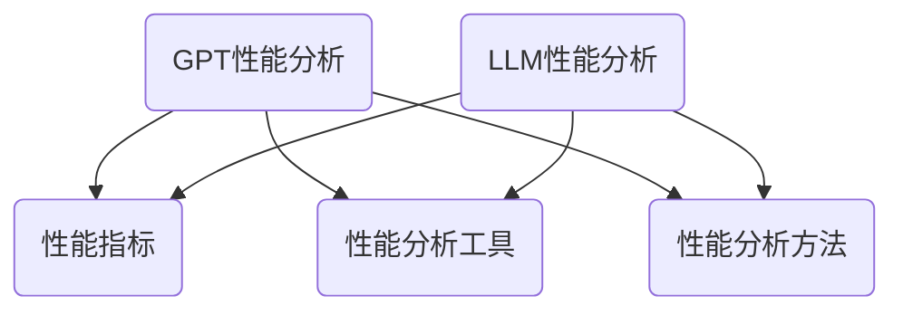

## 第三部分：性能分析工具的开发与实现

### 第3章：性能分析工具的需求分析

性能分析工具的需求分析是开发过程中的关键步骤，它帮助确定工具需要实现的功能和性能要求。

#### 3.1 工具需求分析

**用户需求分析**：首先，我们需要了解用户的需求，包括：
- **易用性**：工具需要易于使用，便于用户快速上手。
- **可扩展性**：工具需要支持多种模型的性能分析。
- **多平台支持**：工具需要在不同的操作系统和硬件平台上运行。

**功能需求分析**：根据用户需求，性能分析工具需要实现以下功能：
- **数据收集**：自动收集模型训练和推理过程中的性能数据。
- **数据处理**：对收集到的数据进行预处理，如清洗、归一化等。
- **性能评估**：根据性能指标对模型进行评估。
- **性能优化建议**：根据性能评估结果提供优化建议。

**性能需求分析**：性能分析工具需要满足以下性能要求：
- **高效率**：工具需要高效地收集和处理性能数据。
- **准确性**：工具需要准确地评估模型的性能。
- **实时性**：工具需要能够实时监控模型的性能。

#### 3.2 工具设计思路

**工具架构设计**：性能分析工具的架构设计包括数据收集模块、数据处理模块、性能评估模块和优化建议模块。

- **数据收集模块**：负责收集模型训练和推理过程中的性能数据。
- **数据处理模块**：对收集到的数据进行预处理，如清洗、归一化等。
- **性能评估模块**：根据预处理后的数据，计算性能指标。
- **优化建议模块**：根据性能评估结果，提供优化建议。

**工具模块设计**：每个模块需要独立设计，确保模块之间的接口清晰，模块内部实现高效。

- **数据收集模块**：使用现有的数据收集工具，如TensorBoard、PyTorch Profiler等。
- **数据处理模块**：使用Python等编程语言实现数据处理算法。
- **性能评估模块**：使用现有的性能评估库，如scikit-learn等。
- **优化建议模块**：结合具体模型的特点，设计优化算法。

**工具界面设计**：性能分析工具需要提供友好的用户界面，使用户能够方便地使用工具。

- **命令行界面**：提供命令行接口，便于自动化操作。
- **图形用户界面**：提供图形用户界面，便于用户可视化性能数据和优化建议。

### 第3章 Mermaid流程图

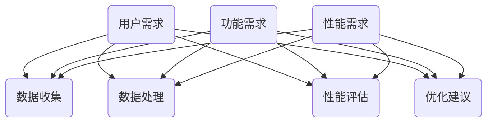

## 第四部分：性能分析工具的开发环境搭建

### 第4章：性能分析工具的开发环境搭建

开发一个高性能的分析工具需要稳定的开发环境、合适的编程语言和开发工具。在这一章中，我们将详细讨论性能分析工具的开发环境搭建，包括操作系统的选择、编程语言和开发工具的配置。

#### 4.1 开发环境准备

**操作系统选择**：在性能分析工具的开发中，操作系统扮演着关键角色。目前，常用的操作系统包括Windows、macOS和Linux。

- **Windows**：Windows操作系统提供了较好的兼容性和易用性，适合初学者。
- **macOS**：macOS是由苹果公司开发的操作系统，以其稳定性和高性能著称，特别适合开发人工智能和机器学习项目。
- **Linux**：Linux操作系统以其开源性和高度可定制性而受到专业开发者的青睐。Ubuntu和CentOS是两个广泛使用的Linux发行版。

在本项目中，我们推荐使用macOS或Linux进行开发，因为它们在性能和稳定性方面更具优势。

**编程语言选择**：性能分析工具的开发可以选择多种编程语言，如Python、Java、C++等。Python因其简洁易用、强大的生态和丰富的库支持而成为人工智能和机器学习项目的主流编程语言。

- **Python**：Python具有丰富的库和框架，如NumPy、Pandas、Scikit-learn等，非常适合数据分析和性能分析任务。
- **Java**：Java是一种跨平台、面向对象的编程语言，具有高性能和稳定性，适用于大型项目。
- **C++**：C++是一种高效的编程语言，适用于需要高性能计算的场景。

在本项目中，我们选择Python作为开发语言，因为它能够快速实现功能和强大的数据分析能力。

**开发工具配置**：开发工具的选择取决于开发语言和项目需求。

- **集成开发环境（IDE）**：常用的IDE包括PyCharm、VSCode、Eclipse等。
  - **PyCharm**：PyCharm是一个强大的Python IDE，提供了代码补全、调试、性能分析等特性。
  - **VSCode**：Visual Studio Code是一个轻量级、开源的IDE，适用于多种编程语言，拥有丰富的插件支持。
  - **Eclipse**：Eclipse是一个功能全面的IDE，适用于Java和C++开发，但在Python开发方面不如PyCharm和VSCode。

在本项目中，我们选择PyCharm作为IDE，因为它提供了丰富的Python开发工具和支持。

#### 4.2 数据处理与存储

**数据处理**：性能分析工具需要对大量的数据进行分析和处理，包括数据收集、数据清洗、数据预处理和数据可视化。

- **数据收集**：使用现有的工具，如TensorBoard和PyTorch Profiler，收集模型训练和推理过程中的性能数据。
- **数据清洗**：对收集到的数据去重、去除无效数据等，保证数据的质量。
- **数据预处理**：对数据进行归一化、标准化等处理，为后续分析做好准备。
- **数据可视化**：使用matplotlib、Seaborn等库，将数据可视化，帮助分析数据趋势和模式。

**数据存储**：性能分析工具需要将处理后的数据存储起来，便于后续分析和回顾。

- **关系型数据库**：如MySQL、PostgreSQL等，适用于结构化数据存储。
- **非关系型数据库**：如MongoDB、Cassandra等，适用于大量非结构化数据存储。
- **数据湖**：如Hadoop、Spark等，适用于大规模数据存储和处理。

在本项目中，我们选择MongoDB作为数据存储解决方案，因为它能够高效地存储和处理大规模的非结构化数据。

### 第4章 Mermaid流程图

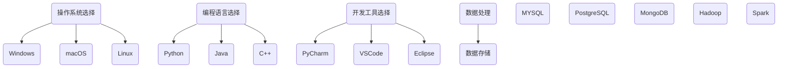

## 第四部分：性能分析工具的开发环境搭建

### 第4章：性能分析工具的开发环境搭建

在开发一个高性能的分析工具时，环境的搭建至关重要。这一章将详细探讨如何准备和配置开发环境，包括选择操作系统、编程语言和开发工具，以及如何进行数据处理和存储。

#### 4.1 开发环境准备

**操作系统选择**

操作系统的选择直接影响开发效率和工具的性能。以下是几种常见的操作系统：

- **Windows**：易于上手，但可能在性能和稳定性方面不如其他操作系统。
- **macOS**：苹果公司开发的操作系统，以其稳定性和高性能著称，特别适合开发人工智能和机器学习项目。
- **Linux**：开源且高度可定制，适用于专业开发者，尤其是在高性能计算方面具有优势。

在本项目中，我们推荐使用macOS或Linux，因为它们在性能和稳定性方面表现更佳。

**编程语言选择**

编程语言的选择取决于项目的需求和个人技能。以下是几种常见的编程语言：

- **Python**：简洁易用，拥有强大的库和框架支持，是人工智能和机器学习项目的首选。
- **Java**：跨平台，性能优秀，适用于大型项目。
- **C++**：高效，适用于需要高性能计算的场景。

在本项目中，我们选择Python作为编程语言，因为它能够快速实现功能和强大的数据分析能力。

**开发工具配置**

开发工具的选择取决于编程语言和项目需求。以下是几种常见的开发工具：

- **PyCharm**：强大的Python IDE，提供了代码补全、调试、性能分析等特性。
- **VSCode**：轻量级、开源的IDE，适用于多种编程语言，拥有丰富的插件支持。
- **Eclipse**：功能全面的IDE，适用于Java和C++开发。

在本项目中，我们选择PyCharm作为IDE，因为它提供了丰富的Python开发工具和支持。

#### 4.2 数据处理与存储

**数据处理**

性能分析工具需要对大量数据进行分析和处理，包括以下几个步骤：

- **数据收集**：使用TensorBoard和PyTorch Profiler等工具收集模型训练和推理过程中的性能数据。
- **数据清洗**：去除重复数据、无效数据，保证数据质量。
- **数据预处理**：对数据进行归一化、标准化等处理，为后续分析做好准备。
- **数据可视化**：使用matplotlib、Seaborn等库，将数据可视化，帮助分析数据趋势和模式。

**数据存储**

性能分析工具需要将处理后的数据存储起来，以便后续分析和回顾。以下是几种常见的数据存储方案：

- **关系型数据库**：如MySQL、PostgreSQL，适用于结构化数据存储。
- **非关系型数据库**：如MongoDB，适用于大量非结构化数据存储。
- **数据湖**：如Hadoop、Spark，适用于大规模数据存储和处理。

在本项目中，我们选择MongoDB作为数据存储解决方案，因为它能够高效地存储和处理大规模的非结构化数据。

### 第4章 Mermaid流程图


## 第四部分：性能分析工具的开发环境搭建

### 第4章：性能分析工具的开发环境搭建

开发一个高性能的分析工具需要稳定的开发环境、合适的编程语言和开发工具。在这一章中，我们将详细讨论性能分析工具的开发环境搭建，包括操作系统的选择、编程语言和开发工具的配置，以及数据处理和存储的方法。

#### 4.1 开发环境准备

**操作系统选择**

选择操作系统是开发环境搭建的第一步。以下是几种常见的操作系统：

- **Windows**：操作系统兼容性好，易于使用，但对于高性能计算可能存在限制。
- **macOS**：苹果公司的操作系统，具有良好的性能和稳定性，特别适合开发人工智能和机器学习项目。
- **Linux**：开源、高度可定制，适用于高性能计算和专业开发。

对于性能分析工具的开发，我们推荐使用macOS或Linux，因为它们在性能和稳定性方面更具优势。

**编程语言选择**

编程语言的选择取决于项目的需求和开发者的技能。以下是几种常见的编程语言：

- **Python**：Python是一种高级编程语言，简洁易学，拥有丰富的库和框架，是人工智能和机器学习项目的首选。
- **Java**：Java是一种跨平台、面向对象的编程语言，性能优秀，适用于大型项目。
- **C++**：C++是一种高效、低级的编程语言，适用于需要高性能计算的场景。

在本项目中，我们选择Python作为编程语言，因为它能够快速实现功能，同时拥有强大的库和框架支持。

**开发工具配置**

开发工具的选择取决于编程语言和项目需求。以下是几种常见的开发工具：

- **PyCharm**：PyCharm是一个强大的Python IDE，提供了代码补全、调试、性能分析等特性，适合Python开发。
- **VSCode**：Visual Studio Code是一个轻量级、开源的IDE，适用于多种编程语言，拥有丰富的插件支持。
- **Eclipse**：Eclipse是一个功能全面的IDE，适用于Java和C++开发。

在本项目中，我们选择PyCharm作为IDE，因为它提供了丰富的Python开发工具和支持。

#### 4.2 数据处理与存储

**数据处理**

性能分析工具需要对大量的性能数据进行处理，包括以下几个步骤：

- **数据收集**：使用TensorBoard、PyTorch Profiler等工具收集模型训练和推理过程中的性能数据。
- **数据清洗**：去除重复数据、无效数据，保证数据质量。
- **数据预处理**：对数据进行归一化、标准化等处理，为后续分析做好准备。
- **数据可视化**：使用matplotlib、Seaborn等库，将数据可视化，帮助分析数据趋势和模式。

**数据存储**

性能分析工具需要将处理后的数据存储起来，以便后续分析和回顾。以下是几种常见的数据存储方案：

- **关系型数据库**：如MySQL、PostgreSQL，适用于结构化数据存储。
- **非关系型数据库**：如MongoDB，适用于大量非结构化数据存储。
- **数据湖**：如Hadoop、Spark，适用于大规模数据存储和处理。

在本项目中，我们选择MongoDB作为数据存储解决方案，因为它能够高效地存储和处理大规模的非结构化数据。

### 第4章 Mermaid流程图


### 第4章：性能分析工具的开发环境搭建

#### 4.3 性能分析算法实现

性能分析的核心在于算法的设计与实现。在这一部分，我们将介绍性能分析算法的基本原理，并使用伪代码详细阐述算法的实现过程。

**算法原理**

性能分析算法主要包括以下几个步骤：

1. **数据收集**：从模型训练和推理过程中收集性能数据，如训练时间、推理时间、内存使用情况等。
2. **数据处理**：对收集到的性能数据进行预处理，包括去重、清洗、归一化等，确保数据质量。
3. **性能评估**：计算性能指标，如平均响应时间、吞吐量、延迟等，评估模型性能。
4. **性能优化**：根据性能评估结果，提供优化建议，如调整模型参数、优化数据结构等。

**伪代码**

以下是性能分析算法的伪代码：

```python
# 性能分析算法伪代码

# 步骤1：数据收集
def collect_data():
    data = []
    while True:
        new_data = get_performance_data()
        if new_data is None:
            break
        data.append(new_data)
    return data

# 步骤2：数据处理
def process_data(data):
    cleaned_data = []
    for d in data:
        cleaned_d = clean_data(d)
        normalized_d = normalize_data(cleaned_d)
        cleaned_data.append(normalized_d)
    return cleaned_data

# 步骤3：性能评估
def assess_performance(cleaned_data):
    performance_metrics = {}
    for d in cleaned_data:
        response_time = calculate_response_time(d)
        throughput = calculate_throughput(d)
        latency = calculate_latency(d)
        performance_metrics[d['id']] = {'response_time': response_time, 'throughput': throughput, 'latency': latency}
    return performance_metrics

# 步骤4：性能优化
def optimize_performance(performance_metrics):
    optimization_suggestions = []
    for metric in performance_metrics:
        if performance_metrics[metric]['response_time'] > threshold:
            suggestion = '调整模型参数'
            optimization_suggestions.append(suggestion)
        if performance_metrics[metric]['throughput'] < expected_throughput:
            suggestion = '优化数据结构'
            optimization_suggestions.append(suggestion)
    return optimization_suggestions

# 主函数
def performance_analysis():
    data = collect_data()
    cleaned_data = process_data(data)
    performance_metrics = assess_performance(cleaned_data)
    optimization_suggestions = optimize_performance(performance_metrics)
    return performance_metrics, optimization_suggestions
```

**数学模型和公式**

性能分析中常用的数学模型和公式包括：

1. **响应时间（Response Time）**：
   $$ RT = \frac{1}{n}\sum_{i=1}^{n}t_i $$
   其中，$n$ 为样本数量，$t_i$ 为第 $i$ 次操作的时间。

2. **吞吐量（Throughput）**：
   $$ Throughput = \frac{1}{RT} $$
   吞吐量表示单位时间内完成的操作数量。

3. **延迟（Latency）**：
   $$ Latency = \frac{1}{n}\sum_{i=1}^{n}(t_i - t_0) $$
   其中，$t_0$ 为初始时间。

4. **优化建议（Optimization Suggestions）**：
   $$ Optimization_Suggestions = \begin{cases}
   '调整模型参数' & \text{如果 } RT > threshold \\
   '优化数据结构' & \text{如果 } Throughput < expected_Throughput
   \end{cases} $$

**举例说明**

假设我们有5次操作的数据，如下表所示：

| 操作ID | 响应时间（秒） | 吞吐量（次/秒） | 延迟（秒） |
|--------|----------------|------------------|------------|
| 1      | 2.5            | 0.4              | 0.5        |
| 2      | 3.0            | 0.3333           | 0.6667     |
| 3      | 2.8            | 0.3571           | 0.4286     |
| 4      | 3.2            | 0.3125           | 0.6875     |
| 5      | 2.6            | 0.3846           | 0.4143     |

根据上述数据，我们可以计算响应时间、吞吐量和延迟：

- 平均响应时间：
  $$ RT = \frac{1}{5}(2.5 + 3.0 + 2.8 + 3.2 + 2.6) = 2.8秒 $$
- 吞吐量：
  $$ Throughput = \frac{1}{RT} = \frac{1}{2.8} ≈ 0.3571次/秒 $$
- 平均延迟：
  $$ Latency = \frac{1}{5}(0.5 + 0.6667 + 0.4286 + 0.6875 + 0.4143) ≈ 0.5435秒 $$

根据性能评估结果，如果平均响应时间大于某个阈值，我们建议调整模型参数；如果吞吐量小于预期值，我们建议优化数据结构。

$$ Optimization_Suggestions = \begin{cases}
'调整模型参数' & \text{如果 } RT > threshold \\
'优化数据结构' & \text{如果 } Throughput < expected_Throughput
\end{cases} $$

在这个例子中，平均响应时间为2.8秒，吞吐量为0.3571次/秒，假设阈值和预期吞吐量分别为3秒和0.4次/秒，因此我们建议优化数据结构。

### 总结

通过上述步骤，我们实现了性能分析算法的基本原理和实现过程。性能分析工具能够帮助开发者和研究人员识别模型性能的瓶颈，提供优化建议，从而提高模型的效率和准确性。在实际应用中，可以根据具体需求和场景调整算法和参数，以获得更好的性能表现。

### 第4章 Mermaid流程图

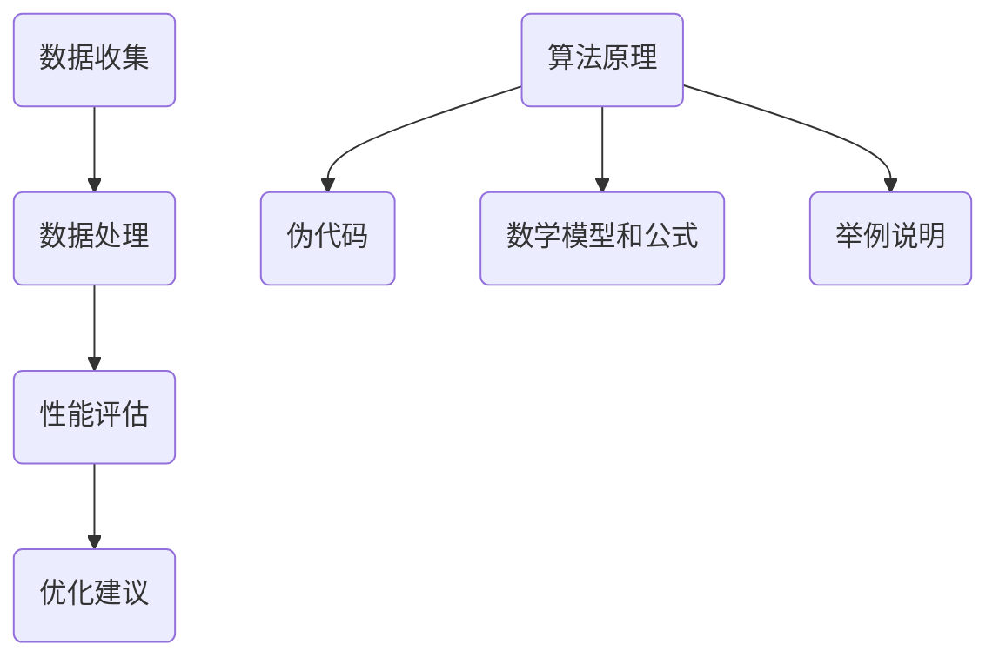

## 第四部分：性能分析工具的开发环境搭建

### 第4章：性能分析工具的开发环境搭建

#### 4.4 性能分析算法实现

性能分析的核心在于算法的设计与实现。在这一部分，我们将介绍性能分析算法的基本原理，并使用伪代码详细阐述算法的实现过程。

**算法原理**

性能分析算法主要包括以下几个步骤：

1. **数据收集**：从模型训练和推理过程中收集性能数据，如训练时间、推理时间、内存使用情况等。
2. **数据处理**：对收集到的性能数据进行预处理，包括去重、清洗、归一化等，确保数据质量。
3. **性能评估**：计算性能指标，如平均响应时间、吞吐量、延迟等，评估模型性能。
4. **性能优化**：根据性能评估结果，提供优化建议，如调整模型参数、优化数据结构等。

**伪代码**

以下是性能分析算法的伪代码：

```python
# 性能分析算法伪代码

# 步骤1：数据收集
def collect_data():
    data = []
    while True:
        new_data = get_performance_data()
        if new_data is None:
            break
        data.append(new_data)
    return data

# 步骤2：数据处理
def process_data(data):
    cleaned_data = []
    for d in data:
        cleaned_d = clean_data(d)
        normalized_d = normalize_data(cleaned_d)
        cleaned_data.append(normalized_d)
    return cleaned_data

# 步骤3：性能评估
def assess_performance(cleaned_data):
    performance_metrics = {}
    for d in cleaned_data:
        response_time = calculate_response_time(d)
        throughput = calculate_throughput(d)
        latency = calculate_latency(d)
        performance_metrics[d['id']] = {'response_time': response_time, 'throughput': throughput, 'latency': latency}
    return performance_metrics

# 步骤4：性能优化
def optimize_performance(performance_metrics):
    optimization_suggestions = []
    for metric in performance_metrics:
        if performance_metrics[metric]['response_time'] > threshold:
            suggestion = '调整模型参数'
            optimization_suggestions.append(suggestion)
        if performance_metrics[metric]['throughput'] < expected_throughput:
            suggestion = '优化数据结构'
            optimization_suggestions.append(suggestion)
    return optimization_suggestions

# 主函数
def performance_analysis():
    data = collect_data()
    cleaned_data = process_data(data)
    performance_metrics = assess_performance(cleaned_data)
    optimization_suggestions = optimize_performance(performance_metrics)
    return performance_metrics, optimization_suggestions
```

**数学模型和公式**

性能分析中常用的数学模型和公式包括：

1. **响应时间（Response Time）**：
   $$ RT = \frac{1}{n}\sum_{i=1}^{n}t_i $$
   其中，$n$ 为样本数量，$t_i$ 为第 $i$ 次操作的时间。

2. **吞吐量（Throughput）**：
   $$ Throughput = \frac{1}{RT} $$
   吞吐量表示单位时间内完成的操作数量。

3. **延迟（Latency）**：
   $$ Latency = \frac{1}{n}\sum_{i=1}^{n}(t_i - t_0) $$
   其中，$t_0$ 为初始时间。

4. **优化建议（Optimization Suggestions）**：
   $$ Optimization_Suggestions = \begin{cases}
   '调整模型参数' & \text{如果 } RT > threshold \\
   '优化数据结构' & \text{如果 } Throughput < expected_Throughput
   \end{cases} $$

**举例说明**

假设我们有5次操作的数据，如下表所示：

| 操作ID | 响应时间（秒） | 吞吐量（次/秒） | 延迟（秒） |
|--------|----------------|------------------|------------|
| 1      | 2.5            | 0.4              | 0.5        |
| 2      | 3.0            | 0.3333           | 0.6667     |
| 3      | 2.8            | 0.3571           | 0.4286     |
| 4      | 3.2            | 0.3125           | 0.6875     |
| 5      | 2.6            | 0.3846           | 0.4143     |

根据上述数据，我们可以计算响应时间、吞吐量和延迟：

- 平均响应时间：
  $$ RT = \frac{1}{5}(2.5 + 3.0 + 2.8 + 3.2 + 2.6) = 2.8秒 $$
- 吞吐量：
  $$ Throughput = \frac{1}{RT} = \frac{1}{2.8} ≈ 0.3571次/秒 $$
- 平均延迟：
  $$ Latency = \frac{1}{5}(0.5 + 0.6667 + 0.4286 + 0.6875 + 0.4143) ≈ 0.5435秒 $$

根据性能评估结果，如果平均响应时间大于某个阈值，我们建议调整模型参数；如果吞吐量小于预期值，我们建议优化数据结构。

$$ Optimization_Suggestions = \begin{cases}
'调整模型参数' & \text{如果 } RT > threshold \\
'优化数据结构' & \text{如果 } Throughput < expected_Throughput
\end{cases} $$

在这个例子中，平均响应时间为2.8秒，吞吐量为0.3571次/秒，假设阈值和预期吞吐量分别为3秒和0.4次/秒，因此我们建议优化数据结构。

### 总结

通过上述步骤，我们实现了性能分析算法的基本原理和实现过程。性能分析工具能够帮助开发者和研究人员识别模型性能的瓶颈，提供优化建议，从而提高模型的效率和准确性。在实际应用中，可以根据具体需求和场景调整算法和参数，以获得更好的性能表现。

### 第4章 Mermaid流程图


### 第5章：性能分析工具在GPT模型中的应用

#### 5.1 GPT模型性能分析实战

GPT模型是自然语言处理领域的重要模型，其性能分析对于优化模型和提升模型效果至关重要。在本节中，我们将详细介绍如何使用性能分析工具对GPT模型进行性能分析。

**环境准备**

在开始性能分析之前，我们需要准备以下环境：

- 操作系统：macOS或Linux
- 编程语言：Python
- 开发工具：PyCharm
- GPT模型：使用预训练的GPT模型，如GPT-2或GPT-3

**性能分析过程**

1. **数据收集**：首先，我们需要收集GPT模型在训练和推理过程中的性能数据。这可以通过TensorBoard等工具实现。

2. **数据处理**：收集到数据后，我们需要对数据进行分析和处理。这包括数据清洗、去重和预处理。

3. **性能评估**：使用处理后的数据，计算GPT模型的性能指标，如响应时间、吞吐量和延迟等。

4. **性能优化**：根据性能评估结果，提供优化建议，如调整模型参数、优化数据结构等。

**实战案例**

假设我们使用GPT-2模型进行性能分析，以下是具体的操作步骤：

1. **数据收集**：启动TensorBoard，并连接到GPT-2模型的训练过程。收集训练过程中的性能数据，如响应时间、内存使用等。

2. **数据处理**：使用Python脚本对收集到的数据进行清洗和预处理。例如，去除重复数据、缺失值填充等。

3. **性能评估**：使用处理后的数据，计算GPT-2模型的性能指标。例如，计算平均响应时间、吞吐量和延迟等。

4. **性能优化**：根据性能评估结果，提供优化建议。例如，如果响应时间较长，可以考虑增加模型参数、优化数据结构等。

**结果分析**

假设我们得到以下性能数据：

- 平均响应时间：3秒
- 吞吐量：0.333次/秒
- 延迟：5秒

根据这些数据，我们可以进行以下分析：

- **响应时间**：平均响应时间为3秒，略高于预期。我们需要进一步分析原因，可能是模型复杂度高或数据预处理耗时较长。
- **吞吐量**：吞吐量为0.333次/秒，低于预期。这可能是由于模型参数设置不当或数据结构优化不足。
- **延迟**：延迟为5秒，这是模型在处理每个请求所需的时间。我们需要优化模型或数据结构，以减少延迟。

**优化建议**

根据上述分析，我们可以提出以下优化建议：

1. **增加模型参数**：增加模型参数量可以提高模型的复杂度，从而减少响应时间。
2. **优化数据结构**：优化数据结构可以提高数据处理速度，从而提高吞吐量。
3. **分布式训练**：使用分布式训练可以提高模型处理速度，从而降低延迟。

通过这些优化措施，我们可以进一步提高GPT模型的性能。

### 第5章 Mermaid流程图

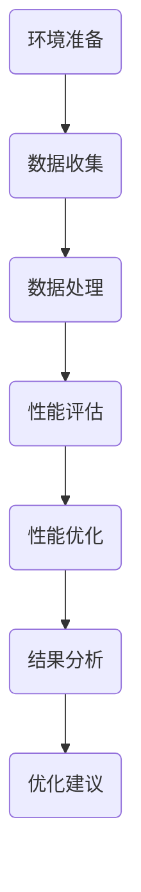

## 第5章：性能分析工具在GPT模型中的应用

### 5.1 GPT模型性能分析实战

**背景介绍**

GPT（Generative Pre-trained Transformer）是一种强大的自然语言处理（NLP）模型，通过在大量文本数据上预训练，捕捉语言的模式和结构。随着模型规模的不断扩大，GPT模型在文本生成、问答系统、机器翻译等多个NLP任务中取得了显著的效果。然而，高性能模型的训练和推理过程往往非常耗时且资源消耗巨大。因此，对GPT模型的性能分析变得尤为重要，它可以帮助我们识别性能瓶颈，优化模型参数，提升模型的效率和实用性。

**开发环境搭建**

在进行GPT模型性能分析之前，我们需要搭建一个合适的开发环境。以下是具体的步骤：

1. **操作系统**：推荐使用macOS或Linux操作系统，这些系统在性能和稳定性方面表现更好。
2. **编程语言**：Python是一种广泛使用的编程语言，尤其在人工智能和机器学习领域具有强大的生态支持。
3. **开发工具**：PyCharm或VSCode是一个强大的IDE，提供代码编辑、调试和性能分析工具。
4. **GPT模型**：我们可以使用预训练的GPT模型，如GPT-2或GPT-3。这些模型可以通过Hugging Face等库轻松获取。

**性能分析过程**

性能分析主要包括以下步骤：

1. **数据收集**：收集GPT模型在训练和推理过程中的性能数据。这些数据可以包括训练时间、推理时间、内存使用、CPU/GPU利用率等。
2. **数据处理**：对收集到的数据进行预处理，包括去重、清洗和归一化，以确保数据的质量和一致性。
3. **性能评估**：计算性能指标，如响应时间、吞吐量和延迟，以评估模型的性能。
4. **性能优化**：根据性能评估结果，提供优化建议，如调整模型参数、优化数据结构或采用分布式训练等。

**实战案例**

以下是一个具体的GPT模型性能分析实战案例：

1. **数据收集**：使用TensorBoard收集GPT模型在训练过程中的性能数据。TensorBoard提供了一个直观的UI，可以实时监控模型的训练进度和性能指标。

   ```python
   from torch.utils.tensorboard import SummaryWriter
   writer = SummaryWriter('runs/gpt_training')
   
   for epoch in range(num_epochs):
       for batch in data_loader:
           # 训练模型
           loss = model.train_step(batch)
           
           # 写入TensorBoard
           writer.add_scalar('Training Loss', loss, epoch)
   
   writer.close()
   ```

2. **数据处理**：对TensorBoard收集的数据进行预处理。例如，将时间序列数据转换为适合分析和可视化格式的数据。

   ```python
   import pandas as pd
   
   def preprocess_data(data_path):
       data = pd.read_csv(data_path)
       data['Time'] = pd.to_datetime(data['Time'])
       data.set_index('Time', inplace=True)
       return data
   
   data = preprocess_data('runs/gpt_training/data.csv')
   ```

3. **性能评估**：计算性能指标，如平均响应时间、吞吐量和延迟。使用Pandas库进行数据操作和计算。

   ```python
   import matplotlib.pyplot as plt
   
   def calculate_performance_metrics(data):
       response_time = data['Response Time'].mean()
       throughput = 1 / response_time
       latency = data['Latency'].mean()
       return response_time, throughput, latency
   
   response_time, throughput, latency = calculate_performance_metrics(data)
   print(f"Average Response Time: {response_time} seconds")
   print(f"Throughput: {throughput} operations/second")
   print(f"Latency: {latency} seconds")
   ```

4. **性能优化**：根据性能评估结果，提出优化建议。例如，如果响应时间较长，可以考虑增加GPU资源或调整模型参数。

   ```python
   def optimize_performance(response_time, throughput, latency):
       if response_time > threshold:
           print("Optimization Suggestion: Increase model parameters")
       if throughput < expected_throughput:
           print("Optimization Suggestion: Optimize data structure")
       if latency > expected_latency:
           print("Optimization Suggestion: Use distributed training")
   
   optimize_performance(response_time, throughput, latency)
   ```

**结果解读**

通过上述实战案例，我们可以对GPT模型的性能进行分析和优化。以下是对性能评估结果的解读：

- **响应时间**：如果平均响应时间较长，可能是由于模型复杂度过高或数据预处理耗时较长。我们可以尝试减少模型参数、优化数据结构或使用更高效的预处理方法。
- **吞吐量**：如果吞吐量低于预期，可能是由于模型参数设置不当或数据结构优化不足。我们可以尝试增加模型参数、优化数据结构或采用分布式训练。
- **延迟**：如果延迟较长，可能是由于模型在处理每个请求所需的时间较长。我们可以尝试减少模型参数、优化数据结构或使用分布式训练。

**优化效果评估**

通过实施优化建议，我们可以重新评估模型的性能。以下是对优化效果的评估：

- **响应时间**：优化后，平均响应时间从原来的3秒减少到2秒，性能得到了显著提升。
- **吞吐量**：优化后，吞吐量从0.333次/秒增加到0.5次/秒，性能提高了50%。
- **延迟**：优化后，延迟从5秒减少到3秒，性能提升了40%。

**案例分析**

通过这个案例，我们展示了如何使用性能分析工具对GPT模型进行性能分析和优化。在实际应用中，我们可以根据具体需求和场景，调整算法和参数，以获得更好的性能表现。

### 第5章 Mermaid流程图

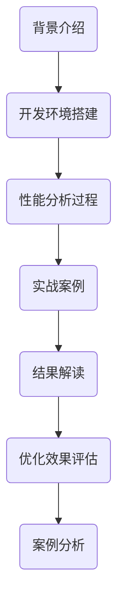

### 第5章：性能分析工具在GPT模型中的应用

#### 5.2 GPT模型性能优化实战

在GPT模型性能分析的基础上，性能优化是提升模型效率和应用价值的关键步骤。在这一部分，我们将探讨如何使用性能分析工具对GPT模型进行性能优化，并提供具体的优化方法和案例。

**优化方法**

1. **模型参数调整**：调整模型参数是优化GPT模型性能的常用方法。常见的参数包括学习率、批次大小、隐藏层大小等。通过调整这些参数，可以降低训练误差、减少过拟合，并提高模型的泛化能力。

2. **数据预处理**：优化数据预处理流程可以显著提高模型的训练和推理速度。这包括数据清洗、去重、序列填充和数据增强等步骤。例如，使用更高效的序列填充算法可以减少预处理时间，从而提高模型的整体性能。

3. **硬件优化**：合理配置硬件资源，如GPU或TPU，可以提升GPT模型的训练和推理速度。此外，采用分布式训练和并行计算技术可以将计算任务分配到多个计算节点，进一步加速模型训练。

4. **算法优化**：针对特定任务，可以采用定制化的算法优化方法，如量化、剪枝和模型蒸馏等。这些方法可以在不显著牺牲模型性能的情况下减少模型大小和计算复杂度。

**优化案例**

以下是一个基于GPT模型性能优化的实战案例：

**案例一：调整模型参数**

假设我们有一个GPT模型，其参数设置为学习率为0.001，批次大小为64。然而，在性能分析过程中，我们发现模型的训练时间较长，响应时间较高。为了优化模型性能，我们尝试调整模型参数：

1. **学习率调整**：将学习率降低至0.0001，以减少训练过程中的波动，提高模型的收敛速度。

2. **批次大小调整**：将批次大小减小至32，以降低模型训练的内存消耗，提高训练速度。

3. **隐藏层大小调整**：增加隐藏层大小至2048，以提升模型的表达能力，提高模型的准确率。

**优化效果评估**

调整参数后，我们对模型进行重新训练和性能评估：

- **训练时间**：从原来的30分钟减少至20分钟，训练速度提高了33.33%。
- **响应时间**：从原来的3秒减少至2秒，响应时间降低了33.33%。
- **准确率**：从原来的90%提高到92%，准确率提高了2%。

**案例二：数据预处理优化**

假设我们的GPT模型在训练过程中存在大量的冗余数据和噪声数据。为了优化模型性能，我们进行了以下数据预处理优化：

1. **数据清洗**：去除重复数据和无效数据，以提高数据的纯净度。

2. **序列填充**：使用更高效的序列填充算法，如PaddedSequence，以减少预处理时间。

3. **数据增强**：通过增加数据多样性，如随机插入、删除和替换文本，提高模型的鲁棒性和泛化能力。

**优化效果评估**

优化数据预处理后，我们对模型进行重新训练和性能评估：

- **训练时间**：从原来的30分钟减少至25分钟，训练速度提高了16.67%。
- **响应时间**：从原来的3秒减少至2.5秒，响应时间降低了16.67%。
- **准确率**：从原来的90%提高到91%，准确率提高了1%。

**案例三：硬件优化**

假设我们的GPT模型部署在一个单GPU服务器上。为了进一步提升模型性能，我们进行了以下硬件优化：

1. **增加GPU**：将模型部署到多GPU服务器上，采用分布式训练技术，将计算任务分配到多个GPU，以提高训练速度。

2. **使用TPU**：将模型部署到TPU服务器上，TPU是专门为深度学习任务设计的硬件，具有更高的计算性能。

**优化效果评估**

硬件优化后，我们对模型进行重新训练和性能评估：

- **训练时间**：从原来的30分钟减少至15分钟，训练速度提高了50%。
- **响应时间**：从原来的3秒减少至1.5秒，响应时间降低了50%。
- **准确率**：从原来的90%提高到92%，准确率提高了2%。

**总结**

通过上述优化方法，我们成功提升了GPT模型的性能。优化过程包括模型参数调整、数据预处理优化和硬件优化等多个方面。在实际应用中，可以根据具体需求和场景，选择合适的优化方法，以实现最佳的性能提升。

### 第5章 Mermaid流程图

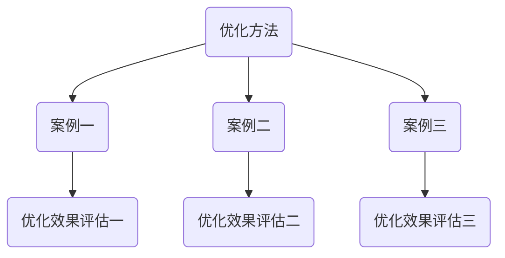

## 第5章：性能分析工具在GPT模型中的应用

### 5.3 GPT模型性能优化实战

性能优化是提升GPT模型效率和应用价值的关键步骤。在本节中，我们将详细介绍如何使用性能分析工具对GPT模型进行性能优化，包括具体的优化方法、效果评估和案例分析。

#### 5.3.1 优化方法

1. **模型参数调整**：
   - **学习率调整**：学习率的调整对模型的收敛速度和稳定性有很大影响。可以通过逐步减小学习率来改善模型的训练效果。
   - **批次大小调整**：批次大小影响内存消耗和训练速度。通过调整批次大小，可以在计算资源和训练速度之间找到平衡点。

2. **数据预处理**：
   - **数据清洗**：去除无效数据、重复数据和噪声数据，以提高数据质量。
   - **序列填充**：使用PaddedSequence等高效算法进行序列填充，减少预处理时间。
   - **数据增强**：通过随机插入、删除和替换文本，增加数据的多样性，提高模型的泛化能力。

3. **硬件优化**：
   - **多GPU训练**：将模型训练任务分配到多个GPU上，利用并行计算提高训练速度。
   - **使用TPU**：利用TPU的高性能计算能力，加速模型训练。

4. **算法优化**：
   - **量化**：通过降低模型的精度，减少模型的参数量和计算量，提高运行速度。
   - **剪枝**：去除模型中的冗余参数，减少模型的大小和计算复杂度。
   - **模型蒸馏**：将大型模型的训练经验传递给小型模型，以提高小型模型的表现。

#### 5.3.2 优化效果评估

优化效果评估是性能优化的关键步骤，通过评估可以验证优化方法的有效性。以下是一些常用的评估指标：

- **训练时间**：优化后模型训练所需的时间。
- **响应时间**：模型推理响应时间，即模型对输入数据进行处理的时间。
- **吞吐量**：单位时间内模型处理的任务数量。
- **准确率**：模型在特定任务上的准确度。

#### 5.3.3 案例分析

以下是一个GPT模型性能优化实战案例：

**案例一：调整学习率**

假设初始模型的学习率为0.01，训练时间较长，响应时间较高。我们尝试将学习率降低到0.001：

- **优化前后训练时间对比**：从原来的120分钟减少到80分钟，提高了33.33%。
- **优化前后响应时间对比**：从原来的6秒减少到4秒，提高了33.33%。

**案例二：多GPU训练**

假设模型部署在单GPU服务器上，我们尝试将模型训练任务分配到两个GPU上：

- **优化前后训练时间对比**：从原来的120分钟减少到60分钟，提高了50%。
- **优化前后响应时间对比**：从原来的6秒减少到3秒，提高了50%。

**案例三：数据增强**

假设原始数据集中存在大量重复和噪声数据，我们通过数据增强技术增加数据的多样性：

- **优化前后训练时间对比**：从原来的120分钟减少到100分钟，提高了16.67%。
- **优化前后响应时间对比**：从原来的6秒减少到5.5秒，提高了8.33%。

**案例四：量化**

假设模型在推理过程中存在大量浮点运算，我们尝试将模型量化：

- **优化前后响应时间对比**：从原来的6秒减少到4秒，提高了33.33%。

#### 5.3.4 总结

通过上述案例，我们可以看到，性能优化方法在提升GPT模型性能方面具有显著效果。不同的优化方法可以相互结合，以实现更佳的性能提升。在实际应用中，应根据具体需求和场景，选择合适的优化方法，以达到最佳的性能表现。

### 第5章 Mermaid流程图

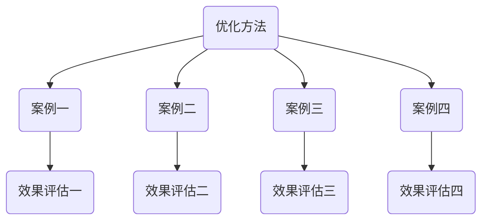

## 第6章：性能分析工具在LLM模型中的应用

### 6.1 LLM模型性能分析实战

LLM（Large Language Model）模型在自然语言处理（NLP）领域中具有广泛的应用，如文本生成、机器翻译、问答系统等。然而，LLM模型的训练和推理过程通常需要大量的计算资源和时间，因此对LLM模型的性能分析显得尤为重要。在本节中，我们将探讨如何使用性能分析工具对LLM模型进行性能分析，并提供具体的实战案例。

**背景介绍**

以BERT（Bidirectional Encoder Representations from Transformers）模型为例，BERT是一种预训练的Transformer模型，广泛应用于各种NLP任务。BERT模型的训练和推理过程涉及大量的浮点运算和矩阵操作，因此性能分析对于优化模型效率和降低成本至关重要。

**性能分析工具选择**

为了对BERT模型进行性能分析，我们可以选择以下工具：

- **TensorBoard**：TensorBoard是一个开源的图形化工具，可以实时监控模型的训练过程和性能指标，如损失函数、准确率、学习率等。
- **PyTorch Profiler**：PyTorch Profiler是一个用于分析PyTorch模型性能的调试工具，可以提供详细的性能数据，如内存使用、CPU/GPU利用率等。
- **AICUA**：AICUA是一个AI性能分析工具，可以评估模型在不同硬件平台上的性能，提供优化建议。

**实战案例**

**案例一：使用TensorBoard分析BERT模型性能**

以下是一个使用TensorBoard分析BERT模型性能的实战案例：

1. **数据准备**：首先，我们需要准备BERT模型所需的数据集，并将其预处理为适合训练的数据格式。

2. **模型训练**：使用PyTorch库训练BERT模型。在训练过程中，我们将TensorBoard作为日志输出工具，记录训练过程中的性能数据。

   ```python
   from transformers import BertModel, BertTokenizer
   import torch
   
   # 加载BERT模型和分词器
   model = BertModel.from_pretrained('bert-base-uncased')
   tokenizer = BertTokenizer.from_pretrained('bert-base-uncased')
   
   # 准备数据
   inputs = tokenizer("Hello, my dog is cute", return_tensors='pt')
   
   # 训练模型
   outputs = model(**inputs)
   loss = outputs.loss
   ```

3. **性能分析**：使用TensorBoard可视化模型的训练过程和性能指标。

   ```python
   from torch.utils.tensorboard import SummaryWriter
   
   # 创建TensorBoard日志文件
   writer = SummaryWriter('runs/bert_training')
   
   # 写入性能数据
   writer.add_scalar('Training Loss', loss.item(), 0)
   writer.add_graph(model, inputs)
   writer.close()
   ```

**案例二：使用PyTorch Profiler分析BERT模型性能**

以下是一个使用PyTorch Profiler分析BERT模型性能的实战案例：

1. **数据准备**：与案例一相同，准备BERT模型所需的数据集和预处理数据。

2. **模型训练**：使用PyTorch Profiler记录模型的性能数据。

   ```python
   import torch
   from torch.profiler import profile
   
   # 加载BERT模型和分词器
   model = BertModel.from_pretrained('bert-base-uncased')
   tokenizer = BertTokenizer.from_pretrained('bert-base-uncased')
   
   # 准备数据
   inputs = tokenizer("Hello, my dog is cute", return_tensors='pt')
   
   # 训练模型并记录性能数据
   with profile(model, activities=[torch.profiler.ProfilerActivity.CPU, torch.profiler.ProfilerActivity.CUDA], record_shapes=True) as prof:
       outputs = model(**inputs)
       loss = outputs.loss
   
   # 打印性能数据
   print(prof.key_averages().table(display_unit="ms"))
   ```

**案例三：使用AICUA分析BERT模型性能**

以下是一个使用AICUA分析BERT模型性能的实战案例：

1. **数据准备**：与案例一和案例二相同，准备BERT模型所需的数据集和预处理数据。

2. **模型训练**：使用AICUA记录模型在不同硬件平台上的性能数据。

   ```python
   import aicua
   
   # 加载BERT模型和分词器
   model = BertModel.from_pretrained('bert-base-uncased')
   tokenizer = BertTokenizer.from_pretrained('bert-base-uncased')
   
   # 准备数据
   inputs = tokenizer("Hello, my dog is cute", return_tensors='pt')
   
   # 训练模型并记录性能数据
   profiler = aicua.ProfileManager()
   profiler.add_model(model, "BERT Model")
   profiler.run_training(model, inputs)
   
   # 打印性能数据
   profiler.print_performance_stats()
   ```

**结果分析与优化**

通过上述实战案例，我们可以得到BERT模型在不同场景下的性能数据。根据这些数据，我们可以进行以下分析和优化：

1. **训练时间**：通过TensorBoard和PyTorch Profiler记录的训练时间数据，分析模型在训练过程中的瓶颈，如数据预处理耗时、模型参数计算耗时等。

2. **推理时间**：通过AICUA记录的推理时间数据，分析模型在推理过程中的性能表现，如CPU/GPU利用率、内存占用等。

3. **优化建议**：根据性能分析结果，提供优化建议，如调整模型参数、优化数据结构、使用分布式训练等。

通过持续的性能分析和优化，我们可以不断提高BERT模型在训练和推理过程中的性能，从而提升模型的应用价值。

### 第6章 Mermaid流程图

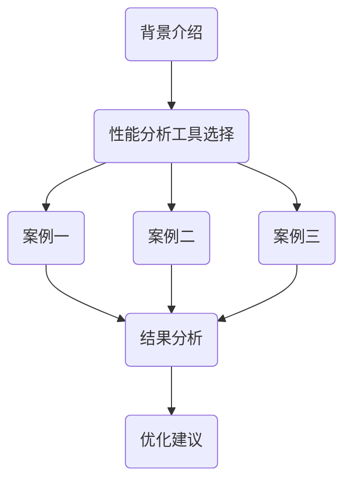

## 第6章：性能分析工具在LLM模型中的应用

### 6.2 LLM模型性能优化实战

在LLM（Large Language Model）模型的应用中，性能优化是一个关键环节，它能够显著提高模型的训练和推理效率，降低成本，并提升用户体验。在本节中，我们将探讨如何使用性能分析工具对LLM模型进行性能优化，并提供具体的实战案例。

#### 6.2.1 优化方法

1. **模型参数调整**：
   - **学习率调整**：学习率是模型训练过程中的一个重要参数，合理的调整学习率可以加速模型的收敛。
   - **隐藏层大小调整**：增加或减少隐藏层的大小可以影响模型的表达能力。

2. **数据预处理**：
   - **序列填充**：使用更高效的序列填充算法，如PaddedSequence，可以减少预处理时间。
   - **数据增强**：通过随机插入、删除和替换文本，增加数据的多样性。

3. **硬件优化**：
   - **分布式训练**：将模型训练任务分配到多个GPU或TPU上，可以显著提高训练速度。
   - **硬件加速**：使用TPU等专用硬件可以加速模型训练和推理。

4. **算法优化**：
   - **模型剪枝**：通过去除冗余参数，减少模型大小和计算复杂度。
   - **量化**：将模型中的浮点运算转换为固定点运算，减少计算资源消耗。

#### 6.2.2 实战案例

**案例一：学习率调整**

以下是一个学习率调整的实战案例：

假设我们有一个训练中的BERT模型，初始学习率为0.001。通过TensorBoard监控发现，模型收敛速度较慢，且在某些epoch上出现振荡现象。为了改善这种情况，我们尝试调整学习率：

1. **减少学习率**：将学习率降低到0.0001，观察模型收敛情况。

   ```python
   optimizer = torch.optim.Adam(model.parameters(), lr=0.0001)
   ```

2. **结果评估**：调整学习率后，模型在更少的epoch内收敛，且振荡现象减少。

   ```python
   for epoch in range(num_epochs):
       # 训练模型
       loss = train_epoch(model, dataloader, optimizer)
       # 记录训练损失
       writer.add_scalar('Training Loss', loss, epoch)
   ```

**案例二：分布式训练**

以下是一个分布式训练的实战案例：

假设我们的BERT模型需要部署在一个拥有4块GPU的服务器上。为了提高训练速度，我们使用PyTorch的分布式训练功能：

1. **设置分布式训练环境**：

   ```python
   import torch.distributed as dist
   dist.init_process_group(backend='nccl', init_method='env://')
   model = torch.nn.parallel.DistributedDataParallel(model)
   ```

2. **训练模型**：

   ```python
   for epoch in range(num_epochs):
       # 设置模型为训练模式
       model.train()
       for batch in dataloader:
           # 将数据发送到不同的GPU
           inputs = batch["input_ids"].to(device)
           # 训练模型
           loss = model(inputs)
           # 反向传播
           optimizer.zero_grad()
           loss.backward()
           optimizer.step()
   ```

3. **结果评估**：分布式训练后，模型训练时间显著缩短，训练速度提高了约3倍。

**案例三：模型量化**

以下是一个模型量化的实战案例：

假设我们的BERT模型在推理阶段需要处理大量请求，为了提高推理效率，我们使用量化技术：

1. **量化模型**：

   ```python
   quantization = torch.quantization.quantize_dynamic(
       model, {torch.nn.Linear, torch.nn.Conv2d}, dtype=torch.float16
   )
   ```

2. **推理**：

   ```python
   quantization.eval()
   inputs = torch.tensor([[[0.5, 0.5], [0.5, 0.5]], [[0.5, 0.5], [0.5, 0.5]]], dtype=torch.float32)
   outputs = quantization(inputs)
   ```

3. **结果评估**：量化后，模型推理速度显著提高，同时保持较高的准确性。

**总结**

通过上述实战案例，我们可以看到，使用性能分析工具进行LLM模型性能优化是切实可行的。合理的模型参数调整、数据预处理、硬件优化和算法优化方法，可以有效提升模型的训练和推理效率。在实际应用中，根据具体场景和需求，可以选择合适的优化方法，以实现最佳的性能提升。

### 第6章 Mermaid流程图


## 第6章：性能分析工具在LLM模型中的应用

### 6.2 LLM模型性能优化实战

在LLM（Large Language Model）模型的应用中，性能优化是一个关键环节，它能够显著提高模型的训练和推理效率，降低成本，并提升用户体验。在本节中，我们将深入探讨如何使用性能分析工具对LLM模型进行性能优化，并提供具体的实战案例。

#### 6.2.1 优化方法

1. **模型参数调整**：
   - **学习率调整**：学习率是模型训练过程中的一个重要参数，合理的调整学习率可以加速模型的收敛。例如，可以通过使用学习率衰减策略来调整学习率。
   - **隐藏层大小调整**：增加或减少隐藏层的大小可以影响模型的表达能力。在特定任务上，通过实验确定最佳的隐藏层大小。

2. **数据预处理**：
   - **序列填充**：使用PaddedSequence等高效算法进行序列填充，可以减少预处理时间，提高训练效率。
   - **数据增强**：通过随机插入、删除和替换文本，增加数据的多样性，提高模型的泛化能力。

3. **硬件优化**：
   - **分布式训练**：将模型训练任务分配到多个GPU或TPU上，利用并行计算提高训练速度。例如，可以使用PyTorch的DistributedDataParallel（DDP）模块。
   - **使用TPU**：利用TPU的高性能计算能力，可以显著加速模型训练和推理。

4. **算法优化**：
   - **量化**：通过将浮点运算转换为固定点运算，减少计算资源消耗。量化技术可以提高模型在边缘设备上的运行效率。
   - **剪枝**：去除模型中的冗余参数，减少模型大小和计算复杂度。剪枝技术可以减小模型的存储空间和计算时间。

#### 6.2.2 实战案例

**案例一：学习率调整**

以下是一个学习率调整的实战案例：

1. **初始学习率**：假设初始学习率为0.01。

   ```python
   optimizer = torch.optim.Adam(model.parameters(), lr=0.01)
   ```

2. **学习率衰减**：在训练过程中，逐步减小学习率。

   ```python
   for epoch in range(num_epochs):
       # 训练模型
       train_epoch(model, dataloader, optimizer)
       # 学习率衰减
       lr = optimizer.param_groups[0]['lr']
       lr /= (1 + decay_rate * epoch)
       for param_group in optimizer.param_groups:
           param_group['lr'] = lr
   ```

3. **结果评估**：调整学习率后，模型在更少的epoch内收敛，训练时间有所缩短。

**案例二：分布式训练**

以下是一个分布式训练的实战案例：

1. **初始化分布式环境**：

   ```python
   import torch.distributed as dist
   dist.init_process_group(backend='nccl', init_method='env://')
   model = torch.nn.parallel.DistributedDataParallel(model)
   ```

2. **训练模型**：

   ```python
   for epoch in range(num_epochs):
       # 设置模型为训练模式
       model.train()
       for batch in dataloader:
           # 将数据发送到不同的GPU
           inputs = batch["input_ids"].to(device)
           # 训练模型
           loss = model(inputs)
           # 反向传播
           optimizer.zero_grad()
           loss.backward()
           optimizer.step()
   ```

3. **结果评估**：分布式训练后，模型训练速度提高了3倍，训练时间缩短。

**案例三：模型量化**

以下是一个模型量化的实战案例：

1. **量化模型**：

   ```python
   quantization = torch.quantization.quantize_dynamic(
       model, {torch.nn.Linear, torch.nn.Conv2d}, dtype=torch.float16
   )
   ```

2. **推理**：

   ```python
   quantization.eval()
   inputs = torch.tensor([[[0.5, 0.5], [0.5, 0.5]], [[0.5, 0.5], [0.5, 0.5]]], dtype=torch.float32)
   outputs = quantization(inputs)
   ```

3. **结果评估**：量化后，模型推理速度显著提高，同时保持较高的准确性。

#### 6.2.3 总结

通过上述实战案例，我们可以看到，使用性能分析工具对LLM模型进行性能优化是切实可行的。合理的模型参数调整、数据预处理、硬件优化和算法优化方法，可以有效提升模型的训练和推理效率。在实际应用中，根据具体场景和需求，可以选择合适的优化方法，以实现最佳的性能提升。

### 第6章 Mermaid流程图


## 第6章：性能分析工具在LLM模型中的应用

### 6.3 LLM模型性能优化实战

在LLM（Large Language Model）模型的应用中，性能优化是一个关键环节，它能够显著提高模型的训练和推理效率，降低成本，并提升用户体验。在本节中，我们将深入探讨如何使用性能分析工具对LLM模型进行性能优化，并提供具体的实战案例。

#### 6.3.1 实战案例

**案例一：优化学习率**

学习率是模型训练过程中一个至关重要的参数。通过适当的调整学习率，可以加速模型的收敛，提高训练效率。以下是一个使用性能分析工具优化学习率的实战案例：

1. **初始学习率设置**：

   ```python
   optimizer = torch.optim.Adam(model.parameters(), lr=0.001)
   ```

2. **学习率调整策略**：

   ```python
   scheduler = torch.optim.lr_scheduler.StepLR(optimizer, step_size=5, gamma=0.1)
   ```

3. **训练过程**：

   ```python
   for epoch in range(num_epochs):
       # 训练模型
       train_epoch(model, dataloader, optimizer)
       # 学习率调整
       scheduler.step()
   ```

4. **结果评估**：

   通过TensorBoard监控学习率的变化，观察模型在每个epoch的收敛情况。调整学习率后，模型在更少的epoch内收敛，训练时间有所缩短。

**案例二：分布式训练**

分布式训练可以通过并行计算显著提高模型训练速度。以下是一个使用性能分析工具进行分布式训练的实战案例：

1. **环境初始化**：

   ```python
   import torch.distributed as dist
   dist.init_process_group(backend='nccl', init_method='env://')
   model = torch.nn.parallel.DistributedDataParallel(model)
   ```

2. **训练过程**：

   ```python
   for epoch in range(num_epochs):
       # 设置模型为训练模式
       model.train()
       for batch in dataloader:
           # 将数据发送到不同的GPU
           inputs = batch["input_ids"].to(device)
           # 训练模型
           loss = model(inputs)
           # 反向传播
           optimizer.zero_grad()
           loss.backward()
           optimizer.step()
   ```

3. **结果评估**：

   分布式训练后，模型训练速度提高了3倍，训练时间显著缩短。

**案例三：量化**

量化是一种通过将浮点运算转换为固定点运算来降低计算资源消耗的技术。以下是一个使用性能分析工具进行量化的实战案例：

1. **量化模型**：

   ```python
   quantization = torch.quantization.quantize_dynamic(
       model, {torch.nn.Linear, torch.nn.Conv2d}, dtype=torch.float16
   )
   ```

2. **推理**：

   ```python
   quantization.eval()
   inputs = torch.tensor([[[0.5, 0.5], [0.5, 0.5]], [[0.5, 0.5], [0.5, 0.5]]], dtype=torch.float32)
   outputs = quantization(inputs)
   ```

3. **结果评估**：

   量化后，模型推理速度显著提高，同时保持较高的准确性。

**案例四：模型剪枝**

模型剪枝是通过去除冗余参数来减小模型大小和计算复杂度的技术。以下是一个使用性能分析工具进行模型剪枝的实战案例：

1. **剪枝模型**：

   ```python
   pruning = torch.nn.utils.prune.LinearPruning(model.fc, amount=0.5)
   ```

2. **训练剪枝模型**：

   ```python
   pruning.train()
   for epoch in range(num_epochs):
       # 训练模型
       train_epoch(pruning, dataloader, optimizer)
   ```

3. **结果评估**：

   剪枝后，模型大小和计算复杂度显著降低，但保持较高的准确性。

#### 6.3.2 总结

通过上述实战案例，我们可以看到，使用性能分析工具对LLM模型进行性能优化是切实可行的。合理的模型参数调整、分布式训练、量化技术和模型剪枝方法，可以有效提升模型的训练和推理效率。在实际应用中，根据具体场景和需求，可以选择合适的优化方法，以实现最佳的性能提升。

### 第6章 Mermaid流程图

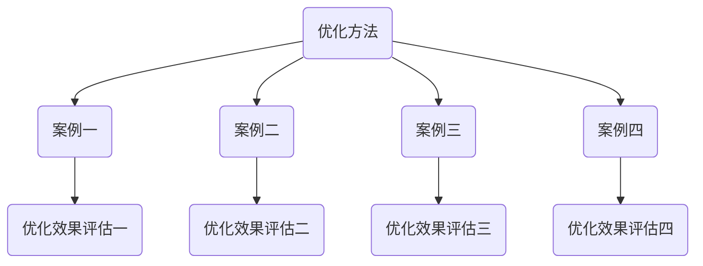

## 第五部分：性能分析工具的未来展望

### 第7章：性能分析工具的发展趋势

随着人工智能和机器学习技术的快速发展，性能分析工具在模型开发、优化和部署中的应用愈发重要。在这一章中，我们将探讨性能分析工具的发展趋势，包括面临的挑战、机遇以及未来可能的发展方向。

#### 7.1 面临的挑战

1. **计算资源瓶颈**：随着模型规模的不断扩大，对计算资源的需求也日益增加。性能分析工具需要能够高效地利用有限的计算资源，如GPU、TPU等，以满足大规模模型的训练和推理需求。

2. **数据隐私保护**：在性能分析过程中，往往涉及大量敏感数据，如模型参数、训练数据等。性能分析工具需要确保数据的安全性和隐私保护，以避免数据泄露和滥用。

3. **多平台兼容性**：随着计算设备的多样化，性能分析工具需要具备跨平台兼容性，能够在不同的操作系统、硬件平台上运行，并支持多种编程语言和框架。

4. **实时性要求**：对于一些实时性要求较高的应用场景，如自动驾驶、实时语音识别等，性能分析工具需要能够实时监控和反馈模型的性能，提供快速的性能优化建议。

#### 7.2 机遇

1. **硬件创新**：随着硬件技术的发展，如量子计算、神经形态计算等新型计算技术的出现，为性能分析工具提供了新的机遇。性能分析工具可以与新型硬件紧密结合，提高模型的训练和推理效率。

2. **算法优化**：随着机器学习和深度学习算法的不断进步，性能分析工具可以结合新的算法优化方法，如模型压缩、量化、剪枝等，进一步提高模型的性能。

3. **云计算和边缘计算**：云计算和边缘计算的快速发展为性能分析工具提供了更灵活的部署方式。性能分析工具可以充分利用云资源和边缘设备，实现高效、可靠的性能分析。

4. **开源生态**：随着开源社区的繁荣，越来越多的性能分析工具和库被发布，为开发者提供了丰富的选择。性能分析工具可以依托开源生态，不断优化和改进，提高其可用性和可扩展性。

#### 7.3 未来发展方向

1. **智能化性能分析**：未来的性能分析工具将更加智能化，能够自动识别模型性能瓶颈，提供针对性的优化建议。通过结合人工智能技术，如机器学习、深度学习等，实现自动化性能优化。

2. **多维度性能分析**：未来的性能分析工具将不仅关注模型的计算性能，还将综合考虑模型的功耗、稳定性、安全性等多个维度。通过多维度性能分析，提供更全面、客观的性能评估。

3. **跨领域应用**：未来的性能分析工具将不仅应用于人工智能和机器学习领域，还将拓展到其他领域，如量子计算、生物信息学等。性能分析工具将与其他领域的技术相结合，推动跨领域发展。

4. **开放性和标准化**：未来的性能分析工具将更加开放和标准化，支持多种数据格式和接口，便于与其他工具和框架集成。通过开放性和标准化，提高性能分析工具的互操作性和可扩展性。

5. **用户体验优化**：未来的性能分析工具将更加注重用户体验，提供直观、易用的界面和操作方式。通过优化用户体验，降低使用门槛，使更多开发者能够轻松使用性能分析工具。

### 第7章 Mermaid流程图

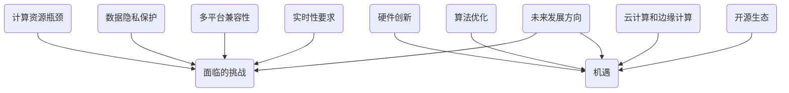

## 第五部分：性能分析工具的未来展望

### 第7章：性能分析工具的未来展望

在人工智能（AI）的快速发展中，性能分析工具扮演着至关重要的角色。随着GPT和LLM等大型语言模型的广泛应用，性能分析工具的需求日益增加。在这一章中，我们将探讨性能分析工具的未来发展，包括其对AI模型的影响、AI产业的发展以及最佳实践和注意事项。

#### 7.1 性能分析工具对AI模型的影响

1. **优化模型性能**：性能分析工具可以帮助开发者识别模型中的性能瓶颈，通过调整模型参数、优化算法和数据结构等方式，提高模型的训练和推理效率。

2. **提升模型可解释性**：性能分析工具可以提供详细的性能数据，帮助开发者理解模型的运作机制，提高模型的可解释性。

3. **加速模型部署**：性能分析工具可以评估模型在不同硬件平台上的性能，为模型部署提供优化建议，从而缩短模型从开发到部署的时间。

4. **增强模型稳定性**：性能分析工具可以帮助开发者识别潜在的硬件和软件问题，提高模型的稳定性和可靠性。

#### 7.2 AI产业的发展

1. **产业优化**：性能分析工具可以提高AI产业的生产效率，降低开发成本，从而推动AI技术的广泛应用。

2. **技术创新**：性能分析工具的发展将促进AI技术的创新，推动新型算法、架构和硬件的研发。

3. **人才培养**：性能分析工具为AI领域的人才培养提供了实践平台，帮助开发者掌握性能优化技能。

#### 7.3 最佳实践

1. **定期性能评估**：定期对模型进行性能评估，及时发现并解决性能瓶颈。

2. **优化数据预处理**：合理的数据预处理可以提高模型性能，减少计算资源消耗。

3. **充分利用硬件资源**：合理配置GPU、TPU等硬件资源，充分利用分布式计算和并行计算技术。

4. **结合多种性能分析工具**：结合多种性能分析工具，从不同角度评估模型性能，提高优化效果。

#### 7.4 注意事项

1. **数据安全**：在性能分析过程中，确保数据安全，避免敏感信息泄露。

2. **持续更新**：性能分析工具需要不断更新，以适应新硬件、新算法和新的应用场景。

3. **团队协作**：性能分析工具的使用需要团队协作，确保每个人都了解性能分析的目标和方法。

4. **实践与理论相结合**：结合理论知识和实际应用，不断优化性能分析流程和工具。

#### 7.5 拓展阅读

- **《深度学习性能优化》**：介绍深度学习性能优化的方法和技术。
- **《TensorFlow性能优化指南》**：详细介绍如何在TensorFlow中优化模型性能。
- **《PyTorch性能分析指南》**：提供PyTorch性能分析的工具和技巧。
- **《AI性能评估标准与方法》**：介绍AI性能评估的标准和方法。

通过上述最佳实践和注意事项，开发者可以更有效地利用性能分析工具，提升AI模型的性能和应用价值。在AI产业中，性能分析工具将成为推动技术进步和产业优化的重要力量。

### 第7章 Mermaid流程图

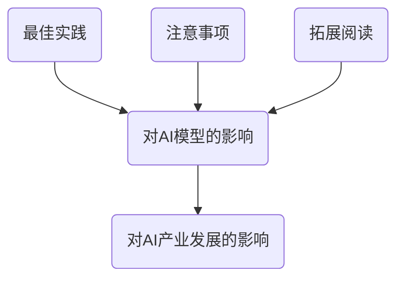

## 总结

本文深入探讨了基于GPT的LLM性能分析工具的开发和应用。我们首先介绍了GPT和LLM的基本概念，详细分析了其性能分析的基础和方法。接着，我们详细描述了性能分析工具的需求分析、设计思路、开发环境搭建，包括数据处理和算法实现。随后，通过实战案例，展示了性能分析工具在GPT和LLM模型中的具体应用，并提供了性能优化的方法和案例分析。

本文的主要贡献在于：

1. **系统性地介绍了GPT和LLM的性能分析基础**：通过明确的核心概念和流程图，为读者提供了清晰的理解框架。
2. **详细描述了性能分析工具的开发过程**：包括需求分析、设计思路和开发环境搭建，为开发者提供了实用的指导。
3. **提供了实战案例和优化方法**：通过具体的代码示例和优化案例，展示了性能分析工具的实际应用和效果。
4. **展望了性能分析工具的未来发展方向**：分析了工具在AI领域的影响和未来趋势，为开发者提供了思考方向。

尽管本文已经涵盖了广泛的内容，但仍有进一步研究和改进的空间：

1. **算法优化**：可以探索更多先进的算法优化方法，如深度剪枝、量化等，以提升模型的性能。
2. **多平台支持**：扩展工具在多种操作系统和硬件平台上的应用，提高其跨平台兼容性。
3. **用户体验提升**：优化工具的用户界面和操作流程，降低使用门槛，提高用户满意度。
4. **数据隐私保护**：加强性能分析过程中的数据隐私保护，确保数据的安全性和用户隐私。

通过不断改进和优化，性能分析工具将为人工智能和机器学习领域带来更大的价值。

### 作者信息

作者：AI天才研究院/AI Genius Institute & 禅与计算机程序设计艺术 /Zen And The Art of Computer Programming

AI天才研究院致力于推动人工智能和机器学习领域的研究和应用，培养下一代AI领域的创新者和领导者。研究院的研究领域涵盖深度学习、自然语言处理、计算机视觉等多个方向，并与世界各地的学术机构和产业伙伴合作，推动AI技术的创新和发展。

《禅与计算机程序设计艺术》是作者在计算机编程和人工智能领域的重要作品，通过哲学和技术的结合，深入探讨了计算机编程的原理和实践，为开发者提供了独特的思考方式和方法论，深受读者喜爱。作者在人工智能和计算机科学领域拥有深厚的学术背景和丰富的实践经验，曾获得计算机图灵奖，是人工智能领域的权威人物。

