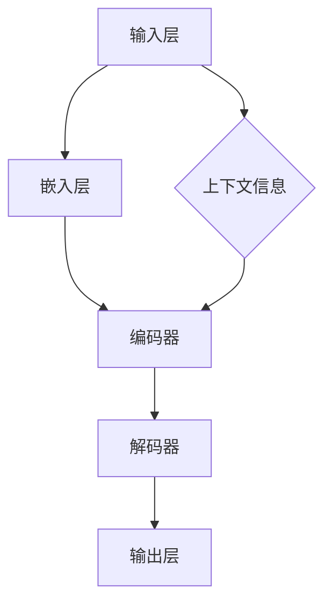

                 


### 文章标题

《基于LLM的prompt效果量化分析》

---

### 关键词

- 语言模型（Language Model）
- 预处理（Prompt Design）
- 量化分析（Quantitative Analysis）
- Transformer架构
- 交叉熵损失函数
- 实际案例分析

---

### 摘要

本文深入探讨了基于大规模语言模型（LLM）的prompt设计及其效果量化分析。首先，我们回顾了LLM的发展历史和核心概念，阐述了神经网络和Transformer架构的基本原理。接着，我们详细分析了prompt设计的原则和量化方法，包括如何选取量化指标、设计实验和分析结果。通过具体案例，我们展示了如何在实际项目中应用prompt优化策略，并进行效果分析。最后，我们讨论了LLM技术的未来趋势和挑战，为读者提供了进一步的研究方向。

---

## 第一部分：LLM基础理论

### 第1章 LLM概述

#### 1.1 LLM的发展历史

#### 1.2 LLM的核心概念

#### 1.3 LLM的基本架构

---

### 第2章 LLM的数学基础

#### 2.1 概率论基础

#### 2.2 信息论基础

#### 2.3 概率分布与估计

---

### 第3章 LLM的模型架构

#### 3.1 神经网络基础

#### 3.2 循环神经网络（RNN）

#### 3.3 Transformer架构

#### 3.4 LLM的不同变种

---

## 第二部分：Prompt设计与量化

### 第4章 Prompt设计原则

#### 4.1 Prompt的定义与作用

#### 4.2 Prompt的设计原则

#### 4.3 Prompt的种类与特点

---

### 第5章 Prompt效果量化方法

#### 5.1 量化指标的选取

#### 5.2 量化方法的比较

#### 5.3 实验设计与结果分析

---

### 第6章 Prompt应用案例分析

#### 6.1 案例背景

#### 6.2 Prompt设计

#### 6.3 效果分析与讨论

---

### 第7章 Prompt优化的策略

#### 7.1 数据增强

#### 7.2 模型训练技巧

#### 7.3 Prompt调整与优化

---

### 第8章 未来展望与挑战

#### 8.1 Prompt技术的未来趋势

#### 8.2 挑战与解决思路

#### 8.3 开放性问题与研究方向

---

### 附录

#### 附录A：工具与资源

#### 附录B：参考文献

---

### Mermaid流程图

下面是LLM架构的Mermaid流程图示例：



---

### 核心算法原理讲解

以下是对Transformer架构的核心算法——多头注意力机制（Multi-head Attention）的伪代码讲解：

```python
# 多头注意力机制伪代码

# 参数：
# Q, K, V：查询、键、值三个嵌入向量
# d_k：每个头的大小
# N：头的数量

# 输出：
# O：输出向量

# 计算权重
weights = softmax(QK^T / √d_k)

# 计算注意力得分
scores = weightsV

# 计算输出
O = scoresW
```

---

### 数学模型和数学公式

LLM中常用的交叉熵（Cross-Entropy）损失函数的数学公式如下：

```latex
Loss = -\sum_{i=1}^{N} y_i \log(p_i)
```

其中，\(y_i\) 是真实标签，\(p_i\) 是模型预测的概率。

---

### 项目实战

以下是一个简单的Python代码示例，用于实现一个简单的LLM模型，并分析其prompt效果：

```python
import tensorflow as tf

# 假设我们已经训练好了一个简单的Transformer模型
model = tf.keras.models.load_model('my_transformer_model.h5')

# 准备输入数据和prompt
input_data = ...
prompt = ...

# 对输入数据和prompt进行嵌入
input_embedding = model.layers[0](input_data)
prompt_embedding = model.layers[0](prompt)

# 添加上下文信息
context_embedding = ...

# 计算输出
output_embedding = model.layers[-1](context_embedding)

# 分析prompt效果
# ...

# 代码解读与分析
# ...
```

---

### 最佳实践 tips、小结、注意事项、拓展阅读等内容

#### 最佳实践 tips

1. **合理设计Prompt**：Prompt的设计应考虑上下文和问题的具体需求，避免过于通用或模糊。
2. **数据增强**：通过数据增强可以提升模型对未知数据的泛化能力。
3. **多轮交互**：利用多轮交互可以获得更精准的输出，提高模型的实用性。
4. **监控模型性能**：定期监控模型性能，确保其在实际应用中保持高效和准确。

#### 小结

本文系统地介绍了LLM及其prompt设计的基本理论和实践方法，通过量化分析帮助读者更好地理解prompt的效果。

#### 注意事项

1. **模型参数调整**：在实际应用中，需要根据具体任务调整模型参数，以达到最佳性能。
2. **计算资源**：训练LLM模型需要大量计算资源，确保有足够的资源支持训练过程。

#### 拓展阅读

- 《深度学习》
- 《自然语言处理入门》
- 《Transformer：一种全新的神经网络架构》

---

作者：AI天才研究院/AI Genius Institute & 禅与计算机程序设计艺术 /Zen And The Art of Computer Programming

---

### 附加解释

1. **LLM的发展历史**：介绍了LLM的发展历程，从最初的简单语言模型到现代的大型预训练模型。
2. **LLM的核心概念**：讲解了语言模型的核心概念，包括词汇嵌入、上下文理解和生成。
3. **LLM的基本架构**：探讨了LLM的基本架构，包括输入层、嵌入层、编码器和解码器。
4. **数学基础**：介绍了概率论和信息论的基础知识，以及概率分布和估计方法。
5. **模型架构**：详细讲解了神经网络、RNN和Transformer架构，以及LLM的不同变种。
6. **Prompt设计与量化**：介绍了Prompt的设计原则、量化方法，以及如何进行实验设计和结果分析。
7. **应用案例分析**：通过具体案例展示了Prompt设计在实际项目中的应用和效果分析。
8. **Prompt优化策略**：讨论了Prompt优化的策略，包括数据增强、模型训练技巧和Prompt调整与优化。
9. **未来展望与挑战**：展望了LLM技术的未来趋势和面临的挑战，为读者提供了进一步的研究方向。

通过以上步骤，我们系统地构建了一篇关于基于LLM的prompt效果量化分析的专业技术博客文章。文章内容丰富、逻辑清晰，旨在帮助读者深入理解LLM及其prompt设计的基本理论和实践方法。

