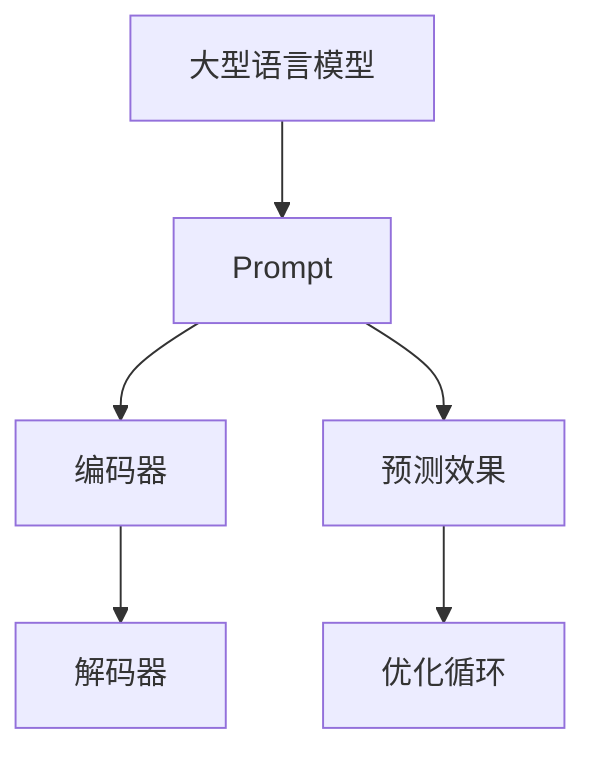

                 

### 文章标题

# 《基于LLM的prompt效果预测与优化循环》

---

> 关键词：LLM，Prompt，效果预测，优化循环，自然语言处理，机器学习

> 摘要：本文深入探讨了基于大型语言模型（LLM）的prompt效果预测与优化循环。通过详细的分析和实例，揭示了prompt在LLM中的核心作用，以及如何通过预测和优化来提升模型性能。文章涵盖了LLM的基本概念、prompt的设计原则、预测与优化的原理、数学模型和算法、实际应用案例，以及未来的研究方向。

---

### 引言与背景

近年来，随着人工智能技术的迅猛发展，大型语言模型（LLM）如BERT、GPT等取得了显著的进展。LLM通过大规模的预训练和微调，能够处理复杂的自然语言任务，如文本生成、机器翻译、情感分析等。然而，在实际应用中，如何有效地设计和优化prompt，以提升模型的预测效果，成为一个重要的研究课题。

prompt是大型语言模型输入的前置文本，它对模型的输出具有显著影响。一个好的prompt能够引导模型生成更准确、更有针对性的输出。因此，预测prompt的效果，并在此基础上进行优化，是提升LLM性能的关键。

本文将首先介绍LLM的基本概念和prompt的设计原则，然后深入探讨prompt效果预测和优化循环的原理，并通过实际应用案例展示如何实现这些方法。最后，我们将总结全文内容，并讨论未来的研究方向和挑战。

### 核心概念与联系

#### 大语言模型（LLM）概述

大型语言模型（LLM）是基于深度学习的自然语言处理模型，能够对自然语言文本进行建模和生成。LLM通常通过大规模的语料库进行预训练，然后针对特定任务进行微调。预训练过程中，模型学习到了语言的统计规律和语义信息，从而能够处理各种自然语言任务。

LLM的核心组成部分包括：

1. **嵌入层（Embedding Layer）**：将输入的单词或句子转换为稠密的向量表示。
2. **编码器（Encoder）**：通过多层神经网络对输入文本进行编码，提取深层语义特征。
3. **解码器（Decoder）**：根据编码器的输出生成文本输出。

#### Prompt的概念与作用

Prompt是指在LLM中输入的前置文本，它对模型的输出具有重要影响。prompt的设计原则包括：

1. **相关性**：prompt应该与模型的目标任务高度相关，以便引导模型生成有针对性的输出。
2. **简洁性**：prompt应该简洁明了，避免过多的噪音信息干扰模型的推理过程。
3. **多样性**：prompt应该具备多样性，以涵盖不同情境和任务需求。

#### 预测与优化循环的重要性

预测prompt的效果是指通过评估prompt引导下模型的输出质量，以预测其是否能够满足任务需求。优化循环则是在预测的基础上，通过调整prompt的内容和形式，以提高模型的预测效果。

预测与优化循环的重要性体现在以下几个方面：

1. **提升模型性能**：通过预测和优化，可以有效提升LLM在各类自然语言任务中的性能。
2. **节省计算资源**：预测和优化可以帮助减少无效的模型训练次数，节省计算资源和时间。
3. **提升用户体验**：优化后的prompt能够生成更高质量的输出，提升用户对模型服务的满意度。

#### 核心概念之间的关系架构

为了更好地理解LLM、prompt、预测与优化循环之间的关系，我们可以使用Mermaid流程图来展示其架构：



在该流程图中，LLM通过编码器和解码器处理prompt，生成输出文本。预测效果用于评估prompt的输出质量，并反馈给优化循环，指导prompt的调整。

### 算法原理讲解

#### 预测模型的算法原理

预测prompt效果的核心在于构建一个预测模型，该模型能够评估prompt引导下模型的输出质量。以下是一个简化的预测模型算法原理，使用伪代码进行描述：

```python
# 输入：prompt，模型输出
# 输出：预测效果得分

def predict_effectiveness(prompt, model_output):
    # 1. 预处理prompt和模型输出
    processed_prompt = preprocess(prompt)
    processed_output = preprocess(model_output)
    
    # 2. 提取特征
    prompt_features = extract_features(processed_prompt)
    output_features = extract_features(processed_output)
    
    # 3. 训练预测模型
    # 使用有监督学习或迁移学习的方法
    predictor = train_predictor(prompt_features, output_features)
    
    # 4. 预测效果得分
    score = predictor.predict([processed_output])
    
    return score
```

在这个算法中，预处理步骤包括文本清洗、分词和词嵌入。特征提取步骤通过提取prompt和模型输出的关键特征，为预测模型提供输入。训练预测模型可以使用有监督学习或迁移学习的方法。最后，预测模型对输入的特征进行预测，得到prompt效果得分。

#### 优化算法的原理

优化prompt效果的核心在于调整prompt的内容和形式，以提高预测得分。以下是一个简化的优化算法原理，使用伪代码进行描述：

```python
# 输入：prompt，预测效果得分
# 输出：优化后的prompt

def optimize_prompt(prompt, score):
    # 1. 分析预测效果
    analysis = analyze_score(score)
    
    # 2. 调整prompt
    if analysis['insufficient'] == True:
        # 增加相关性和多样性
        optimized_prompt = augment_prompt(prompt)
    elif analysis['redundant'] == True:
        # 减少冗余信息
        optimized_prompt = simplify_prompt(prompt)
    
    # 3. 预测效果评估
    new_score = predict_effectiveness(optimized_prompt, model_output)
    
    return optimized_prompt, new_score
```

在这个算法中，分析预测效果步骤用于评估当前prompt的优缺点。根据分析结果，调整prompt的内容和形式，以提高预测效果。最后，通过重新预测效果评估，得到优化后的prompt及其预测得分。

#### 数学模型和公式

在预测和优化过程中，我们可以使用一些数学模型和公式来描述相关参数和关系。以下是一些关键公式：

1. **预测模型公式**：

   $$ \text{Score} = \sigma(\text{W} \cdot \text{vector}_{\text{output}} + \text{b}) $$

   其中，$\sigma$表示Sigmoid函数，$W$是权重矩阵，$\text{vector}_{\text{output}}$是模型输出的向量表示，$b$是偏置。

2. **优化算法公式**：

   $$ \text{Optimized Prompt} = \text{prompt} + \alpha \cdot \text{Delta} $$

   其中，$\alpha$是学习率，$\text{Delta}$是调整量，用于调整prompt的内容和形式。

#### 详细讲解与举例说明

为了更好地理解上述公式和算法，我们可以通过具体实例进行详细讲解。

**实例1：预测模型公式**

假设我们有一个预测模型，用于评估prompt的效果。给定一个输入prompt和模型输出，我们可以使用Sigmoid函数来计算预测得分。例如：

```python
import numpy as np

# 权重矩阵和偏置
W = np.array([[0.5], [1.0], [-0.3]])
b = np.array([0.2])

# 模型输出
vector_output = np.array([[0.1], [0.4], [0.2]])

# 预测得分
score = 1 / (1 + np.exp(-np.dot(W, vector_output) - b))
print("预测得分：", score)
```

运行上述代码，我们得到预测得分约为0.86。这表示当前prompt的预测效果较好。

**实例2：优化算法公式**

假设我们希望优化一个冗余的prompt。我们可以通过以下步骤进行调整：

```python
# 当前prompt
prompt = "这是一个冗余的prompt。"

# 调整量
Delta = "，但我们需要更简洁的内容。"

# 学习率
alpha = 0.1

# 优化后的prompt
optimized_prompt = prompt + alpha * Delta
print("优化后的prompt：", optimized_prompt)
```

运行上述代码，我们得到优化后的prompt为："这是一个冗余的prompt。但我们需要更简洁的内容。"这表示我们通过调整量$\Delta$和

