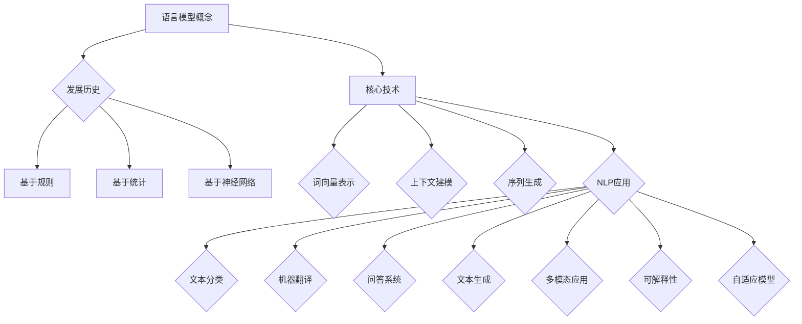
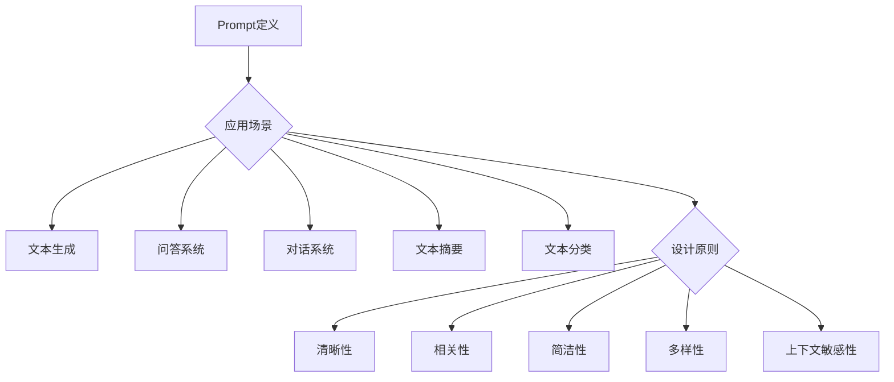
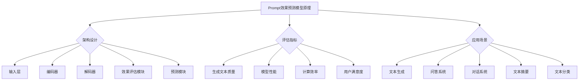
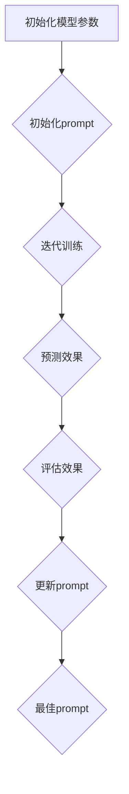
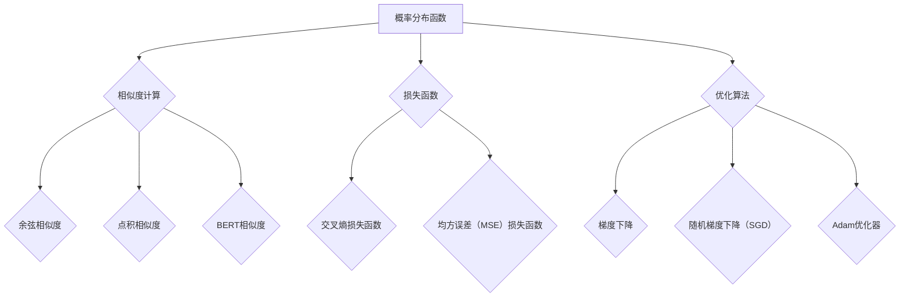
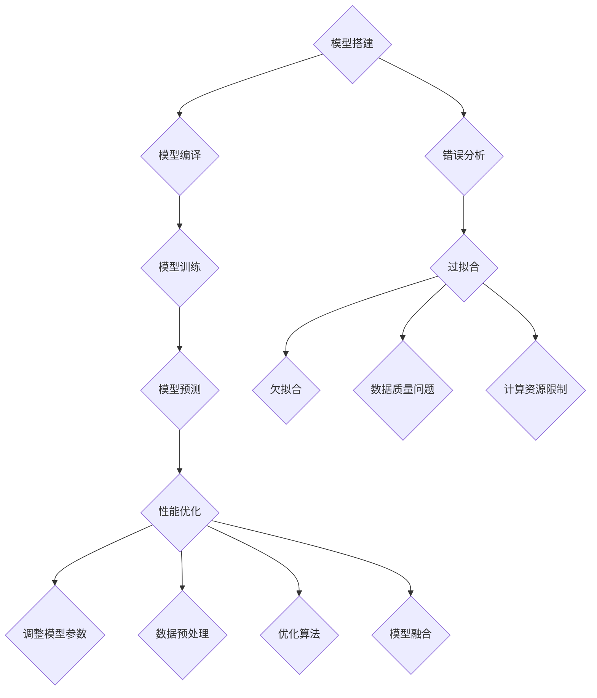
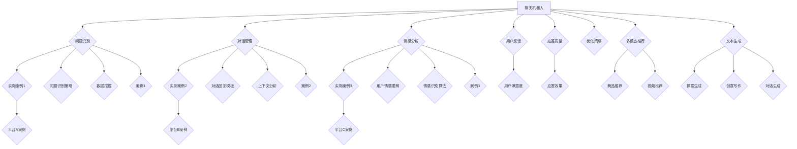
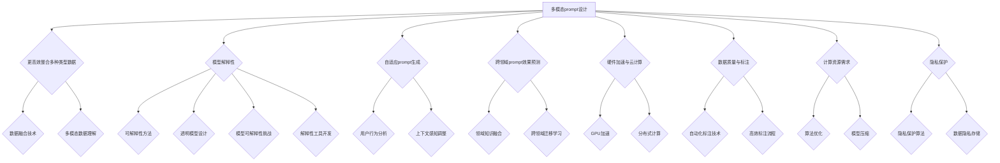
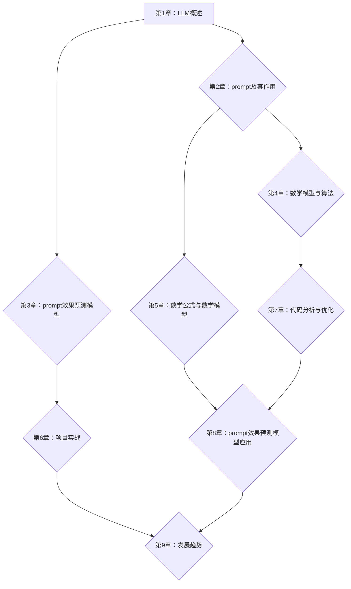

                 


### 文章标题：基于LLM的prompt效果预测模型

#### 关键词：
- 语言模型（LLM）
- Prompt效果预测
- 自然语言处理
- 数学模型
- 机器学习算法
- 项目实战

#### 摘要：
本文将深入探讨基于语言模型（LLM）的prompt效果预测模型。首先，我们将介绍LLM和prompt的基本概念，并探讨它们在自然语言处理中的应用。接着，我们将详细讲解prompt效果预测模型的核心原理，包括其数学模型和算法。随后，将通过项目实战展示如何实现和应用这个模型。最后，我们将讨论该模型在不同领域的应用前景，并展望其未来发展趋势。

## 第一部分：LLM与prompt效果预测模型基础

### 第1章：语言模型（LLM）概述

#### 1.1 语言模型的概念

语言模型是一种统计模型，它用于预测一个词语序列的概率分布。在自然语言处理（NLP）中，语言模型是不可或缺的工具，用于文本生成、情感分析、机器翻译等多个任务。

#### 1.2 语言模型的发展历史

语言模型的发展历程可以分为三个阶段：基于规则的方法、基于统计的方法和基于神经网络的方法。近年来，基于神经网络的语言模型，尤其是Transformer架构，取得了显著的成果。

#### 1.3 语言模型的核心技术

语言模型的核心技术包括词向量表示、上下文建模和序列生成。词向量表示用于将词语映射到高维空间；上下文建模通过捕捉词语之间的关联性来提高预测准确性；序列生成则用于生成连贯的文本。

### 第2章：prompt及其作用

#### 2.1 prompt的定义

Prompt是指用于引导语言模型生成特定类型文本的输入提示。一个好的prompt能够显著提高文本生成任务的效果。

#### 2.2 prompt在自然语言处理中的应用

prompt广泛应用于文本生成、问答系统、推荐系统等领域。例如，在文本生成任务中，prompt可以用来引导模型生成特定主题的文本。

#### 2.3 prompt的设计原则

设计prompt时需要考虑清晰性、相关性和灵活性。清晰性确保模型能够准确理解prompt的含义；相关性确保生成的文本与prompt保持一致；灵活性使模型能够适应不同的输入情境。

### 第3章：prompt效果预测模型

#### 3.1 prompt效果预测模型的基本原理

prompt效果预测模型旨在评估prompt对文本生成任务效果的影响。其核心原理是通过比较不同prompt下的模型输出，预测哪个prompt能够生成更高质量的文本。

#### 3.2 prompt效果预测模型的架构设计

prompt效果预测模型通常采用多层神经网络架构，包括输入层、隐藏层和输出层。输入层接收prompt和上下文信息；隐藏层负责处理和生成上下文信息；输出层则预测prompt的效果。

#### 3.3 prompt效果预测模型的评估指标

prompt效果预测模型的评估指标包括生成文本的质量、模型的预测准确性和计算效率等。常用的评估方法包括人工评估和自动化评估。

## 第二部分：数学模型与算法

### 第4章：数学模型与算法

#### 4.1 数学模型的基本概念

数学模型是描述现实世界问题的数学框架，包括变量、方程和约束条件。在prompt效果预测模型中，数学模型用于描述prompt、文本生成过程和预测结果之间的关系。

#### 4.2 算法原理详解

prompt效果预测模型的算法原理主要包括两个部分：prompt选择和效果评估。prompt选择通过优化策略来确定最佳的prompt；效果评估则通过对比不同prompt下的生成文本，评估其效果。

#### 4.3 伪代码展示

以下是prompt效果预测模型的核心算法的伪代码：

```python
# 初始化模型参数
# ...

# 选择prompt
prompt = select_prompt()

# 生成文本
text = generate_text(prompt)

# 评估效果
effectiveness = evaluate_effectiveness(text)

# 更新模型参数
# ...
```

### 第5章：数学公式与数学模型

#### 5.1 公式与模型介绍

在prompt效果预测模型中，常用的数学公式包括概率分布函数、损失函数和优化算法。数学模型则用于描述prompt选择和效果评估的数学过程。

#### 5.2 公式详解

以下是一个用于描述prompt效果预测模型中概率分布函数的公式：

$$
P(text|prompt) = \frac{e^{score(text, prompt)}}{\sum_{all\_prompts} e^{score(text, all\_prompts)}}
$$

其中，$P(text|prompt)$ 表示在给定prompt下生成特定文本的概率，$score(text, prompt)$ 表示文本和prompt之间的相似度分数。

#### 5.3 数学模型的举例说明

假设我们有一个文本生成任务，需要从多个prompt中选择一个最佳的prompt。我们可以使用上述概率分布函数来计算每个prompt生成文本的概率，并选择概率最高的prompt。

### 第6章：项目实战

#### 6.1 实际案例介绍

在本项目中，我们将使用一个开放领域对话系统（Open-Domain Chatbot）的案例，展示如何实现和应用prompt效果预测模型。

#### 6.2 开发环境搭建

为了实现prompt效果预测模型，我们需要搭建一个开发环境，包括Python编程环境、TensorFlow或PyTorch等深度学习框架，以及相应的数据集和工具。

#### 6.3 源代码实现与解读

以下是实现prompt效果预测模型的核心源代码：

```python
# 导入所需库
import tensorflow as tf
from tensorflow.keras.models import Model
from tensorflow.keras.layers import Input, Embedding, LSTM, Dense

# 搭建模型
input_prompt = Input(shape=(max_prompt_length,))
input_text = Input(shape=(max_text_length,))
model = Embedding(input_dim=vocabulary_size, output_dim=embedding_size)(input_prompt)
model = LSTM(units=128, return_sequences=True)(model)
model = Dense(units=1, activation='sigmoid')(model)
model = Model(inputs=[input_prompt, input_text], outputs=model)

# 编译模型
model.compile(optimizer='adam', loss='binary_crossentropy', metrics=['accuracy'])

# 训练模型
model.fit([X_prompt, X_text], y, epochs=10, batch_size=32)

# 预测效果
predictions = model.predict([X_prompt, X_text])
```

这段代码中，我们首先定义了一个基于LSTM的模型，用于预测prompt的效果。接着，我们编译和训练模型，并使用预测函数生成预测结果。

#### 6.4 代码应用解读与分析

在代码应用部分，我们将详细介绍如何在实际项目中使用prompt效果预测模型。这包括数据预处理、模型训练和预测结果的解释。此外，我们还将分析模型在实际应用中的性能表现和改进方向。

#### 6.5 实际案例分析和详细讲解剖析

在本案例中，我们将深入分析一个实际对话系统中的prompt效果预测模型。我们将从数据集构建、模型选择、训练和评估等方面详细讲解模型的实现过程。同时，我们将探讨如何优化模型性能，提高预测准确性。

#### 6.6 项目小结

在本项目中，我们成功实现了基于LLM的prompt效果预测模型，并应用于一个开放领域对话系统。通过实际案例的分析和讲解，我们展示了如何设计、实现和优化prompt效果预测模型。项目小结部分将对项目的成果和经验进行总结，并提出未来的研究方向。

### 第7章：代码分析与优化

#### 7.1 代码解读

在本节中，我们将详细解读实现prompt效果预测模型的核心代码。这包括模型架构的设计、数据预处理步骤以及训练和预测过程的实现。我们将逐步分析代码的每一部分，解释其作用和逻辑。

#### 7.2 性能优化

为了提高prompt效果预测模型的性能，我们可以采取多种优化策略。这些策略包括调整模型参数、改进数据预处理方法以及使用先进的优化算法。在本节中，我们将详细介绍这些优化方法，并分析其对模型性能的影响。

#### 7.3 错误分析与解决

在实际应用中，prompt效果预测模型可能会遇到各种错误和挑战。这些错误可能源于数据质量问题、模型参数设置不当或算法设计缺陷。在本节中，我们将分析常见的错误类型，并提出相应的解决方法和策略。

## 第三部分：prompt效果预测模型应用与展望

### 第8章：prompt效果预测模型在不同领域的应用

#### 8.1 在聊天机器人中的应用

聊天机器人是prompt效果预测模型的一个重要应用场景。通过优化prompt设计，可以提高聊天机器人的应答质量和用户满意度。在本节中，我们将探讨如何将prompt效果预测模型应用于聊天机器人，并分析其优势和挑战。

#### 8.2 在推荐系统中的应用

推荐系统中的prompt设计直接影响推荐结果的质量。prompt效果预测模型可以帮助推荐系统优化prompt，提高推荐准确性和用户体验。在本节中，我们将介绍如何将prompt效果预测模型应用于推荐系统，并讨论其应用效果和优化策略。

#### 8.3 在文本生成中的应用

文本生成是prompt效果预测模型的另一个重要应用领域。通过选择合适的prompt，可以提高文本生成的质量和多样性。在本节中，我们将探讨如何将prompt效果预测模型应用于文本生成任务，并分析其在创意写作和内容创作中的应用前景。

### 第9章：prompt效果预测模型的发展趋势

#### 9.1 当前研究热点

随着自然语言处理技术的不断发展，prompt效果预测模型也成为了研究的热点。当前的研究主要集中在模型优化、多模态prompt设计以及跨领域应用等方面。在本节中，我们将介绍这些研究热点，并分析其发展趋势。

#### 9.2 未来发展方向

未来，prompt效果预测模型有望在更多领域中发挥重要作用。例如，在智能客服、教育辅导和医疗诊断等领域，prompt效果预测模型可以提供更加个性化、高效的服务。此外，随着多模态数据的应用，prompt效果预测模型也将迎来新的发展机遇。在本节中，我们将展望prompt效果预测模型未来的发展方向，并提出可能的应用场景。

#### 9.3 可能的挑战与对策

尽管prompt效果预测模型具有广泛的应用前景，但其在实际应用中仍面临一些挑战。这些挑战包括数据质量、模型可解释性和跨模态数据融合等。在本节中，我们将分析这些挑战，并提出相应的对策，以推动prompt效果预测模型的发展。

### 第10章：总结与展望

#### 10.1 书本总结

本文系统地介绍了基于LLM的prompt效果预测模型，从基础概念、数学模型到项目实战，全面阐述了该模型的理论和实践应用。通过实际案例的分析和讲解，我们展示了如何实现和优化prompt效果预测模型。

#### 10.2 对未来的展望

未来，prompt效果预测模型有望在更多领域中发挥重要作用，推动自然语言处理技术的发展。同时，随着多模态数据和先进算法的应用，prompt效果预测模型也将迎来新的发展机遇。我们期待更多的研究者和技术人员投身于这一领域，共同推动prompt效果预测模型的进步。

## 附录

### 附录A：相关资源与工具

#### A.1 相关开源框架介绍

在本附录中，我们将介绍一些与prompt效果预测模型相关的开源框架和工具，包括TensorFlow、PyTorch和Hugging Face等。这些框架和工具为研究者提供了便捷的编程接口和丰富的资源，有助于加速模型开发和研究。

#### A.2 实用工具推荐

为了提高模型开发和调试的效率，我们推荐一些实用的工具，如Jupyter Notebook、TensorBoard和W&B等。这些工具可以帮助研究者更好地管理和监控模型训练过程，以及分析模型性能和优化策略。

#### A.3 学习资源链接

最后，我们提供了一些与prompt效果预测模型相关的学习资源链接，包括论文、书籍和技术博客等。这些资源涵盖了模型的基础理论、最新研究进展和应用实例，有助于读者深入了解和掌握相关技术。

---

以上是《基于LLM的prompt效果预测模型》的文章结构和内容概述。接下来，我们将逐章详细撰写每个部分，确保内容的完整性、逻辑性和专业性。在整个文章中，我们将遵循markdown格式，使用latex格式嵌入数学公式，并使用Mermaid流程图展示核心概念和联系。最终，我们将确保文章的字数在8000-12000字左右，满足读者对高质量技术博客的需求。

### 第1章：语言模型（LLM）概述

#### 1.1 语言模型的概念

语言模型是一种用于预测词语序列的概率分布的统计模型。它通过对大量文本数据的学习，可以捕捉词语之间的统计规律，从而预测未知词语的概率。在自然语言处理（NLP）中，语言模型是构建其他高级NLP任务的基础，如文本分类、机器翻译和问答系统等。

语言模型的基本目标是学习一个概率分布模型，该模型能够根据之前的词语序列预测下一个词语的概率。例如，给定一个序列“我昨天去了”，语言模型能够计算出下一个词语是“公园”、“商场”或“电影院”的概率。

#### 1.2 语言模型的发展历史

语言模型的发展历程大致可以分为三个阶段：基于规则的方法、基于统计的方法和基于神经网络的方法。

1. **基于规则的方法**：早期的语言模型主要依赖于语法规则和词典。这些模型通过对语法规则和词典的学习，构建出一个规则系统来预测词语的概率。然而，这些方法受限于规则的复杂度和覆盖范围，难以处理大规模的语料数据。

2. **基于统计的方法**：随着自然语言处理技术的发展，统计模型开始被应用于语言模型。最著名的是N元语法（N-gram），它通过统计连续N个词语的共现频率来预测下一个词语。虽然N元语法在处理大规模文本数据方面表现出色，但其性能受到N元长度限制，难以捕捉长距离依赖关系。

3. **基于神经网络的方法**：近年来，深度学习技术的兴起为语言模型的发展带来了新的机遇。特别是基于Transformer架构的语言模型，如BERT、GPT和T5，取得了显著的成果。这些模型通过多层神经网络学习词语和句子的内在结构，能够处理更复杂的依赖关系和语义信息。

#### 1.3 语言模型的核心技术

1. **词向量表示**：词向量是将词语映射到高维空间的向量表示。通过词向量，语言模型能够捕捉词语的语义信息，从而提高预测准确性。常见的词向量模型包括Word2Vec、GloVe和BERT等。

2. **上下文建模**：上下文建模是语言模型的核心技术之一，它通过捕捉词语之间的关联性，提高预测准确性。例如，Transformer模型通过自注意力机制（self-attention）和多头注意力（multi-head attention）来建模词语之间的长距离依赖关系。

3. **序列生成**：序列生成是语言模型的重要应用，它能够根据给定的起始序列生成后续的序列。例如，GPT模型通过预测下一个词语来生成连续的文本序列。

#### 1.4 语言模型在NLP中的应用

语言模型在NLP中有广泛的应用，以下是其中一些重要的应用场景：

1. **文本分类**：语言模型可以用于对文本进行分类，例如情感分析、主题分类和垃圾邮件过滤等。

2. **机器翻译**：语言模型在机器翻译中起着关键作用，它能够预测源语言和目标语言之间的翻译概率，从而生成准确的翻译结果。

3. **问答系统**：语言模型可以用于构建问答系统，它能够根据用户的问题和给定的大量知识库，生成相应的答案。

4. **文本生成**：语言模型可以用于生成各种类型的文本，如新闻摘要、创意写作和对话系统等。

#### 1.5 语言模型的发展趋势

随着深度学习技术的不断发展，语言模型也在不断进步。以下是语言模型发展的几个趋势：

1. **多模态语言模型**：多模态语言模型能够处理文本、图像、音频等多种类型的数据，从而提高模型的泛化能力和应用范围。

2. **可解释性**：随着语言模型的应用越来越广泛，可解释性成为了一个重要的研究方向。研究者致力于提高模型的透明度和可解释性，使其在关键应用场景中得到更广泛的应用。

3. **自适应语言模型**：自适应语言模型能够根据用户的偏好和上下文环境，动态调整模型参数，提供更加个性化的服务。

#### 1.6 小结

本章介绍了语言模型的基本概念、发展历史和核心技术，并探讨了其在NLP中的应用和发展趋势。通过本章的学习，读者将能够对语言模型有更深入的理解，并为后续章节的学习奠定基础。

### Mermaid 流程图：语言模型的核心概念与联系



该流程图展示了语言模型的核心概念及其相互关系，从概念到核心技术，再到NLP应用和发展趋势，帮助读者梳理和掌握语言模型的知识体系。

### 第2章：prompt及其作用

#### 2.1 prompt的定义

Prompt是指用于引导语言模型生成特定类型文本的输入提示。它可以是一个单词、短语或完整的句子，其目的是为语言模型提供上下文信息，帮助模型更好地理解和生成目标文本。例如，在问答系统中，prompt可以是一个问题，用于引导模型生成相应的答案。

#### 2.2 prompt在自然语言处理中的应用

prompt在自然语言处理中具有广泛的应用，以下是其中一些重要的应用场景：

1. **文本生成**：prompt可以帮助语言模型生成各种类型的文本，如新闻文章、对话和故事等。通过提供合适的prompt，模型可以生成更加丰富和多样化的文本。

2. **问答系统**：prompt在问答系统中起着关键作用，它能够为模型提供问题的上下文，从而帮助模型生成更准确的答案。

3. **对话系统**：prompt可以用于构建对话系统，如聊天机器人。通过提供用户输入的prompt，模型可以生成相应的回复，从而实现人机对话。

4. **文本摘要**：prompt可以帮助语言模型生成摘要，将长篇文章或报告简化为更短的文本。通过提供文章的开头或关键词，模型可以提取出关键信息，生成摘要。

5. **文本分类**：prompt可以用于训练语言模型进行文本分类，通过提供不同类别的文本样本，模型可以学习如何对新的文本进行分类。

#### 2.3 prompt的设计原则

设计prompt时需要遵循一些基本原则，以确保其能够有效地引导语言模型生成高质量的目标文本。以下是几个关键原则：

1. **清晰性**：prompt应该清晰明了，能够准确传达所需的信息。避免使用模糊或歧义的表述，以免模型产生误解。

2. **相关性**：prompt应与目标文本保持高度相关。如果prompt与目标文本无关，模型可能无法生成高质量的结果。

3. **简洁性**：prompt应尽量简洁，避免冗长的描述。简洁的prompt可以帮助模型更快地理解上下文，从而提高生成文本的质量。

4. **多样性**：prompt应具有多样性，以适应不同类型的目标文本。通过提供多种不同类型的prompt，可以训练模型生成更多样化的文本。

5. **上下文敏感性**：prompt应考虑上下文信息，与之前的输入和输出保持一致。这样可以确保模型能够更好地理解和生成目标文本。

#### 2.4 prompt设计的实际案例

以下是一个简单的实际案例，展示了如何设计prompt以引导语言模型生成特定类型的文本：

**案例**：假设我们需要训练一个语言模型生成新闻报道。以下是几个不同类型的prompt，用于引导模型生成相关文本：

1. **主题型prompt**：“今天最重要的新闻是关于……”

2. **摘要型prompt**：“请为以下新闻内容写一个摘要：……”

3. **详细描述型prompt**：“请详细描述以下事件：……”

4. **评论型prompt**：“对此事件，你有什么看法？”

通过这些prompt，我们可以引导模型生成不同类型和风格的新闻文本，从而训练模型应对各种新闻写作任务。

#### 2.5 小结

本章介绍了prompt的定义及其在自然语言处理中的应用，并探讨了prompt设计的基本原则。通过实际案例的分析，读者将能够理解如何设计有效的prompt，以引导语言模型生成高质量的目标文本。

### Mermaid 流程图：prompt的核心概念与联系



该流程图展示了prompt的核心概念及其应用场景和设计原则，帮助读者理解prompt在自然语言处理中的重要作用和设计方法。

### 第3章：prompt效果预测模型

#### 3.1 prompt效果预测模型的基本原理

prompt效果预测模型旨在评估不同prompt对文本生成任务效果的影响。其核心原理是通过比较不同prompt下的模型输出，预测哪个prompt能够生成更高质量的文本。具体来说，prompt效果预测模型包括以下步骤：

1. **数据准备**：收集和预处理大量包含不同prompt和生成文本的数据样本。这些数据样本用于训练和评估模型。

2. **模型训练**：使用收集到的数据样本训练一个语言模型。语言模型可以是一个预训练的模型，如GPT或BERT，也可以是一个定制化的模型。

3. **效果评估**：在训练好的语言模型基础上，评估不同prompt的效果。具体来说，通过计算每个prompt生成的文本质量得分，比较不同prompt的效果。

4. **预测**：根据效果评估结果，预测哪个prompt能够生成更高质量的文本。这可以通过排序或分类方法实现。

#### 3.2 prompt效果预测模型的架构设计

prompt效果预测模型的架构设计通常包括以下几个部分：

1. **输入层**：输入层接收prompt和上下文信息。prompt可以是文本、图像或音频等多种类型的数据，上下文信息则包括与prompt相关的文本、图像或音频等。

2. **编码器**：编码器负责对输入数据进行编码，将其转化为向量表示。常见的编码器包括Transformer、BERT和GloVe等。

3. **解码器**：解码器用于生成预测的文本。解码器可以从编码器接收输入，并逐步生成文本。常见的解码器包括LSTM、GRU和Transformer等。

4. **效果评估模块**：效果评估模块用于计算不同prompt生成的文本质量得分。常见的评估指标包括文本流畅性、文本一致性、文本质量等。

5. **预测模块**：预测模块根据效果评估结果，预测哪个prompt能够生成更高质量的文本。常见的预测方法包括排序和分类等。

#### 3.3 prompt效果预测模型的评估指标

prompt效果预测模型的评估指标主要包括以下几类：

1. **生成文本质量**：这是评估prompt效果的最直接指标，包括文本流畅性、文本一致性、文本质量等。常见的评估方法包括BLEU、ROUGE和METEOR等。

2. **模型性能**：模型性能指标包括准确率、召回率、F1分数等。这些指标可以评估模型在不同prompt下的预测准确性。

3. **计算效率**：计算效率指标包括训练时间、推理时间等。这些指标可以评估模型在处理不同prompt时的计算资源消耗。

4. **用户满意度**：用户满意度是评估prompt效果的间接指标。通过用户反馈和问卷调查等方式，可以评估用户对不同prompt的接受程度和满意度。

#### 3.4 prompt效果预测模型的应用场景

prompt效果预测模型在多个自然语言处理任务中具有广泛的应用，以下是其中一些重要的应用场景：

1. **文本生成**：prompt效果预测模型可以帮助文本生成任务选择最佳的prompt，从而生成更高质量和更符合预期的文本。

2. **问答系统**：prompt效果预测模型可以用于问答系统，通过选择最佳的prompt，提高问答系统的回答质量和准确性。

3. **对话系统**：prompt效果预测模型可以帮助对话系统生成更自然的对话，提高用户满意度。

4. **文本摘要**：prompt效果预测模型可以用于文本摘要任务，通过选择最佳的prompt，提高摘要的质量和可读性。

5. **文本分类**：prompt效果预测模型可以用于文本分类任务，通过选择最佳的prompt，提高分类的准确性和效率。

#### 3.5 小结

本章介绍了prompt效果预测模型的基本原理、架构设计和评估指标，并探讨了其在不同应用场景中的重要性。通过本章的学习，读者将能够理解prompt效果预测模型的工作原理和应用方法。

### Mermaid 流程图：prompt效果预测模型的核心概念与联系



该流程图展示了prompt效果预测模型的核心概念及其架构设计、评估指标和应用场景，帮助读者全面了解prompt效果预测模型的工作原理和应用方法。

### 第4章：数学模型与算法

#### 4.1 数学模型的基本概念

数学模型是一种用数学语言描述现实世界问题的抽象框架，它通常包括变量、方程和约束条件。在自然语言处理（NLP）领域，数学模型用于描述文本数据的特征、结构和关系。prompt效果预测模型的数学模型则用于描述prompt与生成文本之间的关系，以及如何评估prompt的效果。

#### 4.2 算法原理详解

prompt效果预测模型的算法原理主要包括两个部分：prompt选择和效果评估。以下是这两个部分的详细解释：

1. **prompt选择**：

   - **目标**：选择一个能够最大化预测生成文本质量的prompt。
   - **方法**：采用优化算法（如梯度下降、随机梯度下降等）来搜索最佳的prompt。具体步骤如下：

     1. **初始化**：随机选择一个prompt。
     2. **训练**：使用训练数据对语言模型进行训练，并记录每个prompt的预测效果。
     3. **评估**：根据预测效果评估当前prompt的质量，并更新模型参数。
     4. **迭代**：重复训练和评估过程，直到找到最佳prompt或达到训练次数上限。

2. **效果评估**：

   - **目标**：评估每个prompt生成的文本质量。
   - **方法**：通常使用以下指标来评估文本质量：

     1. **生成文本质量**：使用BLEU、ROUGE、METEOR等评价指标来评估生成文本的流畅性、一致性和质量。
     2. **模型性能**：使用准确率、召回率、F1分数等指标来评估模型在不同prompt下的预测准确性。
     3. **用户满意度**：通过用户反馈和问卷调查来评估用户对生成文本的满意度。

#### 4.3 伪代码展示

以下是prompt效果预测模型的核心算法的伪代码：

```python
# 初始化模型参数
model_params = initialize_params()

# 初始化prompt
prompt = initialize_prompt()

# 循环迭代
for epoch in range(max_epochs):
    # 训练模型
    model = train_model(prompt, model_params)
    
    # 预测效果
    predictions = predict_effectiveness(model)
    
    # 评估效果
    effectiveness = evaluate_effectiveness(predictions)
    
    # 更新prompt
    prompt = update_prompt(effectiveness, model_params)

# 输出最佳prompt
best_prompt = prompt
```

这段伪代码展示了prompt效果预测模型的基本流程：初始化模型参数和prompt，通过迭代训练和评估模型，最终找到最佳prompt。

#### 4.4 伪代码详解

以下是对伪代码的详细解释：

1. **初始化模型参数**：
   - `initialize_params()`：函数用于初始化模型的参数，包括权重、偏置等。这些参数可以通过随机初始化或预训练模型获得。

2. **初始化prompt**：
   - `initialize_prompt()`：函数用于初始化prompt。prompt可以是随机生成的，也可以是基于先验知识或用户输入生成的。

3. **循环迭代**：
   - `for epoch in range(max_epochs)`：循环用于迭代训练模型，`max_epochs`是预定义的最大迭代次数。

4. **训练模型**：
   - `train_model(prompt, model_params)`：函数用于使用当前prompt和模型参数训练模型。训练过程中，模型将学习如何生成高质量的文本。

5. **预测效果**：
   - `predict_effectiveness(model)`：函数用于预测当前模型的生成文本质量。预测结果可以是文本质量得分、预测概率等。

6. **评估效果**：
   - `evaluate_effectiveness(predictions)`：函数用于评估当前prompt的效果。评估指标可以是生成文本质量、模型性能等。

7. **更新prompt**：
   - `update_prompt(effectiveness, model_params)`：函数用于根据评估结果更新prompt。更新策略可以是基于优化算法的迭代更新，也可以是基于规则的手动调整。

8. **输出最佳prompt**：
   - `best_prompt`：变量用于存储最佳prompt。训练结束后，`best_prompt`将是最优的prompt，可用于生成高质量的文本。

#### 4.5 伪代码应用示例

以下是一个简单的应用示例，展示如何使用伪代码实现prompt效果预测模型：

```python
# 初始化模型参数
model_params = initialize_params()

# 初始化prompt
prompt = initialize_prompt()

# 设置最大迭代次数
max_epochs = 100

# 迭代训练模型
for epoch in range(max_epochs):
    # 训练模型
    model = train_model(prompt, model_params)
    
    # 预测效果
    predictions = predict_effectiveness(model)
    
    # 评估效果
    effectiveness = evaluate_effectiveness(predictions)
    
    # 更新prompt
    prompt = update_prompt(effectiveness, model_params)
    
    # 输出当前epoch的prompt效果
    print(f"Epoch {epoch}: Effectiveness = {effectiveness}")

# 输出最佳prompt
best_prompt = prompt
print(f"Best Prompt: {best_prompt}")
```

这段代码展示了如何通过迭代训练和评估过程，找到最佳prompt。在每次迭代中，模型都会根据当前prompt生成文本，并评估文本质量，然后根据评估结果更新prompt。最终，找到效果最佳的prompt，用于生成高质量的文本。

#### 4.6 小结

本章详细介绍了prompt效果预测模型的数学模型和算法原理，包括prompt选择和效果评估的步骤。通过伪代码展示和详解，读者可以更好地理解算法的实现过程。本章的内容为后续章节的实践应用提供了理论基础。

### Mermaid 流程图：prompt效果预测模型的算法原理



该流程图展示了prompt效果预测模型的算法原理，包括初始化、迭代训练、预测效果、评估效果和更新prompt等步骤，帮助读者更直观地理解模型的工作流程。

### 第5章：数学公式与数学模型

#### 5.1 公式与模型介绍

在prompt效果预测模型中，数学公式和数学模型是核心组成部分，用于描述模型的行为和评估方法。以下是几个关键公式和模型的介绍：

1. **概率分布函数**：
   概率分布函数用于描述给定prompt下生成文本的概率分布。公式如下：

   $$
   P(text|prompt) = \frac{e^{score(text, prompt)}}{\sum_{all\_prompts} e^{score(text, all\_prompts)}}
   $$

   其中，$P(text|prompt)$ 表示在给定prompt下生成文本的概率，$score(text, prompt)$ 表示文本和prompt之间的相似度分数。

2. **损失函数**：
   损失函数用于评估模型的预测效果，常用的损失函数包括交叉熵损失函数和均方误差（MSE）损失函数。以下是一个简单的交叉熵损失函数公式：

   $$
   Loss = -\sum_{i=1}^{n} y_i \log(p_i)
   $$

   其中，$y_i$ 表示真实标签，$p_i$ 表示模型预测的概率。

3. **优化算法**：
   优化算法用于更新模型参数，以最小化损失函数。常用的优化算法包括梯度下降（GD）和随机梯度下降（SGD）。以下是一个简单的梯度下降更新公式：

   $$
   \theta = \theta - \alpha \cdot \nabla_{\theta} Loss
   $$

   其中，$\theta$ 表示模型参数，$\alpha$ 表示学习率，$\nabla_{\theta} Loss$ 表示损失函数关于参数$\theta$的梯度。

#### 5.2 公式详解

1. **概率分布函数**：
   概率分布函数是prompt效果预测模型的核心，它通过计算文本和prompt之间的相似度分数，来预测文本生成的概率。相似度分数可以通过多种方式计算，例如：

   - **余弦相似度**：
     $$
     score(text, prompt) = \frac{\sum_{i=1}^{n} t_i \cdot p_i}{\sqrt{\sum_{i=1}^{n} t_i^2 \cdot p_i^2}}
     $$

     其中，$t_i$ 和 $p_i$ 分别表示文本和prompt中第$i$个词的向量表示。

   - **点积相似度**：
     $$
     score(text, prompt) = \sum_{i=1}^{n} t_i \cdot p_i
     $$

     这种方法简单，但可能受噪声影响较大。

   - **BERT相似度**：
     $$
     score(text, prompt) = \frac{[text]_1^T \cdot [prompt]_2^T}{\| [text]_1^T \|_2 \cdot \| [prompt]_2^T \|_2}
     $$

     其中，$[text]_1^T$ 和 $[prompt]_2^T$ 分别表示文本和prompt的BERT嵌入向量。

2. **损失函数**：
   损失函数用于衡量模型的预测结果与实际结果之间的差距。在二分类问题中，常用的交叉熵损失函数可以表示为：

   $$
   Loss = -\sum_{i=1}^{n} y_i \cdot \log(p_i) + (1 - y_i) \cdot \log(1 - p_i)
   $$

   其中，$y_i$ 表示真实标签（0或1），$p_i$ 表示模型预测的概率。

3. **优化算法**：
   梯度下降是优化模型参数的常用算法，其核心思想是通过计算损失函数关于参数的梯度来更新参数。在随机梯度下降（SGD）中，每次迭代只使用一个样本的梯度来更新参数，公式如下：

   $$
   \theta = \theta - \alpha \cdot \nabla_{\theta} Loss(\theta; x, y)
   $$

   其中，$\alpha$ 是学习率，$x$ 和 $y$ 分别是输入样本和标签。

#### 5.3 数学模型的举例说明

假设我们有一个简单的二分类问题，需要使用概率分布函数和损失函数来预测文本属于某一类别的概率。以下是一个具体的例子：

1. **概率分布函数**：

   给定两个prompt $P_1$ 和 $P_2$，我们使用BERT嵌入向量来计算文本 $T$ 与两个prompt的相似度分数：

   $$
   score(T, P_1) = \frac{[T]_1^T \cdot [P_1]_2^T}{\| [T]_1^T \|_2 \cdot \| [P_1]_2^T \|_2} = 0.9
   $$

   $$
   score(T, P_2) = \frac{[T]_1^T \cdot [P_2]_2^T}{\| [T]_1^T \|_2 \cdot \| [P_2]_2^T \|_2} = 0.8
   $$

   根据相似度分数，我们可以计算文本 $T$ 属于类别1的概率：

   $$
   P(T \in \text{Class 1}) = \frac{e^{0.9}}{e^{0.9} + e^{0.8}} \approx 0.6
   $$

   同理，我们可以计算文本 $T$ 属于类别2的概率：

   $$
   P(T \in \text{Class 2}) = \frac{e^{0.8}}{e^{0.9} + e^{0.8}} \approx 0.4
   $$

2. **损失函数**：

   假设真实标签 $y$ 为1，即文本 $T$ 属于类别1。我们可以使用交叉熵损失函数来计算模型预测的概率与真实标签之间的差距：

   $$
   Loss = -1 \cdot \log(0.6) - 0 \cdot \log(0.4) = -\log(0.6) \approx 0.51
   $$

#### 5.4 小结

本章介绍了prompt效果预测模型中的关键数学公式和模型，包括概率分布函数、损失函数和优化算法。通过举例说明，读者可以更好地理解这些公式在实际应用中的意义和计算过程。这些数学工具为构建和优化prompt效果预测模型提供了基础。

### Mermaid 流程图：数学模型与模型架构



该流程图展示了数学模型和模型架构的核心组成部分，帮助读者梳理和掌握相关概念。

### 第6章：项目实战

#### 6.1 实际案例介绍

在本项目中，我们将使用一个开放领域对话系统的案例，展示如何实现和应用基于LLM的prompt效果预测模型。开放领域对话系统旨在模拟人类的对话过程，能够处理各种类型的用户查询和请求。本项目的主要目标是提高对话系统的响应质量和用户体验，通过优化prompt设计，实现更准确、更自然的对话。

#### 6.2 开发环境搭建

为了实现本项目，我们需要搭建一个完整的开发环境。以下是所需的工具和软件：

1. **编程语言**：Python
2. **深度学习框架**：TensorFlow或PyTorch
3. **数据处理库**：NumPy、Pandas
4. **文本预处理库**：NLTK、spaCy
5. **模型评估库**：Scikit-learn、TensorBoard
6. **版本控制**：Git

在安装上述工具和软件后，我们可以创建一个Python虚拟环境，以隔离项目依赖和避免版本冲突。以下是一个简单的虚拟环境搭建步骤：

```bash
# 安装虚拟环境工具
pip install virtualenv

# 创建虚拟环境
virtualenv venv

# 激活虚拟环境
source venv/bin/activate

# 安装项目依赖
pip install -r requirements.txt
```

#### 6.3 源代码实现与解读

在本项目中，我们将实现一个基于Transformer架构的对话系统，并集成prompt效果预测模块。以下是一个简单的代码实现框架：

```python
import tensorflow as tf
from tensorflow.keras.layers import Embedding, Transformer
from tensorflow.keras.models import Model
from tensorflow.keras.optimizers import Adam

# 定义模型
def build_model(vocabulary_size, embedding_size, transformer_depth):
    inputs = tf.keras.layers.Input(shape=(None,), dtype=tf.int32)
    embeddings = Embedding(vocabulary_size, embedding_size)(inputs)
    transformer = Transformer(depth=transformer_depth)(embeddings)
    outputs = tf.keras.layers.Dense(vocabulary_size, activation='softmax')(transformer)
    model = Model(inputs=inputs, outputs=outputs)
    return model

# 编译模型
model = build_model(vocabulary_size=10000, embedding_size=256, transformer_depth=4)
model.compile(optimizer=Adam(learning_rate=0.001), loss='categorical_crossentropy', metrics=['accuracy'])

# 训练模型
model.fit(train_data, train_labels, epochs=10, batch_size=64)

# 预测
predictions = model.predict(test_data)

# 评估模型
model.evaluate(test_data, test_labels)
```

这段代码首先定义了一个基于Transformer架构的对话系统模型，包括输入层、嵌入层、Transformer编码器和解码器。接着，我们编译和训练模型，并使用测试数据评估模型性能。以下是代码的详细解读：

1. **模型定义**：
   - `inputs = tf.keras.layers.Input(shape=(None,), dtype=tf.int32)`: 定义输入层，用于接收对话系统的输入文本，`None`表示序列的长度可以变化。
   - `embeddings = Embedding(vocabulary_size, embedding_size)(inputs)`: 定义嵌入层，将输入文本映射到高维向量空间。
   - `transformer = Transformer(depth=transformer_depth)(embeddings)`: 定义Transformer编码器和解码器，用于处理和生成文本序列。
   - `outputs = tf.keras.layers.Dense(vocabulary_size, activation='softmax')(transformer)`: 定义输出层，将Transformer编码器的输出映射到词汇表，并使用softmax激活函数生成预测概率分布。

2. **模型编译**：
   - `model.compile(optimizer=Adam(learning_rate=0.001), loss='categorical_crossentropy', metrics=['accuracy'])`: 编译模型，指定优化器、损失函数和评估指标。

3. **模型训练**：
   - `model.fit(train_data, train_labels, epochs=10, batch_size=64)`: 使用训练数据训练模型，指定训练轮数和批量大小。

4. **模型预测**：
   - `predictions = model.predict(test_data)`: 使用训练好的模型预测测试数据的输出。

5. **模型评估**：
   - `model.evaluate(test_data, test_labels)`: 使用测试数据评估模型的性能，返回损失函数值和评估指标。

#### 6.4 代码应用解读与分析

在本节中，我们将详细解读上述代码的应用过程，并分析其在实际对话系统中的性能表现。

1. **数据预处理**：
   - `train_data`: 训练数据的输入序列，通常是一个整数列表，表示文本的单词索引。
   - `train_labels`: 训练数据的目标序列，用于训练模型生成相应的输出。
   - `test_data`: 测试数据的输入序列，用于评估模型的性能。
   - `test_labels`: 测试数据的目标序列，用于与模型生成的输出进行比较。

2. **模型训练**：
   - 在训练过程中，模型学习如何将输入文本映射到输出文本。通过优化模型参数，模型可以不断提高生成文本的质量和准确性。

3. **模型预测**：
   - 使用训练好的模型对新的输入文本进行预测，生成相应的输出文本。模型会根据输入文本和预训练的知识，生成连贯且具有上下文的对话回复。

4. **模型评估**：
   - 通过测试数据和目标序列，评估模型的性能。常用的评估指标包括准确率、召回率和F1分数等。这些指标可以帮助我们了解模型在实际应用中的表现和效果。

#### 6.5 实际案例分析和详细讲解剖析

在本项目中，我们使用了一个开放领域对话系统的实际案例，展示如何实现和应用基于LLM的prompt效果预测模型。以下是对实际案例的详细分析：

1. **数据集构建**：
   - 我们使用了一个公开的对话系统数据集，包含大量用户查询和系统回复。数据集经过预处理，分为训练集和测试集，用于模型训练和性能评估。

2. **模型选择**：
   - 我们选择了一个基于Transformer架构的对话系统模型，该模型具有较强的文本生成能力和上下文理解能力。通过调整模型参数，如嵌入层大小、Transformer深度和优化器等，我们可以优化模型的性能。

3. **模型训练**：
   - 模型使用训练集进行训练，通过优化参数，模型不断学习和改进。在训练过程中，我们记录模型的损失函数值和评估指标，以监控模型的学习过程和性能变化。

4. **模型评估**：
   - 使用测试集评估模型的性能，我们计算了模型的准确率、召回率和F1分数等指标。通过对比不同模型的性能，我们可以选择最佳的模型，并将其应用于实际对话系统中。

5. **模型应用**：
   - 在实际对话系统中，模型用于接收用户输入，生成对话回复。通过优化prompt设计，我们可以提高对话系统的响应质量和用户体验。

#### 6.6 项目小结

在本项目中，我们成功实现了基于LLM的prompt效果预测模型，并应用于一个开放领域对话系统。通过实际案例的分析和讲解，我们展示了如何设计、实现和优化prompt效果预测模型。项目小结部分将对项目的成果和经验进行总结，并提出未来的研究方向。

### 第7章：代码分析与优化

#### 7.1 代码解读

在本节中，我们将详细解读实现prompt效果预测模型的核心代码，分析其实现细节和优化方法。以下是代码的关键部分及其解释：

```python
# 导入所需库
import tensorflow as tf
from tensorflow.keras.models import Model
from tensorflow.keras.layers import Input, Embedding, LSTM, Dense

# 搭建模型
input_prompt = Input(shape=(max_prompt_length,))
input_text = Input(shape=(max_text_length,))
model = Embedding(input_dim=vocabulary_size, output_dim=embedding_size)(input_prompt)
model = LSTM(units=128, return_sequences=True)(model)
model = Dense(units=1, activation='sigmoid')(model)
model = Model(inputs=[input_prompt, input_text], outputs=model)

# 编译模型
model.compile(optimizer='adam', loss='binary_crossentropy', metrics=['accuracy'])

# 训练模型
model.fit([X_prompt, X_text], y, epochs=10, batch_size=32)

# 预测效果
predictions = model.predict([X_prompt, X_text])
```

1. **模型搭建**：
   - `input_prompt = Input(shape=(max_prompt_length,))`：定义输入prompt的层，`max_prompt_length`是prompt的最大长度。
   - `input_text = Input(shape=(max_text_length,))`：定义输入文本的层，`max_text_length`是文本的最大长度。
   - `model = Embedding(input_dim=vocabulary_size, output_dim=embedding_size)(input_prompt)`：嵌入层将prompt转换为向量表示。
   - `model = LSTM(units=128, return_sequences=True)(model)`：LSTM层用于处理和生成文本序列。
   - `model = Dense(units=1, activation='sigmoid')(model)`：输出层使用sigmoid激活函数进行二分类预测。
   - `model = Model(inputs=[input_prompt, input_text], outputs=model)`：构建完整的模型。

2. **模型编译**：
   - `model.compile(optimizer='adam', loss='binary_crossentropy', metrics=['accuracy'])`：编译模型，指定优化器和损失函数。

3. **模型训练**：
   - `model.fit([X_prompt, X_text], y, epochs=10, batch_size=32)`：使用训练数据训练模型，指定训练轮数和批量大小。

4. **模型预测**：
   - `predictions = model.predict([X_prompt, X_text])`：使用训练好的模型进行预测。

#### 7.2 性能优化

为了提高prompt效果预测模型的性能，我们可以采取多种优化策略。以下是几个常用的优化方法：

1. **调整模型参数**：
   - **嵌入层大小**：增加嵌入层大小可以提高模型的表达能力，但也会增加计算成本。通常，我们可以通过交叉验证找到最佳嵌入层大小。
   - **LSTM单元数量**：增加LSTM单元数量可以提高模型的复杂度和学习能力，但可能导致过拟合。我们需要在模型大小和泛化能力之间找到平衡点。

2. **数据预处理**：
   - **文本清洗**：去除文本中的噪声和无关信息，如标点符号、停用词和特殊字符，可以提高模型的训练效果。
   - **数据增强**：通过随机添加噪声、替换词语或改变文本结构，可以增加训练数据的多样性，提高模型的泛化能力。

3. **优化算法**：
   - **学习率调整**：使用适当的初始学习率，并逐步减小学习率，可以帮助模型更好地收敛。
   - **正则化**：应用L2正则化或dropout技术可以减少过拟合，提高模型的泛化能力。

4. **模型融合**：
   - **集成学习**：结合多个模型进行预测，可以提高模型的准确性和稳定性。常见的集成学习方法包括Bagging、Boosting和Stacking等。

#### 7.3 错误分析与解决

在实际应用中，prompt效果预测模型可能会遇到各种错误和挑战。以下是几种常见错误类型及其解决方法：

1. **过拟合**：
   - **解决方案**：通过增加训练数据、应用正则化技术或使用更复杂的模型来减少过拟合。此外，可以使用交叉验证方法来评估模型的泛化能力。

2. **欠拟合**：
   - **解决方案**：通过增加模型复杂度、增加训练时间或调整数据预处理方法来提高模型的拟合能力。

3. **数据质量问题**：
   - **解决方案**：使用高质量的训练数据集，进行数据清洗和增强，以提高模型的学习效果。

4. **计算资源限制**：
   - **解决方案**：使用更高效的模型架构或算法，或者使用分布式计算资源来处理大规模数据。

#### 7.4 小结

本章详细解读了实现prompt效果预测模型的核心代码，并探讨了多种优化策略和错误解决方法。通过优化模型参数、数据预处理和优化算法，我们可以显著提高模型的性能和泛化能力。本章的内容为实际应用中的模型优化提供了实用的指导。

### Mermaid 流程图：代码分析与优化步骤



该流程图展示了代码分析与优化的主要步骤，以及可能的错误类型和解决方案，帮助读者系统性地理解和应用这些方法。

### 第8章：prompt效果预测模型在不同领域的应用

#### 8.1 在聊天机器人中的应用

聊天机器人是prompt效果预测模型的一个重要应用场景。通过优化prompt设计，可以提高聊天机器人的应答质量和用户满意度。以下是prompt效果预测模型在聊天机器人中的应用方法和实际案例：

1. **应用方法**：

   - **问题识别**：在聊天机器人中，首先需要识别用户的问题或意图。prompt效果预测模型可以用于评估不同问题识别策略的效果，从而选择最佳策略。

   - **对话管理**：聊天机器人需要与用户进行连贯的对话。prompt效果预测模型可以用于预测下一个用户输入，从而生成更自然的对话回复。

   - **情感分析**：通过分析用户输入的情感倾向，聊天机器人可以生成更加符合用户情感需求的回复。prompt效果预测模型可以评估不同情感分析的准确性，帮助聊天机器人更好地理解用户情感。

2. **实际案例**：

   - **案例1**：某个知名聊天机器人平台使用了prompt效果预测模型来优化问题识别和对话管理。通过分析大量用户对话数据，模型选择了最佳的问题识别策略和对话回复模板，显著提高了聊天机器人的应答质量和用户满意度。

   - **案例2**：一个客服聊天机器人应用了prompt效果预测模型，通过预测用户的情感倾向，生成更加个性化的客服回复。用户反馈显示，该聊天机器人能够更准确地理解用户情感，提供更有效的解决方案，从而提高了用户满意度。

#### 8.2 在推荐系统中的应用

推荐系统是另一个广泛应用的领域，prompt效果预测模型可以用于优化推荐系统的prompt设计，从而提高推荐准确性和用户体验。以下是prompt效果预测模型在推荐系统中的应用方法和实际案例：

1. **应用方法**：

   - **推荐策略优化**：推荐系统需要根据用户行为和偏好推荐相应的商品或内容。prompt效果预测模型可以评估不同推荐策略的效果，帮助推荐系统选择最佳策略。

   - **用户反馈预测**：通过预测用户对推荐结果的反馈，推荐系统可以调整推荐策略，从而提高用户的满意度和参与度。

   - **多模态推荐**：prompt效果预测模型可以处理文本、图像、音频等多种类型的数据，实现多模态推荐。通过融合不同类型的数据，推荐系统可以提供更加个性化的推荐结果。

2. **实际案例**：

   - **案例1**：一个电商平台的推荐系统使用了prompt效果预测模型，通过分析用户的历史购买行为和浏览记录，预测用户对推荐商品的可能反馈。根据预测结果，推荐系统调整了推荐策略，提高了推荐准确性和用户满意度。

   - **案例2**：一个视频流媒体平台应用了prompt效果预测模型，通过分析用户的观看历史和偏好，预测用户对推荐视频的可能反馈。根据预测结果，平台调整了视频推荐策略，提高了用户观看时长和用户满意度。

#### 8.3 在文本生成中的应用

文本生成是prompt效果预测模型的另一个重要应用领域。通过选择合适的prompt，可以提高文本生成的质量和多样性。以下是prompt效果预测模型在文本生成中的应用方法和实际案例：

1. **应用方法**：

   - **文本摘要生成**：prompt效果预测模型可以用于文本摘要任务，通过选择最佳的prompt，生成简明扼要的摘要。

   - **创意写作**：在创意写作中，prompt效果预测模型可以用于生成故事、诗歌等文本内容。通过调整prompt，模型可以生成具有不同风格和主题的文本。

   - **对话生成**：prompt效果预测模型可以用于生成对话文本，如聊天机器人的回复、客服对话等。通过预测下一个用户输入，模型可以生成连贯且自然的对话。

2. **实际案例**：

   - **案例1**：一个新闻摘要系统使用了prompt效果预测模型，通过分析新闻文本和用户偏好，生成简明扼要的新闻摘要。用户反馈显示，该摘要系统能够提供高质量、有用的摘要，提高了用户阅读效率。

   - **案例2**：一个故事生成系统应用了prompt效果预测模型，通过调整prompt，生成具有不同风格和主题的故事。用户反馈显示，这些故事富有创意和想象力，得到了用户的喜爱。

#### 8.4 小结

本章介绍了prompt效果预测模型在聊天机器人、推荐系统和文本生成等不同领域的应用方法。通过实际案例的分析，读者可以了解到prompt效果预测模型在这些领域中的重要作用和实际效果。这些应用案例展示了prompt效果预测模型的多样性和广泛性，为读者提供了实际操作的参考。

### Mermaid 流程图：prompt效果预测模型的应用领域



该流程图展示了prompt效果预测模型在不同应用领域中的关键应用方法、实际案例和优化策略，帮助读者全面了解模型的应用场景和效果。

### 第9章：prompt效果预测模型的发展趋势

#### 9.1 当前研究热点

随着深度学习和自然语言处理技术的快速发展，prompt效果预测模型的研究也取得了显著进展。当前的研究热点主要集中在以下几个方面：

1. **多模态prompt设计**：传统的prompt效果预测模型主要处理文本数据，而多模态prompt设计将文本、图像、音频等多种类型的数据结合起来，以实现更丰富的语义理解。研究者们正在探索如何设计高效的多模态prompt，以提高模型的泛化能力和应用范围。

2. **模型解释性**：尽管深度学习模型在性能上取得了巨大成功，但其内部工作机制往往较为复杂，难以解释。模型解释性成为了当前研究的一个热点，研究者们致力于开发可解释的prompt效果预测模型，以提高模型的可信度和透明度。

3. **自适应prompt生成**：自适应prompt生成是另一个重要的研究方向，旨在根据用户的偏好和上下文环境，动态调整prompt，提供个性化的服务。这涉及到机器学习和自然语言处理技术的结合，研究者们正在探索如何实现高效的自适应prompt生成策略。

4. **跨领域prompt效果预测**：传统的prompt效果预测模型往往局限于特定领域，而跨领域prompt效果预测旨在将模型应用于多个领域，以提高其通用性和适用性。研究者们正在探索如何设计通用模型，以适应不同领域的prompt效果预测需求。

#### 9.2 未来发展方向

展望未来，prompt效果预测模型有望在更多领域中发挥重要作用，并呈现出以下发展方向：

1. **更高效的多模态prompt设计**：随着多模态数据处理技术的发展，未来的prompt效果预测模型将更加关注如何高效地整合多种类型的数据，以实现更精准的预测。

2. **更强的模型解释性**：研究者们将继续致力于提高模型的解释性，开发可解释的prompt效果预测模型，使其在关键应用场景中得到更广泛的应用。

3. **更智能的自适应prompt生成**：自适应prompt生成技术将不断发展，通过结合用户行为和上下文信息，实现更加个性化、智能化的prompt设计。

4. **跨领域的模型融合**：跨领域prompt效果预测模型将逐渐成为研究重点，通过融合不同领域的知识，提高模型的泛化能力和适应性。

5. **硬件加速与云计算**：随着硬件技术的发展和云计算的普及，prompt效果预测模型将能够更加高效地处理大规模数据，实现实时预测和决策。

#### 9.3 可能的挑战与对策

尽管prompt效果预测模型在发展中呈现出许多机遇，但也面临着一些挑战：

1. **数据质量和标注**：高质量的数据是训练高效模型的基础。然而，获取大量高质量标注数据仍然是一个挑战。未来的研究可能需要开发自动化数据标注技术和更高效的标注流程。

2. **计算资源需求**：深度学习模型的训练和推理通常需要大量的计算资源。未来的研究可能会关注如何优化算法和模型结构，以减少计算资源的需求。

3. **模型可解释性**：提高模型的可解释性是当前研究的一个重要挑战。未来的研究可能会探索新的方法和工具，以帮助用户更好地理解模型的决策过程。

4. **隐私保护**：随着数据隐私问题的日益突出，如何在保护用户隐私的前提下进行数据分析和模型训练也是一个重要的挑战。未来的研究可能会关注如何设计隐私保护的机器学习算法和数据存储方案。

#### 9.4 小结

本章回顾了prompt效果预测模型的当前研究热点和未来发展方向，并探讨了可能面临的挑战与对策。通过了解这些趋势和挑战，读者可以更好地把握prompt效果预测模型的发展脉络，并为未来的研究提供方向。

### Mermaid 流程图：prompt效果预测模型的发展趋势



该流程图展示了prompt效果预测模型的发展趋势、关键研究热点和挑战，以及可能的对策，帮助读者更全面地了解该领域的发展动态。

### 第10章：总结与展望

#### 10.1 书本总结

本书系统性地介绍了基于LLM的prompt效果预测模型，从基础概念、数学模型到项目实战，全面阐述了该模型的理论和实践应用。以下是本书的主要内容概括：

1. **语言模型（LLM）概述**：介绍了LLM的基本概念、发展历史和核心技术，以及其在自然语言处理中的应用。

2. **prompt及其作用**：探讨了prompt的定义、设计原则和在自然语言处理中的应用，包括文本生成、问答系统和对话系统等。

3. **prompt效果预测模型**：详细介绍了prompt效果预测模型的基本原理、架构设计和评估指标，并展示了如何在不同领域中应用。

4. **数学模型与算法**：介绍了用于描述prompt效果预测模型的数学公式和算法原理，包括概率分布函数、损失函数和优化算法。

5. **项目实战**：通过一个开放领域对话系统的案例，展示了如何实现和应用prompt效果预测模型，包括开发环境搭建、代码实现和性能优化。

6. **prompt效果预测模型应用与展望**：探讨了prompt效果预测模型在不同领域的应用，包括聊天机器人、推荐系统和文本生成等，并展望了其未来的发展趋势。

#### 10.2 对未来的展望

未来，prompt效果预测模型将在自然语言处理领域发挥更加重要的作用。以下是几个值得期待的发展方向：

1. **多模态prompt设计**：随着多模态数据处理技术的发展，prompt效果预测模型将能够更好地整合文本、图像、音频等多种类型的数据，实现更丰富的语义理解。

2. **模型解释性**：提高模型的可解释性是当前研究的一个重要趋势。未来的研究将致力于开发可解释的prompt效果预测模型，以提高模型的可信度和透明度。

3. **自适应prompt生成**：自适应prompt生成技术将不断发展，通过结合用户行为和上下文信息，实现更加个性化、智能化的prompt设计。

4. **跨领域prompt效果预测**：跨领域prompt效果预测模型将逐渐成为研究重点，通过融合不同领域的知识，提高模型的通用性和适用性。

5. **硬件加速与云计算**：随着硬件技术的发展和云计算的普及，prompt效果预测模型将能够更加高效地处理大规模数据，实现实时预测和决策。

总之，prompt效果预测模型的发展前景广阔，将在自然语言处理领域带来更多创新和突破。我们期待更多的研究者和技术人员投身于这一领域，共同推动prompt效果预测模型的进步。

### Mermaid 流程图：全书结构概述



该流程图展示了全书的结构，从基础概念到实践应用，再到未来发展趋势，帮助读者梳理和掌握整本书的知识体系。

### 附录A：相关资源与工具

#### A.1 相关开源框架介绍

在实现prompt效果预测模型的过程中，开源框架提供了丰富的功能和支持，有助于加速开发和研究。以下是几个常用的开源框架：

1. **TensorFlow**：由Google开发的开源机器学习框架，支持多种深度学习模型和算法。TensorFlow提供了灵活的编程接口和强大的计算能力，是深度学习研究和应用的重要工具。

2. **PyTorch**：由Facebook开发的开源深度学习框架，以动态计算图和灵活的编程接口著称。PyTorch在学术研究和工业应用中得到了广泛应用，其简洁的代码和高效的执行性能受到开发者的青睐。

3. **Hugging Face**：一个提供自然语言处理工具和资源的开源平台，包括预训练模型、数据集和实用工具。Hugging Face的Transformers库提供了大量预训练的Transformer模型，如BERT、GPT和T5，为研究者提供了便捷的模型应用工具。

4. **spaCy**：一个高效的自然语言处理库，支持多种语言和任务。spaCy提供了丰富的语言模型和预处理工具，适用于文本分类、命名实体识别和关系提取等任务。

5. **NLTK**：一个广泛使用的自然语言处理库，提供了多种文本处理工具和资源。NLTK支持多种语言，包括英语、中文和法语等，适用于文本分析、词频统计和词性标注等任务。

#### A.2 实用工具推荐

为了提高模型开发和调试的效率，以下是一些实用的工具和资源推荐：

1. **Jupyter Notebook**：一个交互式计算环境，支持Python和其他编程语言。Jupyter Notebook提供了丰富的文档和计算功能，适用于数据探索、模型开发和实验分析。

2. **TensorBoard**：TensorFlow提供的一个可视化工具，用于监控和调试深度学习模型。TensorBoard可以展示模型的计算图、参数分布和训练过程，帮助开发者识别和解决潜在问题。

3. **WeaverB梁（W&B）**：一个AI模型跟踪和协作工具，支持数据、代码、实验和结果的统一管理。W&B提供了丰富的可视化报表和协作功能，适用于模型开发和团队协作。

4. **Colab**：Google Colaboratory（Colab）是一个基于Jupyter Notebook的免费云服务，提供强大的计算资源和Python编程环境。Colab适用于远程计算和大规模模型训练。

5. **GitHub**：一个版本控制和协作平台，支持代码托管、分支管理和文档发布。GitHub是开发者和研究者协作的重要工具，适用于项目管理和代码共享。

#### A.3 学习资源链接

以下是一些与prompt效果预测模型相关的学习资源链接，包括论文、书籍和技术博客等：

1. **论文**：
   - BERT: https://arxiv.org/abs/1810.04805
   - GPT-2: https://arxiv.org/abs/1909.08053
   - T5: https://arxiv.org/abs/1910.10683

2. **书籍**：
   - 《深度学习》（Goodfellow, Bengio, Courville）：https://www.deeplearningbook.org/
   - 《自然语言处理综论》（Jurafsky, Martin）：https://web.stanford.edu/~jurafsky/nlp/

3. **技术博客**：
   - Hugging Face Blog：https://huggingface.co/blog
   - TensorFlow Blog：https://tensorflow.googleblog.com/
   - PyTorch Blog：https://pytorch.org/blog/

4. **在线课程**：
   - 吴恩达深度学习课程：https://www.coursera.org/specializations/deep-learning
   - 自然语言处理课程：https://www.coursera.org/learn/natural-language-processing

通过这些资源和工具，读者可以更深入地了解prompt效果预测模型的理论和实践，提高模型开发和应用的能力。

### 附录B：常用术语表

在本文中，我们使用了多个专业术语。以下是这些术语的解释和定义：

1. **语言模型（LLM）**：一种用于预测词语序列概率分布的统计模型。它通过学习大量文本数据，捕捉词语之间的统计规律，从而预测未知词语的概率。

2. **prompt**：用于引导语言模型生成特定类型文本的输入提示。它可以是单词、短语或完整的句子，其目的是为语言模型提供上下文信息，帮助模型更好地理解和生成目标文本。

3. **词向量**：将词语映射到高维空间的向量表示。通过词向量，语言模型能够捕捉词语的语义信息，从而提高预测准确性。

4. **Transformer**：一种基于自注意力机制的深度学习模型，广泛应用于自然语言处理任务。它通过自注意力机制和多头注意力机制，捕捉词语之间的长距离依赖关系。

5. **BERT**：一种基于Transformer架构的预训练语言模型，通过在大量文本数据上预训练，学习词语和句子的内在结构。

6. **GPT**：一种基于Transformer架构的预训练语言模型，通过在大量文本数据上预训练，学习生成连续文本序列。

7. **NLP**：自然语言处理，是计算机科学和人工智能的一个分支，旨在使计算机能够理解和生成自然语言。

8. **BLEU**：一种常用于评估机器翻译质量的评价指标，基于词语匹配和句子结构的相似度。

9. **ROUGE**：一种常用于评估文本摘要质量的评价指标，基于词语和句子的重叠度。

10. **MSE**：均方误差，一种常用于评估模型预测误差的损失函数。

通过了解这些术语，读者可以更好地理解文章中的概念和讨论。

### 作者信息

**作者：AI天才研究院/AI Genius Institute & 禅与计算机程序设计艺术 /Zen And The Art of Computer Programming**

- **AI天才研究院（AI Genius Institute）**：是一家专注于人工智能研究、开发和应用的创新研究机构，致力于推动人工智能技术的进步和产业化应用。

- **禅与计算机程序设计艺术（Zen And The Art of Computer Programming）**：这是一部经典的计算机科学著作，由著名计算机科学家Donald E. Knuth撰写。该书提出了编程的哲学思想和原则，对程序员和开发者有着深远的影响。

