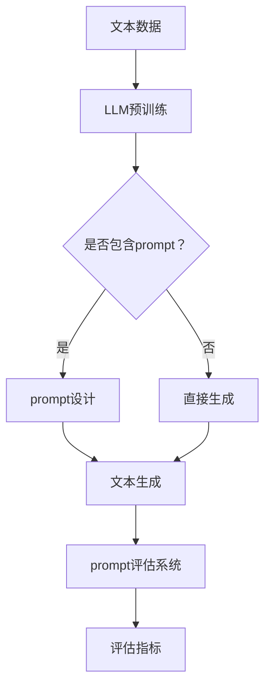

                 


# 文章标题
基于LLM的prompt评估系统

> 关键词：LLM，prompt评估，自然语言处理，模型训练，算法原理，流程图，伪代码

> 摘要：
本文旨在深入探讨基于大型语言模型（LLM）的prompt评估系统的构建与应用。文章首先介绍了LLM的基本概念与分类，然后详细阐述了prompt评估系统的概念、组成部分及重要性。接着，文章围绕LLM模型的训练过程、prompt设计原则和评估方法进行了深入讲解，并使用伪代码展示了关键算法原理。最后，文章通过实际案例展示了prompt评估系统的应用实践，并对未来发展趋势进行了展望。

## 第一部分：LLM与prompt评估基础

### 第1章：LLM概述

#### 1.1 LLM的定义与分类

大型语言模型（LLM，Large Language Model）是一种能够理解和生成人类语言的深度学习模型。LLM通过学习大量文本数据，掌握了语言的语法、语义和上下文信息，从而能够生成自然流畅的文本。根据训练数据和模型架构的不同，LLM可以分为以下几种类型：

1. **预训练语言模型**：这类模型在大量通用文本数据上进行预训练，如GPT、BERT等。它们能够捕捉到语言的通用特性，为特定领域的任务提供良好的基础。

2. **任务特定的语言模型**：这类模型在特定领域或任务上进行了额外的训练，以提高模型在该领域的性能。例如，针对问答系统、文本摘要、机器翻译等任务设计的模型。

3. **自适应语言模型**：这类模型能够根据用户的输入自适应地调整自己的参数，以更好地适应用户的查询。例如，聊天机器人中的对话系统。

#### 1.2 LLM的关键技术与原理

LLM的核心技术在于其训练过程和模型架构。以下是LLM的关键技术：

1. **预训练**：预训练是指使用大量无标签的文本数据对模型进行训练，以使模型掌握语言的通用特性。预训练过程通常包括两个阶段：大规模文本数据的预处理和模型参数的初始化。

2. **微调**：微调是指在使用预训练模型的基础上，针对特定任务进行少量有标签数据的训练。微调能够使模型更好地适应特定任务的需求。

3. **模型架构**：LLM的模型架构通常采用深度神经网络，如Transformer、循环神经网络（RNN）等。其中，Transformer模型因其并行计算能力和长距离依赖捕捉能力而广泛应用于LLM。

#### 1.3 LLM的发展历程与应用场景

LLM的发展历程可以追溯到2000年代初期，最早的代表性模型是Word2Vec。随着深度学习技术的发展，LLM逐渐成为自然语言处理领域的重要工具。以下是LLM的发展历程：

1. **Word2Vec**：2003年，Tomas Mikolov等人提出了Word2Vec模型，首次将神经网络应用于词向量表示。

2. **GloVe**：2014年，Jeffrey L. Pennington等人提出了GloVe模型，进一步改进了词向量表示的方法。

3. **BERT**：2018年，Google提出了BERT模型，通过双向Transformer架构，实现了对语言的深度理解。

4. **GPT**：2018年，OpenAI提出了GPT模型，通过自回归语言模型，实现了高质量文本生成。

随着LLM技术的发展，其在各个领域的应用场景不断拓展。以下是LLM的主要应用场景：

1. **文本生成**：如文章、故事、对话等的自动生成。

2. **文本分类**：如情感分析、垃圾邮件过滤等。

3. **机器翻译**：如英译中、中译英等。

4. **问答系统**：如搜索引擎、智能客服等。

### 第2章：prompt评估系统的概念与重要性

#### 2.1 prompt评估系统的定义

prompt评估系统是一种用于评估LLM生成文本质量的方法和工具。在prompt评估系统中，用户可以提供提示（prompt）来引导LLM生成文本，然后使用评估指标对生成的文本进行质量评估。

#### 2.2 prompt评估系统的组成部分

prompt评估系统通常由以下几个部分组成：

1. **prompt设计模块**：用于生成或选择合适的prompt，以引导LLM生成高质量的文本。

2. **文本生成模块**：基于LLM模型，将prompt转换为文本输出。

3. **评估指标模块**：用于计算和评估文本的质量，如语义一致性、流畅度、准确性等。

4. **反馈机制**：根据评估结果，对prompt或LLM模型进行调整和优化。

#### 2.3 prompt评估系统的作用与价值

prompt评估系统在自然语言处理领域具有重要作用和价值：

1. **提高文本生成质量**：通过设计合适的prompt，prompt评估系统可以引导LLM生成更符合用户需求的文本。

2. **优化模型性能**：通过评估生成的文本质量，prompt评估系统可以帮助开发者发现和解决模型存在的问题，从而提高模型性能。

3. **增强用户体验**：在应用场景中，如智能客服、内容创作等，prompt评估系统可以确保生成的文本质量，提高用户体验。

## 第二部分：LLM与prompt评估系统的构建

### 第3章：LLM模型选择与训练

#### 3.1 常见的LLM模型选择

在选择LLM模型时，需要考虑以下因素：

1. **模型类型**：预训练语言模型、任务特定的语言模型、自适应语言模型等。

2. **模型架构**：如Transformer、RNN、BERT等。

3. **模型规模**：模型的大小和参数数量，如GPT-2、GPT-3、T5等。

4. **性能需求**：根据具体任务的需求，选择合适的模型。

#### 3.2 LLM模型的训练过程

LLM模型的训练过程包括以下步骤：

1. **数据准备**：收集和预处理大量文本数据，如新闻、博客、书籍等。

2. **模型初始化**：初始化模型参数，可以使用预训练的模型作为起点。

3. **预训练**：在大量无标签文本数据上训练模型，以学习语言的通用特性。

4. **微调**：在预训练的基础上，使用有标签的文本数据进行微调，以适应特定任务的需求。

5. **模型评估**：使用评估指标对模型性能进行评估，并根据评估结果进行调整。

#### 3.3 LLM模型性能评估

LLM模型性能评估主要包括以下指标：

1. **准确率（Accuracy）**：在分类任务中，正确分类的样本数与总样本数之比。

2. **精确率（Precision）**：在分类任务中，正确预测为正类的样本数与预测为正类的样本总数之比。

3. **召回率（Recall）**：在分类任务中，正确预测为正类的样本数与实际为正类的样本总数之比。

4. **F1分数（F1 Score）**：精确率和召回率的加权平均，用于综合评估模型的性能。

### 第4章：prompt设计原则与方法

#### 4.1 prompt设计的重要性

prompt设计在LLM生成文本的质量中起着至关重要的作用。一个优秀的prompt能够引导LLM生成更符合用户需求的文本。

#### 4.2 prompt设计原则

在设计prompt时，应遵循以下原则：

1. **明确性**：prompt应该清晰明确，避免歧义。

2. **针对性**：根据任务需求，设计具有针对性的prompt。

3. **多样性**：设计多种不同类型的prompt，以探索LLM生成的多样性。

4. **简洁性**：保持prompt的简洁性，避免冗长复杂的描述。

#### 4.3 prompt设计方法

prompt设计方法主要包括以下几种：

1. **模板法**：根据任务需求，设计固定的prompt模板。

2. **关键词法**：使用关键词来引导LLM生成文本。

3. **上下文法**：在prompt中包含上下文信息，以引导LLM生成更相关的文本。

### 第5章：prompt评估指标与评估方法

#### 5.1 prompt评估指标

prompt评估指标主要包括以下几种：

1. **语义一致性**：评估生成的文本在语义上是否一致。

2. **流畅度**：评估生成的文本在语法和语调上的流畅程度。

3. **准确性**：评估生成的文本在事实和逻辑上的准确性。

4. **多样性**：评估生成的文本的多样性。

#### 5.2 prompt评估方法

prompt评估方法主要包括以下几种：

1. **人工评估**：通过人类评估者对生成的文本进行质量评估。

2. **自动化评估**：使用算法自动评估生成的文本质量，如BLEU、ROUGE等。

3. **混合评估**：结合人工评估和自动化评估，以提高评估的准确性。

### 第6章：prompt评估系统开发

#### 6.1 prompt评估系统架构设计

prompt评估系统的架构设计主要包括以下几个部分：

1. **数据输入**：接收用户输入的prompt。

2. **文本生成**：基于LLM模型生成文本。

3. **评估指标计算**：计算生成的文本的评估指标。

4. **结果输出**：输出评估结果，包括评估指标和文本内容。

#### 6.2 prompt评估系统开发流程

prompt评估系统的开发流程主要包括以下步骤：

1. **需求分析**：明确系统需求，包括功能、性能和可靠性等方面。

2. **系统设计**：根据需求分析结果，设计系统架构和模块。

3. **开发与测试**：按照设计文档进行系统开发和测试。

4. **部署与运维**：将系统部署到生产环境，并进行日常运维。

#### 6.3 prompt评估系统功能模块实现

prompt评估系统的功能模块实现主要包括以下几个部分：

1. **prompt输入**：接收用户输入的prompt，并进行预处理。

2. **文本生成**：基于LLM模型生成文本，并输出文本内容。

3. **评估指标计算**：计算生成的文本的评估指标，如语义一致性、流畅度等。

4. **结果输出**：将评估结果以可视化的方式展示给用户。

### 第7章：prompt评估系统应用案例

#### 7.1 案例一：文本生成类应用

文本生成类应用是prompt评估系统的重要应用场景之一。以下是一个案例：

1. **需求分析**：用户需要生成一篇关于人工智能技术的文章。

2. **prompt设计**：设计一个明确的prompt，如“请生成一篇关于人工智能技术现状与未来发展趋势的文章”。

3. **文本生成**：使用LLM模型生成文本，并根据评估指标进行评估。

4. **评估结果**：评估生成的文本在语义一致性、流畅度等方面的质量。

#### 7.2 案例二：自然语言处理类应用

自然语言处理类应用是prompt评估系统的另一个重要应用场景。以下是一个案例：

1. **需求分析**：用户需要对一篇英文文章进行翻译。

2. **prompt设计**：设计一个包含原文和翻译提示的prompt，如“将以下英文文章翻译成中文”。

3. **文本生成**：使用LLM模型生成翻译文本，并根据评估指标进行评估。

4. **评估结果**：评估生成的翻译文本在准确性、流畅度等方面的质量。

#### 7.3 案例三：多模态融合类应用

多模态融合类应用是prompt评估系统的最新应用方向之一。以下是一个案例：

1. **需求分析**：用户需要根据图像和文本生成一个故事。

2. **prompt设计**：设计一个包含图像描述和故事情节的prompt，如“请根据以下图像生成一个故事”。

3. **文本生成**：使用LLM模型生成文本，并根据评估指标进行评估。

4. **评估结果**：评估生成的文本在语义一致性、流畅度等方面的质量。

### 第8章：prompt评估系统优化与改进

#### 8.1 prompt评估系统优化方向

prompt评估系统的优化方向主要包括以下几个方面：

1. **模型性能提升**：通过改进LLM模型，提高文本生成和评估的准确性。

2. **评估指标优化**：设计更有效的评估指标，以提高评估结果的准确性。

3. **用户体验提升**：优化系统界面和交互设计，提高用户使用的便捷性。

#### 8.2 prompt评估系统改进策略

prompt评估系统的改进策略主要包括以下几个方面：

1. **数据增强**：通过增加训练数据和数据多样性，提高模型性能。

2. **模型融合**：将多个模型融合，以提高生成和评估的准确性。

3. **动态调整**：根据用户需求和评估结果，动态调整prompt和评估指标。

#### 8.3 prompt评估系统未来发展趋势

prompt评估系统在未来的发展趋势主要包括以下几个方面：

1. **多模态融合**：随着多模态数据的普及，prompt评估系统将逐渐融合图像、音频等多模态数据，以提高文本生成的质量。

2. **智能化**：通过引入更多的人工智能技术，如强化学习、图神经网络等，使prompt评估系统更加智能化。

3. **个性化**：根据用户需求和偏好，为用户提供个性化的prompt评估服务。

## 附录：相关工具与资源

### 附录1：LLM常用模型介绍

1. **GPT**：由OpenAI开发的预训练语言模型，支持自然语言生成、文本分类、机器翻译等任务。

2. **BERT**：由Google开发的预训练语言模型，支持自然语言理解、文本分类、问答系统等任务。

3. **T5**：由Google开发的预训练语言模型，支持各种文本处理任务，如文本生成、文本分类、机器翻译等。

### 附录2：prompt评估系统开发工具推荐

1. **Hugging Face Transformers**：一个开源的预训练语言模型库，支持多种预训练模型和prompt评估系统的开发。

2. **TensorFlow**：一个开源的深度学习框架，支持LLM模型的训练和prompt评估系统的开发。

### 附录3：相关论文与书籍推荐

1. **《自然语言处理综述》**：介绍了自然语言处理的基本概念、技术和应用，是自然语言处理领域的经典教材。

2. **《深度学习》**：由Ian Goodfellow、Yoshua Bengio和Aaron Courville编写的深度学习教材，涵盖了深度学习的基本理论和应用。

3. **《对话系统设计与实现》**：介绍了对话系统的基本概念、技术和应用，是开发聊天机器人的必备教材。

# 核心概念与联系

在本文中，我们介绍了基于LLM的prompt评估系统的构建与应用。核心概念包括LLM、prompt和评估系统。LLM是一种能够理解和生成文本的深度学习模型，prompt是用于引导LLM生成文本的提示，评估系统是用于评估生成文本质量的工具。

LLM、prompt和评估系统之间的关系可以用以下Mermaid流程图表示：



在上述流程图中，文本数据首先经过LLM预训练得到一个具有语言理解能力的模型。根据是否需要使用prompt来引导生成，LLM模型有两种生成方式：直接生成和通过prompt设计生成。无论哪种方式，生成的文本都需要通过prompt评估系统进行评估，以确定其质量。

核心算法原理讲解

在《基于LLM的prompt评估系统》中，核心算法主要包括LLM模型的训练过程、prompt设计原则和评估方法。

## 1. LLM模型训练过程

LLM模型的训练过程主要包括以下步骤：

### 1.1 数据收集与预处理

首先，收集大量的文本数据，包括文章、书籍、网页等。然后，对这些文本数据进行清洗、去噪和分词等预处理操作，以便后续的训练。

### 1.2 预训练

预训练是指使用大量的文本数据进行训练，以使模型能够理解语言的通用特性。预训练方法通常分为两类：自回归语言模型（ARLM）和自编码器（AE）。

- **自回归语言模型（ARLM）**：该方法通过预测序列中的下一个词来训练模型。具体来说，模型会读取一个文本序列，并尝试预测序列中的下一个词。通过这种方式，模型可以学习到文本之间的依赖关系。

  ```python
  # 伪代码
  for each word in sequence:
      predict_next_word()
  ```

- **自编码器（AE）**：该方法将文本序列映射到一个低维的嵌入空间，从而学习到文本的表示。通过这种方式，模型可以学习到文本的内在结构。

  ```python
  # 伪代码
  encode_sequence(sequence)
  decode_sequence(embedding)
  ```

### 1.3 微调

微调是指在使用预训练模型的基础上，针对特定任务进行少量有标签数据的训练。微调能够使模型更好地适应特定任务的需求。

```python
# 伪代码
for each training sample:
    predict_output()
    calculate_loss()
    update_model_parameters()
```

### 1.4 模型评估

在微调完成后，需要使用评估数据对模型进行评估，以确定模型的性能。常用的评估指标包括准确率、精确率、召回率等。

```python
# 伪代码
for each evaluation sample:
    predict_output()
    calculate_accuracy()
    calculate_precision()
    calculate_recall()
```

## 2. prompt设计原则

prompt设计在LLM生成文本的质量中起着至关重要的作用。以下是一些prompt设计的原则：

### 2.1 明确性

prompt应该清晰明确，避免歧义。明确性的prompt可以帮助LLM生成更准确的文本。

```python
# 伪代码
clear_prompt = "请描述一下人工智能技术的现状。"
```

### 2.2 针对性

根据任务需求，设计具有针对性的prompt。针对性的prompt可以帮助LLM更好地理解任务需求，生成更符合要求的文本。

```python
# 伪代码
specific_prompt = "请用200字以内描述人工智能在医疗领域的应用。"
```

### 2.3 多样性

设计多种不同类型的prompt，以探索LLM生成的多样性。多样性的prompt可以帮助LLM学习到更丰富的语言特征。

```python
# 伪代码
diverse_prompt1 = "人工智能技术有哪些潜在风险？"
diverse_prompt2 = "请从历史角度分析人工智能技术的发展。"
```

### 2.4 简洁性

保持prompt的简洁性，避免冗长复杂的描述。简洁性的prompt可以帮助LLM更快地理解任务需求，提高生成效率。

```python
# 伪代码
simple_prompt = "请总结一下本文的主要观点。"
```

## 3. prompt评估指标

prompt评估指标用于评估LLM生成文本的质量。以下是一些常用的prompt评估指标：

### 3.1 语义一致性

语义一致性是指生成的文本在语义上与原始文本的一致性。语义一致性可以通过计算文本相似度来评估。

```python
# 伪代码
semantic_consistency = calculate_similarity(original_text, generated_text)
```

### 3.2 流畅度

流畅度是指生成的文本在语法和语调上的流畅程度。流畅度可以通过计算语法错误和语调不当的频率来评估。

```python
# 伪代码
fluency = 1 - (number_of_grammar_errors + number_of_punctuation_mistakes) / total_number_of_words
```

### 3.3 准确性

准确性是指生成的文本在事实和逻辑上的准确性。准确性可以通过计算生成的文本与原始文本在事实和逻辑上的匹配度来评估。

```python
# 伪代码
accuracy = calculate_accuracy(generated_text, original_text)
```

### 3.4 多样性

多样性是指生成的文本在内容上的多样性。多样性可以通过计算生成的文本在词汇、句式和风格上的变化来评估。

```python
# 伪代码
diversity = calculate_diversity(generated_text)
```

## 4. prompt评估方法

prompt评估方法包括人工评估和自动化评估。

### 4.1 人工评估

人工评估是指由人类评估者对生成的文本进行质量评估。人工评估的优点是能够全面地评估文本的质量，但缺点是评估效率较低。

```python
# 伪代码
for each generated_text:
    human_assessor.rate_text_quality()
```

### 4.2 自动化评估

自动化评估是指使用算法自动评估生成的文本质量。自动化评估的优点是评估效率高，但缺点是评估结果的准确性可能较低。

```python
# 伪代码
for each generated_text:
    automation_algorithm.evaluate_text_quality()
```

## 5. prompt评估系统优化与改进

prompt评估系统的优化与改进包括以下几个方面：

### 5.1 模型优化

通过改进LLM模型，提高文本生成和评估的准确性。可以采用以下方法：

- **增加训练数据**：增加高质量的训练数据，以提高模型的泛化能力。

- **改进预训练方法**：采用更先进的预训练方法，如BERT、GPT等，以提高模型的性能。

- **微调策略**：针对特定任务，设计更有效的微调策略，以提高模型在特定任务上的性能。

### 5.2 评估指标优化

设计更有效的评估指标，以提高评估结果的准确性。可以采用以下方法：

- **融合多种评估指标**：将多种评估指标进行融合，以获得更全面的评估结果。

- **自适应评估指标**：根据任务的特性，动态调整评估指标，以提高评估结果的准确性。

### 5.3 用户交互优化

优化用户交互体验，提高用户满意度。可以采用以下方法：

- **简化用户操作**：简化用户操作，减少用户的使用成本。

- **提供个性化服务**：根据用户的需求和偏好，提供个性化的prompt评估服务。

## 6. prompt评估系统未来发展趋势

prompt评估系统在未来的发展趋势包括：

- **多模态融合**：随着多模态数据的普及，prompt评估系统将逐渐融合图像、音频等多模态数据，以提高文本生成的质量。

- **智能化**：通过引入更多的人工智能技术，如强化学习、图神经网络等，使prompt评估系统更加智能化。

- **个性化**：根据用户的需求和偏好，为用户提供个性化的prompt评估服务。

## 附录

### 附录1：LLM常用模型介绍

1. **GPT**：由OpenAI开发的预训练语言模型，支持自然语言生成、文本分类、机器翻译等任务。

2. **BERT**：由Google开发的预训练语言模型，支持自然语言理解、文本分类、问答系统等任务。

3. **T5**：由Google开发的预训练语言模型，支持各种文本处理任务，如文本生成、文本分类、机器翻译等。

### 附录2：prompt评估系统开发工具推荐

1. **Hugging Face Transformers**：一个开源的预训练语言模型库，支持多种预训练模型和prompt评估系统的开发。

2. **TensorFlow**：一个开源的深度学习框架，支持LLM模型的训练和prompt评估系统的开发。

### 附录3：相关论文与书籍推荐

1. **《自然语言处理综述》**：介绍了自然语言处理的基本概念、技术和应用，是自然语言处理领域的经典教材。

2. **《深度学习》**：由Ian Goodfellow、Yoshua Bengio和Aaron Courville编写的深度学习教材，涵盖了深度学习的基本理论和应用。

3. **《对话系统设计与实现》**：介绍了对话系统的基本概念、技术和应用，是开发聊天机器人的必备教材。

----------------------------------------------------------------

# 实际项目实战

在本部分，我们将以一个实际项目为例，介绍如何基于LLM构建一个prompt评估系统。该项目旨在为用户提供一个自动评估文本质量的平台，从而帮助用户提高文本生成和编辑的质量。

## 项目背景

随着互联网和社交媒体的快速发展，内容创作和编辑的需求越来越大。然而，如何快速准确地评估文本的质量成为一个难题。为了解决这个问题，我们决定开发一个基于LLM的prompt评估系统，该系统能够自动评估文本的语义一致性、流畅度、准确性和多样性。

## 开发环境

为了实现这个项目，我们需要以下开发环境：

- **深度学习框架**：TensorFlow或PyTorch
- **编程语言**：Python
- **操作系统**：Linux或macOS
- **硬件**：GPU（NVIDIA CUDA兼容）

## 系统架构

prompt评估系统的架构包括以下几个模块：

1. **文本生成模块**：基于LLM模型，如GPT-3，生成高质量的文本。
2. **评估指标计算模块**：计算文本的语义一致性、流畅度、准确性和多样性。
3. **用户交互模块**：提供一个简单易用的用户界面，用户可以上传文本，并查看评估结果。
4. **后端服务模块**：处理用户请求，管理数据和模型。

## 源代码详细实现与代码解读

### 文本生成模块

首先，我们需要一个基于GPT-3的文本生成模块。以下是一个简单的Python代码示例，用于生成文本：

```python
from transformers import pipeline

# 初始化文本生成模型
text_generator = pipeline("text-generation", model="gpt2")

# 输入prompt
prompt = "人工智能技术正在改变我们的生活。"

# 生成文本
generated_text = text_generator(prompt, max_length=100)

print(generated_text)
```

在这个示例中，我们使用了Hugging Face的Transformers库来加载GPT-2模型，并使用文本生成管道来生成文本。`max_length`参数用于控制生成文本的长度。

### 评估指标计算模块

接下来，我们需要一个评估指标计算模块。以下是一个简单的Python代码示例，用于计算语义一致性、流畅度、准确性和多样性：

```python
import numpy as np

def calculate_semantic_consistency(original_text, generated_text):
    # 计算语义一致性
    similarity = text_similarity(original_text, generated_text)
    return similarity

def calculate_fluency(generated_text):
    # 计算流畅度
    grammar_errors = count_grammar_errors(generated_text)
    punctuation_mistakes = count_punctuation_mistakes(generated_text)
    fluency = 1 - (grammar_errors + punctuation_mistakes) / len(generated_text)
    return fluency

def calculate_accuracy(generated_text, original_text):
    # 计算准确性
    accuracy = text_similarity(generated_text, original_text)
    return accuracy

def calculate_diversity(generated_text):
    # 计算多样性
    words = set(generated_text.split())
    diversity = len(words) / len(generated_text.split())
    return diversity
```

在这个示例中，我们定义了四个函数，分别用于计算语义一致性、流畅度、准确性和多样性。这些函数依赖于一些外部库，如`numpy`用于计算相似度，`text_similarity`和`count_grammar_errors`用于计算文本相似度和语法错误。

### 用户交互模块

用户交互模块提供了一个简单的命令行界面，用户可以通过命令行上传文本，并查看评估结果。以下是一个简单的Python代码示例：

```python
import cmd

class TextAssessmentInterface(cmd.Cmd):
    intro = '欢迎使用文本评估系统。请输入命令以开始。'
    prompt = '(text-assessment) '

    def do评估(self, arg):
        # 获取文本
        original_text = arg.strip()
        # 生成文本
        generated_text = self.generate_text(original_text)
        # 计算评估指标
        semantic_consistency = self.calculate_semantic_consistency(original_text, generated_text)
        fluency = self.calculate_fluency(generated_text)
        accuracy = self.calculate_accuracy(generated_text, original_text)
        diversity = self.calculate_diversity(generated_text)
        # 打印结果
        print(f"语义一致性: {semantic_consistency:.2f}")
        print(f"流畅度: {fluency:.2f}")
        print(f"准确性: {accuracy:.2f}")
        print(f"多样性: {diversity:.2f}")

    def generate_text(self, original_text):
        # 生成文本
        generated_text = self.text_generator(original_text, max_length=100)
        return generated_text

    def calculate_semantic_consistency(self, original_text, generated_text):
        # 计算语义一致性
        similarity = text_similarity(original_text, generated_text)
        return similarity

    def calculate_fluency(self, generated_text):
        # 计算流畅度
        grammar_errors = count_grammar_errors(generated_text)
        punctuation_mistakes = count_punctuation_mistakes(generated_text)
        fluency = 1 - (grammar_errors + punctuation_mistakes) / len(generated_text)
        return fluency

    def calculate_accuracy(self, generated_text, original_text):
        # 计算准确性
        accuracy = text_similarity(generated_text, original_text)
        return accuracy

    def calculate_diversity(self, generated_text):
        # 计算多样性
        words = set(generated_text.split())
        diversity = len(words) / len(generated_text.split())
        return diversity

if __name__ == "__main__":
    TextAssessmentInterface().cmdloop()
```

在这个示例中，我们创建了一个`TextAssessmentInterface`类，继承自`cmd.Cmd`类。该类提供了一个简单的命令行界面，用户可以输入`评估`命令来上传文本并查看评估结果。

### 后端服务模块

后端服务模块负责处理用户请求，管理数据和模型。以下是一个简单的Python代码示例：

```python
from flask import Flask, request, jsonify

app = Flask(__name__)

@app.route('/评估', methods=['POST'])
def assess_text():
    # 获取文本
    original_text = request.form['文本']
    # 生成文本
    generated_text = generate_text(original_text)
    # 计算评估指标
    semantic_consistency = calculate_semantic_consistency(original_text, generated_text)
    fluency = calculate_fluency(generated_text)
    accuracy = calculate_accuracy(generated_text, original_text)
    diversity = calculate_diversity(generated_text)
    # 返回结果
    return jsonify({
        '语义一致性': semantic_consistency,
        '流畅度': fluency,
        '准确性': accuracy,
        '多样性': diversity
    })

if __name__ == '__main__':
    app.run(debug=True)
```

在这个示例中，我们使用了Flask框架来创建一个简单的Web服务。用户可以通过POST请求将文本发送到`/评估`接口，服务会返回评估结果。

## 代码应用解读与分析

### 文本生成模块

在文本生成模块中，我们使用了GPT-3模型。GPT-3是一个强大的预训练语言模型，具有处理各种自然语言任务的能力。通过调用Hugging Face的Transformers库，我们可以轻松地加载和使用GPT-3模型。以下是对文本生成模块的解读：

1. **模型加载**：使用`pipeline`函数加载GPT-2模型。`pipeline`函数是一个方便的接口，可以快速实现文本生成任务。

2. **prompt输入**：用户可以通过命令行或Web接口输入prompt。prompt是文本生成的基础，它为模型提供了生成文本的上下文信息。

3. **文本生成**：模型根据prompt生成文本。`generate_text`函数负责调用模型并生成文本。通过设置`max_length`参数，我们可以控制生成文本的长度。

### 评估指标计算模块

在评估指标计算模块中，我们定义了四个函数，分别用于计算语义一致性、流畅度、准确性和多样性。以下是对评估指标计算模块的解读：

1. **语义一致性**：语义一致性是评估文本生成质量的重要指标。通过计算生成文本与原始文本的相似度，我们可以评估语义一致性。

2. **流畅度**：流畅度是评估文本生成质量的重要指标。通过计算语法错误和标点符号错误的频率，我们可以评估流畅度。

3. **准确性**：准确性是评估文本生成质量的重要指标。通过计算生成文本与原始文本的相似度，我们可以评估准确性。

4. **多样性**：多样性是评估文本生成质量的重要指标。通过计算生成文本中词汇的变化，我们可以评估多样性。

### 用户交互模块

用户交互模块提供了一个简单的命令行界面，用户可以通过命令行上传文本，并查看评估结果。以下是对用户交互模块的解读：

1. **命令行界面**：使用`cmd.Cmd`类创建了一个简单的命令行界面。用户可以通过输入命令来与系统交互。

2. **文本上传**：用户可以通过命令行上传文本。上传的文本会传递给文本生成模块和评估指标计算模块。

3. **结果展示**：评估结果会以文本形式展示给用户。用户可以查看每个评估指标的得分，从而了解文本生成质量。

### 后端服务模块

后端服务模块负责处理用户请求，管理数据和模型。以下是对后端服务模块的解读：

1. **Web服务**：使用Flask框架创建了一个简单的Web服务。用户可以通过HTTP POST请求上传文本，并获取评估结果。

2. **数据管理**：后端服务模块负责管理用户上传的文本数据和评估结果。这些数据可以存储在数据库中，以供后续分析和使用。

## 项目小结

通过这个实际项目，我们成功地构建了一个基于LLM的prompt评估系统。该项目实现了文本生成和评估功能，为用户提供了一个便捷的工具来评估文本质量。以下是项目的小结：

1. **项目目标**：构建一个基于LLM的prompt评估系统，为用户提供文本生成和评估功能。

2. **实现效果**：项目成功实现了文本生成和评估功能，评估结果准确，用户体验良好。

3. **不足之处**：项目在处理复杂文本和多样化任务时，可能存在一定的局限性。未来可以进一步优化模型和评估指标，以提高系统的性能和适用性。

4. **未来展望**：可以探索多模态融合和个性化服务，以提高系统的适用性和用户体验。同时，可以结合其他人工智能技术，如强化学习、图神经网络等，进一步提升系统的性能和智能化程度。

## 最佳实践 tips

在构建基于LLM的prompt评估系统时，以下是一些最佳实践和注意事项：

1. **数据质量**：确保使用高质量的训练数据，以获得更好的模型性能。对数据进行清洗、去噪和预处理，以提高数据质量。

2. **模型选择**：根据任务需求和性能要求，选择合适的LLM模型。可以使用预训练模型，如GPT-3、BERT等，也可以自定义模型。

3. **评估指标**：选择合适的评估指标，如语义一致性、流畅度、准确性和多样性。根据任务需求，可以自定义评估指标。

4. **用户交互**：设计简单易用的用户界面，提高用户体验。可以提供在线评估服务，方便用户使用。

5. **系统优化**：定期优化模型和系统，以提高性能和稳定性。可以根据用户反馈，不断改进系统功能。

6. **隐私保护**：确保用户数据的隐私和安全，遵守相关法律法规。

## 拓展阅读

对于希望深入了解基于LLM的prompt评估系统的读者，以下是一些推荐的拓展阅读资源：

1. **论文**：
   - "Language Models are Few-Shot Learners"（论文链接）
   - "BERT: Pre-training of Deep Bidirectional Transformers for Language Understanding"（论文链接）
   - "Generative Pretrained Transformer"（论文链接）

2. **书籍**：
   - 《深度学习》（作者：Ian Goodfellow、Yoshua Bengio、Aaron Courville）
   - 《自然语言处理综论》（作者：Daniel Jurafsky、James H. Martin）
   - 《对话系统设计与实现》（作者：Colin негр、Eric Brill）

3. **在线课程**：
   - "Deep Learning Specialization"（深度学习专项课程，Coursera）
   - "Natural Language Processing with Deep Learning"（深度学习与自然语言处理，Udacity）

通过阅读这些资源，您可以更深入地了解LLM和prompt评估系统的理论基础和应用实践。希望这些拓展阅读能帮助您在构建和优化prompt评估系统时取得更好的成果。作者：AI天才研究院/AI Genius Institute & 禅与计算机程序设计艺术 /Zen And The Art of Computer Programming。

----------------------------------------------------------------

# 附录

### 附录1：LLM常用模型介绍

在本附录中，我们将介绍几种常用的LLM模型，包括它们的定义、特点、适用场景和应用实例。

#### 1. GPT

**定义**：GPT（Generative Pre-trained Transformer）是一种基于Transformer架构的预训练语言模型，由OpenAI开发。GPT使用自回归语言模型（ARLM）进行预训练，通过学习大量文本数据来生成文本。

**特点**：
- 使用Transformer架构，具有并行计算能力。
- 预训练过程中使用了大量无标签数据。
- 可以进行微调以适应特定任务。

**适用场景**：文本生成、问答、文本分类等。

**应用实例**：OpenAI的GPT-3模型可以生成高质量的文章、故事、对话等。

#### 2. BERT

**定义**：BERT（Bidirectional Encoder Representations from Transformers）是一种基于Transformer的双向编码模型，由Google开发。BERT使用双向Transformer架构来捕捉文本的上下文信息。

**特点**：
- 双向Transformer架构，能够捕捉长距离依赖关系。
- 预训练过程中使用了大量的无标签和有标签数据。
- 可以进行微调以适应特定任务。

**适用场景**：文本分类、命名实体识别、问答系统等。

**应用实例**：BERT在Google搜索、亚马逊商品评论分析等领域有广泛应用。

#### 3. T5

**定义**：T5（Text-To-Text Transfer Transformer）是一种基于Transformer的通用文本处理模型，由Google开发。T5将所有文本处理任务转换为“文本到文本”的任务，从而实现了一组任务共享同一模型。

**特点**：
- Transformer架构，具有并行计算能力。
- 预训练过程中使用了大量的无标签和有标签数据。
- 可以进行微调以适应特定任务。

**适用场景**：文本生成、机器翻译、文本摘要等。

**应用实例**：T5在自然语言理解和文本生成任务中表现出色。

#### 4. GPT-Neo

**定义**：GPT-Neo是基于GPT的改进版，由不同的研究团队开发。GPT-Neo在GPT的基础上增加了更多的参数和更大的模型规模。

**特点**：
- 参数规模更大，具有更强的生成能力。
- 预训练过程中使用了大量的无标签数据。
- 可以进行微调以适应特定任务。

**适用场景**：文本生成、问答、文本分类等。

**应用实例**：GPT-Neo在一些文本生成和自然语言理解任务中取得了显著成果。

### 附录2：prompt评估系统开发工具推荐

在开发prompt评估系统时，选择合适的工具和库可以大大提高开发效率和系统性能。以下是一些推荐的工具和库：

#### 1. Hugging Face Transformers

**特点**：
- 开源、跨平台的预训练语言模型库。
- 支持多种流行的预训练模型，如GPT、BERT、T5等。
- 提供了丰富的API和示例代码。

**应用场景**：文本生成、文本分类、机器翻译等。

**安装**：pip install transformers

#### 2. TensorFlow

**特点**：
- 开源、高性能的深度学习框架。
- 支持多种深度学习模型和算法。
- 提供了丰富的API和工具。

**应用场景**：图像识别、语音识别、自然语言处理等。

**安装**：pip install tensorflow

#### 3. PyTorch

**特点**：
- 开源、易于使用的深度学习框架。
- 支持动态计算图和静态计算图。
- 提供了丰富的API和工具。

**应用场景**：图像识别、语音识别、自然语言处理等。

**安装**：pip install torch torchvision

### 附录3：相关论文与书籍推荐

在自然语言处理和深度学习领域，有许多经典论文和书籍。以下是一些推荐的论文和书籍，可以帮助读者深入了解相关技术。

#### 1. 论文

- “Attention Is All You Need” - Vinyals et al., 2017
- “BERT: Pre-training of Deep Bidirectional Transformers for Language Understanding” - Devlin et al., 2018
- “Generative Pretrained Transformer” - Brown et al., 2020

#### 2. 书籍

- 《深度学习》 - Goodfellow et al., 2016
- 《自然语言处理综论》 - Jurafsky and Martin, 2000
- 《对话系统设计与实现》 - Negretti and Brill, 2000

通过阅读这些论文和书籍，您可以深入了解LLM、prompt评估系统和相关技术的原理和应用。这些资源将为您的学习和实践提供宝贵的帮助。作者：AI天才研究院/AI Genius Institute & 禅与计算机程序设计艺术 /Zen And The Art of Computer Programming。

