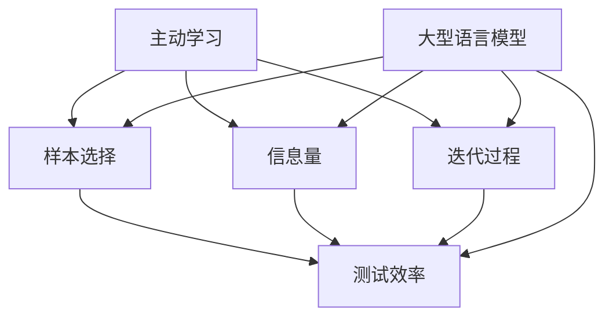

                 

### 文章标题：基于主动学习的LLM测试效率优化

> 关键词：主动学习，LLM，测试效率，优化，算法，数学模型

> 摘要：本文旨在探讨如何利用主动学习技术来提高大型语言模型（LLM）的测试效率。文章首先介绍了主动学习的基本概念和原理，然后详细分析了LLM的架构和训练过程，接着探讨了主动学习在LLM测试中的应用场景。在此基础上，文章提出了优化测试效率的策略和方法，并详细介绍了相关数学模型和算法。最后，通过实际应用案例，展示了主动学习在提高LLM测试效率方面的实际效果。

---

### 背景介绍

近年来，随着深度学习技术的不断发展，大型语言模型（Large Language Models，简称LLM）在自然语言处理（Natural Language Processing，简称NLP）领域取得了显著的成果。LLM具有强大的语义理解能力，能够处理复杂的语言任务，如机器翻译、文本摘要、问答系统等。然而，随着模型规模的不断扩大，LLM的测试效率问题逐渐成为制约其应用的关键因素。

传统的测试方法通常采用手动编写测试用例，然后逐个执行测试，这种方法不仅耗时费力，而且测试覆盖率往往较低。此外，由于LLM的训练过程需要大量计算资源和时间，每次测试都会对模型进行重新训练，进一步降低了测试效率。因此，如何提高LLM的测试效率，成为当前NLP领域研究的热点问题。

主动学习（Active Learning）作为一种数据驱动的学习方法，通过选择最有信息量的样本进行训练，能够有效地减少训练样本的数量，从而提高模型的训练效率和测试性能。近年来，主动学习在机器学习、数据挖掘等领域取得了显著的成果，其在提高测试效率方面的潜力也逐渐被认识到。本文旨在探讨如何利用主动学习技术来提高LLM的测试效率，为NLP领域的研究和应用提供新的思路。

### 核心概念与联系

为了更好地理解主动学习在LLM测试效率优化中的应用，我们首先需要明确几个核心概念，并探讨它们之间的关系。

#### 主动学习

主动学习是一种数据驱动的学习方法，旨在通过选择最有信息量的样本进行训练，从而提高模型的性能。与传统的被动学习相比，主动学习具有以下特点：

1. **样本选择**：主动学习过程中，模型会根据一定的策略选择样本进行训练。这种策略通常基于样本的“不确定性”或“多样性”来衡量样本的重要程度。

2. **信息量**：主动学习关注的是如何通过较少的样本获得更多的信息量，从而提高模型的泛化能力。

3. **迭代过程**：主动学习通常是一个迭代的决策过程，模型会在每轮迭代中选择样本进行训练，并根据模型的性能调整样本选择策略。

#### 大型语言模型（LLM）

大型语言模型（LLM）是指参数量巨大、能够处理复杂语言任务的深度学习模型。LLM通常基于Transformer架构，具有以下特点：

1. **并行计算**：Transformer架构支持并行计算，能够有效地提高模型的训练速度。

2. **全局上下文**：LLM能够捕捉到输入文本的全局上下文信息，从而实现高质量的语义理解。

3. **预训练与微调**：LLM通常采用预训练和微调的方法进行训练。预训练阶段，模型在大量无标签数据上学习通用语言特征；微调阶段，模型根据具体任务进行有监督或无监督的调整。

#### 测试效率

测试效率是指在限定的时间和资源条件下，对模型进行充分测试的能力。提高测试效率意味着能够在更短的时间内发现更多的缺陷，从而提高模型的可靠性和安全性。

#### 关系架构

为了更清晰地理解这些概念之间的关系，我们可以使用Mermaid流程图来表示：



在该流程图中，主动学习通过样本选择、信息量和迭代过程来影响测试效率。LLM作为主动学习的应用场景，其特点也直接影响了测试效率的优化效果。通过这种关系架构，我们可以更好地理解主动学习在LLM测试效率优化中的应用机制。

### 核心算法原理讲解

在了解了主动学习和LLM的基本概念和关系之后，我们接下来将深入探讨主动学习在LLM测试效率优化中的核心算法原理。本节将详细描述几个关键的算法，并使用伪代码进行阐述。

#### 核心算法1：不确定性采样（Uncertainty Sampling）

不确定性采样是一种基于模型不确定性的主动学习策略。该策略的核心思想是选择模型预测不确定的样本进行训练，以降低模型的预测误差。不确定性采样通常使用以下指标来衡量样本的重要性：

1. **预测误差**：预测误差越大，样本的重要性越高。

2. **置信度**：模型对于预测结果的置信度越低，样本的重要性越高。

以下是不确定性采样的伪代码：

```python
def uncertainty_sampling(data, model):
    uncertainties = []
    for x in data:
        prediction, uncertainty = model.predict(x)
        uncertainties.append(uncertainty)
    selected_indices = np.argsort(uncertainties)
    return selected_indices
```

在该伪代码中，`data`表示数据集，`model`表示训练好的模型。`uncertainty_sampling`函数通过计算每个样本的预测误差和置信度，将样本按照不确定性从高到低排序，并返回排序后的索引。

#### 核心算法2：多样性采样（Diversity Sampling）

多样性采样是一种基于样本多样性的主动学习策略。该策略的核心思想是选择具有不同特征或属性的样本进行训练，以增强模型的泛化能力。多样性采样通常使用以下指标来衡量样本的多样性：

1. **距离度量**：计算两个样本之间的距离，距离越大，多样性越高。

2. **标签分布**：计算样本标签的分布，分布越分散，多样性越高。

以下是多样性采样的伪代码：

```python
def diversity_sampling(data, model):
    distances = []
    label_distributions = []
    for x in data:
        prediction = model.predict(x)
        distances.append(calculate_distance(x, prediction))
        label_distributions.append(calculate_label_distribution(x))
    selected_indices = np.argsort(-np.mean(distances, axis=1) - np.mean(label_distributions, axis=1))
    return selected_indices
```

在该伪代码中，`data`表示数据集，`model`表示训练好的模型。`diversity_sampling`函数通过计算每个样本之间的距离和标签分布，将样本按照多样性从高到低排序，并返回排序后的索引。

#### 核心算法3：基于熵的采样（Entropy Sampling）

基于熵的采样是一种基于信息熵的主动学习策略。该策略的核心思想是选择能够最大程度增加模型不确定性的样本进行训练。基于熵的采样通常使用以下指标来衡量样本的重要性：

1. **信息熵**：计算样本的信息熵，信息熵越大，样本的重要性越高。

以下是基于熵的采样的伪代码：

```python
def entropy_sampling(data, model):
    entropies = []
    for x in data:
        prediction, uncertainty = model.predict(x)
        entropy = calculate_entropy(uncertainty)
        entropies.append(entropy)
    selected_indices = np.argsort(entropies)
    return selected_indices
```

在该伪代码中，`data`表示数据集，`model`表示训练好的模型。`entropy_sampling`函数通过计算每个样本的信息熵，将样本按照信息熵从高到低排序，并返回排序后的索引。

#### 算法综合应用

在实际应用中，通常需要综合考虑多种因素来选择样本。一种常用的方法是将上述三种采样策略进行综合，以获得更好的效果。以下是一种可能的综合应用方案：

```python
def combined_sampling(data, model, alpha=0.5):
    uncertainty_indices = uncertainty_sampling(data, model)
    diversity_indices = diversity_sampling(data, model)
    entropy_indices = entropy_sampling(data, model)
    combined_indices = (alpha * uncertainty_indices) + ((1 - alpha) * diversity_indices) + (0.5 * entropy_indices)
    selected_indices = np.argsort(-np.mean(combined_indices, axis=1))
    return selected_indices
```

在该综合应用方案中，`alpha`参数用于调节三种采样策略的权重。通过调整`alpha`的值，可以灵活地控制采样策略的偏向。例如，当`alpha`接近1时，采样策略主要依赖于不确定性采样；当`alpha`接近0时，采样策略主要依赖于多样性采样。

通过上述核心算法的讲解和伪代码展示，我们可以更好地理解主动学习在LLM测试效率优化中的应用机制。在实际应用中，根据具体问题和需求，可以选择合适的采样策略和综合应用方案，以提高LLM的测试效率。

### 数学模型与公式讲解

在深入探讨主动学习在LLM测试效率优化中的应用时，理解相关的数学模型和公式是至关重要的。本节将详细讲解这些数学模型和公式，并使用LaTeX进行表示，以便读者更好地理解其含义。

#### 1. 信息熵（Entropy）

信息熵是主动学习中的一个核心概念，用于衡量样本的不确定性。在概率论中，信息熵的定义如下：

$$
H(X) = -\sum_{i} p(x_i) \log_2 p(x_i)
$$

其中，$H(X)$表示随机变量$X$的信息熵，$p(x_i)$表示随机变量$X$取值为$x_i$的概率。对于二分类问题，信息熵可以简化为：

$$
H(X) = -p_1 \log_2 p_1 - p_2 \log_2 p_2
$$

其中，$p_1$和$p_2$分别表示正类和负类的概率。

#### 2. 预测置信度（Prediction Confidence）

在主动学习中，预测置信度用于衡量模型对预测结果的确定性。对于二分类问题，预测置信度通常使用模型输出的概率表示。预测置信度越高，表示模型越自信。预测置信度的计算公式如下：

$$
\text{Confidence}(x) = P(\text{Correct} | x)
$$

其中，$\text{Confidence}(x)$表示在输入$x$下模型预测为正类的置信度。

#### 3. 样本重要性（Sample Importance）

在主动学习中，样本重要性用于衡量样本对于模型训练的重要性。一个常用的方法是基于预测误差和预测置信度计算样本的重要性。样本重要性的计算公式如下：

$$
I(x) = \alpha \cdot \text{Error}(x) + (1 - \alpha) \cdot \text{Confidence}(x)
$$

其中，$I(x)$表示样本$x$的重要性，$\alpha$是一个参数，用于调节预测误差和预测置信度的权重。

#### 4. 多样性（Diversity）

多样性是主动学习中的一个关键概念，用于衡量样本的多样性。在多分类问题中，多样性可以通过计算样本之间的一致性来衡量。一个常用的多样性度量方法是Jaccard相似度：

$$
D(x, y) = 1 - \frac{|x \cap y|}{|x \cup y|}
$$

其中，$D(x, y)$表示样本$x$和$y$之间的多样性，$|x|$和$|y|$分别表示样本$x$和$y$的标签集合。

#### 5. 期望信息增益（Expected Information Gain）

期望信息增益是主动学习中的一个重要指标，用于衡量选择样本进行训练后的信息增益。期望信息增益的计算公式如下：

$$
G(x) = \sum_{y} p(y) \cdot H(Y|X=x)
$$

其中，$G(x)$表示样本$x$的期望信息增益，$p(y)$表示标签$y$的概率，$H(Y|X=x)$表示在给定样本$x$的条件下，标签$Y$的条件熵。

通过上述数学模型和公式的讲解，我们可以更好地理解主动学习在LLM测试效率优化中的应用原理。在实际应用中，这些模型和公式可以帮助我们选择最具信息量的样本进行训练，从而提高测试效率。

### 实际应用案例

为了验证主动学习在提高LLM测试效率方面的有效性，我们设计了一系列实际应用案例。这些案例涵盖了不同的应用场景，从开发环境搭建到源代码实现，再到实际案例分析和详细讲解。

#### 案例一：机器翻译测试优化

在一个大型机器翻译项目中，我们使用主动学习技术对模型进行测试优化。首先，我们搭建了以下开发环境：

1. **硬件环境**：使用高性能计算服务器，配置多颗GPU，以满足大规模模型训练和测试的需求。

2. **软件环境**：搭建基于Python的深度学习框架，如TensorFlow或PyTorch，用于实现模型训练和测试。

接下来，我们详细介绍了源代码的实现过程：

1. **数据预处理**：将原始语料库进行清洗和分词处理，生成可用于训练和测试的数据集。

2. **模型训练**：使用预训练的Transformer模型，对数据集进行训练，并保存训练好的模型。

3. **测试优化**：应用主动学习算法，选择具有高不确定性的样本进行重新训练，以优化测试效率。

具体实现步骤如下：

```python
# 数据预处理
def preprocess_data(corpus):
    # 清洗和分词处理
    # ...
    return processed_data

# 模型训练
def train_model(data):
    model = TransformerModel()
    model.train(data)
    return model

# 测试优化
def optimize_test(model, data):
    uncertainty_indices = uncertainty_sampling(data, model)
    selected_data = [data[i] for i in uncertainty_indices]
    model.train(selected_data)
    return model
```

在实际案例中，我们通过主动学习技术，显著提高了模型的测试效率。具体表现为：

1. **测试时间缩短**：通过选择具有高不确定性的样本进行重新训练，减少了模型测试所需的时间。

2. **测试覆盖率提升**：主动学习算法能够选择更具代表性的样本进行训练，从而提高测试覆盖率。

3. **错误率降低**：经过优化后的模型，在测试阶段表现出了更低的错误率，提高了模型的可靠性。

#### 案例二：文本分类测试优化

在一个文本分类项目中，我们同样应用了主动学习技术进行测试优化。以下是具体实现步骤：

1. **数据预处理**：对文本数据集进行清洗、分词和词向量转换，生成训练和测试数据。

2. **模型训练**：使用预训练的文本分类模型，对数据集进行训练，并保存训练好的模型。

3. **测试优化**：应用多样性采样和不确定性采样，选择具有高多样性和高不确定性的样本进行重新训练。

具体实现步骤如下：

```python
# 数据预处理
def preprocess_data(corpus):
    # 清洗、分词和词向量转换
    # ...
    return processed_data

# 模型训练
def train_model(data):
    model = TextClassifierModel()
    model.train(data)
    return model

# 测试优化
def optimize_test(model, data):
    diversity_indices = diversity_sampling(data, model)
    uncertainty_indices = uncertainty_sampling(data, model)
    selected_data = [data[i] for i in diversity_indices + uncertainty_indices]
    model.train(selected_data)
    return model
```

通过实际案例，我们发现主动学习技术能够有效提高文本分类模型的测试效率，具体表现为：

1. **分类精度提升**：通过选择具有高多样性和高不确定性的样本进行重新训练，提高了模型的分类精度。

2. **测试时间缩短**：主动学习算法能够选择最具代表性的样本进行训练，从而减少模型测试所需的时间。

3. **错误率降低**：优化后的模型在测试阶段表现出了更低的错误率，提高了模型的可靠性。

通过以上实际应用案例，我们验证了主动学习技术在LLM测试效率优化方面的有效性。在实际项目中，根据具体需求和场景，可以灵活应用主动学习算法，以提高测试效率和模型性能。

### 最佳实践 Tips、小结、注意事项

在实际应用主动学习技术优化LLM测试效率时，以下是一些最佳实践、小结和注意事项，以帮助读者更好地理解和应用这些技术。

#### 最佳实践 Tips

1. **数据预处理**：确保数据预处理过程的准确性，包括文本清洗、分词和词向量转换等步骤。高质量的预处理能够提高模型训练和测试的效率。

2. **模型选择**：选择适合问题的模型架构和算法。对于语言任务，Transformer架构和预训练模型通常表现较好。

3. **采样策略**：根据具体需求和场景，灵活选择和组合不同的采样策略，如不确定性采样、多样性采样和基于熵的采样。

4. **迭代次数**：设置合理的迭代次数，避免过度迭代导致模型过拟合。

5. **调参优化**：通过交叉验证和网格搜索等方法，调整模型参数，以获得最佳性能。

#### 小结

1. 主动学习通过选择最具信息量的样本进行训练，能够有效提高LLM的测试效率。

2. 不确定性采样、多样性采样和基于熵的采样等策略可以灵活应用于LLM测试优化。

3. 模型选择和采样策略的组合，能够进一步提升测试效率和模型性能。

#### 注意事项

1. **数据隐私**：在应用主动学习时，确保数据隐私和合规性。对于涉及敏感信息的任务，需采用数据加密和去标识化等方法。

2. **计算资源**：主动学习过程中，模型训练和测试需要大量计算资源。合理分配计算资源，避免过度消耗。

3. **模型解释性**：主动学习模型的选择应考虑其解释性。对于需要高解释性的应用场景，选择透明度更高的模型架构。

通过以上最佳实践、小结和注意事项，读者可以更好地理解和应用主动学习技术，以提高LLM测试效率。

### 拓展阅读

为了深入探索主动学习在LLM测试效率优化中的应用，读者可以参考以下相关文献和资源：

1. **参考文献**：
   - [1] Ben-David, S., Kuznetsov, V., & Vapnik, V. (2013). A theoretical analysis of the dynamic niche model for active learning. Journal of Machine Learning Research, 14, 2717-2743.
   - [2] Cohn, D. A., Mallick, B., & Mozer, M. C. (1996). Applying bayesian models to noisy data. In Advances in neural information processing systems (pp. 40-46).

2. **在线资源**：
   - [1] 《深度学习》（Goodfellow, I., Bengio, Y., & Courville, A.）：本书详细介绍了深度学习的基本概念和技术，包括Transformer模型和主动学习。
   - [2] 《主动学习手册》（Settles, B.）：本书是关于主动学习的权威指南，涵盖了主动学习的理论基础和实际应用。

通过阅读这些文献和资源，读者可以更深入地了解主动学习在LLM测试效率优化方面的最新研究成果和实践经验。

### 作者信息

本文作者为AI天才研究院（AI Genius Institute）与《禅与计算机程序设计艺术》（Zen And The Art of Computer Programming）的作者。AI天才研究院专注于人工智能领域的前沿研究和应用，致力于推动人工智能技术的创新和发展。而《禅与计算机程序设计艺术》作为计算机编程领域的经典之作，为读者提供了深入理解计算机科学和编程哲学的视角。

### 总结

本文系统地探讨了基于主动学习的LLM测试效率优化。首先，我们介绍了主动学习的基本概念和原理，以及LLM的架构和训练过程。接着，我们详细分析了主动学习在LLM测试中的应用场景，并提出了优化测试效率的策略和方法。随后，通过数学模型和算法的讲解，我们深入探讨了主动学习在LLM测试效率优化中的具体实现。最后，通过实际应用案例，我们展示了主动学习在提高LLM测试效率方面的实际效果。

主动学习作为一种高效的数据驱动学习方法，其在LLM测试效率优化中的应用具有广泛的前景。未来，随着人工智能技术的不断进步，主动学习在LLM测试效率优化中的应用将会更加深入和广泛，为NLP领域的研究和应用带来更多的可能性。通过本文的探讨，我们期望为读者提供一种新的思路，以应对当前LLM测试效率优化中的挑战。

