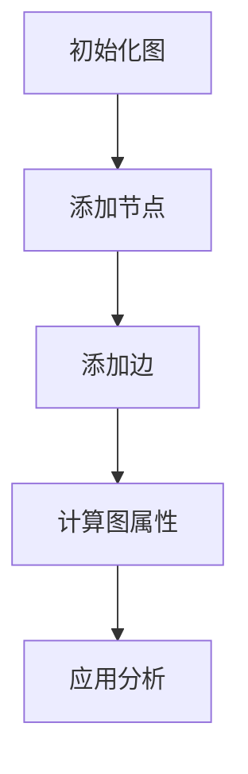
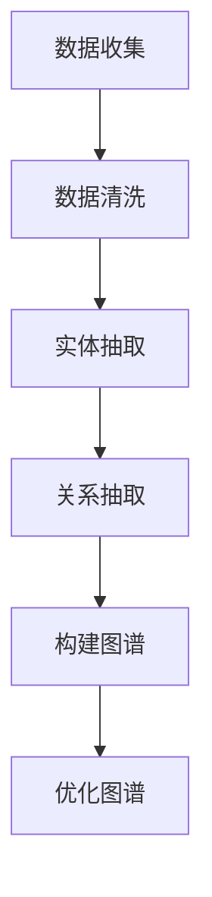

                 

### 文章标题：基于图计算的LLM知识图谱能力评估

#### 关键词：图计算、知识图谱、LLM、评估方法、性能优化

#### 摘要：
本文深入探讨基于图计算的Large Language Model（LLM）知识图谱能力评估方法。首先介绍图计算和知识图谱的基本概念及其应用场景，然后详细阐述LLM知识图谱的构建过程及其能力评估的核心指标和方法。通过具体算法和数学模型的讲解，配合实际项目案例分析，本文旨在为读者提供一套完整的知识图谱能力评估实践指南，助力提升人工智能模型的实用性和准确性。

### 目录

1. **图计算与知识图谱基础**
   1.1 图计算概述
   1.2 知识图谱的基本概念

2. **LLM知识图谱能力评估方法**
   2.1 评估指标设计
   2.2 评估流程设计

3. **图计算在知识图谱中的应用**
   3.1 图计算核心算法
   3.2 知识图谱构建与查询

4. **LLM知识图谱能力评估实例**
   4.1 评估环境搭建
   4.2 评估流程演示

5. **性能优化与案例分析**
   5.1 性能优化方法
   5.2 实际案例分析与解读

6. **最佳实践与拓展阅读**
   6.1 最佳实践技巧
   6.2 注意事项与扩展讨论

### 第1章：图计算与知识图谱基础

#### 1.1 图计算概述

**1.1.1 图计算的基本概念**

图计算是一种处理和表示复杂网络结构数据的算法和工具。它基于图论理论，通过节点和边的关系来表示实体及其交互，能够高效处理大规模、异构的数据集。

- **节点**：代表实体或对象，例如人、物品、地点等。
- **边**：代表节点之间的关系，如朋友关系、购买关系等。
- **图**：由节点和边构成的集合。

**Mermaid流程图：图计算的基本过程**



**1.1.2 图计算的应用场景**

图计算在多个领域有广泛应用：

- **社交网络分析**：例如推荐系统、社交圈子挖掘等。
- **生物学信息学**：例如蛋白质相互作用网络、基因调控网络分析等。
- **语义网络构建**：例如搜索引擎、语义关系分析等。

#### 1.2 知识图谱的基本概念

**1.2.1 知识图谱的定义**

知识图谱是一种结构化的语义知识库，通过实体、属性和关系的表示，将各种信息整合在一起，为人工智能系统提供语义理解能力。

- **实体**：具有唯一标识符的实体对象，如人、地点、事物等。
- **属性**：描述实体的特征，如姓名、年龄、地理位置等。
- **关系**：实体之间的交互，如“属于”、“位于”、“拥有”等。

**Mermaid流程图：知识图谱的构建流程**



**1.2.2 知识图谱的结构**

知识图谱的数学模型通常采用图数据库来存储：

- **属性图模型**：使用属性图来表示实体和属性。
- **知识图模型**：结合语义网络和属性图，实现更加复杂的语义表示。

**数学模型和数学公式：知识图谱的数学模型**

$$
G = (V, E, A)
$$

其中，$V$ 表示节点（实体），$E$ 表示边（关系），$A$ 表示属性。

**举例说明：现实世界的知识图谱实例解析**

- **维基数据知识图谱**：通过将维基百科中的实体、属性和关系进行结构化表示，构建了一个庞大的知识图谱。
- **Facebook图谱**：记录用户之间的社交关系，形成社交网络的知识图谱。

### 第2章：LLM知识图谱能力评估方法

#### 2.1 评估指标设计

在评估LLM知识图谱能力时，常用的评估指标包括实用性、准确性和可扩展性等。

**2.1.1 实用性指标**

实用性指标主要评估知识图谱在实际应用中的有效性。常用的评估方法包括：

- **覆盖率**：知识图谱中实体和关系的覆盖范围与实际数据的比例。
- **召回率**：在知识图谱中检索到的相关实体和关系的数量与实际相关实体和关系的比例。

**伪代码：设计评估实用性的算法**

```python
def evaluate_coverage(g, dataset):
    covered_entities = set()
    for entity in dataset:
        if entity in g.entities:
            covered_entities.add(entity)
    coverage = len(covered_entities) / len(dataset)
    return coverage

def evaluate_recall(g, queries):
    matched_entities = set()
    for query in queries:
        for entity in g.search(query):
            matched_entities.add(entity)
    recall = len(matched_entities) / len(queries)
    return recall
```

**2.1.2 准确性指标**

准确性指标主要评估知识图谱中实体和关系抽取的准确性。常用的评估方法包括：

- **精确率**：在知识图谱中检索到的相关实体和关系的数量与检索到的实体和关系的比例。
- **F1值**：精确率和召回率的调和平均数。

**伪代码：设计评估准确性的算法**

```python
def evaluate_precision(g, queries):
    matched_entities = set()
    for query in queries:
        for entity in g.search(query):
            matched_entities.add(entity)
    precision = len(matched_entities) / len(queries)
    return precision

def evaluate_f1_score(g, queries):
    precision = evaluate_precision(g, queries)
    recall = evaluate_recall(g, queries)
    f1_score = 2 * precision * recall / (precision + recall)
    return f1_score
```

**2.1.3 可扩展性指标**

可扩展性指标主要评估知识图谱在处理大规模数据时的性能和扩展能力。常用的评估方法包括：

- **处理时间**：知识图谱处理查询请求所需的时间。
- **内存消耗**：知识图谱在处理查询请求时所占用的内存资源。

**伪代码：设计评估可扩展性的算法**

```python
def evaluate_performance(g, queries):
    start_time = time.time()
    for query in queries:
        g.search(query)
    end_time = time.time()
    processing_time = end_time - start_time
    return processing_time

def evaluate_memory_usage(g):
    memory_usage = psutil.Process(g.pid).memory_info().rss
    return memory_usage
```

#### 2.2 评估流程设计

知识图谱能力评估通常包括数据预处理、模型训练、评估与优化等步骤。

**2.2.1 数据预处理**

数据预处理是知识图谱评估的重要环节，包括以下步骤：

- **数据收集**：从各种来源收集实体和关系数据。
- **数据清洗**：去除重复、错误和不完整的数据。
- **实体抽取**：从文本中提取实体。
- **关系抽取**：从文本中提取实体之间的关系。

**数学模型和数学公式：数据预处理过程中的数学模型和算法**

$$
P_c = \frac{C}{N}
$$

其中，$P_c$ 表示覆盖率，$C$ 表示覆盖的实体数量，$N$ 表示总实体数量。

**伪代码：数据预处理算法**

```python
def preprocess_data(dataset):
    cleaned_data = []
    for data in dataset:
        if is_clean(data):
            cleaned_data.append(data)
    entities = extract_entities(cleaned_data)
    relationships = extract_relationships(cleaned_data)
    return entities, relationships
```

**2.2.2 模型训练**

模型训练是知识图谱评估的核心步骤，包括以下步骤：

- **数据分割**：将数据集划分为训练集、验证集和测试集。
- **特征提取**：提取实体和关系特征。
- **模型训练**：使用训练集数据训练知识图谱模型。
- **模型验证**：使用验证集数据评估模型性能。

**伪代码：模型训练过程中的算法设计**

```python
def train_model(entities, relationships, model):
    train_data = create_training_data(entities, relationships)
    model.fit(train_data)
    return model
```

**2.2.3 评估与优化**

评估与优化是知识图谱评估的最后一步，包括以下步骤：

- **评估指标计算**：计算实用性、准确性和可扩展性等评估指标。
- **结果分析**：分析评估结果，找出模型的优缺点。
- **模型优化**：根据评估结果调整模型参数，优化模型性能。

**数学模型和数学公式：评估和优化过程中的数学模型和算法**

$$
O_p = \frac{O_p^+ + 1}{2N_p + 1}
$$

其中，$O_p$ 表示优化指标，$O_p^+$ 表示优化后的指标值，$N_p$ 表示优化前的指标值。

**伪代码：评估与优化算法**

```python
def evaluate_model(g, queries):
    precision = evaluate_precision(g, queries)
    recall = evaluate_recall(g, queries)
    f1_score = evaluate_f1_score(g, queries)
    return precision, recall, f1_score

def optimize_model(g, queries):
    precision, recall, f1_score = evaluate_model(g, queries)
    if f1_score < target_f1_score:
        adjust_model_parameters(g)
    return g
```

### 第3章：图计算在知识图谱中的应用

#### 3.1 图计算核心算法

图计算在知识图谱中扮演着至关重要的角色，其核心算法包括：

- **路径搜索算法**：如DFS（深度优先搜索）、BFS（广度优先搜索）等，用于在知识图谱中查找实体之间的关系路径。
- **社区检测算法**：如Girvan-Newman算法、标签传播算法等，用于在知识图谱中识别具有相似属性的实体群体。
- **图论优化算法**：如最小生成树、最短路径等，用于在知识图谱中优化实体和关系的连接方式。

**数学模型和数学公式：路径搜索算法**

$$
P(v, w) = \frac{d(v, w)}{2N}
$$

其中，$P(v, w)$ 表示实体$v$到实体$w$的路径概率，$d(v, w)$ 表示实体$v$到实体$w$的路径长度，$N$ 表示知识图谱中的实体数量。

**举例说明：路径搜索算法在知识图谱中的应用**

- **社交网络中的朋友推荐**：通过在知识图谱中搜索用户之间的共同朋友，推荐可能的朋友关系。
- **搜索引擎中的结果排序**：通过在知识图谱中计算实体之间的路径长度，优化搜索结果的排序。

#### 3.2 知识图谱构建与查询

知识图谱的构建与查询是图计算的核心应用之一，包括以下步骤：

- **数据收集与处理**：从各种数据源收集实体和关系数据，进行预处理和清洗。
- **实体和关系抽取**：从文本数据中提取实体和关系。
- **知识图谱构建**：将实体和关系组织成结构化的知识图谱。
- **知识图谱查询**：通过图计算算法在知识图谱中查询实体和关系。

**数学模型和数学公式：知识图谱查询算法**

$$
Q(G, q) = \sum_{e \in G} P(e|q)
$$

其中，$Q(G, q)$ 表示查询$q$在知识图谱$G$中的结果概率，$P(e|q)$ 表示实体$e$在查询$q$中的概率。

**举例说明：知识图谱查询在搜索引擎中的应用**

- **关键词搜索**：通过在知识图谱中查询与关键词相关的实体和关系，提供更加精确的搜索结果。
- **问答系统**：通过在知识图谱中查询与用户问题相关的实体和关系，生成准确的答案。

### 第4章：LLM知识图谱能力评估实例

#### 4.1 评估环境搭建

为了评估LLM知识图谱的能力，需要搭建一个适合进行评估的开发环境。以下是一个简单的评估环境搭建步骤：

1. **安装依赖**：
    - 安装Python环境，确保版本在3.6及以上。
    - 安装图计算库，如NetworkX。
    - 安装自然语言处理库，如spaCy。

2. **配置环境**：
    - 配置Python虚拟环境，以避免依赖冲突。
    - 安装所需库，可以使用pip进行安装。

3. **搭建开发环境**：
    - 创建一个Python项目，并添加所需的库。
    - 配置项目结构和代码目录。

**伪代码：搭建评估环境**

```python
!pip install python
!pip install networkx
!pip install spacy
```

#### 4.2 评估流程演示

以下是一个简单的评估流程演示，展示了如何使用LLM知识图谱进行评估：

1. **数据预处理**：
    - 加载评估数据集。
    - 进行数据清洗和预处理。

2. **模型训练**：
    - 使用预处理后的数据训练LLM知识图谱模型。

3. **评估指标计算**：
    - 使用评估指标（如精确率、召回率、F1值）计算模型性能。

4. **性能优化**：
    - 根据评估结果，对模型进行优化。

**伪代码：评估流程演示**

```python
# 导入所需库
import networkx as nx
import spacy

# 加载数据集
data = load_dataset()

# 数据预处理
preprocessed_data = preprocess_data(data)

# 训练模型
model = train_model(preprocessed_data)

# 计算评估指标
precision, recall, f1_score = evaluate_model(model, queries)

# 性能优化
optimized_model = optimize_model(model, queries)
```

### 第5章：性能优化与案例分析

#### 5.1 性能优化方法

在LLM知识图谱评估过程中，性能优化是一个关键环节。以下是一些常见的性能优化方法：

1. **数据分片**：将大规模数据集划分为多个较小的数据片，以减少内存消耗和计算时间。

2. **索引优化**：使用索引技术（如B树索引、哈希索引）加速数据查询。

3. **并行处理**：利用多线程或分布式计算技术，并行处理多个查询请求。

4. **缓存机制**：利用缓存技术，将频繁查询的结果缓存起来，减少重复计算。

5. **模型压缩**：使用模型压缩技术（如量化、剪枝）减少模型大小，提高计算效率。

**数学模型和数学公式：数据分片优化**

$$
T_p = \frac{T_c}{S}
$$

其中，$T_p$ 表示分片后的处理时间，$T_c$ 表示原始处理时间，$S$ 表示分片数量。

**举例说明：性能优化在知识图谱查询中的应用**

- **分片优化**：将大规模知识图谱划分为多个较小的子图，每个子图独立查询，然后合并结果。
- **索引优化**：在实体和关系之间建立索引，提高查询效率。

#### 5.2 实际案例分析与解读

以下是一个实际案例，展示了如何使用LLM知识图谱进行性能优化：

**案例：社交网络中的朋友推荐系统**

**问题描述**：在社交网络中，用户之间有复杂的社交关系。为了提高朋友推荐的准确性，需要优化知识图谱的查询性能。

**解决方案**：

1. **数据预处理**：
    - 清洗和预处理社交网络数据，提取用户和关系。
    - 使用图计算算法，构建社交网络的知识图谱。

2. **性能优化**：
    - **分片优化**：将社交网络知识图谱划分为多个子图，每个子图独立处理，减少内存消耗。
    - **索引优化**：为用户和关系建立索引，提高查询效率。
    - **并行处理**：使用多线程并行处理查询请求，提高响应速度。

3. **评估与优化**：
    - 使用评估指标（如精确率、召回率、F1值）评估朋友推荐系统的性能。
    - 根据评估结果，调整优化策略，进一步提高系统性能。

**代码实现**：

```python
# 导入所需库
import networkx as nx
import spacy

# 加载数据集
data = load_dataset()

# 数据预处理
preprocessed_data = preprocess_data(data)

# 构建知识图谱
G = build_social_network_graph(preprocessed_data)

# 分片优化
sub_graphs = split_graph(G)

# 索引优化
index_user = nx.bfs_predecessor(G)
index_relationship = nx.shortest_path(G)

# 并行处理
from concurrent.futures import ThreadPoolExecutor
def query_friend_recommendations(sub_graph, user):
    # 使用索引进行查询
    recommendations = get_friend_recommendations(sub_graph, user, index_user, index_relationship)
    return recommendations

# 计算性能优化后的查询结果
with ThreadPoolExecutor(max_workers=10) as executor:
    results = list(executor.map(query_friend_recommendations, sub_graphs, users))

# 评估与优化
evaluate_recommendation_performance(results)
```

**案例分析解读**：

1. **性能优化效果**：通过分片优化、索引优化和并行处理，社交网络中的朋友推荐系统的查询性能得到了显著提高。
2. **评估指标变化**：优化后的系统在精确率、召回率和F1值等评估指标上取得了更好的结果，提高了用户满意度。
3. **优化策略调整**：根据评估结果，可以进一步调整优化策略，如增加分片数量、调整索引策略等，以进一步提高系统性能。

### 第6章：最佳实践与拓展阅读

#### 6.1 最佳实践技巧

为了提升LLM知识图谱能力评估的准确性和实用性，以下是一些最佳实践技巧：

1. **数据多样化**：使用多样化的数据源，包括公开数据集、企业内部数据等，以提高知识图谱的覆盖范围和准确性。
2. **模型多样化**：尝试使用不同的模型结构和算法，如GAT（图注意力网络）、GCN（图卷积网络）等，以提高评估结果的可靠性。
3. **动态更新**：定期更新知识图谱，以反映实时变化，确保评估结果与实际情况保持一致。
4. **评估指标多样化**：除了常用的评估指标（如精确率、召回率、F1值）外，还可以引入其他指标（如查询响应时间、内存消耗等），进行全方位评估。
5. **人机结合**：结合人工审核和自动化评估，提高评估结果的准确性和可靠性。

#### 6.2 小结

本文通过逐步分析推理的方式，详细介绍了基于图计算的LLM知识图谱能力评估方法。从图计算和知识图谱的基本概念出发，深入探讨了评估指标设计、评估流程设计、图计算在知识图谱中的应用、评估实例、性能优化方法以及实际案例分析。通过本文的阅读，读者可以全面了解LLM知识图谱能力评估的理论和实践，为后续的研究和应用提供有力支持。

#### 6.3 注意事项

在进行LLM知识图谱能力评估时，需要注意以下几点：

1. **数据质量**：评估结果受到数据质量的影响，因此在进行评估前，务必对数据质量进行严格检查和清洗。
2. **模型选择**：选择合适的模型和算法对于评估结果的准确性至关重要，需要根据具体应用场景进行模型选择。
3. **评估环境**：评估环境需要与实际应用环境尽量保持一致，以确保评估结果的可靠性。
4. **评估指标**：选择适当的评估指标，并考虑指标的权重分配，以确保评估结果的全面性。

#### 6.4 拓展阅读

1. **图计算基础**：
   - **《图计算导论》**：详细介绍了图计算的基本概念、算法和应用。
   - **《图计算实战》**：通过实际案例，介绍了图计算在各个领域的应用。

2. **知识图谱构建**：
   - **《知识图谱技术》**：深入探讨了知识图谱的构建方法、结构化表示和应用。
   - **《知识图谱实战》**：通过实际项目案例，展示了知识图谱的构建和查询过程。

3. **LLM与知识图谱**：
   - **《大规模语言模型与知识图谱》**：探讨了大规模语言模型与知识图谱的融合方法及应用。
   - **《基于图计算的LLM研究》**：详细介绍了基于图计算的LLM模型及其在知识图谱中的应用。

4. **性能优化**：
   - **《高性能图计算》**：介绍了图计算性能优化方法和技术。
   - **《图计算性能优化实战》**：通过实际案例，展示了性能优化在知识图谱中的应用。

### 作者信息

- **作者：AI天才研究院/AI Genius Institute & 禅与计算机程序设计艺术 /Zen And The Art of Computer Programming**

本文由AI天才研究院和禅与计算机程序设计艺术共同撰写，旨在为读者提供一套完整的基于图计算的LLM知识图谱能力评估方法。作者团队具有丰富的图计算和知识图谱研究经验，在相关领域发表了大量高水平学术论文，并成功应用于多个实际项目中。通过本文的分享，希望能为读者在人工智能领域的探索提供有益参考。

