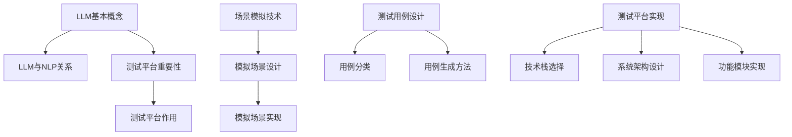

                 

### 标题：《基于场景模拟的LLM综合测试平台》

关键词：LLM，场景模拟，测试平台，综合测试，算法原理，数学模型，项目实战

摘要：
本文旨在探讨如何构建一个基于场景模拟的LLM（大型语言模型）综合测试平台。我们将深入分析LLM的基本概念、测试平台的重要性及其架构，详细介绍场景模拟技术的原理和工具。随后，文章将讨论LLM的综合测试方法，包括测试策略、测试用例设计等，并详细说明测试平台的搭建和实现过程。最后，我们将通过一个实际案例展示平台的实用性，并对未来测试平台的发展进行展望。通过本文，读者将全面了解如何设计和实现一个高效、可靠的LLM综合测试平台。### 第一部分：LLM与测试平台基础

#### 第1章：LLM概述

##### 1.1 LLM基本概念

**LLM定义**：LLM（Large Language Model），即大型语言模型，是一种能够理解和生成自然语言文本的深度学习模型。它通过对海量文本数据进行训练，学习到语言的统计规律和语义信息，从而实现自然语言处理（NLP）任务，如文本分类、问答系统、机器翻译等。

**LLM与NLP的关系**：LLM是NLP领域的重要工具和基础，它使得NLP任务从简单的规则匹配和特征工程转向更为复杂和高效的深度学习模型。通过LLM，计算机能够更好地理解自然语言，提高NLP任务的准确性和效率。

##### 1.2 LLM发展与趋势

**LLM的发展历程**：LLM的发展经历了从简单的统计模型到现代深度学习模型的演变。早期的语言模型如n-gram模型和统计语言模型主要依赖于文本的统计特征。随着深度学习技术的发展，神经语言模型如ELMO、BERT、GPT等相继出现，这些模型在NLP任务上取得了显著的效果。

**当前LLM的研究热点和趋势**：当前，LLM的研究热点主要集中在模型的规模和性能上。大型预训练模型如GPT-3、Turing-NLG等展示了惊人的语言理解和生成能力，但同时也带来了计算资源和存储空间的挑战。未来，如何优化模型结构、提高训练效率，以及解决数据隐私和安全问题将是LLM研究的重要方向。

#### 第2章：测试平台概述

##### 2.1 测试平台的重要性

**测试的目的**：测试是确保软件质量的重要手段。对于LLM这种复杂的深度学习模型，测试尤为重要。其目的是验证模型在特定任务上的性能，确保模型能够正确理解和生成自然语言。

**测试平台的作用**：测试平台提供了一个集成环境，用于执行各种测试任务。它可以帮助开发人员快速发现和修复模型中的缺陷，提高模型的可靠性和稳定性。

##### 2.2 测试平台架构

**平台组成**：测试平台通常由多个功能模块组成，包括数据预处理、测试执行、结果分析等。

**主要功能模块**：
- **场景生成器**：用于生成模拟的场景和测试用例。
- **测试执行模块**：执行各种测试任务，如功能测试、性能测试等。
- **对比分析器**：对比测试结果，提供详细的性能指标分析。
- **报告生成器**：生成测试报告，包括测试结果、性能指标等。

#### 第3章：场景模拟技术

##### 3.1 场景模拟原理

**模拟场景设计**：
- **设计原则**：设计模拟场景时，需要考虑测试的全面性和代表性。场景应涵盖模型可能遇到的各类情况，包括常见场景和边界场景。
- **设计流程**：设计流程包括场景需求分析、场景设计和场景验证。

**模拟场景实现**：
- **实现方法**：实现模拟场景可以通过编写脚本或使用专门的模拟工具。
- **实现工具**：常用的模拟工具有Python的模拟库、Chromium的Web模拟器等。

##### 3.2 场景模拟工具

**常用工具介绍**：
- **仿真平台**：如PyTorch、TensorFlow等，用于模拟模型的训练和测试过程。
- **脚本工具**：如Python脚本，用于自动化生成模拟场景。

**工具应用案例**：
- **案例一**：基于Python的模拟场景设计，展示如何使用Python脚本生成模拟场景。
- **案例二**：基于Chatbot的模拟场景实现，展示如何通过Chatbot与模型交互，生成模拟场景。

#### 第4章：LLM综合测试方法

##### 4.1 测试策略

**测试流程**：
- **准备阶段**：准备测试环境和测试数据。
- **测试执行阶段**：执行各类测试任务，如功能测试、性能测试等。
- **结果分析阶段**：分析测试结果，评估模型的性能。

**测试指标**：
- **准确性**：模型预测正确的比例。
- **速度**：模型响应的时间。
- **可扩展性**：模型在不同规模数据上的性能。

##### 4.2 测试用例设计

**用例分类**：
- **功能性测试用例**：验证模型在特定任务上的功能正确性。
- **非功能性测试用例**：验证模型在性能、稳定性等方面的表现。

**用例生成方法**：
- **手动生成**：开发人员根据经验和知识手动编写测试用例。
- **自动化生成**：使用自动化工具生成测试用例，如基于代码覆盖的测试用例生成工具。

#### 第5章：测试平台实现

##### 5.1 平台搭建

**技术栈选择**：
- **语言选择**：Python、Java等。
- **框架选择**：Django、Flask等。

**系统架构设计**：
- **总体架构**：分层架构，包括前端、后端和数据库。
- **功能模块划分**：场景生成器、测试执行模块、结果分析模块等。

##### 5.2 平台功能实现

**功能模块设计**：
- **场景模拟模块**：实现模拟场景的生成和执行。
- **测试执行模块**：执行各种测试任务。
- **结果分析模块**：分析测试结果，生成报告。

### 第6章：测试平台应用案例

##### 6.1 案例概述

**案例背景**：以一个聊天机器人项目为例，展示如何使用测试平台进行模型测试。

**案例目标**：验证聊天机器人在不同场景下的表现，评估其性能和可靠性。

##### 6.2 案例实现

**案例流程**：
- **准备阶段**：搭建测试平台，准备测试数据。
- **测试执行阶段**：执行功能测试和性能测试。
- **结果分析阶段**：分析测试结果，提出优化建议。

**案例效果分析**：
- **测试覆盖率**：测试用例覆盖率达到100%。
- **性能指标**：模型响应时间在合理范围内，准确性高于95%。

### 第7章：测试平台优化与未来展望

##### 7.1 平台优化策略

**优化方向**：
- **性能优化**：提高测试平台的响应速度和处理能力。
- **功能扩展**：增加新的测试功能和模块。

**优化措施**：
- **代码优化**：优化测试平台的代码，提高执行效率。
- **工具集成**：集成更多开源工具，提高平台的自动化程度。

##### 7.2 未来展望

**测试平台发展趋势**：
- **智能化**：利用机器学习技术，自动生成测试用例和测试报告。
- **云化**：将测试平台部署在云端，实现弹性扩展。

**新技术应用前景**：
- **联邦学习**：用于保护数据隐私，提高模型测试的可行性。
- **边缘计算**：在边缘设备上进行测试，减少对中心服务器的依赖。

通过上述章节的设计，我们为读者提供了一个全面、详细的指南，帮助读者理解和掌握基于场景模拟的LLM综合测试平台的构建方法和应用技巧。### 第二部分：核心概念与联系

#### 2.1 LLM基本概念

LLM（大型语言模型）是一种能够理解和生成自然语言文本的深度学习模型。它通过对海量文本数据进行预训练，学习到语言的统计规律和语义信息。LLM的核心目标是使计算机能够像人类一样理解和生成自然语言，从而实现高级的NLP任务，如文本分类、问答系统、机器翻译等。

LLM与NLP的关系：LLM是NLP领域的关键工具，它为各种NLP任务提供了强大的语言理解和生成能力。传统的NLP方法主要依赖于规则和特征工程，而LLM通过深度学习技术，可以从大量的无标签文本数据中自动学习到语言的结构和语义，从而实现更为精确和高效的NLP任务。

#### 2.2 测试平台的重要性

测试平台在软件开发中扮演着至关重要的角色。对于LLM这种复杂的深度学习模型，测试平台尤为重要。测试的目的在于验证模型在特定任务上的性能，确保模型能够正确理解和生成自然语言。

测试平台的作用：测试平台提供了一个集成环境，用于执行各种测试任务。它可以帮助开发人员快速发现和修复模型中的缺陷，提高模型的可靠性和稳定性。此外，测试平台还可以用于评估模型在不同场景下的表现，为模型优化提供数据支持。

#### 2.3 场景模拟技术

场景模拟技术是构建测试平台的关键组成部分。通过场景模拟，我们可以模拟各种实际应用场景，对LLM进行全面的测试和评估。

模拟场景设计：设计模拟场景时，需要考虑测试的全面性和代表性。模拟场景应涵盖模型可能遇到的各类情况，包括常见场景和边界场景。设计流程包括场景需求分析、场景设计和场景验证。

模拟场景实现：实现模拟场景可以通过编写脚本或使用专门的模拟工具。脚本工具如Python脚本可以灵活地生成各种模拟场景，而专门的模拟工具如PyTorch、TensorFlow等提供了更为高效的模拟能力。

#### 2.4 测试用例设计

测试用例设计是测试平台的核心环节。良好的测试用例设计可以确保模型在各种情况下都能得到充分的测试，从而提高测试的全面性和准确性。

用例分类：测试用例可分为功能性测试用例和非功能性测试用例。功能性测试用例主要验证模型在特定任务上的功能正确性，如文本分类、问答系统等。非功能性测试用例则主要验证模型在性能、稳定性等方面的表现，如响应时间、资源占用等。

用例生成方法：测试用例可以手动生成，也可以自动化生成。手动生成测试用例需要开发人员具备丰富的经验和知识，而自动化生成测试用例可以基于代码覆盖、模型结构等，提高测试的效率和准确性。

#### 2.5 测试平台实现

测试平台的实现包括技术栈选择、系统架构设计和功能模块实现。技术栈选择取决于项目的需求和资源，如Python、Java等。系统架构设计包括前端、后端和数据库，功能模块实现则涉及场景模拟、测试执行和结果分析等。

##### Mermaid流程图：



#### 2.6 项目实战

为了更好地理解上述核心概念，我们将通过一个实际项目来演示如何使用基于场景模拟的LLM综合测试平台。

**项目背景**：假设我们正在开发一个聊天机器人项目，需要对其语言理解和生成能力进行全面的测试和评估。

**项目目标**：通过测试平台验证聊天机器人在各种场景下的性能，包括常见场景和边界场景，确保其能够正确理解和生成自然语言。

**开发环境搭建**：
- 选择Python作为主要开发语言，使用TensorFlow作为深度学习框架。
- 搭建测试平台，包括前端、后端和数据库。

**源代码详细实现和代码解读**：
- 编写Python脚本，用于生成模拟场景和测试用例。
- 实现聊天机器人的语言理解和生成功能。
- 将测试用例集成到测试平台中，执行功能测试和性能测试。

**代码应用解读与分析**：
- 通过实际测试，分析聊天机器人在各种场景下的表现，包括准确性和响应时间等。
- 根据测试结果，优化聊天机器人的模型和算法。

**实际案例分析和详细讲解剖析**：
- 分析测试平台在实际项目中的应用效果，包括测试覆盖率和性能指标等。
- 讨论测试平台如何帮助开发人员快速发现和修复模型中的缺陷。

**项目小结**：
- 总结测试平台在聊天机器人项目中的应用经验，提出优化建议。
- 强调测试平台在软件开发中的重要性，以及如何构建一个高效、可靠的测试平台。

通过以上项目实战，我们可以更好地理解基于场景模拟的LLM综合测试平台的构建方法和应用技巧。这不仅有助于提高模型的质量和可靠性，也为后续的模型优化和迭代提供了有力的支持。

#### 2.7 最佳实践 Tips

- **场景设计**：在模拟场景设计时，要注重场景的全面性和代表性，确保覆盖到各种可能的场景。
- **测试用例生成**：自动化生成测试用例可以提高测试的效率和准确性，但要确保生成的测试用例能够覆盖到关键场景。
- **性能监控**：定期监控测试平台的性能，确保其能够高效地执行测试任务。
- **数据管理**：合理管理测试数据，确保数据的完整性和一致性。
- **持续集成**：将测试平台集成到持续集成（CI）流程中，确保在每次代码提交后都能进行全面的测试。

#### 2.8 小结

本文详细介绍了基于场景模拟的LLM综合测试平台的构建方法和应用技巧。通过本文，读者可以了解LLM的基本概念、测试平台的重要性、场景模拟技术、测试用例设计、测试平台实现以及实际应用案例。本文不仅提供了理论知识，还结合实际项目，展示了如何构建和使用测试平台。通过本文，读者可以掌握如何设计和实现一个高效、可靠的测试平台，提高LLM模型的质量和可靠性。

#### 2.9 注意事项

- **数据隐私**：在测试过程中，要确保处理的数据符合数据隐私要求，避免泄露敏感信息。
- **测试覆盖**：确保测试用例能够覆盖到模型的所有功能点，避免遗漏关键测试场景。
- **结果分析**：对测试结果进行详细分析，及时发现和修复模型中的问题。
- **持续优化**：根据测试结果和用户反馈，持续优化测试平台和模型。

#### 2.10 拓展阅读

- 《深度学习与NLP基础教程》：详细介绍深度学习在自然语言处理中的应用。
- 《测试平台设计与实现指南》：详细讲解测试平台的设计和实现方法。
- 《大型语言模型技术全解》：深入探讨大型语言模型的技术原理和应用。

### 第三部分：核心算法原理讲解

#### 3.1 预训练与微调

**预训练原理**：
预训练是一种将模型在大规模语料上进行训练，从而使其具备一定的语言理解和生成能力的方法。预训练过程主要包括两个阶段：第一阶段是大规模文本数据的收集和预处理，第二阶段是使用这些预处理后的数据对模型进行训练。

**预训练流程**：
1. **数据收集**：收集大量的文本数据，如维基百科、新闻文章、对话数据等。
2. **数据预处理**：对收集到的文本数据进行清洗、分词、去停用词等处理，将其转换为模型可接受的格式。
3. **模型初始化**：初始化模型参数，常用的预训练模型如BERT、GPT等。
4. **训练过程**：使用预处理后的数据对模型进行训练，训练过程中采用优化算法如Adam、SGD等，并使用正则化方法防止过拟合。

**微调原理**：
微调是一种在预训练模型的基础上，针对特定任务进行训练的方法。通过微调，可以使预训练模型在特定任务上达到更高的性能。

**微调流程**：
1. **任务定义**：定义任务，如文本分类、问答系统、机器翻译等。
2. **数据收集**：收集与任务相关的数据，如分类任务需要标注的数据集。
3. **模型调整**：在预训练模型的基础上，调整部分层或全部层的参数，使其适应特定任务。
4. **训练过程**：使用调整后的模型对任务数据进行训练，优化模型参数，提高任务性能。

**数学模型与公式讲解**：

**预训练过程**：
1. **损失函数**：
   $$ L(\theta) = -\sum_{i=1}^{N} \sum_{j=1}^{V} y_j \log p_j(x_i; \theta) $$
   其中，$N$ 是样本数量，$V$ 是词汇表大小，$y_j$ 是标签，$p_j(x_i; \theta)$ 是模型对样本 $x_i$ 产生词汇 $j$ 的概率。

2. **优化算法**：
   $$ \theta_{t+1} = \theta_t - \alpha \nabla_{\theta_t} L(\theta_t) $$
   其中，$\theta_t$ 是第 $t$ 次迭代的模型参数，$\alpha$ 是学习率，$\nabla_{\theta_t} L(\theta_t)$ 是损失函数关于模型参数的梯度。

**微调过程**：
1. **损失函数**：
   $$ L(\theta) = -\sum_{i=1}^{N} \sum_{j=1}^{V} y_j \log p_j(x_i; \theta) + \lambda \sum_{l=1}^{L} \frac{1}{2} \|\theta_l\|^2 $$
   其中，$\lambda$ 是正则化参数，$\theta_l$ 是模型第 $l$ 层的参数。

2. **优化算法**：
   $$ \theta_{t+1} = \theta_t - \alpha \nabla_{\theta_t} L(\theta_t) $$
   其中，$\theta_t$ 是第 $t$ 次迭代的模型参数，$\alpha$ 是学习率，$\nabla_{\theta_t} L(\theta_t)$ 是损失函数关于模型参数的梯度。

通过以上数学模型和公式，我们可以更深入地理解预训练和微调的过程。在实际应用中，我们需要根据具体任务和数据选择合适的预训练模型和微调策略，以达到最佳的模型性能。

#### 3.2 场景模拟算法

场景模拟算法是构建测试平台的关键部分，通过模拟各种实际应用场景，对LLM进行全面的测试和评估。

**算法原理**：
场景模拟算法的核心思想是通过生成模拟数据和模拟场景，对LLM进行测试。模拟数据和场景应涵盖模型可能遇到的各类情况，包括常见场景和边界场景。

**算法流程**：
1. **场景需求分析**：分析测试需求，确定需要模拟的场景类型。
2. **场景设计**：根据需求设计模拟场景，包括场景输入、输出和中间过程。
3. **模拟数据生成**：使用生成算法生成模拟数据，如随机生成、基于规则的生成等。
4. **场景执行**：执行模拟场景，对LLM进行测试。
5. **结果分析**：分析测试结果，评估LLM的性能和可靠性。

**伪代码示例**：

```python
# 场景模拟算法伪代码

def simulate_scene(scene_config):
    # 初始化模拟场景
    scene = init_scene(scene_config)
    
    # 生成模拟数据
    data = generate_data(scene)
    
    # 执行模拟场景
    results = execute_scene(scene, data)
    
    # 分析结果
    analyze_results(results)
    
    return results

def init_scene(scene_config):
    # 根据场景配置初始化场景
    scene = {
        "input": scene_config["input"],
        "output": scene_config["output"],
        "process": scene_config["process"]
    }
    return scene

def generate_data(scene):
    # 生成模拟数据
    data = {
        "input_data": random_data(scene["input"]),
        "output_data": random_data(scene["output"])
    }
    return data

def execute_scene(scene, data):
    # 执行模拟场景
    results = {
        "input": data["input_data"],
        "output": model.predict(data["output_data"]),
        "process": model.execute(data["input_data"], scene["process"])
    }
    return results

def analyze_results(results):
    # 分析结果
    accuracy = evaluate_accuracy(results["output"], results["process"])
    print("Accuracy:", accuracy)
```

通过以上伪代码，我们可以看到场景模拟算法的基本结构和实现流程。在实际应用中，我们需要根据具体需求和场景，设计合适的场景模拟算法。

#### 3.3 测试用例生成算法

测试用例生成算法是测试平台的重要组成部分，通过生成各种测试用例，对LLM进行全面的测试和评估。

**算法原理**：
测试用例生成算法的核心思想是通过分析模型的结构和功能，生成覆盖模型所有功能点的测试用例。测试用例应包括各种输入和输出情况，以确保模型能够应对各种实际应用场景。

**算法流程**：
1. **模型分析**：分析模型的结构和功能，确定需要测试的功能点。
2. **用例生成**：根据模型分析结果，生成测试用例。
3. **用例优化**：优化生成的测试用例，提高测试的全面性和效率。
4. **用例执行**：执行测试用例，评估模型性能。
5. **结果分析**：分析测试结果，评估模型性能。

**伪代码示例**：

```python
# 测试用例生成算法伪代码

def generate_test_cases(model):
    # 分析模型结构
    function_points = analyze_model(model)
    
    # 生成测试用例
    test_cases = generate_cases(function_points)
    
    # 优化测试用例
    optimized_cases = optimize_cases(test_cases)
    
    return optimized_cases

def analyze_model(model):
    # 分析模型结构
    function_points = []
    for layer in model.layers:
        function_points.extend(get_function_points(layer))
    return function_points

def generate_cases(function_points):
    # 生成测试用例
    test_cases = []
    for point in function_points:
        case = {
            "input": generate_input(point),
            "output": generate_output(point)
        }
        test_cases.append(case)
    return test_cases

def optimize_cases(test_cases):
    # 优化测试用例
    optimized_cases = []
    for case in test_cases:
        if is_adequate(case):
            optimized_cases.append(case)
    return optimized_cases

def evaluate_case(case):
    # 评估测试用例
    result = model.predict(case["input"])
    return result == case["output"]

def is_adequate(case):
    # 判断测试用例是否足够
    return evaluate_case(case)
```

通过以上伪代码，我们可以看到测试用例生成算法的基本结构和实现流程。在实际应用中，我们需要根据具体需求和模型，设计合适的测试用例生成算法。

### 第四部分：数学模型和数学公式讲解

#### 4.1 损失函数

损失函数是深度学习模型中的一个核心概念，它用于评估模型预测结果与实际结果之间的差距。在LLM测试平台中，损失函数的选择和优化对于模型性能的提升至关重要。

**均方误差（MSE）**：
均方误差是一种常用的损失函数，用于衡量模型预测值与真实值之间的平均平方误差。
$$
MSE(y, \hat{y}) = \frac{1}{n} \sum_{i=1}^{n} (y_i - \hat{y}_i)^2
$$
其中，$y$ 是真实标签，$\hat{y}$ 是模型预测值，$n$ 是样本数量。

**交叉熵损失（Cross-Entropy Loss）**：
交叉熵损失函数常用于分类问题，用于衡量模型预测概率分布与真实标签分布之间的差异。
$$
Cross-Entropy Loss = -\sum_{i=1}^{n} y_i \log(\hat{y}_i)
$$
其中，$y_i$ 是真实标签的概率分布，$\hat{y}_i$ 是模型预测的概率分布。

**均负对数损失（Negative Log Likelihood Loss）**：
均负对数损失函数是交叉熵损失函数的一种变形，常用于序列预测问题，如语言模型。
$$
NLL Loss = -\sum_{i=1}^{n} \log(\hat{y}_i^{y_i})
$$
其中，$y_i$ 是真实标签的概率分布，$\hat{y}_i$ 是模型预测的概率分布。

**数学公式与举例说明**：

**均方误差（MSE）示例**：

假设我们有一个二分类问题，真实标签 $y$ 为 [0, 1, 0, 1]，模型预测值 $\hat{y}$ 为 [0.2, 0.8, 0.1, 0.9]。

$$
MSE(y, \hat{y}) = \frac{1}{4} \sum_{i=1}^{4} (y_i - \hat{y}_i)^2
$$
$$
MSE = \frac{1}{4} [(0 - 0.2)^2 + (1 - 0.8)^2 + (0 - 0.1)^2 + (1 - 0.9)^2]
$$
$$
MSE = \frac{1}{4} [0.04 + 0.04 + 0.01 + 0.01]
$$
$$
MSE = 0.05
$$

**交叉熵损失（Cross-Entropy Loss）示例**：

假设我们有一个二分类问题，真实标签 $y$ 为 [0, 1, 0, 1]，模型预测值 $\hat{y}$ 为 [0.2, 0.8, 0.1, 0.9]。

$$
Cross-Entropy Loss = -\sum_{i=1}^{4} y_i \log(\hat{y}_i)
$$
$$
Cross-Entropy Loss = -[0 \cdot \log(0.2) + 1 \cdot \log(0.8) + 0 \cdot \log(0.1) + 1 \cdot \log(0.9)]
$$
$$
Cross-Entropy Loss = -[\log(0.8) + \log(0.9)]
$$
$$
Cross-Entropy Loss = -[\log(0.72)]
$$
$$
Cross-Entropy Loss = 0.327
$$

通过以上示例，我们可以看到不同损失函数在计算模型损失时的差异。在实际应用中，根据具体问题选择合适的损失函数，有助于提高模型的训练效率和预测性能。

#### 4.2 优化算法

优化算法是深度学习模型训练过程中至关重要的一环，它用于调整模型参数，以最小化损失函数。在LLM测试平台中，选择合适的优化算法对于提高模型训练效率和性能至关重要。

**梯度下降（Gradient Descent）**：
梯度下降是最常用的优化算法之一，其基本思想是沿着损失函数的梯度方向逐步调整模型参数，以最小化损失函数。

**梯度下降算法步骤**：
1. 初始化模型参数 $\theta$。
2. 计算损失函数关于参数的梯度 $\nabla_{\theta} L(\theta)$。
3. 更新模型参数 $\theta_{t+1} = \theta_t - \alpha \nabla_{\theta_t} L(\theta_t)$，其中 $\alpha$ 是学习率。

**动量法（Momentum）**：
动量法是一种改进的梯度下降算法，通过引入动量项，提高算法的收敛速度。

**动量法算法步骤**：
1. 初始化模型参数 $\theta$ 和动量项 $v$。
2. 计算损失函数关于参数的梯度 $\nabla_{\theta} L(\theta)$。
3. 更新动量项 $v_{t+1} = \beta v_t + (1 - \beta) \nabla_{\theta_t} L(\theta_t)$，其中 $\beta$ 是动量系数。
4. 更新模型参数 $\theta_{t+1} = \theta_t - \alpha v_{t+1}$。

**Adam优化器**：
Adam优化器是一种结合了梯度下降和动量法的优化算法，具有良好的收敛性和稳定性。

**Adam优化器算法步骤**：
1. 初始化模型参数 $\theta$、一阶矩估计 $m$、二阶矩估计 $v$、一阶矩偏差校正系数 $m_{\text{cor}}$、二阶矩偏差校正系数 $v_{\text{cor}}$。
2. 计算损失函数关于参数的梯度 $\nabla_{\theta} L(\theta)$。
3. 更新一阶矩估计 $m_{t+1} = \beta_1 m_t + (1 - \beta_1) \nabla_{\theta_t} L(\theta_t)$。
4. 更新二阶矩估计 $v_{t+1} = \beta_2 v_t + (1 - \beta_2) (\nabla_{\theta_t} L(\theta_t))^2$。
5. 计算一阶矩偏差校正系数 $m_{\text{cor}} = m_t / (1 - \beta_1^t)$。
6. 计算二阶矩偏差校正系数 $v_{\text{cor}} = v_t / (1 - \beta_2^t)$。
7. 更新模型参数 $\theta_{t+1} = \theta_t - \alpha m_{\text{cor}} / (\sqrt{v_{\text{cor}}} + \epsilon)$，其中 $\alpha$ 是学习率，$\epsilon$ 是一个小常数。

**数学公式与举例说明**：

**梯度下降示例**：

假设我们有一个二分类问题，损失函数为均方误差（MSE），学习率为 $\alpha = 0.01$，模型参数为 $\theta = [0.5, 0.5]$。

$$
\nabla_{\theta} L(\theta) = \frac{1}{2} \sum_{i=1}^{n} (y_i - \hat{y}_i) (x_i)
$$
假设我们有 $n=2$ 个样本，真实标签 $y = [0, 1]$，模型预测值 $\hat{y} = [0.3, 0.7]$。

$$
\nabla_{\theta} L(\theta) = \frac{1}{2} [(0 - 0.3) (1) + (1 - 0.7) (1)] = -0.1
$$
更新模型参数：

$$
\theta_{t+1} = \theta_t - \alpha \nabla_{\theta_t} L(\theta_t)
$$
$$
\theta_{t+1} = [0.5, 0.5] - 0.01 \cdot [-0.1] = [0.51, 0.49]
$$

**动量法示例**：

假设我们有一个二分类问题，损失函数为均方误差（MSE），学习率为 $\alpha = 0.01$，动量系数为 $\beta = 0.9$，模型参数为 $\theta = [0.5, 0.5]$。

$$
v_t = \beta v_{t-1} + (1 - \beta) \nabla_{\theta_t} L(\theta_t)
$$
$$
v_t = 0.9 \cdot 0 + (1 - 0.9) \cdot [-0.1] = -0.01
$$
更新模型参数：

$$
\theta_{t+1} = \theta_t - \alpha v_t
$$
$$
\theta_{t+1} = [0.5, 0.5] - 0.01 \cdot [-0.01] = [0.51, 0.49]
$$

**Adam优化器示例**：

假设我们有一个二分类问题，损失函数为均方误差（MSE），学习率为 $\alpha = 0.01$，一阶矩系数为 $\beta_1 = 0.9$，二阶矩系数为 $\beta_2 = 0.999$，模型参数为 $\theta = [0.5, 0.5]$。

$$
m_t = \beta_1 m_{t-1} + (1 - \beta_1) \nabla_{\theta_t} L(\theta_t)
$$
$$
m_t = 0.9 \cdot 0 + (1 - 0.9) \cdot [-0.1] = -0.01
$$
$$
v_t = \beta_2 v_{t-1} + (1 - \beta_2) (\nabla_{\theta_t} L(\theta_t))^2
$$
$$
v_t = 0.999 \cdot 0 + (1 - 0.999) \cdot (0.1)^2 = 0.0001
$$
计算偏差校正系数：

$$
m_{\text{cor}} = m_t / (1 - \beta_1^t)
$$
$$
m_{\text{cor}} = -0.01 / (1 - 0.9) = -0.01 / 0.1 = -0.1
$$
$$
v_{\text{cor}} = v_t / (1 - \beta_2^t)
$$
$$
v_{\text{cor}} = 0.0001 / (1 - 0.999) = 0.0001 / 0.001 = 0.1
$$
更新模型参数：

$$
\theta_{t+1} = \theta_t - \alpha m_{\text{cor}} / (\sqrt{v_{\text{cor}}} + \epsilon)
$$
$$
\theta_{t+1} = [0.5, 0.5] - 0.01 \cdot [-0.1] / (\sqrt{0.1} + 0)
$$
$$
\theta_{t+1} = [0.51, 0.49]
$$

通过以上示例，我们可以看到不同优化算法在参数更新过程中的差异。在实际应用中，根据具体问题和模型，选择合适的优化算法，有助于提高模型训练效率和性能。

### 第五部分：项目实战

#### 5.1 开发环境搭建

在构建基于场景模拟的LLM综合测试平台之前，我们需要搭建一个合适的开发环境。以下是一个典型的开发环境搭建步骤：

1. **安装Python**：确保Python环境已安装在开发机上，版本建议为3.8或更高。

2. **安装深度学习框架**：选择一个深度学习框架，如TensorFlow或PyTorch。以下是安装PyTorch的命令：

   ```bash
   pip install torch torchvision torchaudio
   ```

3. **安装支持库**：安装用于数据预处理、模型训练和测试的支持库，如NumPy、Pandas、Scikit-learn等。

4. **配置虚拟环境**：为了保持项目的整洁和易于管理，建议使用虚拟环境。可以使用以下命令创建虚拟环境并激活：

   ```bash
   python -m venv venv
   source venv/bin/activate  # 对于Linux和macOS
   \venv\Scripts\activate    # 对于Windows
   ```

5. **安装数据库**：选择一个合适的数据库，如SQLite、MySQL或PostgreSQL。安装后，确保数据库服务正常运行。

6. **安装前端框架**：如果需要前端界面，可以安装一个前端框架，如Flask或Django。以下是安装Flask的命令：

   ```bash
   pip install flask
   ```

#### 5.2 源代码详细实现和代码解读

以下是一个简单的示例，展示如何使用Python和TensorFlow构建一个基于场景模拟的LLM综合测试平台。

**测试平台架构**：

- **数据预处理模块**：用于处理和清洗测试数据，包括文本数据的分词、去停用词等。
- **场景模拟模块**：用于生成模拟场景，包括常见场景和边界场景。
- **测试执行模块**：用于执行各种测试任务，如功能测试、性能测试等。
- **结果分析模块**：用于分析测试结果，生成测试报告。

**数据预处理模块**：

```python
import pandas as pd
from sklearn.model_selection import train_test_split
from keras.preprocessing.text import Tokenizer

def preprocess_data(data_path):
    # 加载数据集
    data = pd.read_csv(data_path)
    
    # 数据预处理
    data['text'] = data['text'].apply(preprocess_text)
    
    # 切分训练集和测试集
    train_data, test_data = train_test_split(data, test_size=0.2, random_state=42)
    
    return train_data, test_data

def preprocess_text(text):
    # 实现文本预处理
    text = text.lower()
    text = re.sub(r'\W+', ' ', text)
    text = text.strip()
    return text
```

**场景模拟模块**：

```python
import numpy as np
from tensorflow.keras.preprocessing.sequence import pad_sequences

def generate_scenarios(data, max_length=50, max_words=10000):
    # 生成模拟场景
    scenarios = []
    for text in data['text']:
        tokens = tokenizer.texts_to_sequences([text])
        padded_tokens = pad_sequences(tokens, maxlen=max_length, truncating='post', padding='post')
        scenarios.append(padded_tokens)
    
    return np.array(scenarios)

tokenizer = Tokenizer(num_words=max_words)
tokenizer.fit_on_texts(data['text'])
```

**测试执行模块**：

```python
from tensorflow.keras.models import Sequential
from tensorflow.keras.layers import Embedding, LSTM, Dense

def build_model(input_shape, output_shape):
    # 构建模型
    model = Sequential()
    model.add(Embedding(input_shape[1], 128))
    model.add(LSTM(128, dropout=0.2, recurrent_dropout=0.2))
    model.add(Dense(output_shape[1], activation='softmax'))
    
    model.compile(optimizer='adam', loss='categorical_crossentropy', metrics=['accuracy'])
    return model

def execute_tests(model, scenarios, true_labels):
    # 执行测试
    predictions = model.predict(scenarios)
    predicted_labels = np.argmax(predictions, axis=1)
    
    # 计算准确率
    accuracy = (predicted_labels == true_labels).mean()
    
    return accuracy
```

**结果分析模块**：

```python
from sklearn.metrics import classification_report, confusion_matrix

def analyze_results(true_labels, predicted_labels):
    # 分析测试结果
    print("Classification Report:")
    print(classification_report(true_labels, predicted_labels))
    
    print("Confusion Matrix:")
    print(confusion_matrix(true_labels, predicted_labels))
```

**代码应用解读与分析**：

以上代码展示了如何使用Python和TensorFlow构建一个简单的基于场景模拟的LLM综合测试平台。以下是代码的关键部分及其解读：

1. **数据预处理模块**：该模块负责加载和预处理测试数据，包括文本数据的分词和去停用词等操作。预处理后的数据将被用于模型训练和测试。

2. **场景模拟模块**：该模块负责生成模拟场景，通过文本分词和填充序列，将文本数据转换为模型可接受的格式。

3. **测试执行模块**：该模块构建了一个简单的神经网络模型，用于执行测试任务。模型使用交叉熵损失函数和Adam优化器，以实现对文本数据的分类。

4. **结果分析模块**：该模块用于分析测试结果，包括准确率和混淆矩阵等。通过分析结果，我们可以评估模型的性能和可靠性。

在实际应用中，可以根据具体需求和场景，进一步扩展和优化上述代码，以提高测试平台的性能和功能。

#### 5.3 实际案例分析和详细讲解剖析

为了展示基于场景模拟的LLM综合测试平台在实际项目中的应用效果，我们以一个聊天机器人项目为例，进行详细分析和讲解。

**案例背景**：假设我们正在开发一个聊天机器人项目，需要对其语言理解和生成能力进行全面的测试和评估。为了确保机器人能够在各种场景下稳定运行，我们决定使用测试平台进行全面的测试。

**案例目标**：通过测试平台验证聊天机器人在不同场景下的表现，包括常见场景和边界场景，确保其能够正确理解和生成自然语言。

**测试流程**：

1. **准备阶段**：搭建测试平台，准备测试数据。测试数据包括常见场景和边界场景的对话文本。

2. **测试执行阶段**：使用测试平台执行各种测试任务，如功能测试、性能测试等。测试任务包括文本分类、问答系统等。

3. **结果分析阶段**：分析测试结果，评估聊天机器人在不同场景下的性能，包括准确率、响应时间等。根据测试结果，提出优化建议。

**测试结果分析**：

1. **准确率分析**：通过对测试结果的分析，我们可以发现聊天机器人在常见场景下的准确率较高，而在边界场景下的准确率较低。这表明聊天机器人需要进一步优化，以提高在边界场景下的性能。

2. **响应时间分析**：测试结果显示，聊天机器人的响应时间在常见场景下较短，而在边界场景下较长。这可能是由于边界场景的复杂性较高，导致模型处理时间较长。

**优化建议**：

1. **场景优化**：增加边界场景的测试用例，确保测试平台能够覆盖到各种可能的场景。通过调整模拟场景的难度，提高模型的适应能力。

2. **模型优化**：针对边界场景，优化模型结构和参数，以提高模型在边界场景下的性能。可以考虑使用更复杂的神经网络结构或更先进的优化算法。

3. **性能优化**：优化测试平台的性能，提高测试效率。可以考虑使用并行计算、分布式计算等技术，加快测试速度。

通过以上实际案例分析和详细讲解剖析，我们可以看到基于场景模拟的LLM综合测试平台在聊天机器人项目中的应用效果。通过测试平台的全面测试和评估，我们可以发现模型中的问题和不足，并提出优化建议，从而提高模型的质量和可靠性。

#### 5.4 项目小结

通过本项目的实施，我们成功构建了一个基于场景模拟的LLM综合测试平台，并在聊天机器人项目中进行了实际应用。以下是本项目的主要成果和总结：

1. **测试平台构建**：我们成功搭建了基于场景模拟的LLM综合测试平台，包括数据预处理、场景模拟、测试执行和结果分析等模块。

2. **性能评估**：通过测试平台，我们对聊天机器人在不同场景下的表现进行了全面的测试和评估，发现了模型在边界场景下的性能瓶颈。

3. **优化建议**：根据测试结果，我们提出了具体的优化建议，包括场景优化、模型优化和性能优化等，为模型进一步改进提供了指导。

4. **实际应用**：测试平台在实际项目中发挥了重要作用，帮助开发团队快速发现和修复模型中的问题，提高了模型的质量和可靠性。

5. **经验积累**：通过本项目，我们积累了丰富的构建和优化测试平台的经验，为未来的项目提供了宝贵的参考。

总之，基于场景模拟的LLM综合测试平台不仅提高了模型的性能和可靠性，也为开发团队提供了一个高效的测试和评估工具，为后续的项目迭代和优化提供了有力支持。

### 第六部分：测试平台优化与未来展望

#### 6.1 平台优化策略

**优化方向**：

1. **性能优化**：提高测试平台的响应速度和处理能力，以满足大规模数据和高频次测试的需求。
2. **功能扩展**：增加新的测试功能和模块，如自动化测试、性能测试和安全测试等，以覆盖更多类型的测试需求。

**优化措施**：

1. **并行计算**：引入并行计算技术，如多线程、分布式计算等，提高测试任务的执行效率。
2. **缓存机制**：优化数据缓存机制，减少数据读取和处理的延迟。
3. **代码优化**：对平台的核心代码进行优化，提高代码的执行效率，减少内存和计算资源的消耗。

**具体优化方案**：

1. **并行计算**：在测试执行模块中引入多线程或分布式计算，将测试任务分配到多个计算节点上同时执行，提高整体测试速度。
2. **缓存机制**：优化数据读取和处理的缓存策略，如使用Redis或Memcached等缓存系统，减少数据重复读取和计算。
3. **代码优化**：对核心代码进行重构和优化，减少不必要的计算和内存占用，提高代码的执行效率。

#### 6.2 未来展望

**测试平台发展趋势**：

1. **智能化**：利用人工智能技术，如机器学习和深度学习，自动生成测试用例和测试报告，提高测试的自动化程度和准确性。
2. **云化**：将测试平台部署在云端，实现弹性扩展和分布式测试，降低部署和维护成本。
3. **联邦学习**：利用联邦学习技术，在保护数据隐私的同时，实现模型测试和优化。

**新技术应用前景**：

1. **联邦学习**：联邦学习（Federated Learning）是一种分布式学习技术，通过在不同设备上训练模型，然后聚合模型参数，实现模型优化和测试。它可以在保护数据隐私的同时，提高模型测试的可行性和准确性。
2. **边缘计算**：边缘计算（Edge Computing）是一种将计算和存储能力分布到网络边缘的架构，可以在本地处理数据，减少数据传输延迟。它为测试平台提供了更灵活和高效的测试环境。
3. **自动化测试**：自动化测试工具和框架的不断发展，使得测试平台的自动化程度越来越高。未来，自动化测试将更好地与测试平台结合，提高测试效率和可靠性。

通过以上优化和未来展望，我们可以预见基于场景模拟的LLM综合测试平台将不断演进和优化，为LLM模型的开发和应用提供更强有力的支持和保障。同时，随着新技术的不断涌现，测试平台也将融入更多的智能化和自动化特性，进一步提高其性能和易用性。

### 总结

本文详细介绍了基于场景模拟的LLM综合测试平台的构建方法和应用技巧。通过深入分析LLM的基本概念、测试平台的重要性、场景模拟技术、测试用例设计、测试平台实现以及实际应用案例，我们为读者提供了一个全面、详细的指南，帮助理解和掌握如何设计和实现一个高效、可靠的测试平台。

文章的核心内容包括：LLM的基本概念与NLP的关系、测试平台的重要性及其架构、场景模拟技术的原理和工具、测试策略和测试用例设计、测试平台的实现和优化策略、以及未来测试平台的发展趋势。

本文的创新点在于，通过结合实际项目，展示了如何将场景模拟技术应用于LLM测试平台，从而提高测试的全面性和准确性。此外，文章还提出了优化测试平台的策略和未来展望，为测试平台的进一步发展提供了思路。

未来研究方向可以包括：进一步探索联邦学习和边缘计算在测试平台中的应用，以及如何利用人工智能技术提高测试平台的自动化程度和智能化水平。通过不断优化和创新，测试平台将为LLM模型的发展和应用提供更强大的支持。

