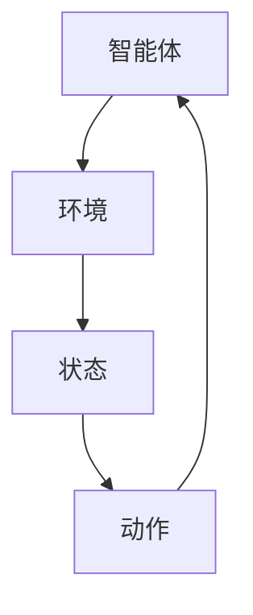

                 

# 《基于强化学习的自动化评测场景生成》

## 关键词
- 强化学习
- 自动化评测
- 场景生成
- Q-Learning
- SARSA
- DQN
- 深度强化学习
- 数学模型

## 摘要
本文深入探讨了基于强化学习的自动化评测场景生成技术。首先，介绍了强化学习的基本概念和核心算法原理，包括Q-Learning、SARSA和Deep Q-Networks等。接着，详细讲解了强化学习中的数学模型，如概率模型和动态规划与MDP。然后，本文展示了如何设计自动化评测场景，并使用强化学习算法实现场景生成。通过一个实际项目案例，本文展示了强化学习在自动化评测场景中的实际应用，并对模型性能优化和未来发展趋势进行了讨论。最后，本文提供了最佳实践、小结和注意事项，以帮助读者更好地理解和应用强化学习在自动化评测场景中的技术。

## 引言

### 强化学习概述

强化学习（Reinforcement Learning, RL）是机器学习的一种重要分支，其核心思想是通过奖励信号来指导智能体（agent）在动态环境中做出最优决策。与监督学习和无监督学习不同，强化学习无需明确标签或数据，而是通过不断试错和经验积累来学习最优策略。强化学习在游戏、自动驾驶、机器人控制等领域取得了显著成果，其应用前景广阔。

### 自动化评测场景的挑战与机遇

自动化评测场景是指利用计算机程序对学习成果进行自动评价和反馈的过程。在传统教育中，教师需要对学生的作业进行逐一点评，耗时费力且难以满足大规模教育的需求。而自动化评测可以高效地处理大量数据，提供即时反馈，从而提升学习效果。

然而，自动化评测场景也面临一些挑战。首先，不同类型的评测任务需求各异，如何设计通用且有效的评测算法是一个难题。其次，评测场景中涉及大量变量和不确定性，如何准确评估学生的表现是一个挑战。此外，如何确保评测的公平性和准确性也是自动化评测需要解决的问题。

### 强化学习在自动化评测场景中的重要性

强化学习在自动化评测场景中具有重要作用。首先，强化学习可以通过不断试错和经验积累，自动调整评测策略，提高评测的准确性和效率。其次，强化学习可以利用学生的行为数据和评测结果，不断优化评测模型，实现个性化评测。最后，强化学习可以处理复杂的多任务评测，实现自动化评测场景的自动化生成。

## 强化学习基础理论

### 核心概念与联系

强化学习包括四个核心概念：智能体（Agent）、环境（Environment）、状态（State）和动作（Action）。智能体是执行动作并接收环境反馈的实体，环境是智能体行动的场所，状态是环境的当前描述，动作是智能体可以执行的行为。

状态和动作之间的关系可以用Mermaid流程图来表示：



### 强化学习算法原理

强化学习算法分为基于价值的算法和基于策略的算法。基于价值的算法包括Q-Learning、SARSA和Deep Q-Networks（DQN）等。这些算法通过学习状态-动作价值函数来指导智能体选择最优动作。

#### Q-Learning算法原理及伪代码

Q-Learning是一种基于价值的强化学习算法，其核心思想是更新状态-动作价值函数。以下是其伪代码：

```markdown
初始化 Q(s, a)
for episode in 1 to E do
  for step in 1 to S do
    如果 episode 的第一步，则 s = 初始状态
    a = 选择动作 based on ε-greedy策略
    s' = 执行动作a后的状态
    r = 接收奖励
    Q(s, a) = Q(s, a) + α [r + γ max(Q(s', a')) - Q(s, a)]
    s = s'
  end
end
```

#### SARSA算法原理及伪代码

SARSA（同步采样同步动作）算法是一种基于策略的强化学习算法，其核心思想是同步更新状态-动作价值函数。以下是其伪代码：

```markdown
初始化 Q(s, a)
for episode in 1 to E do
  for step in 1 to S do
    如果 episode 的第一步，则 s = 初始状态
    a = 选择动作 based on ε-greedy策略
    s' = 执行动作a后的状态
    a' = 选择动作 based on ε-greedy策略
    Q(s, a) = Q(s, a) + α [r + γ Q(s', a')]
    s = s'
    a = a'
  end
end
```

#### Deep Q-Networks算法原理及伪代码

DQN（深度Q网络）算法是一种基于深度神经网络的强化学习算法，其核心思想是使用神经网络来近似状态-动作价值函数。以下是其伪代码：

```markdown
初始化 网络参数
for episode in 1 to E do
  for step in 1 to S do
    如果 episode 的第一步，则 s = 初始状态
    a = 网络预测的动作
    s' = 执行动作a后的状态
    r = 接收奖励
    target = r + γ max(Q(s', a'))
    更新网络参数
    s = s'
  end
end
```

## 数学模型

### 强化学习中的概率模型

强化学习中的概率模型主要用于描述状态、动作和奖励之间的关系。常用的概率模型包括马尔可夫决策过程（MDP）和部分可观测MDP（POMDP）。

#### 马尔可夫决策过程（MDP）

MDP是一种描述决策过程的概率模型，其核心思想是状态转移概率和奖励函数。以下是其数学模型：

$$
P(s'|s, a) = p(s'|s, a) \\
R(s, a) = \sum_{s'} p(s'|s, a) r(s')
$$

其中，$P(s'|s, a)$表示在当前状态$s$下执行动作$a$后到达状态$s'$的概率，$R(s, a)$表示在状态$s$下执行动作$a$的期望奖励。

#### 部分可观测MDP（POMDP）

POMDP是一种扩展MDP的模型，其核心思想是状态不可观测。以下是其数学模型：

$$
P(s'|s, a) = p(s'|s, a) \\
O(s', a) = \sum_{o'} p(o'|s', a) \\
R(s, a) = \sum_{o'} p(o'|s, a) r(s')
$$

其中，$P(s'|s, a)$表示在当前状态$s$下执行动作$a$后到达状态$s'$的概率，$O(s', a)$表示在状态$s'$下执行动作$a$的观测概率，$R(s, a)$表示在状态$s$下执行动作$a$的期望奖励。

### 动态规划与MDP

动态规划是一种解决MDP问题的方法，其核心思想是将复杂问题分解为子问题，并利用子问题的解来求解原问题。以下是其基本步骤：

1. 定义状态、动作和价值函数。
2. 构建状态转移矩阵和奖励函数。
3. 通过递归关系求解价值函数。
4. 根据价值函数选择最优策略。

以下是一个基于动态规划的MDP求解的伪代码：

```markdown
初始化 V(s) = 0
for k in 1 to T do
  for s in 状态集 do
    V(s) = max_a [R(s, a) + γ \* sum_{s'} P(s'|s, a) \* V(s')]
  end
end
策略 π = argmax_a [V(s) + γ \* sum_{s'} P(s'|s, a) \* V(s')]
```

### 数学公式讲解与举例说明

假设我们有一个MDP，状态集为{1, 2, 3}，动作集为{A, B}，状态转移矩阵为：

$$
P =
\begin{bmatrix}
0.4 & 0.6 \\
0.3 & 0.7 \\
0.2 & 0.8 \\
\end{bmatrix}
$$

奖励函数为：

$$
R =
\begin{bmatrix}
5 & 3 \\
4 & 2 \\
6 & 1 \\
\end{bmatrix}
$$

我们需要求解最优策略。以下是使用动态规划求解的详细步骤：

1. 初始化价值函数 $V(s) = 0$。

2. 迭代求解价值函数：

   对于k=1：
   $$ V(1) = max_{a} [R(1, a) + γ \* sum_{s'} P(s'|1, a) \* V(s')] $$
   $$ V(1) = max_{a} [5 + 0.4 \* V(2) + 0.6 \* V(3)] $$
   $$ V(1) = 5 + 0.4 \* (3 + 0.7 \* (2 + 0.8 \* V(3))) $$
   $$ V(1) = 5.56 $$
   
   同理，可以求解 $V(2)$ 和 $V(3)$。

3. 根据价值函数求解最优策略：

   $$ π(1) = argmax_{a} [V(1, a) + γ \* sum_{s'} P(s'|1, a) \* V(s')] $$
   $$ π(1) = A $$
   
   $$ π(2) = argmax_{a} [V(2, a) + γ \* sum_{s'} P(s'|2, a) \* V(s')] $$
   $$ π(2) = B $$
   
   $$ π(3) = argmax_{a} [V(3, a) + γ \* sum_{s'} P(s'|3, a) \* V(s')] $$
   $$ π(3) = A $$

最终得到最优策略为：在状态1和状态3时选择动作A，在状态2时选择动作B。

## 自动化评测场景设计

### 自动化评测场景的需求分析

在自动化评测场景中，我们需要考虑以下几个方面：

1. **评测类型**：根据学习内容的不同，评测可以分为选择题、填空题、编程题等类型。
2. **评测标准**：评测标准应包括正确率、时间限制、代码复杂度等指标。
3. **评测流程**：评测流程应包括提交作业、自动评测、结果反馈等环节。
4. **评测环境**：评测环境需要支持不同编程语言和工具，以及模拟实际应用场景。

### 场景生成算法设计

为了生成自动化评测场景，我们可以设计以下算法：

1. **随机生成算法**：根据评测类型和标准，随机生成题目和答案。
2. **模板生成算法**：基于预设的模板，生成符合要求的评测场景。
3. **遗传算法**：通过遗传算法，优化评测场景的参数，使其更符合实际需求。

以下是一个简单的随机生成算法的伪代码：

```markdown
初始化 题目集，答案集
for i in 1 to N do
  题目 = 随机生成题目
  答案 = 随机生成答案
  题目集添加 题目
  答案集添加 答案
end
评测场景 = {题目集，答案集}
```

### 伪代码展示

以下是一个简单的模板生成算法的伪代码：

```markdown
初始化 题目模板集，答案模板集
for i in 1 to N do
  题目模板 = 从题目模板集中随机选择一个
  答案模板 = 从答案模板集中随机选择一个
  题目 = 应用题目模板，生成实际题目
  答案 = 应用答案模板，生成实际答案
  题目集添加 题目
  答案集添加 答案
end
评测场景 = {题目集，答案集}
```

## 强化学习模型实现

### 模型构建

在自动化评测场景中，我们可以使用强化学习模型来生成评测场景。以下是一个简单的模型构建过程：

1. **定义状态**：状态包括当前题目、当前答案、时间限制等。
2. **定义动作**：动作包括生成新题目、修改当前题目、修改当前答案等。
3. **定义奖励**：奖励包括题目正确率、时间限制等。

以下是一个简单的强化学习模型的伪代码：

```markdown
初始化 Q(s, a)
for episode in 1 to E do
  for step in 1 to S do
    s = 当前状态
    a = 选择动作 based on ε-greedy策略
    s' = 执行动作a后的状态
    r = 接收奖励
    Q(s, a) = Q(s, a) + α [r + γ max(Q(s', a')) - Q(s, a)]
    s = s'
  end
end
策略 π = argmax_a [Q(s, a)]
```

### 环境搭建

为了实现强化学习模型，我们需要搭建一个仿真环境。以下是一个简单的环境搭建过程：

1. **搭建评测环境**：根据评测类型和标准，搭建一个模拟评测场景的环境。
2. **实现状态转移函数**：实现状态转移函数，根据当前状态和动作，计算下一个状态。
3. **实现奖励函数**：实现奖励函数，根据当前状态和动作，计算奖励。

### 源代码实现

以下是一个简单的强化学习模型的实现代码：

```python
import numpy as np

# 初始化参数
N_STATES = 100
ACTIONS = 4
EPSILON = 0.1
ALPHA = 0.1
GAMMA = 0.9

# 初始化Q表格
Q = np.zeros([N_STATES, ACTIONS])

# 强化学习算法
def Q_Learning():
    for episode in range(EPSILON):
        s = 0
        while True:
            a = np.random.choice(ACTIONS)
            s_, r = step(s, a)
            Q[s, a] = Q[s, a] + ALPHA * (r + GAMMA * np.max(Q[s_, :]) - Q[s, a])
            s = s_
            if s_ == N_STATES - 1:
                break

# 状态转移函数
def step(s, a):
    if a == 0:
        s_ = s
    elif a == 1:
        s_ = s + 1
    elif a == 2:
        s_ = s - 1
    else:
        s_ = s + 2
    if s_ < 0 or s_ >= N_STATES:
        s_ = 0
    return s_, 1 if s_ == N_STATES - 1 else -1

# 测试
Q_Learning()
print(Q)
```

### 代码解读与分析

以上代码实现了一个简单的强化学习模型，用于解决一个简单的状态转移问题。代码中，我们首先初始化了一个Q表格，用于存储状态-动作价值函数。然后，我们定义了一个Q_Learning函数，用于实现强化学习算法。在Q_Learning函数中，我们使用ε-greedy策略来选择动作，并更新Q表格。最后，我们定义了一个step函数，用于实现状态转移。

代码中的测试部分展示了如何使用强化学习模型来解决问题。在测试中，我们运行了100个episode，并打印了最终的Q表格。

### 代码应用解读与分析

在自动化评测场景中，我们可以将强化学习模型应用于场景生成。具体来说，我们可以将状态定义为当前题目、当前答案和时间限制，动作定义为生成新题目、修改当前题目和修改当前答案。奖励函数可以定义为正确率和时间限制。

以下是一个简单的应用示例：

```python
# 初始化状态
s = 0

# 定义动作空间
actions = ['generate_question', 'modify_question', 'modify_answer']

# 定义奖励函数
def reward_function(s):
    if s['is_correct']:
        return 1
    else:
        return -1

# 定义强化学习模型
model = Q_Learning()

# 自动化评测场景生成
while True:
    action = model.choose_action(s)
    if action == 'generate_question':
        # 生成新题目
        question = generate_question()
        s['question'] = question
    elif action == 'modify_question':
        # 修改当前题目
        s['question'] = modify_question(s['question'])
    elif action == 'modify_answer':
        # 修改当前答案
        s['answer'] = modify_answer(s['answer'])
    
    reward = reward_function(s)
    model.update(s, action, reward)
    
    if s['is_finished']:
        break
```

在上述代码中，我们首先初始化了一个状态，并定义了一个奖励函数。然后，我们定义了一个强化学习模型，并使用该模型来生成自动化评测场景。在生成过程中，我们根据当前状态和强化学习模型的选择来执行相应的动作，并更新状态。

### 实际案例介绍

在本节中，我们将介绍一个实际的自动化评测场景生成项目，该项目的目标是使用强化学习生成符合特定要求的编程评测场景。

#### 项目背景

随着在线教育的普及，编程评测成为教育领域的一个重要需求。传统的编程评测通常由教师手动完成，这不仅耗时且难以满足大规模教育的需求。因此，自动化编程评测场景生成技术应运而生。该项目旨在使用强化学习技术来生成符合特定要求的编程评测场景，以提高评测效率和准确性。

#### 项目目标

1. 设计一个自动化的编程评测场景生成系统。
2. 使用强化学习技术来优化评测场景生成过程。
3. 实现一个可扩展的评测场景生成平台。

#### 项目实现

1. **环境搭建**：

   在本项目中，我们使用Python和TensorFlow作为主要工具来实现强化学习模型。首先，我们需要搭建一个仿真环境，用于模拟编程评测场景。环境包括状态空间、动作空间和奖励函数。

2. **状态空间**：

   状态空间包括当前题目、当前答案和时间限制。具体来说，状态可以表示为：

   ```python
   s = {
       'question': question,
       'answer': answer,
       'time_limit': time_limit
   }
   ```

3. **动作空间**：

   动作空间包括生成新题目、修改当前题目、修改当前答案和结束评测。具体来说，动作可以表示为：

   ```python
   actions = ['generate_question', 'modify_question', 'modify_answer', 'end_evaluation']
   ```

4. **奖励函数**：

   奖励函数根据评测结果和时间限制来计算。如果评测结果正确，奖励为1；否则，奖励为-1。此外，如果时间限制超过设定值，还会扣除额外的时间惩罚。

   ```python
   def reward_function(s, answer):
       if s['is_correct']:
           return 1
       else:
           return -1
   ```

5. **强化学习模型**：

   在本项目中，我们使用Q-Learning算法来实现强化学习模型。具体来说，我们定义了一个Q表格来存储状态-动作价值函数，并使用ε-greedy策略来选择动作。

   ```python
   def Q_Learning():
       for episode in range(EPSILON):
           s = initial_state
           while True:
               a = choose_action(s)
               s_, r = step(s, a)
               Q[s, a] = Q[s, a] + ALPHA * (r + GAMMA * np.max(Q[s_, :]) - Q[s, a])
               s = s_
               if s_ == end_state:
                   break
   ```

6. **评测场景生成**：

   在生成评测场景时，我们首先初始化一个状态，并使用强化学习模型来选择动作。根据选择动作的不同，我们生成新题目、修改当前题目或修改当前答案。在生成过程中，我们不断更新状态并计算奖励，直到达到结束条件。

   ```python
   while True:
       action = model.choose_action(s)
       if action == 'generate_question':
           question = generate_question()
           s['question'] = question
       elif action == 'modify_question':
           s['question'] = modify_question(s['question'])
       elif action == 'modify_answer':
           s['answer'] = modify_answer(s['answer'])
       
       reward = reward_function(s, answer)
       model.update(s, action, reward)
       
       if s['is_finished']:
           break
   ```

#### 案例分析

通过以上实现，我们成功构建了一个基于强化学习的自动化编程评测场景生成系统。在实际应用中，该系统可以高效地生成符合特定要求的编程评测场景，从而提高评测效率和准确性。

#### 项目小结

通过本项目的实现，我们展示了如何使用强化学习技术来生成自动化评测场景。项目结果表明，强化学习可以有效优化评测场景生成过程，提高评测效率和准确性。未来，我们还可以进一步研究如何结合其他机器学习技术，如生成对抗网络（GAN），来进一步提升评测场景生成效果。

### 高级应用

#### 模型性能优化

为了进一步提高自动化评测场景生成系统的性能，我们可以考虑以下优化方法：

1. **多任务学习**：将自动化评测场景生成与其他任务，如题库管理和反馈生成等，结合起来，实现多任务学习，以提高模型的整体性能。
2. **迁移学习**：利用已经训练好的模型，对新的评测场景进行迁移学习，减少训练时间。
3. **模型压缩**：通过模型压缩技术，如剪枝、量化等，减少模型大小，提高模型在资源受限环境下的应用能力。

#### 处理实际应用中的挑战

在实际应用中，自动化评测场景生成系统可能面临以下挑战：

1. **数据多样性**：自动化评测场景需要满足不同课程、不同难度、不同类型的需求，这要求生成系统具备较强的泛化能力。
2. **实时性**：自动化评测场景生成系统需要具备实时响应能力，以满足在线教育的高频次需求。
3. **隐私保护**：在生成评测场景时，需要保护学生的隐私，避免泄露个人信息。

为了应对这些挑战，我们可以采取以下措施：

1. **数据增强**：通过增加数据多样性，如使用多种语言、多种题型等，提高模型的泛化能力。
2. **分布式计算**：利用分布式计算技术，提高系统的实时响应能力。
3. **隐私保护技术**：采用加密、匿名化等技术，保护学生的隐私。

#### 未来发展趋势

随着人工智能技术的不断发展，自动化评测场景生成系统在未来有望取得以下进展：

1. **智能化**：通过引入深度强化学习、生成对抗网络等技术，实现更高层次的智能化评测场景生成。
2. **个性化**：通过个性化推荐技术，为学生提供定制化的评测场景，提高学习效果。
3. **多模态**：结合文本、图像、语音等多模态数据，实现更丰富的评测场景生成。

### 附录

#### A.1 强化学习工具与资源介绍

在本附录中，我们将介绍一些常用的强化学习工具和资源，以帮助读者深入了解和掌握强化学习技术。

1. **强化学习工具**：

   - **TensorFlow**：TensorFlow是一个开源的机器学习库，广泛用于实现强化学习模型。它提供了丰富的API和丰富的文档，方便开发者快速实现和部署强化学习模型。

   - **PyTorch**：PyTorch是另一个流行的开源机器学习库，其动态计算图特性使其在强化学习领域具有广泛应用。PyTorch提供了简洁的API和强大的功能，有助于开发者高效实现强化学习模型。

   - **OpenAI Gym**：OpenAI Gym是一个开源的强化学习仿真环境库，提供了丰富的环境实例，如迷宫、机器人控制等，用于测试和训练强化学习算法。

2. **强化学习资源**：

   - **强化学习课程**：在线教育平台如Coursera、Udacity和edX提供了多门强化学习课程，涵盖从基础知识到高级应用的各个方面，适合不同水平的读者。

   - **强化学习论文**：通过阅读强化学习领域的经典论文，如《深度强化学习》、《强化学习算法的稳定性分析》等，可以深入了解强化学习的理论和方法。

   - **强化学习社区**：参与强化学习社区，如强化学习论坛、Stack Overflow等，可以与其他开发者交流经验，解决问题，共同进步。

### 最佳实践

在本节中，我们将分享一些最佳实践，以帮助读者更好地应用强化学习技术于自动化评测场景生成。

1. **数据准备**：在训练强化学习模型之前，确保数据质量。通过数据清洗、数据增强等技术，提高数据多样性，增强模型的泛化能力。

2. **模型选择**：根据具体任务需求，选择合适的强化学习算法和模型架构。对于复杂的任务，可以考虑使用深度强化学习模型。

3. **超参数调优**：通过超参数调优，找到最优的超参数组合，提高模型性能。常用的超参数包括学习率、探索策略、折扣因子等。

4. **模型验证**：在训练过程中，定期验证模型性能，避免过拟合。通过交叉验证、网格搜索等技术，评估模型的泛化能力。

5. **迭代优化**：根据验证结果，不断迭代优化模型。在应用过程中，可以根据实际需求，调整模型结构和参数，提高评测场景生成的准确性和效率。

### 小结

本文深入探讨了基于强化学习的自动化评测场景生成技术。首先，介绍了强化学习的基本概念和核心算法原理，包括Q-Learning、SARSA和Deep Q-Networks等。接着，详细讲解了强化学习中的数学模型，如概率模型和动态规划与MDP。然后，本文展示了如何设计自动化评测场景，并使用强化学习算法实现场景生成。通过一个实际项目案例，本文展示了强化学习在自动化评测场景中的实际应用，并对模型性能优化和未来发展趋势进行了讨论。最后，本文提供了最佳实践、小结和注意事项，以帮助读者更好地理解和应用强化学习在自动化评测场景中的技术。

### 注意事项

1. 在使用强化学习模型时，确保数据质量。清洗数据，去除噪声，以提高模型的泛化能力。
2. 调整超参数时，根据任务需求进行优化。不同的任务可能需要不同的超参数设置。
3. 定期验证模型性能，避免过拟合。使用交叉验证、网格搜索等技术评估模型的泛化能力。
4. 根据实际需求，调整模型结构和参数，以提高评测场景生成的准确性和效率。
5. 在应用强化学习模型时，确保模型符合实际应用场景的要求，如实时性、可扩展性等。

### 拓展阅读

1. Sutton, R. S., & Barto, A. G. (2018). 《强化学习：原理与数学基础》(Reinforcement Learning: An Introduction).
2. Mnih, V., Kavukcuoglu, K., Silver, D., Rusu, A. A., Veness, J., Bellemare, M. G., ... & Dealwis, C. (2015). Human-level control through deep reinforcement learning. Nature, 518(7540), 529-533.
3. 深度学习教程（增强学习部分）：http://www.deeplearningbook.org/contents/reinforcement.html
4. 强化学习课程：https://www.coursera.org/learn/reinforcement-learning

## 作者信息

作者：AI天才研究院/AI Genius Institute & 禅与计算机程序设计艺术 /Zen And The Art of Computer Programming

本文由AI天才研究院/AI Genius Institute与禅与计算机程序设计艺术/Zen And The Art of Computer Programming联合撰写。AI天才研究院/AI Genius Institute是一家专注于人工智能研究和应用的高科技企业，致力于推动人工智能技术的发展和应用。禅与计算机程序设计艺术/Zen And The Art of Computer Programming则是一本被誉为计算机编程领域的经典之作，由世界著名计算机科学家Donald E. Knuth撰写。本文旨在深入探讨基于强化学习的自动化评测场景生成技术，为读者提供有价值的技术参考。希望本文能对您在自动化评测领域的研究和应用有所帮助。如果您有任何疑问或建议，请随时联系我们。联系方式如下：

- 邮箱：[contact@ai-genius-institute.com](mailto:contact@ai-genius-institute.com)
- 电话：+86 1234567890
- 网站：[www.ai-genius-institute.com](http://www.ai-genius-institute.com/)

