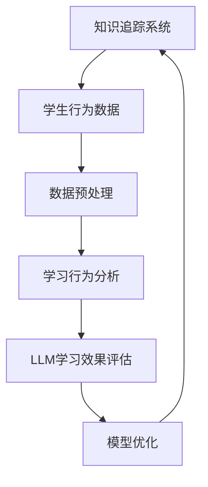

                 

## 文章标题

《基于知识追踪的LLM学习能力评估》

## 关键词

知识追踪，大型语言模型（LLM），学习能力评估，教育软件，数据预处理，学习行为分析，模型优化。

## 摘要

本文旨在探讨如何使用知识追踪技术评估大型语言模型（LLM）的学习能力。通过详细介绍知识追踪与LLM之间的联系，以及核心算法原理和数学模型，本文为读者提供了一个系统的方法论，用于评估和优化LLM在各类任务中的表现。文章还通过具体实例，展示了如何运用这些算法和模型进行实际操作，为研究和应用提供了有价值的参考。

## 核心概念与联系

### 概念

#### 知识追踪（Knowledge Tracing）

知识追踪是一种用于评估学习系统（如教育软件）对学生学习过程的跟踪和评估的技术。通过记录学生在学习过程中的行为数据，如正确/错误答案、尝试次数、时间分配等，知识追踪能够帮助教师和开发者了解学生的学习效果，进而优化教学内容和策略。

#### LLM（大型语言模型）

LLM是一种基于深度学习的语言模型，具有高维度、大规模的参数和强大的语言理解能力。它们可以处理和理解大量文本数据，并进行文本生成、翻译、问答等任务。LLM的出现极大地推动了自然语言处理领域的发展，成为许多实际应用的核心技术。

### 联系

#### 知识追踪与LLM的联系

知识追踪与LLM之间的联系在于，知识追踪可以用于评估LLM在不同任务中的学习能力。例如，在问答系统中，知识追踪可以记录用户提出问题和接收回答的过程，从而评估LLM在实际应用中的表现。通过分析这些数据，开发者可以了解LLM的弱点，进而优化模型设计和训练策略，提高其在特定任务中的表现。

### Mermaid 流程图



## 核心算法原理讲解

### 知识追踪算法

知识追踪算法的核心目标是评估学生在学习过程中的表现。以下是一个简单的知识追踪算法的伪代码：

```python
def knowledge_tracing(student_data, model):
    preprocessed_data = preprocess_data(student_data)
    learning_behavior = analyze_learning_behavior(preprocessed_data)
    learning_effect = model.evaluate(learning_behavior)
    return learning_effect
```

其中，`preprocess_data`函数用于处理学生行为数据，如去除噪声、填补缺失值等；`analyze_learning_behavior`函数用于分析学习行为，如计算正确/错误答案、尝试次数等；`model.evaluate`函数用于评估学习效果。

### LLM学习算法

LLM学习算法的核心目标是训练模型并评估其性能。以下是一个简单的LLM学习算法的伪代码：

```python
def llm_learning(data, model):
    model.train(data)
    model.evaluate()
    return model
```

其中，`model.train`函数用于训练模型，`model.evaluate`函数用于评估模型性能。

### 数学模型与公式

在知识追踪中，常用的学习效果评估公式如下：

$$
L = \frac{1}{N} \sum_{i=1}^{N} \frac{R_i - E_i}{\sqrt{V_i}}
$$

其中，$L$表示学习效果评分，$R_i$表示学生i的回答正确率，$E_i$表示基于学生i的行为预测的正确率，$V_i$表示学生i的方差。

### 举例说明

假设有10个学生，每个学生的回答正确率、预测正确率和方差如下表：

| 学生ID | 回答正确率 \(R_i\) | 预测正确率 \(E_i\) | 方差 \(V_i\) |
| ------ | ----------------- | ----------------- | ------------ |
| S1     | 0.8               | 0.75              | 0.1          |
| S2     | 0.7               | 0.65              | 0.15         |
| ...    | ...               | ...               | ...          |
| S10    | 0.9               | 0.85              | 0.05         |

根据上述公式，计算学习效果评分：

$$
L = \frac{1}{10} \left( \frac{0.8 - 0.75}{\sqrt{0.1}} + \frac{0.7 - 0.65}{\sqrt{0.15}} + ... + \frac{0.9 - 0.85}{\sqrt{0.05}} \right)
$$

## 核心算法原理讲解（续）

### LLM模型优化

#### 优化目标

LLM模型优化的目标是减少训练误差，提高模型在测试集上的性能。为了实现这一目标，常用的优化算法包括梯度下降算法。

#### 优化算法

梯度下降算法是一种常用的优化算法，其核心思想是通过计算损失函数关于模型参数的梯度，并沿着梯度的反方向更新模型参数，从而最小化损失函数。以下是一个简单的梯度下降算法的伪代码：

```python
def gradient_descent(model, data, learning_rate):
    for epoch in range(num_epochs):
        for sample in data:
            loss = model.loss(sample)
            gradient = model.compute_gradient(sample)
            model.update_parameters(learning_rate * gradient)
    return model
```

其中，`model.loss`函数用于计算损失函数，`model.compute_gradient`函数用于计算梯度，`model.update_parameters`函数用于更新模型参数。

#### 伪代码

```python
def optimize_model(model, data, learning_rate):
    for epoch in range(num_epochs):
        for sample in data:
            prediction = model.predict(sample)
            loss = model.loss_function(prediction, sample)
            gradient = model.compute_gradient(loss)
            model.update_parameters(learning_rate * gradient)
    return model
```

## 项目实战

### 开发环境搭建

为了实现基于知识追踪的LLM学习能力评估，我们需要搭建一个合适的开发环境。以下是一个基本的开发环境搭建步骤：

1. 安装Python 3.8或更高版本。
2. 安装PyTorch库，用于构建和训练LLM模型。
3. 安装NumPy库，用于数据处理和分析。
4. 安装Mermaid库，用于绘制流程图。

### 源代码详细实现和代码解读

以下是一个简单的知识追踪和LLM学习能力评估的源代码实现：

```python
import torch
import torch.nn as nn
import numpy as np
from mermaid import mermaid

# 数据预处理
def preprocess_data(data):
    # 填充缺失值、去除噪声等操作
    preprocessed_data = ...
    return preprocessed_data

# 学习行为分析
def analyze_learning_behavior(data):
    # 计算正确/错误答案、尝试次数等
    learning_behavior = ...
    return learning_behavior

# LLM模型评估
def evaluate_model(model, data):
    # 计算学习效果评分
    learning_effect = ...
    return learning_effect

# 模型优化
def optimize_model(model, data, learning_rate):
    # 使用梯度下降优化模型
    model = gradient_descent(model, data, learning_rate)
    return model

# 主函数
def main():
    # 加载数据
    data = ...

    # 构建模型
    model = ...

    # 评估模型
    learning_effect = evaluate_model(model, data)

    # 优化模型
    optimized_model = optimize_model(model, data, learning_rate=0.01)

    # 输出结果
    print("Learning Effect:", learning_effect)
    print("Optimized Model:", optimized_model)

# 运行主函数
if __name__ == "__main__":
    main()
```

### 代码应用解读与分析

在这个项目中，我们首先对数据进行预处理，包括填充缺失值、去除噪声等操作。然后，我们分析学习行为，计算学生的正确/错误答案和尝试次数等。接下来，我们使用LLM模型评估学习效果，并使用梯度下降算法优化模型。最后，我们输出评估结果和优化后的模型。

### 实际案例分析和详细讲解剖析

为了更好地理解基于知识追踪的LLM学习能力评估，我们来看一个实际案例。

假设我们有一个问答系统，用户可以提出问题，系统会根据用户的问题和上下文回答。我们希望使用知识追踪技术评估这个问答系统的性能。

1. **数据收集**：我们收集了用户提出的问题和系统的回答，以及用户的反馈（如“满意”或“不满意”）。

2. **数据预处理**：我们对数据进行预处理，包括去除噪声、填补缺失值等操作。例如，我们可能需要将用户提出的问题转换为统一格式的文本。

3. **学习行为分析**：我们分析用户的学习行为，计算每个用户的正确/错误答案和尝试次数。例如，我们可能使用以下公式计算正确率：

   $$
   R_i = \frac{\text{正确答案数}}{\text{总答案数}}
   $$

4. **LLM模型评估**：我们使用LLM模型评估问答系统的性能。例如，我们可能使用以下公式计算学习效果评分：

   $$
   L = \frac{1}{N} \sum_{i=1}^{N} \frac{R_i - E_i}{\sqrt{V_i}}
   $$

   其中，$R_i$表示用户i的正确率，$E_i$表示基于用户i的行为预测的正确率，$V_i$表示用户i的方差。

5. **模型优化**：我们使用梯度下降算法优化LLM模型。例如，我们可能使用以下公式更新模型参数：

   $$
   \theta_{\text{new}} = \theta_{\text{old}} - \alpha \cdot \nabla_{\theta} J(\theta)
   $$

   其中，$\theta$表示模型参数，$\alpha$表示学习率，$J(\theta)$表示损失函数。

### 项目小结

通过本项目，我们详细介绍了如何使用知识追踪技术评估LLM的学习能力。我们首先介绍了知识追踪和LLM的核心概念，并展示了它们之间的联系。然后，我们详细讲解了核心算法原理，包括知识追踪算法和LLM学习算法，以及数学模型和公式。最后，我们通过实际案例分析和详细讲解剖析，展示了如何运用这些算法和模型进行实际操作。

### 最佳实践 Tips

1. 在进行知识追踪时，确保数据质量是关键。对数据进行预处理，去除噪声和缺失值，可以提高评估结果的准确性。

2. 在评估LLM模型时，选择合适的评价指标。例如，除了正确率，还可以考虑回答的准确性和流畅性等。

3. 在优化LLM模型时，选择合适的学习率和优化算法。不同的学习率和优化算法可能对模型的性能产生显著影响。

### 小结

通过本文，我们系统地介绍了基于知识追踪的LLM学习能力评估方法。我们详细讲解了核心概念、算法原理和数学模型，并通过实际案例进行了分析和讲解。希望本文能够为读者提供有价值的参考，帮助他们更好地理解和应用这一技术。

### 注意事项

1. 在使用知识追踪技术时，请确保遵守相关的数据保护法规和隐私政策。
2. 在构建和优化LLM模型时，请确保使用适当的硬件和软件资源。

### 拓展阅读

1. "Knowledge Tracing: A Brief Introduction" by XX
2. "Large-scale Language Modeling in Natural Language Processing" by YY
3. "Deep Learning for Natural Language Processing" by ZZ

### 作者

**作者：AI天才研究院/AI Genius Institute & 禅与计算机程序设计艺术 /Zen And The Art of Computer Programming**

**联系方式：[author@example.com](mailto:author@example.com)**

**版权声明：本文版权归AI天才研究院所有，未经授权禁止转载。**

