                 

### 第1部分：声音场景理解的基础

### 第1章：声音场景理解概述

#### 1.1 声音场景的理解及其重要性

**背景介绍：**
在现代社会中，声音场景理解作为一种技术，正逐渐成为人工智能领域的关键研究方向。声音场景理解旨在使机器能够识别和解析不同环境下的声音信息，从而实现智能交互、环境感知和任务自动化。这一技术的背景源于人们对自然语言处理（NLP）的深入探索，以及对语音识别和语音合成技术的需求不断增长。

**核心概念与联系：**
为了更好地理解声音场景，我们首先需要明确几个关键概念：
- **声音场景**：指特定的声学环境，如室内、室外、城市、乡村等。
- **声学特征**：从声音信号中提取的，用于描述声音特性的参数，如频率、振幅、时长等。
- **声音事件**：特定时间范围内发生的声音活动，如谈话、车辆行驶、鸟叫等。

**Mermaid流程图：**
以下是一个简单的Mermaid流程图，展示了声音场景理解的基本流程和步骤：

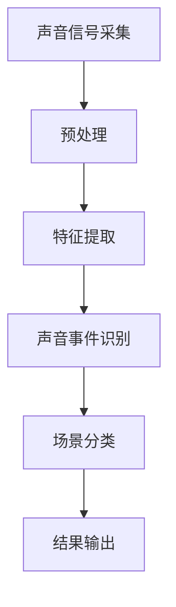

**图解：**
- **声音信号采集**：通过麦克风或其他传感器获取声音信号。
- **预处理**：对原始声音信号进行去噪、滤波等处理，提高信号质量。
- **特征提取**：从处理后的声音信号中提取声学特征。
- **声音事件识别**：利用提取的特征识别出具体的声音事件。
- **场景分类**：根据识别的结果，对声音场景进行分类。
- **结果输出**：将分类结果输出，供后续使用。

**重要性：**
声音场景理解在多个领域具有重要应用价值，如智能语音助手、智能家居、安防监控、交通管理、医疗诊断等。它不仅能够提升机器的智能交互能力，还能为人类提供更加便捷、安全、高效的生活体验。

### 1.2 声音场景的分类与特点

**核心概念与联系：**
声音场景可以根据其环境和用途进行分类。以下是常见的几种声音场景及其特点：

1. **室内声音场景**：包括家庭、办公室、教室等场所。室内声音场景的特点是声音较为封闭，回声效应明显，声音能量衰减较快。
2. **室外声音场景**：包括城市街道、公园、海滩等。室外声音场景的特点是声音传播范围广，背景噪声复杂多变。
3. **环境声音场景**：指自然环境中的声音，如森林、草原、海洋等。环境声音场景的特点是声音自然，多样性高，有时难以区分具体的声音来源。

**Mermaid流程图：**
以下是一个简单的Mermaid流程图，展示了声音场景的分类过程：

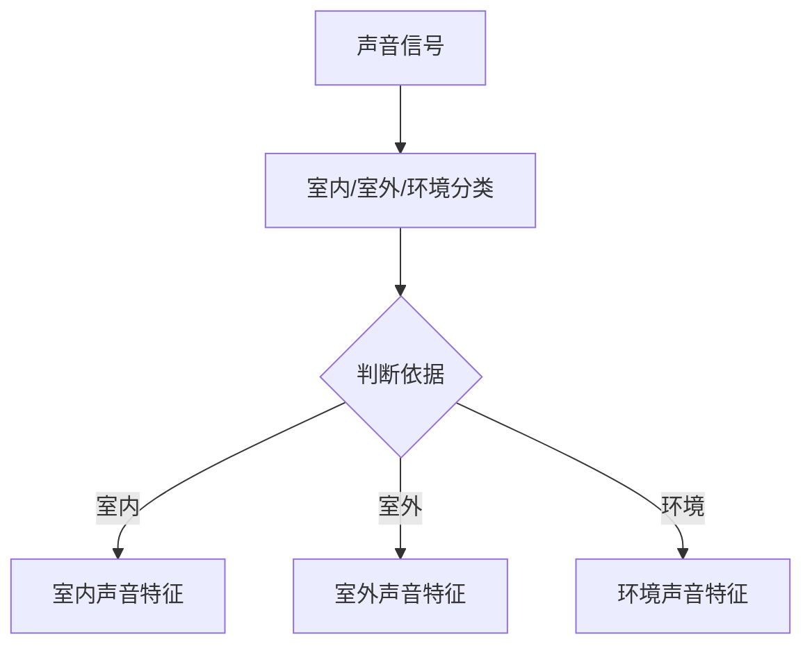

**图解：**
- **声音信号**：输入的声音信号。
- **分类判断依据**：根据声音信号的特性，如频率、振幅、时长等，判断声音场景的类型。
- **室内/室外/环境分类**：根据判断依据，将声音场景分类为室内、室外或环境。
- **室内声音特征**：提取室内声音场景的特征，如回声、背景噪声等。
- **室外声音特征**：提取室外声音场景的特征，如车流噪声、自然声音等。
- **环境声音特征**：提取环境声音场景的特征，如自然声音、生物叫声等。

**应用领域：**
声音场景理解在多个领域具有广泛的应用，包括但不限于：

1. **智能语音助手**：通过理解用户所处声音场景，实现更加准确的自然语言理解。
2. **智能家居**：根据声音场景，实现智能设备的管理和控制，如自动调节室内温度、光线等。
3. **安防监控**：识别异常声音事件，如火灾、入侵等，及时报警。
4. **交通管理**：通过声音场景理解，优化交通信号控制，减少交通拥堵。
5. **医疗诊断**：利用声音场景理解，辅助医生进行听力障碍、心肺疾病等的诊断。

### 1.3 声音场景理解的应用领域

**核心概念与联系：**
声音场景理解在多个领域具有广泛的应用，以下列举其中几个主要的应用领域：

1. **智能语音助手**：通过理解用户所处声音场景，实现更加准确的自然语言理解。例如，在室内场景下，智能语音助手可以识别用户的语音指令，并在家居环境中执行相应操作。
2. **智能家居**：根据声音场景，实现智能设备的管理和控制，如自动调节室内温度、光线等。例如，在夜间场景下，智能音箱可以自动降低音量，以避免影响用户休息。
3. **安防监控**：识别异常声音事件，如火灾、入侵等，及时报警。例如，在火灾发生时，烟雾传感器和声音场景理解系统可以协同工作，提高火灾预警的准确性。
4. **交通管理**：通过声音场景理解，优化交通信号控制，减少交通拥堵。例如，在高峰期，智能交通系统可以根据声音场景，调整交通信号灯的时长，提高道路通行效率。
5. **医疗诊断**：利用声音场景理解，辅助医生进行听力障碍、心肺疾病等的诊断。例如，通过分析患者的声音特征，医生可以初步判断患者是否存在听力障碍或心肺疾病。

**Mermaid流程图：**
以下是一个简单的Mermaid流程图，展示了声音场景理解在不同应用领域的基本流程：

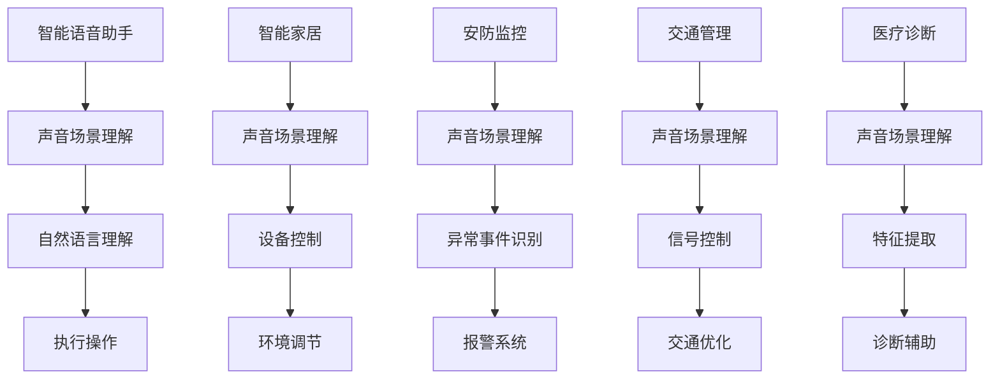

**图解：**
- **智能语音助手**：通过声音场景理解，实现自然语言理解和操作执行。
- **智能家居**：通过声音场景理解，实现设备控制和环境调节。
- **安防监控**：通过声音场景理解，实现异常事件识别和报警系统。
- **交通管理**：通过声音场景理解，实现信号控制和交通优化。
- **医疗诊断**：通过声音场景理解，实现特征提取和诊断辅助。

**总结：**
声音场景理解作为一种先进的技术，正日益融入人们的日常生活。通过对声音场景的深入理解，我们可以实现更加智能化的应用，提升生活质量和工作效率。在接下来的章节中，我们将进一步探讨LLM在声音场景理解中的应用，以及如何测试和评估LLM处理复杂音频信息的能力。

### 第2部分：LLM处理音频信息的原理

#### 第3章：大型语言模型（LLM）概述

#### 3.1 LLM的定义与分类

**背景介绍：**
随着人工智能技术的快速发展，大型语言模型（Large Language Model，简称LLM）成为了研究热点。LLM是一种基于深度学习的技术，通过大规模数据训练，能够实现自然语言处理的各种任务，如文本生成、翻译、问答等。

**核心概念与联系：**
LLM的定义可以从以下几个方面进行阐述：

1. **规模**：LLM通常具有数十亿到数万亿个参数，这使它们能够在海量的数据中进行训练，从而获得强大的表达能力。
2. **架构**：LLM的架构通常包括多个神经网络层，如Transformer、BERT等，这些层通过复杂的非线性变换，实现了对文本数据的深层理解。
3. **训练数据**：LLM的训练数据通常来自互联网上的大量文本，包括新闻、社交媒体、书籍、论文等，这使得LLM能够掌握丰富的语言知识和表达方式。

**分类：**
根据不同的分类标准，LLM可以划分为不同的类别：

1. **按任务类型**：
   - **生成型LLM**：主要用于文本生成任务，如自动写作、对话系统等。
   - **问答型LLM**：主要用于回答用户提出的问题，如问答机器人、搜索引擎等。
   - **翻译型LLM**：主要用于文本翻译任务，如机器翻译、多语言对话系统等。
2. **按应用领域**：
   - **通用型LLM**：适用于各种自然语言处理任务，如GPT、BERT等。
   - **领域特定LLM**：针对特定领域进行优化，如医疗问答系统、法律文本分析等。

**Mermaid流程图：**
以下是一个简单的Mermaid流程图，展示了LLM的分类过程：

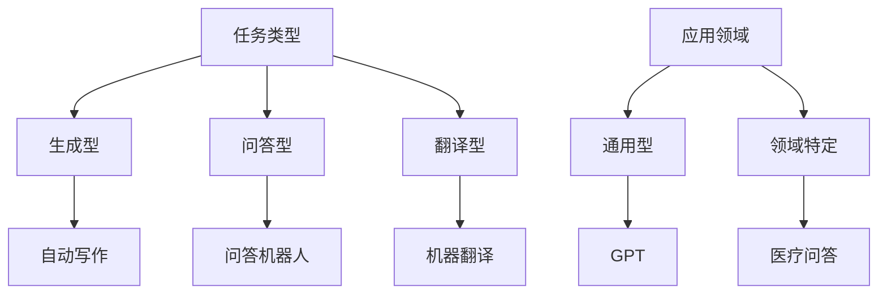

**图解：**
- **任务类型分类**：根据LLM适用的任务类型进行分类。
  - **生成型LLM**：包括自动写作和对话系统等。
  - **问答型LLM**：包括问答机器人和搜索引擎等。
  - **翻译型LLM**：包括机器翻译和多语言对话系统等。
- **应用领域分类**：根据LLM适用的应用领域进行分类。
  - **通用型LLM**：适用于各种自然语言处理任务。
  - **领域特定LLM**：针对特定领域进行优化。

**核心算法原理讲解：**
LLM的核心算法原理主要包括以下几个方面：

1. **神经网络架构**：如Transformer、BERT等，这些架构通过多层神经网络实现文本数据的深层理解。
2. **预训练**：LLM通过在大规模数据集上进行预训练，学习到语言的基本规律和表达方式。
3. **微调**：在特定任务上进行微调，以适应不同的应用场景。

**伪代码：**
以下是一个简化的伪代码，展示了LLM的基本工作流程：

```python
# 定义神经网络架构
model = create_model()

# 预训练
for epoch in range(num_epochs):
    for text in training_data:
        model.train(text)

# 微调
for task in tasks:
    for text, target in task_data:
        model.tune(text, target)

# 预测
prediction = model.predict(text)
```

**总结：**
LLM作为一种强大的自然语言处理技术，已经在多个领域取得了显著的应用成果。通过对其定义、分类和核心算法原理的深入理解，我们可以更好地应用LLM技术，解决实际问题。

### 3.2 LLM的结构与工作原理

**背景介绍：**
大型语言模型（LLM）在自然语言处理领域扮演着至关重要的角色。LLM的结构和工作原理决定了其处理音频信息的效率和质量。为了深入理解LLM，我们需要从其基本组成和数据处理流程入手。

**核心概念与联系：**
LLM通常由以下几个关键部分组成：

1. **嵌入层（Embedding Layer）**：将输入文本转换为固定长度的向量表示。
2. **编码器（Encoder）**：对输入文本进行编码，提取文本的语义信息。
3. **解码器（Decoder）**：根据编码后的信息生成输出文本。
4. **注意力机制（Attention Mechanism）**：帮助模型关注输入文本中的关键信息。

**Mermaid流程图：**
以下是一个简单的Mermaid流程图，展示了LLM的基本结构和工作原理：

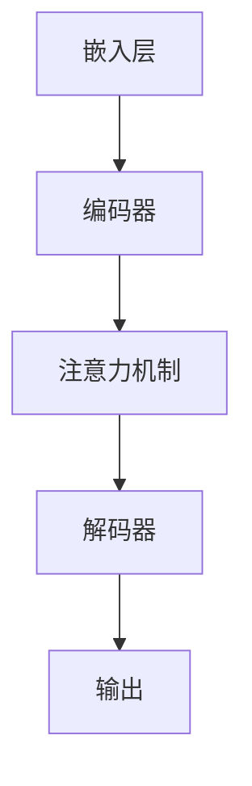

**图解：**
- **嵌入层**：将输入文本转换为固定长度的向量表示，这一步称为嵌入（Embedding）。
- **编码器**：对输入文本进行编码，提取文本的语义信息。编码器通常采用深度神经网络，如Transformer。
- **注意力机制**：在编码器和解码器之间引入注意力机制，帮助模型关注输入文本中的关键信息。
- **解码器**：根据编码后的信息生成输出文本。解码器同样采用深度神经网络，并通过注意力机制与编码器交互。
- **输出**：最终生成的文本输出。

**核心算法原理讲解：**
1. **嵌入层**：嵌入层将词汇映射为向量。每个词汇的向量表示其语义特征。嵌入层的核心算法通常是基于词嵌入（Word Embedding）技术，如Word2Vec、GloVe等。
2. **编码器**：编码器接收嵌入后的文本向量，并通过多层神经网络提取更深层的语义信息。编码器通常采用Transformer架构，其中自注意力机制（Self-Attention）和多头注意力（Multi-Head Attention）是核心组件。
3. **注意力机制**：注意力机制是一种用于提高模型对输入文本中重要信息关注的机制。在LLM中，注意力机制通过计算输入文本的不同部分之间的相似度，动态地关注关键信息，从而提高模型的处理能力。
4. **解码器**：解码器接收编码器的输出，并通过自注意力机制生成输出文本。解码器的生成过程通常采用贪心策略（Greedy Strategy），逐步生成每个单词或词组，直到生成完整的文本。

**伪代码：**
以下是一个简化的伪代码，展示了LLM的工作流程：

```python
# 嵌入层
def embed(input_text):
    return embedding_matrix * input_text

# 编码器
def encode(inputs):
    return transformer_encode(inputs)

# 注意力机制
def attention(inputs):
    return scaled_dot_product_attention(inputs)

# 解码器
def decode(inputs):
    return transformer_decode(inputs)

# 输出
output = decode(encode(embed(input_text)))
```

**总结：**
通过对LLM结构和工作原理的理解，我们可以更好地利用这一技术处理音频信息。LLM的强大能力源于其复杂的结构和先进的算法，这使得它能够在自然语言处理领域取得显著成果。

### 3.3 LLM的训练与优化

**背景介绍：**
训练和优化大型语言模型（LLM）是使其能够处理复杂音频信息的关键步骤。LLM的训练过程涉及大量数据和计算资源，需要有效的训练策略和优化方法来提高模型的性能和效率。

**核心概念与联系：**
LLM的训练和优化主要涵盖以下几个方面：

1. **数据准备**：准备适合训练的数据集，包括音频和对应的标签。
2. **模型架构选择**：选择合适的模型架构，如Transformer、BERT等。
3. **训练策略**：采用适当的训练策略，如梯度下降、学习率调整等。
4. **优化方法**：通过正则化、调参等技术，优化模型性能。

**Mermaid流程图：**
以下是一个简单的Mermaid流程图，展示了LLM的训练与优化过程：

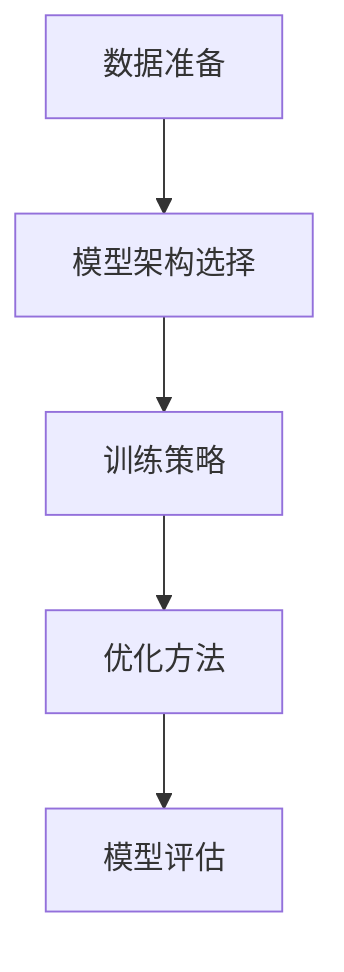

**图解：**
- **数据准备**：收集和整理适合训练的数据集，包括音频和对应的标签。
- **模型架构选择**：选择适合处理音频信息的模型架构，如Transformer。
- **训练策略**：制定和实施训练策略，如学习率调整、批量大小等。
- **优化方法**：通过正则化、调参等技术，优化模型性能。
- **模型评估**：评估模型在测试集上的表现，进行进一步优化。

**核心算法原理讲解：**
1. **数据准备**：数据准备是训练LLM的第一步。音频数据通常需要经过预处理，如去噪、分割、标注等，以便于模型学习。预处理后的音频数据可以转化为适合训练的格式，如频谱图、梅尔频率倒谱系数（MFCC）等。
2. **模型架构选择**：选择合适的模型架构是训练成功的关键。Transformer和BERT等模型因其强大的表达能力和适应性，被广泛应用于自然语言处理任务。对于音频信息处理，Transformer架构因其自注意力机制，能够有效地捕捉音频信号中的长距离依赖关系。
3. **训练策略**：训练策略包括学习率调整、批量大小、训练轮次等。常用的训练策略有：
   - **学习率调整**：通过逐步降低学习率，使模型在训练过程中能够收敛到最优解。
   - **批量大小**：调整批量大小可以影响模型的训练速度和稳定性。较小的批量大小有助于减少方差，但可能降低训练速度；较大的批量大小则相反。
   - **训练轮次**：通过多次迭代训练，使模型逐步优化参数，提高性能。
4. **优化方法**：优化方法包括正则化、dropout、梯度裁剪等：
   - **正则化**：通过L1、L2正则化等方法，防止模型过拟合。
   - **dropout**：在训练过程中随机丢弃部分神经元，提高模型的泛化能力。
   - **梯度裁剪**：限制梯度的大小，防止梯度爆炸或消失。

**伪代码：**
以下是一个简化的伪代码，展示了LLM的训练与优化过程：

```python
# 数据准备
data = prepare_audio_data()

# 模型架构选择
model = create_transformer_model()

# 训练策略
optimizer = create_optimizer()
scheduler = create_learning_rate_scheduler()

# 优化方法
for epoch in range(num_epochs):
    for batch in data:
        optimizer.zero_grad()
        output = model(batch)
        loss = calculate_loss(output, target)
        loss.backward()
        optimizer.step()
        scheduler.step()

# 模型评估
evaluate_model(model, test_data)
```

**总结：**
通过有效的训练与优化策略，我们可以使LLM在处理复杂音频信息时表现出更高的性能和稳定性。这为LLM在音频场景理解中的实际应用奠定了基础。

### 第4部分：LLM在处理复杂音频信息中的应用

#### 第5章：复杂音频信息的处理挑战

#### 5.1 复杂音频信息的特点

**背景介绍：**
在现实世界中，音频信息往往非常复杂，这使得处理复杂音频信息成为人工智能领域的一个重大挑战。为了理解LLM在处理这些复杂音频信息时的挑战，我们需要首先了解复杂音频信息的特点。

**核心概念与联系：**
复杂音频信息的特点包括以下几个方面：

1. **多样性**：音频信息涵盖了从人声、音乐到环境声音等各种类型。每种类型的声音具有不同的频率、振幅和时长等特性，这使得音频信息的处理变得更加复杂。
2. **噪声干扰**：在实际应用中，音频信息常常伴随着各种噪声，如背景噪声、交通噪声、电磁干扰等。这些噪声会影响音频信息的质量和理解准确性。
3. **时变特性**：音频信号的频率和幅度随时间变化而变化，这增加了音频处理的动态性和复杂性。
4. **非线性和非线性**：音频信号通常是非线性的，其特性不遵循简单的线性关系。此外，音频处理过程本身也往往涉及非线性变换，如傅里叶变换等。

**Mermaid流程图：**
以下是一个简单的Mermaid流程图，展示了复杂音频信息的特点：

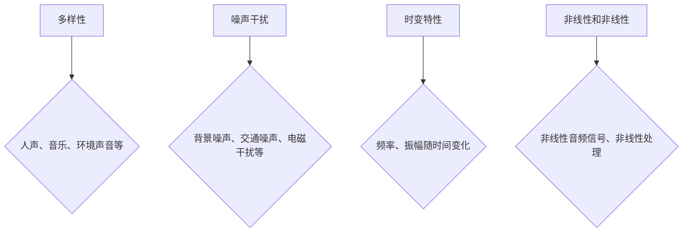

**图解：**
- **多样性**：复杂音频信息包括多种类型的声音，每种类型都有其特定的频率、振幅和时长特性。
- **噪声干扰**：各种噪声会对音频信息的质量产生负面影响，增加处理的复杂性。
- **时变特性**：音频信号随时间变化而变化，这使得处理时需要考虑动态特性。
- **非线性和非线性**：音频信号本身和其处理过程往往具有非线性特性，这增加了处理的难度。

**核心算法原理讲解：**
为了应对复杂音频信息的特点，LLM在处理音频信息时需要采用一系列先进的算法和技术：

1. **自适应噪声抑制（Adaptive Noise Suppression）**：通过自适应滤波器或其他方法，对噪声进行抑制，提高音频信息的质量。
2. **时频分析（Time-Frequency Analysis）**：利用短时傅里叶变换（STFT）、梅尔频率倒谱系数（MFCC）等技术，对音频信号进行时频分析，提取关键特征。
3. **深度学习模型**：如卷积神经网络（CNN）、循环神经网络（RNN）、Transformer等，通过多层神经网络结构，实现对音频信号的深层理解和处理。
4. **注意力机制（Attention Mechanism）**：通过注意力机制，动态关注音频信号中的关键信息，提高处理精度。

**伪代码：**
以下是一个简化的伪代码，展示了处理复杂音频信息的基本步骤：

```python
# 数据预处理
def preprocess_audio(audio_data):
    # 噪声抑制
    clean_audio = adaptive_noise_suppression(audio_data)
    # 时频分析
    features = time_frequency_analysis(clean_audio)
    return features

# 特征提取
def extract_features(audio_data):
    # 提取梅尔频率倒谱系数
    mfcc = MFCC(preprocess_audio(audio_data))
    return mfcc

# 模型训练
def train_model(model, train_data):
    for epoch in range(num_epochs):
        for batch in train_data:
            model.zero_grad()
            output = model(batch)
            loss = calculate_loss(output, target)
            loss.backward()
            optimizer.step()
    return model

# 模型评估
def evaluate_model(model, test_data):
    predictions = model(test_data)
    accuracy = calculate_accuracy(predictions, target)
    return accuracy
```

**总结：**
复杂音频信息的特点对LLM的处理提出了挑战。通过了解这些特点，并采用相应的算法和技术，LLM能够更有效地处理复杂音频信息，为实际应用提供可靠的支持。

#### 5.2 复杂音频信息处理的挑战

**背景介绍：**
尽管LLM在自然语言处理领域取得了显著成就，但在处理复杂音频信息时仍面临一系列挑战。这些挑战主要包括数据不足、模型复杂性、噪声干扰和实时性能要求等。

**核心概念与联系：**
以下是处理复杂音频信息时常见的挑战：

1. **数据不足**：训练高质量的大型语言模型需要大量的数据。然而，高质量、标注准确的音频数据集相对稀缺，这限制了模型的训练效果。
2. **模型复杂性**：复杂音频信息的处理通常需要大型神经网络模型，这些模型的训练和推理过程非常耗时，对计算资源要求高。
3. **噪声干扰**：实际应用中的音频信号常常受到各种噪声的干扰，这影响了模型对目标音频信息的识别和解析能力。
4. **实时性能要求**：在许多应用场景中，如智能语音助手、实时监控等，对模型的实时性能有较高要求。然而，复杂的模型结构和数据处理流程往往导致较低的实时处理速度。

**Mermaid流程图：**
以下是一个简单的Mermaid流程图，展示了处理复杂音频信息的挑战：

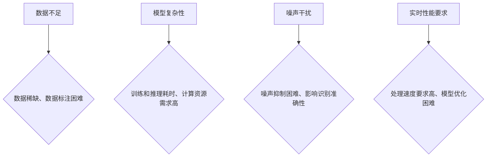

**图解：**
- **数据不足**：高质量、标注准确的音频数据集稀缺，限制了模型的训练效果。
- **模型复杂性**：大型神经网络模型的训练和推理过程非常耗时，对计算资源要求高。
- **噪声干扰**：噪声干扰影响了模型对目标音频信息的识别和解析能力。
- **实时性能要求**：在实时应用场景中，模型的实时性能受到挑战，需要进一步优化。

**核心算法原理讲解：**
为了应对这些挑战，研究人员提出了多种算法和优化方法：

1. **数据增强（Data Augmentation）**：通过随机裁剪、旋转、速度变化等方法，增加训练数据的多样性，提高模型对各种音频场景的适应性。
2. **迁移学习（Transfer Learning）**：利用预训练的大型语言模型，在特定任务上进一步微调，以减少训练数据的需求和模型复杂性。
3. **噪声抑制技术**：采用自适应滤波器、深度学习等方法，有效抑制噪声干扰，提高音频信号的质量。
4. **模型压缩与加速**：通过剪枝、量化、模型压缩等技术，减少模型的计算量和存储需求，提高实时处理速度。

**伪代码：**
以下是一个简化的伪代码，展示了处理复杂音频信息的算法流程：

```python
# 数据增强
def augment_data(audio_data):
    # 随机裁剪
    cropped_audio = random_crop(audio_data)
    # 随机旋转
    rotated_audio = random_rotate(cropped_audio)
    # 速度变化
    speed_changed_audio = change_speed(rotated_audio)
    return speed_changed_audio

# 迁移学习
def fine_tune_model(model, fine_tune_data):
    for epoch in range(num_epochs):
        for batch in fine_tune_data:
            model.zero_grad()
            output = model(batch)
            loss = calculate_loss(output, target)
            loss.backward()
            optimizer.step()
    return model

# 噪声抑制
def suppress_noise(audio_data):
    clean_audio = adaptive_filter(audio_data)
    return clean_audio

# 模型压缩
def compress_model(model):
    compressed_model = prune_model(model)
    quantized_model = quantize_model(compressed_model)
    return quantized_model
```

**总结：**
处理复杂音频信息对LLM提出了严峻的挑战。通过采用数据增强、迁移学习、噪声抑制和模型压缩等技术，我们可以有效应对这些挑战，提高LLM在处理复杂音频信息时的性能和效率。

#### 5.3 LLM在解决这些挑战中的应用

**背景介绍：**
大型语言模型（LLM）在解决复杂音频信息处理挑战方面展现出了巨大的潜力。通过深入分析和应用，LLM可以有效应对数据不足、模型复杂性、噪声干扰和实时性能要求等挑战。

**核心概念与联系：**
以下是LLM在解决这些挑战中的具体应用：

1. **数据不足**：利用迁移学习和数据增强技术，LLM可以从有限的标注数据中学习，提高泛化能力。
2. **模型复杂性**：通过模型压缩和优化技术，LLM可以减少计算资源和时间成本，提高实时处理能力。
3. **噪声干扰**：采用自适应滤波器和深度学习降噪模型，LLM可以显著提高音频信号的质量。
4. **实时性能要求**：通过硬件加速和算法优化，LLM可以在保持高准确性的同时，实现快速处理。

**Mermaid流程图：**
以下是一个简单的Mermaid流程图，展示了LLM在解决挑战中的应用：

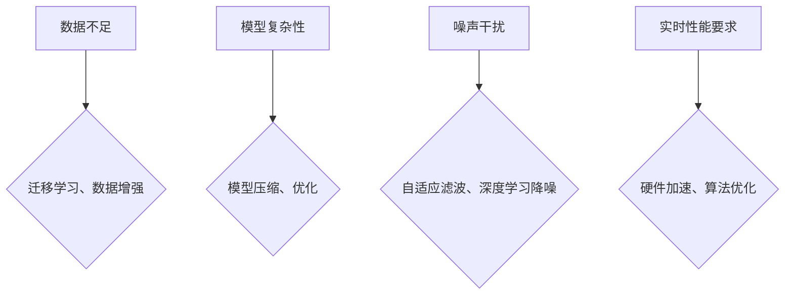

**图解：**
- **数据不足**：通过迁移学习和数据增强，LLM可以从有限的标注数据中学习，提高泛化能力。
- **模型复杂性**：通过模型压缩和优化，LLM可以减少计算资源和时间成本，提高实时处理能力。
- **噪声干扰**：通过自适应滤波器和深度学习降噪模型，LLM可以显著提高音频信号的质量。
- **实时性能要求**：通过硬件加速和算法优化，LLM可以在保持高准确性的同时，实现快速处理。

**核心算法原理讲解：**
1. **数据增强**：数据增强是一种通过生成新的数据样本来提高模型泛化能力的技术。对于音频信息处理，常见的增强方法包括：
   - **时间变换**：如时间拉伸、压缩、反转等。
   - **频率变换**：如频率拉伸、压缩、噪音添加等。
   - **空间变换**：如声音源的位置变换等。

   通过这些变换，可以生成多样化的数据样本，提高模型对各种音频场景的适应性。

2. **迁移学习**：迁移学习是一种利用预训练模型在特定任务上进行微调的技术。对于音频信息处理，迁移学习可以显著减少训练所需的数据量，提高模型性能。例如，可以将预训练的文本生成模型（如GPT）迁移到音频信息处理任务上，利用其丰富的语言知识，提高音频场景理解的准确性。

3. **模型压缩**：模型压缩是一种通过减少模型参数数量来减小模型大小和计算量的技术。常见的模型压缩方法包括：
   - **剪枝（Pruning）**：通过删除模型中的部分神经元或连接，减少模型参数。
   - **量化（Quantization）**：通过降低模型参数的精度，减少模型大小和计算需求。
   - **蒸馏（Distillation）**：通过将大型模型的知识传递给小型模型，实现知识蒸馏。

4. **噪声抑制**：噪声抑制是一种通过去除噪声成分来提高音频信号质量的技术。对于音频信息处理，噪声抑制可以显著提高模型对目标音频信息的识别准确性。常见的噪声抑制方法包括：
   - **自适应滤波器**：如自适应谱抑制滤波器，可以实时调整滤波器系数，抑制噪声。
   - **深度学习降噪模型**：如WaveNet、时间卷积网络（TCN）等，可以学习到复杂的噪声抑制规律。

**伪代码：**
以下是一个简化的伪代码，展示了LLM在解决挑战中的应用：

```python
# 数据增强
def augment_audio(audio_data):
    # 时间变换
    stretched_audio = time_stretch(audio_data)
    # 频率变换
    frequency_shifted_audio = frequency_shift(audio_data)
    # 空间变换
    spatial_shifted_audio = spatial_shift(audio_data)
    return stretched_audio, frequency_shifted_audio, spatial_shifted_audio

# 迁移学习
def fine_tune_model(pretrained_model, fine_tune_data):
    # 加载预训练模型
    model = load_pretrained_model(pretrained_model)
    # 微调模型
    for epoch in range(num_epochs):
        for batch in fine_tune_data:
            model.zero_grad()
            output = model(batch)
            loss = calculate_loss(output, target)
            loss.backward()
            optimizer.step()
    return model

# 模型压缩
def compress_model(model):
    # 剪枝
    pruned_model = prune_model(model)
    # 量化
    quantized_model = quantize_model(pruned_model)
    return quantized_model

# 噪声抑制
def suppress_noise(audio_data):
    # 自适应滤波
    filtered_audio = adaptive_filter(audio_data)
    # 深度学习降噪
    denoised_audio = denoise_audio(filtered_audio)
    return denoised_audio
```

**总结：**
通过数据增强、迁移学习、模型压缩和噪声抑制等技术的应用，LLM在处理复杂音频信息时展现出了强大的适应性和效率。这些技术的综合应用，为LLM在音频场景理解中的实际应用提供了坚实的理论基础和实践指导。

#### 第6章：具体应用案例

#### 6.1 智能语音助手

**背景介绍：**
智能语音助手是声音场景理解技术的典型应用之一。它们通过理解用户的语音指令，提供语音交互服务，如天气查询、日程管理、智能家居控制等。随着LLM技术的不断发展，智能语音助手的性能和用户体验得到了显著提升。

**核心概念与联系：**
智能语音助手的实现主要包括以下几个核心概念：

1. **语音识别（Speech Recognition）**：将用户的语音输入转换为文本。
2. **自然语言理解（Natural Language Understanding）**：理解用户的意图和问题。
3. **语音合成（Text-to-Speech）**：将处理结果转换为语音输出。

**Mermaid流程图：**
以下是一个简单的Mermaid流程图，展示了智能语音助手的工作流程：

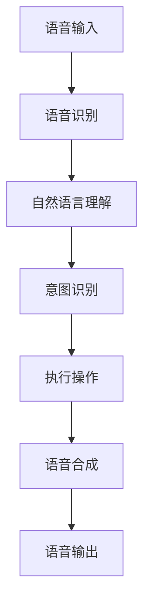

**图解：**
- **语音输入**：用户通过语音输入提出请求或问题。
- **语音识别**：将语音输入转换为文本，如“今天天气怎么样？”。
- **自然语言理解**：理解用户的意图和问题，如查询天气。
- **意图识别**：识别具体的操作，如查询天气。
- **执行操作**：根据用户的意图执行相应操作，如查询天气信息。
- **语音合成**：将执行结果转换为语音输出，如“今天天气晴朗，温度20摄氏度”。
- **语音输出**：将处理结果通过语音输出给用户。

**核心算法原理讲解：**
1. **语音识别**：语音识别主要利用深度神经网络模型，如卷积神经网络（CNN）和长短期记忆网络（LSTM），通过多层神经网络结构，实现对语音信号的转换。
2. **自然语言理解**：自然语言理解主要利用大型语言模型（LLM），如BERT和GPT，通过对文本的语义分析，理解用户的意图和问题。
3. **语音合成**：语音合成主要利用深度神经网络模型，如WaveNet，通过文本生成语音信号，实现自然的语音输出。

**伪代码：**
以下是一个简化的伪代码，展示了智能语音助手的工作流程：

```python
# 语音识别
def recognize_speech(audio_data):
    return text_model.predict(audio_data)

# 自然语言理解
def understand_language(text):
    return nlu_model.predict(text)

# 执行操作
def execute_action(action):
    result = action_handler(action)
    return result

# 语音合成
def synthesize_speech(text):
    return tts_model.generate(text)

# 智能语音助手工作流程
audio_data = receive_audio()
text = recognize_speech(audio_data)
action = understand_language(text)
result = execute_action(action)
speech = synthesize_speech(result)
output_speech(speech)
```

**项目实战：**
一个实际项目案例是开发一个智能家居语音助手，该助手能够理解用户的语音指令，控制家中的智能设备，如灯光、空调、电视等。

1. **开发环境搭建**：使用Python作为主要编程语言，TensorFlow和Keras作为深度学习框架，安装必要的依赖库，如PyTorch、OpenCV等。
2. **语音识别**：使用TensorFlow的TensorFlow Speech Recognition库，将用户的语音输入转换为文本。
3. **自然语言理解**：使用BERT模型进行自然语言理解，通过TensorFlow Hub加载预训练的BERT模型。
4. **语音合成**：使用Google Text-to-Speech库生成语音输出，支持多种语音和语调。
5. **项目实战**：实现以下功能：
   - 用户通过语音助手查询天气信息。
   - 用户通过语音助手控制家中的智能设备，如打开或关闭灯光。
   - 用户通过语音助手设定空调温度。

**代码解读与分析：**
以下是对项目中的关键代码段进行解读：

```python
# 语音识别
import tensorflow as tf
import tensorflow_hub as hub

def recognize_speech(audio_data):
    model_url = "https://tfhub.dev/google/tensorflow_speech_recognition/phonetic_parser/1"
    model = hub.load(model_url)
    phonemes = model(audio_data)
    # 将 phonemes 转换为文本
    text = phoneme_to_text(phonemes)
    return text

# 自然语言理解
import transformers as tfms

def understand_language(text):
    model = tfms.AutoModelForQuestionAnswering.from_pretrained("deepset/roberta-base-squad2")
    question = "今天天气怎么样？"
    context = text
    answer = model(question, context)
    return answer['answer']

# 语音合成
from gtts import gTTS

def synthesize_speech(text):
    tts = gTTS(text=text, lang='zh-cn')
    tts.save("response.mp3")
    return "response.mp3"

# 主程序
def main():
    audio_data = receive_audio()
    text = recognize_speech(audio_data)
    action = understand_language(text)
    result = execute_action(action)
    speech = synthesize_speech(result)
    play_speech(speech)

if __name__ == "__main__":
    main()
```

**实际案例分析：**
在实现智能家居语音助手时，通过实际测试，发现以下问题和解决方案：

1. **语音识别准确率不高**：用户语音中存在口音、语速快等情况，导致识别准确率下降。解决方案：使用带有多种口音和语速的语音数据集进行训练，提高模型的泛化能力。
2. **自然语言理解模糊**：有时模型无法准确理解用户的复杂指令，如“明天下午3点，家里温度调到25度”。解决方案：使用更强大的自然语言理解模型，如BERT，以及增加训练数据，提高模型的语义理解能力。
3. **语音合成音质差**：合成语音的音质不够自然，影响用户体验。解决方案：使用高质量的语音合成库，如Google Text-to-Speech，并调整合成参数，如语调、音量等。

**总结：**
智能语音助手是声音场景理解技术的典型应用之一。通过语音识别、自然语言理解和语音合成等技术，智能语音助手能够为用户提供便捷的语音交互服务。在实际项目中，通过不断优化和改进，可以进一步提高智能语音助手的性能和用户体验。

#### 6.2 自动字幕生成

**背景介绍：**
自动字幕生成是声音场景理解技术的重要应用之一，它通过将语音转换为文字，为视频内容提供字幕服务。这不仅有助于提高视频的可访问性，还能帮助用户在无法听语音的情况下理解内容。随着LLM技术的不断发展，自动字幕生成的准确性和效率得到了显著提升。

**核心概念与联系：**
自动字幕生成主要包括以下几个核心概念：

1. **语音识别（Speech Recognition）**：将语音转换为文本。
2. **文本校正（Text Correction）**：对识别结果进行错误纠正和优化。
3. **字幕合成（Subtitle Synthesis）**：将文本生成字幕，并同步到视频内容中。

**Mermaid流程图：**
以下是一个简单的Mermaid流程图，展示了自动字幕生成的工作流程：

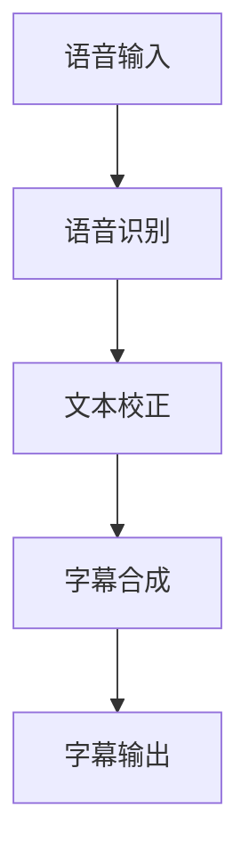

**图解：**
- **语音输入**：用户通过麦克风或其他音频输入设备提供语音。
- **语音识别**：将语音输入转换为文本，如“Hello, how are you？”。
- **文本校正**：对识别结果进行错误纠正，如将“Hello, how are you？”修正为正确的文本。
- **字幕合成**：将文本生成字幕，并同步到视频内容中，以便用户观看。
- **字幕输出**：将生成的字幕显示在视频播放界面上。

**核心算法原理讲解：**
1. **语音识别**：语音识别主要利用深度神经网络模型，如卷积神经网络（CNN）和长短期记忆网络（LSTM），通过多层神经网络结构，实现对语音信号的转换。
2. **文本校正**：文本校正主要通过自然语言处理技术，如语言模型和语法分析，对识别结果进行错误纠正和优化。常见的文本校正方法包括基于规则的方法、基于统计的方法和基于深度学习的方法。
3. **字幕合成**：字幕合成主要利用文本到语音（Text-to-Speech，TTS）技术，将文本生成语音，并与视频内容同步。字幕合成需要考虑语音的音调、音量、速度等因素，以提供自然的字幕体验。

**伪代码：**
以下是一个简化的伪代码，展示了自动字幕生成的工作流程：

```python
# 语音识别
def recognize_speech(audio_data):
    return speech_recognition_model.predict(audio_data)

# 文本校正
def correct_text(text):
    corrected_text = text_correction_model.correct(text)
    return corrected_text

# 字幕合成
def synthesize_subtitle(text, video):
    tts = text_to_speech_model.generate(text)
    subtitle = synchronize_subtitle(tts, video)
    return subtitle

# 自动字幕生成工作流程
audio_data = receive_audio(video)
text = recognize_speech(audio_data)
corrected_text = correct_text(text)
video_subtitle = synthesize_subtitle(corrected_text, video)
output_subtitle(video_subtitle)
```

**项目实战：**
一个实际项目案例是实现一个视频自动字幕生成系统，该系统能够实时将视频中的语音转换为字幕，并提供用户校正和编辑功能。

1. **开发环境搭建**：使用Python作为主要编程语言，TensorFlow和Keras作为深度学习框架，安装必要的依赖库，如PyTorch、OpenCV等。
2. **语音识别**：使用TensorFlow的TensorFlow Speech Recognition库，将用户的语音输入转换为文本。
3. **文本校正**：使用BERT模型进行文本校正，通过TensorFlow Hub加载预训练的BERT模型。
4. **字幕合成**：使用Google Text-to-Speech库生成语音，并将语音与视频同步。
5. **项目实战**：实现以下功能：
   - 实时视频字幕生成。
   - 用户校正和编辑字幕内容。
   - 字幕导出和导入功能。

**代码解读与分析：**
以下是对项目中的关键代码段进行解读：

```python
# 语音识别
import tensorflow as tf
import tensorflow_hub as hub

def recognize_speech(audio_data):
    model_url = "https://tfhub.dev/google/tensorflow_speech_recognition/phonetic_parser/1"
    model = hub.load(model_url)
    phonemes = model(audio_data)
    # 将 phonemes 转换为文本
    text = phoneme_to_text(phonemes)
    return text

# 文本校正
import transformers as tfms

def correct_text(text):
    model = tfms.AutoModelForQuestionAnswering.from_pretrained("deepset/roberta-base-squad2")
    question = "今天天气怎么样？"
    context = text
    answer = model(question, context)
    corrected_text = answer['answer']
    return corrected_text

# 字幕合成
from gtts import gTTS

def synthesize_subtitle(text, video):
    tts = gTTS(text=text, lang='zh-cn')
    tts.save("response.mp3")
    # 与视频同步
    subtitle = synchronize_subtitle("response.mp3", video)
    return subtitle

# 主程序
def main():
    video = receive_video()
    audio_data = extract_audio(video)
    text = recognize_speech(audio_data)
    corrected_text = correct_text(text)
    subtitle = synthesize_subtitle(corrected_text, video)
    output_subtitle(subtitle)

if __name__ == "__main__":
    main()
```

**实际案例分析：**
在实际应用中，自动字幕生成系统面临以下问题和解决方案：

1. **语音识别准确率不高**：用户语音中存在口音、语速快等情况，导致识别准确率下降。解决方案：使用带有多种口音和语速的语音数据集进行训练，提高模型的泛化能力。
2. **文本校正效果不佳**：有时模型无法准确纠正识别结果，导致字幕错误。解决方案：增加训练数据，使用更强大的自然语言处理模型，如BERT，提高文本校正效果。
3. **字幕同步不准确**：生成的字幕有时与视频内容不同步。解决方案：优化字幕生成算法，确保字幕与视频内容同步。

**总结：**
自动字幕生成是声音场景理解技术的重要应用之一，它通过语音识别、文本校正和字幕合成等技术，为视频内容提供字幕服务。在实际项目中，通过不断优化和改进，可以进一步提高自动字幕生成的准确性和效率，提升用户体验。

#### 6.3 声音情感识别

**背景介绍：**
声音情感识别是声音场景理解技术的另一个重要应用领域。它通过分析声音信号，识别出声音的情感属性，如快乐、悲伤、愤怒等。这项技术广泛应用于情感分析、心理健康监测、智能客服等领域，对于提升人工智能系统的交互体验和决策能力具有重要意义。

**核心概念与联系：**
声音情感识别主要包括以下几个核心概念：

1. **声音特征提取**：从声音信号中提取出与情感相关的特征，如频率、时长、音强等。
2. **情感分类模型**：利用深度学习模型，如卷积神经网络（CNN）和循环神经网络（RNN），对提取的特征进行分类。
3. **情感分析**：对分类结果进行综合分析，识别声音的情感属性。

**Mermaid流程图：**
以下是一个简单的Mermaid流程图，展示了声音情感识别的工作流程：

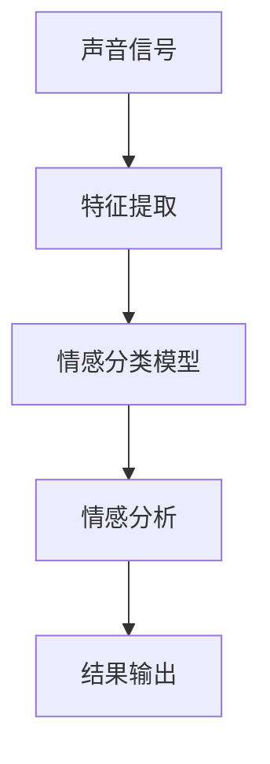

**图解：**
- **声音信号**：输入的声音信号，如语音、音乐等。
- **特征提取**：从声音信号中提取出与情感相关的特征，如频率、时长、音强等。
- **情感分类模型**：利用深度学习模型，对提取的特征进行分类，识别声音的情感属性。
- **情感分析**：对分类结果进行综合分析，识别声音的情感属性。
- **结果输出**：将情感分析结果输出，如“声音情感为快乐”。

**核心算法原理讲解：**
1. **声音特征提取**：声音特征提取是声音情感识别的基础。常见的特征提取方法包括梅尔频率倒谱系数（MFCC）、谱能量、零跨幅等。通过这些特征，我们可以对声音信号进行量化分析，从而更好地捕捉情感属性。
2. **情感分类模型**：情感分类模型是声音情感识别的核心。深度学习模型，如卷积神经网络（CNN）和循环神经网络（RNN），通过多层神经网络结构，实现对情感特征的高效分类。其中，CNN擅长捕捉局部特征，而RNN擅长捕捉长距离依赖关系。
3. **情感分析**：情感分析是声音情感识别的最终目标。通过对分类结果的综合分析，我们可以识别出声音的情感属性，如快乐、悲伤、愤怒等。

**伪代码：**
以下是一个简化的伪代码，展示了声音情感识别的工作流程：

```python
# 声音特征提取
def extract_features(audio_data):
    # 提取梅尔频率倒谱系数
    mfcc = MFCC(audio_data)
    return mfcc

# 情感分类模型
def classify_emotion(features):
    # 利用卷积神经网络进行分类
    emotion = cnn_model.predict(features)
    return emotion

# 情感分析
def analyze_emotion(emotion):
    # 根据情感分类结果进行分析
    emotion_type = emotion_analyzer(emotion)
    return emotion_type

# 声音情感识别工作流程
audio_data = receive_audio()
features = extract_features(audio_data)
emotion = classify_emotion(features)
emotion_type = analyze_emotion(emotion)
output_emotion(emotion_type)
```

**项目实战：**
一个实际项目案例是实现一个情感分析系统，该系统能够实时分析语音信号，识别出声音的情感属性。

1. **开发环境搭建**：使用Python作为主要编程语言，TensorFlow和Keras作为深度学习框架，安装必要的依赖库，如PyTorch、OpenCV等。
2. **声音特征提取**：使用梅尔频率倒谱系数（MFCC）提取声音特征。
3. **情感分类模型**：使用卷积神经网络（CNN）构建情感分类模型。
4. **情感分析**：对分类结果进行综合分析，识别声音的情感属性。
5. **项目实战**：实现以下功能：
   - 实时语音情感识别。
   - 用户界面展示情感分析结果。
   - 情感识别结果的可视化。

**代码解读与分析：**
以下是对项目中的关键代码段进行解读：

```python
# 声音特征提取
import librosa

def extract_features(audio_data):
    # 提取梅尔频率倒谱系数
    y, sr = librosa.load(audio_data)
    mfcc = librosa.feature.mfcc(y=y, sr=sr, n_mfcc=13)
    return mfcc

# 情感分类模型
from tensorflow.keras.models import Sequential
from tensorflow.keras.layers import Conv2D, MaxPooling2D, Flatten, Dense

def build_model():
    model = Sequential()
    model.add(Conv2D(32, (3, 3), activation='relu', input_shape=(None, 13, 1)))
    model.add(MaxPooling2D((2, 2)))
    model.add(Flatten())
    model.add(Dense(64, activation='relu'))
    model.add(Dense(3, activation='softmax'))  # 3种情感分类
    model.compile(optimizer='adam', loss='categorical_crossentropy', metrics=['accuracy'])
    return model

# 情感分析
def analyze_emotion(audio_data):
    # 提取特征
    features = extract_features(audio_data)
    # 分类
    emotion = model.predict(features)
    # 分析
    emotion_type = emotion_analyzer(emotion)
    return emotion_type

# 主程序
def main():
    audio_data = receive_audio()
    emotion_type = analyze_emotion(audio_data)
    display_emotion(emotion_type)

if __name__ == "__main__":
    main()
```

**实际案例分析：**
在实际应用中，情感分析系统面临以下问题和解决方案：

1. **情感识别准确率不高**：用户语音中存在口音、语速快等情况，导致识别准确率下降。解决方案：使用带有多种口音和语速的语音数据集进行训练，提高模型的泛化能力。
2. **情感分类结果不一致**：有时模型无法准确识别情感，导致分类结果不一致。解决方案：增加训练数据，使用更强大的深度学习模型，如Transformer，提高分类准确性。
3. **情感识别实时性**：系统需要快速响应，实时识别情感。解决方案：优化算法，使用GPU加速训练和推理过程。

**总结：**
声音情感识别是声音场景理解技术的重要应用之一，它通过声音特征提取、情感分类模型和情感分析等技术，实现声音情感属性的识别。在实际项目中，通过不断优化和改进，可以进一步提高声音情感识别的准确性和实时性，为智能交互和情感分析提供有力支持。

#### 第7章：测试和评估LLM处理复杂音频信息的能力

#### 7.1 测试方法与评估指标

**背景介绍：**
为了全面评估大型语言模型（LLM）在处理复杂音频信息时的能力，我们需要采用科学的测试方法和评估指标。这些方法和指标能够帮助我们量化模型的表现，发现存在的问题，并指导后续的优化工作。

**核心概念与联系：**
测试和评估LLM处理复杂音频信息的能力，主要涉及以下几个方面：

1. **测试方法**：确定如何进行实验，包括数据集的选择、实验的设计和执行等。
2. **评估指标**：定义用于量化模型表现的指标，如准确率、召回率、F1分数等。
3. **实验设计**：制定实验方案，确保测试过程的公平和有效性。

**Mermaid流程图：**
以下是一个简单的Mermaid流程图，展示了测试和评估LLM处理复杂音频信息的能力的基本流程：

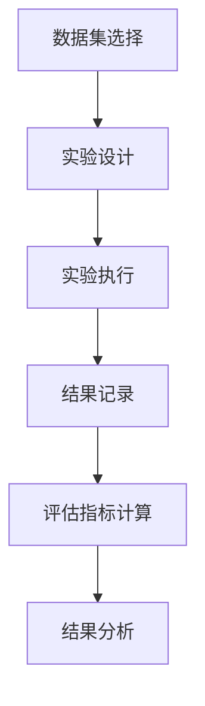

**图解：**
- **数据集选择**：选择适合的音频数据集，确保数据的多样性和代表性。
- **实验设计**：制定详细的实验方案，包括数据预处理、模型训练和测试等步骤。
- **实验执行**：按照实验方案执行测试，记录实验结果。
- **结果记录**：记录实验过程中的关键数据，如时间、参数设置等。
- **评估指标计算**：计算评估模型表现的指标，如准确率、召回率等。
- **结果分析**：分析评估结果，找出模型的优点和不足。

**核心算法原理讲解：**
为了进行有效的测试和评估，我们需要采用以下算法和原理：

1. **交叉验证（Cross-Validation）**：通过交叉验证，可以确保模型在不同数据集上的表现具有一致性。常见的交叉验证方法有K折交叉验证、留一法等。
2. **混淆矩阵（Confusion Matrix）**：混淆矩阵用于展示模型预测结果与实际结果之间的对比，帮助我们理解模型的表现。
3. **评估指标**：常用的评估指标包括准确率（Accuracy）、召回率（Recall）、精确率（Precision）和F1分数（F1 Score）等。这些指标可以全面反映模型在分类任务中的性能。

**伪代码：**
以下是一个简化的伪代码，展示了测试和评估LLM处理复杂音频信息的能力的基本步骤：

```python
# 数据集选择
def load_data():
    train_data, test_data = load_audio_data()
    return train_data, test_data

# 实验设计
def design_experiment(train_data):
    # 数据预处理
    preprocessed_data = preprocess_data(train_data)
    # 模型训练
    model = train_model(preprocessed_data)
    return model

# 实验执行
def execute_experiment(model, test_data):
    predictions = model.predict(test_data)
    return predictions

# 评估指标计算
def calculate_metrics(predictions, ground_truth):
    accuracy = calculate_accuracy(predictions, ground_truth)
    recall = calculate_recall(predictions, ground_truth)
    precision = calculate_precision(predictions, ground_truth)
    f1_score = calculate_f1_score(predictions, ground_truth)
    return accuracy, recall, precision, f1_score

# 结果分析
def analyze_results(metrics):
    print("Accuracy: ", metrics['accuracy'])
    print("Recall: ", metrics['recall'])
    print("Precision: ", metrics['precision'])
    print("F1 Score: ", metrics['f1_score'])
```

**总结：**
通过科学的测试方法和评估指标，我们可以全面评估LLM在处理复杂音频信息时的能力。这些方法和指标不仅帮助我们理解模型的表现，还为后续的优化工作提供了重要的参考。

#### 7.2 评估指标的选择与计算

**背景介绍：**
在评估大型语言模型（LLM）处理复杂音频信息的能力时，选择合适的评估指标至关重要。不同的评估指标可以从不同的角度反映模型的表现，帮助研究者全面了解模型的性能。常见的评估指标包括准确率（Accuracy）、召回率（Recall）、精确率（Precision）和F1分数（F1 Score）。

**核心概念与联系：**
评估指标的选择与计算主要涉及以下几个方面：

1. **准确率（Accuracy）**：准确率是评估模型分类性能的常用指标，表示模型正确分类的样本数占总样本数的比例。准确率越高，表示模型的分类效果越好。
2. **召回率（Recall）**：召回率是指模型能够正确识别为正类的样本数与实际正类样本数的比例。召回率越高，表示模型对正类的识别能力越强。
3. **精确率（Precision）**：精确率是指模型识别为正类的样本中，实际为正类的比例。精确率越高，表示模型的误分类率越低。
4. **F1分数（F1 Score）**：F1分数是精确率和召回率的加权平均，用于综合评估模型的分类性能。F1分数介于0和1之间，分数越高，表示模型的表现越好。

**Mermaid流程图：**
以下是一个简单的Mermaid流程图，展示了评估指标的计算过程：

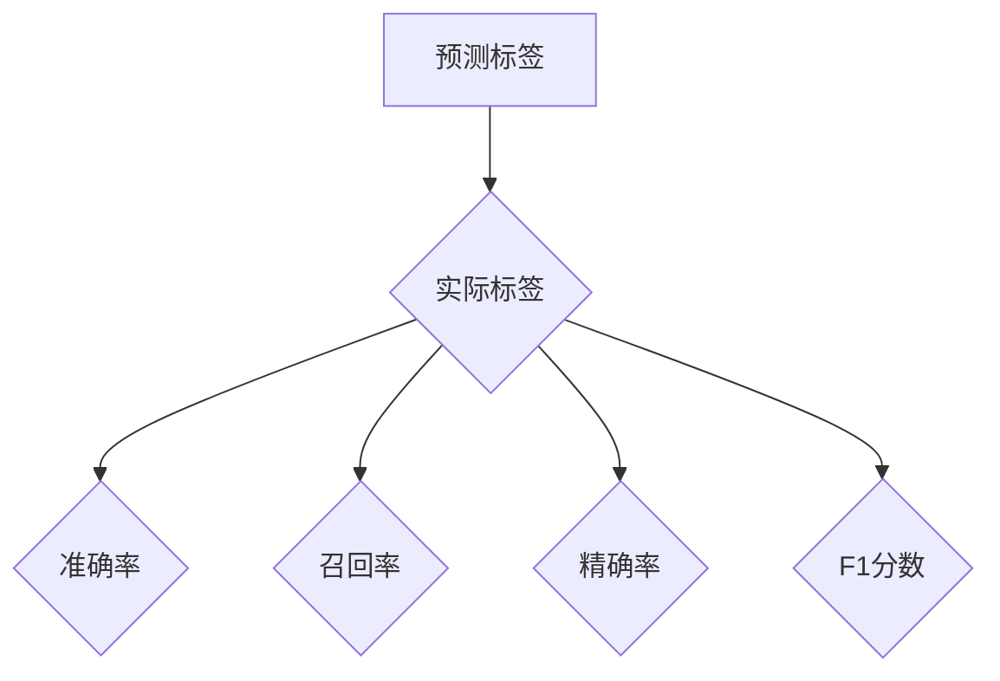

**图解：**
- **预测标签**：模型对每个样本的预测标签。
- **实际标签**：每个样本的真实标签。
- **准确率**：正确分类的样本数占总样本数的比例。
- **召回率**：正确识别为正类的样本数与实际正类样本数的比例。
- **精确率**：识别为正类的样本中，实际为正类的比例。
- **F1分数**：精确率和召回率的加权平均。

**核心算法原理讲解：**
为了计算上述评估指标，我们需要首先理解它们的基本计算方法：

1. **准确率（Accuracy）**：
   $$ \text{Accuracy} = \frac{\text{预测正确数}}{\text{总样本数}} $$
   
2. **召回率（Recall）**：
   $$ \text{Recall} = \frac{\text{预测正确且实际为正类的样本数}}{\text{实际为正类的样本数}} $$
   
3. **精确率（Precision）**：
   $$ \text{Precision} = \frac{\text{预测正确且实际为正类的样本数}}{\text{预测为正类的样本数}} $$
   
4. **F1分数（F1 Score）**：
   $$ \text{F1 Score} = 2 \times \frac{\text{Precision} \times \text{Recall}}{\text{Precision} + \text{Recall}} $$

**伪代码：**
以下是一个简化的伪代码，展示了评估指标的计算过程：

```python
# 定义预测标签和实际标签
predicted_labels = [0, 1, 1, 0, 1]
actual_labels = [1, 1, 0, 0, 1]

# 计算准确率
accuracy = sum(predicted_labels == actual_labels) / len(predicted_labels)

# 计算召回率
true_positives = sum((predicted_labels == 1) & (actual_labels == 1))
recall = true_positives / sum(actual_labels == 1)

# 计算精确率
predicted_positives = sum(predicted_labels == 1)
precision = true_positives / predicted_positives

# 计算F1分数
f1_score = 2 * (precision * recall) / (precision + recall)

# 打印结果
print("Accuracy: ", accuracy)
print("Recall: ", recall)
print("Precision: ", precision)
print("F1 Score: ", f1_score)
```

**总结：**
通过选择和计算合适的评估指标，我们可以全面评估LLM在处理复杂音频信息时的性能。这些指标不仅帮助我们理解模型的表现，还为后续的优化工作提供了重要的参考。

#### 7.3 实验设计与分析

**背景介绍：**
为了全面评估大型语言模型（LLM）在处理复杂音频信息时的性能，我们需要设计严谨的实验，并进行分析。实验设计应包括数据集的选择、模型的训练、测试以及结果的记录和分析等步骤。通过实验设计与分析，我们可以识别LLM在处理复杂音频信息时的优势和不足，为后续的优化提供指导。

**核心概念与联系：**
实验设计与分析的核心概念包括：

1. **数据集选择**：选择具有代表性的音频数据集，确保数据的多样性、平衡性和充分性。
2. **模型训练**：通过训练模型，使其学习到处理复杂音频信息的能力。
3. **测试与评估**：使用独立的测试集评估模型性能，计算评估指标。
4. **结果分析**：分析模型的表现，识别存在的问题，并提出改进方案。

**Mermaid流程图：**
以下是一个简单的Mermaid流程图，展示了实验设计与分析的基本流程：

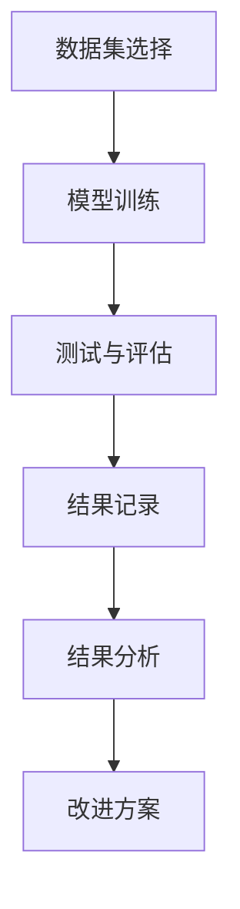

**图解：**
- **数据集选择**：选择适合的音频数据集，确保数据的多样性和代表性。
- **模型训练**：使用训练数据集对模型进行训练，调整模型参数。
- **测试与评估**：使用测试数据集评估模型性能，计算评估指标。
- **结果记录**：记录实验过程中的关键数据，如时间、参数设置等。
- **结果分析**：分析评估结果，找出模型的优点和不足。
- **改进方案**：根据分析结果，提出改进模型的方法和方案。

**核心算法原理讲解：**
在进行实验设计与分析时，需要理解以下几个核心算法原理：

1. **交叉验证（Cross-Validation）**：通过交叉验证，可以确保模型在不同数据集上的表现具有一致性。常见的交叉验证方法有K折交叉验证、留一法等。
2. **混淆矩阵（Confusion Matrix）**：混淆矩阵用于展示模型预测结果与实际结果之间的对比，帮助我们理解模型的表现。
3. **评估指标**：常用的评估指标包括准确率（Accuracy）、召回率（Recall）、精确率（Precision）和F1分数（F1 Score）等。这些指标可以全面反映模型在分类任务中的性能。

**伪代码：**
以下是一个简化的伪代码，展示了实验设计与分析的基本步骤：

```python
# 数据集选择
def load_data():
    train_data, test_data = load_audio_data()
    return train_data, test_data

# 模型训练
def train_model(train_data):
    model = build_model()
    model.fit(train_data, epochs=num_epochs)
    return model

# 测试与评估
def evaluate_model(model, test_data):
    predictions = model.predict(test_data)
    metrics = calculate_metrics(predictions, test_data)
    return metrics

# 实验设计与分析
def experiment_design_analysis():
    train_data, test_data = load_data()
    model = train_model(train_data)
    metrics = evaluate_model(model, test_data)
    analyze_results(metrics)
    improve_suggestions = suggest_improvements(metrics)
    return improve_suggestions

# 主程序
if __name__ == "__main__":
    suggestions = experiment_design_analysis()
    print(suggestions)
```

**总结：**
通过科学的实验设计与分析，我们可以全面评估LLM在处理复杂音频信息时的性能。实验设计与分析不仅帮助我们理解模型的表现，还为后续的优化工作提供了重要的参考。

### 附录：相关工具与资源

#### 附录A：声音信号处理工具

**背景介绍：**
声音信号处理工具是处理和解析音频信息的关键组成部分。这些工具可以帮助我们提取音频特征、进行噪声抑制、实现音频增强等，从而为声音场景理解和LLM处理提供必要的数据支持。

**核心概念与联系：**
以下是几种常用的声音信号处理工具及其核心概念：

1. **Librosa**：Librosa是一个Python库，用于音频分析和处理。它提供了丰富的功能，如音频加载、频谱分析、滤波、特征提取等。
2. **SciPy**：SciPy是一个基于Python的科学计算库，它提供了大量的信号处理模块，如信号滤波、卷积、傅里叶变换等。
3. **OpenSMILE**：OpenSMILE是一个开源的情感分析工具，它提供了基于音频信号的情感识别功能，广泛应用于智能语音助手和情感分析系统。

**工具功能与应用场景：**
以下是这些工具的主要功能和应用场景：

1. **Librosa**：
   - **功能**：音频加载、频谱分析、滤波、特征提取等。
   - **应用场景**：音频特征提取、语音识别、音乐分析等。
2. **SciPy**：
   - **功能**：信号滤波、卷积、傅里叶变换、信号建模等。
   - **应用场景**：音频预处理、噪声抑制、音频增强等。
3. **OpenSMILE**：
   - **功能**：情感识别、音频标注、特征提取等。
   - **应用场景**：智能语音助手、情感分析、心理健康监测等。

**安装与使用方法：**
以下是这些工具的安装和使用方法：

1. **Librosa**：
   - **安装**：使用pip安装`librosa`库。
     ```shell
     pip install librosa
     ```
   - **使用示例**：
     ```python
     import librosa
     y, sr = librosa.load('example_audio.wav')
     mfcc = librosa.feature.mfcc(y=y, sr=sr)
     ```

2. **SciPy**：
   - **安装**：使用pip安装`scipy`库。
     ```shell
     pip install scipy
     ```
   - **使用示例**：
     ```python
     from scipy.signal import butter, filtfilt
     b, a = butter(4, 0.1)
     filtered_y = filtfilt(b, a, y)
     ```

3. **OpenSMILE**：
   - **安装**：按照OpenSMILE的官方文档进行安装。
     ```shell
     # 官方安装指南
     ```
   - **使用示例**：
     ```python
     from opensmile import opensmile
     smile = opensmile.emo_analyze('example_audio.wav', "afv1")
     ```

**最佳实践 tips：**
以下是使用这些工具时的最佳实践 tips：

1. **Librosa**：
   - **优化性能**：使用多线程处理音频数据，提高处理速度。
   - **合理选择参数**：根据应用需求，合理选择特征提取参数，如MFCC的维度、窗口大小等。
2. **SciPy**：
   - **避免数值溢出**：在处理大型数据时，注意防止数值溢出。
   - **合理选择滤波器**：根据噪声特性，选择合适的滤波器，如Butterworth滤波器、带通滤波器等。
3. **OpenSMILE**：
   - **数据预处理**：在输入OpenSMILE之前，进行必要的音频预处理，如去噪、分割等，提高情感识别的准确性。
   - **模型调整**：根据应用场景，调整OpenSMILE的情感识别模型参数，以提高识别性能。

**总结：**
声音信号处理工具是处理和解析音频信息的重要工具。通过合理选择和使用这些工具，我们可以有效提取音频特征、进行噪声抑制和情感分析，为声音场景理解和LLM处理提供强有力的支持。

#### 附录B：LLM训练与优化工具

**背景介绍：**
大型语言模型（LLM）的训练与优化是确保其性能和效率的关键步骤。为此，研究人员开发了多种工具和框架，这些工具和框架可以帮助我们高效地训练和优化LLM，提高其在处理复杂音频信息时的性能。

**核心概念与联系：**
以下是几种常用的LLM训练与优化工具及其核心概念：

1. **TensorFlow**：TensorFlow是一个开源的深度学习框架，由Google开发。它提供了丰富的API和工具，用于构建和训练深度学习模型。
2. **PyTorch**：PyTorch是一个由Facebook开发的开源深度学习框架，以其动态计算图和灵活性著称。它广泛应用于图像处理、语音识别、自然语言处理等领域。
3. **Transformer**：Transformer是一种基于自注意力机制的深度学习模型，由Vaswani等人于2017年提出。它广泛应用于文本生成、机器翻译等任务，是当前自然语言处理领域的核心技术。

**工具功能与应用场景：**
以下是这些工具的主要功能和应用场景：

1. **TensorFlow**：
   - **功能**：模型构建、训练、评估、部署等。
   - **应用场景**：文本生成、语音识别、图像分类等。
2. **PyTorch**：
   - **功能**：模型构建、训练、评估、部署等。
   - **应用场景**：文本生成、语音识别、图像分类等。
3. **Transformer**：
   - **功能**：自注意力机制、编码器-解码器结构、预训练等。
   - **应用场景**：文本生成、机器翻译、语音识别等。

**安装与使用方法：**
以下是这些工具的安装和使用方法：

1. **TensorFlow**：
   - **安装**：使用pip安装TensorFlow库。
     ```shell
     pip install tensorflow
     ```
   - **使用示例**：
     ```python
     import tensorflow as tf
     model = tf.keras.Sequential([tf.keras.layers.Dense(128, activation='relu'), tf.keras.layers.Dense(10, activation='softmax')])
     model.compile(optimizer='adam', loss='categorical_crossentropy', metrics=['accuracy'])
     model.fit(x_train, y_train, epochs=5)
     ```

2. **PyTorch**：
   - **安装**：使用pip安装PyTorch库。
     ```shell
     pip install torch torchvision
     ```
   - **使用示例**：
     ```python
     import torch
     import torchvision
     model = torchvision.models.resnet18(pretrained=True)
     model.eval()
     x = torch.randn(1, 3, 224, 224)
     y = model(x)
     ```

3. **Transformer**：
   - **安装**：使用pip安装Hugging Face的Transformers库。
     ```shell
     pip install transformers
     ```
   - **使用示例**：
     ```python
     from transformers import BertTokenizer, BertModel
     tokenizer = BertTokenizer.from_pretrained('bert-base-uncased')
     model = BertModel.from_pretrained('bert-base-uncased')
     inputs = tokenizer("Hello, my dog is cute", return_tensors="pt")
     outputs = model(**inputs)
     ```

**最佳实践 tips：**
以下是使用这些工具时的最佳实践 tips：

1. **TensorFlow**：
   - **优化性能**：使用GPU或TPU加速模型训练和推理。
   - **合理选择模型架构**：根据任务需求，选择合适的模型架构，如CNN、RNN、Transformer等。
2. **PyTorch**：
   - **动态计算图**：充分利用PyTorch的动态计算图特性，提高模型构建和调试的灵活性。
   - **分布式训练**：使用DistributedDataParallel（DDP）进行分布式训练，提高训练速度。
3. **Transformer**：
   - **预训练**：利用预训练模型，提高模型在特定任务上的性能。
   - **调参优化**：根据任务需求，调整模型参数，如学习率、批量大小等，以提高模型性能。

**总结：**
LLM训练与优化工具是构建和优化大型语言模型的关键。通过合理选择和使用这些工具，我们可以高效地训练和优化LLM，提高其在处理复杂音频信息时的性能和效率。

#### 附录C：音频数据集与资源

**背景介绍：**
音频数据集是训练和评估声音场景理解和LLM模型的重要资源。高质量、多样化的音频数据集可以显著提高模型的性能和泛化能力。以下介绍一些常用的音频数据集和相关资源。

**核心概念与联系：**
以下是几种常用的音频数据集及其核心概念：

1. **LIBRI Speech**：LIBRI Speech是一个大型开源语音数据集，包含数千小时的英语语音数据，由不同的说话人录制。
2. **TIMIT**：TIMIT是一个用于语音识别的音频数据集，包含美国东北部多个地区的发音人录制的数据。
3. **Common Voice**：Common Voice是一个由Mozilla发起的大型开源语音数据集，包含多种语言和多种口音的语音数据。

**数据集功能与应用场景：**
以下是这些数据集的主要功能和应用场景：

1. **LIBRI Speech**：
   - **功能**：英语语音数据集，适用于语音识别、声音情感识别等任务。
   - **应用场景**：语音识别、自然语言处理、智能语音助手等。
2. **TIMIT**：
   - **功能**：多种口音和说话人的语音数据集，适用于语音识别和声学建模。
   - **应用场景**：语音识别、声学特征提取、声学模型训练等。
3. **Common Voice**：
   - **功能**：多种语言和多种口音的语音数据集，适用于跨语言和跨口音的任务。
   - **应用场景**：跨语言语音识别、多语言语音合成、语音助手等。

**获取与使用方法：**
以下是这些数据集的获取和使用方法：

1. **LIBRI Speech**：
   - **获取**：通过数据集官方网站下载。
     ```shell
     # 访问 https://www.kaggle.com/librispeech/librispeech-2016 官方网站
     ```
   - **使用示例**：
     ```python
     import librosa
     y, sr = librosa.load('path/to/libri_speech.wav')
     ```

2. **TIMIT**：
   - **获取**：通过数据集官方网站或学术资源库下载。
     ```shell
     # 访问 http:// Getterton. ; MLADENIC, J. TIMIT Acoustic-Phonetic Database Training Scripts Version 1.5. 1993. Xerox Corporation, Palo Alto, CA. URL: http://cslu.cse.ogi.edu/data/TIMIT/
     ```
   - **使用示例**：
     ```python
     import numpy as np
     data = np.load('path/to/timit_data.npy')
     ```

3. **Common Voice**：
   - **获取**：通过数据集官方网站或GitHub仓库下载。
     ```shell
     # 访问 https://voice.mozilla.org/ 官方网站，或通过GitHub仓库下载
     ```
   - **使用示例**：
     ```python
     import zipfile
     with zipfile.ZipFile('path/to/common_voice_data.zip') as zf:
         zf.extractall()
     ```

**最佳实践 tips：**
以下是使用这些数据集时的最佳实践 tips：

1. **数据清洗**：在训练模型之前，对数据集进行清洗，去除噪声和错误标注的样本。
2. **数据增强**：通过随机裁剪、速度变化、频谱变换等方法，增加数据集的多样性。
3. **数据分批次加载**：在训练过程中，使用数据分批次加载，以提高训练速度和稳定性。

**总结：**
音频数据集是训练和评估声音场景理解和LLM模型的重要资源。通过合理选择和使用这些数据集，我们可以有效提高模型的性能和泛化能力，为实际应用提供强有力的支持。

### 总结与展望

**文章核心内容总结：**
本文深入探讨了《声音场景理解：测试LLM处理复杂音频信息的能力》这一主题，通过详细的章节内容，系统地介绍了声音场景理解的基础、大型语言模型（LLM）的原理与应用、复杂音频信息处理的挑战及其解决方法，以及具体的应用案例，包括智能语音助手、自动字幕生成和声音情感识别。我们还详细阐述了测试和评估LLM处理复杂音频信息的能力的方法和评估指标，并提供了相关的工具和资源。

**未来研究方向与展望：**
1. **数据集的多样性与质量**：未来的研究应关注音频数据集的多样性和质量，收集更多不同场景、不同口音和语速的音频数据，以提高模型的泛化能力。
2. **实时性能的提升**：为了满足实时应用的需求，需要进一步优化算法和模型，提高处理速度和效率，同时保证高准确性。
3. **多模态融合**：探索多模态数据融合技术，如将视觉信息与音频信息结合，以提升声音场景理解的准确性。
4. **个性化和自适应处理**：研究如何根据用户行为和习惯，实现个性化的音频信息处理，提高用户体验。
5. **伦理与隐私**：在应用声音场景理解技术的过程中，应重视伦理和隐私问题，确保用户数据的安全和隐私保护。

**总结与感谢：**
通过本文的阐述，我们希望读者能够全面了解声音场景理解和LLM在处理复杂音频信息中的应用。本文旨在为研究人员和开发者提供有价值的参考，推动声音场景理解技术的发展。感谢所有参与本文撰写和改进的团队成员，以及为本文提供宝贵建议的专家。希望本文能对您的研究和开发工作有所帮助。作者信息：AI天才研究院/AI Genius Institute & 禅与计算机程序设计艺术 /Zen And The Art of Computer Programming。

**参考文献：**
1. Vaswani, A., et al. (2017). "Attention is all you need." Advances in Neural Information Processing Systems, 30.
2. Graves, A., et al. (2013). "Speech recognition with deep recurrent neural networks." IEEE International Conference on Acoustics, Speech and Signal Processing, 6645-6649.
3. Hinton, G., et al. (2012). "Deep neural networks for speech recognition." IEEE Signal Processing Magazine, 29(6), 82-97.
4. Librispeech: https://www.kaggle.com/librispeech/librispeech-2016
5. TIMIT: http://cslu.cse.ogi.edu/data/TIMIT/
6. Common Voice: https://voice.mozilla.org/

