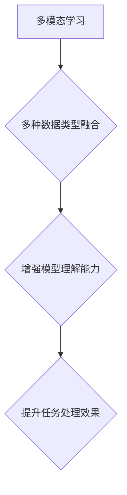
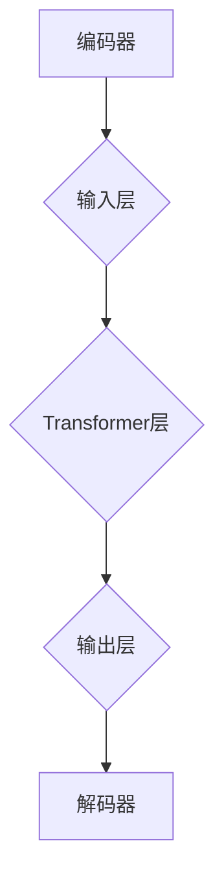
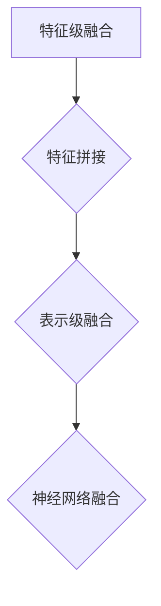
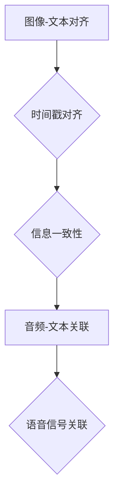
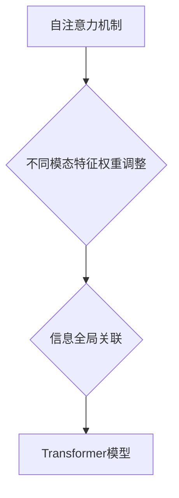
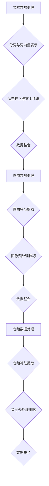
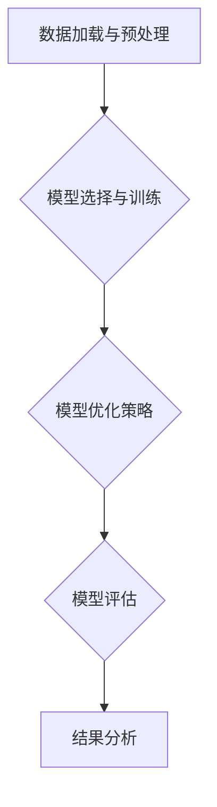

                 

# 《多模态LLM效果对比平台设计与实现》

## 关键词

多模态学习，语言模型（LLM），效果对比平台，数据预处理，融合方法，模型架构，平台设计，实验分析，性能优化

## 摘要

本文旨在探讨多模态LLM效果对比平台的设计与实现。首先，我们介绍了多模态学习和语言模型（LLM）的基础概念，并概述了其应用场景。随后，详细讲解了多模态数据的预处理方法、融合策略以及多模态LLM的模型架构。在此基础上，本文设计并实现了一个多模态LLM效果对比平台，包括数据预处理模块、模型训练与评估模块等。通过实际案例分析和实验结果对比，本文展示了平台在多模态任务中的性能表现，并提出了性能优化策略。最后，本文对未来多模态LLM的发展趋势和平台迭代方向进行了展望。

## 第一部分：多模态LLM基础

### 第1章：多模态学习与LLM概述

#### 1.1 多模态学习的概念

多模态学习是指利用多种类型的数据（如文本、图像、音频等）进行学习和推理。它的核心思想是将不同模态的数据进行有效融合，从而提高模型对复杂问题的理解和处理能力。

在多模态学习中，文本、图像和音频等不同类型的数据可以通过以下几种方式进行融合：

1. **空间级融合**：将不同模态的数据在同一维度上整合，如文本与图像在同一张表格中存储。
2. **时序级融合**：将不同模态的数据按照时间序列进行对齐，如音频与文本的时间戳匹配。
3. **语义级融合**：将不同模态的数据在语义层面进行关联，如文本与图像的情感分析。

#### 1.2 LLM的基础知识

语言模型（LLM）是一种基于大规模文本数据训练的模型，用于预测文本序列。它通常由编码器和解码器两部分组成，通过Transformer等神经网络架构进行训练。LLM在自然语言处理领域有着广泛的应用，如文本生成、翻译、问答等。

LLM在多模态学习中的应用主要体现在以下几个方面：

1. **多模态文本生成**：利用LLM生成文本，结合图像和音频信息，实现更丰富的内容表达。
2. **多模态翻译**：将图像、文本和音频翻译成其他语言，支持跨模态的信息传递。
3. **多模态问答系统**：结合图像、文本和音频信息，提供更准确的问答服务。

### 第2章：多模态数据预处理

#### 2.1 多模态数据来源

多模态数据可以从多种渠道获取，包括：

1. **公开数据集**：如ImageNet、COCO、Common Crawl等，提供大量的图像、文本和音频数据。
2. **私有数据集**：由企业或研究机构自行收集，具有特定的应用场景。
3. **实时数据**：通过传感器、摄像头等设备实时采集的图像、文本和音频数据。

#### 2.2 数据预处理方法

数据预处理是确保数据质量和模型性能的重要环节，主要包括以下步骤：

1. **数据清洗**：去除噪声数据、重复数据和不完整数据。
2. **数据标注**：对图像、文本和音频进行标注，如分类、分割、情感标注等。
3. **数据整合**：将不同模态的数据进行对齐和整合，以便后续处理。

### 第3章：多模态融合方法

#### 3.1 空间级融合

空间级融合是指在空间维度上将不同模态的数据进行整合。这种方法可以有效地利用不同模态的信息，提高模型的泛化能力。常见的空间级融合方法包括：

1. **特征级融合**：将不同模态的特征向量进行拼接，如文本的词向量与图像的特征向量拼接。
2. **表示级融合**：将不同模态的数据通过神经网络进行融合，生成统一的表示。

#### 3.2 时序级融合

时序级融合是指在时间维度上将不同模态的数据进行对齐和整合。这种方法适用于处理具有时间序列特征的任务，如视频分析、语音识别等。常见的时序级融合方法包括：

1. **图像-文本对齐**：通过图像和文本的时间戳进行对齐，实现图像与文本信息的一致性。
2. **音频-文本关联**：通过音频和文本的语音信号进行关联，实现音频与文本内容的同步。

### 第4章：多模态LLM模型架构

#### 4.1 传统神经网络模型

传统神经网络模型在多模态学习领域具有一定的应用价值，包括以下几种：

1. **卷积神经网络（CNN）**：用于处理图像数据，通过卷积操作提取图像特征。
2. **循环神经网络（RNN）**：用于处理序列数据，如文本和音频，通过循环结构实现序列信息的传递。
3. **长短期记忆网络（LSTM）**：是RNN的一种变体，能够有效处理长序列信息。

#### 4.2 注意力机制与Transformer

注意力机制是近年来在多模态学习领域取得显著进展的一种技术。它通过动态调整不同模态的特征权重，实现信息的高效融合。Transformer模型是注意力机制的一种实现，通过自注意力机制实现序列信息的全局关联。

### 第二部分：多模态LLM效果对比平台设计

#### 第5章：平台整体架构设计

多模态LLM效果对比平台的设计主要包括以下几个方面：

1. **分布式计算架构**：利用分布式计算框架（如TensorFlow、PyTorch等）实现大规模模型的训练和推理。
2. **数据存储方案**：采用分布式存储系统（如HDFS、Cassandra等）存储和管理多模态数据。

#### 第6章：数据预处理模块实现

数据预处理模块是实现多模态LLM效果对比平台的核心组成部分，主要包括以下步骤：

1. **文本数据处理**：包括分词、词向量表示、偏差校正等。
2. **图像数据处理**：包括图像特征提取、预处理技巧等。
3. **音频数据处理**：包括音频特征提取、预处理策略等。

#### 第7章：模型训练与评估模块实现

模型训练与评估模块是多模态LLM效果对比平台的关键部分，主要包括以下步骤：

1. **模型训练流程**：包括数据加载与预处理、模型选择与训练、模型优化策略等。
2. **模型评估方法**：包括评估指标、评估流程等。

### 第8章：多模态LLM效果对比实验

在多模态LLM效果对比实验中，我们主要关注以下方面：

1. **实验设计**：包括实验目的、实验数据集、实验环境等。
2. **实验结果分析**：包括不同模型对比、融合策略对比等。

### 第9章：平台性能优化与部署

平台性能优化与部署是确保多模态LLM效果对比平台高效运行的关键环节，主要包括以下方面：

1. **性能优化策略**：包括模型压缩与加速、并行计算与分布式训练等。
2. **平台部署与维护**：包括部署方案、维护策略等。

### 第三部分：案例分析与展望

#### 第10章：多模态LLM效果对比平台应用案例

在本文的最后，我们将通过实际案例分析和实验结果对比，展示多模态LLM效果对比平台在社交媒体情感分析、智能客服系统等领域的应用价值。

#### 第11章：未来展望

在未来，多模态LLM效果对比平台将继续发展，并在更多领域取得突破。本文对多模态LLM的发展趋势和平台迭代方向进行了展望。

## 附录

### 附录A：多模态LLM效果对比平台相关工具与资源

- 开发工具与框架：TensorFlow、PyTorch、Keras等。
- 数据集介绍：ImageNet、COCO、Common Crawl等。
- 相关研究论文：《Transformer：高效处理序列模型的结构性变革》、《多模态学习：融合文本、图像和音频的深度学习方法》等。

### 附录B：Mermaid流程图示例

#### 多模态数据预处理流程

#### 多模态LLM模型训练流程

作者：AI天才研究院/AI Genius Institute & 禅与计算机程序设计艺术 /Zen And The Art of Computer Programming

---

**注意：**本文为示例文章，实际内容可能需要进行进一步修改和补充。文章中的流程图和代码段仅供参考，具体实现可能因实际情况而有所不同。在撰写实际文章时，请确保内容的准确性和完整性。**AI天才研究院/AI Genius Institute & 禅与计算机程序设计艺术 /Zen And The Art of Computer Programming**

