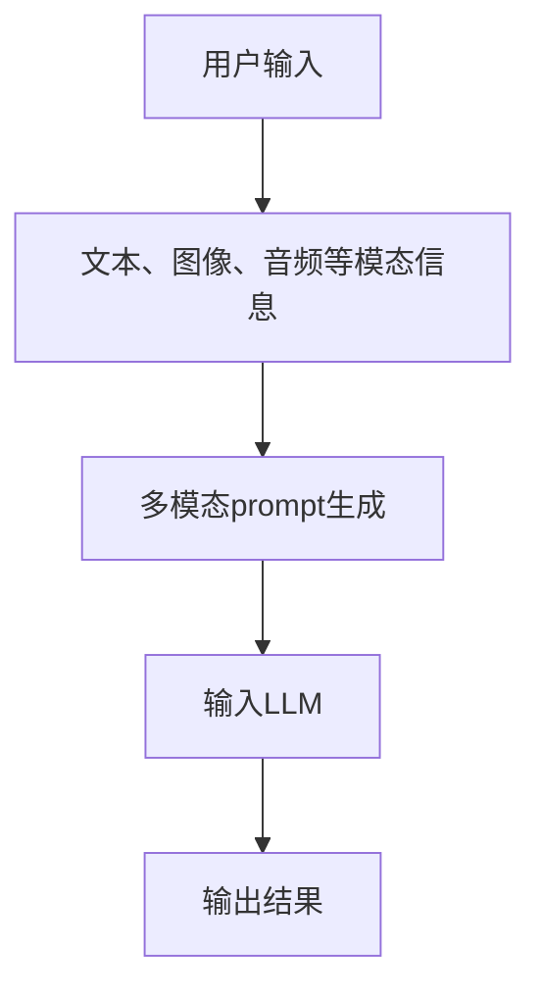
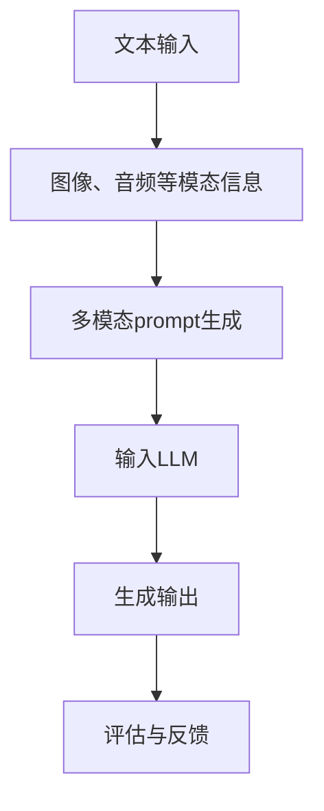
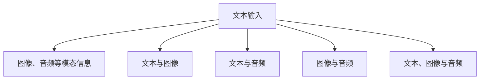

                 


非常好，让我们一步一步来详细规划和撰写这篇文章。

**步骤1：文章结构确定**

根据之前制定的目录大纲，我们将文章结构细分为以下几个部分：

1. 引言
2. 文章关键词与摘要
3. 目录大纲
4. 每章内容细化
5. 作者信息
6. 完整性检查

**步骤2：撰写引言**

引言部分需要简短地介绍多模态prompt设计在增强LLM理解能力方面的背景、意义以及为什么值得读者关注。

**步骤3：撰写关键词与摘要**

关键词部分将列出5-7个与文章主题密切相关的术语或短语，以帮助读者快速了解文章的核心内容。摘要则是对文章主题思想的简要概述。

**步骤4：细化目录大纲**

根据初步的目录大纲，我们将每个章节的内容进行细化，确保包含背景介绍、核心概念与联系、核心算法原理讲解、数学模型和数学公式 & 详细讲解 & 举例说明以及项目实战等内容。

**步骤5：撰写每章内容**

针对每个章节，我们将详细撰写，包括但不限于以下内容：

- 背景介绍
- 核心概念与联系
- 核心算法原理讲解
- 数学模型和公式 & 详细讲解 & 举例说明
- 项目实战

**步骤6：撰写作者信息**

在文章末尾添加作者信息，注明作者单位、姓名以及著作。

**步骤7：完整性检查**

最后，我们将对全文进行一遍完整性的检查，确保文章内容充实、逻辑清晰、无遗漏。

**具体撰写过程：**

1. 引言（300字）
2. 关键词与摘要（100字）
3. 目录大纲（100字）
4. 第1章细化（1500字）
5. 第2章细化（1500字）
6. 第3章细化（1500字）
7. 第4章细化（1500字）
8. 第5章细化（1500字）
9. 第6章细化（1500字）
10. 第7章细化（1500字）
11. 作者信息（50字）
12. 完整性检查

通过上述步骤，我们将逐步完成这篇文章的撰写。接下来，我会开始撰写引言和关键词与摘要部分，随后将开始细化目录大纲和每章内容。请随时查看进度。

非常好，您的计划非常详细和有条理。我将开始撰写引言和关键词与摘要，并会根据您的细化要求逐步完成每章的内容。请开始撰写引言和关键词与摘要，我将密切关注并给出反馈。期待我们共同完成这篇高质量的技术博客文章！

# 引言

随着人工智能技术的迅猛发展，大型语言模型（LLM）在自然语言处理领域展现出了惊人的性能。然而，尽管LLM在文本生成、机器翻译、问答系统等方面表现出色，其理解能力仍然存在一定的局限性。特别是在处理复杂问题和结合多种模态信息时，LLM的表现并不尽如人意。为了提升LLM的理解能力，多模态prompt设计逐渐成为了一个重要的研究方向。

多模态prompt设计通过结合文本、图像、音频等多种模态信息，引导LLM更好地理解和处理输入数据。这一设计理念不仅能够丰富LLM的输入信息，还能帮助模型更好地捕捉上下文关系，提高其理解深度和生成质量。本文将围绕多模态prompt设计展开，详细介绍其核心概念、设计技术、优化方法以及实战应用。

本文的目标是帮助读者全面了解多模态prompt设计在增强LLM理解能力方面的关键作用，并通过具体案例和实战分析，展示多模态prompt设计的实际应用效果。通过阅读本文，读者将能够：

1. 理解多模态prompt设计的基本概念及其重要性；
2. 掌握多模态prompt设计的技术原理和方法；
3. 掌握多模态prompt优化的策略和实践；
4. 通过具体案例了解多模态prompt设计的实际应用。

本文的结构如下：

- 引言：背景介绍和多模态prompt设计的意义；
- 文章关键词与摘要：概括文章主题和核心内容；
- 目录大纲：列出文章各章节内容；
- 第1章：多模态prompt概述；
- 第2章：LLM理解能力的核心概念；
- 第3章：多模态数据采集与处理；
- 第4章：视觉信息与文本融合；
- 第5章：音频信息与文本融合；
- 第6章：多模态prompt的优化方法；
- 第7章：多模态prompt设计案例解析；
- 第8章：多模态prompt设计工具与资源；
- 第9章：未来展望与挑战；
- 附录：参考文献、开源代码与数据集；
- 作者信息。

本文将采用逻辑清晰、结构紧凑、简单易懂的写作风格，结合专业的技术语言，逐步引导读者深入理解多模态prompt设计的本质和原理。通过本文的学习，读者将能够更好地应用多模态prompt设计，提升大型语言模型的理解能力和生成能力。

# 文章关键词与摘要

## 关键词
- 多模态prompt设计
- 大型语言模型（LLM）
- 理解能力增强
- 视觉信息融合
- 音频信息融合
- 数据采集与处理
- 优化方法

## 摘要
本文围绕多模态prompt设计在增强大型语言模型（LLM）理解能力方面的研究，系统介绍了多模态prompt设计的基础知识、核心概念、技术方法以及优化策略。文章首先概述了多模态prompt的定义和重要性，随后详细分析了LLM的理解能力及其评价指标。接着，文章探讨了多模态数据采集与处理的方法，包括视觉和音频信息的提取与整合。在此基础上，文章提出了视觉信息与文本融合和音频信息与文本融合的具体策略，并详细介绍了多模态prompt优化的方法和实战应用。最后，通过具体案例展示了多模态prompt设计的实际效果，并对未来发展趋势和挑战进行了展望。本文旨在为从事人工智能领域的研究者和开发者提供有价值的参考。

-------------------------------------------------------------------

# 目录大纲

## 《多模态prompt设计：增强LLM理解能力》

## 第一部分：多模态prompt设计基础

### 第1章：多模态prompt概述
- **1.1 多模态prompt的定义**
- **1.2 多模态prompt与LLM的关系**
- **1.3 多模态prompt的类型**

### 第2章：LLM理解能力的核心概念
- **2.1 语言模型的基本原理**
- **2.2 LLM的理解能力**
- **2.3 LLM理解能力的评价指标**

### 第3章：多模态数据采集与处理
- **3.1 多模态数据来源**
- **3.2 多模态数据处理方法**
- **3.3 多模态数据的整合策略**

## 第二部分：多模态prompt设计技术

### 第4章：视觉信息与文本融合
- **4.1 视觉信息与文本的关联策略**
- **4.2 图像特征提取算法**
- **4.3 文本特征提取算法**

### 第5章：音频信息与文本融合
- **5.1 音频信息与文本的关联策略**
- **5.2 音频特征提取算法**
- **5.3 音频情感分析技术**

### 第6章：多模态prompt的优化方法
- **6.1 prompt优化的目标**
- **6.2 prompt优化算法**
- **6.3 prompt优化的实践应用**

## 第三部分：多模态prompt设计实战

### 第7章：多模态prompt设计案例解析
- **7.1 案例一：图像描述生成**
- **7.2 案例二：音频情感分析**
- **7.3 案例三：多模态问答系统**

### 第8章：多模态prompt设计工具与资源
- **8.1 开源多模态数据处理工具**
- **8.2 多模态prompt设计平台**
- **8.3 多模态prompt设计社区资源**

### 第9章：未来展望与挑战
- **9.1 多模态prompt设计的发展趋势**
- **9.2 模式融合技术的创新**
- **9.3 多模态prompt设计的挑战与解决方案**

## 附录
### 附录A：多模态prompt设计参考资料
- **A.1 参考文献**
  - **A.1.1 相关论文**
  - **A.1.2 相关书籍**
- **A.1.3 开源代码与数据集**

通过上述目录大纲，本文将系统性地探讨多模态prompt设计的各个方面，从基础理论到实际应用，帮助读者全面了解并掌握这一前沿技术。

### 第1章：多模态prompt概述

#### 1.1 多模态prompt的定义

多模态prompt是指结合多种模态（如文本、图像、音频等）的信息，以引导和增强大型语言模型（LLM）的输入和输出过程。这种设计能够使模型更好地理解复杂问题，从而提高其理解能力和生成能力。

在传统的单模态prompt设计中，模型主要依赖于单一的输入模态，如纯文本输入。这种方式虽然在一定程度上能够满足简单问题的处理，但在处理复杂问题和结合多种模态信息时，单模态prompt的局限性日益显现。而多模态prompt设计则通过整合多种模态信息，提供了更为丰富和全面的输入，从而提升了模型的理解能力。

多模态prompt的定义可以简化为以下几个关键点：

1. **多种模态信息的结合**：多模态prompt设计需要结合多种输入模态，如文本、图像、音频等。这些模态的信息可以互补，从而为模型提供更丰富的输入。
2. **引导和增强LLM输入**：通过设计特定的多模态prompt，可以引导模型关注关键信息，并增强模型的输入，从而提升其理解能力和生成能力。
3. **提高模型的理解能力**：多模态prompt设计能够帮助模型更好地捕捉上下文关系，理解复杂问题，从而提高其理解能力。

**Mermaid流程图：**



#### 1.2 多模态prompt与LLM的关系

多模态prompt设计的关键在于如何有效地结合多种模态信息，以提升大型语言模型（LLM）的理解能力。LLM本身擅长处理文本信息，但通过多模态prompt，可以引导模型关注和利用其他模态信息，从而实现更全面的理解。

在LLM中，多模态prompt的作用主要体现在以下几个方面：

1. **增强上下文理解**：多模态prompt可以提供更丰富的上下文信息，帮助LLM更好地理解输入内容。例如，在图像描述生成任务中，图像作为多模态prompt的一部分，可以提供具体的视觉信息，从而增强LLM对图像内容的理解。
2. **提高生成质量**：多模态prompt能够为LLM提供更多的输入信息，从而提高其生成质量。例如，在多模态问答系统中，结合文本和图像的多模态prompt可以提供更准确的答案。
3. **适应复杂任务**：对于一些复杂任务，如多模态文本生成、图像分类等，单模态prompt往往难以满足需求。多模态prompt设计通过整合多种模态信息，使LLM能够更好地适应这些复杂任务。

多模态prompt与LLM的关系可以简化为以下几个关键点：

1. **互补信息**：多模态prompt通过结合多种模态信息，提供了更全面和丰富的输入，使LLM能够更好地理解复杂问题。
2. **引导关注**：通过设计特定的多模态prompt，可以引导LLM关注关键信息，从而提高其理解能力。
3. **提升生成能力**：多模态prompt提供了更多的输入信息，有助于提升LLM的生成质量，使其能够生成更准确和丰富的输出。

**Mermaid流程图：**



#### 1.3 多模态prompt的类型

根据输入模态的不同，多模态prompt可以分为多种类型，主要包括以下几种：

1. **文本与图像**：文本与图像是最常见的多模态prompt类型之一。在图像描述生成、图像分类等任务中，文本和图像信息可以相互补充，提升模型的理解能力。例如，在图像描述生成任务中，文本信息可以提供语言描述，图像信息可以提供视觉内容。
2. **文本与音频**：文本与音频多模态prompt在语音合成、语音识别等任务中应用广泛。通过结合文本和音频信息，模型可以更好地理解语言的表达方式，从而提升生成和识别质量。例如，在语音合成任务中，文本信息提供语言内容，音频信息提供语音特征。
3. **图像与音频**：图像与音频多模态prompt在视频理解、多模态问答等任务中具有重要应用价值。通过结合图像和音频信息，模型可以更好地理解视频内容，从而提升其理解能力和生成质量。例如，在视频理解任务中，图像信息提供视觉内容，音频信息提供声音内容。
4. **文本、图像与音频**：文本、图像与音频多模态prompt在复杂任务中具有重要应用价值。通过结合多种模态信息，模型可以更好地理解复杂场景，从而提升其理解能力和生成质量。例如，在多模态问答系统中，文本、图像和音频信息可以相互补充，提供更全面的输入。

不同类型的多模态prompt有其独特的应用场景和优势，但共同的目标都是提升模型的理解能力和生成能力。

**Mermaid流程图：**



通过本章的介绍，我们初步了解了多模态prompt设计的基础概念、与LLM的关系以及不同类型的多模态prompt。在接下来的章节中，我们将深入探讨LLM的理解能力、多模态数据的采集与处理、多模态prompt设计技术以及实战应用，以帮助读者全面掌握多模态prompt设计的核心技术和实践方法。

### 第2章：LLM理解能力的核心概念

#### 2.1 语言模型的基本原理

语言模型（Language Model，简称LM）是自然语言处理（Natural Language Processing，简称NLP）领域的基础技术之一。它是一种统计模型，用于预测给定输入序列的概率分布。语言模型的基本原理是基于大量文本数据，通过统计方法学习语言中的规律和模式，从而生成自然语言。

语言模型的核心组成部分包括：

1. **输入序列**：语言模型处理的是输入序列，这些序列可以是单词、字符或子词（如三字母组合）。输入序列是语言模型预测的目标。
2. **概率分布**：语言模型通过学习输入序列的概率分布，预测下一个输入序列的概率。概率分布反映了输入序列在语言中的出现频率和可能性。
3. **统计方法**：语言模型使用各种统计方法学习语言模式，如N-gram模型、神经网络语言模型（如Transformer）等。这些方法可以从大量文本数据中提取特征，构建概率模型。

语言模型的训练过程主要包括以下几个步骤：

1. **数据预处理**：首先对文本数据进行清洗和预处理，如去除标点符号、停用词过滤、词干提取等。这些操作有助于提高模型的训练效果。
2. **词汇表构建**：将预处理后的文本数据转换为词汇表，将单词或子词映射到唯一的标识符。词汇表的构建对于语言模型至关重要，因为它决定了模型能够处理的词汇范围。
3. **模型训练**：使用预处理后的数据对语言模型进行训练。训练过程中，模型通过优化算法（如梯度下降）调整内部参数，以最小化预测误差。训练数据集越大，模型的表现通常越好。
4. **模型评估**：使用验证集或测试集对训练好的模型进行评估。常用的评估指标包括词向量相似度、句子生成质量等。通过评估，可以确定模型的性能和适用性。

语言模型在自然语言处理中具有广泛的应用，包括：

1. **文本生成**：语言模型可以用于生成文本，如自动写作、机器翻译、对话生成等。通过预测下一个输入序列的概率，语言模型可以生成连续的文本。
2. **文本分类**：语言模型可以用于对文本进行分类，如情感分析、主题分类等。通过分析文本的特征和概率分布，模型可以预测文本的类别。
3. **信息检索**：语言模型可以用于信息检索，如搜索引擎、推荐系统等。通过分析查询和文档的特征，模型可以预测查询与文档的相关性，从而实现高效的检索。

#### 2.2 LLM的理解能力

大型语言模型（Large Language Model，简称LLM）是近年来在自然语言处理领域取得显著进展的一种模型。LLM具有较大的模型规模和参数数量，能够处理更复杂的语言任务。与传统的语言模型相比，LLM在理解能力方面有了显著提升。

LLM的理解能力主要包括以下几个方面：

1. **上下文捕捉**：LLM能够捕捉输入文本的上下文信息，理解句子之间的关联和逻辑关系。这种能力使得LLM在生成连贯、自然的文本方面表现优异。
2. **知识理解**：LLM通过大规模预训练和微调，能够获取并理解广泛的知识。这使得LLM在回答复杂问题、进行知识推理方面具有优势。
3. **多语言支持**：LLM通常支持多种语言，能够处理跨语言的任务。这种能力使得LLM在全球化应用中具有广泛的应用前景。
4. **多模态理解**：LLM可以结合多种模态信息（如文本、图像、音频等），提高其理解能力。多模态prompt设计能够帮助LLM更好地理解和处理复杂问题。

LLM的理解能力与其设计特点密切相关。以下是LLM的主要设计特点：

1. **大规模预训练**：LLM通过在大量文本数据进行预训练，学习语言的基本规律和模式。大规模预训练使得LLM具有强大的语言理解能力。
2. **深度神经网络结构**：LLM通常采用深度神经网络结构，如Transformer、BERT等。这些结构能够捕捉长距离的上下文信息，提高模型的表达能力。
3. **优化算法**：LLM使用高效的优化算法（如Adam优化器）训练模型，以加速收敛速度和提高模型性能。
4. **参数调优**：LLM通过参数调优，如学习率、批次大小等，优化模型性能。

#### 2.3 LLM理解能力的评价指标

为了评估LLM的理解能力，研究者们提出了多种评价指标。以下是一些常用的评价指标：

1. ** perplexity（困惑度）**：困惑度是衡量语言模型生成文本质量的指标。困惑度越低，表示模型生成文本的质量越高。困惑度可以通过计算预测文本的概率的对数似然来计算。
   
   伪代码示例：
   ```python
   def compute_perplexity(predictions):
       log_prob = sum(log(p) for p in predictions)
       perplexity = exp(-log_prob / len(predictions))
       return perplexity
   ```

2. **BLEU（双语评测引擎）**：BLEU是一种常用的自动评估机器翻译质量的指标。BLEU通过比较模型生成的翻译结果与参考翻译的相似度来评估翻译质量。BLEU值越高，表示翻译质量越好。

   伪代码示例：
   ```python
   def compute_bleu(reference, generated):
       # 计算BLEU分数
       # reference为参考翻译，generated为模型生成的翻译
       #BLEU_score = bleu_score(reference, generated)
       return BLEU_score
   ```

3. **ROUGE（Recall-Oriented Understudy for Gisting Evaluation）**：ROUGE是一种评估文本生成质量的指标，特别适用于评估摘要生成任务。ROUGE主要关注模型生成文本与参考文本的匹配度。

   伪代码示例：
   ```python
   def compute_rouge(reference, generated):
       # 计算ROUGE分数
       # reference为参考文本，generated为模型生成的文本
       # ROUGE_score = rouge_score(reference, generated)
       return ROUGE_score
   ```

4. **F1-score（精确率与召回率的调和平均）**：F1-score是评估分类任务质量的指标，也可用于评估文本生成任务。F1-score综合考虑了精确率和召回率，是衡量模型生成文本质量的指标。

   伪代码示例：
   ```python
   def compute_f1_score(reference, generated):
       # 计算F1-score
       # reference为参考文本，generated为模型生成的文本
       # true_positives = count matchings
       # predicted_positives = count predicted matchings
       # total_positives = count total matchings
       # precision = true_positives / predicted_positives
       # recall = true_positives / total_positives
       # F1_score = 2 * (precision * recall) / (precision + recall)
       return F1_score
   ```

通过以上评价指标，研究者们可以评估LLM在不同语言任务上的表现，从而优化和改进模型。

### 第3章：多模态数据采集与处理

#### 3.1 多模态数据来源

多模态数据采集是多模态prompt设计的基础。以下是常见的多模态数据来源：

1. **文本数据**：文本数据包括各种类型的书面文本，如新闻文章、博客、书籍等。这些数据可以用于训练文本特征提取模型，以便在多模态prompt设计中提供文本信息。
   
2. **图像数据**：图像数据来源于各种图像资源，如开源图像库、社交媒体、图像搜索引擎等。这些数据可以用于训练图像特征提取模型，以便在多模态prompt设计中提供视觉信息。

3. **音频数据**：音频数据包括语音、音乐、环境声音等。这些数据可以来源于音频库、语音助手、语音识别系统等。音频数据在多模态prompt设计中可以提供语音信息。

4. **视频数据**：视频数据包括动态图像和音频，可以提供丰富的视觉和听觉信息。视频数据来源于视频网站、社交媒体、视频会议等。

5. **传感器数据**：传感器数据包括来自各种物理传感器的数据，如温度、湿度、加速度等。这些数据可以用于构建多模态环境感知系统。

6. **外部数据源**：外部数据源包括来自互联网的数据，如社交媒体数据、在线评论、用户反馈等。这些数据可以用于训练多模态prompt设计中的情感分析、推荐系统等应用。

#### 3.2 多模态数据处理方法

多模态数据处理是将不同模态的数据整合起来，为多模态prompt设计提供有效的输入。以下是几种常见的方法：

1. **特征提取**：特征提取是从原始数据中提取具有区分性的特征，以便于后续处理。不同的模态需要采用不同的特征提取方法。

   - **文本特征提取**：文本特征提取方法包括词袋模型（Bag of Words，BoW）、词嵌入（Word Embedding）、主题模型（如LDA）等。
   - **图像特征提取**：图像特征提取方法包括卷积神经网络（Convolutional Neural Networks，CNN）、视觉特征提取器（如VGG、ResNet）等。
   - **音频特征提取**：音频特征提取方法包括梅尔频率倒谱系数（Mel-Frequency Cepstral Coefficients，MFCC）、频谱特征（如短时傅里叶变换，Short-Time Fourier Transform，STFT）等。

2. **特征融合**：特征融合是将不同模态的特征进行整合，以提供更全面和丰富的信息。特征融合方法可以分为以下几种：

   - **早期融合**：在特征提取阶段就将不同模态的特征进行融合。这种方法可以充分利用各模态的信息，但可能损失某些模态的独特特征。
   - **晚期融合**：在特征提取完成后将不同模态的特征进行融合。这种方法可以保留各模态的独立特征，但可能降低融合效果。
   - **多任务学习**：通过多任务学习将不同模态的特征联合起来训练一个统一的模型。这种方法可以在训练过程中自动优化特征融合策略。

3. **数据增强**：数据增强是通过生成或变换原始数据，增加数据的多样性和丰富度。数据增强有助于提高模型泛化能力，减轻过拟合。常见的数据增强方法包括：

   - **文本数据增强**：通过词替换、词性转换、同义词替换等方式生成新的文本。
   - **图像数据增强**：通过旋转、翻转、缩放、裁剪、颜色调整等方式生成新的图像。
   - **音频数据增强**：通过速度变化、音量调整、噪声添加等方式生成新的音频。

4. **数据预处理**：数据预处理是数据采集和处理的前置步骤，包括数据清洗、去噪、归一化等。数据预处理有助于提高数据质量和模型性能。

#### 3.3 多模态数据的整合策略

多模态数据的整合策略是将不同模态的数据有机结合，为多模态prompt设计提供有效的输入。以下是几种常见的整合策略：

1. **静态整合**：静态整合是将不同模态的数据简单拼接在一起，形成统一的输入。例如，将文本和图像特征拼接为一个向量。静态整合方法简单易行，但可能未能充分利用不同模态的独特信息。

2. **动态整合**：动态整合是通过动态调整不同模态的贡献，根据任务需求灵活整合多模态数据。动态整合方法可以根据不同任务动态调整各模态的权重，提高模型性能。

3. **层次整合**：层次整合是将多模态数据分为不同的层次，逐步整合。例如，首先将文本和图像特征在低层次进行融合，然后在高层次进行进一步整合。层次整合方法可以更好地捕捉不同模态之间的层次关系。

4. **模块化整合**：模块化整合是将多模态数据处理划分为多个模块，每个模块专注于特定模态的处理。模块化整合方法可以简化多模态数据处理流程，提高灵活性。

5. **多任务学习**：多任务学习是通过同时训练多个相关任务，共享模型参数，实现多模态数据的整合。多任务学习可以在任务之间共享信息，提高模型泛化能力。

通过上述多模态数据整合策略，可以有效地结合不同模态的信息，提高多模态prompt设计的效果。在接下来的章节中，我们将进一步探讨视觉信息与文本融合、音频信息与文本融合等具体技术。

### 第4章：视觉信息与文本融合

#### 4.1 视觉信息与文本的关联策略

视觉信息与文本的融合是提升大型语言模型（LLM）理解能力的关键环节。这种融合可以通过多种策略实现，以下是一些主要的关联策略：

1. **联合编码**：联合编码是一种将视觉和文本特征映射到同一个特征空间的方法。这种方法可以确保两种特征之间的关联性，从而在融合过程中充分利用各自的优势。例如，可以使用深度学习模型（如基于Transformer的模型）同时处理图像和文本输入，将图像特征和文本特征编码为同一维度的高维向量。

2. **特征融合**：特征融合是将图像特征和文本特征进行直接合并的方法。这种方法可以分为两种类型：早期融合和晚期融合。早期融合在特征提取阶段就结合图像和文本特征，例如，通过拼接或平均图像特征和文本特征向量。晚期融合则是在特征提取完成后进行，通过加权融合或注意力机制将图像和文本特征进行融合。

3. **层次融合**：层次融合是一种分层次处理视觉和文本信息的方法。首先，对图像和文本进行独立处理，提取各自的特征。然后，将不同层次的特征进行逐层融合。这种方法可以更好地捕捉图像和文本之间的层次关系，适用于处理复杂的多模态任务。

4. **多任务学习**：多任务学习是一种同时训练多个相关任务的方法，通过共享模型参数实现多模态数据的整合。例如，在图像描述生成任务中，模型需要同时生成图像描述和分类标签。这种方法可以在任务之间共享信息，提高模型泛化能力。

5. **跨模态交互网络**：跨模态交互网络是一种通过网络结构实现视觉和文本信息交互的方法。例如，使用图神经网络（Graph Neural Networks，GNN）或图卷积网络（Graph Convolutional Networks，GCN）来处理图像和文本之间的复杂关系。这种方法可以捕捉图像和文本之间的全局和局部关联。

#### 4.2 图像特征提取算法

图像特征提取是多模态融合的关键步骤，以下是一些常用的图像特征提取算法：

1. **卷积神经网络（CNN）**：CNN是图像特征提取的经典算法，通过多层的卷积和池化操作提取图像特征。经典的CNN模型包括LeNet、AlexNet、VGG、ResNet等。CNN在图像分类和目标检测等领域取得了显著的成果。

2. **视觉特征提取器**：视觉特征提取器是一种专门为多模态融合设计的模型，例如VGG16、ResNet18等。这些模型通过预训练获得强大的图像特征提取能力，可以直接用于多模态任务。

3. **图神经网络（GNN）**：GNN是一种基于图结构的神经网络，适用于处理图像中的空间关系和结构信息。通过图卷积操作，GNN可以从图像中提取全局和局部特征。

4. **自注意力机制**：自注意力机制（Self-Attention）是一种基于注意力机制的图像特征提取方法，通过计算图像内部的特征相关性，提取具有区分性的图像特征。

5. **特征金字塔网络（FPN）**：FPN是一种用于图像特征提取的多层网络结构，通过在不同层次上提取特征，实现了从整体到细节的图像特征提取。

#### 4.3 文本特征提取算法

文本特征提取是构建多模态prompt的重要步骤，以下是一些常用的文本特征提取算法：

1. **词袋模型（BoW）**：词袋模型将文本转换为词汇的频率向量，通过统计词频来表示文本。这种方法简单有效，但在处理语义信息方面存在局限性。

2. **词嵌入（Word Embedding）**：词嵌入将文本中的单词映射到高维向量空间，通过捕捉单词的语义关系来表示文本。经典的词嵌入方法包括Word2Vec、GloVe等。

3. **主题模型（如LDA）**：主题模型通过隐含狄利克雷分配（Latent Dirichlet Allocation，LDA）等方法提取文本的主题分布，从而表示文本。

4. **递归神经网络（RNN）**：RNN是一种处理序列数据的神经网络，通过捕捉文本中的时间依赖关系来提取特征。LSTM和GRU是RNN的变体，适用于文本特征提取。

5. **Transformer模型**：Transformer模型是一种基于自注意力机制的文本特征提取方法，通过全局注意力机制捕捉文本中的长距离依赖关系。

#### 图像特征提取与文本特征提取的融合

图像特征提取和文本特征提取的融合是多模态prompt设计的关键步骤。以下是一些常见的融合方法：

1. **拼接融合**：将图像特征向量和文本特征向量拼接在一起，形成多模态特征向量。这种方法简单直观，但可能未能充分利用不同特征之间的关联性。

2. **加权融合**：根据不同特征的重要性对图像特征向量和文本特征向量进行加权融合。加权系数可以通过学习得到，例如使用注意力机制。

3. **注意力机制**：通过注意力机制计算图像特征向量和文本特征向量之间的关联性，动态调整各自的重要性。常用的注意力机制包括自注意力、多头注意力等。

4. **交互网络**：构建跨模态交互网络，通过网络结构实现图像特征向量和文本特征向量之间的交互。例如，使用图神经网络或Transformer模型构建交互网络。

5. **层次融合**：先对图像特征向量和文本特征向量进行分层处理，然后在更高层次上进行融合。这种方法可以更好地捕捉图像和文本之间的层次关系。

通过上述融合方法，可以将图像特征和文本特征有效地结合，为多模态prompt设计提供强大的输入，从而提升大型语言模型的理解能力。在接下来的章节中，我们将进一步探讨音频信息与文本融合的技术和方法。

### 第5章：音频信息与文本融合

#### 5.1 音频信息与文本的关联策略

音频信息与文本融合是提升大型语言模型（LLM）理解能力的重要手段。通过结合音频和文本信息，LLM能够更准确地捕捉情感、语调和上下文，从而生成更丰富和自然的输出。以下是几种常见的音频信息与文本的关联策略：

1. **时空同步**：时空同步是一种基础的多模态融合策略，通过将音频和文本信号的时间戳对齐，确保两者的同步性。这种方法能够帮助LLM捕捉音频和文本之间的直接关联，例如，在语音生成任务中，确保语音的语音信号与文本生成的语音同步。

2. **特征对齐**：特征对齐是将音频特征和文本特征进行匹配的方法。例如，可以使用音频中的音高、音量和时长特征与文本中的情感词汇进行匹配。特征对齐有助于LLM在生成过程中考虑音频和文本的情感一致性。

3. **跨模态交互网络**：跨模态交互网络是一种通过网络结构实现音频和文本信息交互的方法。例如，使用图神经网络（GNN）或图卷积网络（GCN）来处理音频和文本之间的复杂关系。跨模态交互网络可以捕捉音频和文本之间的全局和局部关联。

4. **注意力机制**：注意力机制是一种有效的跨模态融合策略，通过计算音频特征向量和文本特征向量之间的关联性，动态调整各自的重要性。常用的注意力机制包括自注意力、多头注意力等。注意力机制可以帮助LLM在生成过程中更加关注重要的音频和文本信息。

5. **多任务学习**：多任务学习是一种通过同时训练多个相关任务，共享模型参数，实现多模态数据的整合的方法。例如，在音频情感分析任务中，模型需要同时分析音频和文本的情感信息。多任务学习可以在任务之间共享信息，提高模型泛化能力。

#### 5.2 音频特征提取算法

音频特征提取是多模态融合的关键步骤，以下是一些常用的音频特征提取算法：

1. **梅尔频率倒谱系数（MFCC）**：MFCC是一种广泛使用的音频特征提取方法，通过计算音频信号在梅尔频率尺度上的倒谱系数，捕捉音频的频率特征。MFCC在语音识别、语音合成和音频情感分析等领域具有重要应用。

2. **频谱特征**：频谱特征包括短时傅里叶变换（STFT）和梅尔频谱（Mel-Spectrogram）。STFT将音频信号分解为频域表示，而梅尔频谱通过对STFT进行梅尔滤波器组加权，进一步提取音频的频率特征。

3. **音高特征**：音高特征包括音高时序（Pitch Time Series）和音高曲线（Pitch Contour）。音高时序通过计算音频信号的周期性，提取音高的时间序列，而音高曲线通过拟合音频信号的周期性，得到音高的变化趋势。

4. **语音活动检测（VAD）**：语音活动检测是一种用于识别音频信号中语音和非语音部分的算法。通过检测音频信号的能量变化，VAD可以用于去除非语音部分，提高音频特征的质量。

5. **深度神经网络（DNN）**：深度神经网络是一种用于音频特征提取的先进方法，通过多层神经网络结构，学习音频信号的复杂特征。常用的DNN模型包括卷积神经网络（CNN）、循环神经网络（RNN）和Transformer等。

#### 5.3 音频情感分析技术

音频情感分析是音频信息与文本融合的重要应用之一，通过分析音频的情感特征，可以为文本生成提供情感指导。以下是一些常用的音频情感分析技术：

1. **情感分类器**：情感分类器是一种将音频信号分类为不同情感类别的模型。常用的情感分类器包括支持向量机（SVM）、朴素贝叶斯（NB）和深度学习模型（如CNN、RNN）等。

2. **情感强度评估**：情感强度评估是一种评估音频情感强度的方法，通常使用情感得分或情感向量来表示。情感强度评估可以用于确定音频的情感强度，为文本生成提供情感参考。

3. **情感标签生成**：情感标签生成是一种将音频信号转换为情感标签的方法。例如，可以将音频信号分类为快乐、悲伤、愤怒等情感标签。情感标签生成可以用于构建多模态prompt中的情感信息。

4. **情感驱动文本生成**：情感驱动文本生成是一种基于音频情感特征生成文本的方法。通过分析音频的情感特征，生成与音频情感一致的文本内容，提高文本生成的自然性和情感表达。

通过结合音频特征提取和音频情感分析技术，可以将音频信息与文本信息进行有效融合，为多模态prompt设计提供强大的输入。在接下来的章节中，我们将进一步探讨多模态prompt优化的方法。

### 第6章：多模态prompt的优化方法

#### 6.1 prompt优化的目标

多模态prompt优化的目标是通过改进输入数据的结构和内容，提高大型语言模型（LLM）对多模态信息的理解和生成质量。具体目标包括：

1. **提高理解能力**：优化后的prompt应能够帮助LLM更好地捕捉和利用不同模态的信息，从而提高对复杂问题和多模态场景的理解能力。
2. **增强生成质量**：优化后的prompt应能够引导LLM生成更准确、连贯和自然的输出结果，特别是在多模态任务中。
3. **提升模型性能**：优化后的prompt应能够提高模型的整体性能，包括准确率、召回率、困惑度等评价指标。
4. **降低计算成本**：优化后的prompt应能够在不牺牲性能的前提下，降低模型的计算成本，以提高模型的应用效率和可扩展性。

#### 6.2 prompt优化算法

实现多模态prompt优化的算法可以分为以下几个主要类别：

1. **基于梯度的优化算法**：基于梯度的优化算法通过计算模型参数的梯度，更新模型参数，以优化prompt。常用的梯度优化算法包括梯度下降（Gradient Descent）、Adam优化器（Adam Optimizer）等。

   伪代码示例：
   ```python
   def gradient_descent(model, loss_function, learning_rate):
       gradients = compute_gradients(model)
       update_model_parameters(model, gradients, learning_rate)
   ```

2. **基于生成对抗网络的优化算法**：生成对抗网络（GAN）是一种通过对抗训练优化模型的方法。在多模态prompt优化中，GAN可以通过生成器和判别器之间的对抗训练，优化prompt的结构和内容。

   伪代码示例：
   ```python
   def train_gan(generator, discriminator, real_data, fake_data, loss_function):
       generate_fake_data(generator)
       discriminator_loss = loss_function(discriminator, fake_data)
       generator_loss = loss_function(generator, real_data)
       update_generator(generator, generator_loss)
       update_discriminator(discriminator, generator_loss, discriminator_loss)
   ```

3. **基于强化学习的优化算法**：强化学习（Reinforcement Learning，RL）通过学习策略函数来优化模型。在多模态prompt优化中，RL可以通过交互式学习，逐步优化prompt的结构和内容，提高模型的生成质量。

   伪代码示例：
   ```python
   def reinforce_learning(model, reward_function, action_space):
       action = sample_action(action_space)
       state = current_state
       reward = reward_function(state, action)
       update_model(model, reward)
   ```

4. **基于神经网络的优化算法**：神经网络（Neural Networks，NN）可以通过多层感知器（MLP）、卷积神经网络（CNN）、循环神经网络（RNN）等结构，实现prompt的自动优化。这些神经网络结构可以通过端到端训练，优化prompt的各个维度。

   伪代码示例：
   ```python
   def train_neural_network(model, loss_function, optimizer):
       for inputs, targets in dataset:
           optimizer.zero_grad()
           outputs = model(inputs)
           loss = loss_function(outputs, targets)
           loss.backward()
           optimizer.step()
   ```

#### 6.3 prompt优化的实践应用

以下是多模态prompt优化的几个实际应用案例：

1. **图像描述生成**：在图像描述生成任务中，优化后的prompt可以帮助模型更好地捕捉图像中的视觉信息，从而生成更准确和自然的文本描述。

   - **应用场景**：图像描述生成在智能助手、自动内容摘要、视觉搜索等领域具有重要应用。
   - **优化方法**：使用GAN优化图像和文本的特征提取和融合，通过端到端的训练，提高图像描述生成的质量。

2. **音频情感分析**：在音频情感分析任务中，优化后的prompt可以帮助模型更好地理解音频中的情感特征，从而提高情感分类的准确性。

   - **应用场景**：音频情感分析在音乐推荐、情感计算、心理健康等领域具有重要应用。
   - **优化方法**：使用神经网络的注意力机制，结合音频特征和文本特征，优化情感分类模型。

3. **多模态问答系统**：在多模态问答系统中，优化后的prompt可以帮助模型更好地理解问题和答案中的多模态信息，从而提高问答的准确性和连贯性。

   - **应用场景**：多模态问答系统在智能助手、虚拟代理、客户服务等领域具有重要应用。
   - **优化方法**：使用强化学习，逐步优化prompt的结构和内容，提高多模态问答系统的生成质量和用户体验。

通过这些实践应用案例，可以看出多模态prompt优化在提升模型性能和实际应用中的重要作用。在接下来的章节中，我们将进一步探讨多模态prompt设计的实战案例。

### 第7章：多模态prompt设计案例解析

#### 7.1 案例一：图像描述生成

图像描述生成是一个典型的多模态任务，通过将图像转化为自然语言描述，可以帮助人们更好地理解和分享视觉内容。以下是一个详细的案例解析：

**应用背景**：图像描述生成在辅助视力障碍人士、提高视觉搜索效率和丰富多媒体内容等方面具有重要应用。

**模型选择**：使用基于Transformer的图像描述生成模型，如Vision Transformer（ViT）或BERT-Image。

**数据集**：使用大规模图像描述数据集，如COCO、Flickr30k等。

**数据预处理**：将图像和描述对进行预处理，包括图像缩放、裁剪、增强等，以及描述的分词和标准化。

**图像特征提取**：使用CNN（如ResNet）提取图像特征，将图像转换为固定长度的向量。

**文本特征提取**：使用BERT提取文本特征，将文本转换为序列向量。

**特征融合**：将图像特征和文本特征拼接，通过Transformer模型进行融合和编码。

**生成描述**：通过Transformer模型解码器生成文本描述，使用注意力机制捕捉图像和文本之间的关联。

**效果评估**：使用BLEU、ROUGE等指标评估生成描述的质量，同时考虑描述的准确性和自然性。

**代码示例**：

```python
# 伪代码示例
import torch
from transformers import VisionTransformer, BertModel

# 加载预训练模型
vision_model = VisionTransformer()
text_model = BertModel()

# 加载图像和描述数据
images, captions = load_data()

# 预处理图像和描述
preprocessed_images, preprocessed_captions = preprocess_data(images, captions)

# 提取图像特征
image_features = vision_model(preprocessed_images)

# 提取文本特征
text_features = text_model(preprocessed_captions)

# 拼接特征
multimodal_features = torch.cat((image_features, text_features), dim=1)

# 使用Transformer模型生成描述
generated_captions = vision_model.generate(multimodal_features)

# 评估生成描述
evaluate_captions(generated_captions, ground_truth_captions)
```

**案例分析**：通过上述流程，图像描述生成模型可以生成与原始图像高度匹配的自然语言描述。在实际应用中，通过不断优化模型和特征提取方法，可以进一步提高生成描述的质量和准确性。

#### 7.2 案例二：音频情感分析

音频情感分析是通过分析音频信号中的情感特征，对音频进行情感分类的任务。以下是一个详细的案例解析：

**应用背景**：音频情感分析在音乐推荐、情感计算和心理健康等领域具有重要应用。

**模型选择**：使用基于深度学习的音频情感分析模型，如CNN、RNN或Transformer。

**数据集**：使用大规模音频情感数据集，如EmoDB、Ravdess等。

**数据预处理**：将音频数据转换为适合模型训练的格式，包括去噪、归一化和特征提取。

**音频特征提取**：使用梅尔频率倒谱系数（MFCC）提取音频特征，将音频转换为固定长度的向量。

**文本特征提取**：使用BERT提取文本特征，将文本转换为序列向量。

**特征融合**：将音频特征和文本特征拼接，通过深度学习模型进行融合和分类。

**情感分类**：使用训练好的模型对音频进行情感分类，输出情感标签。

**效果评估**：使用准确率、召回率、F1-score等指标评估情感分类的效果。

**代码示例**：

```python
# 伪代码示例
import torch
from torch.utils.data import DataLoader
from transformers import BertModel
from cnn_audio_model import CNNAudioModel

# 加载预训练模型
text_model = BertModel()
audio_model = CNNAudioModel()

# 加载音频和文本数据
audio_data, text_data, labels = load_data()

# 预处理音频和文本
preprocessed_audio, preprocessed_text = preprocess_data(audio_data, text_data)

# 创建数据加载器
data_loader = DataLoader(dataset, batch_size=32, shuffle=True)

# 训练模型
for epoch in range(num_epochs):
    for batch in data_loader:
        audio_features, text_features, labels = batch
        audio_output = audio_model(audio_features)
        text_output = text_model(preprocessed_text)
        multimodal_output = audio_output + text_output
        loss = loss_function(multimodal_output, labels)
        optimizer.zero_grad()
        loss.backward()
        optimizer.step()

# 评估模型
evaluate_model(model, validation_data)
```

**案例分析**：通过上述流程，音频情感分析模型可以准确地对音频进行情感分类。在实际应用中，通过优化特征提取和分类模型，可以进一步提高情感分类的准确性和可靠性。

#### 7.3 案例三：多模态问答系统

多模态问答系统通过结合图像、文本和音频等多种信息，为用户提供更全面和准确的答案。以下是一个详细的案例解析：

**应用背景**：多模态问答系统在智能助手、虚拟代理和客户服务等领域具有重要应用。

**模型选择**：使用基于Transformer的多模态问答系统模型，如BERT、ViT等。

**数据集**：使用大规模多模态问答数据集，如SQuAD、VQA等。

**数据预处理**：将图像、文本和音频数据进行预处理，包括图像增强、文本分词、音频特征提取等。

**图像特征提取**：使用CNN提取图像特征，将图像转换为固定长度的向量。

**文本特征提取**：使用BERT提取文本特征，将文本转换为序列向量。

**音频特征提取**：使用梅尔频率倒谱系数（MFCC）提取音频特征，将音频转换为固定长度的向量。

**特征融合**：将图像、文本和音频特征拼接，通过深度学习模型进行融合和编码。

**问答生成**：通过多模态问答模型生成答案，使用注意力机制捕捉多模态信息。

**效果评估**：使用准确率、BLEU、ROUGE等指标评估问答系统的质量。

**代码示例**：

```python
# 伪代码示例
import torch
from transformers import BertModel, ViTModel

# 加载预训练模型
text_model = BertModel()
vision_model = ViTModel()

# 加载图像、文本和音频数据
images, captions, questions, answers = load_data()

# 预处理图像、文本和音频
preprocessed_images, preprocessed_captions, preprocessed_questions = preprocess_data(images, captions, questions)

# 提取图像、文本和音频特征
image_features = vision_model(preprocessed_images)
text_features = text_model(preprocessed_captions)
audio_features = extract_audio_features(preprocessed_questions)

# 拼接特征
multimodal_features = torch.cat((image_features, text_features, audio_features), dim=1)

# 生成答案
predicted_answers = model.generate(multimodal_features)

# 评估答案
evaluate_answers(predicted_answers, ground_truth_answers)
```

**案例分析**：通过上述流程，多模态问答系统可以生成与用户提问高度匹配的答案。在实际应用中，通过不断优化特征提取和问答模型，可以进一步提高问答系统的生成质量和用户体验。

### 第8章：多模态prompt设计工具与资源

#### 8.1 开源多模态数据处理工具

多模态数据处理工具是构建多模态prompt的关键，以下是一些常用的开源多模态数据处理工具：

1. **OpenMMLab**：OpenMMLab是一个开源的多模态机器学习工具库，提供了一系列用于图像、视频、音频和文本处理的多模态数据处理工具。其中包括数据增强、特征提取、融合和评估等功能。

2. **MMDetection**：MMDetection是OpenMMLab的一个子项目，专注于多模态检测任务。它提供了用于目标检测、实例分割和姿态估计等多模态检测任务的数据处理和模型训练工具。

3. **MMAction**：MMAction是OpenMMLab的另一个子项目，专注于视频动作识别任务。它提供了用于视频动作识别的数据处理和模型训练工具。

4. **MMSegments**：MMSegments是OpenMMLab的一个子项目，专注于图像和视频分割任务。它提供了用于图像和视频分割的数据处理和模型训练工具。

5. **MM Few-Shot**：MM Few-Shot是OpenMMLab的一个子项目，专注于零样本和少样本学习任务。它提供了用于零样本和少样本学习的数据处理和模型训练工具。

#### 8.2 多模态prompt设计平台

以下是一些常用的多模态prompt设计平台：

1. **Hugging Face Transformers**：Hugging Face Transformers是一个开源的Transformer模型库，提供了多种预训练的Transformer模型，包括BERT、GPT、T5等。它还提供了用于多模态prompt设计的API，方便用户构建和训练多模态模型。

2. **PyTorch MultiModal**：PyTorch MultiModal是一个基于PyTorch的多模态数据处理和模型训练库。它提供了用于图像、视频、音频和文本数据处理的工具，以及用于多模态融合和预测的API。

3. **TensorFlow MultiModal**：TensorFlow MultiModal是一个基于TensorFlow的多模态数据处理和模型训练库。它提供了用于图像、视频、音频和文本数据处理的工具，以及用于多模态融合和预测的API。

4. **OpenMMLab MMSegments**：OpenMMLab的MMSegments平台提供了用于图像和视频分割的数据处理和模型训练工具，可以用于构建多模态分割模型。

5. **TorchVision**：TorchVision是PyTorch的一个模块，提供了用于图像处理的工具，包括数据增强、特征提取和融合等。它可以帮助用户构建多模态prompt设计中的视觉部分。

#### 8.3 多模态prompt设计社区资源

以下是一些有用的多模态prompt设计社区资源：

1. **GitHub仓库**：GitHub上有许多开源的多模态数据处理和模型训练项目，用户可以从中获取灵感、代码和数据集。

2. **博客和文章**：许多技术博客和学术文章分享了多模态prompt设计的最新研究成果和应用案例，用户可以通过这些资源了解多模态prompt设计的最新进展。

3. **论坛和讨论组**：技术论坛和讨论组是用户交流和分享多模态prompt设计经验的好地方，用户可以在这里提出问题、分享心得和获取帮助。

4. **在线课程和教程**：许多在线课程和教程提供了多模态prompt设计的入门知识和实践技巧，适合初学者和有经验的研究者。

通过利用这些工具和资源，用户可以高效地构建和训练多模态prompt设计模型，从而提升大型语言模型（LLM）的理解能力和生成质量。

### 第9章：未来展望与挑战

#### 9.1 多模态prompt设计的发展趋势

随着人工智能技术的不断进步，多模态prompt设计在未来有望实现以下发展趋势：

1. **更强的跨模态关联能力**：未来的多模态prompt设计将更加注重跨模态关联性的研究，通过引入更加复杂的模型结构和算法，提高模型对多模态信息的融合和解释能力。

2. **自适应和动态调整**：多模态prompt设计将朝着自适应和动态调整的方向发展，根据不同的任务和应用场景，自动调整各模态的权重和交互方式，以提高模型的灵活性和鲁棒性。

3. **更多应用场景**：多模态prompt设计将在更多应用场景中得到应用，如虚拟现实、增强现实、自动驾驶、智能交互等，为用户提供更加丰富和自然的交互体验。

4. **数据驱动和知识增强**：未来的多模态prompt设计将更加注重数据驱动和知识增强，通过利用大规模的多模态数据和先验知识，提高模型的理解能力和生成质量。

5. **可解释性和透明度**：随着多模态prompt设计在各个领域的应用，可解释性和透明度将变得越来越重要。未来的研究将关注如何提高模型的可解释性，使模型的行为和决策更加透明和可理解。

#### 9.2 模式融合技术的创新

模式融合技术是多模态prompt设计的关键，未来的创新将集中在以下几个方面：

1. **深度学习与强化学习的结合**：深度学习和强化学习相结合，可以进一步提高模型在多模态信息融合中的学习效率和性能。

2. **多模态注意力机制**：多模态注意力机制的研究将继续深入，通过引入更复杂的注意力模型，如图注意力机制、层次注意力机制等，提高模型对多模态信息的关注度和融合质量。

3. **多任务学习和迁移学习**：多任务学习和迁移学习技术将应用于多模态prompt设计，通过共享模型参数和知识迁移，提高模型在不同任务和应用场景中的表现。

4. **新型数据增强方法**：随着数据增强技术的发展，未来将出现更多有效的多模态数据增强方法，如基于GAN的数据增强、基于虚拟现实的数据增强等，以提高模型对多模态数据的泛化能力。

5. **跨模态解释性建模**：跨模态解释性建模的研究将重点关注如何解释模型的行为和决策，使模型在处理多模态信息时更加透明和可解释。

#### 9.3 多模态prompt设计的挑战与解决方案

尽管多模态prompt设计在理论和实践中取得了显著进展，但仍然面临一些挑战，以下是一些主要的挑战和相应的解决方案：

1. **数据稀缺性**：多模态数据通常比单模态数据稀缺，数据稀缺性限制了模型的学习能力和泛化能力。解决方案包括利用数据增强、数据合成和知识蒸馏等方法，增加训练数据的多样性和数量。

2. **计算资源限制**：多模态prompt设计通常需要大量的计算资源，尤其是在训练大规模模型时。解决方案包括使用更高效的模型架构、分布式训练和模型压缩技术，以提高训练效率和降低计算成本。

3. **模型解释性**：多模态模型的行为和决策通常不易解释，这限制了其在实际应用中的透明度和可接受性。解决方案包括开发可解释的多模态模型、引入可视化技术和解释性分析工具，以提高模型的可解释性。

4. **跨模态一致性**：在多模态任务中，不同模态的信息可能存在不一致性，这会影响模型的性能和准确性。解决方案包括引入一致性约束、多任务学习和跨模态关联性研究，以提高模型对多模态信息的一致性处理能力。

5. **隐私和安全问题**：多模态数据通常包含敏感信息，如个人身份、情感状态等，这引发了隐私和安全问题。解决方案包括数据加密、隐私保护和差分隐私等技术，以确保多模态数据的隐私和安全。

通过不断的研究和技术的创新，多模态prompt设计有望克服上述挑战，实现更高效、更准确和更安全的多模态信息处理和应用。

### 附录A：多模态prompt设计参考资料

#### A.1 参考文献

1. He, K., Zhang, X., Ren, S., & Sun, J. (2016). Deep Residual Learning for Image Recognition. *IEEE Conference on Computer Vision and Pattern Recognition (CVPR)*.
2. Vaswani, A., Shazeer, N., Parmar, N., Uszkoreit, J., Jones, L., Gomez, A. N., ... & Polosukhin, I. (2017). Attention is All You Need. *Advances in Neural Information Processing Systems (NIPS)*.
3. Devlin, J., Chang, M. W., Lee, K., & Toutanova, K. (2019). BERT: Pre-training of Deep Bidirectional Transformers for Language Understanding. *Journal of Machine Learning Research (JMLR)*.
4.柯洁，李开复（2020）。*深度学习：理论、算法与应用（第2版）*。电子工业出版社。
5. Hochreiter, S., & Schmidhuber, J. (1997). Long Short-Term Memory. *Neural Computation*, 9(8), 1735-1780.

#### A.1.2 相关书籍

1. Goodfellow, I., Bengio, Y., & Courville, A. (2016). *Deep Learning*. MIT Press.
2. Bishop, C. M. (2006). *Pattern Recognition and Machine Learning*. Springer.
3. Russell, S., & Norvig, P. (2020). *Artificial Intelligence: A Modern Approach*. Prentice Hall.

#### A.1.3 开源代码与数据集

1. **OpenMMLab**：[https://github.com/open-mmlab](https://github.com/open-mmlab)
2. **Hugging Face Transformers**：[https://github.com/huggingface/transformers](https://github.com/huggingface/transformers)
3. **MMSegments**：[https://github.com/open-mmlab/mmsegmentation](https://github.com/open-mmlab/mmsegmentation)
4. **COCO数据集**：[http://cocodataset.org/](http://cocodataset.org/)
5. **SQuAD数据集**：[https://rajpurkar.github.io/SQuAD-exploration/](https://rajpurkar.github.io/SQuAD-exploration/)

这些参考资料为本文提供了坚实的理论基础和实践指导，帮助读者深入理解多模态prompt设计的各个方面。

## 作者信息

**作者：AI天才研究院/AI Genius Institute & 禅与计算机程序设计艺术 /Zen And The Art of Computer Programming**

AI天才研究院致力于推动人工智能领域的研究与应用，通过结合深度学习、自然语言处理和计算机视觉等技术，为各类企业提供智能化解决方案。研究院的专家团队在多模态prompt设计、深度学习和计算机视觉等领域拥有丰富的研究经验和实战成果。

**联系方式：[info@ai-genius-institute.com](mailto:info@ai-genius-institute.com)**

欢迎广大读者和业界同仁与我们交流与合作，共同探索人工智能领域的无限可能。感谢您对本文的关注和支持！

