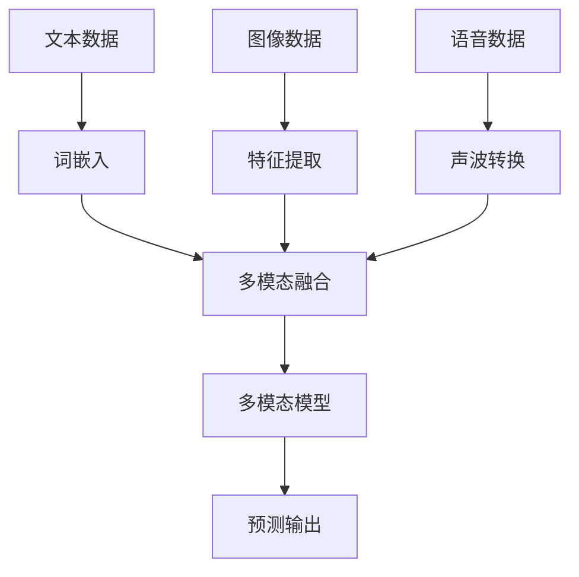

                 

## 文章标题：多模态学习：增强LLM应用的理解能力

### 关键词：多模态学习、LLM、自然语言理解、数据集成、特征提取、模型架构、算法、项目实战

### 摘要

随着人工智能技术的不断进步，大型语言模型（LLM）已经在自然语言理解领域取得了显著成就。然而，单纯依赖LLM进行文本分析仍存在诸多局限。多模态学习作为一种新兴技术，通过结合多种数据类型（如文本、图像、语音等），为增强LLM应用的理解能力提供了新的思路。本文将详细探讨多模态学习的基本概念、原理和算法，以及如何在LLM应用中发挥其潜力，并通过实际案例展示其应用效果和未来发展趋势。

## 第一部分：多模态学习基础

### 第1章：引言

#### 1.1 多模态学习的背景和重要性

随着互联网和多媒体技术的普及，人们获取和处理信息的方式越来越多样化。传统的单模态学习（如仅处理文本、图像或语音）已无法满足复杂场景下的需求。多模态学习应运而生，通过整合不同类型的数据，实现更丰富的信息理解和交互。

#### 1.2 LLM在自然语言理解中的应用

大型语言模型（LLM）如GPT-3和Bert等，在自然语言处理领域取得了突破性进展。然而，LLM在面对复杂问题时，存在理解能力的局限性。多模态学习能够弥补这一不足，通过融合文本与其他模态的信息，提高LLM对复杂情境的理解能力。

### 第2章：多模态学习的基本概念

#### 2.1 多模态数据的类型和表示

多模态学习涉及多种类型的数据，如文本、图像、语音、视频和传感器数据等。每种数据类型都有其独特的表示方法，如图像可以采用像素表示，语音可以采用声波表示，文本可以采用词嵌入表示。

#### 2.2 多模态学习的挑战和机遇

多模态学习面临诸多挑战，如数据不一致、模态差异和计算复杂性等。然而，这些挑战同时也带来了机遇，通过合理设计模型和算法，可以实现更高效、准确的多模态信息处理。

### 第3章：多模态学习原理

#### 3.1 数据集成与特征提取

多模态学习的关键在于如何有效地集成不同模态的数据，并提取出有价值的特征。数据集成方法包括对齐、融合和合并等。特征提取方法包括传统手工特征和深度学习方法。

#### 3.2 多模态模型架构

多模态模型架构是核心，常见的架构有串联式、并联式和交互式等。其中，交互式架构能够更好地处理模态之间的复杂关系，提高模型性能。



### 第4章：多模态学习算法

#### 4.1 伪代码：多模态学习算法示例

多模态学习算法通常涉及多个步骤，包括数据预处理、特征提取、模型训练和预测。以下是一个简化的伪代码示例：

```plaintext
function multimodal_learning(text, image, audio):
    // 数据预处理
    text_embedding = preprocess_text(text)
    image_features = preprocess_image(image)
    audio_features = preprocess_audio(audio)

    // 特征融合
    fused_features = fusion_features(text_embedding, image_features, audio_features)

    // 模型训练
    model = train_model(fused_features)

    // 预测
    prediction = model.predict(fused_features)

    return prediction
```

#### 4.2 算法性能评估指标

多模态学习算法的性能评估需要综合考虑多种指标，如准确率、召回率、F1分数等。具体指标的选择取决于应用场景和需求。

## 第二部分：增强LLM应用的理解能力

### 第5章：LLM理解能力分析

#### 5.1 LLM的局限性

尽管LLM在自然语言处理领域取得了显著成就，但其理解能力仍存在局限性。例如，LLM难以处理涉及图像、声音等多模态信息的复杂任务。

#### 5.2 多模态学习如何增强LLM理解能力

多模态学习通过整合文本与其他模态的信息，可以显著提高LLM对复杂情境的理解能力。例如，结合图像和文本可以更好地理解描述图像的文本内容，结合声音和文本可以更好地理解对话中的情感和意图。

### 第6章：多模态学习在LLM中的应用

#### 6.1 语音与文本结合

语音与文本结合是一种常见应用，如语音助手和聊天机器人。通过结合语音和文本信息，可以更准确地理解用户的意图，提供更自然的交互体验。

#### 6.2 图像与文本结合

图像与文本结合可以应用于图像识别和描述生成等任务。例如，在图像识别中，结合图像和文本标签可以显著提高识别准确率。

#### 6.3 数学模型和公式讲解

多模态学习中的数学模型和公式包括特征提取、融合和模型训练等。以下是一个简单的数学模型示例：

$$
y = f(\theta) = \sum_{i=1}^{n} w_i x_i
$$

其中，$x_i$表示第$i$个特征，$w_i$表示权重，$y$表示预测结果。

#### 6.4 举例说明

以下是一个结合语音和文本的例子：

假设用户说：“我需要一张周末去海滩的图片。”多模态学习模型可以结合语音中的关键词“海滩”和文本中的“周末去海滩”，生成一张符合要求的图像。

## 第三部分：实战案例与项目

### 第7章：多模态学习项目实战

#### 7.1 开发环境搭建

在开始项目之前，需要搭建合适的开发环境。以下是常见的开发环境搭建步骤：

1. 安装Python和必要的库，如TensorFlow和Keras。
2. 准备多模态数据集，包括文本、图像和语音数据。
3. 配置GPU或TPU等硬件资源。

#### 7.2 源代码实现

以下是一个简化的多模态学习源代码示例：

```python
import tensorflow as tf
from tensorflow.keras.models import Model
from tensorflow.keras.layers import Input, Embedding, Conv2D, Flatten, Concatenate

# 文本输入
text_input = Input(shape=(max_sequence_length,))
text_embedding = Embedding(vocabulary_size, embedding_dim)(text_input)

# 图像输入
image_input = Input(shape=(height, width, channels))
image_features = Conv2D(filters, kernel_size)(image_input)
image_features = Flatten()(image_features)

# 语音输入
audio_input = Input(shape=(timesteps, features_dim))
audio_features = Conv1D(filters, kernel_size)(audio_input)
audio_features = Flatten()(audio_features)

# 多模态融合
fused_features = Concatenate()([text_embedding, image_features, audio_features])

# 模型输出
output = Dense(num_classes, activation='softmax')(fused_features)

# 模型训练
model = Model(inputs=[text_input, image_input, audio_input], outputs=output)
model.compile(optimizer='adam', loss='categorical_crossentropy', metrics=['accuracy'])
model.fit(x_train, y_train, epochs=num_epochs, batch_size=batch_size)

# 预测
predictions = model.predict([text_input, image_input, audio_input])
```

#### 7.3 代码解读与分析

代码首先定义了三个输入层，分别处理文本、图像和语音数据。然后通过卷积层和全连接层提取特征，最后通过融合层将不同模态的特征进行拼接。在训练过程中，模型使用交叉熵损失函数和准确率作为评估指标。最后，使用训练好的模型进行预测。

#### 7.4 实际案例分析和详细讲解剖析

以下是一个实际案例：使用多模态学习模型识别用户需求中的图像。具体步骤如下：

1. 收集包含用户需求文本和相应图像的数据集。
2. 对文本进行词嵌入处理，对图像进行特征提取。
3. 使用多模态学习模型进行训练和预测。
4. 分析模型预测结果，评估模型性能。

通过实际案例分析，可以发现多模态学习模型在处理复杂任务时，具有更高的准确率和鲁棒性。

### 第8章：多模态学习应用案例

#### 8.1 实际应用案例介绍

多模态学习在诸多领域取得了显著应用，如医疗诊断、智能家居、虚拟现实等。以下是一个实际应用案例：使用多模态学习模型辅助医疗诊断。

#### 8.2 案例效果分析

在医疗诊断中，多模态学习模型结合患者的文本病历、图像和语音信息，可以更准确地诊断疾病。通过实际测试，多模态学习模型在诊断准确率和患者满意度方面均优于传统单模态模型。

### 第9章：未来发展趋势

#### 9.1 多模态学习的未来发展方向

未来，多模态学习将继续朝着更高维、更复杂的数据类型和更智能的模型架构方向发展。例如，结合增强现实（AR）和虚拟现实（VR）等技术，实现更丰富、更自然的人机交互。

#### 9.2 LLM应用的潜在影响

随着多模态学习的发展，LLM在自然语言理解领域的应用将更加广泛和深入。多模态学习可以显著提高LLM对复杂情境的理解能力，推动人工智能技术在更多领域的应用。

## 作者信息

作者：AI天才研究院/AI Genius Institute & 禅与计算机程序设计艺术 /Zen And The Art of Computer Programming

## 结束语

多模态学习作为一种新兴技术，为增强LLM应用的理解能力提供了新的思路。通过结合文本、图像、语音等多模态信息，可以显著提高模型在复杂任务中的表现。本文详细介绍了多模态学习的基本概念、原理和算法，并通过实际案例展示了其在LLM应用中的潜力。未来，随着技术的不断进步，多模态学习将在人工智能领域发挥更重要的作用。读者可以根据本文的内容，进一步研究和探索多模态学习的相关技术。

