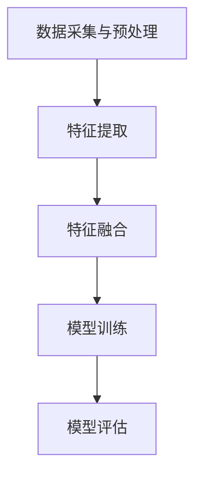

                 

### 第1章 多模态融合概述

#### 1.1 多模态融合的基本概念

多模态融合是指将来自不同感知模态（如图像、文本、音频、视频等）的数据进行整合，以提高模型对复杂信息的理解和处理能力。在人工智能领域，多模态融合成为近年来研究的热点之一，其主要目的是通过整合不同模态的数据，实现信息互补和协同，从而提高模型的泛化能力和表现。

多模态融合的核心概念包括：
- **数据融合**：将不同模态的数据转换为同一表示空间，以便进行后续处理。
- **特征提取**：从原始数据中提取出具有代表性和区分性的特征，为数据融合提供基础。
- **模型训练**：利用融合后的特征训练深度学习模型，以实现多模态任务的目标。
- **模型评估**：通过评估指标衡量模型在多模态任务上的性能。

#### 1.2 多模态融合的应用领域

多模态融合在多个应用领域展现出巨大的潜力，以下是几个典型的应用场景：
- **图像与文本融合**：在计算机视觉和自然语言处理领域，图像与文本的融合可以用于图像标注、图像描述生成、问答系统等任务。
- **视频与音频融合**：在视频分析、视频检索、语音识别等领域，视频与音频的融合可以增强模型的情境感知能力和语音识别准确性。
- **其他多模态融合**：除了常见的图像、文本、音频、视频模态外，还有嗅觉、触觉等感知模态的融合研究，这些研究在医疗、工业等领域具有潜在的应用价值。

#### 1.3 多模态融合的基本流程

多模态融合的基本流程可以分为以下几个步骤：
1. **数据采集与预处理**：收集不同模态的数据，并进行必要的预处理，如去噪、归一化、补全等。
2. **特征提取**：从原始数据中提取出具有代表性和区分性的特征。对于图像，常见的特征提取方法包括卷积神经网络（CNN）等；对于文本，常用的特征提取方法包括词袋模型、词嵌入等；对于音频，常用的特征提取方法包括梅尔频率倒谱系数（MFCC）等。
3. **特征融合**：将不同模态的特征进行融合，以生成一个综合特征表示。特征融合的方法可以分为基于加权融合、基于学习融合等。
4. **模型训练**：利用融合后的特征进行模型训练。常见的训练方法包括端到端训练、两步法等。
5. **模型评估**：通过评估指标（如准确率、召回率、F1值等）衡量模型在多模态任务上的性能。

#### 1.4 多模态融合与模型理解力

模型理解力是指模型对输入数据的理解和解释能力。在多模态融合中，模型理解力至关重要。通过多模态融合，模型可以更好地理解复杂情境和隐含信息，从而提高任务的准确性和鲁棒性。

多模态融合对模型理解力的影响主要体现在以下几个方面：
- **增强情境感知能力**：多模态数据可以提供更丰富的情境信息，有助于模型更好地理解任务背景。
- **提高特征代表性**：多模态融合可以生成更具代表性和区分性的特征表示，有助于模型更好地捕捉数据中的关键信息。
- **增强鲁棒性**：多模态数据可以相互补充，有助于模型对噪声和异常值具有更好的鲁棒性。

#### 1.5 全文概览

本书将从以下几个方面详细探讨多模态融合能力评测：
- **第1章**：介绍多模态融合的基本概念、应用领域、基本流程以及与模型理解力之间的关系。
- **第2章**：深入探讨多模态特征提取方法，包括图像、文本、音频等特征提取的原理和实现。
- **第3章**：分析多模态融合策略，讨论不同的融合方法及其优缺点。
- **第4章**：介绍模型理解力的评测方法，包括评价指标、评测流程等。
- **第5章**：通过一个实际项目案例，展示多模态融合能力评测的应用。
- **第6章**：对多模态融合模型进行评测和分析，提供改进建议。
- **第7章**：展望多模态融合能力评测的发展趋势和未来研究方向。

通过本书的详细讲解，读者可以系统地了解多模态融合能力评测的理论和实践，掌握多模态融合的核心技术和应用方法。

#### Mermaid流程图：多模态融合的基本流程



#### 1.6 小结

本章主要介绍了多模态融合的基本概念、应用领域、基本流程以及与模型理解力之间的关系。多模态融合通过整合不同模态的数据，可以显著提高模型对复杂信息的理解和处理能力。本章还通过一个简单的Mermaid流程图，展示了多模态融合的基本流程。在后续章节中，我们将深入探讨多模态特征提取方法、融合策略、模型理解力评测方法以及实际项目应用，帮助读者全面掌握多模态融合能力评测的理论和实践。

---

作者：AI天才研究院/AI Genius Institute & 禅与计算机程序设计艺术 /Zen And The Art of Computer Programming

---

## 第2章 多模态特征提取

### 2.1 图像特征提取

图像特征提取是图像处理和计算机视觉中的关键步骤，其主要目的是从原始图像数据中提取出具有代表性和区分性的特征，以便用于后续的多模态融合和模型训练。

#### 2.1.1 卷积神经网络（CNN）

卷积神经网络（CNN）是目前图像特征提取最常用的方法之一。CNN通过卷积操作、池化和激活函数等步骤，从图像中逐步提取出低层次到高层次的抽象特征。

**原理与实现**

CNN的基本结构包括卷积层、池化层和全连接层。以下是CNN的特征提取过程的伪代码：

```python
# 初始化CNN模型
model = CNNModel()

# 输入图像
image = load_image("input_image.jpg")

# 通过卷积层提取特征
conv_features = model.conv_layers(image)

# 通过池化层进行下采样
pool_features = model.pool_layers(conv_features)

# 通过全连接层得到最终的特征向量
feature_vector = model.fc_layer(pool_features)
```

**优点**

- **高效性**：CNN能够自动学习图像中的层次结构，提高特征提取的效率。
- **鲁棒性**：CNN能够对图像中的噪声和变形具有一定的鲁棒性。

**缺点**

- **计算资源消耗**：CNN模型通常需要大量的计算资源和时间进行训练。
- **参数调优**：CNN模型的参数调优复杂，需要大量实验和经验。

#### 2.1.2 其他图像特征提取方法

除了CNN，还有其他图像特征提取方法，如SIFT、SURF、HOG等。这些方法在特定场景下具有优势。

**SIFT（尺度不变特征变换）**

SIFT是一种用于图像特征提取的算法，其主要特点是能够在不同尺度下检测图像特征点，并对旋转、缩放和亮度变化具有不变性。

**原理与实现**

SIFT的特征提取过程包括以下步骤：

1. **尺度空间极值点检测**：在图像的不同尺度上检测极值点。
2. **关键点定位**：对极值点进行定位，并确定关键点的方向。
3. **特征向量计算**：根据关键点的位置和方向，计算特征向量。

```python
# 初始化SIFT模型
sift = SIFTModel()

# 输入图像
image = load_image("input_image.jpg")

# 检测关键点
keypoints = sift.detect_keypoints(image)

# 计算特征向量
features = sift.compute_feature_vector(image, keypoints)
```

**优点**

- **尺度不变性**：SIFT能够检测不同尺度下的特征点。
- **旋转不变性**：SIFT能够检测旋转不变的图像特征。

**缺点**

- **计算复杂度**：SIFT的计算复杂度较高，耗时较长。

**HOG（直方图方向梯度）**

HOG是一种基于图像局部特征的提取方法，通过计算图像梯度直方图来描述图像的局部结构。

**原理与实现**

HOG的特征提取过程包括以下步骤：

1. **图像分割**：将图像分割成多个区域。
2. **梯度计算**：计算每个区域的梯度方向和幅度。
3. **直方图计算**：将梯度方向和幅度转化为直方图。

```python
# 初始化HOG模型
hog = HOGModel()

# 输入图像
image = load_image("input_image.jpg")

# 计算梯度
gradients = hog.compute_gradients(image)

# 计算直方图
histogram = hog.compute_histogram(gradients)
```

**优点**

- **高效性**：HOG算法计算效率高，适用于大规模图像处理。
- **鲁棒性**：HOG能够对光照变化和噪声具有一定的鲁棒性。

**缺点**

- **特征表达能力**：HOG的特征表达能力有限，可能无法捕捉到图像中的复杂结构。

### 2.2 文本特征提取

文本特征提取是自然语言处理（NLP）中的关键步骤，其主要目的是从文本数据中提取出具有代表性和区分性的特征，以便用于后续的多模态融合和模型训练。

#### 2.2.1 词袋模型（Bag of Words, BoW）

词袋模型是一种常用的文本特征提取方法，其基本思想是将文本表示为一个单词的集合，不考虑单词的顺序和语法结构。

**原理与实现**

词袋模型的特征提取过程包括以下步骤：

1. **分词**：将文本分成单词或词组。
2. **构建词汇表**：将所有出现的单词或词组构建成一个词汇表。
3. **向量化**：将文本向量化，即用词汇表中的单词表示文本。

```python
# 初始化BoW模型
bow = BagOfWordsModel()

# 输入文本
text = "这是一篇关于多模态融合的文章"

# 分词
words = bow.tokenize(text)

# 构建词汇表
vocabulary = bow.build_vocab(words)

# 向量化
vector = bow.vectorize(words, vocabulary)
```

**优点**

- **简单性**：词袋模型简单易懂，计算效率高。
- **有效性**：词袋模型能够捕捉文本中的词汇信息。

**缺点**

- **顺序无关性**：词袋模型不考虑单词的顺序和语法结构，可能导致信息的丢失。
- **稀疏性**：文本数据通常会导致词袋模型的高维度和稀疏性，增加计算复杂度。

#### 2.2.2 词嵌入（Word Embedding）

词嵌入是一种将文本中的单词映射到高维向量空间的方法，其目的是在向量空间中保留单词的语义和语法信息。

**原理与实现**

词嵌入的特征提取过程包括以下步骤：

1. **初始化词嵌入向量**：为每个单词初始化一个向量。
2. **训练词嵌入模型**：通过大量文本数据训练词嵌入模型，优化词嵌入向量。
3. **向量化**：将文本中的每个单词映射到其对应的词嵌入向量。

```python
# 初始化词嵌入模型
word_embedding = WordEmbeddingModel()

# 输入文本
text = "这是一篇关于多模态融合的文章"

# 训练词嵌入模型
word_embedding.train(text)

# 向量化
vector = word_embedding.embed(text)
```

**优点**

- **语义信息保留**：词嵌入能够在向量空间中保留单词的语义信息。
- **降维性**：词嵌入能够将高维的文本数据降维到相对低维的向量空间，减少计算复杂度。

**缺点**

- **训练复杂度**：词嵌入模型的训练需要大量的数据和计算资源。
- **数据依赖性**：词嵌入模型的性能对训练数据的分布和大小非常敏感。

### 2.3 音频特征提取

音频特征提取是音频处理和语音识别中的关键步骤，其主要目的是从音频数据中提取出具有代表性和区分性的特征，以便用于后续的多模态融合和模型训练。

#### 2.3.1 梅尔频率倒谱系数（MFCC）

梅尔频率倒谱系数（MFCC）是一种常用的音频特征提取方法，其目的是将音频信号转换为一组频域特征，以捕捉音频的频谱特性。

**原理与实现**

MFCC的特征提取过程包括以下步骤：

1. **预处理**：对音频信号进行预处理，如滤波、去噪等。
2. **傅里叶变换**：对预处理后的音频信号进行傅里叶变换，得到频谱。
3. **梅尔滤波器组**：将频谱通过梅尔滤波器组滤波，得到一组梅尔频率分量。
4. **倒谱变换**：对梅尔频率分量进行倒谱变换，得到MFCC特征。

```python
# 初始化MFCC模型
mfcc = MFCCModel()

# 输入音频
audio = load_audio("input_audio.wav")

# 预处理
preprocessed_audio = mfcc.preprocess(audio)

# 傅里叶变换
fourier_transform = mfcc.fourier_transform(preprocessed_audio)

# 梅尔滤波器组滤波
mel_filter Banks = mfcc.mel_filter Banks(fourier_transform)

# 倒谱变换
mfcc_features = mfcc.coltrend_transform(mel_filter Banks)
```

**优点**

- **频谱信息保留**：MFCC能够保留音频信号的频谱信息。
- **降维性**：MFCC能够将高维的音频信号降维到相对低维的特征向量，便于模型训练。

**缺点**

- **计算复杂度**：MFCC的计算复杂度较高，耗时较长。
- **对噪声敏感**：MFCC对噪声较为敏感，可能影响特征提取的效果。

#### 2.3.2 汉明特征（Hamming Features）

汉明特征是一种基于汉明距离的音频特征提取方法，其目的是通过计算两个音频信号的汉明距离来衡量它们的相似性。

**原理与实现**

汉明特征的特征提取过程包括以下步骤：

1. **量化**：将音频信号量化为二进制序列。
2. **计算汉明距离**：计算两个音频信号之间的汉明距离。

```python
# 初始化汉明特征模型
hamming = HammingFeaturesModel()

# 输入音频
audio1 = load_audio("input_audio1.wav")
audio2 = load_audio("input_audio2.wav")

# 量化
binary_sequence1 = hamming.quantize(audio1)
binary_sequence2 = hamming.quantize(audio2)

# 计算汉明距离
distance = hamming.hamming_distance(binary_sequence1, binary_sequence2)
```

**优点**

- **计算简单**：汉明特征的提取过程简单，计算效率高。
- **相似性度量**：汉明特征能够有效地衡量音频信号的相似性。

**缺点**

- **特征表达能力**：汉明特征的表达能力有限，可能无法捕捉到音频信号的复杂结构。
- **对噪声敏感**：汉明特征对噪声较为敏感，可能影响特征提取的效果。

### 2.4 视频特征提取

视频特征提取是视频处理和计算机视觉中的关键步骤，其主要目的是从视频数据中提取出具有代表性和区分性的特征，以便用于后续的多模态融合和模型训练。

#### 2.4.1 光流特征（Optical Flow）

光流特征是一种用于描述视频帧间运动信息的特征提取方法，其目的是通过计算视频帧之间的运动矢量来捕捉视频的动态特性。

**原理与实现**

光流特征的特征提取过程包括以下步骤：

1. **预处理**：对视频帧进行预处理，如去噪、滤波等。
2. **光流计算**：计算视频帧之间的光流场。
3. **特征提取**：从光流场中提取出具有代表性的特征，如光流速度、方向等。

```python
# 初始化光流模型
optical_flow = OpticalFlowModel()

# 输入视频帧
frame1 = load_frame("input_video1.jpg")
frame2 = load_frame("input_video2.jpg")

# 预处理
preprocessed_frame1 = optical_flow.preprocess(frame1)
preprocessed_frame2 = optical_flow.preprocess(frame2)

# 光流计算
flow_field = optical_flow.calculate_flow(preprocessed_frame1, preprocessed_frame2)

# 特征提取
flow_features = optical_flow.extract_features(flow_field)
```

**优点**

- **动态捕捉**：光流特征能够有效地捕捉视频的动态特性。
- **实时性**：光流特征的提取过程相对实时，适用于实时视频处理。

**缺点**

- **计算复杂度**：光流特征的提取过程计算复杂度较高，可能需要大量计算资源。
- **对噪声敏感**：光流特征对噪声较为敏感，可能影响特征提取的效果。

#### 2.4.2 视频编码特征（Video Coding Features）

视频编码特征是一种基于视频编码技术提取的特征，其目的是通过分析视频编码过程中的信息损失来捕捉视频的特性。

**原理与实现**

视频编码特征的特征提取过程包括以下步骤：

1. **视频编码**：对视频帧进行编码，如使用H.264或HEVC编码。
2. **特征提取**：分析编码后的视频数据，提取出具有代表性的特征，如量化步长、失真度等。

```python
# 初始化视频编码特征模型
video_coding = VideoCodingFeaturesModel()

# 输入视频帧
frame = load_frame("input_video_frame.jpg")

# 视频编码
encoded_frame = video_coding.encode_frame(frame)

# 特征提取
coding_features = video_coding.extract_features(encoded_frame)
```

**优点**

- **高效性**：视频编码特征提取过程相对高效，适用于大规模视频处理。
- **信息损失分析**：视频编码特征能够捕捉视频编码过程中的信息损失，有助于理解视频的特性。

**缺点**

- **依赖编码标准**：视频编码特征的提取依赖于特定的视频编码标准，可能影响特征的一致性和通用性。
- **特征表达能力**：视频编码特征的表达能力有限，可能无法捕捉到视频中的复杂结构。

### 2.5 多模态特征提取的融合策略

多模态特征提取的融合策略是指如何将不同模态的特征进行整合，以生成一个综合的特征表示。融合策略可以分为以下几种类型：

#### 2.5.1 基于加权融合

基于加权融合的方法通过为不同模态的特征分配不同的权重来整合特征。权重的确定可以通过多种方式，如基于统计方法、基于模型的方法等。

**原理与实现**

基于加权融合的特征提取过程包括以下步骤：

1. **特征提取**：从不同模态的数据中提取特征。
2. **权重计算**：为不同模态的特征计算权重。
3. **特征融合**：根据权重将不同模态的特征加权融合。

```python
# 初始化特征提取模型
image_feature_extractor = ImageFeatureExtractor()
text_feature_extractor = TextFeatureExtractor()

# 输入图像和文本
image = load_image("input_image.jpg")
text = load_text("input_text.txt")

# 特征提取
image_features = image_feature_extractor.extract_features(image)
text_features = text_feature_extractor.extract_features(text)

# 权重计算
image_weight = 0.6
text_weight = 0.4

# 特征融合
weighted_features = image_weight * image_features + text_weight * text_features
```

**优点**

- **灵活性**：基于加权融合的方法可以根据应用需求灵活调整不同模态的特征权重。
- **计算效率**：该方法相对简单，计算效率较高。

**缺点**

- **权重依赖性**：该方法依赖于特征的权重，权重的选择对结果影响较大。

#### 2.5.2 基于学习融合

基于学习融合的方法通过训练一个深度学习模型来自动学习不同模态特征的融合方式。该方法通常使用端到端训练策略，能够自动学习特征融合的复杂关系。

**原理与实现**

基于学习融合的特征提取过程包括以下步骤：

1. **特征提取**：从不同模态的数据中提取特征。
2. **模型训练**：使用提取的特征训练深度学习模型。
3. **特征融合**：通过训练的模型将不同模态的特征融合。

```python
# 初始化深度学习模型
fusion_model = MultimodalFusionModel()

# 输入图像和文本
image = load_image("input_image.jpg")
text = load_text("input_text.txt")

# 特征提取
image_features = image_feature_extractor.extract_features(image)
text_features = text_feature_extractor.extract_features(text)

# 模型训练
fusion_model.train(image_features, text_features)

# 特征融合
 fused_features = fusion_model.fuse(image_features, text_features)
```

**优点**

- **自动性**：基于学习融合的方法能够自动学习特征融合的方式，不需要人为干预。
- **鲁棒性**：该方法对特征权重和融合方式的鲁棒性较高。

**缺点**

- **计算复杂度**：基于学习融合的方法通常需要大量的计算资源和时间进行模型训练。
- **数据依赖性**：该方法对训练数据的质量和数量有较高的要求。

### 2.6 小结

本章详细介绍了多模态特征提取的方法，包括图像、文本、音频和视频特征提取的原理和实现。通过不同的特征提取方法，我们可以从不同模态的数据中提取出具有代表性和区分性的特征，为后续的多模态融合和模型训练提供基础。同时，本章还介绍了多模态特征提取的融合策略，包括基于加权融合和基于学习融合的方法。这些方法各有优缺点，可以根据具体应用需求进行选择和优化。

### 注意事项

1. 在进行多模态特征提取时，需要注意不同模态的数据预处理方法，如去噪、归一化等，以确保特征的代表性和一致性。
2. 在选择特征提取方法时，需要考虑特征提取的效率、计算复杂度和特征表达能力，根据具体任务需求进行选择。
3. 在进行特征融合时，需要合理分配不同模态的特征权重，并考虑特征融合方法的鲁棒性和自动性。

### 拓展阅读

1. 《深度学习》（Goodfellow, I., Bengio, Y., & Courville, A.）：这本书详细介绍了深度学习的基本概念和技术，包括卷积神经网络、循环神经网络等，对图像、文本和音频特征提取提供了深入的讲解。
2. 《自然语言处理综合教程》（Jurafsky, D. & Martin, J. H.）：这本书介绍了自然语言处理的基本概念和技术，包括词袋模型、词嵌入等，对文本特征提取提供了详细的讲解。
3. 《音频处理与识别》（Rabiner, L. R. & Juang, B.-H.）：这本书介绍了音频处理和语音识别的基本概念和技术，包括梅尔频率倒谱系数（MFCC）、汉明特征等，对音频特征提取提供了深入的讲解。

