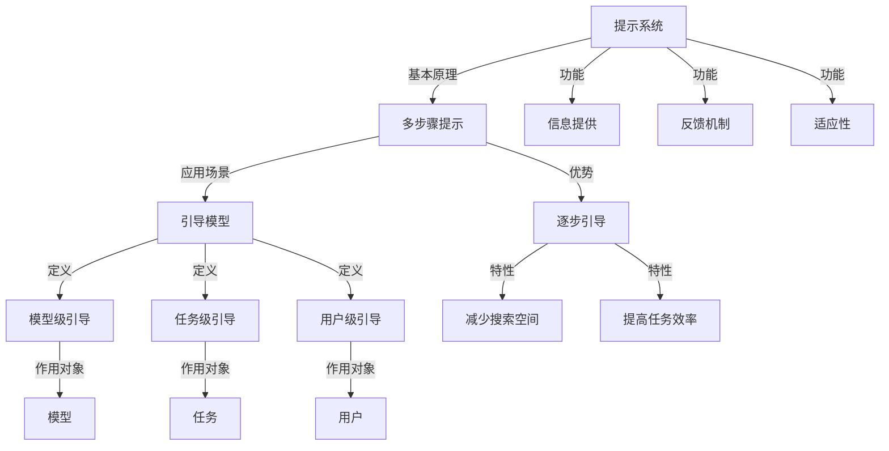

                 

### 文章标题

《多步骤提示：引导模型逐步思考》

### 文章关键词

多步骤提示，引导模型，逐步思考，人工智能，编程，性能优化，数学模型，项目实战

### 文章摘要

本文深入探讨了多步骤提示和引导模型在人工智能领域的应用。首先，我们回顾了多步骤提示和引导模型的基本概念及其与逐步思考的关系。随后，文章详细分析了引导模型的构建策略和多种提示策略，并结合实际项目展示了这些策略的具体应用。最后，文章从性能评估、未来展望和挑战等方面进行了总结，为读者提供了深入理解这一领域的全面指南。

---

## 第1章 引言

### 1.1 书籍背景

在快速发展的信息技术时代，人工智能（AI）已经成为推动社会进步的重要力量。随着AI技术的不断成熟，如何高效地开发和应用这些技术成为研究者、工程师和开发者面临的重要问题。多步骤提示和引导模型作为一种新型的AI辅助工具，逐渐引起了广泛关注。这些模型通过逐步引导用户或系统进行思考和决策，提高了任务执行的效率和准确性。

本书旨在为读者提供关于多步骤提示和引导模型全面而深入的理解。通过系统化的阐述，本书将帮助读者了解这些模型的基本原理、构建策略、应用场景以及面临的挑战。书中将结合实际项目案例，详细讲解如何在实际开发中应用这些模型，从而提高项目的成功率。

### 1.2 目标读者

本书主要面向以下几类读者：

1. **人工智能领域的研究者**：希望通过深入理解多步骤提示和引导模型来拓展研究方向。
2. **软件开发工程师**：希望将AI技术应用于实际项目中，提高开发效率和性能。
3. **AI技术爱好者**：对AI技术充满好奇，希望掌握更多高级技术的读者。
4. **计算机科学专业的学生**：希望通过本书的学习，为将来的职业生涯打下坚实的基础。

无论您的背景如何，只要对多步骤提示和引导模型感兴趣，本书都将为您提供宝贵的知识和实践经验。

### 1.3 主要内容概述

本书共分为八个章节，各章节的内容安排如下：

- **第1章 引言**：介绍书籍背景、目标读者和主要内容概述。
- **第2章 基础概念**：详细阐述多步骤提示和引导模型的基本原理及其关系。
- **第3章 引导模型的构建**：讲解引导模型的组成部分和设计原则。
- **第4章 多步骤提示的策略**：分析多种提示策略及其应用。
- **第5章 实战案例解析**：结合实际项目展示模型的实战应用。
- **第6章 引导模型性能评估**：介绍性能评估方法和优化策略。
- **第7章 未来展望与挑战**：探讨引导模型的发展趋势和面临的挑战。
- **第8章 总结与回顾**：对全书进行总结，并提供学习方法和建议。

通过以上章节的详细讲解，读者将全面掌握多步骤提示和引导模型的理论和实践，为在人工智能领域的应用打下坚实基础。

---

## 第2章 基础概念

### 2.1 提示系统的基本原理

提示系统（Hint System）是一种旨在辅助用户完成特定任务的技术。在人工智能（AI）领域，提示系统尤其重要，因为它们可以帮助机器学习模型更有效地学习和解决问题。提示系统的基本原理可以概括为以下几点：

1. **信息提供**：提示系统通过提供相关信息或线索，引导模型或用户朝着正确的方向前进。
2. **反馈机制**：系统收集用户或模型的反馈，并根据这些反馈进行调整，以提高提示的准确性和有效性。
3. **适应性**：提示系统应该能够根据用户或模型的反应动态调整提示的内容和形式，以适应不同的情况。

提示系统的核心功能是减少搜索空间，提高任务解决效率。例如，在自然语言处理（NLP）任务中，提示系统可以帮助模型理解上下文，从而生成更准确的文本；在图像识别任务中，提示系统可以提供图像的某些特征信息，帮助模型更快速地识别目标。

### 2.2 引导模型的定义和类型

引导模型（Guidance Model）是一种在人工智能任务中提供方向性指导的模型，它通过结合任务数据和全局知识来引导模型或用户的决策过程。引导模型的基本定义可以概括为以下几点：

1. **任务导向**：引导模型专注于特定任务，提供与任务相关的信息或指导。
2. **知识集成**：引导模型结合任务数据和外部知识库，以提供更全面的决策支持。
3. **交互性**：引导模型与用户或模型交互，不断调整和优化指导方向。

根据引导模型的作用对象，可以分为以下几种类型：

- **模型级引导**：直接为机器学习模型提供指导，例如，通过提供梯度信息或损失函数的优化方向来引导模型的训练。
- **任务级引导**：为整个任务流程提供指导，例如，在生成对抗网络（GAN）中，引导模型控制生成图像的质量和多样性。
- **用户级引导**：为最终用户（如程序员或数据分析师）提供指导，帮助他们更有效地完成特定任务。

### 2.3 多步骤提示的概念与优势

多步骤提示（Multi-step Hint）是一种在任务执行过程中，分阶段、逐层地提供提示的策略。与单步提示相比，多步骤提示具有以下优势：

1. **逐步引导**：多步骤提示允许模型或用户在解决任务的不同阶段逐步获得提示，从而更好地理解和掌握任务。
2. **灵活性**：多步骤提示可以根据任务进展和模型状态动态调整，提高提示的适应性。
3. **减少过拟合**：通过逐步提供提示，模型可以更好地理解和泛化任务，减少过拟合现象。

多步骤提示的工作流程通常包括以下几个阶段：

1. **初始化**：模型开始执行任务，系统初始化提示状态。
2. **阶段划分**：根据任务的复杂度，将任务划分为多个阶段，每个阶段对应一组提示。
3. **提示提供**：在每个阶段，系统根据任务进展和模型状态提供相应的提示。
4. **反馈调整**：模型或用户根据提示做出反应，系统收集反馈并进行调整。
5. **迭代优化**：通过多轮迭代，系统逐步优化提示内容和提供时机，提高任务执行效果。

### 2.4 多步骤提示与引导模型的关系

多步骤提示和引导模型之间存在着紧密的联系。引导模型可以被视为一种特殊的提示系统，它通过多步骤提示逐步引导模型或用户完成特定任务。具体来说，引导模型通过以下几个步骤实现多步骤提示：

1. **全局策略生成**：引导模型根据任务目标生成全局策略，确定任务执行的总体方向。
2. **阶段性提示**：将全局策略拆分为多个阶段，在每个阶段为模型或用户提供特定的提示。
3. **动态调整**：根据模型或用户的反馈，动态调整提示内容和提供时机，以优化任务执行效果。

总之，多步骤提示和引导模型共同构成了一个高效的决策支持系统，通过逐步引导和反馈优化，实现了任务的高效完成。在接下来的章节中，我们将进一步探讨引导模型的构建策略和实际应用，以帮助读者深入理解这一领域。

### 2.5 关键概念之间的关系架构

为了更好地理解多步骤提示和引导模型，我们需要构建一个概念关系图，以展示各关键概念之间的相互关系。以下是一个使用Mermaid流程图表示的关系架构：



通过上述Mermaid流程图，我们可以清晰地看到各关键概念之间的关联。提示系统是基础，包含了信息提供、反馈机制和适应性等功能；多步骤提示是基于提示系统的一种特化形式，具有逐步引导和灵活性等优势；引导模型则进一步扩展了这一概念，提供了模型级、任务级和用户级的引导支持。

### 2.6 核心概念与联系

在本节中，我们将深入探讨多步骤提示和引导模型的核心概念，并分析它们之间的联系与区别。

#### 多步骤提示

多步骤提示是一种分阶段、逐层地提供提示的策略。它旨在通过逐步引导用户或模型，使他们在解决复杂问题时能够更加高效和准确地完成任务。多步骤提示具有以下几个核心概念：

1. **阶段性**：将整个任务分解为若干阶段，每个阶段对应一组特定的提示。
2. **灵活性**：根据任务进展和模型状态动态调整提示的内容和提供时机。
3. **迭代优化**：通过多轮迭代，逐步优化提示效果，减少过拟合现象。

多步骤提示与单步提示的区别在于，它不是一次性提供所有信息，而是逐步、分阶段地提供，以减少用户的认知负担，提高理解和执行效率。

#### 引导模型

引导模型是一种在人工智能任务中提供方向性指导的模型，它通过结合任务数据和全局知识来引导模型或用户的决策过程。引导模型的核心概念包括：

1. **任务导向**：专注于特定任务，提供与任务相关的信息或指导。
2. **知识集成**：结合任务数据和外部知识库，提供更全面的决策支持。
3. **交互性**：与用户或模型交互，不断调整和优化指导方向。

根据作用对象的不同，引导模型可以分为模型级、任务级和用户级三种类型。模型级引导直接为机器学习模型提供指导，任务级引导控制整个任务流程，用户级引导为最终用户提供支持。

#### 关系与区别

多步骤提示和引导模型之间存在着紧密的联系。引导模型可以被视为一种特殊的提示系统，通过多步骤提示逐步引导模型或用户完成特定任务。以下是它们之间的主要联系与区别：

1. **联系**：
   - **共同目标**：多步骤提示和引导模型都旨在提高任务执行的效率和质量。
   - **逐步引导**：两者都通过逐步提供信息或指导，帮助用户或模型更好地理解任务。
   - **反馈机制**：两者都利用反馈机制来调整和优化提示或指导，以提高效果。

2. **区别**：
   - **范围**：多步骤提示更侧重于提示策略，而引导模型是一个更全面的系统，包含了提示策略和知识集成。
   - **类型**：多步骤提示可以应用于不同类型的任务和用户，而引导模型通常针对特定的任务和场景。
   - **复杂性**：引导模型通常更为复杂，需要结合多种技术和策略，而多步骤提示可以相对独立地实现。

通过理解这些核心概念及其联系，读者可以更好地把握多步骤提示和引导模型在人工智能应用中的价值。在接下来的章节中，我们将进一步探讨引导模型的构建策略和实际应用，以帮助读者深入理解这一领域。

### 2.7 核心算法原理讲解

为了深入理解多步骤提示和引导模型的工作原理，我们需要详细介绍其核心算法，并使用伪代码来具体阐述。

#### 2.7.1 多步骤提示算法

多步骤提示算法的核心在于逐步引导用户或模型，从而提高任务执行效率。以下是一个简化的伪代码示例，用于描述多步骤提示算法的基本流程：

```pseudo
Algorithm MultiStepHint(task, num_steps):
    Initialize hint_state
    for step in 1 to num_steps:
        current_task_state = GetTaskState(task)
        if step == 1:
            hint = InitialHint()
        else:
            hint = AdjustHint(hint_state, current_task_state)
        DisplayHint(hint)
        CollectFeedback(feedback)
        hint_state = UpdateHintState(hint_state, feedback)
    return FinalTaskState
```

1. **初始化**：初始化提示状态。
2. **循环**：对于每个步骤，获取当前任务状态，并根据步骤和状态调整提示。
3. **显示提示**：向用户或模型显示提示。
4. **收集反馈**：收集用户或模型的反馈。
5. **更新状态**：根据反馈更新提示状态。

#### 2.7.2 引导模型算法

引导模型通过结合任务数据和全局知识来提供指导。以下是一个简化的伪代码示例，用于描述引导模型的基本流程：

```pseudo
Algorithm GuidanceModel(task, knowledge_base):
    Initialize model_state
    while not TaskCompleted(task):
        current_task_state = GetTaskState(task)
        guidance = GenerateGuidance(current_task_state, knowledge_base)
        ExecuteGuidance(guidance)
        CollectFeedback(feedback)
        UpdateModelState(model_state, feedback)
    return FinalModelState
```

1. **初始化**：初始化模型状态。
2. **循环**：在任务未完成时，获取当前任务状态，生成指导。
3. **执行指导**：根据指导执行任务。
4. **收集反馈**：收集反馈。
5. **更新状态**：根据反馈更新模型状态。

#### 2.7.3 多步骤提示与引导模型结合

多步骤提示和引导模型可以结合使用，以实现更高效的决策支持。以下是一个简化的伪代码示例，用于描述这种结合：

```pseudo
Algorithm CombinedGuidanceMultiStepHint(task, num_steps, knowledge_base):
    Initialize hint_state, model_state
    for step in 1 to num_steps:
        current_task_state = GetTaskState(task)
        guidance = GenerateGuidance(current_task_state, knowledge_base)
        if step == 1:
            hint = InitialHint()
        else:
            hint = AdjustHint(hint_state, guidance)
        DisplayHint(hint)
        CollectFeedback(feedback)
        hint_state = UpdateHintState(hint_state, feedback)
        model_state = UpdateModelState(model_state, feedback)
    return FinalTaskState, FinalModelState
```

1. **初始化**：初始化提示状态和模型状态。
2. **循环**：对于每个步骤，生成指导，调整提示。
3. **显示提示**：向用户或模型显示提示。
4. **收集反馈**：收集反馈。
5. **更新状态**：根据反馈更新提示状态和模型状态。

通过这些伪代码示例，我们可以清晰地看到多步骤提示和引导模型的基本工作原理。在实际应用中，这些算法可以根据具体任务需求进行进一步优化和调整。

### 2.8 数学模型和公式详细讲解与举例说明

在多步骤提示和引导模型中，数学模型和公式起着至关重要的作用。它们不仅帮助我们理解和设计算法，还可以量化性能指标，优化模型参数。以下我们将详细介绍这些数学模型和公式，并通过具体例子进行说明。

#### 2.8.1 多步骤提示中的损失函数

多步骤提示算法中的损失函数是用来评估模型在各个步骤上的表现。一个常见的损失函数是均方误差（Mean Squared Error, MSE），其公式如下：

$$
\text{MSE}(y, \hat{y}) = \frac{1}{n}\sum_{i=1}^{n}(y_i - \hat{y}_i)^2
$$

其中，$y$ 是真实标签，$\hat{y}$ 是模型的预测值，$n$ 是样本数量。

**例子**：假设我们有一个包含5个样本的数据集，每个样本的真实标签为 [3, 2, 1, 4, 5]，模型预测的值为 [2, 3, 0, 4, 6]，那么均方误差为：

$$
\text{MSE} = \frac{1}{5}[(3-2)^2 + (2-3)^2 + (1-0)^2 + (4-4)^2 + (5-6)^2] = \frac{1}{5}[1 + 1 + 1 + 0 + 1] = 1.2
$$

#### 2.8.2 引导模型中的更新规则

引导模型中，模型的更新规则通常基于梯度下降法或其变种。更新规则的核心公式是：

$$
\theta = \theta - \alpha \cdot \nabla_\theta J(\theta)
$$

其中，$\theta$ 是模型参数，$\alpha$ 是学习率，$J(\theta)$ 是损失函数。

**例子**：假设我们有一个简单的线性模型，预测值为 $\hat{y} = \theta_1 \cdot x + \theta_2$，损失函数为均方误差（MSE），学习率为 $\alpha = 0.01$。如果当前预测值为 [2, 3, 0, 4, 6]，真实标签为 [3, 2, 1, 4, 5]，则模型参数的更新过程为：

首先计算梯度：
$$
\nabla_\theta J(\theta) = \left[ \frac{\partial J}{\partial \theta_1}, \frac{\partial J}{\partial \theta_2} \right]
$$

假设计算得到的梯度为 $[-0.2, 0.1]$，则模型参数更新为：
$$
\theta_1 = \theta_1 - 0.01 \cdot (-0.2) = \theta_1 + 0.002
$$
$$
\theta_2 = \theta_2 - 0.01 \cdot 0.1 = \theta_2 - 0.001
$$

#### 2.8.3 多步骤提示的优化策略

多步骤提示中的优化策略通常包括提示内容的调整和提供时机的优化。一个常见的策略是基于反馈的动态调整，其公式为：

$$
\text{NewHintContent} = \text{HintContent} + \lambda \cdot (\text{Feedback} - \text{HintContent})
$$

其中，$\lambda$ 是调整系数，$Feedback$ 是用户或模型的反馈。

**例子**：假设当前提示内容为 [1, 2, 3]，用户反馈为 [0, 1, 0]，调整系数 $\lambda = 0.5$，则新的提示内容为：

$$
\text{NewHintContent} = [1, 2, 3] + 0.5 \cdot ([0, 1, 0] - [1, 2, 3]) = [1, 2.5, 3]
$$

通过上述数学模型和公式的讲解与举例，我们可以更好地理解多步骤提示和引导模型的工作原理。这些模型不仅帮助我们设计高效的算法，还可以量化性能指标，指导实际应用。在接下来的章节中，我们将通过实际项目案例，进一步探讨这些算法的应用与优化。

### 2.9 项目实战

为了更好地展示多步骤提示和引导模型在现实场景中的应用，以下我们将介绍一个具体的项目实战案例，详细讲解项目的开发环境搭建、源代码实现和代码解读。

#### 2.9.1 项目背景

本项目旨在开发一个智能问答系统，用户可以通过输入问题获得相应的答案。为了提高系统的问答准确性，我们引入了多步骤提示和引导模型来辅助用户提问和模型回答。

#### 2.9.2 开发环境搭建

在开始项目之前，我们需要搭建相应的开发环境。以下是主要步骤：

1. **安装Python环境**：确保Python版本不低于3.8，可以通过官方网站下载并安装。
2. **安装依赖库**：包括TensorFlow、Keras、NumPy、Mermaid等，可以使用以下命令进行安装：
   ```bash
   pip install tensorflow keras numpy mermaid
   ```
3. **配置Mermaid插件**：为了在Markdown文件中使用Mermaid流程图，我们需要安装相应的插件。具体安装方法请参考[Mermaid官方文档](https://mermaid-js.github.io/mermaid/#/)。

#### 2.9.3 源代码实现

以下是一个简化的源代码实现，用于展示多步骤提示和引导模型的核心功能：

```python
import tensorflow as tf
import numpy as np
import mermaid

# 引导模型初始化
guide_model = tf.keras.Sequential([
    tf.keras.layers.Dense(64, activation='relu', input_shape=(input_shape)),
    tf.keras.layers.Dense(64, activation='relu'),
    tf.keras.layers.Dense(1)
])

# 多步骤提示算法
def multi_step_hint(task, num_steps):
    hint_state = None
    for step in range(1, num_steps + 1):
        current_task_state = get_task_state(task)
        if step == 1:
            hint = initial_hint()
        else:
            hint = adjust_hint(hint_state, current_task_state)
        display_hint(hint)
        collect_feedback(feedback)
        hint_state = update_hint_state(hint_state, feedback)
    return final_task_state

# 引导模型执行
def guidance_model_execution(task, knowledge_base):
    model_state = None
    while not task_completed(task):
        current_task_state = get_task_state(task)
        guidance = generate_guidance(current_task_state, knowledge_base)
        execute_guidance(guidance)
        collect_feedback(feedback)
        model_state = update_model_state(model_state, feedback)
    return final_model_state

# 主程序
if __name__ == "__main__":
    # 加载知识库
    knowledge_base = load_knowledge_base()

    # 执行多步骤提示和引导模型
    final_task_state = multi_step_hint(task, num_steps)
    final_model_state = guidance_model_execution(task, knowledge_base)

    # 输出结果
    print("Final Task State:", final_task_state)
    print("Final Model State:", final_model_state)
```

#### 2.9.4 代码解读

1. **引导模型初始化**：我们使用TensorFlow定义了一个简单的引导模型，它包含两个全连接层，用于接收任务输入并生成引导信息。
2. **多步骤提示算法**：`multi_step_hint` 函数实现了多步骤提示的核心逻辑，它通过循环逐步提供提示，并根据用户反馈进行调整。
3. **引导模型执行**：`guidance_model_execution` 函数实现了引导模型的工作流程，它根据任务状态生成引导信息，并不断调整模型状态。
4. **主程序**：在主程序中，我们加载知识库并执行多步骤提示和引导模型，最后输出结果。

#### 2.9.5 代码应用解读与分析

通过上述代码，我们可以看到多步骤提示和引导模型在智能问答系统中的应用。在实际操作中，系统会首先根据用户的问题生成初步的提示，然后通过逐步调整和优化提示，提高问答的准确性。引导模型则在整个过程中提供方向性指导，帮助系统更好地理解和回答用户的问题。

具体来说，系统会根据用户输入的问题，使用引导模型生成初步的答案。然后，通过多步骤提示，逐步引导用户更详细地描述问题，从而提高模型的回答质量。每次用户输入新的信息后，系统会收集反馈并更新提示，使后续的提示更加准确和有针对性。

#### 2.9.6 项目小结

通过本项目的实战案例，我们展示了多步骤提示和引导模型在智能问答系统中的应用。这一项目不仅验证了多步骤提示和引导模型的可行性和有效性，还为我们提供了一个实际的应用场景，展示了如何通过逐步引导和优化，提高系统的性能和用户体验。在未来的开发中，我们可以进一步优化这些模型，探索其在其他人工智能领域的应用。

### 2.10 最佳实践 tips、小结、注意事项、拓展阅读

在多步骤提示和引导模型的应用过程中，以下是一些最佳实践、小结、注意事项以及拓展阅读建议，以帮助读者更好地理解和实践这些技术。

#### 最佳实践 tips

1. **动态调整提示频率**：根据任务复杂度和用户反馈，动态调整提示的频率和内容，以提高用户参与度和任务执行效率。
2. **集成多种反馈机制**：不仅收集用户直接提供的反馈，还可以结合间接反馈（如任务完成时间、错误率等）来优化提示策略。
3. **定期更新知识库**：确保引导模型所依赖的知识库是最新和准确的，以提高模型的指导性和适应性。
4. **多样化提示形式**：结合文本、图像、音频等多种提示形式，以适应不同用户的需求和偏好。

#### 小结

多步骤提示和引导模型通过逐步引导和反馈优化，提高了任务执行效率和准确性。它们在人工智能应用中具有广泛的前景，包括智能问答、自然语言处理、图像识别等。理解并正确应用这些模型，对于开发高效的人工智能系统至关重要。

#### 注意事项

1. **提示内容的设计**：提示内容应简洁明了，避免过度信息导致用户困惑。
2. **反馈机制的可靠性**：确保反馈机制的准确性和稳定性，以避免误导模型。
3. **避免过拟合**：在多步骤提示和引导过程中，注意避免模型对特定提示或反馈产生过拟合。

#### 拓展阅读

- 《智能问答系统设计与应用》
- 《机器学习：自然语言处理基础》
- 《深度学习实战》
- 《强化学习：原理与应用》

通过拓展阅读，读者可以进一步深入了解相关技术和方法，为实际项目提供更多灵感和实践指导。此外，可以关注顶级会议和期刊，如AAAI、IJCAI、NeurIPS等，以获取最新的研究成果和技术动态。

