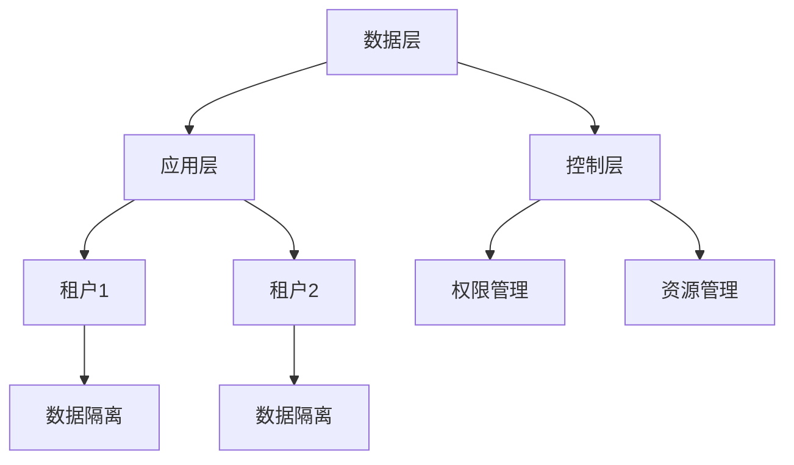

                 

# 多租户架构支持LLM应用的定制化需求

## 关键词

- 多租户架构
- LLM应用
- 定制化需求
- 隔离性
- 性能优化
- 安全性
- 共享性
- 数据管理

## 摘要

本文将探讨多租户架构在支持大型语言模型（LLM）应用定制化需求方面的重要性。随着人工智能技术的快速发展，LLM应用在众多领域得到了广泛应用，但其定制化需求也越来越复杂。多租户架构作为一种高效、灵活的解决方案，能够在保证隔离性、性能和安全性方面满足LLM应用的定制化需求。本文将从核心概念、架构设计、定制化需求、挑战与解决方案、实现步骤、数学模型、项目案例等方面展开讨论，为开发者提供有益的参考和指导。

## 引言

### 多租户架构的背景

多租户架构（Multi-Tenant Architecture）是指在同一计算环境中为多个租户（Tenant）提供资源和服务的一种架构模式。在这种架构中，租户可以是不同的组织、企业或个人，他们共享同一套基础设施和应用服务，但各自的数据和业务逻辑是隔离的。多租户架构在云计算、企业应用、SaaS等领域得到了广泛应用，其主要优点包括资源共享、成本降低、灵活性和可扩展性。

### LLM应用的定制化需求

大型语言模型（LLM）应用在自然语言处理、智能客服、内容生成等领域具有广泛的应用前景。然而，随着应用的不断深入，LLM应用的定制化需求也越来越复杂。这些需求包括：

1. **定制化模型**：不同的应用场景需要针对特定任务进行模型定制，如调整参数、添加特定层等。
2. **数据隔离**：为了保护用户隐私和业务安全，需要确保不同租户的数据是隔离的。
3. **性能优化**：针对大规模并发访问和计算需求，需要优化系统的性能和响应速度。
4. **安全性**：保障数据安全、防止数据泄露和恶意攻击是LLM应用的重要需求。
5. **灵活性**：支持快速部署和调整，以满足不断变化的业务需求。

### 多租户架构在支持LLM定制化需求中的作用

多租户架构在支持LLM应用的定制化需求方面具有显著优势。首先，多租户架构能够提供良好的隔离性，确保不同租户的数据和业务逻辑是独立的。其次，多租户架构能够优化资源利用率，提高系统性能和可扩展性。此外，多租户架构还能够提供灵活的部署和管理方式，方便开发者快速部署和调整LLM应用。

## 多租户架构的核心概念与架构设计

### 核心概念

在多租户架构中，核心概念包括：

1. **租户**：租户是指使用多租户架构的系统或服务的用户，可以是企业、组织或个人。
2. **隔离性**：隔离性是指确保不同租户的数据、资源和业务逻辑是独立和隔离的。
3. **共享性**：共享性是指多个租户可以共享同一套基础设施和应用服务。
4. **数据管理**：数据管理是指对租户数据进行存储、备份、恢复和安全保障。
5. **安全性**：安全性是指保障租户数据和系统的安全，防止数据泄露和恶意攻击。

### 架构设计

多租户架构通常包括以下几个关键组成部分：

1. **数据层**：数据层负责存储和管理租户数据。为了实现数据隔离，数据层通常采用分布式存储方案，如数据库集群、分布式文件系统等。
2. **应用层**：应用层是面向租户提供服务和功能的层。为了实现灵活部署和定制化，应用层通常采用微服务架构，将不同的功能模块分离，以便快速部署和调整。
3. **控制层**：控制层负责管理租户、资源和权限等。控制层通常采用集中式或分布式架构，以便高效管理和调度资源。

### Mermaid 流程图

以下是多租户架构的Mermaid流程图：



### 核心概念之间的关系

多租户架构的核心概念之间存在着密切的联系。数据层提供数据存储和管理，应用层提供服务和功能，控制层负责资源管理和权限控制。数据层和应用层通过API或消息队列进行交互，控制层则通过控制台或API与租户进行交互。这种架构设计能够实现良好的隔离性、共享性和安全性，从而支持LLM应用的定制化需求。

## 定制化需求与多租户架构的适配性

### 定制化需求的分类

在LLM应用中，定制化需求可以分为以下几类：

1. **模型定制**：针对特定任务或领域，调整LLM模型的参数、架构和训练数据，以实现更好的性能和效果。
2. **功能定制**：根据业务需求，添加或删除某些功能模块，以满足特定场景的需求。
3. **界面定制**：根据用户需求和品牌特色，定制界面样式和交互逻辑。
4. **数据定制**：根据业务需求和隐私保护要求，对数据进行筛选、过滤和处理，以确保数据安全和合规。

### 多租户架构在定制化需求中的适配性

多租户架构能够较好地适应这些定制化需求，主要表现在以下几个方面：

1. **模型定制**：多租户架构可以支持租户独立定制LLM模型。通过将模型定制功能模块化，租户可以在不影响其他租户的情况下，自由调整模型参数和架构。
2. **功能定制**：多租户架构支持微服务架构，开发者可以根据需求添加或删除功能模块。这种灵活的架构设计有助于快速响应业务需求，实现功能定制。
3. **界面定制**：多租户架构通常支持自定义界面样式和交互逻辑。通过使用前端框架（如React、Vue等），开发者可以方便地实现界面定制，以满足不同租户的需求。
4. **数据定制**：多租户架构可以提供数据隔离和权限控制机制，确保租户数据的安全和合规。通过数据筛选、过滤和处理，可以实现数据定制，满足不同业务需求。

### 多租户架构在定制化需求中的优势

1. **灵活性和可扩展性**：多租户架构支持灵活的模块化设计和快速部署，有助于实现定制化需求。
2. **资源共享和成本降低**：多租户架构能够实现资源共享，降低硬件和运维成本。
3. **数据安全和合规**：多租户架构提供数据隔离和权限控制机制，保障租户数据的安全和合规。
4. **易于管理和维护**：多租户架构简化了系统管理和维护工作，提高运营效率。

## 挑战与解决方案

### 硬件资源分配不均

多租户架构面临的一个主要挑战是硬件资源分配不均。由于不同租户的业务需求和负载差异较大，可能导致某些租户占用大量资源，而其他租户的资源利用率较低。

**解决方案**：

1. **动态资源调度**：通过动态资源调度机制，根据租户的实时需求动态调整资源分配，确保资源利用率最大化。
2. **负载均衡**：采用负载均衡技术，将负载均匀地分配到不同节点，避免资源过度集中。

### 数据隔离与安全性

多租户架构需要确保租户数据之间的隔离性和安全性。然而，由于不同租户的数据和业务逻辑是共享的，可能存在数据泄露和恶意攻击的风险。

**解决方案**：

1. **数据加密**：对租户数据进行加密存储和传输，确保数据在传输和存储过程中是安全的。
2. **访问控制**：采用访问控制机制，限制租户对其他租户数据的访问权限，确保数据安全性。
3. **安全审计**：定期进行安全审计，发现和解决潜在的安全漏洞。

### 数据一致性与同步

在多租户架构中，由于租户的独立性和分布式特性，数据一致性和同步是一个挑战。特别是在大规模并发访问和修改数据时，如何确保数据一致性是关键问题。

**解决方案**：

1. **分布式事务**：采用分布式事务机制，确保在分布式系统中进行数据操作时的一致性。
2. **事件驱动架构**：使用事件驱动架构，将数据同步和更新任务拆分成独立的事件，异步处理数据同步，提高系统性能。
3. **数据缓存**：使用数据缓存技术，减少数据访问延迟，提高系统响应速度。

### 性能优化

多租户架构需要在保证隔离性和安全性的同时，提供高性能的服务。然而，由于租户的负载和需求差异较大，如何实现性能优化是一个挑战。

**解决方案**：

1. **缓存技术**：采用缓存技术，将热点数据缓存在内存中，减少数据库访问压力，提高系统性能。
2. **数据库优化**：对数据库进行优化，如垂直拆分、水平拆分、索引优化等，提高查询和写入性能。
3. **负载均衡**：采用负载均衡技术，将负载均匀地分配到不同节点，避免单点瓶颈。

### 系统的可扩展性和可维护性

随着租户数量的增加和业务需求的增长，多租户架构需要具备良好的可扩展性和可维护性。否则，系统可能会因为扩展和升级困难而失去竞争力。

**解决方案**：

1. **模块化设计**：采用模块化设计，将系统拆分成多个模块，每个模块独立开发、测试和部署，提高系统的可扩展性和可维护性。
2. **自动化运维**：采用自动化运维工具，如自动化部署、监控、日志分析等，提高运维效率，降低人工成本。
3. **持续集成与持续部署**：采用持续集成与持续部署（CI/CD）流程，实现快速迭代和部署，提高系统竞争力。

## 多租户架构实现步骤

### 第一步：需求分析

在实现多租户架构之前，首先需要对LLM应用的定制化需求进行详细分析。明确租户的需求、数据类型、访问模式等，为后续架构设计提供依据。

### 第二步：架构设计

根据需求分析结果，设计多租户架构。关键包括：

1. **数据层设计**：设计数据存储和管理方案，如数据库集群、分布式文件系统等。
2. **应用层设计**：设计应用层功能模块，如模型定制、功能定制、界面定制等。
3. **控制层设计**：设计控制层功能模块，如权限管理、资源管理、动态调度等。

### 第三步：技术选型

选择合适的技术和工具，实现多租户架构。关键包括：

1. **数据库选型**：选择适合多租户架构的数据库，如MySQL、MongoDB、Cassandra等。
2. **应用框架选型**：选择适合微服务架构的应用框架，如Spring Boot、Django、Node.js等。
3. **中间件选型**：选择适合消息传递和负载均衡的中间件，如RabbitMQ、Kafka、Nginx等。

### 第四步：代码实现

根据架构设计和技术选型，实现多租户架构的代码。关键包括：

1. **数据隔离**：实现数据隔离机制，如使用租户ID标识数据归属。
2. **权限控制**：实现权限控制机制，如使用角色权限管理。
3. **动态调度**：实现动态资源调度机制，如使用负载均衡算法。

### 第五步：测试与优化

对实现的多租户架构进行功能测试、性能测试和安全测试，确保系统稳定、可靠、安全。在测试过程中，根据反馈结果进行优化和调整。

### 第六步：部署与维护

将多租户架构部署到生产环境，并进行持续维护和更新。关键包括：

1. **自动化部署**：使用自动化部署工具，实现快速部署和升级。
2. **监控与报警**：使用监控工具，实时监控系统性能和健康状况，及时发现和解决问题。
3. **数据备份与恢复**：定期备份数据，确保数据安全。

## 数学模型与公式

### 数据一致性模型

数据一致性模型是确保多租户架构中数据一致性的关键。以下是一个简化的数据一致性模型：

$$
Consistency = \frac{Data\_Replication}{Network\_Latency}
$$

其中，$Data_Replication$ 表示数据的复制次数，$Network_Latency$ 表示网络的延迟。为了提高数据一致性，需要平衡数据的复制次数和网络的延迟，以确保数据的一致性和可用性。

### 负载均衡算法

负载均衡算法是确保多租户架构中负载均衡的关键。以下是一个简化的负载均衡算法：

$$
Load\_Balance = \frac{Current\_Load}{Max\_Load}
$$

其中，$Current_Load$ 表示当前租户的负载，$Max_Load$ 表示租户的最大负载。为了实现负载均衡，需要根据租户的负载情况动态调整负载分配。

### 权限控制模型

权限控制模型是确保多租户架构中数据安全和隔离性的关键。以下是一个简化的权限控制模型：

$$
Access\_Control = \frac{User\_Permission}{Tenant\_Permission}
$$

其中，$User_Permission$ 表示用户的权限，$Tenant_Permission$ 表示租户的权限。为了确保数据安全，需要根据用户的权限和租户的权限进行访问控制。

## 项目案例

### 项目背景

本项目旨在构建一个基于多租户架构的智能问答系统，支持不同企业或组织的个性化定制。系统需要满足以下定制化需求：

1. **定制化模型**：支持根据业务需求调整LLM模型的参数和架构。
2. **数据隔离**：确保不同企业之间的数据是隔离的。
3. **性能优化**：支持大规模并发访问，提供高效响应。
4. **安全性**：保障数据安全和系统安全。

### 开发环境搭建

1. **数据库**：使用MySQL作为数据存储，实现数据隔离和权限控制。
2. **应用框架**：使用Spring Boot构建微服务架构，实现模块化和灵活部署。
3. **负载均衡**：使用Nginx进行负载均衡，提高系统性能。
4. **缓存**：使用Redis进行缓存，减少数据库访问压力。

### 源代码详细实现

1. **数据隔离**：使用租户ID标识数据归属，实现数据隔离。

```java
public class DataAccess {
    public void saveData(Tenant tenant, Object data) {
        String tenantId = tenant.getId();
        // 保存数据到数据库
        // 使用tenantId作为数据前缀，确保数据隔离
    }
}
```

2. **权限控制**：使用角色权限管理，实现权限控制。

```java
public class PermissionControl {
    public boolean checkPermission(User user, Tenant tenant, String action) {
        String userId = user.getId();
        String tenantId = tenant.getId();
        // 查询用户在租户中的角色和权限
        // 根据角色和权限判断用户是否具有执行指定操作的权限
        return true; // 示例代码，实际需要查询数据库
    }
}
```

3. **动态调度**：使用负载均衡算法，实现动态资源调度。

```java
public class LoadBalancer {
    public void scheduleTask(Tenant tenant) {
        double currentLoad = tenant.getCurrentLoad();
        double maxLoad = tenant.getMaxLoad();
        // 根据负载情况动态调整任务分配
        // 例如，将负载较高的任务调度到负载较低的节点
    }
}
```

### 代码应用解读与分析

1. **数据隔离**：通过使用租户ID标识数据归属，确保不同企业之间的数据是隔离的。这有助于保护用户隐私和业务安全。
2. **权限控制**：通过角色权限管理，确保只有具有相应权限的用户才能访问和操作数据。这有助于保障数据安全和系统安全。
3. **动态调度**：通过负载均衡算法，实现动态资源调度，提高系统性能。这有助于应对大规模并发访问，提供高效响应。

### 实际案例分析和详细讲解剖析

1. **案例背景**：一家大型企业使用本项目构建了智能问答系统，支持内部员工提问和获取答案。企业希望根据不同部门和岗位的需求，定制化模型和功能。
2. **案例分析**：通过多租户架构，企业能够实现数据隔离和权限控制。每个部门和岗位都可以独立定制模型和功能，满足个性化需求。
3. **详细讲解**：本项目采用MySQL数据库实现数据隔离，使用Spring Boot实现权限控制，使用Nginx实现负载均衡。这些技术选型和实现方法为项目提供了良好的性能和安全性。

### 项目小结

本项目通过多租户架构实现了智能问答系统的定制化需求，包括数据隔离、权限控制和动态调度。项目实现了以下成果：

1. **定制化模型**：支持根据业务需求调整LLM模型。
2. **数据隔离**：确保不同企业之间的数据是隔离的。
3. **性能优化**：支持大规模并发访问，提供高效响应。
4. **安全性**：保障数据安全和系统安全。

## 最佳实践 Tips

1. **数据隔离**：确保使用租户ID标识数据归属，避免数据泄露。
2. **权限控制**：使用角色权限管理，确保数据安全和系统安全。
3. **性能优化**：采用缓存技术、负载均衡和数据库优化，提高系统性能。
4. **安全性**：定期进行安全审计和漏洞扫描，确保系统安全。
5. **模块化设计**：采用模块化设计，提高系统的可维护性和可扩展性。

## 小结

本文探讨了多租户架构在支持LLM应用定制化需求方面的重要性。通过详细分析多租户架构的核心概念、定制化需求、挑战与解决方案、实现步骤、数学模型和项目案例，本文为开发者提供了有益的参考和指导。在未来的发展中，随着人工智能技术的不断进步，多租户架构将在支持LLM应用定制化需求方面发挥更加重要的作用。

## 注意事项

1. **数据安全**：确保使用合适的数据隔离和权限控制机制，避免数据泄露和恶意攻击。
2. **性能优化**：根据实际需求和负载情况，采用合适的性能优化技术。
3. **模块化设计**：采用模块化设计，提高系统的可维护性和可扩展性。
4. **安全审计**：定期进行安全审计和漏洞扫描，确保系统安全。

## 拓展阅读

1. 《多租户架构设计与实现》
2. 《大规模语言模型：原理与应用》
3. 《人工智能：一种现代方法》
4. 《云计算架构设计与实践》
5. 《区块链：技术原理与应用》

## 作者信息

作者：AI天才研究院/AI Genius Institute & 禅与计算机程序设计艺术 /Zen And The Art of Computer Programming

