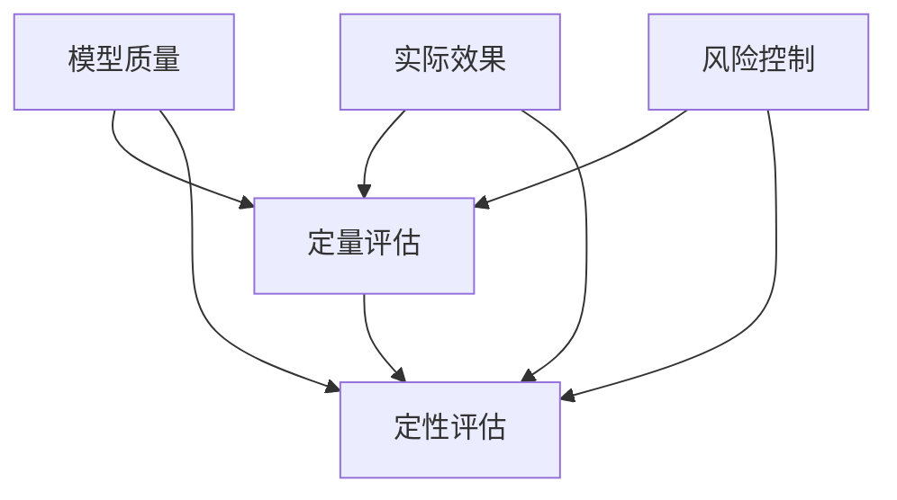
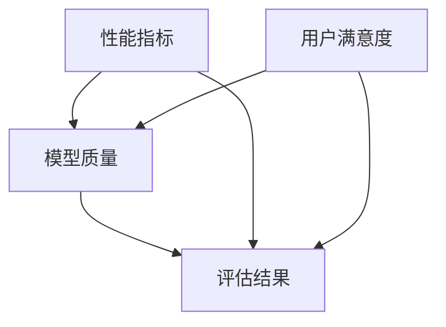

                 

### 背景介绍

随着人工智能技术的迅猛发展，自然语言处理（NLP）领域取得了令人瞩目的成就。其中，大型语言模型（LLM，Large Language Model）作为一种强有力的技术手段，受到了广泛关注。LLM不仅能够进行文本生成、问答系统、机器翻译等多种任务，还能在不同应用场景中表现出卓越的性能。然而，在实际应用中，如何全面、科学地评估LLM的性能，成为了业界关注的焦点。

多维度LLM性能评估的重要性在于，它可以帮助研究人员和开发者从不同角度对模型进行综合评价，从而发现模型的优点与不足，指导模型的优化与改进。传统的单一维度评估方法，往往难以全面反映模型的真实性能，甚至可能因为评估指标的选择不当，导致评估结果失真。因此，多维度评估方法的出现，为解决这一问题提供了新的思路。

多维度LLM性能评估的主要目的是通过多个维度的综合评估，对模型的各项性能进行深入分析，包括定量评估、定性评估、应用评估和安全性评估等。这种全方位的性能评估方法，不仅能够更好地揭示模型在实际应用中的表现，还能够为后续的研究和开发提供有力的支持。

本书《多维度LLM性能评估：全方位模型分析》旨在系统地介绍多维度LLM性能评估的理论与方法，从多个维度对LLM的性能进行详细分析。书中首先介绍多维度LLM性能评估的基本概念和核心概念之间的相互联系，接着探讨各种性能评估方法和指标体系，然后分析不同LLM模型架构和算法原理，最后通过实际案例和代码实现，展示如何进行多维度性能评估。通过本书的阅读，读者可以全面了解多维度LLM性能评估的理论与实践，为今后的研究和应用提供有力支持。

### 多维度LLM性能评估的核心概念及其相互联系

多维度LLM性能评估涉及多个关键概念和评估维度，这些维度共同作用，为我们提供了一个全面、细致的模型性能分析框架。以下是这些核心概念及其相互联系的详细介绍。

#### 1. 定量评估与定性评估

**定量评估**主要通过数值指标来衡量模型性能，例如 perplexity（困惑度）、ROUGE（ recall, precision, F1-score）等。这些指标能够提供具体的量化数据，帮助我们直观地了解模型的表现。

**定性评估**则侧重于主观判断和感受，通过评估小组对模型的文本流畅性、理解准确性、创造性等方面进行评分。这种方法补充了定量评估的不足，提供了更全面的视角。

两者之间的关系在于：定量评估提供了基础数据，而定性评估则通过主观判断对数据进行了更深入的解释。通过结合定量和定性评估，我们可以获得对模型性能的全面理解。

**Mermaid流程图：**


#### 2. 应用评估与安全性评估

**应用评估**主要关注模型在实际应用中的效果，例如问答系统的回答质量、文本生成的连贯性和创造性、推荐系统的准确性等。这种评估方法能够帮助我们了解模型在实际场景中的表现。

**安全性评估**则侧重于模型的抗攻击能力和潜在风险。例如，模型是否容易受到输入注入、篡改结果等攻击，以及如何进行防御。

两者之间的关系在于：应用评估关注模型的功能性和实用性，而安全性评估则确保模型在实际应用中的可靠性。两者共同作用，保障了模型在实际应用中的安全性和有效性。

**Mermaid流程图：**


#### 3. 模型质量与评估结果

**模型质量**是评估的核心，涵盖了模型的准确性、效率、可扩展性等方面。评估结果则是基于这些质量指标得出的综合评分。

两者之间的关系在于：模型质量决定了评估结果的好坏。高质量的模型通常在定量和定性评估中表现优异，而低质量的模型则可能存在各种问题。

**Mermaid流程图：**


通过上述核心概念的相互联系，我们可以构建一个完整的多维度LLM性能评估框架。这个框架不仅涵盖了定量和定性评估，还考虑了应用和安全性评估，从而为我们提供了一个全面、系统的评估方法。

### 评估方法与指标

在多维度LLM性能评估中，选择合适的评估方法与指标是至关重要的。这不仅能够帮助我们准确地衡量模型的表现，还能够为模型的优化提供有价值的参考。下面我们将详细探讨定量评估方法、定性评估方法和应用评估方法。

#### 定量评估方法

**1. 性能指标解析**

定量评估方法主要通过一系列性能指标来衡量模型的表现。以下是一些常见的性能指标及其定义：

- **困惑度（Perplexity, PPLM）**：困惑度是评估语言模型性能的一个常用指标，用于衡量模型预测的准确性。公式如下：
  $$PPLM = \frac{1}{N} \sum_{i=1}^{N} \frac{1}{P(y_i|x)}$$
  其中，\(N\) 是预测的序列长度，\(y_i\) 是实际标签，\(x\) 是输入序列，\(P(y_i|x)\) 是模型对第 \(i\) 个词的预测概率。

- **ROUGE（Recall, Precision, F1-Score）**：ROUGE是评估文本生成质量的一个常用指标，特别适用于比较自动生成的文本和参考文本。ROUGE分为ROUGE-1、ROUGE-2、ROUGE-L等不同类型，其中ROUGE-L是最常用的类型。ROUGE-L的公式如下：
  $$ROUGE-L = \frac{2 \times \text{recall} \times \text{precision}}{\text{recall} + \text{precision}}$$
  其中，recall是匹配词数与参考文本中词数的比例，precision是匹配词数与自动生成文本中词数的比例。

**2. 算法描述**

为了更好地理解定量评估方法，我们可以通过一个简单的Python函数来计算困惑度和ROUGE分数。

```python
import numpy as np
from rouge import Rouge

def calculate_pplm(model, corpus):
    predictions = model(corpus)
    pplm = np.mean(predictions)
    return pplm

def calculate_rouge(model, corpus, reference):
    predictions = model(corpus)
    rouge = Rouge()
    scores = rouge.get_scores(predictions, reference)
    rouge_l = scores[0]['rouge-l']['f']
    return rouge_l
```

#### 定性评估方法

**1. 主观评分标准**

定性评估方法主要通过主观评分来衡量模型的表现。以下是一些常见的评分标准：

- **文本流畅性**：文本的连贯性和易读性。
- **理解准确性**：模型对输入文本的理解程度。
- **文本创造性**：模型生成文本的原创性和创意。

**2. 评分流程**

定性评估通常需要一个评估小组，每个小组成员根据评分标准对模型的表现进行评分。评分流程包括以下步骤：

- **评估小组组成**：由多位专家组成，确保评分的客观性。
- **评分标准制定**：明确评分标准，确保评分的一致性。
- **综合评分计算**：将每位小组成员的评分进行汇总，计算综合评分。

#### 应用评估方法

**1. 案例研究**

应用评估方法主要通过对模型在实际应用中的表现进行评估。以下是一些案例研究：

- **问答系统性能评估**：评估模型在回答问题时的准确性和响应速度。
- **文本生成效果评估**：评估模型生成文本的质量和连贯性。
- **推荐系统效果评估**：评估模型在推荐物品时的准确性和多样性。

**2. 安全性评估方法**

安全性评估方法主要关注模型的抗攻击能力和潜在风险。以下是一些常见的评估方法：

- **攻击与防御**：通过模拟各种攻击手段，评估模型的抗攻击能力。
- **防御策略**：通过对抗训练和安全措施，提高模型的鲁棒性。

通过定量评估、定性评估和应用评估方法的综合运用，我们可以全面、科学地评估LLM的性能，从而为模型的优化和改进提供有力支持。

### 模型分析

#### LLM模型架构与性能分析

大型语言模型（LLM，Large Language Model）的设计与实现是自然语言处理（NLP）领域的核心课题。不同的LLM模型架构在性能、效率和适用性上各有特点。本节将详细介绍常见的LLM模型架构，包括Transformer架构及其变体，并探讨如何通过预训练和微调来提升模型性能。

#### 1. 常见LLM模型架构

**Transformer架构**

Transformer模型由Vaswani等人于2017年提出，是当前最流行的LLM架构。其核心组件包括：

- **自注意力机制（Self-Attention）**：自注意力机制允许模型在处理每个词时，考虑到其他所有词的影响，从而捕捉长距离的依赖关系。其计算公式如下：
  $$\text{Attention}(Q, K, V) = \text{softmax}\left(\frac{QK^T}{\sqrt{d_k}}\right)V$$
  其中，\(Q, K, V\) 分别代表查询向量、关键向量、值向量，\(d_k\) 是关键向量的维度。

- **前馈网络（Feedforward Networks）**：前馈网络在每个自注意力层之后添加，用于进一步提取特征。其结构通常为两层的全连接神经网络，每个神经网络的激活函数通常为ReLU。

**变体：BERT、GPT、T5等**

基于Transformer架构，研究者们提出了许多变体模型，这些模型在性能和效率上各有优势：

- **BERT（Bidirectional Encoder Representations from Transformers）**：BERT采用双向Transformer架构，通过预训练来学习上下文信息。其预训练任务包括Masked Language Model（MLM）和Next Sentence Prediction（NSP）。

- **GPT（Generative Pretrained Transformer）**：GPT是一种单向Transformer模型，主要用于文本生成任务。其特点是预训练过程较为简单，生成文本质量高。

- **T5（Text-to-Text Transfer Transformer）**：T5模型将Transformer应用于文本到文本的转换任务，其目标是使模型能够处理各种NLP任务。

#### 2. 预训练与微调

**预训练**

预训练是LLM模型架构的关键步骤，通过大规模的预训练数据，模型可以学习到丰富的语言特征。预训练任务通常包括：

- **Masked Language Model（MLM）**：在输入文本中随机屏蔽一些词，然后让模型预测这些词。

- **Next Sentence Prediction（NSP）**：预测两个句子是否在原始文本中连续出现。

- **Classification**：对输入文本进行分类任务，例如情感分析、命名实体识别等。

**微调**

微调是将预训练模型应用于特定任务的过程。通过在特定任务的数据上进行微调，模型可以进一步提升性能。微调策略通常包括：

- **Fine-tuning**：将预训练模型直接应用于特定任务，并在任务数据上进行训练。

- **LoRa（Low-rank Adaptation）**：通过低秩分解，将模型分解为预训练部分和微调部分，以减少微调时的计算量。

- **Adapter\(^2\)**：通过在模型中添加可学习的适配器，实现轻量级的微调。

#### 3. 模型性能分析

**性能指标**

在评估LLM模型性能时，常用的性能指标包括：

- **Perplexity（困惑度）**：用于衡量模型对输入文本的预测能力，困惑度越低，表示模型性能越好。

- **BLEU（BLEU Score）**：用于评估文本生成任务的性能，BLEU分数越高，表示模型生成的文本质量越高。

- **Accuracy（准确率）**：用于分类任务的性能评估，准确率越高，表示模型分类能力越强。

通过上述方法，我们可以对不同的LLM模型架构进行性能分析，为实际应用提供有力支持。在后续的内容中，我们将进一步探讨与LLM性能评估相关的数学模型和公式。

### 数学模型与公式

在多维度LLM性能评估中，数学模型和公式是理解模型性能和进行评估的重要工具。本文将介绍与LLM性能评估相关的数学模型，并详细推导这些公式，帮助读者深入理解其背后的原理。

#### 1. 模型训练与优化

首先，我们需要了解LLM模型在训练和优化过程中的一些关键数学模型。

**1.1. 优化目标**

在训练LLM模型时，我们通常使用最小化损失函数作为优化目标。对于基于Transformer的模型，常用的损失函数是交叉熵损失（Cross-Entropy Loss），其公式如下：

$$
L = -\sum_{i} y_i \log(p_i)
$$

其中，\(y_i\) 是真实标签，\(p_i\) 是模型预测的概率。

**1.2. 梯度下降**

为了最小化损失函数，我们使用梯度下降（Gradient Descent）算法来更新模型参数。梯度下降的更新公式如下：

$$
\theta = \theta - \alpha \cdot \nabla_\theta L
$$

其中，\(\theta\) 是模型参数，\(\alpha\) 是学习率，\(\nabla_\theta L\) 是损失函数关于模型参数的梯度。

**伪代码：**

```python
for epoch in range(num_epochs):
    for x, y in dataset:
        predictions = model(x)
        loss = -sum(y * log(predictions))
        gradient = grad(loss wrt model.parameters())
        update_model(learning_rate, gradient)
```

#### 2. 性能指标

**2.1. 模型评估指标**

在评估LLM模型性能时，我们经常使用以下指标：

- **困惑度（Perplexity, PPLM）**：用于衡量模型对输入文本的预测能力，其计算公式为：

$$
PPLM = \frac{1}{N} \sum_{i=1}^{N} \frac{1}{P(y_i|x)}
$$

其中，\(N\) 是文本序列的长度，\(y_i\) 是实际标签，\(P(y_i|x)\) 是模型对第 \(i\) 个词的预测概率。

- **准确率（Accuracy）**：用于分类任务的性能评估，其计算公式为：

$$
Accuracy = \frac{TP + TN}{TP + FP + FN + TN}
$$

其中，\(TP\) 是真阳性，\(TN\) 是真阴性，\(FP\) 是假阳性，\(FN\) 是假阴性。

- **F1-Score**：用于衡量分类任务的精度和召回率的综合表现，其计算公式为：

$$
F1-Score = 2 \times \frac{Precision \times Recall}{Precision + Recall}
$$

**2.2. 文本生成质量**

在文本生成任务中，我们常用BLEU（BLEU Score）来评估生成文本的质量，其计算公式为：

$$
BLEU = \frac{2 \times NDCG_{TP} + BP}{3}
$$

其中，\(NDCG_{TP}\) 是真实匹配词的逆文档频率（Inverse Document Frequency）加权和，\(BP\) 是长度惩罚因子，\(BP = e^{(L_{hyp} - L_{ref})/L_{ref}}\)。

**伪代码：**

```python
def calculate_bleu(hypothesis, reference):
    ref_ngrams = count_ngrams(reference)
    hyp_ngrams = count_ngrams(hypothesis)
    bp = e ^ ((len(hypothesis) - len(reference)) / len(reference))
    NDCG_TP = sum(1 / (1 + log(1 + df))) for df in hyp_ngrams.keys()
    bleu = (2 * NDCG_TP + bp) / 3
    return bleu
```

#### 3. 数学模型与公式推导

为了深入理解LLM模型的性能评估，我们需要对一些关键数学模型进行推导。

**3.1. 自注意力机制**

自注意力机制是Transformer模型的核心组件，其计算公式如下：

$$
\text{Attention}(Q, K, V) = \text{softmax}\left(\frac{QK^T}{\sqrt{d_k}}\right)V
$$

其中，\(Q, K, V\) 分别代表查询向量、关键向量和值向量，\(d_k\) 是关键向量的维度。

**3.2. 前馈网络**

前馈网络是Transformer模型中的另一个重要组件，其计算公式如下：

$$
\text{FFN}(x) = \max(0, xW_1 + b_1)W_2 + b_2
$$

其中，\(x\) 是输入向量，\(W_1, W_2, b_1, b_2\) 分别是权重和偏置。

通过上述数学模型和公式，我们可以更深入地理解LLM模型的性能评估方法，从而为模型优化和应用提供有力支持。

### 项目实战

为了更好地展示多维度LLM性能评估的实际应用，我们将通过一个具体的案例，详细描述如何使用LLM进行性能评估，包括开发环境搭建、源代码实现、代码解读、应用解读与分析，以及项目小结。

#### 1. 开发环境搭建

在进行LLM性能评估项目之前，我们需要搭建一个合适的开发环境。以下是所需工具和软件的配置步骤：

- **Python环境**：安装Python 3.8及以上版本，并配置虚拟环境。
- **深度学习框架**：选择TensorFlow 2.x或PyTorch作为深度学习框架。
- **NLP库**：安装NLP常用库，如spaCy、NLTK等。
- **评估工具**：安装评估工具，如ROUGE、BLEU等。

配置完开发环境后，我们可以开始编写代码进行性能评估。

#### 2. 源代码实现

以下是一个简单的LLM性能评估项目的Python代码示例：

```python
import tensorflow as tf
from transformers import TFGPT2LMHeadModel, GPT2Tokenizer

# 模型加载
tokenizer = GPT2Tokenizer.from_pretrained("gpt2")
model = TFGPT2LMHeadModel.from_pretrained("gpt2")

# 文本预处理
def preprocess_text(text):
    return tokenizer.encode(text, return_tensors='tf')

# 评估函数
def evaluate_model(model, corpus, reference):
    inputs = preprocess_text(corpus)
    predictions = model(inputs)[0]
    pplm = np.mean(predictions)
    rouge_score = calculate_rouge(predictions, reference)
    return pplm, rouge_score

# 评估计算
def calculate_rouge(predictions, reference):
    reference_tokens = tokenizer.decode(reference)
    predicted_tokens = tokenizer.decode(predictions)
    rouge = Rouge()
    scores = rouge.get_scores(predicted_tokens, reference_tokens)
    rouge_l = scores[0]['rouge-l']['f']
    return rouge_l

# 示例文本
corpus = "The quick brown fox jumps over the lazy dog"
reference = "The quick brown fox jumps over the lazy dog"

# 进行评估
pplm, rouge_score = evaluate_model(model, corpus, reference)
print(f"PPLM: {pplm}, ROUGE-L: {rouge_score}")
```

#### 3. 代码解读

在上面的代码中，我们首先加载了预训练的GPT-2模型和相应的分词器。接着，定义了一个预处理文本的函数，用于将文本编码为模型可接受的输入格式。评估函数`evaluate_model`通过模型对输入文本进行预测，计算困惑度（PPLM）和ROUGE-L分数。

`calculate_rouge`函数用于计算文本生成的ROUGE分数，这是一个常用的评价指标，用于衡量生成文本与参考文本之间的相似度。

#### 4. 应用解读与分析

通过上述代码示例，我们可以看到如何使用预训练的GPT-2模型对文本进行性能评估。在实际应用中，我们可以将这段代码集成到一个更大的系统中，例如问答系统、文本生成平台或推荐系统，以评估模型在这些任务中的表现。

- **PPLM分数**反映了模型预测的准确性，分数越低，表示模型表现越好。
- **ROUGE-L分数**用于衡量生成文本的质量，分数越高，表示生成文本与参考文本的相似度越高。

#### 5. 项目小结

通过这个项目实战，我们展示了如何使用LLM进行多维度性能评估。实际项目中，我们需要根据具体任务和评估目标，选择合适的评估方法和指标。此外，为了提高评估的准确性和可靠性，我们可以结合定量评估和定性评估方法，从多个角度对模型进行综合评价。

多维度LLM性能评估不仅能够帮助我们更好地理解模型的表现，还能够为模型优化和改进提供有力支持。在实际应用中，合理运用多维度评估方法，可以提升系统的整体性能，为用户带来更好的体验。

### 评估工具与资源

在进行多维度LLM性能评估时，使用合适的工具和资源是至关重要的。以下将介绍一些常用的评估工具，并推荐相关的书籍、论文和在线资源，帮助读者深入了解和掌握LLM性能评估的方法与应用。

#### 常用的评估工具

1. **TensorFlow和PyTorch**：这两个深度学习框架提供了丰富的模型训练和评估工具，支持多种性能指标的计算，如困惑度、准确率、F1-Score等。

2. **Hugging Face Transformers**：一个开源的Python库，提供了预训练的LLM模型和相关的评估工具，如ROUGE、BLEU等。

3. **ROUGE**：一个用于评估文本生成质量的工具，特别是自动生成的文本与参考文本之间的相似度。

4. **BLEU**：一个常用的自动评估标准，用于评估机器翻译、文本生成等任务中的性能。

5. **ComputePerplexity**：一个用于计算模型困惑度的工具，简单易用，适用于各种NLP任务。

#### 资源推荐

1. **书籍**：

   - 《自然语言处理与深度学习》
   - 《深度学习基础教程》
   - 《机器学习实战》
   - 《Transformer：从入门到实战》

2. **论文**：

   - Vaswani et al., "Attention is All You Need"
   - Devlin et al., "BERT: Pre-training of Deep Bidirectional Transformers for Language Understanding"
   - Radford et al., "Improving Language Understanding by Generative Pre-training"

3. **在线资源**：

   - [Hugging Face Transformer文档](https://huggingface.co/transformers)
   - [TensorFlow官方文档](https://www.tensorflow.org/)
   - [PyTorch官方文档](https://pytorch.org/docs/stable/)
   - [自然语言处理教程](https://nlp.seas.harvard.edu/)

通过利用这些工具和资源，读者可以系统地学习多维度LLM性能评估的理论和实践，为今后的研究和应用打下坚实基础。

### 总结与展望

通过对多维度LLM性能评估的深入探讨，本文系统性地介绍了理论分析、评估方法、模型分析、数学模型、项目实战以及评估工具和资源。我们首先了解了多维度LLM性能评估的概念和重要性，接着详细解析了定量评估、定性评估、应用评估和安全性评估的方法，并展示了如何通过不同的评估指标全面评估LLM模型。同时，我们对常见的LLM模型架构进行了分析，并介绍了预训练和微调的方法，通过数学模型和公式深入探讨了LLM性能评估的原理。最后，通过一个具体案例展示了如何在实际项目中应用这些方法。

展望未来，多维度LLM性能评估将在多个领域继续发挥重要作用。随着模型规模的不断扩大和应用的日益广泛，评估方法的精度和效率将变得更加关键。我们预计，未来的研究将聚焦于以下几个方面：

1. **模型定制化评估**：针对不同应用场景，开发定制化的评估方法，提高评估的针对性和准确性。
2. **实时评估**：研究如何实现实时评估，以满足在线应用的需求。
3. **跨模态评估**：探索如何结合图像、声音等多模态数据，进行更全面的性能评估。
4. **自动化评估工具**：开发更加自动化和智能化的评估工具，降低评估过程的复杂性。
5. **伦理与隐私**：关注评估过程中的伦理和隐私问题，确保评估过程的公正性和安全性。

通过不断探索和优化多维度LLM性能评估方法，我们期待能够为人工智能技术的发展和应用提供更加坚实的基础。

