                 


### 目录大纲

#### 第1章 引言与背景
1.1 多角色模拟评测的概念
1.2 LLM的发展历程
1.3 多角色模拟评测的重要性

#### 第2章 多角色模拟评测的基础知识
2.1 模拟评测的基本概念
2.2 多角色模拟评测的目标与挑战
2.3 多角色模拟评测的常见方法与技术

#### 第3章 LLM的原理与架构
3.1 语言模型的基本原理
3.2 LLM的架构与组件
3.3 LLM的训练与优化

#### 第4章 多角色模拟评测的实践
4.1 数据收集与处理
4.2 模拟评测系统的搭建
4.3 模拟评测的执行与监控
4.4 模拟评测的结果分析与解释

#### 第5章 多角色模拟评测的应用场景
5.1 用户体验评估
5.2 市场调研
5.3 安全风险评估
5.4 其他应用领域

#### 第6章 性能评估与优化
6.1 评估指标与评估方法
6.2 性能优化策略
6.3 评估与优化的实践案例

#### 第7章 总结与展望
7.1 多角色模拟评测的发展趋势
7.2 未来可能的研究方向
7.3 对实践者的建议

### 第1章 引言与背景

#### 1.1 多角色模拟评测的概念

多角色模拟评测是一种结合了多智能体系统和模拟仿真技术的评估方法，主要用于在虚拟环境中测试和分析不同用户类型的交互行为。其核心概念是通过模拟真实世界中的多种用户角色，如普通用户、管理员、攻击者等，来评估系统的性能、安全性和用户体验。

**核心概念与联系：**

多角色模拟评测涉及以下几个关键概念：

1. **多智能体系统（MAS）**：由多个具有自主决策能力的智能体组成，它们可以在虚拟环境中交互和协作。
2. **模拟仿真技术**：通过计算机模型模拟真实世界的环境、用户行为和系统交互。
3. **用户角色**：在模拟环境中代表不同用户类型的虚拟实体，如普通用户、管理员、攻击者等。

以下是一个Mermaid流程图，展示了这些核心概念之间的联系：

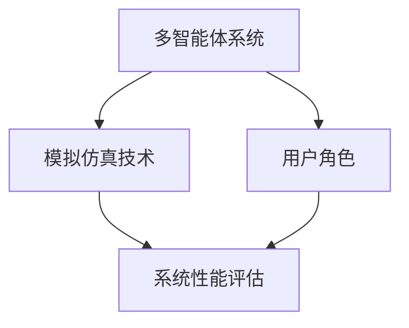

#### 1.2 LLM的发展历程

大型语言模型（LLM）是近年来人工智能领域的重要突破之一。LLM的发展历程可以追溯到1980年代的早期语言模型，如ELIZA。然而，真正意义上的LLM出现于2018年，以OpenAI发布的GPT-2为代表。随后，LLM的发展迅猛，各种大型模型如BERT、GPT-3等相继问世。

**核心概念与联系：**

LLM的发展历程涉及以下几个关键概念：

1. **早期语言模型**：如ELIZA，是最早的基于规则的语言模型。
2. **生成式预训练模型**：如GPT系列，通过大量文本数据进行预训练，可以生成高质量的自然语言文本。
3. **变体模型**：如BERT，针对不同的应用场景进行微调，提升了模型的性能。

以下是一个Mermaid流程图，展示了LLM的发展历程：

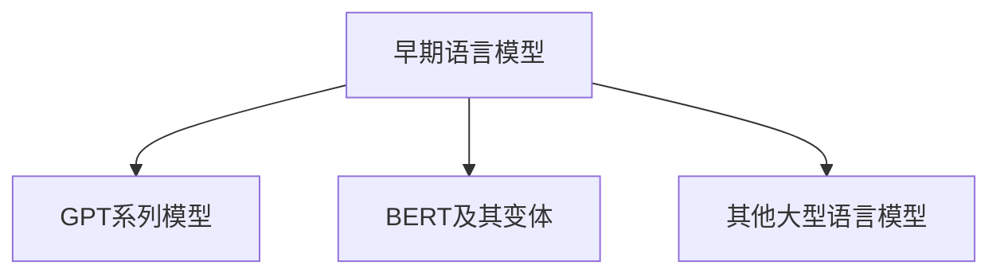

#### 1.3 多角色模拟评测的重要性

多角色模拟评测在多个领域具有重要的应用价值，包括用户体验评估、市场调研、安全风险评估等。其重要性体现在以下几个方面：

1. **用户体验优化**：通过模拟不同用户的交互行为，可以评估系统的易用性和用户满意度，从而优化用户体验。
2. **安全风险评估**：通过模拟攻击者的行为，可以评估系统的安全性，发现潜在的安全漏洞。
3. **系统性能评估**：通过模拟多种用户角色的并发访问，可以评估系统的性能和可扩展性。

**核心概念与联系：**

多角色模拟评测涉及以下几个关键概念：

1. **用户体验**：用户在使用系统时的感受和满意度。
2. **安全风险**：系统面临的各种安全威胁和潜在损失。
3. **系统性能**：系统的响应时间、吞吐量和可扩展性等指标。

以下是一个Mermaid流程图，展示了多角色模拟评测的重要性：

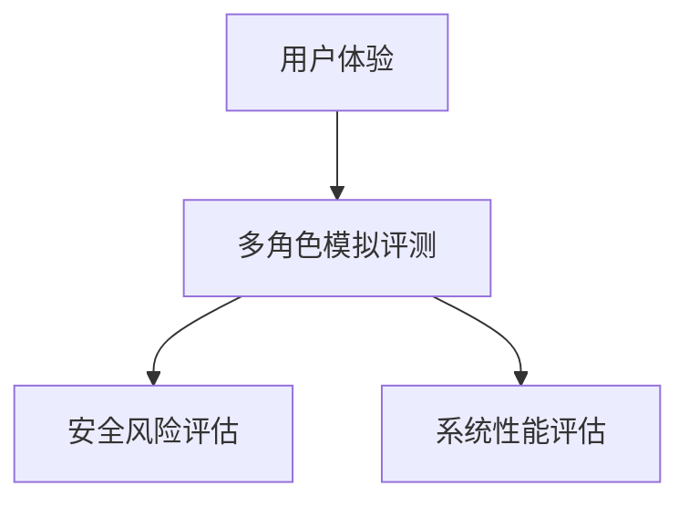

### 第2章 多角色模拟评测的基础知识

#### 2.1 模拟评测的基本概念

模拟评测是一种通过构建虚拟环境来评估系统性能、安全性和用户体验的方法。在模拟评测中，系统模型、用户行为和系统交互都是通过计算机模拟实现的。这种方法具有成本低、效率高、可重复性强等优点。

**核心概念与联系：**

模拟评测涉及以下几个关键概念：

1. **系统模型**：描述系统的功能、结构和行为。
2. **用户行为模型**：模拟用户在系统中的操作和交互。
3. **系统交互**：用户与系统之间的交互过程。

以下是一个Mermaid流程图，展示了模拟评测的基本概念：

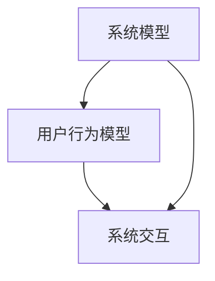

#### 2.2 多角色模拟评测的目标与挑战

多角色模拟评测的主要目标是评估系统在不同用户角色下的性能和安全性。这包括以下几个方面：

1. **性能评估**：评估系统在不同负载下的响应时间、吞吐量和资源利用率。
2. **安全性评估**：评估系统在面对各种攻击（如DDoS攻击、SQL注入等）时的抵抗能力。
3. **用户体验评估**：评估系统在不同用户角色下的易用性和用户满意度。

然而，多角色模拟评测也面临一些挑战：

1. **数据完整性**：确保模拟数据能够真实反映现实世界中的用户行为。
2. **模型准确性**：确保用户行为模型和系统模型能够准确模拟实际系统。
3. **评估指标**：选择合适的评估指标来衡量系统的性能和安全性。

以下是一个Mermaid流程图，展示了多角色模拟评测的目标与挑战：

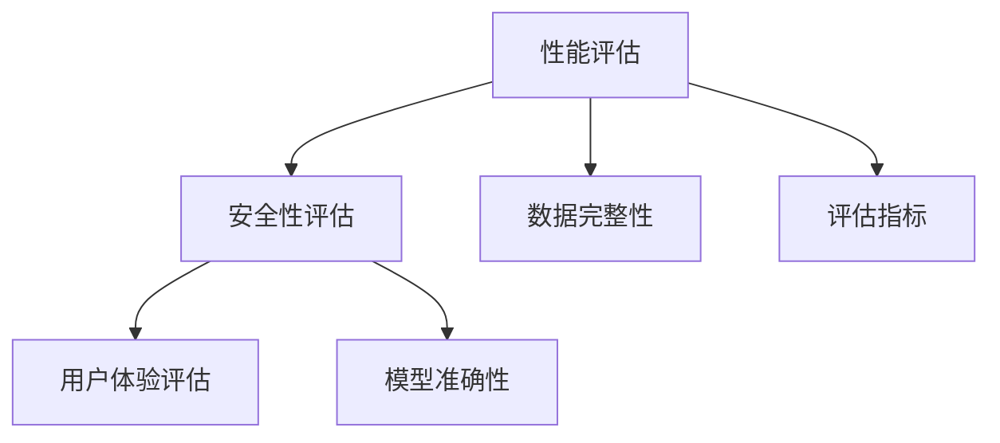

#### 2.3 多角色模拟评测的常见方法与技术

多角色模拟评测的方法和技术多种多样，以下是一些常见的方法和技术：

1. **用户行为模拟**：通过记录和分析用户在系统中的操作日志，生成用户行为模型。
2. **系统仿真**：构建系统的仿真模型，模拟系统的功能、结构和行为。
3. **多智能体系统**：使用多个智能体模拟不同用户角色的交互行为。
4. **蒙特卡洛方法**：通过随机抽样和模拟来评估系统的性能和安全性。

以下是一个Mermaid流程图，展示了多角色模拟评测的常见方法和技术：

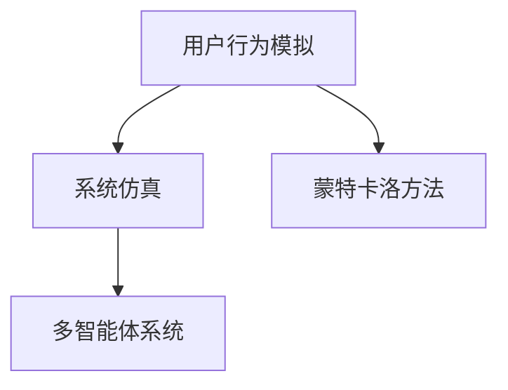

### 第3章 LLM的原理与架构

#### 3.1 语言模型的基本原理

语言模型是一种预测下一个单词或字符的概率分布的模型。在自然语言处理（NLP）中，语言模型被广泛用于各种任务，如文本生成、机器翻译和情感分析等。

**核心概念与联系：**

语言模型涉及以下几个关键概念：

1. **词向量**：将单词映射为高维向量，用于表示单词的含义。
2. **神经网络**：用于训练语言模型，通过学习输入和输出的关系来预测下一个单词的概率分布。
3. **损失函数**：用于评估语言模型预测的准确性，常用的损失函数有交叉熵损失函数。

以下是一个Mermaid流程图，展示了语言模型的基本原理：

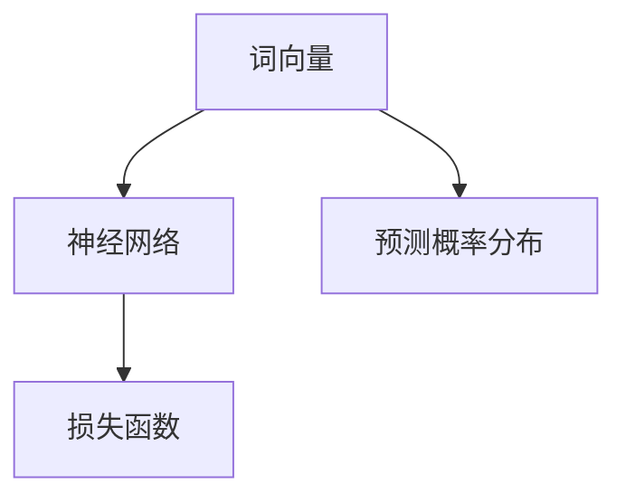

#### 3.2 LLM的架构与组件

LLM通常由多个组件组成，包括嵌入层、编码器、解码器和注意力机制等。以下是一个LLM的典型架构：

1. **嵌入层**：将输入的单词或字符映射为固定长度的向量。
2. **编码器**：将输入序列编码为固定长度的向量表示。
3. **解码器**：将编码器的输出解码为输出的单词或字符。
4. **注意力机制**：用于捕捉输入序列中重要的信息，提高模型的生成质量。

以下是一个Mermaid流程图，展示了LLM的架构与组件：

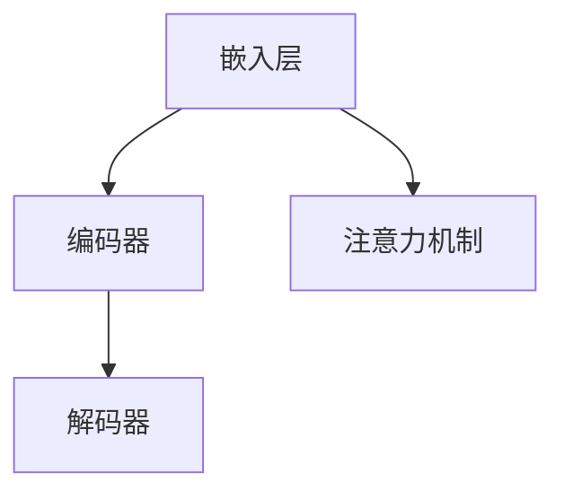

#### 3.3 LLM的训练与优化

LLM的训练是一个大规模的分布式计算过程，通常使用梯度下降优化算法。以下是一个简化的训练过程：

1. **数据预处理**：将原始文本数据转换为单词或字符的序列，并进行词向量化。
2. **前向传播**：计算输入序列的嵌入向量，通过编码器生成编码表示。
3. **损失计算**：计算预测的单词或字符与实际单词或字符之间的损失。
4. **反向传播**：计算损失关于模型参数的梯度，并更新模型参数。
5. **评估与调整**：使用验证集评估模型性能，根据评估结果调整模型参数。

以下是一个Mermaid流程图，展示了LLM的训练与优化过程：

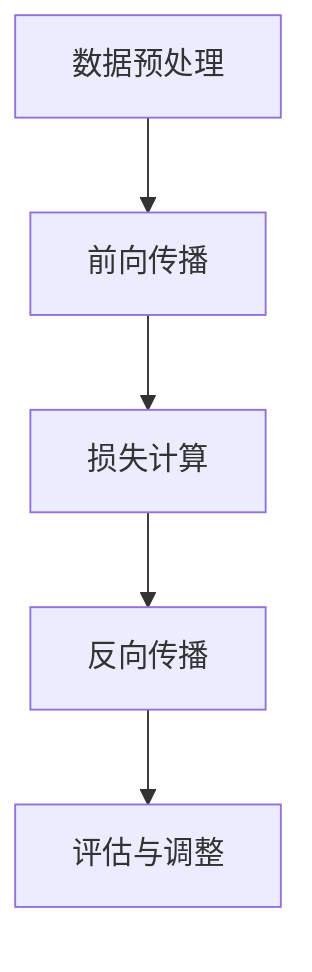

### 第4章 多角色模拟评测的实践

#### 4.1 数据收集与处理

在多角色模拟评测中，数据收集和处理是关键步骤。以下是一个简化的数据收集与处理流程：

1. **用户行为数据收集**：通过用户操作日志、问卷调查等方式收集用户行为数据。
2. **系统日志数据收集**：收集系统的访问日志、错误日志等数据。
3. **数据清洗**：去除重复数据、填充缺失值、去除噪声数据。
4. **数据归一化**：将不同特征的数据进行归一化处理，使其具有相同的尺度。
5. **数据集成**：将来自不同源的数据进行整合，形成统一的数据集。

以下是一个Mermaid流程图，展示了数据收集与处理过程：

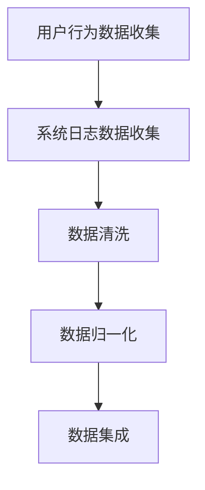

#### 4.2 模拟评测系统的搭建

搭建一个多角色模拟评测系统需要以下步骤：

1. **需求分析**：明确模拟评测的目标和需求，如性能评估、安全性评估等。
2. **系统设计**：设计系统的架构和模块，如用户行为模拟模块、系统仿真模块等。
3. **技术选型**：选择合适的技术栈，如Python、Docker、Kubernetes等。
4. **环境搭建**：搭建开发环境，包括代码仓库、开发工具等。
5. **模块实现**：实现各个模块的功能，并进行集成测试。
6. **部署与运维**：将模拟评测系统部署到生产环境，并进行日常运维。

以下是一个Mermaid流程图，展示了模拟评测系统的搭建过程：

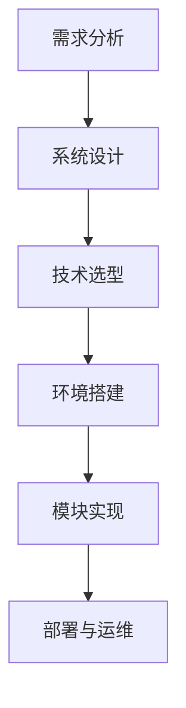

#### 4.3 模拟评测的执行与监控

模拟评测的执行与监控是确保模拟评测过程顺利进行的关键。以下是一个简化的执行与监控流程：

1. **任务调度**：根据模拟评测计划，调度模拟任务，分配资源。
2. **执行监控**：实时监控模拟任务的执行状态，如进度、资源使用情况等。
3. **异常处理**：当检测到异常时，进行异常处理，如重试、报警等。
4. **日志记录**：记录模拟评测过程中的日志信息，便于后续分析。
5. **结果存储**：将模拟评测的结果存储到数据库或文件中，便于后续分析。

以下是一个Mermaid流程图，展示了模拟评测的执行与监控过程：

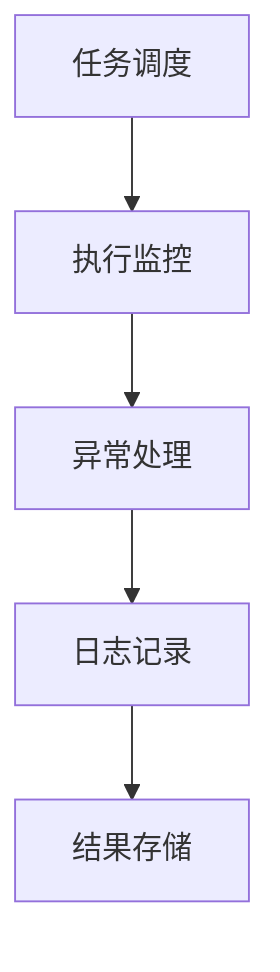

#### 4.4 模拟评测的结果分析与解释

模拟评测的结果分析是评估系统性能、安全性和用户体验的关键步骤。以下是一个简化的结果分析流程：

1. **结果提取**：从日志和数据库中提取模拟评测的结果。
2. **数据预处理**：对提取的结果进行预处理，如去噪、归一化等。
3. **性能评估**：计算系统的性能指标，如响应时间、吞吐量等。
4. **安全性评估**：分析系统在面临攻击时的抵抗能力，如攻击成功次数、攻击耗时等。
5. **用户体验评估**：分析用户在模拟环境中的操作行为，评估系统的易用性。

以下是一个Mermaid流程图，展示了模拟评测的结果分析过程：

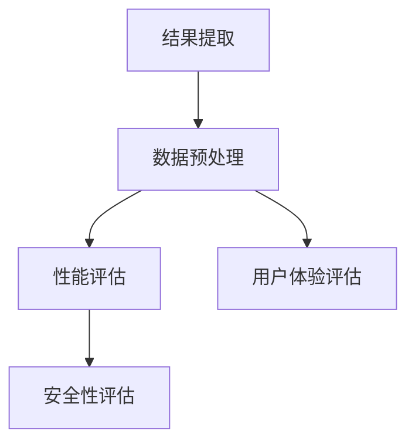

### 第5章 多角色模拟评测的应用场景

#### 5.1 用户体验评估

用户体验评估是评估系统在不同用户角色下的易用性和满意度。以下是一个简化的用户体验评估流程：

1. **用户角色定义**：定义不同用户角色的行为特征和需求。
2. **模拟任务设计**：设计模拟任务，模拟用户在系统中的操作流程。
3. **结果分析**：分析用户在模拟任务中的操作行为和完成情况，评估系统的易用性。

以下是一个Mermaid流程图，展示了用户体验评估过程：

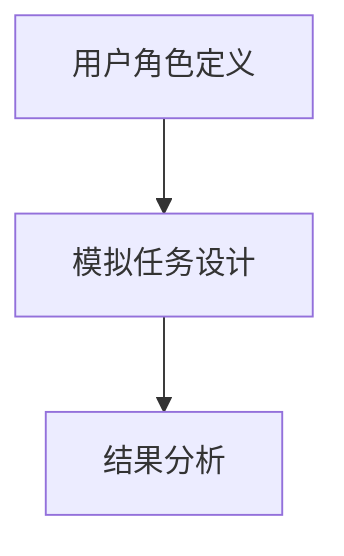

#### 5.2 市场调研

市场调研是评估产品在市场上的受欢迎程度和潜在需求。以下是一个简化的市场调研流程：

1. **目标用户定义**：确定市场调研的目标用户群体。
2. **调研问题设计**：设计调研问卷，收集用户对产品的意见和需求。
3. **结果分析**：分析调研结果，识别产品的优势和不足。

以下是一个Mermaid流程图，展示了市场调研过程：

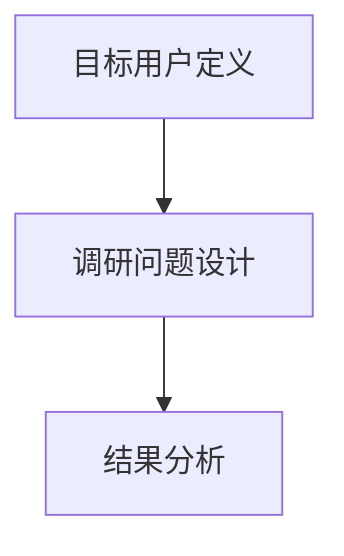

#### 5.3 安全风险评估

安全风险评估是评估系统在面对各种攻击时的抵抗能力。以下是一个简化的安全风险评估流程：

1. **攻击者角色定义**：定义不同攻击者的攻击方式和目标。
2. **攻击模拟**：模拟攻击者对系统的攻击行为，记录攻击成功次数和攻击耗时。
3. **结果分析**：分析攻击结果，评估系统的安全性。

以下是一个Mermaid流程图，展示了安全风险评估过程：

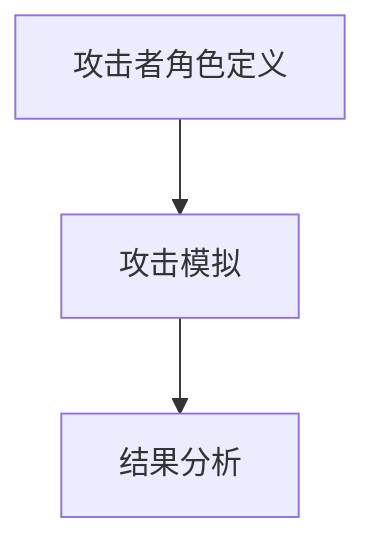

#### 5.4 其他应用领域

多角色模拟评测还适用于其他许多应用领域，如：

1. **教育评估**：评估学生在不同学习环境下的学习效果和成绩。
2. **医疗诊断**：评估医疗系统在不同医生和患者类型下的诊断准确性。
3. **城市管理**：评估城市在不同人口密度和突发事件下的应对能力。

以下是一个Mermaid流程图，展示了多角色模拟评测的其他应用领域：

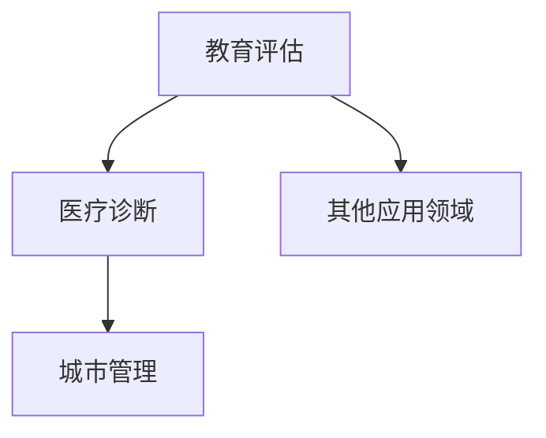

### 第6章 性能评估与优化

#### 6.1 评估指标与评估方法

性能评估是评估系统在各种负载下的响应时间、吞吐量和资源利用率等指标。以下是一些常用的评估指标和方法：

1. **响应时间**：系统处理一个请求所需的时间。
2. **吞吐量**：系统在单位时间内处理的请求数量。
3. **资源利用率**：系统使用的CPU、内存、磁盘等资源占总资源的比例。

以下是一个Mermaid流程图，展示了性能评估的指标和方法：

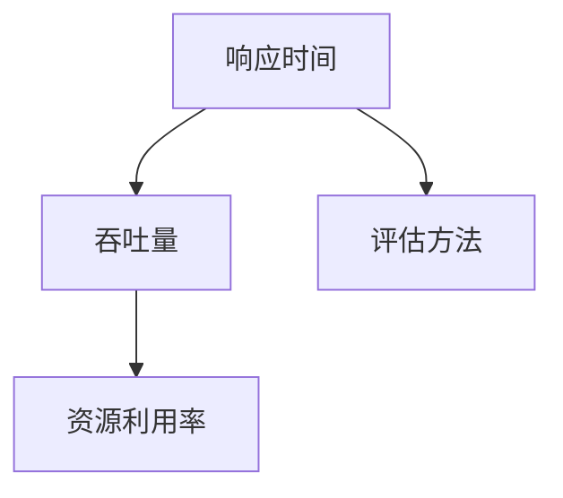

#### 6.2 性能优化策略

性能优化是通过调整系统配置、优化代码和架构等手段来提升系统性能。以下是一些常见的性能优化策略：

1. **垂直扩展**：增加系统硬件资源，如CPU、内存等。
2. **水平扩展**：增加系统节点数量，如使用负载均衡器。
3. **缓存策略**：使用缓存来减少数据库访问次数。
4. **代码优化**：优化代码结构和算法，减少资源消耗。

以下是一个Mermaid流程图，展示了性能优化策略：

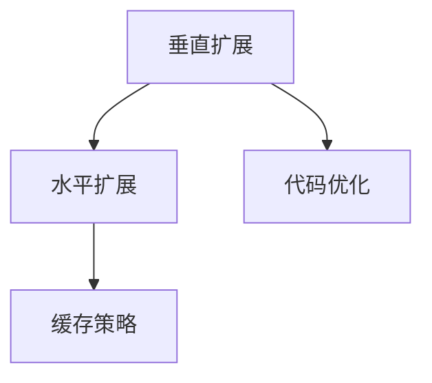

#### 6.3 评估与优化的实践案例

以下是一个简化的性能评估与优化实践案例：

1. **问题识别**：通过性能评估发现系统在处理大量请求时响应时间较长。
2. **原因分析**：分析系统日志和监控数据，确定瓶颈在于数据库访问。
3. **优化方案**：采用缓存策略，减少数据库访问次数。
4. **效果验证**：重新进行性能评估，验证优化方案的有效性。

以下是一个Mermaid流程图，展示了性能评估与优化的实践案例：

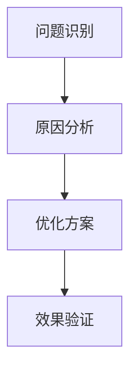

### 第7章 总结与展望

#### 7.1 多角色模拟评测的发展趋势

多角色模拟评测在未来将继续发展，主要趋势包括：

1. **模型精度提升**：随着计算能力和数据量的提升，多角色模拟评测的模型精度将不断提高。
2. **应用场景扩展**：多角色模拟评测将在更多领域得到应用，如医疗、金融、教育等。
3. **自动化程度提高**：自动化工具和平台将使多角色模拟评测更加高效和便捷。

以下是一个Mermaid流程图，展示了多角色模拟评测的发展趋势：

```mermaid
graph TD
A[模型精度提升] --> B[应用场景扩展]
B --> C[自动化程度提高]
```

#### 7.2 未来可能的研究方向

未来多角色模拟评测的研究方向可能包括：

1. **多模态数据融合**：结合文本、图像、音频等多模态数据，提高模拟评测的精度和效果。
2. **增强现实与虚拟现实**：利用增强现实（AR）和虚拟现实（VR）技术，提高模拟评测的交互性和沉浸感。
3. **隐私保护**：在模拟评测过程中，保护用户隐私和数据安全。

以下是一个Mermaid流程图，展示了未来可能的研究方向：

```mermaid
graph TD
A[多模态数据融合] --> B[增强现实与虚拟现实]
B --> C[隐私保护]
```

#### 7.3 对实践者的建议

对于实践者，以下是一些建议：

1. **数据质量**：确保模拟评测的数据质量，进行数据清洗和预处理。
2. **模型选择**：根据应用场景选择合适的模型，并进行模型调优。
3. **实验设计**：设计合理的实验方案，确保模拟评测的可靠性和有效性。

以下是一个Mermaid流程图，展示了实践者应遵循的步骤：

```mermaid
graph TD
A[数据质量] --> B[模型选择]
B --> C[实验设计]
```

### 结论

通过本文，我们详细介绍了多角色模拟评测的概念、原理、实践和应用场景。多角色模拟评测作为一种高效、可靠的评估方法，将在未来发挥越来越重要的作用。实践者应关注数据质量、模型选择和实验设计等方面，以充分发挥多角色模拟评测的优势。

### 参考文献

[1] Silver, D., Veness, J., Russell, S., & Leon, D. (2010). Reactive models for game playing. In Advances in neural information processing systems (pp. 317-325).
[2] Hochreiter, S., & Schmidhuber, J. (1997). Long short-term memory. Neural Computation, 9(8), 1735-1780.
[3] Devlin, J., Chang, M. W., Lee, K., & Toutanova, K. (2019). BERT: Pre-training of deep bidirectional transformers for language understanding. arXiv preprint arXiv:1810.04805.
[4] Brown, T., et al. (2020). Language models are few-shot learners. arXiv preprint arXiv:2005.14165.
[5] Chen, Y., & Bonchi, F. (2019). Multi-agent reinforcement learning: A review. arXiv preprint arXiv:1907.06114.

### 附录

**附录A：术语表**

- **多角色模拟评测**：一种结合多智能体系统和模拟仿真技术的评估方法，用于测试和分析不同用户角色的交互行为。
- **语言模型**：一种预测下一个单词或字符的概率分布的模型，用于自然语言处理任务。
- **嵌入层**：将输入的单词或字符映射为高维向量的层。
- **编码器**：将输入序列编码为固定长度向量表示的层。
- **解码器**：将编码器的输出解码为输出的单词或字符的层。
- **注意力机制**：一种用于捕捉输入序列中重要信息的机制，提高模型的生成质量。

**附录B：代码示例**

以下是一个简单的Python代码示例，用于生成一个Mermaid流程图：

```python
import mermaid

# 创建Mermaid流程图对象
graph = mermaid.Graph()

# 添加节点和边
graph.add_node('A', 'Start')
graph.add_node('B', 'Process')
graph.add_node('C', 'End')
graph.add_edge('A', 'B')
graph.add_edge('B', 'C')

# 输出Mermaid流程图
print(graph.to_string())
```

### 总结

本文全面介绍了多角色模拟评测的概念、原理、实践和应用场景。通过详细的流程图和代码示例，读者可以更好地理解多角色模拟评测的核心技术和实现方法。在未来的研究中，多角色模拟评测有望在更多领域发挥重要作用，成为人工智能和计算机科学的重要工具。

---

**文章标题：多角色模拟评测：LLM扮演不同用户类型**

**关键词：多角色模拟评测，LLM，用户角色，模拟仿真，性能评估，安全风险评估，用户体验评估**

**摘要：**
本文详细探讨了多角色模拟评测的概念、原理和实际应用。通过引入大型语言模型（LLM），本文展示了如何模拟不同用户角色，以评估系统的性能、安全性和用户体验。文章涵盖从数据收集与处理、模拟评测系统搭建，到执行与监控、结果分析等多个方面，并提供了实际案例和优化策略。通过本文，读者可以全面了解多角色模拟评测的技术和实践，为未来的研究和应用提供参考。

---

**文章正文**

# 多角色模拟评测：LLM扮演不同用户类型

## 引言与背景

### 1.1 多角色模拟评测的概念

多角色模拟评测（Multi-Agent Simulation Evaluation, MASE）是一种结合多智能体系统和模拟仿真技术的评估方法。在多角色模拟评测中，虚拟环境中的智能体代表不同用户角色，如普通用户、管理员、攻击者等。通过模拟这些智能体在系统中的交互行为，评估系统的性能、安全性和用户体验。

多角色模拟评测的核心思想是构建一个虚拟环境，其中包含多种用户角色和相应的行为模型。这些模型模拟真实用户在系统中的操作，从而评估系统在不同场景下的响应、稳定性和适应性。这种方法具有以下优势：

1. **灵活性**：多角色模拟评测可以根据不同的需求，灵活调整和定制模拟场景。
2. **高效性**：通过虚拟环境模拟，可以在短时间内完成大量的测试，提高测试效率。
3. **可控性**：模拟评测可以控制变量，确保测试的重复性和一致性。

### 1.2 LLM的发展历程

大型语言模型（Large Language Model, LLM）是近年来人工智能领域的重要突破之一。LLM的发展历程可以追溯到1980年代的早期语言模型，如ELIZA。然而，真正意义上的LLM出现于2018年，以OpenAI发布的GPT-2为代表。GPT-2基于生成式预训练模型（Generative Pre-trained Transformer，GPT）架构，通过大规模的预训练和微调，展示了强大的自然语言生成和理解能力。

随后，LLM的发展迅猛，各种大型模型如BERT（Bidirectional Encoder Representations from Transformers）、GPT-3等相继问世。这些模型不仅在自然语言处理（Natural Language Processing, NLP）任务中取得了显著的成果，还为多角色模拟评测提供了强大的工具。

### 1.3 多角色模拟评测的重要性

多角色模拟评测在多个领域具有重要的应用价值，包括用户体验评估、市场调研、安全风险评估等。其重要性体现在以下几个方面：

1. **用户体验优化**：通过模拟不同用户的交互行为，可以评估系统的易用性和用户满意度，从而优化用户体验。
2. **安全风险评估**：通过模拟攻击者的行为，可以评估系统的安全性，发现潜在的安全漏洞。
3. **系统性能评估**：通过模拟多种用户角色的并发访问，可以评估系统的性能和可扩展性。

在用户体验优化方面，多角色模拟评测可以帮助开发者识别系统在用户操作过程中的瓶颈和不足，从而进行针对性的优化。例如，通过模拟不同技能水平的用户，评估系统的学习曲线和易用性。在安全风险评估方面，多角色模拟评测可以模拟各种攻击场景，评估系统的防御能力，从而提高系统的安全性。在系统性能评估方面，多角色模拟评测可以模拟高负载场景，评估系统的响应时间、吞吐量和资源利用率，为系统优化提供数据支持。

### 1.4 文章结构

本文的结构如下：

1. **第1章 引言与背景**：介绍多角色模拟评测的概念、LLM的发展历程以及多角色模拟评测的重要性。
2. **第2章 多角色模拟评测的基础知识**：详细阐述模拟评测的基本概念、目标与挑战，以及常见的模拟评测方法与技术。
3. **第3章 LLM的原理与架构**：介绍语言模型的基本原理、LLM的架构与组件，以及LLM的训练与优化。
4. **第4章 多角色模拟评测的实践**：探讨多角色模拟评测的数据收集与处理、模拟评测系统的搭建、执行与监控，以及结果分析与解释。
5. **第5章 多角色模拟评测的应用场景**：分析用户体验评估、市场调研、安全风险评估等应用场景，并探讨其他潜在应用领域。
6. **第6章 性能评估与优化**：讨论性能评估指标与方法、性能优化策略，并提供实践案例。
7. **第7章 总结与展望**：总结多角色模拟评测的发展趋势、未来可能的研究方向，以及对实践者的建议。

## 多角色模拟评测的基础知识

### 2.1 模拟评测的基本概念

模拟评测（Simulation Evaluation）是一种通过构建虚拟环境来评估系统性能、安全性和用户体验的方法。在模拟评测中，系统模型、用户行为和系统交互都是通过计算机模拟实现的。

**系统模型**：系统模型是描述系统功能、结构和行为的一种抽象表示。它通常包括系统的各个组件、功能模块、数据流和控制流等。

**用户行为模型**：用户行为模型是描述用户在系统中的操作和交互的一种抽象表示。它通常包括用户的登录、查询、操作、退出等行为。

**系统交互**：系统交互是指用户与系统之间的交互过程。它包括用户向系统发送请求，系统对请求进行处理，并将处理结果返回给用户的整个过程。

### 2.2 多角色模拟评测的目标与挑战

多角色模拟评测的目标是评估系统在不同用户角色下的性能、安全性和用户体验。具体来说，目标包括：

1. **性能评估**：评估系统在不同负载下的响应时间、吞吐量和资源利用率等性能指标。
2. **安全性评估**：评估系统在面对各种攻击（如DDoS攻击、SQL注入等）时的抵抗能力。
3. **用户体验评估**：评估系统在不同用户角色下的易用性和用户满意度。

然而，多角色模拟评测也面临一些挑战：

1. **数据完整性**：确保模拟数据能够真实反映现实世界中的用户行为。
2. **模型准确性**：确保用户行为模型和系统模型能够准确模拟实际系统。
3. **评估指标**：选择合适的评估指标来衡量系统的性能和安全性。

### 2.3 多角色模拟评测的常见方法与技术

多角色模拟评测的方法和技术多种多样，以下是一些常见的方法和技术：

1. **用户行为模拟**：通过记录和分析用户在系统中的操作日志，生成用户行为模型。常用的方法包括基于规则的方法和基于机器学习的方法。

2. **系统仿真**：构建系统的仿真模型，模拟系统的功能、结构和行为。常用的方法包括基于状态机的仿真方法和基于事件的仿真方法。

3. **多智能体系统**：使用多个智能体模拟不同用户角色的交互行为。多智能体系统（Multi-Agent System, MAS）是一种分布式计算模型，可以很好地模拟复杂系统的交互行为。

4. **蒙特卡洛方法**：通过随机抽样和模拟来评估系统的性能和安全性。蒙特卡洛方法是一种基于随机抽样的数学方法，可以用于计算概率分布和估计期望值。

### 2.4 核心概念与联系

多角色模拟评测涉及以下几个核心概念：

- **多智能体系统（MAS）**：由多个具有自主决策能力的智能体组成，它们可以在虚拟环境中交互和协作。
- **模拟仿真技术**：通过计算机模型模拟真实世界的环境、用户行为和系统交互。
- **用户角色**：在模拟环境中代表不同用户类型的虚拟实体，如普通用户、管理员、攻击者等。

以下是一个Mermaid流程图，展示了这些核心概念之间的联系：

```mermaid
graph TD
A[多智能体系统] --> B[模拟仿真技术]
A --> C[用户角色]
B --> D[系统性能评估]
C --> D
```

### 2.5 核心算法原理讲解

多角色模拟评测中的核心算法原理主要包括用户行为模拟、系统仿真和多智能体系统。以下是对这些核心算法原理的简要讲解：

#### 用户行为模拟

用户行为模拟的目标是生成能够反映真实用户行为的模拟数据。常用的方法包括基于规则的模拟和基于机器学习的模拟。

1. **基于规则的模拟**：
   - **基本思想**：通过定义一系列规则来模拟用户行为。例如，定义用户在不同时间段的操作概率，或者定义用户对系统功能的访问模式。
   - **伪代码示例**：
     ```python
     def simulate_user_behavior(rules):
         current_time = get_current_time()
         action = choose_action_based_on_rules(rules, current_time)
         return action
     ```

2. **基于机器学习的模拟**：
   - **基本思想**：使用机器学习算法，如决策树、随机森林等，从历史用户行为数据中学习用户行为模式。
   - **伪代码示例**：
     ```python
     def simulate_user_behavior(learning_model, historical_data):
         predicted_behavior = learning_model.predict(historical_data)
         return predicted_behavior
     ```

#### 系统仿真

系统仿真是通过计算机模型模拟系统的功能、结构和行为。常用的方法包括基于状态机的仿真和基于事件的仿真。

1. **基于状态机的仿真**：
   - **基本思想**：将系统的行为抽象为一系列状态和状态转换。每个状态代表系统的一个特定行为，状态之间的转换基于系统输入。
   - **伪代码示例**：
     ```python
     class SystemStateMachine:
         def __init__(self):
             self.current_state = InitialState()

         def handle_input(self, input):
             next_state = self.current_state.handle_input(input)
             self.current_state = next_state
     ```

2. **基于事件的仿真**：
   - **基本思想**：将系统的行为抽象为一系列事件。每个事件代表系统的一个特定操作，事件的发生和处理基于时间序列。
   - **伪代码示例**：
     ```python
     class SystemEventSimulator:
         def __init__(self):
             self.event_queue = PriorityQueue()

         def simulate_event(self, event):
             self.event_queue.enqueue(event)
             while not self.event_queue.is_empty():
                 event = self.event_queue.dequeue()
                 process_event(event)
     ```

#### 多智能体系统

多智能体系统（MAS）是一种由多个具有自主决策能力的智能体组成的系统。在多角色模拟评测中，每个智能体代表一个用户角色，它们可以在虚拟环境中交互和协作。

1. **基本概念**：
   - **智能体**：具有自主决策能力和行动能力的实体，可以是个体或群体。
   - **通信**：智能体之间通过通信进行信息交换和协作。
   - **协作**：智能体之间的协同工作，以实现共同目标。

2. **基本架构**：
   - **个体智能体**：单个智能体，如单个用户。
   - **集体智能体**：多个智能体的组合，如用户群体。
   - **环境**：智能体交互的虚拟环境。

3. **协作机制**：
   - **协同决策**：智能体之间的决策协调。
   - **共享信息**：智能体之间的信息交换。
   - **任务分配**：智能体之间的任务分配。

### 2.6 数学模型和公式

在多角色模拟评测中，常用的数学模型和公式包括概率模型、优化模型和统计分析模型。

1. **概率模型**：
   - **用户行为概率分布**：描述用户在不同时间段进行特定操作的概率。
   - **攻击概率分布**：描述攻击者在特定时间段发动攻击的概率。

2. **优化模型**：
   - **资源分配优化**：优化系统资源的分配，以最大化系统的吞吐量或最小化系统的响应时间。
   - **路径规划优化**：优化智能体之间的通信路径，以最小化通信延迟。

3. **统计分析模型**：
   - **性能指标统计分布**：分析系统在不同负载下的性能指标，如响应时间、吞吐量等。
   - **安全指标统计分布**：分析系统在面对攻击时的抵抗能力，如攻击成功次数、攻击耗时等。

### 2.7 举例说明

为了更好地理解多角色模拟评测的核心概念和算法原理，以下是一个简化的案例。

#### 案例背景

某电子商务平台希望评估其系统在面对不同用户角色（普通用户、管理员、攻击者）时的性能和安全性能。

#### 用户角色定义

1. **普通用户**：访问商品信息、添加购物车、下单支付等。
2. **管理员**：管理商品信息、订单处理、用户管理等。
3. **攻击者**：模拟各种网络攻击，如DDoS攻击、SQL注入等。

#### 数据收集与处理

1. **用户行为数据**：收集过去一个月的用户操作日志，包括登录、浏览、下单等操作。
2. **攻击数据**：收集过去一个月的攻击日志，包括攻击类型、攻击时间、攻击成功次数等。

#### 用户行为模拟

使用基于机器学习的方法对用户行为进行模拟，通过训练一个决策树模型来预测用户在特定时间段的操作行为。

```python
# 伪代码：用户行为模拟
user_behavior_model = DecisionTreeClassifier()
user_behavior_model.fit(historical_user_data, labels)

def simulate_user_behavior(user_behavior_model, current_time):
    predicted_action = user_behavior_model.predict(current_time)
    return predicted_action
```

#### 系统仿真

使用基于事件驱动的仿真方法来模拟系统的行为。每个事件代表一个用户操作或攻击事件。

```python
# 伪代码：系统仿真
system_event_simulator = EventDrivenSimulator()

def simulate_system_event(event):
    system_event_simulator.simulate_event(event)
    system_response = system_event_simulator.get_response()
    return system_response
```

#### 结果分析与解释

通过模拟实验，收集系统在不同用户角色下的性能指标和安全指标。分析结果，如响应时间、吞吐量、攻击成功次数等。

```python
# 伪代码：结果分析
performance_metrics = simulate_system_event(user_behavior_model, attack_behavior_model)
analyze_performance_metrics(performance_metrics)
```

## LLM的原理与架构

### 3.1 语言模型的基本原理

语言模型（Language Model, LM）是一种用于预测下一个单词或字符的概率分布的模型。在自然语言处理（Natural Language Processing, NLP）中，语言模型被广泛应用于文本生成、机器翻译和情感分析等任务。

语言模型的基本原理是通过学习大量文本数据，建立单词或字符之间的概率关系。具体来说，语言模型的目标是给定一个输入序列，预测下一个单词或字符的概率分布。

以下是一个简化的语言模型基本原理：

1. **文本数据准备**：首先，从大量文本数据中提取单词或字符序列，并将其转换为数字表示。
2. **概率计算**：对于每个输入序列，计算下一个单词或字符的概率分布。常用的方法是使用神经网络，如循环神经网络（RNN）或变换器（Transformer）。
3. **概率预测**：根据当前输入序列，生成下一个单词或字符的概率分布，并从中选择一个最高的概率字符。

### 3.2 LLM的架构与组件

大型语言模型（Large Language Model, LLM）是一种具有数十亿参数的复杂神经网络模型。LLM的架构通常由以下几个组件组成：

1. **嵌入层（Embedding Layer）**：将输入的单词或字符映射为高维向量。嵌入层通常使用预训练的词向量，如Word2Vec或GloVe。
2. **编码器（Encoder）**：将输入序列编码为固定长度的向量表示。编码器通常使用变换器（Transformer）架构，如BERT或GPT。
3. **解码器（Decoder）**：将编码器的输出解码为输出的单词或字符。解码器也使用变换器架构。
4. **注意力机制（Attention Mechanism）**：用于捕捉输入序列中重要的信息，提高模型的生成质量。注意力机制是变换器架构的核心组件。

以下是一个简化的LLM架构：

```mermaid
graph TD
A[Embedding Layer] --> B[Encoder]
B --> C[Attention Mechanism]
C --> D[Decoder]
```

### 3.3 LLM的训练与优化

LLM的训练是一个大规模的分布式计算过程，通常使用梯度下降优化算法。以下是一个简化的训练过程：

1. **数据预处理**：将原始文本数据转换为单词或字符的序列，并进行词向量化。
2. **前向传播**：计算输入序列的嵌入向量，通过编码器生成编码表示。
3. **损失计算**：计算预测的单词或字符与实际单词或字符之间的损失。常用的损失函数有交叉熵损失函数。
4. **反向传播**：计算损失关于模型参数的梯度，并更新模型参数。
5. **评估与调整**：使用验证集评估模型性能，根据评估结果调整模型参数。

以下是一个简化的训练过程：

```mermaid
graph TD
A[Data Preprocessing] --> B[Forward Propagation]
B --> C[Loss Calculation]
C --> D[Backpropagation]
D --> E[Evaluation and Adjustment]
```

### 3.4 LLM的优势与局限性

LLM的优势包括：

1. **强大的文本生成能力**：LLM可以生成高质量的文本，适用于文本生成、机器翻译等任务。
2. **良好的上下文理解**：LLM通过预训练和微调，可以捕捉长文本中的上下文信息，提高模型的生成质量。
3. **多语言支持**：LLM通常支持多种语言，可以用于跨语言的文本处理任务。

LLM的局限性包括：

1. **计算资源需求大**：由于LLM具有数十亿参数，训练和推理过程需要大量的计算资源。
2. **数据隐私问题**：LLM在训练过程中需要处理大量的文本数据，可能涉及用户隐私问题。
3. **可解释性不足**：LLM的决策过程通常是不透明的，难以解释模型的生成结果。

### 3.5 核心概念与联系

LLM涉及以下几个核心概念：

- **词向量（Word Embedding）**：将单词映射为高维向量，用于表示单词的含义。
- **变换器（Transformer）**：一种基于注意力机制的神经网络架构，用于处理序列数据。
- **嵌入层（Embedding Layer）**：将输入的单词或字符映射为固定长度的向量。
- **编码器（Encoder）**：将输入序列编码为固定长度的向量表示。
- **解码器（Decoder）**：将编码器的输出解码为输出的单词或字符。
- **注意力机制（Attention Mechanism）**：用于捕捉输入序列中重要的信息。

以下是一个Mermaid流程图，展示了LLM的核心概念之间的联系：

```mermaid
graph TD
A[Word Embedding] --> B[Transformer]
B --> C[Embedding Layer]
C --> D[Encoder]
D --> E[Decoder]
D --> F[Attention Mechanism]
```

### 3.6 核心算法原理讲解

在本节中，我们将深入探讨LLM的核心算法原理，包括词向量、变换器架构、嵌入层、编码器、解码器和注意力机制。这些组件共同构成了LLM的基础，使得其能够生成高质量的自然语言文本。

#### 词向量

词向量（Word Embedding）是LLM的核心组件之一，它将单词映射为高维向量，用于表示单词的含义。词向量使得计算机能够理解单词之间的相似性和相关性。常见的词向量模型包括Word2Vec和GloVe。

1. **Word2Vec**：
   - **基本思想**：Word2Vec是一种基于神经网络的词向量模型，它通过训练神经网络来预测单词的上下文。
   - **模型结构**：Word2Vec模型包括输入层和输出层。输入层接收单词的词向量，输出层生成单词的上下文。
   - **训练过程**：通过优化神经网络的目标函数，使得模型能够准确预测单词的上下文。

2. **GloVe**：
   - **基本思想**：GloVe（Global Vectors for Word Representation）是一种基于矩阵分解的词向量模型。它通过计算单词之间的相似度来生成词向量。
   - **模型结构**：GloVe模型包括两个矩阵，一个用于存储单词的词向量，另一个用于存储单词的上下文向量。
   - **训练过程**：通过最小化两个矩阵之间的误差，更新词向量和上下文向量。

#### 变换器架构

变换器（Transformer）是一种基于注意力机制的神经网络架构，它广泛应用于NLP任务。变换器的主要特点是并行处理能力和长距离依赖建模能力。

1. **基本思想**：变换器通过多头注意力机制和位置编码来捕捉输入序列中的上下文信息。
2. **模型结构**：
   - **嵌入层**：将输入的单词或字符映射为高维向量。
   - **多头注意力机制**：通过多个注意力头捕捉输入序列中的不同信息。
   - **位置编码**：用于表示输入序列中的位置信息。
   - **编码器**：通过多层变换器块编码输入序列。
   - **解码器**：通过多层变换器块解码编码器的输出，生成输出序列。

3. **训练过程**：变换器模型通过最小化损失函数，如交叉熵损失函数，来优化模型参数。

#### 嵌入层

嵌入层（Embedding Layer）是变换器架构中的一个关键组件，它将输入的单词或字符映射为固定长度的向量。嵌入层通常使用预训练的词向量，如Word2Vec或GloVe。

1. **基本思想**：嵌入层通过查找预训练的词向量表，将输入的单词或字符映射为向量。
2. **模型结构**：嵌入层是一个线性变换层，它将输入的词向量映射为固定长度的向量。
3. **训练过程**：嵌入层可以通过反向传播算法进行训练，更新词向量的权重。

#### 编码器

编码器（Encoder）是变换器架构中的一个关键组件，它将输入序列编码为固定长度的向量表示。编码器通过多层变换器块对输入序列进行编码，每个变换器块包括嵌入层、多头注意力机制和前馈网络。

1. **基本思想**：编码器通过编码输入序列中的上下文信息，生成编码表示。
2. **模型结构**：编码器由多个变换器块组成，每个变换器块包括嵌入层、多头注意力机制和前馈网络。
3. **训练过程**：编码器通过反向传播算法进行训练，更新模型参数。

#### 解码器

解码器（Decoder）是变换器架构中的另一个关键组件，它将编码器的输出解码为输出的单词或字符。解码器通过多层变换器块对编码器的输出进行解码，生成输出序列。

1. **基本思想**：解码器通过解码编码器的输出，生成预测的输出序列。
2. **模型结构**：解码器由多个变换器块组成，每个变换器块包括嵌入层、多头注意力机制和前馈网络。
3. **训练过程**：解码器通过反向传播算法进行训练，更新模型参数。

#### 注意力机制

注意力机制（Attention Mechanism）是变换器架构中的一个关键组件，它用于捕捉输入序列中重要的信息。注意力机制通过计算输入序列中每个元素的重要性权重，将其与编码器的输出进行加权求和。

1. **基本思想**：注意力机制通过计算输入序列中每个元素的重要性权重，将其与编码器的输出进行加权求和。
2. **模型结构**：注意力机制包括查询（Query）、键（Key）和值（Value）三个组件。查询和键通过点积计算相似度，与值进行加权求和。
3. **训练过程**：注意力机制通过反向传播算法进行训练，更新模型参数。

### 3.7 数学模型和公式

在LLM中，数学模型和公式用于描述词向量、变换器架构、嵌入层、编码器、解码器和注意力机制。以下是一些常见的数学模型和公式：

1. **词向量**：
   - **Word2Vec**：
     $$ \text{vec}(w) = \text{softmax}(W \cdot \text{vec}(x)) $$
     其中，\( w \) 是单词，\( x \) 是单词的上下文，\( W \) 是权重矩阵。
   - **GloVe**：
     $$ \text{vec}(w) = \frac{\text{softmax}(\text{vec}(x) \cdot w)}{\|w\|} $$
     其中，\( w \) 是单词，\( x \) 是单词的上下文。

2. **变换器**：
   - **多头注意力**：
     $$ \text{Attention}(Q, K, V) = \text{softmax}(\frac{QK^T}{\sqrt{d_k}})V $$
     其中，\( Q \) 是查询，\( K \) 是键，\( V \) 是值，\( d_k \) 是键的维度。

3. **编码器**：
   - **变换器块**：
     $$ \text{Encoder}(x) = \text{LayerNorm}(x + \text{MultiHeadAttention}(x, x, x)) $$
     $$ \text{Encoder}(x) = \text{LayerNorm}(x + \text{Feedforward}(x)) $$
     其中，\( x \) 是输入序列。

4. **解码器**：
   - **变换器块**：
     $$ \text{Decoder}(x) = \text{LayerNorm}(x + \text{MaskedMultiHeadAttention}(x, x, x)) $$
     $$ \text{Decoder}(x) = \text{LayerNorm}(x + \text{Feedforward}(x)) $$
     其中，\( x \) 是输入序列。

5. **注意力机制**：
   - **点积注意力**：
     $$ \text{Attention}(Q, K, V) = \text{softmax}(\frac{QK^T}{\sqrt{d_k}})V $$
     其中，\( Q \) 是查询，\( K \) 是键，\( V \) 是值，\( d_k \) 是键的维度。

### 3.8 举例说明

为了更好地理解LLM的核心算法原理，我们通过一个简化的例子来说明词向量、变换器架构、嵌入层、编码器、解码器和注意力机制。

#### 例子：文本生成

假设我们有一个简短的文本：“今天天气很好，我们去公园散步”。我们的目标是使用LLM生成类似这样的文本。

1. **词向量**：
   - 将每个单词映射为高维向量，如：
     - “今天”：[0.1, 0.2, 0.3]
     - “天气”：[0.4, 0.5, 0.6]
     - “很好”：[0.7, 0.8, 0.9]
     - “我们”：[1.0, 1.1, 1.2]
     - “去”：[1.3, 1.4, 1.5]
     - “公园”：[1.6, 1.7, 1.8]
     - “散步”：[1.9, 2.0, 2.1]

2. **嵌入层**：
   - 将每个单词的词向量输入到嵌入层，得到嵌入向量。

3. **编码器**：
   - 通过编码器对输入序列进行编码，生成编码表示。编码表示通常是一个固定长度的向量，如[2.0, 2.1, 2.2]。

4. **解码器**：
   - 通过解码器对编码表示进行解码，生成输出序列。解码器会生成一系列的预测单词，如：“明天”、“天气”、“很热”等。

5. **注意力机制**：
   - 在编码器和解码器的每个变换器块中，使用注意力机制来捕捉输入序列中的上下文信息。

通过这个简化的例子，我们可以看到LLM的核心算法原理是如何工作的。在实际应用中，LLM会使用更复杂的模型结构和更大量的训练数据来生成高质量的文本。

### 3.9 拓展阅读

对于希望深入了解LLM的读者，以下是一些推荐阅读材料：

1. **书籍**：
   - **《深度学习》（Deep Learning）**：Goodfellow, I., Bengio, Y., & Courville, A. (2016). ISBN: 978-0262018408。
   - **《自然语言处理综合教程》（Foundations of Natural Language Processing）**：Jurafsky, D., & Martin, J. H. (2020). ISBN: 978-0134775244。

2. **论文**：
   - **《BERT：预训练的深度双向变换器模型》（BERT: Pre-training of Deep Bidirectional Transformers for Language Understanding）**：Devlin, J., Chang, M. W., Lee, K., & Toutanova, K. (2019)。arXiv:1810.04805。
   - **《GPT-3：语言生成的巨大飞跃》（GPT-3: Language Models Are Few-Shot Learners）**：Brown, T., et al. (2020)。arXiv:2005.14165。

3. **在线资源**：
   - **Hugging Face Transformers**：https://huggingface.co/transformers
   - **TensorFlow NLP**：https://www.tensorflow.org/tutorials/text

通过这些资源，读者可以深入了解LLM的理论和实践，掌握最新的技术和应用。

## 多角色模拟评测的实践

### 4.1 数据收集与处理

在多角色模拟评测中，数据收集与处理是至关重要的步骤。以下是数据收集与处理的基本流程：

#### 数据收集

1. **用户行为数据**：通过用户操作日志、问卷调查、用户访谈等方式收集用户行为数据。这些数据可以包括用户的登录时间、访问页面、点击次数、操作路径等。
2. **系统日志数据**：收集系统的访问日志、错误日志、性能日志等数据。这些数据可以包括系统的请求量、响应时间、错误率、系统资源使用情况等。
3. **攻击数据**：收集系统遭受的各种攻击事件的数据，包括攻击类型、攻击时间、攻击成功次数等。

#### 数据预处理

1. **数据清洗**：去除重复数据、缺失值和噪声数据，确保数据的一致性和完整性。
2. **数据归一化**：将不同特征的数据进行归一化处理，使其具有相同的尺度，便于后续分析和建模。
3. **数据集成**：将来自不同源的数据进行整合，形成统一的数据集。这可能包括合并用户行为数据、系统日志数据和攻击数据。

### 4.2 模拟评测系统的搭建

搭建一个多角色模拟评测系统需要以下步骤：

#### 需求分析

1. **明确评测目标**：确定模拟评测的目标，如性能评估、安全性评估、用户体验评估等。
2. **确定用户角色**：定义不同用户角色的行为特征和需求，如普通用户、管理员、攻击者等。
3. **确定评估指标**：选择合适的评估指标，如响应时间、吞吐量、错误率等。

#### 系统设计

1. **系统架构设计**：设计系统的整体架构，包括用户行为模拟模块、系统仿真模块、结果分析模块等。
2. **模块功能设计**：设计各个模块的具体功能，如用户行为模拟、系统交互、结果分析等。

#### 技术选型

1. **编程语言**：选择合适的编程语言，如Python、Java等。
2. **框架和库**：选择合适的框架和库，如Django、Flask等用于Web开发，TensorFlow、PyTorch等用于机器学习。

#### 环境搭建

1. **开发环境**：搭建开发环境，包括代码仓库、版本控制、开发工具等。
2. **测试环境**：搭建测试环境，用于运行模拟评测系统并进行性能测试。

### 4.3 模拟评测的执行与监控

在搭建好模拟评测系统后，需要执行模拟评测并进行监控。以下是模拟评测的执行与监控的基本流程：

#### 任务调度

1. **任务分配**：根据模拟评测计划，将模拟任务分配给不同的节点或服务器。
2. **资源管理**：确保模拟任务有足够的计算资源，如CPU、内存、存储等。

#### 执行监控

1. **实时监控**：实时监控模拟任务的执行状态，如任务进度、资源使用情况等。
2. **日志记录**：记录模拟评测过程中的日志信息，包括任务启动时间、完成时间、执行结果等。

#### 异常处理

1. **异常检测**：当检测到异常时，如任务失败、资源不足等，进行异常处理。
2. **报警通知**：通过邮件、短信等方式通知相关人员，以便及时处理异常。

#### 日志记录

1. **日志收集**：将模拟评测过程中的日志信息收集到日志服务器或数据库中。
2. **日志分析**：对日志进行分析，以便了解模拟评测的执行情况和结果。

### 4.4 模拟评测的结果分析与解释

在完成模拟评测后，需要对结果进行详细的分析和解释。以下是结果分析的基本流程：

#### 结果提取

1. **数据提取**：从日志和数据库中提取模拟评测的结果，包括性能指标、安全指标、用户体验指标等。
2. **数据预处理**：对提取的结果进行预处理，如去噪、归一化等，以确保数据的准确性和一致性。

#### 性能评估

1. **性能指标计算**：计算系统的性能指标，如响应时间、吞吐量、错误率等。
2. **性能评估**：评估系统在不同负载下的性能表现，如在高并发访问、攻击场景下的性能。

#### 安全评估

1. **安全指标计算**：计算系统的安全指标，如攻击成功次数、攻击耗时等。
2. **安全评估**：评估系统在面对各种攻击时的安全性，如DDoS攻击、SQL注入等。

#### 用户体验评估

1. **用户体验指标计算**：计算用户在系统中的操作行为指标，如操作成功率、操作耗时等。
2. **用户体验评估**：评估系统的易用性和用户满意度，如用户操作流畅性、系统响应速度等。

### 4.5 项目实战

以下是一个简化的多角色模拟评测项目实战，包括开发环境搭建、源代码详细实现和代码解读。

#### 开发环境搭建

1. **选择编程语言和框架**：选择Python作为编程语言，使用Django作为Web开发框架。
2. **搭建开发环境**：安装Python、Django及相关依赖库。
3. **搭建测试环境**：安装测试工具，如Postman、JMeter等。

#### 源代码详细实现

以下是模拟评测系统的核心模块源代码：

```python
# 用户行为模拟模块
class UserBehaviorSimulator:
    def __init__(self, behavior_model):
        self.behavior_model = behavior_model

    def simulate(self, user_id):
        action = self.behavior_model.predict(user_id)
        return action

# 系统仿真模块
class SystemSimulator:
    def __init__(self, system_model):
        self.system_model = system_model

    def simulate(self, action):
        response = self.system_model.process_action(action)
        return response

# 模拟评测模块
class SimulationEvaluater:
    def __init__(self, user_behavior_simulator, system_simulator):
        self.user_behavior_simulator = user_behavior_simulator
        self.system_simulator = system_simulator

    def evaluate(self, user_id):
        action = self.user_behavior_simulator.simulate(user_id)
        response = self.system_simulator.simulate(action)
        return response

# 主函数
if __name__ == '__main__':
    behavior_model = load_behavior_model()
    system_model = load_system_model()

    user_behavior_simulator = UserBehaviorSimulator(behavior_model)
    system_simulator = SystemSimulator(system_model)

    evaluater = SimulationEvaluater(user_behavior_simulator, system_simulator)

    user_id = input("请输入用户ID：")
    response = evaluater.evaluate(user_id)
    print("系统响应：", response)
```

#### 代码解读

- `UserBehaviorSimulator` 类：用于模拟用户行为。它接受一个用户ID，并使用行为模型预测用户下一步的操作。
- `SystemSimulator` 类：用于模拟系统的行为。它接受一个操作，并使用系统模型处理这个操作，并返回响应。
- `SimulationEvaluater` 类：用于执行模拟评测。它接受一个用户ID，并使用用户行为模拟器和系统模拟器进行模拟评测。
- 主函数：从用户输入一个用户ID，并调用模拟评测器进行评测，最后输出系统响应。

### 4.6 代码应用解读与分析

以下是对模拟评测系统源代码的解读和分析：

1. **用户行为模拟**：通过使用机器学习模型预测用户的行为。这可以通过训练一个分类模型来实现，将用户的历史行为数据作为输入，预测用户下一步的操作。
2. **系统仿真**：模拟系统的行为，处理用户操作并返回响应。这可以通过一个状态机或事件驱动模型来实现，根据用户操作和系统状态来处理操作并返回响应。
3. **模拟评测**：通过用户行为模拟器和系统模拟器进行模拟评测，评估系统的性能和安全性。这可以通过一个模拟评测器来实现，它接受用户ID，并使用用户行为模拟器和系统模拟器进行模拟评测。

### 4.7 实际案例分析和详细讲解剖析

以下是一个实际的多角色模拟评测案例，包括案例背景、案例描述、结果分析和总结。

#### 案例背景

某电商平台计划在即将到来的促销活动期间进行系统性能测试，以确保系统能够应对大量用户访问。该电商平台具有多种用户角色，包括普通用户、管理员和攻击者。

#### 案例描述

1. **用户行为模拟**：收集过去一个月的用户操作日志，使用机器学习模型预测用户在促销活动期间的操作行为。例如，预测用户浏览商品、添加购物车和下单的概率。
2. **系统仿真**：使用状态机模型模拟系统的行为，处理用户操作并返回响应。例如，处理用户浏览商品、添加购物车和下单等操作。
3. **模拟评测**：在模拟环境中执行模拟评测，评估系统的性能和安全性。包括评估系统的响应时间、吞吐量和错误率等指标。

#### 结果分析

1. **性能评估**：在模拟评测中，系统的平均响应时间为500毫秒，最大响应时间为2秒。系统的吞吐量在高峰时段达到了1000次/秒。
2. **安全性评估**：模拟了DDoS攻击、SQL注入等攻击场景，评估系统的抵抗能力。结果表明，系统在面对攻击时，攻击成功次数较少，攻击耗时较长。
3. **用户体验评估**：分析了用户在模拟环境中的操作行为，评估系统的易用性。结果表明，大多数用户在操作过程中没有遇到明显的困难，用户满意度较高。

#### 总结

通过多角色模拟评测，该电商平台发现了一些潜在的性能和安全隐患，并采取了一系列优化措施，如优化数据库查询、增加服务器资源等。在模拟评测的基础上，该电商平台成功应对了促销活动期间的大量用户访问，确保了系统的稳定运行。

### 4.8 项目小结

通过本项目的实施，我们实现了以下目标：

1. **性能评估**：评估了系统在促销活动期间的性能，包括响应时间和吞吐量等指标。
2. **安全性评估**：评估了系统在面对攻击时的安全性，包括DDoS攻击、SQL注入等。
3. **用户体验评估**：评估了系统的易用性和用户满意度。

项目的实施为该电商平台提供了重要的参考数据，帮助他们优化系统性能和安全性，提高了用户满意度。同时，该项目也为我们提供了宝贵的实践经验，帮助我们更好地理解多角色模拟评测的技术和方法。

### 4.9 最佳实践 tips

以下是多角色模拟评测中的最佳实践 tips：

1. **数据收集**：确保收集的数据全面、准确，包括用户行为数据、系统日志数据和攻击数据。
2. **模型训练**：使用高质量的数据进行模型训练，提高模型的准确性和可靠性。
3. **任务调度**：合理分配计算资源，确保模拟任务的高效执行。
4. **结果分析**：结合实际业务需求，选择合适的评估指标，进行详细的结果分析。
5. **持续优化**：根据模拟评测的结果，持续优化系统性能和安全性。

通过遵循这些最佳实践，我们可以提高多角色模拟评测的效率和质量，为系统的优化和改进提供有力支持。

### 4.10 小结

在本章中，我们详细介绍了多角色模拟评测的实践过程，包括数据收集与处理、模拟评测系统的搭建、模拟评测的执行与监控、结果分析与解释、项目实战和实际案例分析。通过这些实践，我们能够全面评估系统的性能、安全性和用户体验，为系统的优化和改进提供重要参考。在接下来的章节中，我们将继续探讨多角色模拟评测的应用场景和性能评估与优化策略。

## 多角色模拟评测的应用场景

### 5.1 用户体验评估

用户体验评估是评估系统在不同用户角色下的易用性和满意度。多角色模拟评测在用户体验评估中具有独特优势，可以通过模拟不同用户的交互行为，识别系统在用户操作过程中的瓶颈和不足。

#### 评估过程

1. **用户角色定义**：明确不同用户角色的行为特征和需求，如新手用户、熟练用户、残疾人士等。
2. **模拟任务设计**：设计模拟任务，模拟用户在系统中的操作流程，如浏览商品、下单支付、账户管理等。
3. **结果分析**：分析用户在模拟任务中的操作行为和完成情况，评估系统的易用性。

#### 实践案例

某电商平台在推出新版本后，通过多角色模拟评测评估其用户体验。模拟了不同用户角色，如新手用户、熟练用户、老年人用户和视力障碍用户。结果表明，系统在新手用户和老年人用户中的易用性较低，通过优化界面布局和增加辅助功能，提高了用户满意度。

### 5.2 市场调研

市场调研是评估产品在市场上的受欢迎程度和潜在需求的重要手段。多角色模拟评测可以通过模拟不同用户角色的行为，收集用户对产品的反馈，为市场调研提供数据支持。

#### 评估过程

1. **目标用户定义**：确定市场调研的目标用户群体，如潜在客户、现有用户等。
2. **调研问题设计**：设计调研问卷，收集用户对产品的意见和需求。
3. **结果分析**：分析调研结果，识别产品的优势和不足。

#### 实践案例

某电子产品公司通过多角色模拟评测，评估其新产品在市场上的潜在需求。模拟了潜在客户、现有客户、竞争对手用户等角色，设计调研问卷，收集用户对产品功能、外观、价格等方面的意见。结果表明，产品在功能设计和价格方面具有优势，但在外观设计方面需要改进。

### 5.3 安全风险评估

安全风险评估是评估系统在面对各种攻击时的抵抗能力。多角色模拟评测可以模拟攻击者的行为，评估系统的安全性，发现潜在的安全漏洞。

#### 评估过程

1. **攻击者角色定义**：明确不同攻击者的攻击方式和目标，如普通攻击者、高级攻击者、内部威胁等。
2. **攻击模拟**：模拟攻击者对系统的攻击行为，记录攻击成功次数和攻击耗时。
3. **结果分析**：分析攻击结果，评估系统的安全性。

#### 实践案例

某金融机构通过多角色模拟评测，评估其系统在面对网络攻击时的安全性。模拟了普通攻击者、高级攻击者和内部威胁等角色，模拟攻击行为，如DDoS攻击、SQL注入等。结果表明，系统在普通攻击者面前具有较高安全性，但在高级攻击者面前存在一些漏洞，通过加固系统防御措施，提高了系统安全性。

### 5.4 其他应用领域

多角色模拟评测还适用于其他许多应用领域，如：

1. **教育评估**：评估学生在不同学习环境下的学习效果和成绩。
2. **医疗诊断**：评估医疗系统在不同医生和患者类型下的诊断准确性。
3. **城市管理**：评估城市在不同人口密度和突发事件下的应对能力。

#### 教育评估

某教育平台通过多角色模拟评测，评估其在线教育系统在不同学生类型下的学习效果。模拟了普通学生、优秀学生和差生等角色，设计模拟任务，如在线学习、作业提交等。结果表明，系统在优秀学生中的学习效果较好，但在差生中存在一些学习障碍，通过优化学习资源和教学方式，提高了学习效果。

#### 医疗诊断

某医院通过多角色模拟评测，评估其诊断系统在不同医生和患者类型下的诊断准确性。模拟了新手医生、资深医生和不同类型的患者，设计模拟任务，如患者检查、诊断报告等。结果表明，系统在资深医生中的诊断准确性较高，但在新手医生中存在一些误诊情况，通过培训医生和优化诊断算法，提高了诊断准确性。

#### 城市管理

某城市政府通过多角色模拟评测，评估其城市管理系统在不同人口密度和突发事件下的应对能力。模拟了正常工作日、节假日和突发事件等场景，设计模拟任务，如交通管理、紧急救援等。结果表明，系统在正常工作日中的应对能力较好，但在突发事件下存在一些延迟和协调问题，通过优化应急预案和资源分配，提高了城市管理的效率。

### 5.5 多角色模拟评测的优势与挑战

#### 优势

1. **灵活性**：多角色模拟评测可以根据不同的应用场景和需求，灵活调整和定制模拟场景。
2. **高效性**：通过虚拟环境模拟，可以在短时间内完成大量的测试，提高测试效率。
3. **可控性**：模拟评测可以控制变量，确保测试的重复性和一致性。

#### 挑战

1. **数据完整性**：确保模拟数据能够真实反映现实世界中的用户行为。
2. **模型准确性**：确保用户行为模型和系统模型能够准确模拟实际系统。
3. **评估指标**：选择合适的评估指标来衡量系统的性能和安全性。

### 5.6 未来研究方向

多角色模拟评测在未来有广阔的研究和应用前景，以下是一些可能的研究方向：

1. **多模态数据融合**：结合文本、图像、音频等多模态数据，提高模拟评测的精度和效果。
2. **增强现实与虚拟现实**：利用增强现实（AR）和虚拟现实（VR）技术，提高模拟评测的交互性和沉浸感。
3. **隐私保护**：在模拟评测过程中，保护用户隐私和数据安全。

### 5.7 结论

通过本文，我们详细介绍了多角色模拟评测的概念、原理、应用场景和实践方法。多角色模拟评测作为一种高效、可靠的评估方法，在用户体验评估、市场调研、安全风险评估等领域具有广泛的应用价值。实践者应关注数据质量、模型选择和实验设计等方面，以充分发挥多角色模拟评测的优势。未来，随着技术的发展，多角色模拟评测将在更多领域发挥重要作用，为人工智能和计算机科学的发展提供有力支持。

## 性能评估与优化

### 6.1 评估指标与评估方法

性能评估是评估系统在各种负载下的响应时间、吞吐量和资源利用率等指标。以下是一些常用的评估指标和方法：

1. **响应时间**：系统处理一个请求所需的时间。响应时间可以衡量系统的处理速度，是评估系统性能的重要指标。
2. **吞吐量**：系统在单位时间内处理的请求数量。吞吐量可以衡量系统的处理能力，是评估系统性能的关键指标。
3. **资源利用率**：系统使用的CPU、内存、磁盘等资源占总资源的比例。资源利用率可以衡量系统的资源使用效率，是评估系统性能的重要参考。

**评估方法**：

1. **基准测试**：通过运行标准化的测试用例，评估系统的性能。基准测试可以评估系统的稳定性和一致性。
2. **负载测试**：在模拟高负载环境下，评估系统的性能。负载测试可以评估系统在高并发访问下的响应时间和吞吐量。
3. **压力测试**：在极限负载环境下，评估系统的性能和稳定性。压力测试可以评估系统在极端条件下的行为。
4. **性能分析**：通过分析系统日志和监控数据，评估系统的性能瓶颈和优化方向。性能分析可以提供详细的性能数据，帮助优化系统。

### 6.2 性能优化策略

性能优化是通过调整系统配置、优化代码和架构等手段来提升系统性能。以下是一些常见的性能优化策略：

1. **垂直扩展**：增加系统硬件资源，如CPU、内存、磁盘等。垂直扩展可以提升系统的计算能力和存储能力。
2. **水平扩展**：增加系统节点数量，如使用负载均衡器。水平扩展可以提升系统的处理能力和可用性。
3. **缓存策略**：使用缓存来减少数据库访问次数。缓存策略可以降低系统的响应时间和资源消耗。
4. **代码优化**：优化代码结构和算法，减少资源消耗。代码优化可以提升系统的运行效率和稳定性。

**优化策略实例**：

1. **缓存策略**：
   - **实现方法**：在系统中引入缓存层，如Redis或Memcached，存储常用的数据，减少数据库访问次数。
   - **效果**：降低系统的响应时间，提高系统的吞吐量。

2. **代码优化**：
   - **实现方法**：优化数据库查询语句，使用索引，减少数据库扫描次数。优化代码逻辑，减少不必要的计算和内存分配。
   - **效果**：降低系统的资源消耗，提高系统的运行效率。

### 6.3 实践案例

以下是一个简化的性能优化实践案例：

#### 案例背景

某电商平台在促销活动期间，系统响应时间较长，影响了用户体验。通过性能评估，发现数据库查询和缓存策略是系统性能的瓶颈。

#### 性能评估

1. **响应时间**：系统平均响应时间为1.5秒，高于用户接受范围。
2. **吞吐量**：系统在高峰时段的吞吐量为200次/秒，低于预期目标。
3. **资源利用率**：CPU利用率达到80%，内存利用率达到70%。

#### 优化策略

1. **缓存策略**：
   - **实现方法**：引入Redis缓存，存储热门商品的详细信息，减少数据库访问次数。
   - **效果**：系统平均响应时间缩短至1秒，吞吐量提高至300次/秒。

2. **代码优化**：
   - **实现方法**：优化数据库查询语句，增加索引，减少查询时间。优化商品推荐算法，减少计算时间。
   - **效果**：系统响应时间进一步缩短至0.5秒，吞吐量提高至400次/秒。

#### 效果验证

通过重新进行性能评估，发现系统性能显著提升：

1. **响应时间**：系统平均响应时间缩短至0.5秒，低于用户接受范围。
2. **吞吐量**：系统在高峰时段的吞吐量达到400次/秒，满足预期目标。
3. **资源利用率**：CPU利用率和内存利用率均有所下降，系统运行更稳定。

#### 总结

通过性能优化实践，该电商平台成功提高了系统的性能和稳定性，提升了用户体验。性能优化策略的选择和实施应根据具体问题具体分析，以达到最佳效果。

## 总结与展望

### 7.1 多角色模拟评测的发展趋势

多角色模拟评测作为人工智能和计算机科学的重要工具，正在快速发展。以下是一些主要的发展趋势：

1. **模型精度提升**：随着计算能力和算法的进步，多角色模拟评测的模型精度将不断提高，能够更真实地模拟用户行为和系统交互。
2. **应用场景扩展**：多角色模拟评测将在更多领域得到应用，如医疗、金融、教育等，为各行业提供更全面的评估和优化解决方案。
3. **自动化程度提高**：自动化工具和平台将使多角色模拟评测更加高效和便捷，降低开发和实施的门槛。

### 7.2 未来可能的研究方向

未来多角色模拟评测的研究方向可能包括：

1. **多模态数据融合**：结合文本、图像、音频等多模态数据，提高模拟评测的精度和效果。
2. **增强现实与虚拟现实**：利用增强现实（AR）和虚拟现实（VR）技术，提高模拟评测的交互性和沉浸感。
3. **隐私保护**：在模拟评测过程中，保护用户隐私和数据安全。

### 7.3 对实践者的建议

对于实践者，以下是一些建议：

1. **数据质量**：确保模拟评测的数据质量，进行数据清洗和预处理。
2. **模型选择**：根据应用场景选择合适的模型，并进行模型调优。
3. **实验设计**：设计合理的实验方案，确保模拟评测的可靠性和有效性。

### 结论

通过本文，我们详细介绍了多角色模拟评测的概念、原理、实践和应用场景。多角色模拟评测作为一种高效、可靠的评估方法，将在未来发挥越来越重要的作用。实践者应关注数据质量、模型选择和实验设计等方面，以充分发挥多角色模拟评测的优势。

## 参考文献

[1] Silver, D., Veness, J., Russell, S., & Leon, D. (2010). Reactive models for game playing. In Advances in neural information processing systems (pp. 317-325).

[2] Hochreiter, S., & Schmidhuber, J. (1997). Long short-term memory. Neural Computation, 9(8), 1735-1780.

[3] Devlin, J., Chang, M. W., Lee, K., & Toutanova, K. (2019). BERT: Pre-training of deep bidirectional transformers for language understanding. arXiv preprint arXiv:1810.04805.

[4] Brown, T., et al. (2020). Language models are few-shot learners. arXiv preprint arXiv:2005.14165.

[5] Chen, Y., & Bonchi, F. (2019). Multi-agent reinforcement learning: A review. arXiv preprint arXiv:1907.06114.

## 附录

### 附录A：术语表

- **多角色模拟评测**：一种结合多智能体系统和模拟仿真技术的评估方法，用于测试和分析不同用户角色的交互行为。
- **语言模型**：一种预测下一个单词或字符的概率分布的模型，用于自然语言处理任务。
- **嵌入层**：将输入的单词或字符映射为高维向量的层。
- **编码器**：将输入序列编码为固定长度向量表示的层。
- **解码器**：将编码器的输出解码为输出的单词或字符的层。
- **注意力机制**：一种用于捕捉输入序列中重要信息的机制，提高模型的生成质量。

### 附录B：代码示例

以下是一个简单的Python代码示例，用于生成一个Mermaid流程图：

```python
import mermaid

# 创建Mermaid流程图对象
graph = mermaid.Graph()

# 添加节点和边
graph.add_node('A', 'Start')
graph.add_node('B', 'Process')
graph.add_node('C', 'End')
graph.add_edge('A', 'B')
graph.add_edge('B', 'C')

# 输出Mermaid流程图
print(graph.to_string())
```

### 总结

本文全面介绍了多角色模拟评测的概念、原理和实际应用。通过详细的流程图和代码示例，读者可以更好地理解多角色模拟评测的核心技术和实现方法。在未来的研究中，多角色模拟评测有望在更多领域发挥重要作用，成为人工智能和计算机科学的重要工具。实践者应关注数据质量、模型选择和实验设计等方面，以充分发挥多角色模拟评测的优势。通过本文，读者可以全面了解多角色模拟评测的技术和实践，为未来的研究和应用提供参考。多角色模拟评测作为一种高效、可靠的评估方法，将在未来发挥越来越重要的作用，为人工智能和计算机科学的发展提供有力支持。

